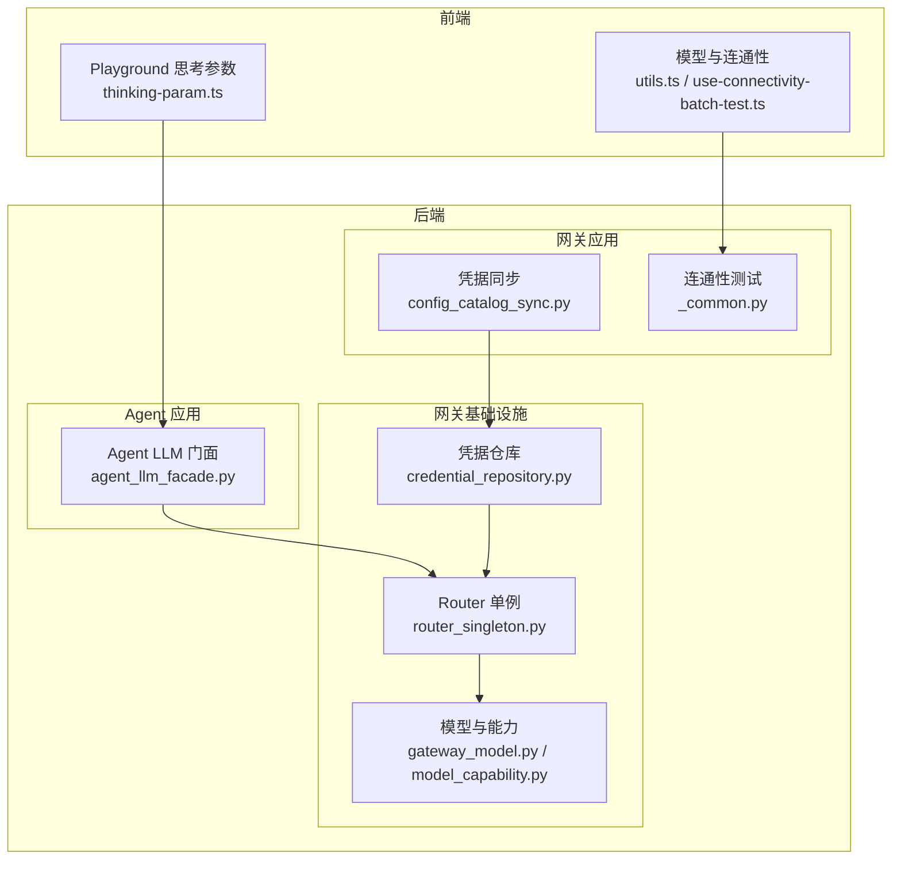
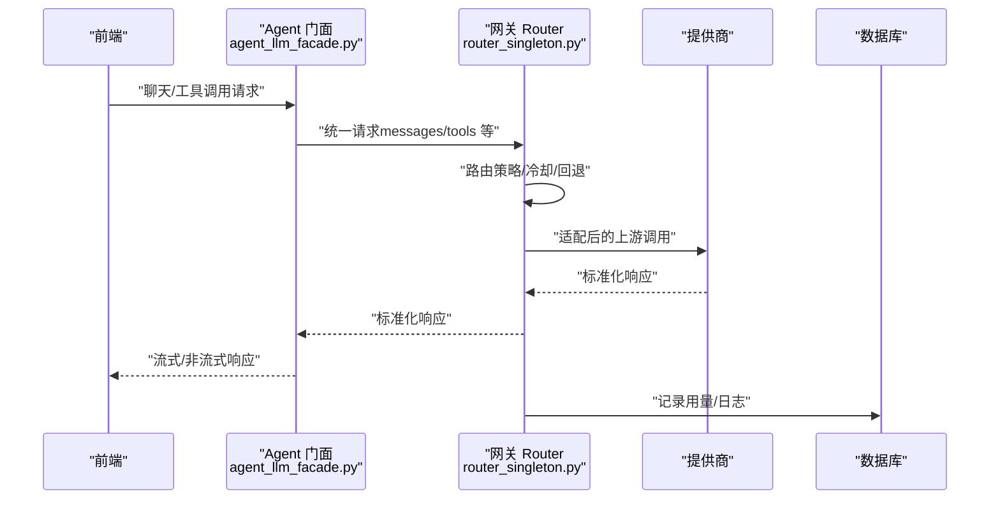
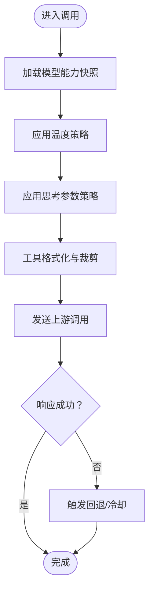
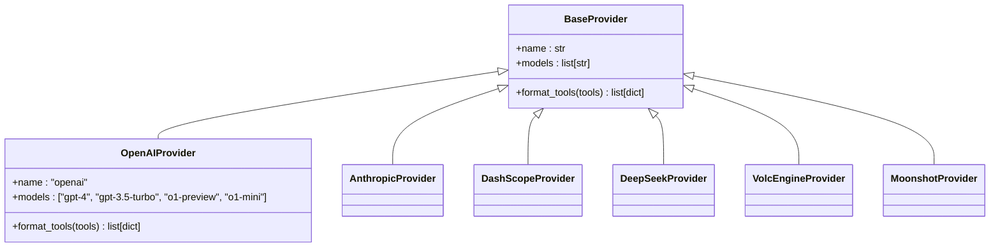
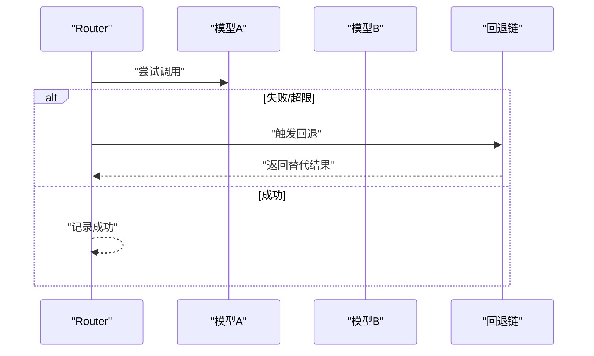
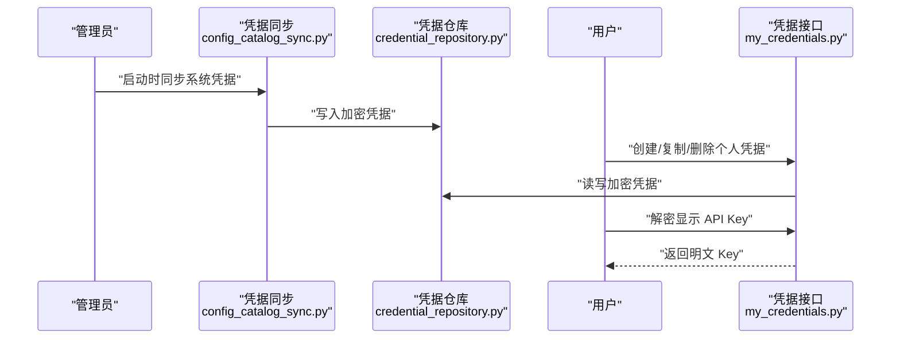
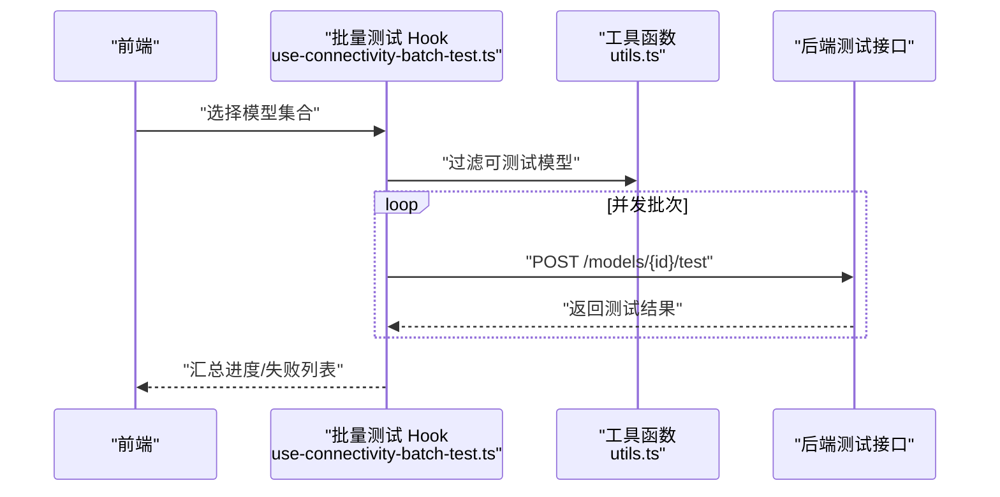
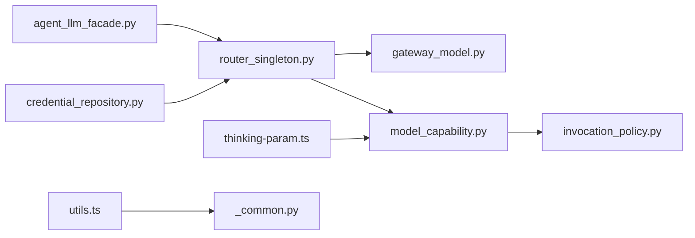

# 多提供商集成

<cite>
**本文引用的文件**
- [LLM_GATEWAY_ARCHITECTURE.md](file://backend/docs/gateway/LLM_GATEWAY_ARCHITECTURE.md)
- [app.toml](file://backend/config/app.toml)
- [router_singleton.py](file://backend/domains/gateway/infrastructure/router_singleton.py)
- [gateway_model.py](file://backend/domains/gateway/infrastructure/models/gateway_model.py)
- [providers.py](file://backend/domains/agent/infrastructure/llm/providers.py)
- [agent_llm_facade.py](file://backend/domains/agent/infrastructure/llm/agent_llm_facade.py)
- [model_capability.py](file://backend/domains/gateway/domain/model_capability.py)
- [invocation_policy.py](file://backend/domains/gateway/domain/policies/invocation_policy.py)
- [credential_repository.py](file://backend/domains/gateway/infrastructure/repositories/credential_repository.py)
- [config_catalog_sync.py](file://backend/domains/gateway/application/config_catalog_sync.py)
- [my_credentials.py](file://backend/domains/gateway/presentation/routers/my_credentials.py)
- [thinking-param.ts](file://frontend/src/features/gateway-shared/thinking-param.ts)
- [thinking-param.test.ts](file://frontend/src/features/gateway-shared/thinking-param.test.ts)
- [utils.ts](file://frontend/src/features/gateway-models/utils.ts)
- [use-connectivity-batch-test.ts](file://frontend/src/features/gateway-models/hooks/use-connectivity-batch-test.ts)
- [test_litellm_models.py](file://backend/scripts/test_litellm_models.py)
- [test_llm_providers.py](file://backend/tests/unit/core/test_llm_providers.py)
- [_common.py](file://backend/domains/gateway/presentation/routers/_common.py)
- [provider_api_base.py](file://backend/domains/gateway/domain/provider_api_base.py)
- [provider_env_catalog.py](file://backend/domains/gateway/domain/provider_env_catalog.py)
- [config.py](file://backend/bootstrap/config.py)
</cite>

## 更新摘要
**所做更改**
- 更新提供商支持范围：新增 OpenAI 作为第6个支持的提供商
- 扩展提供商前缀集合：包含 openai、anthropic、dashscope、deepseek、volcengine、moonshot
- 更新提供商能力矩阵与工具格式化逻辑
- 增强默认 API Base 配置支持
- 完善应用配置示例与最佳实践

## 目录
1. [引言](#引言)
2. [项目结构](#项目结构)
3. [核心组件](#核心组件)
4. [架构总览](#架构总览)
5. [详细组件分析](#详细组件分析)
6. [依赖关系分析](#依赖关系分析)
7. [性能考量](#性能考量)
8. [故障排查指南](#故障排查指南)
9. [结论](#结论)
10. [附录](#附录)

## 引言
本文件面向多大模型（LLM）提供商的统一集成与适配，覆盖 OpenAI、Anthropic、DashScope、VolcEngine、DeepSeek、Moonshot 等主流提供商。系统采用 LiteLLM Router 作为统一抽象层，屏蔽各提供商 API 差异，实现请求格式转换、响应标准化与错误处理策略的统一；通过"提供商能力矩阵"实现模型能力检测、功能支持验证与兼容性处理；通过路由与回退策略实现提供商切换与故障转移；通过凭据加密与轮换机制保障密钥安全。

**更新** 新增 OpenAI 作为第6个支持的提供商，扩展了 LiteLLM 提供商支持范围，更新后的提供商前缀集合包含：openai、anthropic、dashscope、deepseek、volcengine、moonshot。

## 项目结构
后端以"网关域（Gateway）+ 应用域（Agent）+ 基础设施与应用服务"分层组织，前端提供网关模型与凭据管理界面。关键路径如下：
- 网关基础设施：LiteLLM Router 单例、路由构建、部署与回退
- 网关应用：凭据同步、连通性测试、能力解析
- Agent 应用：领域 LLM 客户端门面，通过网关代理调用
- 前端：模型连通性批量测试、思考参数 UI 展示与提示

**图表来源**
- [router_singleton.py:479-587](file://backend/domains/gateway/infrastructure/router_singleton.py#L479-L587)
- [agent_llm_facade.py:1-34](file://backend/domains/agent/infrastructure/llm/agent_llm_facade.py#L1-L34)
- [gateway_model.py:73-104](file://backend/domains/gateway/infrastructure/models/gateway_model.py#L73-L104)
- [model_capability.py:75-99](file://backend/domains/gateway/domain/model_capability.py#L75-L99)
- [credential_repository.py:321-360](file://backend/domains/gateway/infrastructure/repositories/credential_repository.py#L321-L360)
- [config_catalog_sync.py:94-123](file://backend/domains/gateway/application/config_catalog_sync.py#L94-L123)
- [utils.ts:285-335](file://frontend/src/features/gateway-models/utils.ts#L285-L335)
- [use-connectivity-batch-test.ts:1-138](file://frontend/src/features/gateway-models/hooks/use-connectivity-batch-test.ts#L1-L138)
- [thinking-param.ts:1-70](file://frontend/src/features/gateway-shared/thinking-param.ts#L1-L70)

**章节来源**
- [LLM_GATEWAY_ARCHITECTURE.md:37-82](file://backend/docs/gateway/LLM_GATEWAY_ARCHITECTURE.md#L37-L82)

## 核心组件
- LiteLLM Router 单例与路由构建：负责模型部署、路由策略、冷却与回退配置，并支持热重载。
- 提供商抽象与工具格式化：统一提供商识别、模型列表与工具格式化，便于跨提供商兼容。
- 模型能力矩阵：基于标签解析温度策略、思考参数、视觉/图像/视频等能力，支撑请求适配与 UI 提示。
- 凭据管理与轮换：凭据加密存储、系统默认凭据同步、用户凭据创建与解密显示。
- 连通性测试与批量探活：后端测试接口与前端批量测试流程，支持视频生成等特殊探测。

**章节来源**
- [router_singleton.py:479-587](file://backend/domains/gateway/infrastructure/router_singleton.py#L479-L587)
- [providers.py:62-278](file://backend/domains/agent/infrastructure/llm/providers.py#L62-L278)
- [model_capability.py:75-99](file://backend/domains/gateway/domain/model_capability.py#L75-L99)
- [credential_repository.py:321-360](file://backend/domains/gateway/infrastructure/repositories/credential_repository.py#L321-L360)
- [config_catalog_sync.py:94-123](file://backend/domains/gateway/application/config_catalog_sync.py#L94-L123)
- [utils.ts:285-335](file://frontend/src/features/gateway-models/utils.ts#L285-L335)

## 架构总览
系统通过 LiteLLM Router 将上层统一请求路由至具体提供商，结合"提供商能力矩阵"进行请求参数适配与错误处理，同时通过"连通性测试"与"故障转移"保障可用性与稳定性。

**图表来源**
- [agent_llm_facade.py:1-34](file://backend/domains/agent/infrastructure/llm/agent_llm_facade.py#L1-L34)
- [router_singleton.py:479-587](file://backend/domains/gateway/infrastructure/router_singleton.py#L479-L587)

## 详细组件分析

### 统一抽象层与请求适配
- 请求格式转换：通过"提供商能力矩阵"解析模型标签，确定温度策略、思考参数、JSON 模式、视觉/图像/视频等能力，并据此裁剪或注入请求字段。
- 错误处理策略：LiteLLM Router 支持冷却阈值与回退策略，结合内容策略与上下文窗口回退，实现自动降级与故障转移。
- 温度与思考参数适配：针对不同提供商与模型，强制固定温度、在 Anthropic/DeepSeek/DashScope 等场景下裁剪或注入特定字段。

**图表来源**
- [model_capability.py:75-99](file://backend/domains/gateway/domain/model_capability.py#L75-L99)
- [invocation_policy.py:149-187](file://backend/domains/gateway/domain/policies/invocation_policy.py#L149-L187)
- [router_singleton.py:479-587](file://backend/domains/gateway/infrastructure/router_singleton.py#L479-L587)

**章节来源**
- [model_capability.py:75-99](file://backend/domains/gateway/domain/model_capability.py#L75-L99)
- [invocation_policy.py:149-187](file://backend/domains/gateway/domain/policies/invocation_policy.py#L149-L187)
- [router_singleton.py:479-587](file://backend/domains/gateway/infrastructure/router_singleton.py#L479-L587)

### 提供商能力矩阵与工具格式化
- 能力矩阵：从模型标签中提取是否支持工具、推理、JSON 模式、视觉、图像/视频生成等能力，并决定温度默认值与策略。
- 工具格式化：不同提供商对工具输入格式存在差异，统一转换为 OpenAI 兼容或原生格式，确保跨提供商一致性。

**更新** 新增 OpenAIProvider 类，支持通用对话模型和代码专用模型，提供 OpenAI 兼容的工具格式化功能。

**图表来源**
- [providers.py:32-59](file://backend/domains/agent/infrastructure/llm/providers.py#L32-L59)
- [providers.py:62-278](file://backend/domains/agent/infrastructure/llm/providers.py#L62-L278)

**章节来源**
- [providers.py:32-59](file://backend/domains/agent/infrastructure/llm/providers.py#L32-L59)
- [providers.py:62-278](file://backend/domains/agent/infrastructure/llm/providers.py#L62-L278)
- [test_llm_providers.py:129-133](file://backend/tests/unit/core/test_llm_providers.py#L129-L133)

### 提供商切换与故障转移
- 路由策略与回退：Router 支持多种回退类型（通用、内容策略、上下文窗口），并可通过冷却阈值与冷却时间控制失败重试节奏。
- 热重载：支持运行时更新 Router 的 model_list 与回退配置，无需重启服务。
- 自动降级：当上游不可用或触发策略限制时，自动切换到备用提供商或路由。

**图表来源**
- [router_singleton.py:479-587](file://backend/domains/gateway/infrastructure/router_singleton.py#L479-L587)

**章节来源**
- [router_singleton.py:479-587](file://backend/domains/gateway/infrastructure/router_singleton.py#L479-L587)

### 提供商密钥管理与轮换
- 加密存储：凭据在数据库中以加密形式保存，前端仅在"解密显示"时临时解密。
- 系统默认凭据：启动时从环境变量读取并加密写入系统凭据，支持强制与环境同步策略。
- 用户凭据：用户可创建个人凭据，支持复制到团队、激活/停用与删除。
- 解密显示：提供"解密显示 API Key"的受控接口，仅限当前用户查看。

**图表来源**
- [config_catalog_sync.py:94-123](file://backend/domains/gateway/application/config_catalog_sync.py#L94-L123)
- [credential_repository.py:321-360](file://backend/domains/gateway/infrastructure/repositories/credential_repository.py#L321-L360)
- [my_credentials.py:44-80](file://backend/domains/gateway/presentation/routers/my_credentials.py#L44-L80)

**章节来源**
- [config_catalog_sync.py:94-123](file://backend/domains/gateway/application/config_catalog_sync.py#L94-L123)
- [credential_repository.py:321-360](file://backend/domains/gateway/infrastructure/repositories/credential_repository.py#L321-L360)
- [my_credentials.py:44-80](file://backend/domains/gateway/presentation/routers/my_credentials.py#L44-L80)

### 特有功能支持与配置示例
- Anthropic 思考参数：通过"Extended Thinking"等策略在 Anthropic 原生入口正确注入/裁剪字段。
- DashScope 思考参数：通过 enable_thinking/extra_body.enable_thinking 等参数在 OpenAI 兼容入口生效。
- DeepSeek 推理：支持内置推理与 V4 思考参数，UI 提示与能力解析协同。
- Moonshot 视频生成：支持 Moonshot 平台的视频生成能力，配合专门的并发策略。
- 模型目录与 LiteLLM 映射：脚本提供各提供商模型与 LiteLLM 映射关系，便于校验与测试。

**更新** 新增 MoonshotProvider 类，支持 Moonshot 平台的视频生成模型，扩展了视频生成能力支持范围。

**章节来源**
- [thinking-param.ts:1-70](file://frontend/src/features/gateway-shared/thinking-param.ts#L1-L70)
- [thinking-param.test.ts:1-43](file://frontend/src/features/gateway-shared/thinking-param.test.ts#L1-L43)
- [test_litellm_models.py:219-257](file://backend/scripts/test_litellm_models.py#L219-L257)

### 连通性测试与批量探活
- 后端测试接口：支持单模型测试，记录状态、时间与原因。
- 前端批量测试：过滤可测试模型、并发执行、进度回调与失败重试。
- 视频生成探测：对包含视频生成能力的模型单独并发策略。

**图表来源**
- [use-connectivity-batch-test.ts:1-138](file://frontend/src/features/gateway-models/hooks/use-connectivity-batch-test.ts#L1-L138)
- [utils.ts:285-335](file://frontend/src/features/gateway-models/utils.ts#L285-L335)
- [_common.py:169-194](file://backend/domains/gateway/presentation/routers/_common.py#L169-L194)

**章节来源**
- [use-connectivity-batch-test.ts:1-138](file://frontend/src/features/gateway-models/hooks/use-connectivity-batch-test.ts#L1-L138)
- [utils.ts:285-335](file://frontend/src/features/gateway-models/utils.ts#L285-L335)
- [_common.py:169-194](file://backend/domains/gateway/presentation/routers/_common.py#L169-L194)

## 依赖关系分析
- Agent 门面依赖网关代理与桥接归属解析，避免直接导入 LiteLLM 与读取提供商密钥。
- Router 依赖模型目录、凭据与定价信息构建部署列表，并根据路由策略与回退配置工作。
- 能力矩阵与调用策略共同决定请求参数适配与错误处理行为。
- 前端通过模型能力与思考参数解析，驱动 UI 行为与 Playground 提示。

**图表来源**
- [agent_llm_facade.py:1-34](file://backend/domains/agent/infrastructure/llm/agent_llm_facade.py#L1-L34)
- [router_singleton.py:479-587](file://backend/domains/gateway/infrastructure/router_singleton.py#L479-L587)
- [gateway_model.py:73-104](file://backend/domains/gateway/infrastructure/models/gateway_model.py#L73-L104)
- [model_capability.py:75-99](file://backend/domains/gateway/domain/model_capability.py#L75-L99)
- [invocation_policy.py:149-187](file://backend/domains/gateway/domain/policies/invocation_policy.py#L149-L187)
- [credential_repository.py:321-360](file://backend/domains/gateway/infrastructure/repositories/credential_repository.py#L321-L360)
- [thinking-param.ts:1-70](file://frontend/src/features/gateway-shared/thinking-param.ts#L1-L70)
- [utils.ts:285-335](file://frontend/src/features/gateway-models/utils.ts#L285-L335)
- [_common.py:169-194](file://backend/domains/gateway/presentation/routers/_common.py#L169-L194)

## 性能考量
- Router 并发与冷却：通过 num_retries、allowed_fails、cooldown_time 控制失败重试与冷却节奏，避免雪崩效应。
- 热重载更新：仅更新 model_list 与回退配置，减少停机时间。
- 批量连通性测试并发：区分普通与视频生成探测的并发度，平衡吞吐与资源占用。
- 工具格式化与字段裁剪：减少无效字段传输，降低上游调用开销。

## 故障排查指南
- 连通性测试失败：检查模型 last_test_status/last_test_reason，定位失败原因；对失败模型执行重试。
- 思考参数不生效：确认模型能力标签与 API Flavor（OpenAI/Anthropic）匹配；参考前端提示与能力解析。
- 温度过高/过低：依据能力矩阵的温度策略，固定或裁剪 temperature；避免客户端非法值。
- 凭据问题：确认凭据加密存储、系统默认凭据同步状态与用户凭据激活状态；必要时重新创建或轮换。

**章节来源**
- [utils.ts:285-335](file://frontend/src/features/gateway-models/utils.ts#L285-L335)
- [invocation_policy.py:149-187](file://backend/domains/gateway/domain/policies/invocation_policy.py#L149-L187)
- [config_catalog_sync.py:94-123](file://backend/domains/gateway/application/config_catalog_sync.py#L94-L123)

## 结论
通过 LiteLLM Router 的统一抽象、提供商能力矩阵的参数适配、完善的故障转移与连通性测试机制，以及加密与轮换的安全凭据管理，系统实现了对多提供商的无缝集成与稳定运行。新增 OpenAI 作为第6个支持的提供商，进一步扩展了系统的兼容性和实用性。建议在生产中持续运行连通性测试、定期轮换密钥、监控 Router 冷却与回退行为，并结合前端能力解析优化用户体验。

## 附录

### 配置示例与最佳实践
- 应用配置（示例键位）：OpenAI、DeepSeek、Anthropic、DashScope、VolcEngine、Moonshot 的 API Key 与 Base URL；本地模型 Ollama URL。
- 最佳实践：
  - 为每个提供商维护独立凭据，优先使用系统默认凭据，再按需创建用户凭据。
  - 启用连通性测试并定期巡检，对失败模型设置回退链。
  - 使用能力矩阵与调用策略，避免向不支持的字段传递参数。
  - 对视频生成等高耗时能力单独并发策略，避免阻塞主流程。

**更新** 新增 Moonshot 平台配置示例，支持 Moonshot 平台的视频生成模型配置。

**章节来源**
- [app.toml:29-68](file://backend/config/app.toml#L29-L68)
- [provider_api_base.py:9-16](file://backend/domains/gateway/domain/provider_api_base.py#L9-L16)
- [provider_env_catalog.py:23-37](file://backend/domains/gateway/domain/provider_env_catalog.py#L23-L37)
- [config.py:105-116](file://backend/bootstrap/config.py#L105-L116)

### 提供商支持矩阵
| 提供商 | 前缀 | 支持模型数量 | 特有功能 |
|--------|------|-------------|----------|
| OpenAI | openai | 10+ | GPT系列、o1系列、工具调用 |
| Anthropic | anthropic | 5+ | Claude系列、思考参数 |
| DashScope | dashscope | 15+ | Qwen系列、视觉理解 |
| DeepSeek | deepseek | 3+ | DeepSeek系列、推理增强 |
| VolcEngine | volcengine | 2+ | Doubao系列、火山引擎生态 |
| Moonshot | moonshot | 1+ | 视频生成、Moonshot平台 |

**章节来源**
- [providers.py:246-254](file://backend/domains/agent/infrastructure/llm/providers.py#L246-L254)
- [test_llm_providers.py:142-144](file://backend/tests/unit/core/test_llm_providers.py#L142-L144)