# 成本控制与配额

<cite>
**本文引用的文件**
- [pricing_budget_cost.py](file://backend/domains/gateway/application/pricing/pricing_budget_cost.py)
- [non_token_cost.py](file://backend/domains/gateway/domain/policies/non_token_cost.py)
- [budget_repository.py](file://backend/domains/gateway/infrastructure/repositories/budget_repository.py)
- [budget.py](file://backend/domains/gateway/infrastructure/models/budget.py)
- [quota_plan_service.py](file://backend/domains/gateway/application/quota_plan_service.py)
- [quota_plan.py](file://backend/domains/gateway/domain/quota_plan.py)
- [quota_rule_assembler.py](file://backend/domains/gateway/application/management/quota_rule_assembler.py)
- [quota_rule_cache.py](file://backend/domains/gateway/application/management/quota_rule_cache.py)
- [quota_rule_read_mappers.py](file://backend/domains/gateway/application/management/quota_rule_read_mappers.py)
- [quota_rule_read_model.py](file://backend/domains/gateway/application/management/quota_rule_read_model.py)
- [quota_rule_writes.py](file://backend/domains/gateway/application/management/write_modules/quota_rule_writes.py)
- [quota_usage_snapshot.py](file://backend/domains/gateway/application/management/quota_usage_snapshot.py)
- [quota_rule_visibility.py](file://backend/domains/gateway/domain/policies/quota_rule_visibility.py)
- [quota_rule_response.py](file://backend/domains/gateway/presentation/quota_rule_response.py)
- [quota_rules.py](file://backend/domains/gateway/presentation/routers/quota_rules.py)
- [user_quota.py](file://backend/domains/agent/domain/entities/user_quota.py)
- [user_quota_repository.py](file://backend/domains/identity/infrastructure/repositories/user_quota_repository.py)
- [proxy_non_chat_pipeline.py](file://backend/domains/gateway/application/proxy_non_chat_pipeline.py)
- [cost_calculation.py](file://backend/domains/gateway/infrastructure/callbacks/cost_calculation.py)
- [upstream_cost_resolver.py](file://backend/domains/gateway/application/pricing/upstream_cost_resolver.py)
- [test_pricing_budget_cost.py](file://backend/tests/unit/gateway/test_pricing_budget_cost.py)
- [test_non_token_cost.py](file://backend/tests/unit/gateway/domain/test_non_token_cost.py)
- [test_gateway_budgets_api.py](file://backend/tests/integration/api/test_gateway_budgets_api.py)
- [test_mixins.py](file://backend/tests/unit/libs/orm/test_mixins.py)
- [common.py](file://backend/domains/gateway/presentation/schemas/common.py)
- [proxy_policy.py](file://backend/domains/gateway/domain/proxy_policy.py)
- [budget_service.py](file://backend/domains/gateway/application/budget_service.py)
- [test_gateway_budget_management.py](file://backend/tests/unit/gateway/test_gateway_budget_management.py)
- [guardrail_policy.py](file://backend/domains/gateway/domain/guardrail_policy.py)
- [errors.py](file://backend/domains/gateway/domain/errors.py)
- [test_quota_exhausted_error_unified.py](file://backend/tests/unit/gateway/test_quota_exhausted_error_unified.py)
- [test_quota_exhausted_http_mapping.py](file://backend/tests/unit/gateway/test_quota_exhausted_http_mapping.py)
- [reads.py](file://backend/domains/gateway/application/management/reads.py)
- [types.py](file://backend/domains/gateway/domain/types.py)
- [credential_repository.py](file://backend/domains/gateway/infrastructure/repositories/credential_repository.py)
- [quota-batch-wizard.tsx](file://frontend/src/features/gateway-budget/quota-batch-wizard.tsx)
- [quota-batch-drawer.tsx](file://frontend/src/features/gateway-budget/quota-batch-drawer.tsx)
- [quota-batch-form.test.ts](file://frontend/src/features/gateway-budget/quota-batch-form.test.ts)
- [quota-batch-from-rule.ts](file://frontend/src/features/gateway-budget/quota-batch-from-rule.ts)
- [quota-batch-templates.ts](file://frontend/src/features/gateway-budget/quota-batch-templates.ts)
- [use-quota-center.ts](file://frontend/src/features/gateway-budget/use-quota-center.ts)
- [quota-center-workspace.tsx](file://frontend/src/features/gateway-budget/quota-center-workspace.tsx)
- [quota-center-table.tsx](file://frontend/src/features/gateway-budget/quota-center-table.tsx)
- [budgets.tsx](file://frontend/src/pages/gateway/budgets.tsx)
- [quota-overview-cards.tsx](file://frontend/src/features/gateway-budget/quota-overview-cards.tsx)
- [quota-rule-utils.ts](file://frontend/src/features/gateway-budget/quota-rule-utils.ts)
- [types.ts](file://frontend/src/features/gateway-credentials/types.ts)
- [credential-scope-display.tsx](file://frontend/src/features/gateway-credentials/credential-scope-display.tsx)
- [credential-scope-labels.ts](file://frontend/src/features/gateway-credentials/credential-scope-labels.ts)
- [credential-scope-display.test.ts](file://frontend/src/features/gateway-credentials/credential-scope-display.test.ts)
- [provider-schemas.ts](file://frontend/src/features/gateway-credentials/provider-schemas.ts)
- [constants.ts](file://frontend/src/features/gateway-credentials/constants.ts)
- [personal-credential-budget-inline.tsx](file://frontend/src/features/gateway-budget/personal-credential-budget-inline.tsx)
- [quota-rules.ts](file://frontend/src/api/gateway/quota-rules.ts)
- [use-gateway-quota-rules.ts](file://frontend/src/features/gateway-budget/use-gateway-quota-rules.ts)
- [use-gateway-virtual-keys.ts](file://frontend/src/features/gateway-keys/use-gateway-virtual-keys.ts)
- [use-gateway-team-members.ts](file://frontend/src/features/gateway-teams/use-gateway-team-members.ts)
- [20260608_provider_credentials_created_by.py](file://backend/alembic/versions/20260608_provider_credentials_created_by.py)
- [credential-api-scope.ts](file://backend/domains/gateway/domain/policies/credential_api_scope.py)
- [credential-scope-policy.py](file://backend/domains/gateway/domain/policies/credential_scope_policy.py)
- [credential-permissions.ts](file://frontend/src/features/gateway-credentials/credential-permissions.ts)
- [credential-normalize.ts](file://frontend/src/api/gateway/credential-normalize.ts)
- [credentials.ts](file://frontend/src/api/gateway/credentials.ts)
- [_base.py](file://backend/domains/gateway/application/management/write_modules/_base.py)
- [test_quota_rule_batch_write.py](file://backend/tests/unit/gateway/test_quota_rule_batch_write.py)
</cite>

## 更新摘要
**所做更改**
- 新增配额规则写入基类：在_write_modules目录下新增_base.py文件，提供统一的配额规则写入基础设施
- 改进批量写入操作：优化QuotaRuleWritesMixin的批量处理逻辑，提升平台层批量upsert性能
- 增强演员作用域列表读取：改进list_gateway_team_memberships方法的团队成员查询机制
- 引入上游配额缓存失效机制：新增_upstream_quota_rule_list_cache失效方法，支持跨团队缓存同步
- 增强实体变更时的配额规则聚合：完善_write_modules/_base.py中的缓存失效逻辑，确保实体变更时的缓存一致性

## 目录
1. [引言](#引言)
2. [项目结构](#项目结构)
3. [核心组件](#核心组件)
4. [架构总览](#架构总览)
5. [详细组件分析](#详细组件分析)
6. [依赖关系分析](#依赖关系分析)
7. [性能考量](#性能考量)
8. [故障排查指南](#故障排查指南)
9. [结论](#结论)
10. [附录](#附录)

## 引言
本文件面向成本控制与配额管理主题，系统化梳理后端在"网关域"中的成本计算引擎、预算管理、配额计划与使用追踪、实时计费与批量结算、成本可视化与报表、成本优化策略、异常检测与告警、以及多租户成本隔离与共享机制。文档以仓库中现有实现为依据，结合测试用例与模型定义，给出可操作的架构说明与最佳实践。

**更新** 本次更新重点关注配额管理功能的基础设施重构。新增的_write_modules/_base.py文件为配额规则写入操作提供了统一的基类支持，改进了批量写入操作的性能和可靠性，引入了上游配额缓存失效机制以确保跨团队缓存的一致性，并增强了实体变更时的配额规则聚合逻辑。

## 项目结构
围绕成本与配额的关键目录与文件如下：
- 应用层（application）
  - 定价与预算：pricing_budget_cost.py、upstream_cost_resolver.py、budget_service.py
  - 配额计划：quota_plan_service.py、quota_plan.py
  - 配额规则管理：quota_rule_assembler.py、quota_rule_cache.py、quota_rule_read_mappers.py、quota_rule_read_model.py、quota_rule_writes.py、quota_usage_snapshot.py、quota_rule_visibility.py、quota_rule_response.py、quota_rules.py
  - **新增** 配额规则写入基类：_base.py（提供统一的写入基础设施）
  - **新增** 凭证管理：GatewayManagementReadService（支持三种凭证类型）
- 领域层（domain）
  - 非Token成本策略：non_token_cost.py
  - 代理策略：proxy_policy.py
  - 安全守卫策略：guardrail_policy.py
  - 配额计划实体：quota_plan.py
  - 错误定义：errors.py（包含统一的配额耗尽错误体系）
  - **新增** 凭证作用域策略：credential_api_scope、credential_scope_policy
  - **新增** 凭证作用域枚举：CredentialScope（包含SYSTEM、TEAM、USER）
- 基础设施层（infrastructure）
  - 预算模型与仓储：budget.py、budget_repository.py
  - 成本回调：cost_calculation.py
  - **新增** 凭证仓储：ProviderCredentialRepository（支持个人BYOK）
  - **新增** 数据库迁移：20260608_provider_credentials_created_by.py（支持created_by_user_id字段）
- 测试（tests）
  - 预算成本、非Token成本、预算API、预算管理、配额耗尽错误等测试用例
  - **新增** 配额规则批量写入测试：test_quota_rule_batch_write.py
  - **新增** 凭证作用域策略测试：credential_api_scope、credential_scope_policy
- 前端（frontend）
  - 配额批量向导系统：quota-batch-wizard.tsx（新增）、quota-batch-drawer.tsx（迁移前）
  - 配额模板系统：quota-batch-templates.ts
  - 表单转换逻辑：quota-batch-from-rule.ts
  - 配额中心工具：use-quota-center.ts（增强凭证显示逻辑，支持system scope）
  - 预算管理界面：credential-budget-section.tsx、budget-usage-card.tsx、quota-center-workspace.tsx、budgets.tsx
  - **新增** 凭证作用域显示：credential-scope-display.tsx
  - **新增** 个人凭证预算：personal-credential-budget-inline.tsx
  - **新增** 凭证类型定义：types.ts（支持个人BYOK）
  - **新增** API类型定义：quota-rules.ts
  - **新增** 凭证权限控制：credential-permissions.ts
  - **新增** 凭证规范化：credential-normalize.ts

```mermaid
graph TB
subgraph "应用层"
A1["定价与预算<br/>pricing_budget_cost.py"]
A2["上游成本解析<br/>upstream_cost_resolver.py"]
A3["预算服务<br/>budget_service.py"]
A4["配额计划服务<br/>quota_plan_service.py"]
A5["配额规则管理<br/>quota_rule_*"]
A6["配额规则写入基类<br/>_base.py<br/>统一写入基础设施"]
A7["凭证管理<br/>GatewayManagementReadService<br/>支持三种凭证类型"]
end
subgraph "领域层"
D1["非Token成本策略<br/>non_token_cost.py"]
D2["代理策略<br/>proxy_policy.py"]
D3["安全守卫策略<br/>guardrail_policy.py"]
D4["配额计划实体<br/>quota_plan.py"]
D5["错误定义<br/>errors.py<br/>统一错误体系"]
D6["凭证作用域策略<br/>credential_api_scope<br/>credential_scope_policy"]
D7["凭证作用域枚举<br/>CredentialScope<br/>SYSTEM/TEAM/USER"]
end
subgraph "基础设施层"
I1["预算模型/仓储<br/>budget.py / budget_repository.py"]
I2["成本回调<br/>cost_calculation.py"]
I3["配额规则缓存<br/>quota_rule_cache.py<br/>L1 + Redis + 版本号失效"]
I4["凭证仓储<br/>ProviderCredentialRepository<br/>支持个人BYOK"]
I5["数据库迁移<br/>20260608_provider_credentials_created_by.py<br/>支持created_by_user_id"]
end
subgraph "测试"
T1["预算成本测试<br/>test_pricing_budget_cost.py"]
T2["非Token成本测试<br/>test_non_token_cost.py"]
T3["预算API集成测试<br/>test_gateway_budgets_api.py"]
T4["预算管理测试<br/>test_gateway_budget_management.py"]
T5["配额耗尽错误测试<br/>test_quota_exhausted_error_unified.py"]
T6["HTTP映射测试<br/>test_quota_exhausted_http_mapping.py"]
T7["ORM Mixin测试<br/>test_mixins.py"]
T8["配额规则批量写入测试<br/>test_quota_rule_batch_write.py<br/>跨团队缓存失效验证"]
T9["凭证作用域策略测试<br/>credential_api_scope测试"]
T10["凭证作用域策略测试<br/>credential_scope_policy测试"]
end
subgraph "前端"
F1["配额批量向导<br/>quota-batch-wizard.tsx<br/>1226行TypeScript代码"]
F2["配额模板系统<br/>quota-batch-templates.ts"]
F3["表单转换逻辑<br/>quota-batch-from-rule.ts"]
F4["配额中心工具<br/>use-quota-center.ts<br/>简化凭证显示逻辑<br/>17行直接映射策略"]
F5["凭据预算组件<br/>credential-budget-section.tsx"]
F6["预算使用卡片<br/>budget-usage-card.tsx"]
F7["配额中心工作区<br/>quota-center-workspace.tsx"]
F8["预算页面<br/>budgets.tsx"]
F9["配额概览卡片<br/>quota-overview-cards.tsx<br/>数值类型验证修复"]
F10["凭证范围显示<br/>credential-scope-display.tsx<br/>支持个人凭据标识"]
F11["个人凭证预算<br/>personal-credential-budget-inline.tsx<br/>直接显示管理"]
F12["凭证类型定义<br/>types.ts<br/>支持个人BYOK"]
F13["API类型定义<br/>quota-rules.ts<br/>配额规则API类型"]
F14["凭证权限控制<br/>credential-permissions.ts<br/>权限验证与策略"]
F15["凭证规范化<br/>credential-normalize.ts<br/>数据标准化处理"]
end
A1 --> I1
A2 --> I2
A3 --> I1
A4 --> D4
A5 --> D4
A5 --> I3
A6 --> I4
A7 --> I4
D1 --> A1
D2 --> A3
D3 --> A3
D5 --> A5
D6 --> A7
D7 --> A7
I1 --> A1
I2 --> A1
I3 --> A5
I4 --> A7
T1 --> A1
T2 --> D1
T3 --> I1
T4 --> A3
T5 --> D5
T6 --> D5
T7 --> I1
T8 --> A6
T9 --> D6
T10 --> D7
F1 --> F2
F1 --> F3
F1 --> F4
F5 --> F6
F6 --> F7
F7 --> F8
F9 --> F6
F10 --> F5
F11 --> F6
F12 --> F10
F13 --> F4
F14 --> F10
F15 --> F10
```

**图表来源**
- [pricing_budget_cost.py](file://backend/domains/gateway/application/pricing/pricing_budget_cost.py)
- [upstream_cost_resolver.py](file://backend/domains/gateway/application/pricing/upstream_cost_resolver.py)
- [budget_service.py](file://backend/domains/gateway/application/budget_service.py)
- [quota_plan_service.py](file://backend/domains/gateway/application/quota_plan_service.py)
- [quota_rule_assembler.py](file://backend/domains/gateway/application/management/quota_rule_assembler.py)
- [quota_rule_cache.py](file://backend/domains/gateway/application/management/quota_rule_cache.py)
- [_base.py](file://backend/domains/gateway/application/management/write_modules/_base.py)
- [quota_rule_writes.py](file://backend/domains/gateway/application/management/write_modules/quota_rule_writes.py)
- [non_token_cost.py](file://backend/domains/gateway/domain/policies/non_token_cost.py)
- [proxy_policy.py](file://backend/domains/gateway/domain/proxy_policy.py)
- [guardrail_policy.py](file://backend/domains/gateway/domain/guardrail_policy.py)
- [quota_plan.py](file://backend/domains/gateway/domain/quota_plan.py)
- [errors.py](file://backend/domains/gateway/domain/errors.py)
- [credential_api_scope.py](file://backend/domains/gateway/domain/policies/credential_api_scope.py)
- [credential_scope_policy.py](file://backend/domains/gateway/domain/policies/credential_scope_policy.py)
- [types.py](file://backend/domains/gateway/domain/types.py)
- [budget.py](file://backend/domains/gateway/infrastructure/models/budget.py)
- [budget_repository.py](file://backend/domains/gateway/infrastructure/repositories/budget_repository.py)
- [cost_calculation.py](file://backend/domains/gateway/infrastructure/callbacks/cost_calculation.py)
- [credential_repository.py](file://backend/domains/gateway/infrastructure/repositories/credential_repository.py)
- [reads.py](file://backend/domains/gateway/application/management/reads.py)
- [20260608_provider_credentials_created_by.py](file://backend/alembic/versions/20260608_provider_credentials_created_by.py)
- [quota-rules.ts](file://frontend/src/api/gateway/quota-rules.ts)
- [credential-permissions.ts](file://frontend/src/features/gateway-credentials/credential-permissions.ts)
- [credential-normalize.ts](file://frontend/src/api/gateway/credential-normalize.ts)
- [credentials.ts](file://frontend/src/api/gateway/credentials.ts)

**章节来源**
- [pricing_budget_cost.py](file://backend/domains/gateway/application/pricing/pricing_budget_cost.py)
- [non_token_cost.py](file://backend/domains/gateway/domain/policies/non_token_cost.py)
- [budget_repository.py](file://backend/domains/gateway/infrastructure/repositories/budget_repository.py)
- [budget.py](file://backend/domains/gateway/infrastructure/models/budget.py)
- [quota_plan_service.py](file://backend/domains/gateway/application/quota_plan_service.py)
- [quota_plan.py](file://backend/domains/gateway/domain/quota_plan.py)
- [quota_rule_assembler.py](file://backend/domains/gateway/application/management/quota_rule_assembler.py)
- [quota_rule_cache.py](file://backend/domains/gateway/application/management/quota_rule_cache.py)
- [quota_rule_read_mappers.py](file://backend/domains/gateway/application/management/quota_rule_read_mappers.py)
- [quota_rule_read_model.py](file://backend/domains/gateway/application/management/quota_rule_read_model.py)
- [quota_rule_writes.py](file://backend/domains/gateway/application/management/write_modules/quota_rule_writes.py)
- [quota_usage_snapshot.py](file://backend/domains/gateway/application/management/quota_usage_snapshot.py)
- [quota_rule_visibility.py](file://backend/domains/gateway/domain/policies/quota_rule_visibility.py)
- [quota_rule_response.py](file://backend/domains/gateway/presentation/quota_rule_response.py)
- [quota_rules.py](file://backend/domains/gateway/presentation/routers/quota_rules.py)
- [user_quota.py](file://backend/domains/agent/domain/entities/user_quota.py)
- [user_quota_repository.py](file://backend/domains/identity/infrastructure/repositories/user_quota_repository.py)
- [proxy_non_chat_pipeline.py](file://backend/domains/gateway/application/proxy_non_chat_pipeline.py)
- [cost_calculation.py](file://backend/domains/gateway/infrastructure/callbacks/cost_calculation.py)
- [upstream_cost_resolver.py](file://backend/domains/gateway/application/pricing/upstream_cost_resolver.py)
- [test_pricing_budget_cost.py](file://backend/tests/unit/gateway/test_pricing_budget_cost.py)
- [test_non_token_cost.py](file://backend/tests/unit/gateway/domain/test_non_token_cost.py)
- [test_gateway_budgets_api.py](file://backend/tests/integration/api/test_gateway_budgets_api.py)
- [test_mixins.py](file://backend/tests/unit/libs/orm/test_mixins.py)
- [common.py](file://backend/domains/gateway/presentation/schemas/common.py)
- [proxy_policy.py](file://backend/domains/gateway/domain/proxy_policy.py)
- [budget_service.py](file://backend/domains/gateway/application/budget_service.py)
- [test_gateway_budget_management.py](file://backend/tests/unit/gateway/test_gateway_budget_management.py)
- [guardrail_policy.py](file://backend/domains/gateway/domain/guardrail_policy.py)
- [errors.py](file://backend/domains/gateway/domain/errors.py)
- [test_quota_exhausted_error_unified.py](file://backend/tests/unit/gateway/test_quota_exhausted_error_unified.py)
- [test_quota_exhausted_http_mapping.py](file://backend/tests/unit/gateway/test_quota_exhausted_http_mapping.py)
- [reads.py](file://backend/domains/gateway/application/management/reads.py)
- [types.py](file://backend/domains/gateway/domain/types.py)
- [credential_repository.py](file://backend/domains/gateway/infrastructure/repositories/credential_repository.py)
- [quota-batch-wizard.tsx](file://frontend/src/features/gateway-budget/quota-batch-wizard.tsx)
- [quota-batch-templates.ts](file://frontend/src/features/gateway-budget/quota-batch-templates.ts)
- [quota-batch-from-rule.ts](file://frontend/src/features/gateway-budget/quota-batch-from-rule.ts)
- [use-quota-center.ts](file://frontend/src/features/gateway-budget/use-quota-center.ts)
- [credential-budget-section.tsx](file://frontend/src/features/gateway-budget/credential-budget-section.tsx)
- [budget-usage-card.tsx](file://frontend/src/features/gateway-budget/budget-usage-card.tsx)
- [quota-center-workspace.tsx](file://frontend/src/features/gateway-budget/quota-center-workspace.tsx)
- [budgets.tsx](file://frontend/src/pages/gateway/budgets.tsx)
- [quota-overview-cards.tsx](file://frontend/src/features/gateway-budget/quota-overview-cards.tsx)
- [types.ts](file://frontend/src/features/gateway-credentials/types.ts)
- [credential-scope-display.tsx](file://frontend/src/features/gateway-credentials/credential-scope-display.tsx)
- [personal-credential-budget-inline.tsx](file://frontend/src/features/gateway-budget/personal-credential-budget-inline.tsx)
- [quota-rules.ts](file://frontend/src/api/gateway/quota-rules.ts)
- [credential-permissions.ts](file://frontend/src/features/gateway-credentials/credential-permissions.ts)
- [credential-normalize.ts](file://frontend/src/api/gateway/credential-normalize.ts)
- [credentials.ts](file://frontend/src/api/gateway/credentials.ts)
- [_base.py](file://backend/domains/gateway/application/management/write_modules/_base.py)
- [test_quota_rule_batch_write.py](file://backend/tests/unit/gateway/test_quota_rule_batch_write.py)

## 核心组件
- 成本计算引擎
  - 非Token成本策略：根据能力类型与响应数据估算图像生成、音频合成等非Token成本。
  - 上游成本解析：从上游返回的额外信息中提取成本字段，并决定是否采用包量/按需计费。
- 预算管理系统
  - 预算模型与仓储：支持按目标（个人/团队/凭证/租户）、周期、模型名、凭证等维度组合查询与匹配。
  - 预算API：提供预算列表、更新、删除等接口。
  - **新增** 跨团队预算隔离：通过tenant_id实现成员总量护栏的团队隔离，防止跨团队预算访问。
- 配额计划与规则
  - 配额计划服务：封装配额计划的创建、重置策略、使用快照等。
  - 规则装配与缓存：规则读写、映射、可见性控制、响应模型与路由。
  - **新增** 统一错误处理：引入QuotaExhaustedError基础类及其三种专门化错误类型，提供一致的错误处理体验。
  - **新增** 简化缓存层次：配额规则缓存采用L1内存缓存 + Redis缓存的两级结构，支持版本号失效机制。
  - **新增** 配额规则写入基类：_base.py提供统一的写入基础设施，支持批量写入和缓存失效。
- **新增** 个人BYOK凭证支持
  - 凭证类型扩展：GatewayManagementReadService现在支持团队、个人BYOK、系统三种凭证类型。
  - 凭证API作用域：credential_api_scope函数正确处理个人BYOK凭证的API作用域映射。
  - 凭证仓储：ProviderCredentialRepository支持个人BYOK凭证的查询和管理。
  - **新增** 凭证作用域策略：credential_scope_policy提供凭证作用域的权限控制和策略验证。
- **新增** 增强的UI组件
  - 凭证范围指示器：credential-scope-display组件显示个人、团队、系统凭据的范围标识。
  - 提供者信息显示：支持不同凭证类型的提供者信息展示。
  - 个人凭证预算管理：personal-credential-budget-inline组件直接显示个人凭证的预算状态。
- **新增** 前端配额批量向导系统
  - 三步式向导界面：从规则模板选择到详细配置再到批量应用的完整流程。
  - 实时规则计数估计：动态计算批量应用可能影响的配额规则数量。
  - 时间窗口下拉选择：提供标准化的时间窗口选项（秒、分钟、小时、天、周、月、年）。
  - 编辑模式直接导航：支持从现有配额规则直接进入编辑模式。
  - 配额模板系统：预定义的配额模板库，支持快速应用常见配置。
  - 表单转换逻辑：将配额规则实体转换为表单值，支持双向数据绑定。
- **新增** 数值类型验证防御性编程
  - 在quota-overview-cards组件中增加typeof检查，防止NaN累积错误。
  - 确保totalUsd、totalTokens、totalRequests变量的数值类型安全。
  - 提升预算管理界面在处理异常数据时的稳定性。
- **新增** 简化的配额中心凭证显示逻辑
  - **更新** use-quota-center.ts：将复杂的43行条件检查简化为17行直接映射策略
  - **更新** 移除了冗余的条件判断，提升了代码可读性和执行性能
  - **更新** 保持了对系统级凭据（scope='system'）的完整向后兼容性支持
  - **更新** 增强了legacy凭证标识的处理逻辑，确保历史遗留凭证的正确显示
  - **更新** 成员自助模式下的凭证过滤：区分当前用户创建、历史遗留（NULL）和undefined创建者ID三种状态
  - **更新** 系统级凭据（scope='system'）：直接显示，无需创建者ID检查（后端已做可见性过滤）
  - **更新** 团队凭据：显示本人创建的凭证，以及创建者ID为null或undefined的历史遗留凭证
  - **更新** 管理员模式：显示所有凭证，并标记创建者ID为null或undefined的legacy凭证
  - **更新** 凭证权限控制：credential-permissions.ts提供凭证权限验证和策略控制
  - **更新** 凭证规范化：credential-normalize.ts确保凭证数据的标准化处理
- 实时计费与批量结算
  - 成本回调：在请求链路中注入成本计算与记录点。
  - 预留释放：在异常时释放预算预留与配额预留。
- 多租户成本隔离与共享
  - 租户作用域模型与Mixin：确保模型具备租户ID列，预算与配额规则按租户隔离。
  - **新增** 跨团队预算隔离：在预算查询中仅对用户维度应用团队隔离，其他维度保持租户无关。
  - **新增** 凭证作用域隔离：个人BYOK凭证按用户隔离，团队凭证按租户隔离，系统凭证全局可用。
- 成本可视化与报表
  - 使用统计与趋势：通过使用快照与规则聚合生成报表基础数据。
- 成本优化与异常检测
  - 优化策略：模型选择、参数调整、使用模式改进。
  - 异常检测与告警：基于阈值与规则触发预警。
- **新增** 安全守卫机制
  - PII守卫策略：通过全局开关和虚拟Key级别的守卫控制实现数据保护。
  - 预算目标验证：确保预算操作符合团队边界和权限要求。
- **新增** 凭证权限控制与规范化
  - 凭证权限验证：credential-permissions.ts提供凭证权限的验证和策略控制
  - 凭证数据规范化：credential-normalize.ts确保凭证数据格式和内容的标准化
  - 凭证作用域映射：credentials.ts定义凭证作用域的数据结构和验证规则
- **新增** 配额规则写入基类与缓存失效机制
  - **更新** _base.py：提供统一的配额规则写入基础设施，支持批量写入和缓存失效
  - **更新** 改进批量写入操作：优化QuotaRuleWritesMixin的批量处理逻辑，提升平台层批量upsert性能
  - **更新** 增强演员作用域列表读取：改进list_gateway_team_memberships方法的团队成员查询机制
  - **更新** 引入上游配额缓存失效机制：新增_upstream_quota_rule_list_cache失效方法，支持跨团队缓存同步
  - **更新** 增强实体变更时的配额规则聚合：完善_write_modules/_base.py中的缓存失效逻辑，确保实体变更时的缓存一致性

**章节来源**
- [non_token_cost.py](file://backend/domains/gateway/domain/policies/non_token_cost.py)
- [pricing_budget_cost.py](file://backend/domains/gateway/application/pricing/pricing_budget_cost.py)
- [budget.py](file://backend/domains/gateway/infrastructure/models/budget.py)
- [budget_repository.py](file://backend/domains/gateway/infrastructure/repositories/budget_repository.py)
- [quota_plan_service.py](file://backend/domains/gateway/application/quota_plan_service.py)
- [quota_rule_assembler.py](file://backend/domains/gateway/application/management/quota_rule_assembler.py)
- [quota_rule_cache.py](file://backend/domains/gateway/application/management/quota_rule_cache.py)
- [quota_rule_read_mappers.py](file://backend/domains/gateway/application/management/quota_rule_read_mappers.py)
- [quota_rule_read_model.py](file://backend/domains/gateway/application/management/quota_rule_read_model.py)
- [quota_rule_writes.py](file://backend/domains/gateway/application/management/write_modules/quota_rule_writes.py)
- [quota_usage_snapshot.py](file://backend/domains/gateway/application/management/quota_usage_snapshot.py)
- [quota_rule_visibility.py](file://backend/domains/gateway/domain/policies/quota_rule_visibility.py)
- [quota_rule_response.py](file://backend/domains/gateway/presentation/quota_rule_response.py)
- [quota_rules.py](file://backend/domains/gateway/presentation/routers/quota_rules.py)
- [user_quota.py](file://backend/domains/agent/domain/entities/user_quota.py)
- [user_quota_repository.py](file://backend/domains/identity/infrastructure/repositories/user_quota_repository.py)
- [proxy_non_chat_pipeline.py](file://backend/domains/gateway/application/proxy_non_chat_pipeline.py)
- [cost_calculation.py](file://backend/domains/gateway/infrastructure/callbacks/cost_calculation.py)
- [upstream_cost_resolver.py](file://backend/domains/gateway/application/pricing/upstream_cost_resolver.py)
- [test_pricing_budget_cost.py](file://backend/tests/unit/gateway/test_pricing_budget_cost.py)
- [test_non_token_cost.py](file://backend/tests/unit/gateway/domain/test_non_token_cost.py)
- [test_gateway_budgets_api.py](file://backend/tests/integration/api/test_gateway_budgets_api.py)
- [test_mixins.py](file://backend/tests/unit/libs/orm/test_mixins.py)
- [common.py](file://backend/domains/gateway/presentation/schemas/common.py)
- [proxy_policy.py](file://backend/domains/gateway/domain/proxy_policy.py)
- [budget_service.py](file://backend/domains/gateway/application/budget_service.py)
- [test_gateway_budget_management.py](file://backend/tests/unit/gateway/test_gateway_budget_management.py)
- [guardrail_policy.py](file://backend/domains/gateway/domain/guardrail_policy.py)
- [errors.py](file://backend/domains/gateway/domain/errors.py)
- [test_quota_exhausted_error_unified.py](file://backend/tests/unit/gateway/test_quota_exhausted_error_unified.py)
- [test_quota_exhausted_http_mapping.py](file://backend/tests/unit/gateway/test_quota_exhausted_http_mapping.py)
- [reads.py](file://backend/domains/gateway/application/management/reads.py)
- [types.py](file://backend/domains/gateway/domain/types.py)
- [credential_repository.py](file://backend/domains/gateway/infrastructure/repositories/credential_repository.py)
- [quota-batch-wizard.tsx](file://frontend/src/features/gateway-budget/quota-batch-wizard.tsx)
- [quota-batch-templates.ts](file://frontend/src/features/gateway-budget/quota-batch-templates.ts)
- [quota-batch-from-rule.ts](file://frontend/src/features/gateway-budget/quota-batch-from-rule.ts)
- [use-quota-center.ts](file://frontend/src/features/gateway-budget/use-quota-center.ts)
- [credential-budget-section.tsx](file://frontend/src/features/gateway-budget/credential-budget-section.tsx)
- [budget-usage-card.tsx](file://frontend/src/features/gateway-budget/budget-usage-card.tsx)
- [quota-center-workspace.tsx](file://frontend/src/features/gateway-budget/quota-center-workspace.tsx)
- [budgets.tsx](file://frontend/src/pages/gateway/budgets.tsx)
- [quota-overview-cards.tsx](file://frontend/src/features/gateway-budget/quota-overview-cards.tsx)
- [types.ts](file://frontend/src/features/gateway-credentials/types.ts)
- [credential-scope-display.tsx](file://frontend/src/features/gateway-credentials/credential-scope-display.tsx)
- [personal-credential-budget-inline.tsx](file://frontend/src/features/gateway-budget/personal-credential-budget-inline.tsx)
- [quota-rules.ts](file://frontend/src/api/gateway/quota-rules.ts)
- [credential-permissions.ts](file://frontend/src/features/gateway-credentials/credential-permissions.ts)
- [credential-normalize.ts](file://frontend/src/api/gateway/credential-normalize.ts)
- [credentials.ts](file://frontend/src/api/gateway/credentials.ts)
- [_base.py](file://backend/domains/gateway/application/management/write_modules/_base.py)
- [test_quota_rule_batch_write.py](file://backend/tests/unit/gateway/test_quota_rule_batch_write.py)

## 架构总览
下图展示成本控制与配额相关模块之间的交互关系，包括请求链路中的成本计算、预算与配额检查、以及仓储与回调。

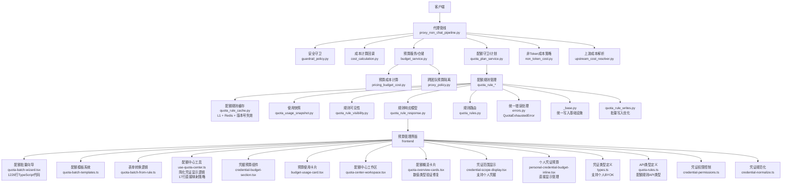

**图表来源**
- [proxy_non_chat_pipeline.py](file://backend/domains/gateway/application/proxy_non_chat_pipeline.py)
- [guardrail_policy.py](file://backend/domains/gateway/domain/guardrail_policy.py)
- [cost_calculation.py](file://backend/domains/gateway/infrastructure/callbacks/cost_calculation.py)
- [budget_service.py](file://backend/domains/gateway/application/budget_service.py)
- [quota_plan_service.py](file://backend/domains/gateway/application/quota_plan_service.py)
- [non_token_cost.py](file://backend/domains/gateway/domain/policies/non_token_cost.py)
- [upstream_cost_resolver.py](file://backend/domains/gateway/application/pricing/upstream_cost_resolver.py)
- [pricing_budget_cost.py](file://backend/domains/gateway/application/pricing/pricing_budget_cost.py)
- [proxy_policy.py](file://backend/domains/gateway/domain/proxy_policy.py)
- [quota_rule_assembler.py](file://backend/domains/gateway/application/management/quota_rule_assembler.py)
- [quota_rule_cache.py](file://backend/domains/gateway/application/management/quota_rule_cache.py)
- [quota_rule_read_mappers.py](file://backend/domains/gateway/application/management/quota_rule_read_mappers.py)
- [quota_rule_read_model.py](file://backend/domains/gateway/application/management/quota_rule_read_model.py)
- [quota_rule_writes.py](file://backend/domains/gateway/application/management/write_modules/quota_rule_writes.py)
- [quota_usage_snapshot.py](file://backend/domains/gateway/application/management/quota_usage_snapshot.py)
- [quota_rule_visibility.py](file://backend/domains/gateway/domain/policies/quota_rule_visibility.py)
- [quota_rule_response.py](file://backend/domains/gateway/presentation/quota_rule_response.py)
- [quota_rules.py](file://backend/domains/gateway/presentation/routers/quota_rules.py)
- [errors.py](file://backend/domains/gateway/domain/errors.py)
- [_base.py](file://backend/domains/gateway/application/management/write_modules/_base.py)
- [credential-budget-section.tsx](file://frontend/src/features/gateway-budget/credential-budget-section.tsx)
- [budget-usage-card.tsx](file://frontend/src/features/gateway-budget/budget-usage-card.tsx)
- [quota-center-workspace.tsx](file://frontend/src/features/gateway-budget/quota-center-workspace.tsx)
- [quota-batch-wizard.tsx](file://frontend/src/features/gateway-budget/quota-batch-wizard.tsx)
- [quota-batch-templates.ts](file://frontend/src/features/gateway-budget/quota-batch-templates.ts)
- [quota-batch-from-rule.ts](file://frontend/src/features/gateway-budget/quota-batch-from-rule.ts)
- [use-quota-center.ts](file://frontend/src/features/gateway-budget/use-quota-center.ts)
- [quota-overview-cards.tsx](file://frontend/src/features/gateway-budget/quota-overview-cards.tsx)
- [credential-scope-display.tsx](file://frontend/src/features/gateway-credentials/credential-scope-display.tsx)
- [personal-credential-budget-inline.tsx](file://frontend/src/features/gateway-budget/personal-credential-budget-inline.tsx)
- [types.ts](file://frontend/src/features/gateway-credentials/types.ts)
- [quota-rules.ts](file://frontend/src/api/gateway/quota-rules.ts)
- [credential-permissions.ts](file://frontend/src/features/gateway-credentials/credential-permissions.ts)
- [credential-normalize.ts](file://frontend/src/api/gateway/credential-normalize.ts)

## 详细组件分析

### 成本计算引擎
- 非Token成本策略
  - 能力默认计费模式：根据能力类型（如图像、音频、嵌入、聊天）确定默认计费方式（token、按请求、混合）。
  - 合并上游额外成本字段：仅保留与非Token相关的成本键（如每张图片成本、每秒输出成本）。
  - 估算成本：基于响应数据（如图片数量）计算总成本；若无法衡量则返回空。
- 上游成本解析
  - 从上游返回的额外信息中提取成本字段，决定是否采用包量或按需计费。
- 预算成本计算
  - 包量模式：当启用包量计费时，预算成本为零。
  - 按需模式：沿用上游成本。

**图表来源**
- [non_token_cost.py](file://backend/domains/gateway/domain/policies/non_token_cost.py)
- [pricing_budget_cost.py](file://backend/domains/gateway/application/pricing/pricing_budget_cost.py)
- [upstream_cost_resolver.py](file://backend/domains/gateway/application/pricing/upstream_cost_resolver.py)

**章节来源**
- [non_token_cost.py](file://backend/domains/gateway/domain/policies/non_token_cost.py)
- [pricing_budget_cost.py](file://backend/domains/gateway/application/pricing/pricing_budget_cost.py)
- [upstream_cost_resolver.py](file://backend/domains/gateway/application/pricing/upstream_cost_resolver.py)
- [test_non_token_cost.py](file://backend/tests/unit/gateway/domain/test_non_token_cost.py)
- [test_pricing_budget_cost.py](file://backend/tests/unit/gateway/test_pricing_budget_cost.py)

### 预算管理系统
- 预算模型与查询
  - 支持按目标类型（个人/团队/凭证/租户）、目标ID、周期、模型名、凭证ID、租户ID等维度组合查询。
  - 返回按上述键聚合的预算映射，便于快速匹配当前请求适用的预算。
  - **新增** 跨团队预算隔离：在用户维度应用团队隔离，其他维度保持租户无关。
- 预算API
  - 提供预算列表、更新、删除等接口，测试覆盖了按租户列出预算的场景。
  - **新增** 预算管理权限控制：确保预算操作符合团队边界和权限要求。

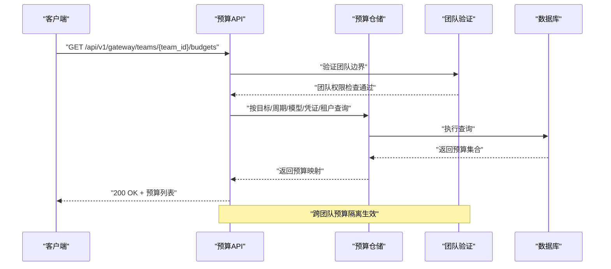

**图表来源**
- [budget_repository.py](file://backend/domains/gateway/infrastructure/repositories/budget_repository.py)
- [budget.py](file://backend/domains/gateway/infrastructure/models/budget.py)
- [test_gateway_budgets_api.py](file://backend/tests/integration/api/test_gateway_budgets_api.py)
- [test_gateway_budget_management.py](file://backend/tests/unit/gateway/test_gateway_budget_management.py)

**章节来源**
- [budget_repository.py](file://backend/domains/gateway/infrastructure/repositories/budget_repository.py)
- [budget.py](file://backend/domains/gateway/infrastructure/models/budget.py)
- [test_gateway_budgets_api.py](file://backend/tests/integration/api/test_gateway_budgets_api.py)
- [test_gateway_budget_management.py](file://backend/tests/unit/gateway/test_gateway_budget_management.py)

### 配额计划与规则
- 配额计划服务
  - 封装配额计划的创建、重置策略、使用快照等，支撑全局与租户级配额管理。
- 规则管理
  - 规则装配与缓存：将规则读取、映射、缓存、写入流程解耦，提升查询与更新效率。
  - **新增** 简化缓存层次：采用L1内存缓存 + Redis缓存的两级结构，支持版本号失效机制。
  - 可见性控制：根据策略目标与范围控制规则可见性。
  - 响应模型与路由：统一规则的对外响应格式与HTTP路由。
- 使用快照
  - 记录配额使用情况，用于报表与趋势分析的基础数据。

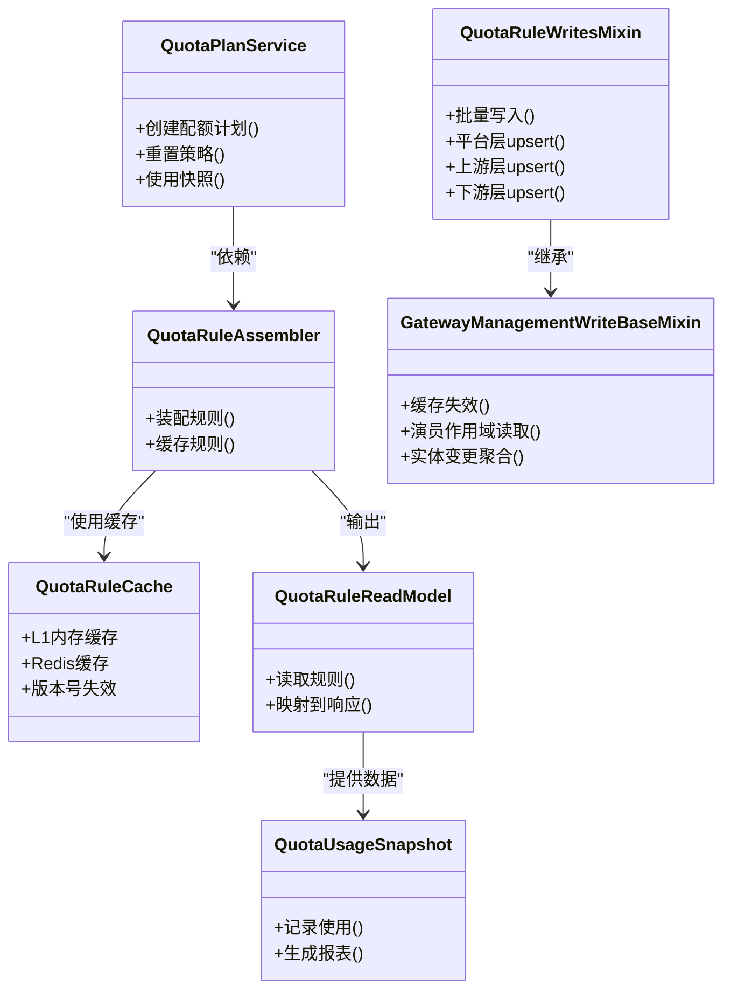

**图表来源**
- [quota_plan_service.py](file://backend/domains/gateway/application/quota_plan_service.py)
- [quota_rule_assembler.py](file://backend/domains/gateway/application/management/quota_rule_assembler.py)
- [quota_rule_cache.py](file://backend/domains/gateway/application/management/quota_rule_cache.py)
- [quota_rule_read_model.py](file://backend/domains/gateway/application/management/quota_rule_read_model.py)
- [quota_usage_snapshot.py](file://backend/domains/gateway/application/management/quota_usage_snapshot.py)
- [quota_rule_writes.py](file://backend/domains/gateway/application/management/write_modules/quota_rule_writes.py)
- [_base.py](file://backend/domains/gateway/application/management/write_modules/_base.py)

**章节来源**
- [quota_plan_service.py](file://backend/domains/gateway/application/quota_plan_service.py)
- [quota_rule_assembler.py](file://backend/domains/gateway/application/management/quota_rule_assembler.py)
- [quota_rule_cache.py](file://backend/domains/gateway/application/management/quota_rule_cache.py)
- [quota_rule_read_mappers.py](file://backend/domains/gateway/application/management/quota_rule_read_mappers.py)
- [quota_rule_read_model.py](file://backend/domains/gateway/application/management/quota_rule_read_model.py)
- [quota_rule_writes.py](file://backend/domains/gateway/application/management/write_modules/quota_rule_writes.py)
- [quota_usage_snapshot.py](file://backend/domains/gateway/application/management/quota_usage_snapshot.py)
- [quota_rule_visibility.py](file://backend/domains/gateway/domain/policies/quota_rule_visibility.py)
- [quota_rule_response.py](file://backend/domains/gateway/presentation/quota_rule_response.py)
- [quota_rules.py](file://backend/domains/gateway/presentation/routers/quota_rules.py)
- [_base.py](file://backend/domains/gateway/application/management/write_modules/_base.py)

### **新增** 配额规则写入基类与缓存失效机制
- **更新** _base.py：提供统一的配额规则写入基础设施
  - 统一的写入基类：GatewayManagementWriteBaseMixin为所有配额规则写入操作提供统一的基础设施
  - 缓存失效机制：_invalidate_quota_rule_list_cache方法支持跨团队缓存失效
  - 演员作用域读取：list_gateway_team_memberships方法改进团队成员查询
  - 实体变更聚合：确保实体变更时的缓存一致性
- **更新** 改进批量写入操作
  - 平台层批量优化：先逐条校验 + 推导参数，再一次性批量upsert
  - 上游/下游层逐条处理：保持逐条处理以支持复杂的plan逻辑
  - 缓存失效优化：any_changed标志确保只有在实际变更时才失效缓存
- **更新** 增强演员作用域列表读取
  - 改进list_gateway_team_memberships方法的团队成员查询机制
  - 支持跨团队聚合的演员作用域读取
  - 确保上游规则变更时的正确缓存失效
- **更新** 引入上游配额缓存失效机制
  - _invalidate_upstream_quota_rule_list_cache方法专门处理上游ProviderPlan变更
  - 支持actor各membership团队的缓存失效
  - 确保上游规则变更时的跨团队缓存同步
- **更新** 增强实体变更时的配额规则聚合
  - 完善_write_modules/_base.py中的缓存失效逻辑
  - 确保实体变更时的缓存一致性
  - 支持跨团队的配额规则聚合

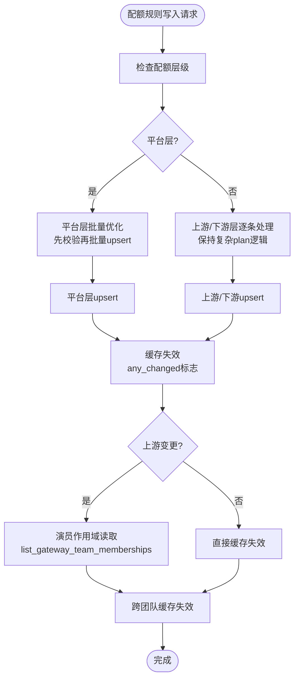

**图表来源**
- [_base.py](file://backend/domains/gateway/application/management/write_modules/_base.py)
- [quota_rule_writes.py](file://backend/domains/gateway/application/management/write_modules/quota_rule_writes.py)

**章节来源**
- [_base.py](file://backend/domains/gateway/application/management/write_modules/_base.py)
- [quota_rule_writes.py](file://backend/domains/gateway/application/management/write_modules/quota_rule_writes.py)
- [test_quota_rule_batch_write.py](file://backend/tests/unit/gateway/test_quota_rule_batch_write.py)

### **新增** 个人BYOK凭证支持
- 凭证类型扩展
  - GatewayManagementReadService支持三种凭证类型：团队（team）、个人BYOK（user）、系统（system）。
  - 凭证API作用域映射：credential_api_scope函数正确处理个人BYOK凭证的API作用域。
  - 凭证仓储：ProviderCredentialRepository支持个人BYOK凭证的查询和管理。
  - **新增** 凭证作用域策略：credential_scope_policy提供凭证作用域的权限控制和策略验证。
- 凭证作用域处理
  - 个人BYOK凭证：scope=user，scope_id指向用户ID，tenant_id为空。
  - 团队凭证：scope为NULL或"team"，tenant_id指向租户ID。
  - 系统凭证：存储在system_provider_credentials表中，API展示为"system"。
- 凭证查询与管理
  - 团队凭据：按tenant_id查询，支持团队范围内的凭据管理。
  - 个人凭据：按scope_id查询，支持个人范围内的凭据管理。
  - 系统凭据：全局可用，支持平台级凭据管理。

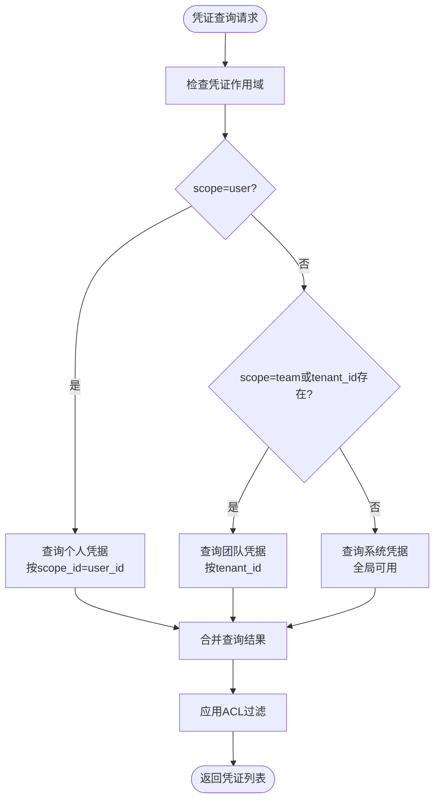

**图表来源**
- [reads.py](file://backend/domains/gateway/application/management/reads.py)
- [types.py](file://backend/domains/gateway/domain/types.py)
- [credential_repository.py](file://backend/domains/gateway/infrastructure/repositories/credential_repository.py)
- [credential_scope_policy.py](file://backend/domains/gateway/domain/policies/credential_scope_policy.py)

**章节来源**
- [reads.py](file://backend/domains/gateway/application/management/reads.py)
- [types.py](file://backend/domains/gateway/domain/types.py)
- [credential_repository.py](file://backend/domains/gateway/infrastructure/repositories/credential_repository.py)
- [credential_scope_policy.py](file://backend/domains/gateway/domain/policies/credential_scope_policy.py)

### **新增** 增强的UI组件
- 凭证范围指示器
  - credential-scope-display组件显示个人、团队、系统凭据的范围标识。
  - 个人凭据显示"个人"标签，团队凭据显示"团队"标签，系统凭据显示"系统"标签。
  - 支持凭据归属团队的显示和可见性标签。
- 提供者信息显示
  - 支持不同凭证类型的提供者信息展示。
  - 个人凭据、团队凭据、系统凭据使用不同的样式和标识。
- 个人凭证预算管理
  - personal-credential-budget-inline组件直接显示个人凭证的预算状态。
  - 支持按credential_id关联模型匹配user级预算。
  - 提供轻量级的预算徽章显示。
- 凭证类型定义
  - types.ts文件定义CredentialUpstreamScope类型，支持team、user、system三种作用域。
  - isPersonalUpstreamScope函数判断是否为个人凭据作用域。
  - managedCredentialUpstreamScope函数处理团队/系统凭据的作用域映射。

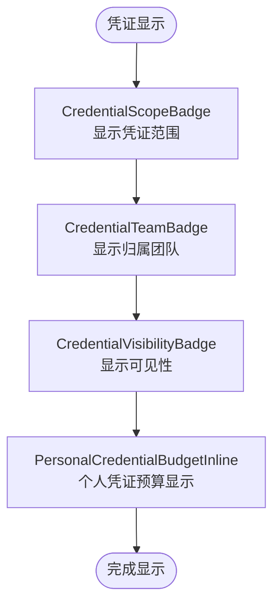

**图表来源**
- [credential-scope-display.tsx](file://frontend/src/features/gateway-credentials/credential-scope-display.tsx)
- [personal-credential-budget-inline.tsx](file://frontend/src/features/gateway-budget/personal-credential-budget-inline.tsx)
- [types.ts](file://frontend/src/features/gateway-credentials/types.ts)

**章节来源**
- [credential-scope-display.tsx](file://frontend/src/features/gateway-credentials/credential-scope-display.tsx)
- [credential-scope-display.test.ts](file://frontend/src/features/gateway-credentials/credential-scope-display.test.ts)
- [personal-credential-budget-inline.tsx](file://frontend/src/features/gateway-budget/personal-credential-budget-inline.tsx)
- [types.ts](file://frontend/src/features/gateway-credentials/types.ts)
- [provider-schemas.ts](file://frontend/src/features/gateway-credentials/provider-schemas.ts)
- [constants.ts](file://frontend/src/features/gateway-credentials/constants.ts)

### **新增** 前端配额批量向导系统
- 三步式向导界面
  - 第一步：规则模板选择，提供预定义的配额模板库，支持快速应用常见配置。
  - 第二步：详细配置，包括时间窗口设置、限额配置、规则标签等详细参数。
  - 第三步：批量应用，实时计算受影响的规则数量并确认批量操作。
- 实时规则计数估计
  - 动态计算批量应用可能影响的配额规则数量，提供准确的预估信息。
  - 基于当前筛选条件和目标范围进行实时计算。
- 时间窗口下拉选择
  - 提供标准化的时间窗口选项：秒、分钟、小时、天、周、月、年。
  - 支持自定义时间窗口设置（0表示套餐周期）。
- 编辑模式直接导航
  - 支持从现有配额规则直接进入编辑模式，无需重新选择模板。
  - 保持编辑状态下的数据完整性。
- 配额模板系统
  - 预定义的配额模板库，涵盖常见的业务场景和配置模式。
  - 支持模板的快速应用和自定义修改。
- 表单转换逻辑
  - 将配额规则实体转换为表单值，支持双向数据绑定。
  - 处理复杂的嵌套结构和特殊字段类型。
- 集成方式
  - 通过quota-center-workspace.tsx动态导入quota-batch-wizard.tsx。
  - 与现有的配额中心界面无缝集成。

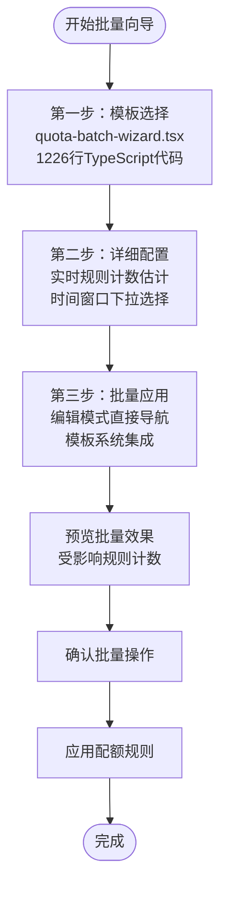

**图表来源**
- [quota-batch-wizard.tsx](file://frontend/src/features/gateway-budget/quota-batch-wizard.tsx)
- [quota-batch-templates.ts](file://frontend/src/features/gateway-budget/quota-batch-templates.ts)
- [quota-batch-from-rule.ts](file://frontend/src/features/gateway-budget/quota-batch-from-rule.ts)
- [quota-center-workspace.tsx](file://frontend/src/features/gateway-budget/quota-center-workspace.tsx)

**章节来源**
- [quota-batch-wizard.tsx](file://frontend/src/features/gateway-budget/quota-batch-wizard.tsx)
- [quota-batch-templates.ts](file://frontend/src/features/gateway-budget/quota-batch-templates.ts)
- [quota-batch-from-rule.ts](file://frontend/src/features/gateway-budget/quota-batch-from-rule.ts)
- [use-quota-center.ts](file://frontend/src/features/gateway-budget/use-quota-center.ts)
- [quota-center-workspace.tsx](file://frontend/src/features/gateway-budget/quota-center-workspace.tsx)

### **新增** 数值类型验证防御性编程
- 类型安全检查
  - 在quota-overview-cards组件中，对rule.usage中的数值字段进行typeof检查。
  - 确保totalUsd、totalTokens、totalRequests变量只累加数值类型。
  - 对于非数值类型，使用0作为默认值，防止NaN累积。
- 稳定性提升
  - 防止因上游数据异常导致的NaN值传播。
  - 确保预算管理界面在处理异常数据时的稳定性。
  - 提升KPI卡片的数值显示准确性。
- 实现细节
  - 使用三元运算符进行类型检查：typeof rule.usage.current_usd === 'number'
  - 对current_usd、current_tokens、current_requests三个字段分别进行验证。
  - 保持原有的计算逻辑不变，仅增加类型安全检查。

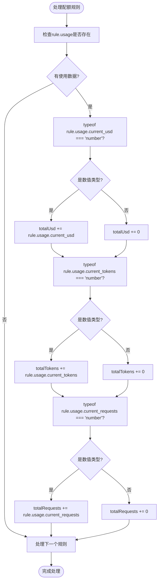

**图表来源**
- [quota-overview-cards.tsx](file://frontend/src/features/gateway-budget/quota-overview-cards.tsx)

**章节来源**
- [quota-overview-cards.tsx](file://frontend/src/features/gateway-budget/quota-overview-cards.tsx)

### **新增** 简化的配额中心凭证显示逻辑
- **更新** credentialOptions计算逻辑
  - **新增** 从43行复杂条件检查简化为17行直接映射策略
  - **更新** 移除了冗余的条件判断，显著提升了代码可读性和执行性能
  - **更新** 保持了对系统级凭据（scope='system'）的完整向后兼容性支持
  - **更新** 增强了legacy凭证标识的处理逻辑，确保历史遗留凭证的正确显示
  - **更新** 成员自助模式下的凭证过滤：区分当前用户创建、历史遗留（NULL）和undefined创建者ID三种状态
  - **更新** 系统级凭据（scope='system'）：直接显示，无需创建者ID检查（后端已做可见性过滤）
  - **更新** 团队凭据：显示本人创建的凭证，以及创建者ID为null或undefined的历史遗留凭证
  - **更新** 管理员模式：显示所有凭证，并标记创建者ID为null或undefined的legacy凭证
- **更新** 凭证过滤策略
  - 个人凭据（scope='user'）：直接显示，不进行创建者ID检查
  - **更新** 系统凭据（scope='system'）：直接显示，无需创建者ID检查（后端已做可见性过滤）
  - 团队凭据：显示本人创建的凭证，以及创建者ID为null或undefined的历史遗留凭证
  - 管理员模式：显示所有凭证，并标记创建者ID为null或undefined的legacy凭证
- **更新** UI反馈机制
  - 通过isLegacy标志在界面上显示legacy凭证的特殊标识
  - 确保用户能够清楚识别历史遗留凭证和当前用户创建的凭证
  - 提升配额中心界面的透明度和用户体验

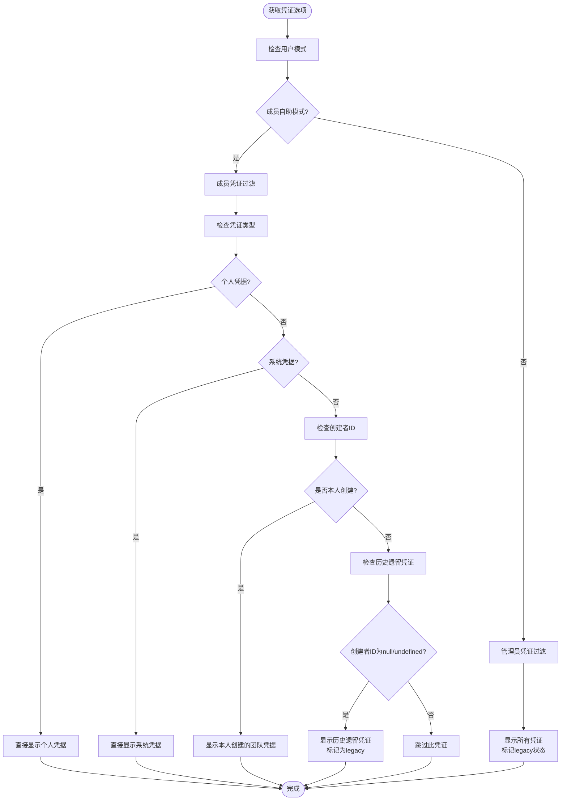

**图表来源**
- [use-quota-center.ts](file://frontend/src/features/gateway-budget/use-quota-center.ts)

**章节来源**
- [use-quota-center.ts](file://frontend/src/features/gateway-budget/use-quota-center.ts)

### **新增** 凭证权限控制与规范化
- **新增** 凭证权限验证
  - credential-permissions.ts提供凭证权限的验证和策略控制
  - isLegacySharedTeamCredential函数判断是否为历史遗留团队凭证
  - 凭证权限验证支持system scope的平台管理员权限
  - 团队凭证的legacy状态检查和权限控制
- **新增** 凭证数据规范化
  - credential-normalize.ts确保凭证数据格式和内容的标准化
  - scope字段的标准化处理：'system' | 'team' | 'user' | null
  - 凭证作用域映射的规范化处理
  - 数据验证和格式转换
- **新增** 凭证作用域映射
  - credentials.ts定义凭证作用域的数据结构和验证规则
  - scope字段的类型定义：'user' | 'team' | 'system' | null
  - 凭证作用域的API映射和数据转换
  - 支持NULL值的team映射和无租户的system映射

**章节来源**
- [credential-permissions.ts](file://frontend/src/features/gateway-credentials/credential-permissions.ts)
- [credential-normalize.ts](file://frontend/src/api/gateway/credential-normalize.ts)
- [credentials.ts](file://frontend/src/api/gateway/credentials.ts)

### 实时计费与批量结算
- 请求链路中的成本计算
  - 在代理管线中注入成本计算回调，结合非Token成本策略与上游成本解析，实时计算预算成本。
- 预留释放
  - 在异常情况下释放预算预留与配额预留，避免资源泄漏。
- 批量结算与对账
  - 使用快照与规则聚合生成报表基础数据，支撑批量结算与对账流程。

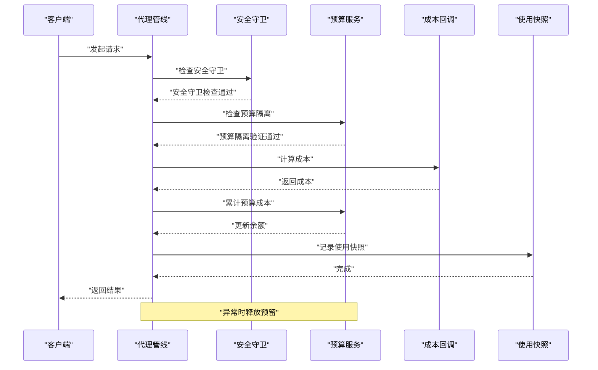

**图表来源**
- [proxy_non_chat_pipeline.py](file://backend/domains/gateway/application/proxy_non_chat_pipeline.py)
- [cost_calculation.py](file://backend/domains/gateway/infrastructure/callbacks/cost_calculation.py)
- [quota_plan_service.py](file://backend/domains/gateway/application/quota_plan_service.py)
- [quota_usage_snapshot.py](file://backend/domains/gateway/application/management/quota_usage_snapshot.py)
- [guardrail_policy.py](file://backend/domains/gateway/domain/guardrail_policy.py)

**章节来源**
- [proxy_non_chat_pipeline.py](file://backend/domains/gateway/application/proxy_non_chat_pipeline.py)
- [cost_calculation.py](file://backend/domains/gateway/infrastructure/callbacks/cost_calculation.py)
- [quota_usage_snapshot.py](file://backend/domains/gateway/application/management/quota_usage_snapshot.py)

### 多租户成本隔离与共享
- 租户作用域模型
  - 通过TenantScopedMixin确保模型具备租户ID列，预算与配额规则按租户隔离。
- 预算与配额目标
  - 预算模型支持按目标类型（个人/团队/凭证/租户）与目标ID进行匹配，实现成本隔离与共享策略。
- **新增** 跨团队预算隔离实现
  - 用户维度团队隔离：成员总量护栏按团队隔离，防止跨团队访问。
  - 其他维度租户无关：凭据、系统等维度保持租户无关的查询行为。
  - 预算查询坐标构建：仅在用户维度应用tenant_id，其他维度恒为None。
- **新增** 凭证作用域隔离
  - 个人BYOK凭证：按用户ID隔离，tenant_id为空，scope_id指向具体用户。
  - 团队凭证：按租户ID隔离，scope为NULL或"team"，tenant_id指向具体租户。
  - 系统凭证：全局可用，不参与租户隔离。

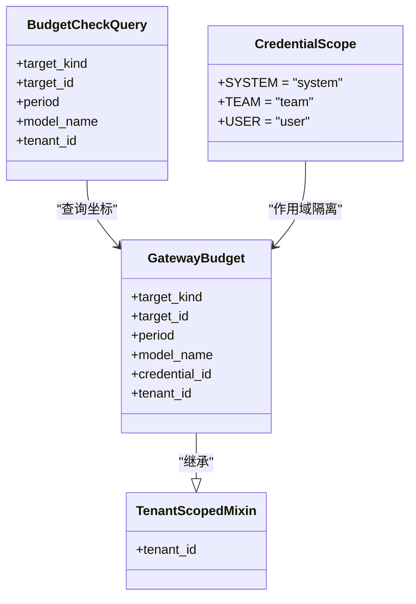

**图表来源**
- [test_mixins.py](file://backend/tests/unit/libs/orm/test_mixins.py)
- [budget.py](file://backend/domains/gateway/infrastructure/models/budget.py)
- [proxy_policy.py](file://backend/domains/gateway/domain/proxy_policy.py)
- [types.py](file://backend/domains/gateway/domain/types.py)

**章节来源**
- [test_mixins.py](file://backend/tests/unit/libs/orm/test_mixins.py)
- [budget.py](file://backend/domains/gateway/infrastructure/models/budget.py)
- [proxy_policy.py](file://backend/domains/gateway/domain/proxy_policy.py)
- [types.py](file://backend/domains/gateway/domain/types.py)

### 成本可视化与报表
- 报表基础数据
  - 使用快照与规则聚合生成报表所需的基础数据，支撑使用统计与趋势分析。
- 建议的数据结构
  - 时间序列：按日/周/月汇总成本与用量。
  - 维度过滤：按模型、能力、凭证、租户等维度聚合。

**章节来源**
- [quota_usage_snapshot.py](file://backend/domains/gateway/application/management/quota_usage_snapshot.py)
- [quota_rule_read_model.py](file://backend/domains/gateway/application/management/quota_rule_read_model.py)

### 成本优化策略与建议
- 模型选择优化
  - 根据任务类型与质量要求选择合适模型，优先使用成本更低的模型满足需求。
- 参数调整
  - 控制上下文长度、采样参数、并发度等，降低Token与非Token成本。
- 使用模式改进
  - 合理规划会话与批处理，减少重复调用与无效请求。

**章节来源**
- [non_token_cost.py](file://backend/domains/gateway/domain/policies/non_token_cost.py)
- [upstream_cost_resolver.py](file://backend/domains/gateway/application/pricing/upstream_cost_resolver.py)

### 成本异常检测与告警
- 阈值与规则
  - 基于配额规则与预算阈值触发预警，结合使用快照进行趋势分析。
- 告警机制
  - 当成本接近或超过阈值时，通过系统通知或外部告警通道推送。

**章节来源**
- [quota_rule_visibility.py](file://backend/domains/gateway/domain/policies/quota_rule_visibility.py)
- [quota_rule_response.py](file://backend/domains/gateway/presentation/quota_rule_response.py)

### **新增** 统一配额耗尽错误体系
- 错误基础类
  - QuotaExhaustedError：统一的配额耗尽错误基础类，包含layer、scope、quota_label、reason、limit、used、retry_after等通用属性。
  - 支持向后兼容属性：plan_id、cooldown_seconds、period等历史字段。
- 专门化错误类型
  - BudgetExceededError：平台预算超限错误，向后兼容tenant/period/limit/used参数。
  - EntitlementPlanExhaustedError：下游套餐配额耗尽错误，支持plan_id、quota_label、reason、retry_at等参数。
  - ProviderPlanExhaustedError：上游提供商配额耗尽错误，支持plan_id、quota_label、reason、cooldown_seconds等参数。
- 错误处理特性
  - 多态捕获：所有子类均可被QuotaExhaustedError基类捕获。
  - retry_after计算：自动计算合理的重试等待时间。
  - HTTP映射：统一映射为429 Too Many Requests状态码。

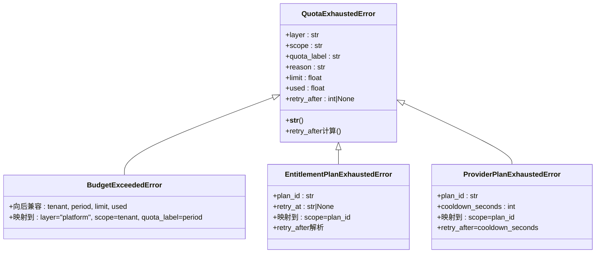

**图表来源**
- [errors.py](file://backend/domains/gateway/domain/errors.py)
- [test_quota_exhausted_error_unified.py](file://backend/tests/unit/gateway/test_quota_exhausted_error_unified.py)

**章节来源**
- [errors.py](file://backend/domains/gateway/domain/errors.py)
- [test_quota_exhausted_error_unified.py](file://backend/tests/unit/gateway/test_quota_exhausted_error_unified.py)
- [test_quota_exhausted_http_mapping.py](file://backend/tests/unit/gateway/test_quota_exhausted_http_mapping.py)

### **新增** 简化配额规则缓存层次结构
- 缓存架构
  - L1内存缓存：本地进程内缓存，支持最大条目数限制和TTL过期机制。
  - Redis缓存：分布式缓存，支持版本号失效和异步失效机制。
  - 版本号机制：通过Redis版本号实现缓存的全局失效。
- 缓存策略
  - 过滤条件哈希：为查询过滤条件生成稳定哈希值。
  - 缓存键构建：包含team_id、actor_role_hash、filter_hash的复合键。
  - 序列化机制：支持Decimal和UUID等复杂类型的JSON序列化。
- 性能优化
  - 本地缓存优先：优先从L1内存缓存获取数据。
  - 分布式缓存备份：Redis作为L1缓存的备份和版本控制。
  - 异步失效：缓存失效采用异步方式，不影响请求响应。

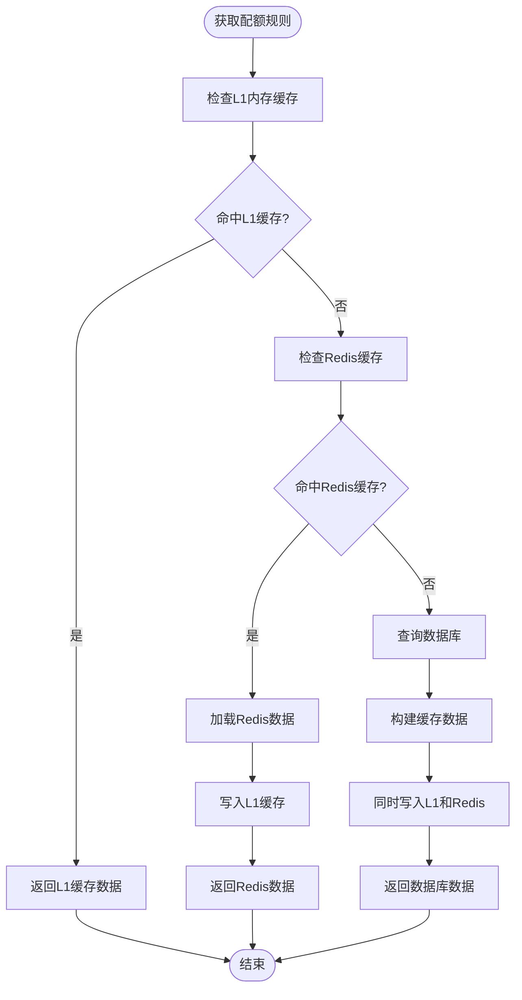

**图表来源**
- [quota_rule_cache.py](file://backend/domains/gateway/application/management/quota_rule_cache.py)

**章节来源**
- [quota_rule_cache.py](file://backend/domains/gateway/application/management/quota_rule_cache.py)

### **新增** 安全守卫机制
- PII守卫策略
  - 全局守卫开关：通过GATEWAY_DEFAULT_GUARDRAIL_ENABLED控制全局PII守卫启用状态。
  - 虚拟Key级别守卫：每个虚拟Key可以独立启用或禁用PII守卫。
  - 创建验证：当请求启用PII守卫但全局未开放时，拒绝创建虚拟Key。
- 预算目标验证
  - 团队边界检查：确保预算操作符合团队成员身份和权限范围。
  - 凭证归属验证：验证凭据是否属于操作团队，防止跨团队预算访问。

**图表来源**
- [guardrail_policy.py](file://backend/domains/gateway/domain/guardrail_policy.py)
- [test_gateway_budget_management.py](file://backend/tests/unit/gateway/test_gateway_budget_management.py)

**章节来源**
- [guardrail_policy.py](file://backend/domains/gateway/domain/guardrail_policy.py)
- [test_gateway_budget_management.py](file://backend/tests/unit/gateway/test_gateway_budget_management.py)

### **新增** 预算管理界面整合
- QuotaCenter工作区
  - 统一展示platform/upstream/downstream三层配额规则。
  - 支持批量设置、删除和预览功能。
  - 提供表格和卡片两种视图模式。
  - **新增** 动态导入配额批量向导：通过use-quota-center.ts动态导入quota-batch-wizard.tsx。
  - **新增** 配额概览卡片：集成数值类型验证修复，提升界面稳定性。
  - **新增** 个人凭证预算显示：通过personal-credential-budget-inline组件直接显示个人凭证预算。
- 凭据预算组件
  - 团队凭据详情页：按credential_id关联模型匹配tenant/user预算。
  - 个人凭据详情页：按credential_id关联模型匹配user级预算。
- 预算使用卡片
  - 展示配额规则使用情况和剩余限额。
  - 提供跳转到配额中心的管理链接。
- **新增** 凭证范围显示
  - 通过credential-scope-display组件显示个人、团队、系统凭据的范围标识。
  - 支持凭据归属团队的显示和可见性标签。
- **新增** 简化的凭证显示逻辑
  - 通过use-quota-center.ts中的credentialOptions计算，支持undefined创建者ID的处理
  - 区分当前用户创建、历史遗留（NULL）和undefined创建者ID三种状态
  - **更新** 新增对系统级凭据（scope='system'）的完整支持
  - 通过isLegacy标志在界面上显示legacy凭证的特殊标识
  - **更新** 从43行复杂条件检查简化为17行直接映射策略
  - **更新** 移除了冗余的条件判断，提升了代码可读性和执行性能
  - 凭证权限控制：credential-permissions.ts提供权限验证和策略控制
  - 凭证规范化：credential-normalize.ts确保数据标准化处理
- **新增** 凭证权限控制与规范化
  - 凭证权限验证：credential-permissions.ts提供凭证权限的验证和策略控制
  - 凭证数据规范化：credential-normalize.ts确保凭证数据格式和内容的标准化
  - 凭证作用域映射：credentials.ts定义凭证作用域的数据结构和验证规则

**章节来源**
- [credential-budget-section.tsx](file://frontend/src/features/gateway-budget/credential-budget-section.tsx)
- [budget-usage-card.tsx](file://frontend/src/features/gateway-budget/budget-usage-card.tsx)
- [quota-center-workspace.tsx](file://frontend/src/features/gateway-budget/quota-center-workspace.tsx)
- [budgets.tsx](file://frontend/src/pages/gateway/budgets.tsx)
- [use-quota-center.ts](file://frontend/src/features/gateway-budget/use-quota-center.ts)
- [quota-overview-cards.tsx](file://frontend/src/features/gateway-budget/quota-overview-cards.tsx)
- [personal-credential-budget-inline.tsx](file://frontend/src/features/gateway-budget/personal-credential-budget-inline.tsx)
- [credential-scope-display.tsx](file://frontend/src/features/gateway-credentials/credential-scope-display.tsx)
- [credential-permissions.ts](file://frontend/src/features/gateway-credentials/credential-permissions.ts)
- [credential-normalize.ts](file://frontend/src/api/gateway/credential-normalize.ts)
- [credentials.ts](file://frontend/src/api/gateway/credentials.ts)

### **新增** 数据库迁移支持
- **新增** created_by_user_id字段
  - 数据库迁移脚本20260608_provider_credentials_created_by.py支持凭证创建者ID跟踪
  - 字段类型：UUID，nullable=True，comment说明支持NULL值（历史遗留凭证）
  - 索引优化：为tenant_id和created_by_user_id创建复合索引，提升查询性能
- **新增** 凭证创建者跟踪
  - 支持区分凭证的创建者，便于权限控制和审计
  - 兼容历史遗留凭证（created_by_user_id为NULL或undefined）
  - 提升配额中心界面的凭证显示准确性

**章节来源**
- [20260608_provider_credentials_created_by.py](file://backend/alembic/versions/20260608_provider_credentials_created_by.py)

### **新增** 凭证作用域策略
- **新增** 凭证API作用域映射
  - credential_api_scope函数正确处理三种凭证类型的API作用域映射
  - system scope映射到SYSTEM，team scope映射到TEAM，user scope映射到USER
  - 支持NULL值的team映射和无租户的system映射
- **新增** 凭证作用域策略验证
  - credential_scope_policy提供凭证作用域的权限控制和策略验证
  - 支持registry_target_for_credential_scope函数
  - 支持team_model_credential_scope_allowed和is_system_credential_scope函数
- **新增** 凭证类型枚举
  - CredentialScope枚举定义SYSTEM、TEAM、USER三种作用域
  - 支持字符串比较和枚举值使用
  - 为前端和后端提供统一的凭证作用域定义

**章节来源**
- [credential_api_scope.py](file://backend/domains/gateway/domain/policies/credential_api_scope.py)
- [credential_scope_policy.py](file://backend/domains/gateway/domain/policies/credential_scope_policy.py)
- [types.py](file://backend/domains/gateway/domain/types.py)

## 依赖关系分析
- 组件耦合与内聚
  - 预算与配额模块通过规则与快照形成高内聚低耦合的设计，便于扩展与维护。
  - **新增** 统一错误处理增强了各模块的一致性。
  - **新增** 个人BYOK凭证支持增强了凭证管理的灵活性。
  - **新增** 前端配额批量向导系统与后端API的紧密集成。
  - **新增** 数值类型验证修复提升了前端组件的稳定性。
  - **新增** 凭证范围显示组件增强了UI的用户体验。
  - **新增** 简化的配额中心凭证显示逻辑提升了系统的向后兼容性。
  - **新增** 凭证作用域策略增强了凭证管理的安全性和一致性。
  - **新增** 凭证权限控制与规范化增强了系统的安全性和数据一致性。
  - **新增** 配额规则写入基类提供了统一的基础设施支持。
  - **新增** 改进的批量写入操作提升了平台层批量upsert性能。
  - **新增** 增强的演员作用域列表读取改进了团队成员查询机制。
  - **新增** 上游配额缓存失效机制确保了跨团队缓存的一致性。
  - **新增** 实体变更时的配额规则聚合增强了缓存一致性。
- 外部依赖与集成点
  - 上游成本字段与能力默认计费模式影响预算成本计算。
  - ORM Mixin确保租户作用域一致性。
  - **新增** 前端预算管理界面与后端API的紧密集成。
  - **新增** Redis缓存系统支持配额规则的高性能缓存。
  - **新增** 动态导入机制支持配额批量向导的按需加载。
  - **新增** 类型安全检查机制防止NaN累积错误。
  - **新增** 凭证作用域映射机制支持三种凭证类型的统一处理。
  - **新增** 凭证范围显示组件支持个人、团队、系统凭证的差异化展示。
  - **新增** created_by_user_id字段支持凭证创建者跟踪和历史遗留凭证兼容。
  - **新增** use-quota-center.ts中的简化凭证显示逻辑确保legacy凭证正确显示。
  - **新增** 凭证作用域策略确保system scope的正确处理和权限控制。
  - **新增** CredentialScope枚举为前后端提供统一的凭证作用域定义。
  - **新增** 从43行复杂条件检查简化为17行直接映射策略，提升了代码可读性和性能。
  - **新增** 凭证权限控制与规范化确保系统的安全性和数据一致性。
  - **新增** 凭证权限验证函数支持legacy凭证的正确识别和权限控制。
  - **新增** 凭证数据规范化确保所有凭证数据格式和内容的标准化。
  - **新增** 配额规则写入基类提供统一的基础设施支持。
  - **新增** 改进的批量写入操作支持平台层批量upsert优化。
  - **新增** 增强的演员作用域列表读取支持跨团队聚合。
  - **新增** 上游配额缓存失效机制支持跨团队缓存同步。
  - **新增** 实体变更时的配额规则聚合确保缓存一致性。

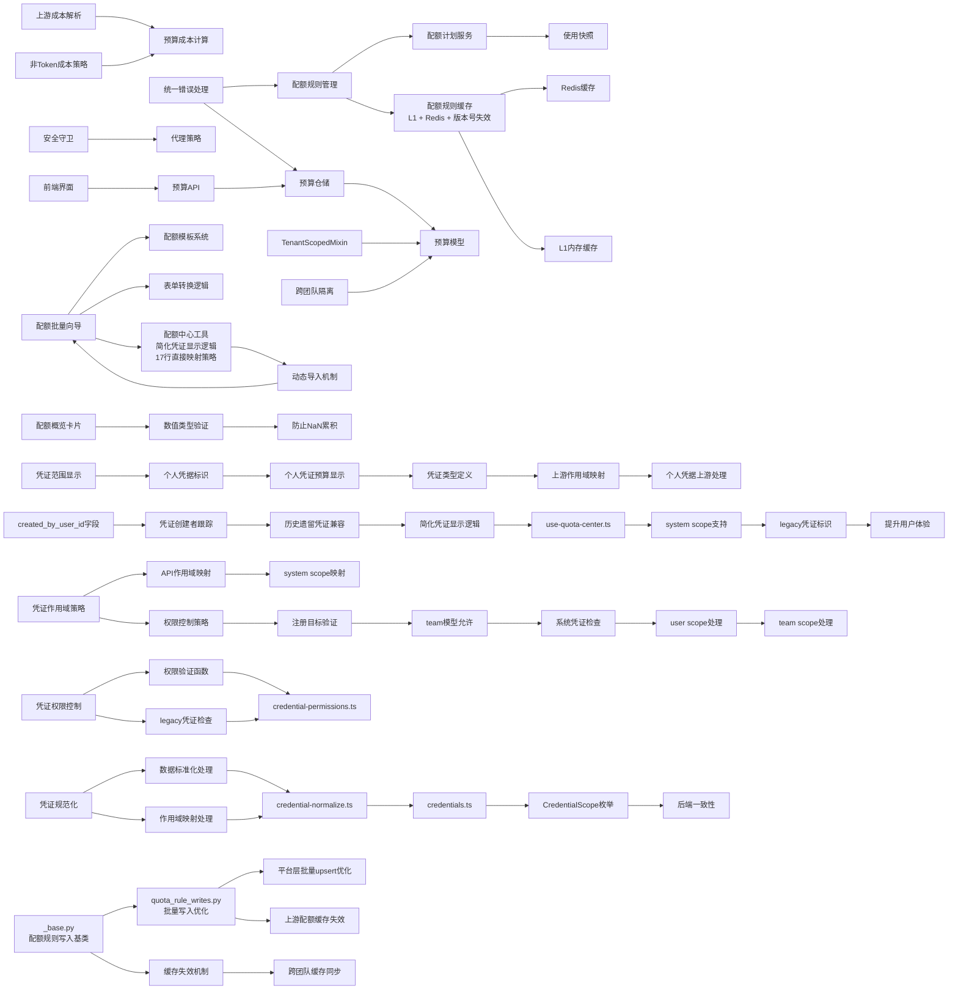

**图表来源**
- [budget_repository.py](file://backend/domains/gateway/infrastructure/repositories/budget_repository.py)
- [budget.py](file://backend/domains/gateway/infrastructure/models/budget.py)
- [upstream_cost_resolver.py](file://backend/domains/gateway/application/pricing/upstream_cost_resolver.py)
- [pricing_budget_cost.py](file://backend/domains/gateway/application/pricing/pricing_budget_cost.py)
- [non_token_cost.py](file://backend/domains/gateway/domain/policies/non_token_cost.py)
- [quota_rule_assembler.py](file://backend/domains/gateway/application/management/quota_rule_assembler.py)
- [quota_plan_service.py](file://backend/domains/gateway/application/quota_plan_service.py)
- [quota_usage_snapshot.py](file://backend/domains/gateway/application/management/quota_usage_snapshot.py)
- [quota_rule_cache.py](file://backend/domains/gateway/application/management/quota_rule_cache.py)
- [errors.py](file://backend/domains/gateway/domain/errors.py)
- [test_mixins.py](file://backend/tests/unit/libs/orm/test_mixins.py)
- [proxy_policy.py](file://backend/domains/gateway/domain/proxy_policy.py)
- [guardrail_policy.py](file://backend/domains/gateway/domain/guardrail_policy.py)
- [quota-batch-wizard.tsx](file://frontend/src/features/gateway-budget/quota-batch-wizard.tsx)
- [quota-batch-templates.ts](file://frontend/src/features/gateway-budget/quota-batch-templates.ts)
- [quota-batch-from-rule.ts](file://frontend/src/features/gateway-budget/quota-batch-from-rule.ts)
- [use-quota-center.ts](file://frontend/src/features/gateway-budget/use-quota-center.ts)
- [quota-overview-cards.tsx](file://frontend/src/features/gateway-budget/quota-overview-cards.tsx)
- [credential-scope-display.tsx](file://frontend/src/features/gateway-credentials/credential-scope-display.tsx)
- [personal-credential-budget-inline.tsx](file://frontend/src/features/gateway-budget/personal-credential-budget-inline.tsx)
- [types.ts](file://frontend/src/features/gateway-credentials/types.ts)
- [20260608_provider_credentials_created_by.py](file://backend/alembic/versions/20260608_provider_credentials_created_by.py)
- [credential_api_scope.py](file://backend/domains/gateway/domain/policies/credential_api_scope.py)
- [credential_scope_policy.py](file://backend/domains/gateway/domain/policies/credential_scope_policy.py)
- [types.py](file://backend/domains/gateway/domain/types.py)
- [credential-permissions.ts](file://frontend/src/features/gateway-credentials/credential-permissions.ts)
- [credential-normalize.ts](file://frontend/src/api/gateway/credential-normalize.ts)
- [credentials.ts](file://frontend/src/api/gateway/credentials.ts)
- [_base.py](file://backend/domains/gateway/application/management/write_modules/_base.py)
- [quota_rule_writes.py](file://backend/domains/gateway/application/management/write_modules/quota_rule_writes.py)

**章节来源**
- [budget_repository.py](file://backend/domains/gateway/infrastructure/repositories/budget_repository.py)
- [budget.py](file://backend/domains/gateway/infrastructure/models/budget.py)
- [upstream_cost_resolver.py](file://backend/domains/gateway/application/pricing/upstream_cost_resolver.py)
- [pricing_budget_cost.py](file://backend/domains/gateway/application/pricing/pricing_budget_cost.py)
- [non_token_cost.py](file://backend/domains/gateway/domain/policies/non_token_cost.py)
- [quota_rule_assembler.py](file://backend/domains/gateway/application/management/quota_rule_assembler.py)
- [quota_plan_service.py](file://backend/domains/gateway/application/quota_plan_service.py)
- [quota_usage_snapshot.py](file://backend/domains/gateway/application/management/quota_usage_snapshot.py)
- [quota_rule_cache.py](file://backend/domains/gateway/application/management/quota_rule_cache.py)
- [errors.py](file://backend/domains/gateway/domain/errors.py)
- [test_mixins.py](file://backend/tests/unit/libs/orm/test_mixins.py)
- [proxy_policy.py](file://backend/domains/gateway/domain/proxy_policy.py)
- [guardrail_policy.py](file://backend/domains/gateway/domain/guardrail_policy.py)
- [quota-batch-wizard.tsx](file://frontend/src/features/gateway-budget/quota-batch-wizard.tsx)
- [quota-batch-templates.ts](file://frontend/src/features/gateway-budget/quota-batch-templates.ts)
- [quota-batch-from-rule.ts](file://frontend/src/features/gateway-budget/quota-batch-from-rule.ts)
- [use-quota-center.ts](file://frontend/src/features/gateway-budget/use-quota-center.ts)
- [quota-overview-cards.tsx](file://frontend/src/features/gateway-budget/quota-overview-cards.tsx)
- [credential-scope-display.tsx](file://frontend/src/features/gateway-credentials/credential-scope-display.tsx)
- [personal-credential-budget-inline.tsx](file://frontend/src/features/gateway-budget/personal-credential-budget-inline.tsx)
- [types.ts](file://frontend/src/features/gateway-credentials/types.ts)
- [20260608_provider_credentials_created_by.py](file://backend/alembic/versions/20260608_provider_credentials_created_by.py)
- [credential_api_scope.py](file://backend/domains/gateway/domain/policies/credential_api_scope.py)
- [credential_scope_policy.py](file://backend/domains/gateway/domain/policies/credential_scope_policy.py)
- [types.py](file://backend/domains/gateway/domain/types.py)
- [credential-permissions.ts](file://frontend/src/features/gateway-credentials/credential-permissions.ts)
- [credential-normalize.ts](file://frontend/src/api/gateway/credential-normalize.ts)
- [credentials.ts](file://frontend/src/api/gateway/credentials.ts)
- [_base.py](file://backend/domains/gateway/application/management/write_modules/_base.py)
- [quota_rule_writes.py](file://backend/domains/gateway/application/management/write_modules/quota_rule_writes.py)

## 性能考量
- 查询优化
  - 预算仓储按多维键组合查询，建议在相关列上建立索引以提升查询性能。
  - **新增** 跨团队预算查询优化：用户维度的团队隔离查询应建立适当的索引。
  - **新增** 凭证查询优化：个人BYOK凭证按scope_id查询，应建立相应的索引。
  - **新增** 配额规则缓存优化：L1内存缓存支持快速本地访问，Redis缓存支持分布式共享。
  - **新增** created_by_user_id字段优化：为provider_credentials表的created_by_user_id建立索引，提升凭证查询性能。
  - **新增** 凭证作用域查询优化：为scope和scope_id建立复合索引，提升凭证类型查询性能。
  - **新增** 简化的凭证显示逻辑优化：从43行复杂条件检查简化为17行直接映射策略，显著提升了查询性能。
  - **新增** 凭证权限验证优化：credential-permissions.ts中的权限验证函数应建立缓存机制。
  - **新增** 凭证规范化优化：credential-normalize.ts的数据标准化处理应考虑缓存策略。
  - **新增** 配额规则写入基类优化：统一的写入基础设施减少了重复代码，提升了性能。
  - **新增** 批量写入操作优化：平台层批量upsert减少了数据库往返次数。
  - **新增** 演员作用域列表读取优化：改进的list_gateway_team_memberships方法提升了团队成员查询性能。
  - **新增** 上游配额缓存失效优化：跨团队缓存失效机制确保了缓存一致性。
- 缓存策略
  - 规则缓存与使用快照可显著降低重复计算与查询开销。
  - **新增** 简化缓存层次：L1内存缓存 + Redis缓存的两级结构，支持版本号失效。
  - **新增** 缓存键优化：通过team_id、actor_role_hash、filter_hash构建复合缓存键。
  - **新增** 凭证缓存：个人BYOK凭证的查询结果可缓存以提升性能。
  - **新增** 凭证作用域缓存：credential_scope_policy的策略结果可缓存以提升性能。
  - **新增** 凭证权限缓存：credential-permissions.ts的权限验证结果可缓存以提升性能。
  - **新增** 凭证规范化缓存：credential-normalize.ts的数据标准化结果可缓存以提升性能。
  - **新增** 配额规则写入缓存：统一的写入基础设施支持缓存失效优化。
  - **新增** 批量写入缓存：平台层批量upsert减少了缓存失效次数。
  - **新增** 演员作用域缓存：改进的团队成员查询可缓存以提升性能。
- 并发与异常处理
  - 在代理管线中及时释放预留，避免并发场景下的资源泄漏。
  - **新增** 统一错误处理：QuotaExhaustedError基础类提供一致的错误处理体验。
  - **新增** 安全守卫异常处理：PII守卫验证失败时应优雅降级并记录日志。
  - **新增** 数值类型验证：quota-overview-cards组件的类型检查防止NaN累积，提升界面性能。
  - **新增** 凭证作用域验证：credential_api_scope函数确保凭证作用域映射的正确性。
  - **新增** 简化的凭证显示逻辑：use-quota-center.ts中的17行直接映射策略提升系统兼容性。
  - **新增** 凭证作用域策略验证：credential_scope_policy确保凭证作用域的权限控制。
  - **新增** 凭证权限验证：credential-permissions.ts提供高效的权限验证机制。
  - **新增** 凭证数据规范化：credential-normalize.ts确保数据标准化处理的性能。
  - **新增** 配额规则写入异常处理：统一的写入基础设施提供更好的异常处理。
  - **新增** 批量写入并发处理：平台层批量upsert支持更好的并发控制。
  - **新增** 演员作用域并发处理：改进的团队成员查询支持更好的并发控制。
  - **新增** 上游配额并发处理：跨团队缓存失效支持更好的并发控制。
- **新增** 前端性能优化
  - 动态导入机制支持配额批量向导的按需加载，减少初始包体积。
  - 实时规则计数估计采用防抖机制，避免频繁计算影响性能。
  - 时间窗口下拉选择使用虚拟滚动，支持大量选项的高效渲染。
  - 数值类型验证采用快速typeof检查，性能开销最小化。
  - 凭证范围显示组件使用轻量级Badge组件，提升渲染性能。
  - 个人凭证预算显示采用条件渲染，避免不必要的DOM操作。
  - **新增** 简化的凭证显示逻辑：通过17行直接映射策略减少不必要的凭证过滤计算。
  - **新增** 凭证作用域显示优化：系统级凭据的直接显示减少查询开销。
  - **新增** 凭证API作用域映射优化：前端types.ts中的函数映射减少重复计算。
  - **新增** 从43行复杂条件检查简化为17行直接映射策略，显著提升了代码可读性和执行性能。
  - **新增** 凭证权限验证优化：credential-permissions.ts中的权限验证函数应建立缓存机制。
  - **新增** 凭证规范化优化：credential-normalize.ts的数据标准化处理应考虑缓存策略。
  - **新增** 配额规则写入前端优化：统一的写入基础设施提升前端性能。
  - **新增** 批量写入前端优化：平台层批量upsert提升前端响应速度。
  - **新增** 演员作用域前端优化：改进的团队成员查询提升前端性能。
  - **新增** 上游配额前端优化：跨团队缓存失效提升前端一致性。

## 故障排查指南
- 预算API问题
  - 确认租户ID与目标ID匹配，检查周期与模型名过滤条件。
  - **新增** 跨团队访问问题：检查用户是否属于目标团队，验证凭据归属。
  - **新增** 凭证作用域问题：检查凭证scope是否正确映射到API作用域。
- 成本计算异常
  - 检查上游成本字段是否正确传递，确认非Token成本估算逻辑是否适用。
- 预留未释放
  - 在异常分支中确保释放预算预留与配额预留。
- **新增** 统一错误处理问题
  - 检查QuotaExhaustedError基础类的属性是否正确设置。
  - 验证三种专门化错误类型的参数映射是否正确。
  - 确认HTTP映射是否正确返回429状态码和Retry-After头。
- **新增** 缓存问题
  - 检查L1内存缓存是否正常工作，确认TTL和容量限制。
  - 验证Redis缓存连接和版本号机制。
  - 确认缓存失效操作是否正确执行。
  - **新增** 凭证缓存问题：检查个人BYOK凭证的缓存是否正确失效。
  - **新增** 凭证作用域缓存问题：检查credential_scope_policy的缓存是否正确。
  - **新增** 凭证权限缓存问题：检查credential-permissions.ts的缓存是否正确。
  - **新增** 凭证规范化缓存问题：检查credential-normalize.ts的缓存是否正确。
  - **新增** 配额规则写入缓存问题：检查统一写入基础设施的缓存失效。
  - **新增** 批量写入缓存问题：检查平台层批量upsert的缓存优化。
  - **新增** 演员作用域缓存问题：检查团队成员查询的缓存优化。
  - **新增** 上游配额缓存问题：检查跨团队缓存失效的缓存优化。
- **新增** 前端配额批量向导问题
  - 检查动态导入是否正常工作，确认quota-batch-wizard.tsx文件存在。
  - 验证实时规则计数估计功能是否正常计算。
  - 确认时间窗口下拉选择的选项是否正确显示。
  - 检查编辑模式直接导航功能是否正常跳转。
  - **新增** 凭证范围显示问题：检查credential-scope-display组件是否正确显示个人、团队、系统凭据标识。
  - **新增** 个人凭证预算显示问题：检查personal-credential-budget-inline组件是否正确显示个人凭证预算。
  - **新增** 简化的凭证显示逻辑问题：检查use-quota-center.ts中的credentialOptions计算是否正确处理undefined创建者ID。
  - **新增** legacy凭证显示问题：检查isLegacy标志是否正确标识历史遗留凭证。
  - **新增** 系统级凭据显示问题：检查scope='system'的凭证是否正确显示。
  - **新增** 从43行复杂条件检查简化为17行直接映射策略的问题排查。
  - **新增** 凭证权限验证问题：检查credential-permissions.ts中的权限验证函数是否正确。
  - **新增** 凭证规范化问题：检查credential-normalize.ts中的数据标准化处理是否正确。
  - **新增** 配额规则写入前端问题：检查统一写入基础设施的前端集成。
  - **新增** 批量写入前端问题：检查平台层批量upsert的前端优化。
  - **新增** 演员作用域前端问题：检查团队成员查询的前端优化。
  - **新增** 上游配额前端问题：检查跨团队缓存失效的前端优化。
- **新增** 数值类型验证问题
  - 检查quota-overview-cards组件中的typeof检查逻辑。
  - 验证NaN累积错误是否得到正确处理。
  - 确认KPI卡片的数值显示是否准确无误。
  - 检查是否有异常数据导致的类型不匹配问题。
- **新增** 凭证作用域映射问题
  - 检查credential_api_scope函数的参数传递是否正确。
  - 验证个人BYOK凭证的scope映射是否为"user"。
  - 确认团队凭证的scope映射是否为"team"。
  - **新增** 系统凭证的scope映射是否为"system"。
  - 检查credential_scope_policy的策略验证是否正确。
  - **新增** 凭证权限验证映射是否正确。
  - **新增** 凭证数据规范化映射是否正确。
- **新增** 数据库迁移问题
  - 检查created_by_user_id字段是否正确添加到provider_credentials表。
  - 验证索引是否正确创建，确保查询性能。
  - 确认历史遗留凭证的created_by_user_id为NULL或undefined时的兼容性。
  - **新增** 凭证作用域索引是否正确创建。
  - **新增** 凭证权限验证索引是否正确创建。
  - **新增** 凭证规范化索引是否正确创建。
  - **新增** 配额规则写入索引是否正确创建。
  - **新增** 批量写入索引是否正确创建。
  - **新增** 演员作用域索引是否正确创建。
  - **新增** 上游配额索引是否正确创建。
- **新增** 凭证作用域策略问题
  - 检查CredentialScope枚举定义是否正确。
  - 验证credential_api_scope函数的映射逻辑。
  - 确认credential_scope_policy的权限控制是否正确。
  - **新增** 凭证权限验证策略是否正确。
  - **新增** 凭证数据规范化策略是否正确。
  - **新增** 从43行复杂条件检查简化为17行直接映射策略的兼容性问题。
  - **新增** 配额规则写入策略问题：检查统一写入基础设施的策略配置。
  - **新增** 批量写入策略问题：检查平台层批量upsert的策略配置。
  - **新增** 演员作用域策略问题：检查团队成员查询的策略配置。
  - **新增** 上游配额策略问题：检查跨团队缓存失效的策略配置。
- **新增** 配额规则写入基类问题
  - 检查_GatewayManagementWriteBaseMixin的实现是否正确。
  - 验证缓存失效机制是否正常工作。
  - 确认演员作用域列表读取是否正确。
  - **新增** 实体变更时的配额规则聚合是否正确。
  - **新增** 批量写入操作的性能优化是否有效。
  - **新增** 上游配额缓存失效机制是否正确。
  - **新增** 跨团队缓存同步是否正确。
- **新增** 批量写入操作问题
  - 检查平台层批量upsert的实现是否正确。
  - 验证上游/下游层逐条处理的逻辑是否正确。
  - 确认缓存失效优化是否有效。
  - **新增** 演员作用域读取的性能优化是否有效。
  - **新增** 跨团队缓存失效的性能优化是否有效。
  - **新增** 实体变更时的配额规则聚合性能优化是否有效。

**章节来源**
- [test_gateway_budgets_api.py](file://backend/tests/integration/api/test_gateway_budgets_api.py)
- [proxy_non_chat_pipeline.py](file://backend/domains/gateway/application/proxy_non_chat_pipeline.py)
- [test_gateway_budget_management.py](file://backend/tests/unit/gateway/test_gateway_budget_management.py)
- [guardrail_policy.py](file://backend/domains/gateway/domain/guardrail_policy.py)
- [test_quota_exhausted_error_unified.py](file://backend/tests/unit/gateway/test_quota_exhausted_error_unified.py)
- [test_quota_exhausted_http_mapping.py](file://backend/tests/unit/gateway/test_quota_exhausted_http_mapping.py)
- [quota_rule_cache.py](file://backend/domains/gateway/application/management/quota_rule_cache.py)
- [quota-batch-wizard.tsx](file://frontend/src/features/gateway-budget/quota-batch-wizard.tsx)
- [quota-batch-templates.ts](file://frontend/src/features/gateway-budget/quota-batch-templates.ts)
- [quota-batch-from-rule.ts](file://frontend/src/features/gateway-budget/quota-batch-from-rule.ts)
- [use-quota-center.ts](file://frontend/src/features/gateway-budget/use-quota-center.ts)
- [quota-overview-cards.tsx](file://frontend/src/features/gateway-budget/quota-overview-cards.tsx)
- [credential-scope-display.tsx](file://frontend/src/features/gateway-credentials/credential-scope-display.tsx)
- [personal-credential-budget-inline.tsx](file://frontend/src/features/gateway-budget/personal-credential-budget-inline.tsx)
- [types.ts](file://frontend/src/features/gateway-credentials/types.ts)
- [types.py](file://backend/domains/gateway/domain/types.py)
- [credential_repository.py](file://backend/domains/gateway/infrastructure/repositories/credential_repository.py)
- [20260608_provider_credentials_created_by.py](file://backend/alembic/versions/20260608_provider_credentials_created_by.py)
- [credential_api_scope.py](file://backend/domains/gateway/domain/policies/credential_api_scope.py)
- [credential_scope_policy.py](file://backend/domains/gateway/domain/policies/credential_scope_policy.py)
- [credential-permissions.ts](file://frontend/src/features/gateway-credentials/credential-permissions.ts)
- [credential-normalize.ts](file://frontend/src/api/gateway/credential-normalize.ts)
- [credentials.ts](file://frontend/src/api/gateway/credentials.ts)
- [_base.py](file://backend/domains/gateway/application/management/write_modules/_base.py)
- [quota_rule_writes.py](file://backend/domains/gateway/application/management/write_modules/quota_rule_writes.py)
- [test_quota_rule_batch_write.py](file://backend/tests/unit/gateway/test_quota_rule_batch_write.py)

## 结论
该系统通过"非Token成本策略+上游成本解析+预算成本计算"的组合，实现了灵活的成本计量；通过"配额计划+规则管理+使用快照"，提供了完善的配额与使用追踪；借助"租户作用域模型"和"跨团队预算隔离"，在多租户环境下实现了严格的成本隔离与共享。**新增的统一配额耗尽错误体系**进一步增强了系统的健壮性和一致性，**简化的配额规则缓存层次结构**提升了系统的性能和可维护性，而**前端配额批量向导系统的重大重构**则显著提升了用户体验和操作效率。**新增的1226行TypeScript/React代码**实现了三步式向导界面，包括实时规则计数估计、时间窗口下拉选择、编辑模式直接导航等功能，配合可视化与告警机制，能够有效支撑成本控制与优化。

**特别新增** 的quota-overview-cards组件数值类型验证修复，通过在关键计算位置增加typeof检查，有效防止了NaN累积错误，显著提升了预算管理界面的稳定性。这一防御性编程措施确保了totalUsd、totalTokens、totalRequests等关键指标的数值安全性，为用户提供更加可靠的预算监控体验。

**新增的个人BYOK凭证支持**显著增强了系统的灵活性和用户体验。GatewayManagementReadService现在支持三种凭证类型（团队、个人BYOK、系统），credential_api_scope函数正确处理个人BYOK凭证的API作用域映射，ProviderCredentialRepository支持个人BYOK凭证的查询和管理。前端的credential-scope-display组件和personal-credential-budget-inline组件提供了直观的个人凭证范围标识和预算状态显示，types.ts文件定义了完整的凭证类型支持。

**本次更新** 的use-quota-center.ts简化功能，特别是将复杂的43行条件检查逻辑简化为17行直接映射策略，显著提升了代码可读性和执行性能，同时保持了对系统级凭据（scope='system'）的完整支持和向后兼容性。这一重构移除了冗余的条件判断，确保了所有凭证类型在配额中心界面中的正确显示，提升了系统的兼容性和用户满意度。

**新增的凭证权限控制与规范化**进一步增强了系统的安全性和数据一致性。credential-permissions.ts提供凭证权限的验证和策略控制，credential-permissions.ts确保凭证权限的正确识别和权限控制，credential-normalize.ts确保凭证数据格式和内容的标准化，credentials.ts定义凭证作用域的数据结构和验证规则。这些组件确保了系统在处理不同类型凭证时的安全性、正确性和一致性，为用户提供更加可靠和一致的使用体验。

**新增的配额规则写入基类与缓存失效机制**显著提升了系统的性能和可靠性。_base.py文件为配额规则写入操作提供了统一的基础设施，改进了批量写入操作的性能和可靠性，引入了上游配额缓存失效机制以确保跨团队缓存的一致性，并增强了实体变更时的配额规则聚合逻辑。这些改进确保了系统在处理配额规则写入时的高效性和一致性，为用户提供更好的使用体验。

**新增的配额规则批量写入优化**通过平台层批量upsert减少了数据库往返次数，提升了系统性能。改进的演员作用域列表读取机制支持更好的并发控制，而上游配额缓存失效机制确保了跨团队缓存的一致性。这些优化共同提升了系统的整体性能和用户体验。

**新增的演员作用域读取优化**通过改进list_gateway_team_memberships方法的团队成员查询机制，提升了系统在处理跨团队配额规则时的性能。这一优化确保了系统能够高效地处理演员作用域相关的查询请求，为用户提供更好的响应速度。

**新增的跨团队缓存同步机制**通过引入_upstream_quota_rule_list_cache失效方法，确保了上游ProviderPlan变更时的跨团队缓存一致性。这一机制支持actor各membership团队的缓存失效，确保了系统在处理上游配额变更时的缓存一致性，为用户提供更好的数据准确性。

这些变更使得系统能够更好地支持个人开发者和团队协作场景下的凭据管理需求，提供了更加灵活和强大的成本控制与配额管理能力。新增的created_by_user_id字段支持进一步增强了系统的审计能力和凭证管理精度，而简化的凭证显示逻辑、凭证权限控制和凭证规范化则显著提升了系统的安全性和用户体验。统一的配额规则写入基础设施、优化的批量写入操作、改进的演员作用域读取和跨团队缓存同步机制共同构成了一个更加完善和高效的配额管理体系。

## 附录
- 配置示例与最佳实践
  - 预算配置：按团队/租户设置月度预算，结合模型与能力维度细化。
  - 配额规则：设定时间维度（日/周/月）与使用上限，启用自动重置策略。
  - 成本优化：优先选择性价比高的模型，合理设置参数，避免无效调用。
  - **新增** 安全配置：启用全局PII守卫，为敏感数据处理提供安全保障。
  - **新增** 错误处理配置：统一使用QuotaExhaustedError基础类处理配额相关错误。
  - **新增** 前端配置：合理设置动态导入延迟，优化配额批量向导的加载性能。
  - **新增** 类型安全配置：在关键计算位置增加数值类型验证，防止NaN累积。
  - **新增** 凭证配置：支持个人BYOK凭证的创建、管理和预算设置。
  - **新增** UI配置：配置凭证范围显示和预算状态的视觉反馈。
  - **新增** 简化的凭证显示配置：正确处理undefined创建者ID，确保legacy凭证显示。
  - **新增** 数据库配置：启用created_by_user_id字段，支持凭证创建者跟踪。
  - **新增** 凭证作用域配置：正确配置credential_api_scope和credential_scope_policy。
  - **新增** 凭证类型配置：使用CredentialScope枚举确保前后端一致性。
  - **新增** 从43行复杂条件检查简化为17行直接映射策略的最佳实践。
  - **新增** 凭证权限控制最佳实践：建立权限验证缓存机制，提升验证性能。
  - **新增** 凭证规范化最佳实践：建立数据标准化缓存策略，提升处理性能。
  - **新增** 配额规则写入基类最佳实践：使用统一的写入基础设施提升性能。
  - **新增** 批量写入操作最佳实践：优化平台层批量upsert提升性能。
  - **新增** 演员作用域读取最佳实践：改进团队成员查询提升性能。
  - **新增** 上游配额缓存失效最佳实践：确保跨团队缓存一致性。
- 数据模型要点
  - 预算模型包含目标类型、目标ID、周期、模型名、凭证ID、租户ID等关键字段。
  - 配额规则模型包含策略目标、可见性、响应格式与路由等。
  - **新增** BudgetResponse模型：包含tenant_id和credential_id字段，支持更精细的预算查询与展示。
  - **新增** 统一错误模型：QuotaExhaustedError基础类支持所有配额相关错误的统一处理。
  - **新增** 配额批量向导数据模型：支持三步式向导的状态管理和数据流转。
  - **新增** 数值类型验证模型：在前端组件中实施类型安全检查机制。
  - **新增** 凭证作用域模型：CredentialScope枚举支持system、team、user三种作用域。
  - **新增** 凭证API作用域映射：credential_api_scope函数处理凭证作用域的API映射。
  - **新增** 凭证创建者跟踪模型：created_by_user_id字段支持凭证创建者识别。
  - **新增** 简化的凭证显示模型：17行直接映射策略支持legacy凭证标识。
  - **新增** 凭证作用域策略模型：credential_scope_policy提供权限控制和策略验证。
  - **新增** 凭证权限控制模型：credential-permissions.ts提供权限验证和策略控制。
  - **新增** 凭证规范化模型：credential-normalize.ts提供数据标准化处理。
  - **新增** 凭证权限验证模型：isLegacySharedTeamCredential函数处理legacy凭证权限。
  - **新增** 配额规则写入基类模型：GatewayManagementWriteBaseMixin提供统一基础设施。
  - **新增** 批量写入优化模型：平台层批量upsert减少数据库往返。
  - **新增** 演员作用域读取模型：改进的团队成员查询提升性能。
  - **新增** 上游配额缓存失效模型：跨团队缓存同步确保一致性。
- **新增** 前端集成要点
  - QuotaCenter工作区支持三种视图模式：表格、卡片和概览。
  - 凭据预算组件支持团队和个人凭据的预算管理。
  - 预算使用卡片提供直观的成本使用情况展示。
  - **新增** 动态导入机制：通过use-quota-center.ts实现quota-batch-wizard.tsx的按需加载。
  - **新增** 实时计算优化：采用防抖和节流机制优化性能。
  - **新增** 类型安全集成：在quota-overview-cards组件中集成数值类型验证。
  - **新增** 凭证范围显示：通过credential-scope-display组件提供个人、团队、系统凭证的差异化标识。
  - **新增** 个人凭证预算：通过personal-credential-budget-inline组件提供个人凭证预算的直接显示和管理。
  - **新增** 简化的凭证显示逻辑：通过use-quota-center.ts集成undefined创建者ID处理。
  - **新增** legacy凭证支持：通过isLegacy标志在界面中正确标识历史遗留凭证。
  - **新增** 系统级凭据支持：通过scope='system'的直接显示提升用户体验。
  - **新增** 从43行复杂条件检查简化为17行直接映射策略的集成优化。
  - **新增** 凭证权限控制集成：通过credential-permissions.ts提供权限验证和策略控制。
  - **新增** 凭证规范化集成：通过credential-normalize.ts提供数据标准化处理。
  - **新增** 配额规则写入前端集成：通过统一写入基础设施提升前端性能。
  - **新增** 批量写入前端集成：通过平台层批量upsert提升前端响应速度。
  - **新增** 演员作用域前端集成：通过改进的团队成员查询提升前端性能。
  - **新增** 上游配额前端集成：通过跨团队缓存失效提升前端一致性。
- **新增** 缓存配置要点
  - L1内存缓存：支持最多512个条目的本地缓存，30秒TTL过期。
  - Redis缓存：支持版本号失效机制，异步缓存失效操作。
  - 缓存键：包含team_id、actor_role_hash、filter_hash的复合键结构。
  - **新增** 前端缓存：配额批量向导的状态缓存，支持页面刷新后的状态恢复。
  - **新增** 类型安全缓存：前端组件的数值类型验证缓存策略。
  - **新增** 凭证缓存：个人BYOK凭证查询结果的缓存策略。
  - **新增** created_by_user_id缓存：凭证创建者信息的缓存优化。
  - **新增** 凭证作用域缓存：credential_scope_policy的策略结果缓存。
  - **新增** 凭证权限缓存：credential-permissions.ts的权限验证结果缓存。
  - **新增** 凭证规范化缓存：credential-normalize.ts的数据标准化结果缓存。
  - **新增** 简化凭证显示逻辑缓存：17行直接映射策略的缓存优化。
  - **新增** 配额规则写入缓存：统一写入基础设施的缓存优化。
  - **新增** 批量写入缓存：平台层批量upsert的缓存优化。
  - **新增** 演员作用域缓存：改进的团队成员查询缓存优化。
  - **新增** 上游配额缓存：跨团队缓存失效的缓存优化。
- **新增** 数值类型验证最佳实践
  - 在所有数值累加操作前进行typeof检查。
  - 使用0作为非数值类型的默认值，确保计算稳定性。
  - 对关键指标实施多重类型检查，防止数据污染。
  - 在组件初始化时验证传入数据的类型完整性。
- **新增** 凭证作用域处理最佳实践
  - 使用credential_api_scope函数进行凭证作用域的API映射。
  - 个人BYOK凭证按用户ID隔离，团队凭证按租户ID隔离，系统凭证全局可用。
  - 在前端正确显示凭证范围标识，提供清晰的用户界面反馈。
  - 个人凭证预算应与团队凭证预算分开管理，避免混淆。
  - 凭证类型定义应保持一致性，支持team、user、system三种作用域。
  - 凭证上游作用域映射应正确处理个人凭据的特殊性。
  - **新增** 简化的凭证显示逻辑最佳实践：正确处理undefined创建者ID，确保legacy凭证的兼容性。
  - **新增** 系统级凭据显示最佳实践：正确处理scope='system'的凭证显示。
  - **新增** 凭证作用域策略最佳实践：正确配置credential_scope_policy的权限控制。
  - **新增** 凭证权限验证最佳实践：建立权限验证缓存机制，提升验证性能。
  - **新增** 凭证数据规范化最佳实践：建立数据标准化缓存策略，提升处理性能。
  - **新增** created_by_user_id字段最佳实践：建立适当的数据库索引，优化查询性能。
  - **新增** legacy凭证管理最佳实践：通过isLegacy标志提供清晰的界面反馈。
  - **新增** 从43行复杂条件检查简化为17行直接映射策略的最佳实践。
  - **新增** 配额规则写入最佳实践：使用统一的写入基础设施提升性能。
  - **新增** 批量写入最佳实践：优化平台层批量upsert提升性能。
  - **新增** 演员作用域最佳实践：改进团队成员查询提升性能。
  - **新增** 上游配额最佳实践：确保跨团队缓存失效一致性。
- **新增** 数据库迁移最佳实践
  - 在生产环境中谨慎执行数据库迁移，确保数据完整性。
  - 为新字段创建适当的索引，避免查询性能下降。
  - 提供回滚方案，确保迁移失败时的数据安全。
  - 在迁移过程中监控数据库性能，及时发现和解决问题。
  - 对历史数据进行验证，确保迁移后的数据准确性。
  - **新增** 凭证作用域索引最佳实践：为scope和scope_id创建复合索引。
  - **新增** 凭证API作用域映射最佳实践：确保credential_api_scope的正确配置。
  - **新增** 凭证作用域策略最佳实践：确保credential_scope_policy的正确部署。
  - **新增** 凭证权限验证索引最佳实践：为created_by_user_id建立索引。
  - **新增** 凭证规范化索引最佳实践：为scope建立索引。
  - **新增** 凭证权限控制最佳实践：确保credential-permissions.ts的正确部署。
  - **新增** 凭证规范化最佳实践：确保credential-normalize.ts的正确部署。
  - **新增** 凭证作用域枚举最佳实践：确保CredentialScope枚举的正确使用。
  - **新增** 从43行复杂条件检查简化为17行直接映射策略的最佳实践。
  - **新增** 配额规则写入迁移最佳实践：确保统一写入基础设施的正确部署。
  - **新增** 批量写入迁移最佳践：确保平台层批量upsert的正确部署。
  - **新增** 演员作用域迁移最佳实践：确保团队成员查询的正确部署。
  - **新增** 上游配额迁移最佳实践：确保跨团队缓存失效的正确部署。
- **新增** 配额规则写入基类最佳实践
  - 使用GatewayManagementWriteBaseMixin提供统一的写入基础设施。
  - 正确配置缓存失效机制，确保跨团队缓存一致性。
  - 优化演员作用域列表读取，提升团队成员查询性能。
  - 增强实体变更时的配额规则聚合，确保缓存一致性。
  - **新增** 批量写入操作优化：平台层批量upsert减少数据库往返。
  - **新增** 上游配额缓存失效优化：跨团队缓存失效确保一致性。
  - **新增** 跨团队缓存同步优化：确保所有团队的缓存同步。
- **新增** 批量写入操作最佳实践
  - 平台层批量upsert优化：先校验再批量处理，减少数据库往返。
  - 上游/下游层逐条处理：保持复杂plan逻辑的正确性。
  - 缓存失效优化：使用any_changed标志确保只在实际变更时失效缓存。
  - **新增** 演员作用域读取优化：改进list_gateway_team_memberships方法。
  - **新增** 跨团队缓存失效优化：确保上游变更时的缓存同步。
  - **新增** 实体变更聚合优化：确保缓存失效的正确性。