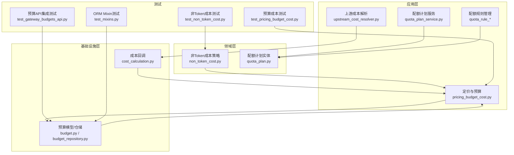
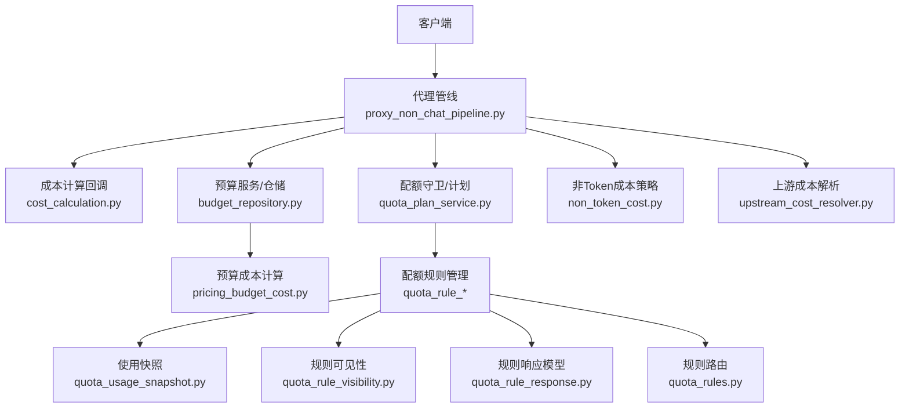
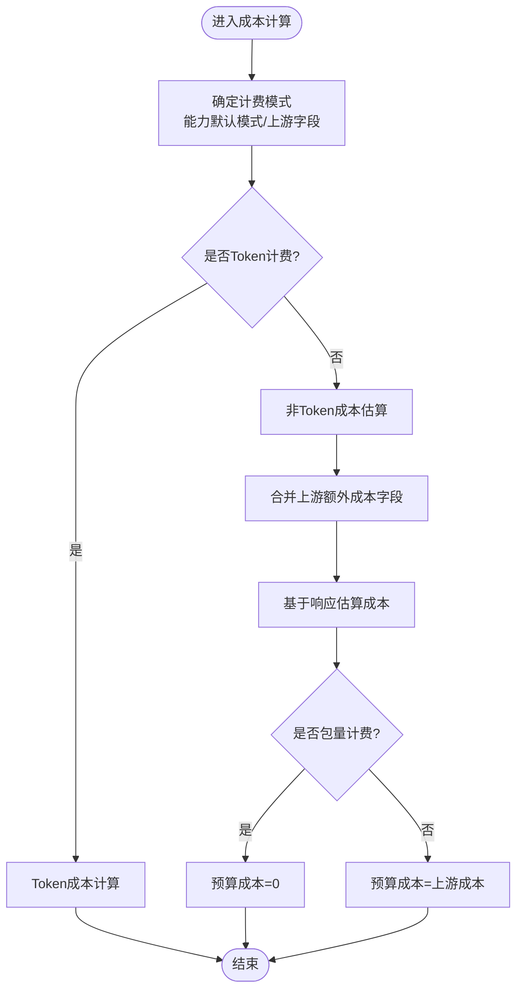
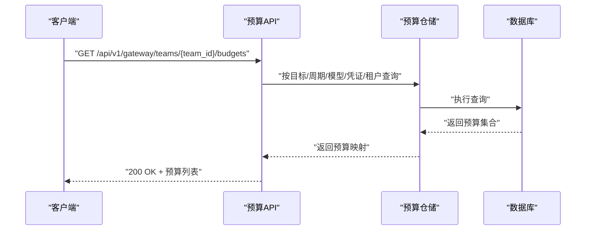
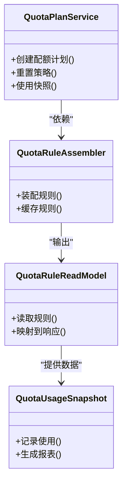
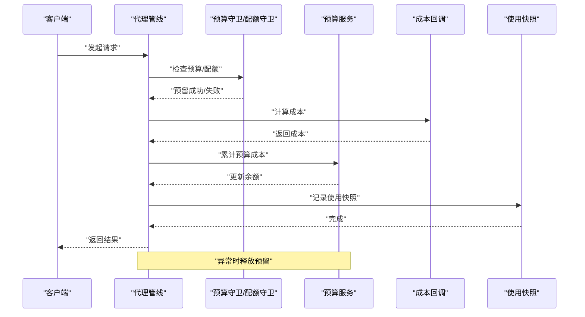
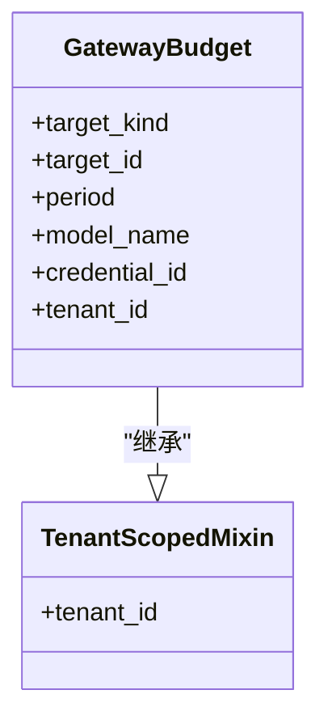
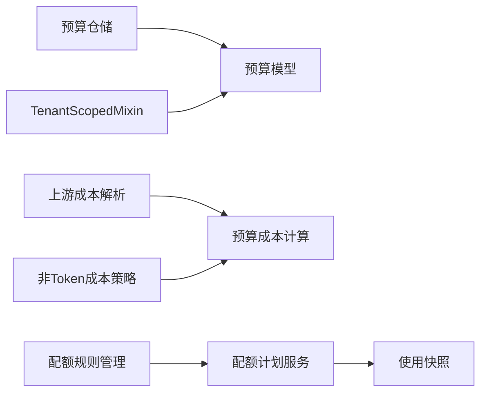

# 成本控制与配额

<cite>
**本文引用的文件**
- [pricing_budget_cost.py](file://backend/domains/gateway/application/pricing/pricing_budget_cost.py)
- [non_token_cost.py](file://backend/domains/gateway/domain/policies/non_token_cost.py)
- [budget_repository.py](file://backend/domains/gateway/infrastructure/repositories/budget_repository.py)
- [budget.py](file://backend/domains/gateway/infrastructure/models/budget.py)
- [quota_plan_service.py](file://backend/domains/gateway/application/quota_plan_service.py)
- [quota_plan.py](file://backend/domains/gateway/domain/quota_plan.py)
- [quota_rule_assembler.py](file://backend/domains/gateway/application/management/quota_rule_assembler.py)
- [quota_rule_cache.py](file://backend/domains/gateway/application/management/quota_rule_cache.py)
- [quota_rule_read_mappers.py](file://backend/domains/gateway/application/management/quota_rule_read_mappers.py)
- [quota_rule_read_model.py](file://backend/domains/gateway/application/management/quota_rule_read_model.py)
- [quota_rule_writes.py](file://backend/domains/gateway/application/management/write_modules/quota_rule_writes.py)
- [quota_usage_snapshot.py](file://backend/domains/gateway/application/management/quota_usage_snapshot.py)
- [quota_rule_visibility.py](file://backend/domains/gateway/domain/policies/quota_rule_visibility.py)
- [quota_rule_response.py](file://backend/domains/gateway/presentation/quota_rule_response.py)
- [quota_rules.py](file://backend/domains/gateway/presentation/routers/quota_rules.py)
- [user_quota.py](file://backend/domains/agent/domain/entities/user_quota.py)
- [user_quota_repository.py](file://backend/domains/identity/infrastructure/repositories/user_quota_repository.py)
- [proxy_non_chat_pipeline.py](file://backend/domains/gateway/application/proxy_non_chat_pipeline.py)
- [cost_calculation.py](file://backend/domains/gateway/infrastructure/callbacks/cost_calculation.py)
- [upstream_cost_resolver.py](file://backend/domains/gateway/application/pricing/upstream_cost_resolver.py)
- [test_pricing_budget_cost.py](file://backend/tests/unit/gateway/test_pricing_budget_cost.py)
- [test_non_token_cost.py](file://backend/tests/unit/gateway/domain/test_non_token_cost.py)
- [test_gateway_budgets_api.py](file://backend/tests/integration/api/test_gateway_budgets_api.py)
- [test_mixins.py](file://backend/tests/unit/libs/orm/test_mixins.py)
</cite>

## 目录
1. [引言](#引言)
2. [项目结构](#项目结构)
3. [核心组件](#核心组件)
4. [架构总览](#架构总览)
5. [详细组件分析](#详细组件分析)
6. [依赖关系分析](#依赖关系分析)
7. [性能考量](#性能考量)
8. [故障排查指南](#故障排查指南)
9. [结论](#结论)
10. [附录](#附录)

## 引言
本文件面向成本控制与配额管理主题，系统化梳理后端在“网关域”中的成本计算引擎、预算管理、配额计划与使用追踪、实时计费与批量结算、成本可视化与报表、成本优化策略、异常检测与告警、以及多租户成本隔离与共享机制。文档以仓库中现有实现为依据，结合测试用例与模型定义，给出可操作的架构说明与最佳实践。

## 项目结构
围绕成本与配额的关键目录与文件如下：
- 应用层（application）
  - 定价与预算：pricing_budget_cost.py、upstream_cost_resolver.py
  - 配额计划：quota_plan_service.py、quota_plan.py
  - 配额规则管理：quota_rule_assembler.py、quota_rule_cache.py、quota_rule_read_mappers.py、quota_rule_read_model.py、quota_rule_writes.py、quota_usage_snapshot.py、quota_rule_visibility.py、quota_rule_response.py、quota_rules.py
- 领域层（domain）
  - 非Token成本策略：non_token_cost.py
  - 配额计划实体：quota_plan.py
- 基础设施层（infrastructure）
  - 预算模型与仓储：budget.py、budget_repository.py
  - 成本回调：cost_calculation.py
- 测试（tests）
  - 预算成本、非Token成本、预算API、ORM Mixin等测试用例

图表来源
- [pricing_budget_cost.py](file://backend/domains/gateway/application/pricing/pricing_budget_cost.py)
- [upstream_cost_resolver.py](file://backend/domains/gateway/application/pricing/upstream_cost_resolver.py)
- [quota_plan_service.py](file://backend/domains/gateway/application/quota_plan_service.py)
- [quota_rule_assembler.py](file://backend/domains/gateway/application/management/quota_rule_assembler.py)
- [non_token_cost.py](file://backend/domains/gateway/domain/policies/non_token_cost.py)
- [quota_plan.py](file://backend/domains/gateway/domain/quota_plan.py)
- [budget.py](file://backend/domains/gateway/infrastructure/models/budget.py)
- [budget_repository.py](file://backend/domains/gateway/infrastructure/repositories/budget_repository.py)
- [cost_calculation.py](file://backend/domains/gateway/infrastructure/callbacks/cost_calculation.py)
- [test_pricing_budget_cost.py](file://backend/tests/unit/gateway/test_pricing_budget_cost.py)
- [test_non_token_cost.py](file://backend/tests/unit/gateway/domain/test_non_token_cost.py)
- [test_gateway_budgets_api.py](file://backend/tests/integration/api/test_gateway_budgets_api.py)
- [test_mixins.py](file://backend/tests/unit/libs/orm/test_mixins.py)

章节来源
- [pricing_budget_cost.py](file://backend/domains/gateway/application/pricing/pricing_budget_cost.py)
- [non_token_cost.py](file://backend/domains/gateway/domain/policies/non_token_cost.py)
- [budget_repository.py](file://backend/domains/gateway/infrastructure/repositories/budget_repository.py)
- [budget.py](file://backend/domains/gateway/infrastructure/models/budget.py)
- [quota_plan_service.py](file://backend/domains/gateway/application/quota_plan_service.py)
- [quota_plan.py](file://backend/domains/gateway/domain/quota_plan.py)
- [quota_rule_assembler.py](file://backend/domains/gateway/application/management/quota_rule_assembler.py)
- [quota_rule_cache.py](file://backend/domains/gateway/application/management/quota_rule_cache.py)
- [quota_rule_read_mappers.py](file://backend/domains/gateway/application/management/quota_rule_read_mappers.py)
- [quota_rule_read_model.py](file://backend/domains/gateway/application/management/quota_rule_read_model.py)
- [quota_rule_writes.py](file://backend/domains/gateway/application/management/write_modules/quota_rule_writes.py)
- [quota_usage_snapshot.py](file://backend/domains/gateway/application/management/quota_usage_snapshot.py)
- [quota_rule_visibility.py](file://backend/domains/gateway/domain/policies/quota_rule_visibility.py)
- [quota_rule_response.py](file://backend/domains/gateway/presentation/quota_rule_response.py)
- [quota_rules.py](file://backend/domains/gateway/presentation/routers/quota_rules.py)
- [user_quota.py](file://backend/domains/agent/domain/entities/user_quota.py)
- [user_quota_repository.py](file://backend/domains/identity/infrastructure/repositories/user_quota_repository.py)
- [proxy_non_chat_pipeline.py](file://backend/domains/gateway/application/proxy_non_chat_pipeline.py)
- [cost_calculation.py](file://backend/domains/gateway/infrastructure/callbacks/cost_calculation.py)
- [upstream_cost_resolver.py](file://backend/domains/gateway/application/pricing/upstream_cost_resolver.py)
- [test_pricing_budget_cost.py](file://backend/tests/unit/gateway/test_pricing_budget_cost.py)
- [test_non_token_cost.py](file://backend/tests/unit/gateway/domain/test_non_token_cost.py)
- [test_gateway_budgets_api.py](file://backend/tests/integration/api/test_gateway_budgets_api.py)
- [test_mixins.py](file://backend/tests/unit/libs/orm/test_mixins.py)

## 核心组件
- 成本计算引擎
  - 非Token成本策略：根据能力类型与响应数据估算图像生成、音频合成等非Token成本。
  - 上游成本解析：从上游返回的额外信息中提取成本字段，并决定是否采用包量/按需计费。
- 预算管理系统
  - 预算模型与仓储：支持按目标（个人/团队/凭证/租户）、周期、模型名、凭证等维度组合查询与匹配。
  - 预算API：提供预算列表、更新、删除等接口。
- 配额计划与规则
  - 配额计划服务：封装配额计划的创建、重置策略、使用快照等。
  - 规则装配与缓存：规则读写、映射、可见性控制、响应模型与路由。
- 实时计费与批量结算
  - 成本回调：在请求链路中注入成本计算与记录点。
  - 预留释放：在异常时释放预算预留与配额预留。
- 多租户成本隔离与共享
  - 租户作用域模型与Mixin：确保模型具备租户ID列，预算与配额规则按租户隔离。
- 成本可视化与报表
  - 使用统计与趋势：通过使用快照与规则聚合生成报表基础数据。
- 成本优化与异常检测
  - 优化策略：模型选择、参数调整、使用模式改进。
  - 异常检测与告警：基于阈值与规则触发预警。

章节来源
- [non_token_cost.py](file://backend/domains/gateway/domain/policies/non_token_cost.py)
- [pricing_budget_cost.py](file://backend/domains/gateway/application/pricing/pricing_budget_cost.py)
- [budget.py](file://backend/domains/gateway/infrastructure/models/budget.py)
- [budget_repository.py](file://backend/domains/gateway/infrastructure/repositories/budget_repository.py)
- [quota_plan_service.py](file://backend/domains/gateway/application/quota_plan_service.py)
- [quota_rule_assembler.py](file://backend/domains/gateway/application/management/quota_rule_assembler.py)
- [quota_rule_cache.py](file://backend/domains/gateway/application/management/quota_rule_cache.py)
- [quota_rule_read_mappers.py](file://backend/domains/gateway/application/management/quota_rule_read_mappers.py)
- [quota_rule_read_model.py](file://backend/domains/gateway/application/management/quota_rule_read_model.py)
- [quota_rule_writes.py](file://backend/domains/gateway/application/management/write_modules/quota_rule_writes.py)
- [quota_usage_snapshot.py](file://backend/domains/gateway/application/management/quota_usage_snapshot.py)
- [quota_rule_visibility.py](file://backend/domains/gateway/domain/policies/quota_rule_visibility.py)
- [quota_rule_response.py](file://backend/domains/gateway/presentation/quota_rule_response.py)
- [quota_rules.py](file://backend/domains/gateway/presentation/routers/quota_rules.py)
- [user_quota.py](file://backend/domains/agent/domain/entities/user_quota.py)
- [user_quota_repository.py](file://backend/domains/identity/infrastructure/repositories/user_quota_repository.py)
- [proxy_non_chat_pipeline.py](file://backend/domains/gateway/application/proxy_non_chat_pipeline.py)
- [cost_calculation.py](file://backend/domains/gateway/infrastructure/callbacks/cost_calculation.py)
- [upstream_cost_resolver.py](file://backend/domains/gateway/application/pricing/upstream_cost_resolver.py)
- [test_pricing_budget_cost.py](file://backend/tests/unit/gateway/test_pricing_budget_cost.py)
- [test_non_token_cost.py](file://backend/tests/unit/gateway/domain/test_non_token_cost.py)
- [test_gateway_budgets_api.py](file://backend/tests/integration/api/test_gateway_budgets_api.py)
- [test_mixins.py](file://backend/tests/unit/libs/orm/test_mixins.py)

## 架构总览
下图展示成本控制与配额相关模块之间的交互关系，包括请求链路中的成本计算、预算与配额检查、以及仓储与回调。

图表来源
- [proxy_non_chat_pipeline.py](file://backend/domains/gateway/application/proxy_non_chat_pipeline.py)
- [cost_calculation.py](file://backend/domains/gateway/infrastructure/callbacks/cost_calculation.py)
- [budget_repository.py](file://backend/domains/gateway/infrastructure/repositories/budget_repository.py)
- [quota_plan_service.py](file://backend/domains/gateway/application/quota_plan_service.py)
- [non_token_cost.py](file://backend/domains/gateway/domain/policies/non_token_cost.py)
- [upstream_cost_resolver.py](file://backend/domains/gateway/application/pricing/upstream_cost_resolver.py)
- [pricing_budget_cost.py](file://backend/domains/gateway/application/pricing/pricing_budget_cost.py)
- [quota_rule_assembler.py](file://backend/domains/gateway/application/management/quota_rule_assembler.py)
- [quota_rule_cache.py](file://backend/domains/gateway/application/management/quota_rule_cache.py)
- [quota_rule_read_mappers.py](file://backend/domains/gateway/application/management/quota_rule_read_mappers.py)
- [quota_rule_read_model.py](file://backend/domains/gateway/application/management/quota_rule_read_model.py)
- [quota_rule_writes.py](file://backend/domains/gateway/application/management/write_modules/quota_rule_writes.py)
- [quota_usage_snapshot.py](file://backend/domains/gateway/application/management/quota_usage_snapshot.py)
- [quota_rule_visibility.py](file://backend/domains/gateway/domain/policies/quota_rule_visibility.py)
- [quota_rule_response.py](file://backend/domains/gateway/presentation/quota_rule_response.py)
- [quota_rules.py](file://backend/domains/gateway/presentation/routers/quota_rules.py)

## 详细组件分析

### 成本计算引擎
- 非Token成本策略
  - 能力默认计费模式：根据能力类型（如图像、音频、嵌入、聊天）确定默认计费方式（token、按请求、混合）。
  - 合并上游额外成本字段：仅保留与非Token相关的成本键（如每张图片成本、每秒输出成本）。
  - 估算成本：基于响应数据（如图片数量）计算总成本；若无法衡量则返回空。
- 上游成本解析
  - 从上游返回的额外信息中提取成本字段，决定是否采用包量或按需计费。
- 预算成本计算
  - 包量模式：当启用包量计费时，预算成本为零。
  - 按需模式：沿用上游成本。

图表来源
- [non_token_cost.py](file://backend/domains/gateway/domain/policies/non_token_cost.py)
- [pricing_budget_cost.py](file://backend/domains/gateway/application/pricing/pricing_budget_cost.py)
- [upstream_cost_resolver.py](file://backend/domains/gateway/application/pricing/upstream_cost_resolver.py)

章节来源
- [non_token_cost.py](file://backend/domains/gateway/domain/policies/non_token_cost.py)
- [pricing_budget_cost.py](file://backend/domains/gateway/application/pricing/pricing_budget_cost.py)
- [upstream_cost_resolver.py](file://backend/domains/gateway/application/pricing/upstream_cost_resolver.py)
- [test_non_token_cost.py](file://backend/tests/unit/gateway/domain/test_non_token_cost.py)
- [test_pricing_budget_cost.py](file://backend/tests/unit/gateway/test_pricing_budget_cost.py)

### 预算管理系统
- 预算模型与查询
  - 支持按目标类型（个人/团队/凭证/租户）、目标ID、周期、模型名、凭证ID、租户ID等维度组合查询。
  - 返回按上述键聚合的预算映射，便于快速匹配当前请求适用的预算。
- 预算API
  - 提供预算列表、更新、删除等接口，测试覆盖了按租户列出预算的场景。

图表来源
- [budget_repository.py](file://backend/domains/gateway/infrastructure/repositories/budget_repository.py)
- [budget.py](file://backend/domains/gateway/infrastructure/models/budget.py)
- [test_gateway_budgets_api.py](file://backend/tests/integration/api/test_gateway_budgets_api.py)

章节来源
- [budget_repository.py](file://backend/domains/gateway/infrastructure/repositories/budget_repository.py)
- [budget.py](file://backend/domains/gateway/infrastructure/models/budget.py)
- [test_gateway_budgets_api.py](file://backend/tests/integration/api/test_gateway_budgets_api.py)

### 配额计划与规则
- 配额计划服务
  - 封装配额计划的创建、重置策略、使用快照等，支撑全局与租户级配额管理。
- 规则管理
  - 规则装配与缓存：将规则读取、映射、缓存、写入流程解耦，提升查询与更新效率。
  - 可见性控制：根据策略目标与范围控制规则可见性。
  - 响应模型与路由：统一规则的对外响应格式与HTTP路由。
- 使用快照
  - 记录配额使用情况，用于报表与趋势分析的基础数据。

图表来源
- [quota_plan_service.py](file://backend/domains/gateway/application/quota_plan_service.py)
- [quota_rule_assembler.py](file://backend/domains/gateway/application/management/quota_rule_assembler.py)
- [quota_rule_read_model.py](file://backend/domains/gateway/application/management/quota_rule_read_model.py)
- [quota_usage_snapshot.py](file://backend/domains/gateway/application/management/quota_usage_snapshot.py)

章节来源
- [quota_plan_service.py](file://backend/domains/gateway/application/quota_plan_service.py)
- [quota_rule_assembler.py](file://backend/domains/gateway/application/management/quota_rule_assembler.py)
- [quota_rule_cache.py](file://backend/domains/gateway/application/management/quota_rule_cache.py)
- [quota_rule_read_mappers.py](file://backend/domains/gateway/application/management/quota_rule_read_mappers.py)
- [quota_rule_read_model.py](file://backend/domains/gateway/application/management/quota_rule_read_model.py)
- [quota_rule_writes.py](file://backend/domains/gateway/application/management/write_modules/quota_rule_writes.py)
- [quota_usage_snapshot.py](file://backend/domains/gateway/application/management/quota_usage_snapshot.py)
- [quota_rule_visibility.py](file://backend/domains/gateway/domain/policies/quota_rule_visibility.py)
- [quota_rule_response.py](file://backend/domains/gateway/presentation/quota_rule_response.py)
- [quota_rules.py](file://backend/domains/gateway/presentation/routers/quota_rules.py)

### 实时计费与批量结算
- 请求链路中的成本计算
  - 在代理管线中注入成本计算回调，结合非Token成本策略与上游成本解析，实时计算预算成本。
- 预留释放
  - 在异常情况下释放预算预留与配额预留，避免资源泄漏。
- 批量结算与对账
  - 使用快照与规则聚合生成报表基础数据，支撑批量结算与对账流程。

图表来源
- [proxy_non_chat_pipeline.py](file://backend/domains/gateway/application/proxy_non_chat_pipeline.py)
- [cost_calculation.py](file://backend/domains/gateway/infrastructure/callbacks/cost_calculation.py)
- [quota_plan_service.py](file://backend/domains/gateway/application/quota_plan_service.py)
- [quota_usage_snapshot.py](file://backend/domains/gateway/application/management/quota_usage_snapshot.py)

章节来源
- [proxy_non_chat_pipeline.py](file://backend/domains/gateway/application/proxy_non_chat_pipeline.py)
- [cost_calculation.py](file://backend/domains/gateway/infrastructure/callbacks/cost_calculation.py)
- [quota_usage_snapshot.py](file://backend/domains/gateway/application/management/quota_usage_snapshot.py)

### 多租户成本隔离与共享
- 租户作用域模型
  - 通过TenantScopedMixin确保模型具备租户ID列，预算与配额规则按租户隔离。
- 预算与配额目标
  - 预算模型支持按目标类型（个人/团队/凭证/租户）与目标ID进行匹配，实现成本隔离与共享策略。

图表来源
- [test_mixins.py](file://backend/tests/unit/libs/orm/test_mixins.py)
- [budget.py](file://backend/domains/gateway/infrastructure/models/budget.py)

章节来源
- [test_mixins.py](file://backend/tests/unit/libs/orm/test_mixins.py)
- [budget.py](file://backend/domains/gateway/infrastructure/models/budget.py)

### 成本可视化与报表
- 报表基础数据
  - 使用快照与规则聚合生成报表所需的基础数据，支撑使用统计与趋势分析。
- 建议的数据结构
  - 时间序列：按日/周/月汇总成本与用量。
  - 维度拆分：按模型、能力、凭证、租户等维度聚合。

章节来源
- [quota_usage_snapshot.py](file://backend/domains/gateway/application/management/quota_usage_snapshot.py)
- [quota_rule_read_model.py](file://backend/domains/gateway/application/management/quota_rule_read_model.py)

### 成本优化策略与建议
- 模型选择优化
  - 根据任务类型与质量要求选择合适模型，优先使用成本更低的模型满足需求。
- 参数调整
  - 控制上下文长度、采样参数、并发度等，降低Token与非Token成本。
- 使用模式改进
  - 合理规划会话与批处理，减少重复调用与无效请求。

章节来源
- [non_token_cost.py](file://backend/domains/gateway/domain/policies/non_token_cost.py)
- [upstream_cost_resolver.py](file://backend/domains/gateway/application/pricing/upstream_cost_resolver.py)

### 成本异常检测与告警
- 阈值与规则
  - 基于配额规则与预算阈值触发预警，结合使用快照进行趋势分析。
- 告警机制
  - 当成本接近或超过阈值时，通过系统通知或外部告警通道推送。

章节来源
- [quota_rule_visibility.py](file://backend/domains/gateway/domain/policies/quota_rule_visibility.py)
- [quota_rule_response.py](file://backend/domains/gateway/presentation/quota_rule_response.py)

## 依赖关系分析
- 组件耦合与内聚
  - 预算与配额模块通过规则与快照形成高内聚低耦合的设计，便于扩展与维护。
- 外部依赖与集成点
  - 上游成本字段与能力默认计费模式影响预算成本计算。
  - ORM Mixin确保租户作用域一致性。

图表来源
- [budget_repository.py](file://backend/domains/gateway/infrastructure/repositories/budget_repository.py)
- [budget.py](file://backend/domains/gateway/infrastructure/models/budget.py)
- [upstream_cost_resolver.py](file://backend/domains/gateway/application/pricing/upstream_cost_resolver.py)
- [pricing_budget_cost.py](file://backend/domains/gateway/application/pricing/pricing_budget_cost.py)
- [non_token_cost.py](file://backend/domains/gateway/domain/policies/non_token_cost.py)
- [quota_rule_assembler.py](file://backend/domains/gateway/application/management/quota_rule_assembler.py)
- [quota_plan_service.py](file://backend/domains/gateway/application/quota_plan_service.py)
- [quota_usage_snapshot.py](file://backend/domains/gateway/application/management/quota_usage_snapshot.py)
- [test_mixins.py](file://backend/tests/unit/libs/orm/test_mixins.py)

章节来源
- [budget_repository.py](file://backend/domains/gateway/infrastructure/repositories/budget_repository.py)
- [budget.py](file://backend/domains/gateway/infrastructure/models/budget.py)
- [upstream_cost_resolver.py](file://backend/domains/gateway/application/pricing/upstream_cost_resolver.py)
- [pricing_budget_cost.py](file://backend/domains/gateway/application/pricing/pricing_budget_cost.py)
- [non_token_cost.py](file://backend/domains/gateway/domain/policies/non_token_cost.py)
- [quota_rule_assembler.py](file://backend/domains/gateway/application/management/quota_rule_assembler.py)
- [quota_plan_service.py](file://backend/domains/gateway/application/quota_plan_service.py)
- [quota_usage_snapshot.py](file://backend/domains/gateway/application/management/quota_usage_snapshot.py)
- [test_mixins.py](file://backend/tests/unit/libs/orm/test_mixins.py)

## 性能考量
- 查询优化
  - 预算仓储按多维键组合查询，建议在相关列上建立索引以提升查询性能。
- 缓存策略
  - 规则缓存与使用快照可显著降低重复计算与查询开销。
- 并发与异常处理
  - 在代理管线中及时释放预留，避免并发场景下的资源泄漏。

## 故障排查指南
- 预算API问题
  - 确认租户ID与目标ID匹配，检查周期与模型名过滤条件。
- 成本计算异常
  - 检查上游成本字段是否正确传递，确认非Token成本估算逻辑是否适用。
- 预留未释放
  - 在异常分支中确保释放预算预留与配额预留。

章节来源
- [test_gateway_budgets_api.py](file://backend/tests/integration/api/test_gateway_budgets_api.py)
- [proxy_non_chat_pipeline.py](file://backend/domains/gateway/application/proxy_non_chat_pipeline.py)

## 结论
该系统通过“非Token成本策略+上游成本解析+预算成本计算”的组合，实现了灵活的成本计量；通过“配额计划+规则管理+使用快照”，提供了完善的配额与使用追踪；借助“租户作用域模型”，在多租户环境下实现了成本隔离与共享。配合可视化与告警机制，能够有效支撑成本控制与优化。

## 附录
- 配置示例与最佳实践
  - 预算配置：按团队/租户设置月度预算，结合模型与能力维度细化。
  - 配额规则：设定时间维度（日/周/月）与使用上限，启用自动重置策略。
  - 成本优化：优先选择性价比高的模型，合理设置参数，避免无效调用。
- 数据模型要点
  - 预算模型包含目标类型、目标ID、周期、模型名、凭证ID、租户ID等关键字段。
  - 配额规则模型包含策略目标、可见性、响应格式与路由等。

章节来源
- [budget.py](file://backend/domains/gateway/infrastructure/models/budget.py)
- [quota_rule_response.py](file://backend/domains/gateway/presentation/quota_rule_response.py)
- [quota_rules.py](file://backend/domains/gateway/presentation/routers/quota_rules.py)
- [user_quota.py](file://backend/domains/agent/domain/entities/user_quota.py)
- [user_quota_repository.py](file://backend/domains/identity/infrastructure/repositories/user_quota_repository.py)