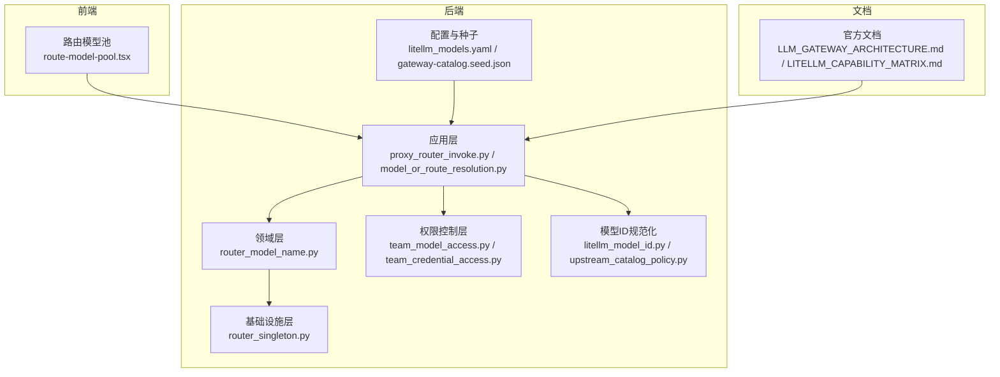
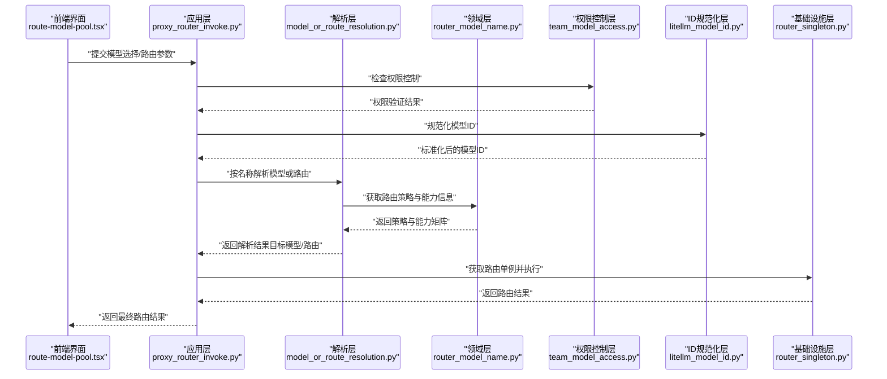
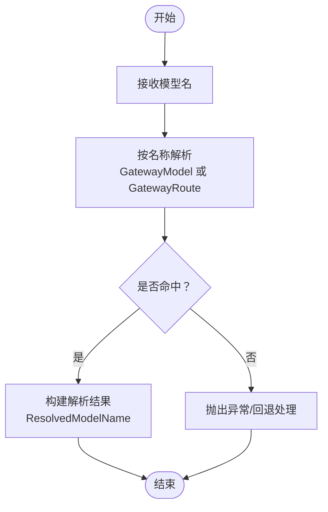
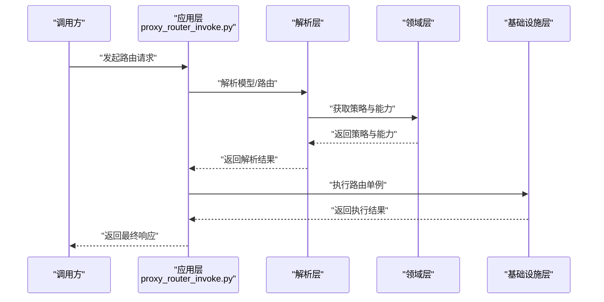
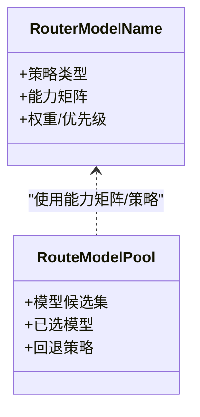
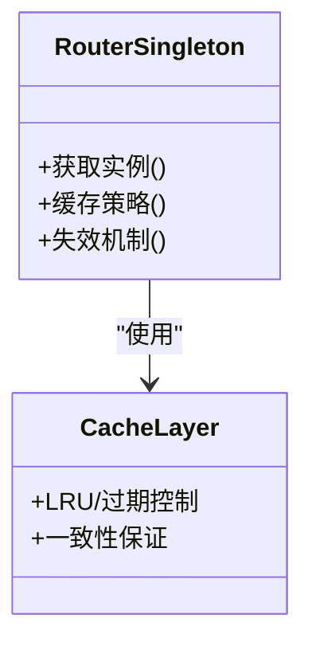
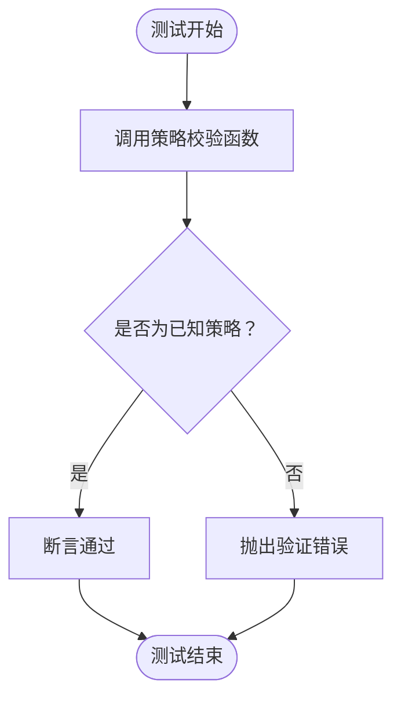
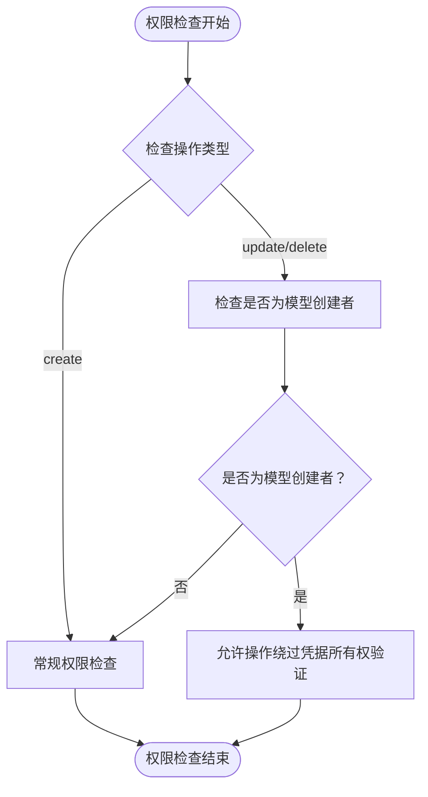
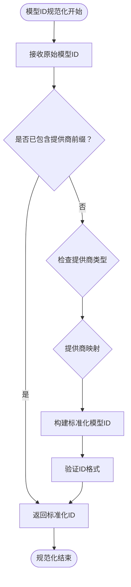
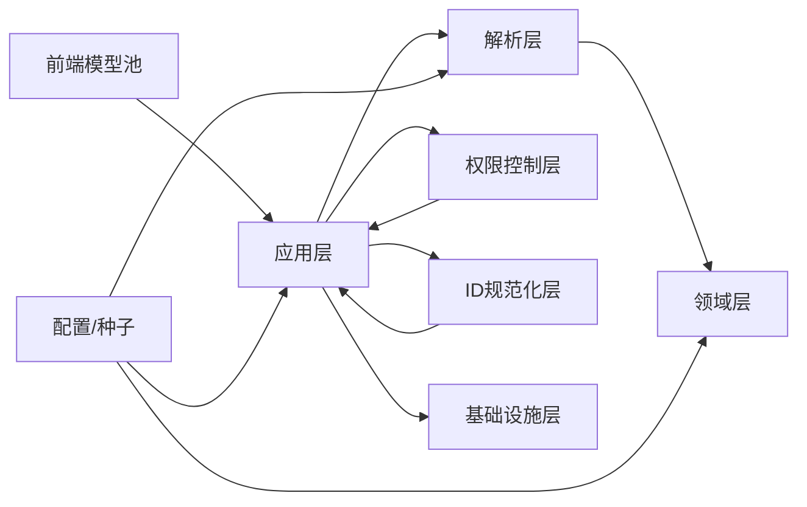

# 模型路由系统

<cite>
**本文引用的文件**
- [proxy_router_invoke.py](file://backend/domains/gateway/application/proxy_router_invoke.py)
- [model_or_route_resolution.py](file://backend/domains/gateway/application/model_or_route_resolution.py)
- [test_routing_strategy_validation.py](file://backend/tests/unit/gateway/test_routing_strategy_validation.py)
- [router_model_name.py](file://backend/domains/gateway/domain/router_model_name.py)
- [router_singleton.py](file://backend/domains/gateway/infrastructure/router_singleton.py)
- [route-model-pool.tsx](file://frontend/src/features/gateway-models/routes/route-model-pool.tsx)
- [litellm_models.yaml](file://backend/config/litellm_models.yaml)
- [gateway-catalog.seed.json](file://backend/seeds/gateway-catalog.seed.json)
- [team_model_access.py](file://backend/domains/gateway/domain/policies/team_model_access.py)
- [model_writes.py](file://backend/domains/gateway/application/management/write_modules/model_writes.py)
- [litellm_model_id.py](file://backend/domains/gateway/domain/litellm_model_id.py)
- [upstream_catalog_policy.py](file://backend/domains/gateway/domain/upstream_catalog_policy.py)
- [team_credential_access.py](file://backend/domains/gateway/domain/team_credential_access.py)
- [20260614_gateway_models_created_by_user_id.py](file://backend/alembic/versions/20260614_gateway_models_created_by_user_id.py)
- [GATEWAY_CURSOR_CLAUDE_CODE.md](file://backend/docs/gateway/GATEWAY_CURSOR_CLAUDE_CODE.md)
- [LLM_GATEWAY_ARCHITECTURE.md](file://backend/docs/gateway/LLM_GATEWAY_ARCHITECTURE.md)
- [LITELLM_CAPABILITY_MATRIX.md](file://backend/docs/gateway/LITELLM_CAPABILITY_MATRIX.md)
- [LITELLM_SUPPORTED_MODELS.md](file://backend/docs/gateway/LITELLM_SUPPORTED_MODELS.md)
- [README.md](file://backend/README.md)
</cite>

## 更新摘要
**变更内容**
- 新增模型创建者权限检查机制，允许模型原始创建者在更新和删除操作时绕过凭据所有权验证
- 实现自动模型ID规范化功能，确保OpenAI模型ID格式的一致性
- 增强权限控制策略，支持更细粒度的模型管理权限管理
- 扩展模型ID标准化处理，支持多种提供商的模型标识格式

## 目录
1. [引言](#引言)
2. [项目结构](#项目结构)
3. [核心组件](#核心组件)
4. [架构总览](#架构总览)
5. [详细组件分析](#详细组件分析)
6. [权限控制系统](#权限控制系统)
7. [模型ID规范化系统](#模型id规范化系统)
8. [依赖关系分析](#依赖关系分析)
9. [性能考量](#性能考量)
10. [故障排查指南](#故障排查指南)
11. [结论](#结论)
12. [附录](#附录)

## 引言
本文件面向模型路由系统，围绕"模型选择算法与路由决策机制"、"路由策略实现（静态/动态/智能）"、"模型目录管理"、"路由缓存与性能优化"、"监控与统计"、"配置灵活性（优先级/权重/条件）"、"调试与故障排查"以及"扩展性与可维护性"等方面进行系统化技术说明。文档以仓库中实际存在的后端应用层、领域层与基础设施层代码为依据，并结合前端路由池组件与官方文档资料，形成从概念到实现的完整说明。

**更新重点**：本次更新重点关注权限控制增强和模型ID规范化两个核心功能的集成，这些变更显著提升了系统的安全性和数据一致性。

## 项目结构
后端采用分层架构：应用层负责业务编排与路由策略校验；领域层定义路由模型与策略；基础设施层提供单例路由实例与持久化支持；前端提供路由模型池选择界面。配置方面通过 YAML 与种子数据管理模型能力矩阵与初始目录。

**图表来源**
- [proxy_router_invoke.py](file://backend/domains/gateway/application/proxy_router_invoke.py)
- [model_or_route_resolution.py](file://backend/domains/gateway/application/model_or_route_resolution.py)
- [router_model_name.py](file://backend/domains/gateway/domain/router_model_name.py)
- [router_singleton.py](file://backend/domains/gateway/infrastructure/router_singleton.py)
- [route-model-pool.tsx](file://frontend/src/features/gateway-models/routes/route-model-pool.tsx)
- [litellm_models.yaml](file://backend/config/litellm_models.yaml)
- [gateway-catalog.seed.json](file://backend/seeds/gateway-catalog.seed.json)
- [team_model_access.py](file://backend/domains/gateway/domain/policies/team_model_access.py)
- [litellm_model_id.py](file://backend/domains/gateway/domain/litellm_model_id.py)
- [upstream_catalog_policy.py](file://backend/domains/gateway/domain/upstream_catalog_policy.py)
- [team_credential_access.py](file://backend/domains/gateway/domain/team_credential_access.py)
- [LLM_GATEWAY_ARCHITECTURE.md](file://backend/docs/gateway/LLM_GATEWAY_ARCHITECTURE.md)
- [LITELLM_CAPABILITY_MATRIX.md](file://backend/docs/gateway/LITELLM_CAPABILITY_MATRIX.md)

**章节来源**
- [README.md](file://backend/README.md)
- [LLM_GATEWAY_ARCHITECTURE.md](file://backend/docs/gateway/LLM_GATEWAY_ARCHITECTURE.md)

## 核心组件
- 应用层路由编排与解析
  - 路由调用入口与上下文注入：[proxy_router_invoke.py](file://backend/domains/gateway/application/proxy_router_invoke.py)
  - 模型或路由解析（根据名称解析到具体模型或路由主选模型）：[model_or_route_resolution.py](file://backend/domains/gateway/application/model_or_route_resolution.py)
  - 路由策略校验（如"按成本路由"等）：[test_routing_strategy_validation.py](file://backend/tests/unit/gateway/test_routing_strategy_validation.py)
- 领域层路由模型与策略
  - 路由模型命名与策略定义：[router_model_name.py](file://backend/domains/gateway/domain/router_model_name.py)
- 基础设施层路由单例与缓存
  - 路由单例与缓存策略：[router_singleton.py](file://backend/domains/gateway/infrastructure/router_singleton.py)
- 权限控制层
  - 团队模型写权限控制：[team_model_access.py](file://backend/domains/gateway/domain/policies/team_model_access.py)
  - 团队凭据访问控制：[team_credential_access.py](file://backend/domains/gateway/domain/team_credential_access.py)
- 模型ID规范化层
  - LiteLLM模型ID构建：[litellm_model_id.py](file://backend/domains/gateway/domain/litellm_model_id.py)
  - 上游模型别名派生：[upstream_catalog_policy.py](file://backend/domains/gateway/domain/upstream_catalog_policy.py)
- 前端路由模型池
  - 模型选择与回退策略展示：[route-model-pool.tsx](file://frontend/src/features/gateway-models/routes/route-model-pool.tsx)
- 配置与模型目录
  - LiteLLM 模型能力矩阵与支持列表：[litellm_models.yaml](file://backend/config/litellm_models.yaml)
  - 网关模型目录种子数据：[gateway-catalog.seed.json](file://backend/seeds/gateway-catalog.seed.json)

**章节来源**
- [proxy_router_invoke.py](file://backend/domains/gateway/application/proxy_router_invoke.py)
- [model_or_route_resolution.py](file://backend/domains/gateway/application/model_or_route_resolution.py)
- [test_routing_strategy_validation.py](file://backend/tests/unit/gateway/test_routing_strategy_validation.py)
- [router_model_name.py](file://backend/domains/gateway/domain/router_model_name.py)
- [router_singleton.py](file://backend/domains/gateway/infrastructure/router_singleton.py)
- [route-model-pool.tsx](file://frontend/src/features/gateway-models/routes/route-model-pool.tsx)
- [litellm_models.yaml](file://backend/config/litellm_models.yaml)
- [gateway-catalog.seed.json](file://backend/seeds/gateway-catalog.seed.json)
- [team_model_access.py](file://backend/domains/gateway/domain/policies/team_model_access.py)
- [litellm_model_id.py](file://backend/domains/gateway/domain/litellm_model_id.py)
- [upstream_catalog_policy.py](file://backend/domains/gateway/domain/upstream_catalog_policy.py)
- [team_credential_access.py](file://backend/domains/gateway/domain/team_credential_access.py)

## 架构总览
系统采用"应用层编排 + 领域层策略 + 基础设施层缓存"的三层结构。前端通过模型池选择影响路由策略，应用层在请求进入时完成模型解析与路由决策，领域层提供策略抽象，基础设施层提供单例与缓存，确保高并发下的稳定性与一致性。新增的权限控制层和模型ID规范化层为系统提供了更强的安全保障和数据一致性。

**图表来源**
- [proxy_router_invoke.py](file://backend/domains/gateway/application/proxy_router_invoke.py)
- [model_or_route_resolution.py](file://backend/domains/gateway/application/model_or_route_resolution.py)
- [router_model_name.py](file://backend/domains/gateway/domain/router_model_name.py)
- [team_model_access.py](file://backend/domains/gateway/domain/policies/team_model_access.py)
- [litellm_model_id.py](file://backend/domains/gateway/domain/litellm_model_id.py)
- [router_singleton.py](file://backend/domains/gateway/infrastructure/router_singleton.py)
- [route-model-pool.tsx](file://frontend/src/features/gateway-models/routes/route-model-pool.tsx)

## 详细组件分析

### 组件A：模型或路由解析（按名称）
该组件负责将客户端提供的模型名映射到具体的网关模型或路由主选模型，同时为后续能力校验与单价归因提供基础。

**图表来源**
- [model_or_route_resolution.py](file://backend/domains/gateway/application/model_or_route_resolution.py)

**章节来源**
- [model_or_route_resolution.py](file://backend/domains/gateway/application/model_or_route_resolution.py)

### 组件B：路由调用入口与上下文
应用层作为路由调用的编排者，负责注入上下文、触发解析与执行，并对结果进行统一处理。

**图表来源**
- [proxy_router_invoke.py](file://backend/domains/gateway/application/proxy_router_invoke.py)
- [model_or_route_resolution.py](file://backend/domains/gateway/application/model_or_route_resolution.py)
- [router_model_name.py](file://backend/domains/gateway/domain/router_model_name.py)
- [router_singleton.py](file://backend/domains/gateway/infrastructure/router_singleton.py)

**章节来源**
- [proxy_router_invoke.py](file://backend/domains/gateway/application/proxy_router_invoke.py)

### 组件C：路由策略与能力矩阵
领域层定义路由策略与能力矩阵，前端模型池组件提供选择与回退逻辑，共同决定最终路由决策。

**图表来源**
- [router_model_name.py](file://backend/domains/gateway/domain/router_model_name.py)
- [route-model-pool.tsx](file://frontend/src/features/gateway-models/routes/route-model-pool.tsx)

**章节来源**
- [router_model_name.py](file://backend/domains/gateway/domain/router_model_name.py)
- [route-model-pool.tsx](file://frontend/src/features/gateway-models/routes/route-model-pool.tsx)

### 组件D：路由单例与缓存
基础设施层提供路由单例与缓存策略，确保高并发场景下的性能与一致性。

**图表来源**
- [router_singleton.py](file://backend/domains/gateway/infrastructure/router_singleton.py)

**章节来源**
- [router_singleton.py](file://backend/domains/gateway/infrastructure/router_singleton.py)

### 组件E：路由策略校验
单元测试覆盖了路由策略的合法性校验，确保仅接受已知策略类型。

**图表来源**
- [test_routing_strategy_validation.py](file://backend/tests/unit/gateway/test_routing_strategy_validation.py)

**章节来源**
- [test_routing_strategy_validation.py](file://backend/tests/unit/gateway/test_routing_strategy_validation.py)

## 权限控制系统

### 模型创建者权限检查机制
系统新增了模型创建者权限检查机制，允许模型原始创建者在更新和删除操作时绕过凭据所有权验证，这一机制通过以下组件实现：

**图表来源**
- [team_model_access.py](file://backend/domains/gateway/domain/policies/team_model_access.py)
- [model_writes.py](file://backend/domains/gateway/application/management/write_modules/model_writes.py)

### 权限控制策略
权限控制策略基于以下核心原则：
- **创建者特权**：模型创建者对其创建的模型拥有完全管理权限
- **凭据所有权**：团队凭据的所有者对其绑定的模型拥有管理权限
- **管理员权限**：平台管理员拥有系统级管理权限
- **遗留凭据兼容**：支持历史遗留凭据的特殊权限处理

**章节来源**
- [team_model_access.py](file://backend/domains/gateway/domain/policies/team_model_access.py)
- [team_credential_access.py](file://backend/domains/gateway/domain/team_credential_access.py)
- [model_writes.py](file://backend/domains/gateway/application/management/write_modules/model_writes.py)

## 模型ID规范化系统

### 自动模型ID规范化功能
系统实现了自动模型ID规范化功能，确保OpenAI模型ID格式的一致性，主要通过以下组件实现：

**图表来源**
- [litellm_model_id.py](file://backend/domains/gateway/domain/litellm_model_id.py)
- [model_writes.py](file://backend/domains/gateway/application/management/write_modules/model_writes.py)

### 支持的提供商前缀
系统支持多种提供商的模型ID前缀规范化：
- **OpenAI**：`openai/gpt-4o-mini`
- **Anthropic**：`anthropic/claude-3-5-sonnet-20241022`
- **DashScope**：`dashscope/qwen-turbo`
- **DeepSeek**：`deepseek/deepseek-chat`
- **Volcengine**：`volcengine/volcengine-chat`
- **Moonshot**：`moonshot/moonshot-v1-8k`
- **Zhipuai**：`zai/chatglm-lite`

**章节来源**
- [litellm_model_id.py](file://backend/domains/gateway/domain/litellm_model_id.py)
- [model_writes.py](file://backend/domains/gateway/application/management/write_modules/model_writes.py)
- [upstream_catalog_policy.py](file://backend/domains/gateway/domain/upstream_catalog_policy.py)

## 依赖关系分析
- 应用层依赖解析层与领域层，解析层依赖领域层的能力矩阵与策略定义。
- 权限控制层为应用层提供安全访问控制，确保只有授权用户才能执行模型管理操作。
- 模型ID规范化层为应用层提供数据标准化服务，确保模型ID格式的一致性。
- 基础设施层为应用层提供单例与缓存，降低重复初始化与提升查询性能。
- 前端通过模型池组件影响应用层的路由决策输入。
- 配置文件与种子数据为系统提供初始能力矩阵与模型目录。

**图表来源**
- [proxy_router_invoke.py](file://backend/domains/gateway/application/proxy_router_invoke.py)
- [model_or_route_resolution.py](file://backend/domains/gateway/application/model_or_route_resolution.py)
- [router_model_name.py](file://backend/domains/gateway/domain/router_model_name.py)
- [team_model_access.py](file://backend/domains/gateway/domain/policies/team_model_access.py)
- [litellm_model_id.py](file://backend/domains/gateway/domain/litellm_model_id.py)
- [router_singleton.py](file://backend/domains/gateway/infrastructure/router_singleton.py)
- [route-model-pool.tsx](file://frontend/src/features/gateway-models/routes/route-model-pool.tsx)
- [litellm_models.yaml](file://backend/config/litellm_models.yaml)
- [gateway-catalog.seed.json](file://backend/seeds/gateway-catalog.seed.json)

**章节来源**
- [proxy_router_invoke.py](file://backend/domains/gateway/application/proxy_router_invoke.py)
- [model_or_route_resolution.py](file://backend/domains/gateway/application/model_or_route_resolution.py)
- [router_model_name.py](file://backend/domains/gateway/domain/router_model_name.py)
- [team_model_access.py](file://backend/domains/gateway/domain/policies/team_model_access.py)
- [litellm_model_id.py](file://backend/domains/gateway/domain/litellm_model_id.py)
- [router_singleton.py](file://backend/domains/gateway/infrastructure/router_singleton.py)
- [route-model-pool.tsx](file://frontend/src/features/gateway-models/routes/route-model-pool.tsx)
- [litellm_models.yaml](file://backend/config/litellm_models.yaml)
- [gateway-catalog.seed.json](file://backend/seeds/gateway-catalog.seed.json)

## 性能考量
- 缓存策略
  - 使用单例与缓存层减少重复初始化与查询开销。
  - 结合 LRU/过期控制与一致性保证，避免脏读与雪崩。
- 并发与稳定性
  - 单例模式在高并发下提供稳定访问路径。
  - 解析层与应用层分离，降低耦合度，便于横向扩展。
- 权限检查优化
  - 权限检查采用快速路径优化，避免不必要的数据库查询。
  - 创建者特权检查通过内存判断实现，减少数据库访问。
- 模型ID规范化优化
  - ID规范化采用纯函数实现，避免I/O操作。
  - 支持缓存常见提供商前缀映射，提升处理效率。
- 配置驱动的性能优化
  - LiteLLM 能力矩阵与模型支持列表帮助快速过滤不兼容模型，减少无效尝试。
- 监控与统计
  - 可在基础设施层埋点，记录路由成功率、延迟分布与使用量统计，支撑后续优化。

## 故障排查指南
- 路由策略校验失败
  - 现象：策略类型不受支持导致校验异常。
  - 排查：确认策略名称是否在允许集合内，参考策略校验测试用例。
  - 参考：[test_routing_strategy_validation.py](file://backend/tests/unit/gateway/test_routing_strategy_validation.py)
- 模型解析失败
  - 现象：按名称无法解析到模型或路由。
  - 排查：检查模型目录与名称映射，核对解析流程与异常分支。
  - 参考：[model_or_route_resolution.py](file://backend/domains/gateway/application/model_or_route_resolution.py)
- 路由单例异常
  - 现象：并发场景下出现不稳定或缓存不一致。
  - 排查：检查单例初始化与缓存失效策略，确保一致性。
  - 参考：[router_singleton.py](file://backend/domains/gateway/infrastructure/router_singleton.py)
- 权限控制异常
  - 现象：模型创建者无法更新或删除自己创建的模型。
  - 排查：检查模型创建者字段是否正确设置，验证权限检查逻辑。
  - 参考：[team_model_access.py](file://backend/domains/gateway/domain/policies/team_model_access.py)、[20260614_gateway_models_created_by_user_id.py](file://backend/alembic/versions/20260614_gateway_models_created_by_user_id.py)
- 模型ID规范化失败
  - 现象：模型ID格式不正确导致路由失败。
  - 排查：检查提供商前缀映射，验证ID规范化逻辑。
  - 参考：[litellm_model_id.py](file://backend/domains/gateway/domain/litellm_model_id.py)
- 前端模型池选择问题
  - 现象：模型池不可用或回退策略不符合预期。
  - 排查：核对候选集、已选模型与回退逻辑，确保与后端策略一致。
  - 参考：[route-model-pool.tsx](file://frontend/src/features/gateway-models/routes/route-model-pool.tsx)
- 配置与目录问题
  - 现象：模型能力缺失或目录不完整。
  - 排查：核对 LiteLLM 能力矩阵与种子数据，确保初始目录完整。
  - 参考：[litellm_models.yaml](file://backend/config/litellm_models.yaml)、[gateway-catalog.seed.json](file://backend/seeds/gateway-catalog.seed.json)

**章节来源**
- [test_routing_strategy_validation.py](file://backend/tests/unit/gateway/test_routing_strategy_validation.py)
- [model_or_route_resolution.py](file://backend/domains/gateway/application/model_or_route_resolution.py)
- [router_singleton.py](file://backend/domains/gateway/infrastructure/router_singleton.py)
- [team_model_access.py](file://backend/domains/gateway/domain/policies/team_model_access.py)
- [litellm_model_id.py](file://backend/domains/gateway/domain/litellm_model_id.py)
- [route-model-pool.tsx](file://frontend/src/features/gateway-models/routes/route-model-pool.tsx)
- [litellm_models.yaml](file://backend/config/litellm_models.yaml)
- [gateway-catalog.seed.json](file://backend/seeds/gateway-catalog.seed.json)
- [20260614_gateway_models_created_by_user_id.py](file://backend/alembic/versions/20260614_gateway_models_created_by_user_id.py)

## 结论
模型路由系统通过"应用层编排 + 领域层策略 + 基础设施层缓存"的分层设计，实现了从模型解析、策略校验到执行落地的完整闭环。新增的权限控制层和模型ID规范化层显著提升了系统的安全性、数据一致性和可维护性。前端模型池与配置/种子数据进一步增强了系统的灵活性。未来可在基础设施层完善监控埋点与统计分析，持续优化路由成功率与延迟表现。

## 附录
- 官方文档与能力矩阵
  - 网关架构设计：[LLM_GATEWAY_ARCHITECTURE.md](file://backend/docs/gateway/LLM_GATEWAY_ARCHITECTURE.md)
  - LiteLLM 能力矩阵：[LITELLM_CAPABILITY_MATRIX.md](file://backend/docs/gateway/LITELLM_CAPABILITY_MATRIX.md)
  - 支持模型列表：[LITELLM_SUPPORTED_MODELS.md](file://backend/docs/gateway/LITELLM_SUPPORTED_MODELS.md)
  - Claude 网关相关说明：[GATEWAY_CURSOR_CLAUDE_CODE.md](file://backend/docs/gateway/GATEWAY_CURSOR_CLAUDE_CODE.md)
- 数据库迁移脚本
  - 添加模型创建者字段：[20260614_gateway_models_created_by_user_id.py](file://backend/alembic/versions/20260614_gateway_models_created_by_user_id.py)

**章节来源**
- [LLM_GATEWAY_ARCHITECTURE.md](file://backend/docs/gateway/LLM_GATEWAY_ARCHITECTURE.md)
- [LITELLM_CAPABILITY_MATRIX.md](file://backend/docs/gateway/LITELLM_CAPABILITY_MATRIX.md)
- [LITELLM_SUPPORTED_MODELS.md](file://backend/docs/gateway/LITELLM_SUPPORTED_MODELS.md)
- [GATEWAY_CURSOR_CLAUDE_CODE.md](file://backend/docs/gateway/GATEWAY_CURSOR_CLAUDE_CODE.md)
- [20260614_gateway_models_created_by_user_id.py](file://backend/alembic/versions/20260614_gateway_models_created_by_user_id.py)