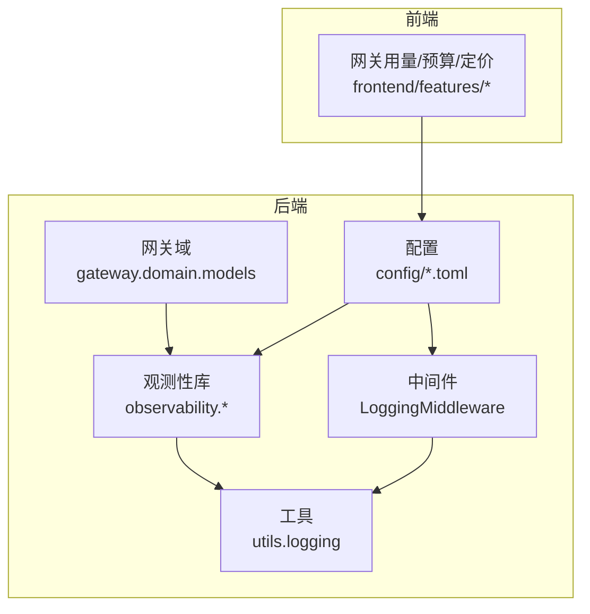
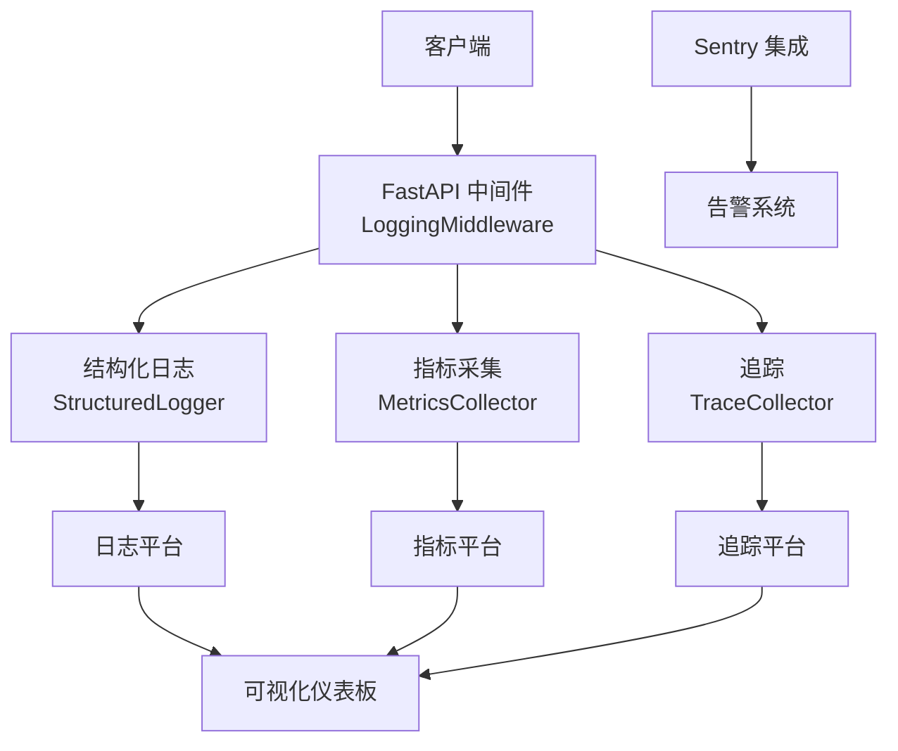
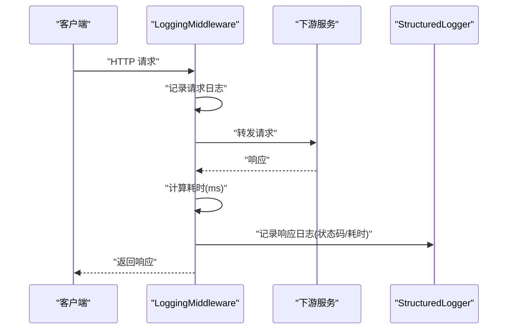
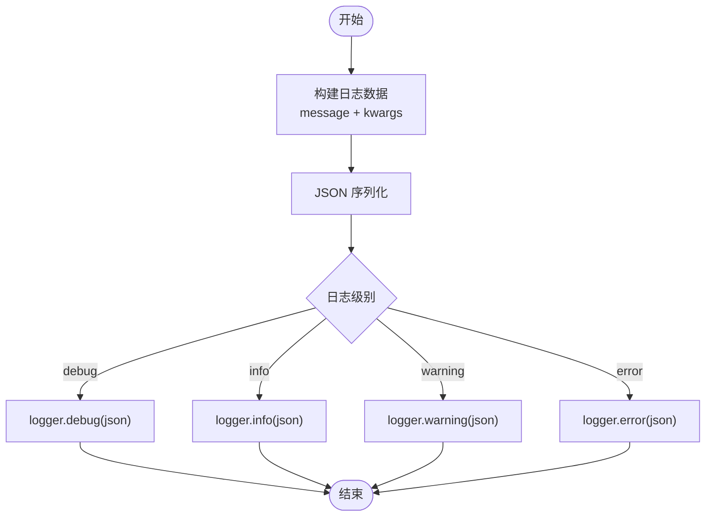
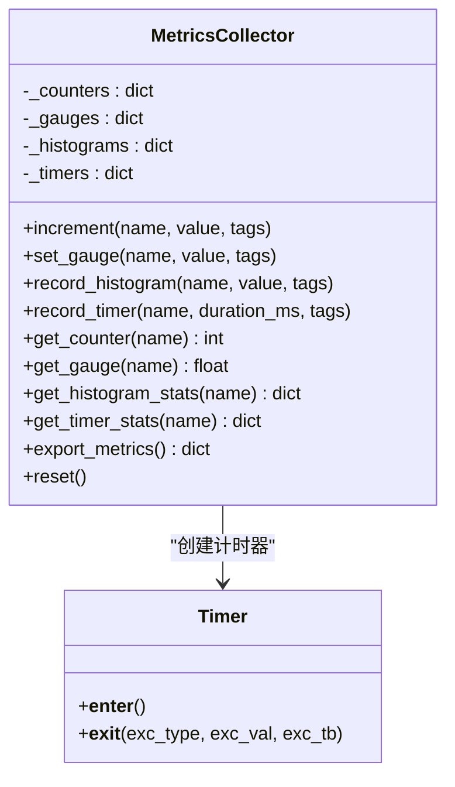
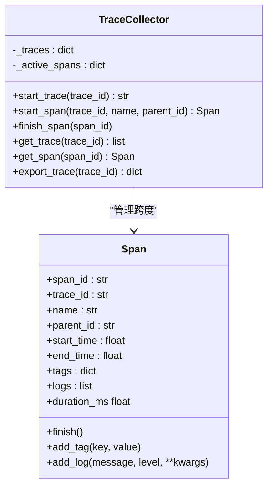
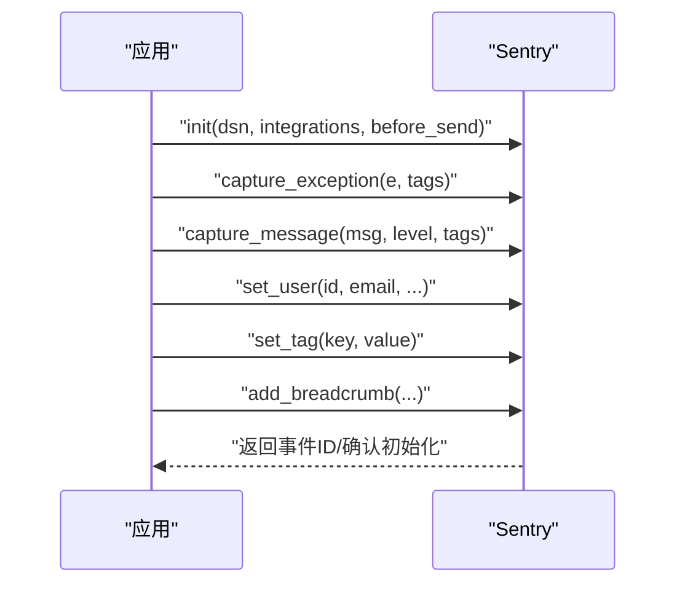
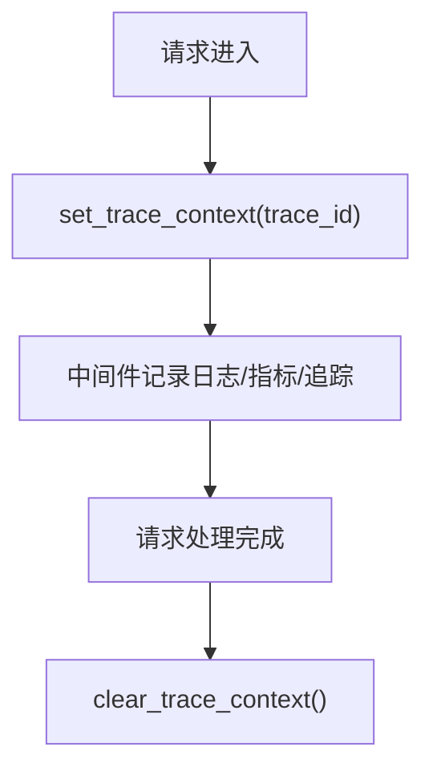
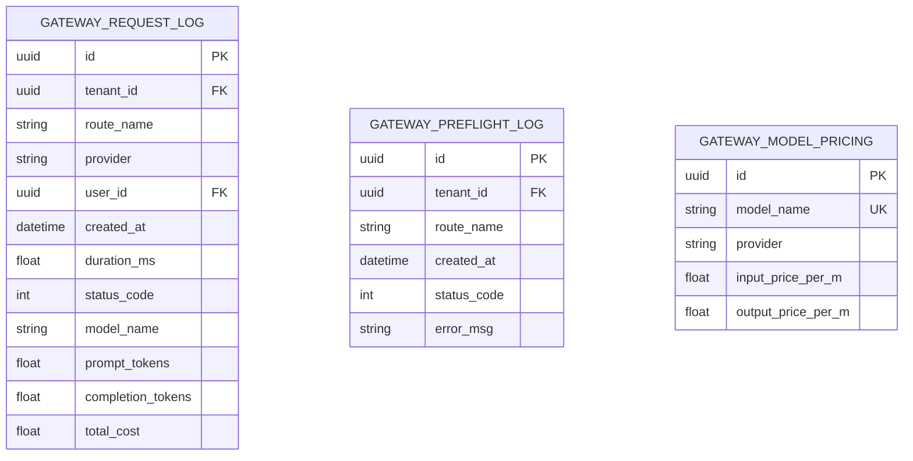
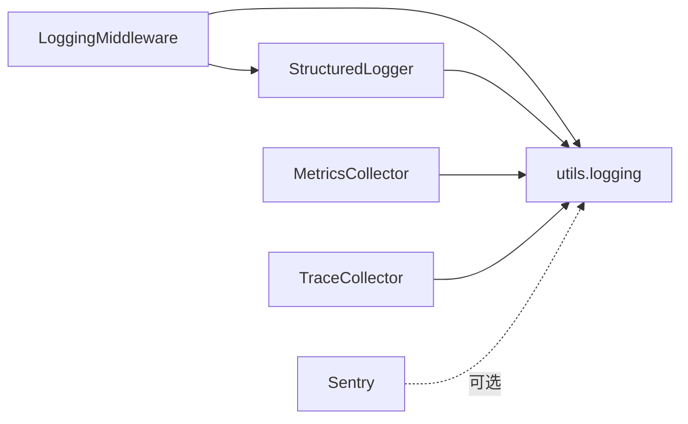

# 监控与日志

<cite>
**本文引用的文件**
- [backend/libs/middleware/logging.py](file://backend/libs/middleware/logging.py)
- [backend/utils/logging.py](file://backend/utils/logging.py)
- [backend/libs/observability/logging.py](file://backend/libs/observability/logging.py)
- [backend/libs/observability/metrics.py](file://backend/libs/observability/metrics.py)
- [backend/libs/observability/tracing.py](file://backend/libs/observability/tracing.py)
- [backend/libs/observability/sentry.py](file://backend/libs/observability/sentry.py)
- [backend/docs/gateway/GATEWAY_PRICING_AND_LITELLM_COST.md](file://backend/docs/gateway/GATEWAY_PRICING_AND_LITELLM_COST.md)
- [backend/docs/gateway/LLM_GATEWAY_ARCHITECTURE.md](file://backend/docs/gateway/LLM_GATEWAY_ARCHITECTURE.md)
- [backend/docs/logging.md](file://backend/docs/logging.md)
- [backend/config/app.toml](file://backend/config/app.toml)
- [backend/config/app.development.toml](file://backend/config/app.development.toml)
- [backend/config/app.production.toml](file://backend/config/app.production.toml)
- [backend/config/app.staging.toml](file://backend/config/app.staging.toml)
- [backend/config/environments/local-dev.toml](file://backend/config/environments/local-dev.toml)
- [backend/config/environments/docker-dev.toml](file://backend/config/environments/docker-dev.toml)
- [backend/config/environments/docker-prod.toml](file://backend/config/environments/docker-prod.toml)
- [backend/config/environments/k8s-prod.toml](file://backend/config/environments/k8s-prod.toml)
- [backend/scripts/run_dev_server.py](file://backend/scripts/run_dev_server.py)
- [backend/scripts/run_server.py](file://backend/scripts/run_server.py)
- [backend/bootstrap/main.py](file://backend/bootstrap/main.py)
- [backend/bootstrap/config.py](file://backend/bootstrap/config.py)
- [backend/bootstrap/event_loop.py](file://backend/bootstrap/event_loop.py)
- [backend/domains/gateway/application/services/gateway_service.py](file://backend/domains/gateway/application/services/gateway_service.py)
- [backend/domains/gateway/infrastructure/persistence/gateway_log_repository.py](file://backend/domains/gateway/infrastructure/persistence/gateway_log_repository.py)
- [backend/domains/gateway/domain/models/gateway_request_log.py](file://backend/domains/gateway/domain/models/gateway_request_log.py)
- [backend/domains/gateway/domain/models/gateway_preflight_log.py](file://backend/domains/gateway/domain/models/gateway_preflight_log.py)
- [backend/domains/gateway/domain/models/gateway_model_pricing.py](file://backend/domains/gateway/domain/models/gateway_model_pricing.py)
- [backend/alembic/versions/20260508_add_gateway_tables.py](file://backend/alembic/versions/20260508_add_gateway_tables.py)
- [backend/alembic/versions/20260520_gateway_request_log_client.py](file://backend/alembic/versions/20260520_gateway_request_log_client.py)
- [backend/alembic/versions/20260527_slow_sql_hotpath_indexes.py](file://backend/alembic/versions/20260527_slow_sql_hotpath_indexes.py)
- [backend/alembic/versions/20260528_backfill_request_log_user.py](file://backend/alembic/versions/20260528_backfill_request_log_user.py)
- [backend/alembic/versions/20260528_backfill_request_log_provider_v2.py](file://backend/alembic/versions/20260528_backfill_request_log_provider_v2.py)
- [backend/alembic/versions/20260607_gateway_request_log_tenant_route_time.py](file://backend/alembic/versions/20260607_gateway_request_log_tenant_route_time.py)
- [backend/alembic/versions/20260610_delete_unattributed_probe_request_logs.py](file://backend/alembic/versions/20260610_delete_unattributed_probe_request_logs.py)
- [backend/scripts/inspect_gateway_logs.py](file://backend/scripts/inspect_gateway_logs.py)
- [backend/scripts/probe_dashscope_embedding.py](file://backend/scripts/probe_dashscope_embedding.py)
- [backend/scripts/test_gateway_proxy.py](file://backend/scripts/test_gateway_proxy.py)
- [backend/tests/unit/gateway/test_gateway_service.py](file://backend/tests/unit/gateway/test_gateway_service.py)
- [backend/tests/integration/api/test_gateway_api.py](file://backend/tests/integration/api/test_gateway_api.py)
- [backend/frontend/src/features/gateway-usage](file://backend/frontend/src/features/gateway-usage)
- [backend/frontend/src/features/gateway-budget](file://backend/frontend/src/features/gateway-budget)
- [backend/frontend/src/features/gateway-pricing](file://backend/frontend/src/features/gateway-pricing)
</cite>

## 目录
1. [简介](#简介)
2. [项目结构](#项目结构)
3. [核心组件](#核心组件)
4. [架构总览](#架构总览)
5. [详细组件分析](#详细组件分析)
6. [依赖分析](#依赖分析)
7. [性能考量](#性能考量)
8. [故障排查指南](#故障排查指南)
9. [结论](#结论)
10. [附录](#附录)

## 简介
本技术文档面向网关监控与日志系统，围绕请求日志收集与处理、性能监控指标、成本日志与分析、告警架构、监控数据存储与查询、可视化仪表板、配置示例与运维最佳实践、隐私与合规、以及扩展性与可维护性进行系统化阐述。文档以仓库中现有的日志中间件、结构化日志、指标采集、分布式追踪、Sentry 集成等模块为基础，结合网关领域模型与数据库迁移脚本，给出可落地的实现路径与最佳实践。

## 项目结构
监控与日志相关能力主要分布在以下区域：
- 中间件层：请求日志中间件
- 工具层：日志工具与上下文追踪
- 观测性库：结构化日志、指标、追踪、Sentry 集成
- 网关域：请求/预检日志模型与持久化
- 配置与环境：应用配置与多环境配置
- 文档与脚本：网关架构与成本文档、日志检查脚本
- 前端：用量、预算、定价等可视化功能入口

**图表来源**
- [backend/libs/middleware/logging.py:18-59](file://backend/libs/middleware/logging.py#L18-L59)
- [backend/utils/logging.py:20-86](file://backend/utils/logging.py#L20-L86)
- [backend/libs/observability/logging.py:15-93](file://backend/libs/observability/logging.py#L15-L93)
- [backend/libs/observability/metrics.py:16-148](file://backend/libs/observability/metrics.py#L16-L148)
- [backend/libs/observability/tracing.py:62-180](file://backend/libs/observability/tracing.py#L62-L180)
- [backend/libs/observability/sentry.py:103-179](file://backend/libs/observability/sentry.py#L103-L179)
- [backend/domains/gateway/domain/models/gateway_request_log.py](file://backend/domains/gateway/domain/models/gateway_request_log.py)
- [backend/config/app.toml](file://backend/config/app.toml)

**章节来源**
- [backend/libs/middleware/logging.py:1-59](file://backend/libs/middleware/logging.py#L1-L59)
- [backend/utils/logging.py:1-86](file://backend/utils/logging.py#L1-L86)
- [backend/libs/observability/logging.py:1-93](file://backend/libs/observability/logging.py#L1-L93)
- [backend/libs/observability/metrics.py:1-148](file://backend/libs/observability/metrics.py#L1-L148)
- [backend/libs/observability/tracing.py:1-180](file://backend/libs/observability/tracing.py#L1-L180)
- [backend/libs/observability/sentry.py:1-316](file://backend/libs/observability/sentry.py#L1-L316)
- [backend/config/app.toml](file://backend/config/app.toml)

## 核心组件
- 请求日志中间件：统一记录请求方法、路径、客户端 IP，以及响应状态码与耗时
- 结构化日志：输出 JSON 格式日志，便于下游日志平台解析与检索
- 指标采集：计数器、仪表、直方图、计时器，支持导出与聚合
- 分布式追踪：Span/Trace 结构，记录跨度、标签与日志，支持导出
- Sentry 集成：异常捕获、脱敏、采样与用户上下文设置
- 网关日志模型：请求日志、预检日志、模型定价等数据模型与迁移脚本

**章节来源**
- [backend/libs/middleware/logging.py:18-59](file://backend/libs/middleware/logging.py#L18-L59)
- [backend/libs/observability/logging.py:15-93](file://backend/libs/observability/logging.py#L15-L93)
- [backend/libs/observability/metrics.py:16-148](file://backend/libs/observability/metrics.py#L16-L148)
- [backend/libs/observability/tracing.py:62-180](file://backend/libs/observability/tracing.py#L62-L180)
- [backend/libs/observability/sentry.py:103-179](file://backend/libs/observability/sentry.py#L103-L179)
- [backend/domains/gateway/domain/models/gateway_request_log.py](file://backend/domains/gateway/domain/models/gateway_request_log.py)
- [backend/domains/gateway/domain/models/gateway_preflight_log.py](file://backend/domains/gateway/domain/models/gateway_preflight_log.py)
- [backend/domains/gateway/domain/models/gateway_model_pricing.py](file://backend/domains/gateway/domain/models/gateway_model_pricing.py)

## 架构总览
整体监控与日志架构由“请求采集—结构化输出—指标与追踪—告警与可视化”构成，并通过配置驱动在不同环境生效。

**图表来源**
- [backend/libs/middleware/logging.py:21-56](file://backend/libs/middleware/logging.py#L21-L56)
- [backend/libs/observability/logging.py:25-92](file://backend/libs/observability/logging.py#L25-L92)
- [backend/libs/observability/metrics.py:23-127](file://backend/libs/observability/metrics.py#L23-L127)
- [backend/libs/observability/tracing.py:69-179](file://backend/libs/observability/tracing.py#L69-L179)
- [backend/libs/observability/sentry.py:103-179](file://backend/libs/observability/sentry.py#L103-L179)

## 详细组件分析

### 请求日志中间件
- 功能要点
  - 在请求进入与响应返回时分别记录请求与响应信息
  - 记录方法、路径、客户端 IP、状态码、耗时（毫秒）
  - 通过额外字段将结构化数据传递给结构化日志模块
- 数据完整性
  - 通过 extra 字段确保日志字段可被下游解析
  - 耗时计算基于时间戳差值，避免阻塞主流程
- 可扩展性
  - 可在 dispatch 前后增加鉴权、限流、采样等逻辑

**图表来源**
- [backend/libs/middleware/logging.py:21-56](file://backend/libs/middleware/logging.py#L21-L56)
- [backend/libs/observability/logging.py:25-92](file://backend/libs/observability/logging.py#L25-L92)

**章节来源**
- [backend/libs/middleware/logging.py:18-59](file://backend/libs/middleware/logging.py#L18-L59)

### 结构化日志
- 功能要点
  - 将消息与任意键值对序列化为 JSON，便于日志平台检索与聚合
  - 提供事件日志记录接口，统一事件类型与数据结构
- 与中间件配合
  - 中间件将请求/响应元数据作为额外字段传入，结构化日志负责序列化
- 输出格式
  - JSON 字符串，字段包含消息体与业务字段

**图表来源**
- [backend/libs/observability/logging.py:25-92](file://backend/libs/observability/logging.py#L25-L92)

**章节来源**
- [backend/libs/observability/logging.py:15-93](file://backend/libs/observability/logging.py#L15-L93)

### 指标采集（MetricsCollector）
- 指标类型
  - 计数器：累计事件数量
  - 仪表：记录瞬时数值
  - 直方图/计时器：记录分布统计（count/min/max/avg/p50/p95/p99）
- 统计导出
  - 支持导出全部指标，便于定时上报或 HTTP 暴露
- 使用建议
  - 对关键路径（路由、模型调用、错误分类）打点
  - 与中间件结合，记录响应状态码分布与耗时直方图

**图表来源**
- [backend/libs/observability/metrics.py:16-148](file://backend/libs/observability/metrics.py#L16-L148)

**章节来源**
- [backend/libs/observability/metrics.py:16-148](file://backend/libs/observability/metrics.py#L16-L148)

### 分布式追踪（TraceCollector）
- 能力概述
  - 生成 Trace ID 与 Span ID，记录跨度起止时间、标签与日志
  - 支持导出 Trace 用于可视化与回放
- 适用场景
  - 端到端链路追踪、问题定位与性能分析
- 与中间件结合
  - 可在中间件中开启/结束 Span，记录关键节点耗时与上下文

**图表来源**
- [backend/libs/observability/tracing.py:16-179](file://backend/libs/observability/tracing.py#L16-L179)

**章节来源**
- [backend/libs/observability/tracing.py:62-180](file://backend/libs/observability/tracing.py#L62-L180)

### Sentry 集成
- 功能要点
  - 条件初始化（可选依赖），支持采样率控制
  - 请求头与查询参数脱敏，避免敏感信息泄露
  - 异常捕获、消息上报、用户上下文、标签与面包屑
- 隐私与合规
  - 默认关闭默认 PII 发送；脱敏敏感键与头部
- 与日志协同
  - Sentry 事件 ID 可作为追踪线索，与 Trace ID 关联

**图表来源**
- [backend/libs/observability/sentry.py:103-179](file://backend/libs/observability/sentry.py#L103-L179)
- [backend/libs/observability/sentry.py:186-241](file://backend/libs/observability/sentry.py#L186-L241)
- [backend/libs/observability/sentry.py:243-315](file://backend/libs/observability/sentry.py#L243-L315)

**章节来源**
- [backend/libs/observability/sentry.py:103-179](file://backend/libs/observability/sentry.py#L103-L179)
- [backend/libs/observability/sentry.py:186-241](file://backend/libs/observability/sentry.py#L186-L241)
- [backend/libs/observability/sentry.py:243-315](file://backend/libs/observability/sentry.py#L243-L315)

### 请求追踪 ID 生成与上下文注入
- Trace ID 上下文
  - 通过上下文变量保存当前请求的 Trace ID，供日志与追踪使用
  - 提供设置与清理函数，避免泄漏
- 与中间件协作
  - 中间件在请求进入时设置 Trace ID，退出时清理
  - 可与分布式追踪结合，形成端到端链路

**图表来源**
- [backend/utils/logging.py:64-77](file://backend/utils/logging.py#L64-L77)

**章节来源**
- [backend/utils/logging.py:16-77](file://backend/utils/logging.py#L16-L77)

### 请求日志收集与处理（网关域）
- 数据模型
  - 请求日志与预检日志模型，包含租户、路由、时间、提供商、用户等维度
  - 模型定价模型，支撑成本归集与统计
- 存储与迁移
  - 通过 Alembic 迁移脚本创建表与索引，支持回填与维度补充
- 查询与分析
  - 可按时间、租户、路由、模型、状态码等维度聚合与筛选
  - 建议建立热点字段索引，优化慢查询

**图表来源**
- [backend/domains/gateway/domain/models/gateway_request_log.py](file://backend/domains/gateway/domain/models/gateway_request_log.py)
- [backend/domains/gateway/domain/models/gateway_preflight_log.py](file://backend/domains/gateway/domain/models/gateway_preflight_log.py)
- [backend/domains/gateway/domain/models/gateway_model_pricing.py](file://backend/domains/gateway/domain/models/gateway_model_pricing.py)
- [backend/alembic/versions/20260508_add_gateway_tables.py](file://backend/alembic/versions/20260508_add_gateway_tables.py)
- [backend/alembic/versions/20260520_gateway_request_log_client.py](file://backend/alembic/versions/20260520_gateway_request_log_client.py)
- [backend/alembic/versions/20260527_slow_sql_hotpath_indexes.py](file://backend/alembic/versions/20260527_slow_sql_hotpath_indexes.py)
- [backend/alembic/versions/20260528_backfill_request_log_user.py](file://backend/alembic/versions/20260528_backfill_request_log_user.py)
- [backend/alembic/versions/20260528_backfill_request_log_provider_v2.py](file://backend/alembic/versions/20260528_backfill_request_log_provider_v2.py)
- [backend/alembic/versions/20260607_gateway_request_log_tenant_route_time.py](file://backend/alembic/versions/20260607_gateway_request_log_tenant_route_time.py)
- [backend/alembic/versions/20260610_delete_unattributed_probe_request_logs.py](file://backend/alembic/versions/20260610_delete_unattributed_probe_request_logs.py)

**章节来源**
- [backend/domains/gateway/domain/models/gateway_request_log.py](file://backend/domains/gateway/domain/models/gateway_request_log.py)
- [backend/domains/gateway/domain/models/gateway_preflight_log.py](file://backend/domains/gateway/domain/models/gateway_preflight_log.py)
- [backend/domains/gateway/domain/models/gateway_model_pricing.py](file://backend/domains/gateway/domain/models/gateway_model_pricing.py)
- [backend/alembic/versions/20260508_add_gateway_tables.py](file://backend/alembic/versions/20260508_add_gateway_tables.py)
- [backend/alembic/versions/20260520_gateway_request_log_client.py](file://backend/alembic/versions/20260520_gateway_request_log_client.py)
- [backend/alembic/versions/20260527_slow_sql_hotpath_indexes.py](file://backend/alembic/versions/20260527_slow_sql_hotpath_indexes.py)
- [backend/alembic/versions/20260528_backfill_request_log_user.py](file://backend/alembic/versions/20260528_backfill_request_log_user.py)
- [backend/alembic/versions/20260528_backfill_request_log_provider_v2.py](file://backend/alembic/versions/20260528_backfill_request_log_provider_v2.py)
- [backend/alembic/versions/20260607_gateway_request_log_tenant_route_time.py](file://backend/alembic/versions/20260607_gateway_request_log_tenant_route_time.py)
- [backend/alembic/versions/20260610_delete_unattributed_probe_request_logs.py](file://backend/alembic/versions/20260610_delete_unattributed_probe_request_logs.py)

### 成本日志记录与分析
- 成本字段
  - 请求日志包含输入/输出 Token 数与总费用，支持按模型与提供商聚合
- 定价模型
  - 模型定价表提供单价，用于成本归集与报表
- 分析建议
  - 按租户/路由/模型/时间聚合，生成用量与费用报表
  - 结合前端用量/预算/定价功能，提供可视化与阈值告警联动

**章节来源**
- [backend/domains/gateway/domain/models/gateway_request_log.py](file://backend/domains/gateway/domain/models/gateway_request_log.py)
- [backend/domains/gateway/domain/models/gateway_model_pricing.py](file://backend/domains/gateway/domain/models/gateway_model_pricing.py)
- [backend/docs/gateway/GATEWAY_PRICING_AND_LITELLM_COST.md](file://backend/docs/gateway/GATEWAY_PRICING_AND_LITELLM_COST.md)

### 告警系统架构与配置
- 告警来源
  - 指标阈值（错误率、P95/P99 延迟、吞吐量骤降）
  - 日志异常（大量错误、超时）
  - Sentry 事件（异常数激增、关键错误）
- 配置要点
  - 采样率与脱敏策略（Sentry）
  - 指标导出与上报周期
  - 通知渠道与升级策略（需结合外部平台）
- 与可视化联动
  - 仪表板阈值告警示例，触发告警联动

**章节来源**
- [backend/libs/observability/sentry.py:103-179](file://backend/libs/observability/sentry.py#L103-L179)
- [backend/libs/observability/metrics.py:107-119](file://backend/libs/observability/metrics.py#L107-L119)
- [backend/frontend/src/features/gateway-budget](file://backend/frontend/src/features/gateway-budget)
- [backend/frontend/src/features/gateway-usage](file://backend/frontend/src/features/gateway-usage)

### 监控数据存储与查询机制
- 时序数据库与关系库
  - 指标与追踪：适合独立时序/追踪平台（如 Prometheus/OpenTelemetry）
  - 请求日志：建议使用关系库（PostgreSQL）+ 索引优化
- 索引优化
  - 热点字段：created_at、tenant_id、route_name、model_name、status_code
  - 聚合查询：按天/小时分组，建立合适复合索引
- 历史数据分析
  - 建议保留 90-180 天日志，超过生命周期的数据归档至冷存储
  - 对高基数字段（如用户 ID）谨慎建索引，避免索引膨胀

**章节来源**
- [backend/alembic/versions/20260527_slow_sql_hotpath_indexes.py](file://backend/alembic/versions/20260527_slow_sql_hotpath_indexes.py)
- [backend/alembic/versions/20260607_gateway_request_log_tenant_route_time.py](file://backend/alembic/versions/20260607_gateway_request_log_tenant_route_time.py)

### 可视化仪表板设计与实现
- 图表类型
  - 响应时间分布（直方图/P95/P99）、错误率趋势、吞吐量、成本曲线
  - 成本归集（按模型/提供商/租户）
- 实现方式
  - 后端提供指标导出接口，前端通过图表库渲染
  - 前端现有用量/预算/定价功能可作为参考实现
- 实时更新
  - 支持轮询或 WebSocket 推送，结合指标缓存与去抖

**章节来源**
- [backend/frontend/src/features/gateway-usage](file://backend/frontend/src/features/gateway-usage)
- [backend/frontend/src/features/gateway-budget](file://backend/frontend/src/features/gateway-budget)
- [backend/frontend/src/features/gateway-pricing](file://backend/frontend/src/features/gateway-pricing)

## 依赖分析
- 组件耦合
  - 中间件依赖日志工具与结构化日志
  - 指标与追踪依赖日志工具
  - Sentry 为可选集成，不影响核心链路
- 外部依赖
  - 可选：sentry_sdk（Sentry 集成）
  - 必需：FastAPI、Starlette（中间件基础）

**图表来源**
- [backend/libs/middleware/logging.py:13-13](file://backend/libs/middleware/logging.py#L13-L13)
- [backend/libs/observability/logging.py:10-23](file://backend/libs/observability/logging.py#L10-L23)
- [backend/libs/observability/metrics.py:11-13](file://backend/libs/observability/metrics.py#L11-L13)
- [backend/libs/observability/tracing.py:11-13](file://backend/libs/observability/tracing.py#L11-L13)
- [backend/libs/observability/sentry.py:11-22](file://backend/libs/observability/sentry.py#L11-L22)

**章节来源**
- [backend/libs/middleware/logging.py:1-59](file://backend/libs/middleware/logging.py#L1-L59)
- [backend/libs/observability/logging.py:1-93](file://backend/libs/observability/logging.py#L1-L93)
- [backend/libs/observability/metrics.py:1-148](file://backend/libs/observability/metrics.py#L1-L148)
- [backend/libs/observability/tracing.py:1-180](file://backend/libs/observability/tracing.py#L1-L180)
- [backend/libs/observability/sentry.py:1-316](file://backend/libs/observability/sentry.py#L1-L316)

## 性能考量
- 日志与指标开销
  - 结构化日志与指标均为内存数据结构，导出时序列化 JSON，建议批量导出与异步上报
- 中间件耗时
  - 耗时计算仅在响应阶段进行，对请求路径影响极小
- 追踪与采样
  - 追踪与 Sentry 采样率可控，避免生产环境过度开销
- 数据库写入
  - 请求日志写入建议异步批处理，降低写放大

[本节为通用指导，无需具体文件分析]

## 故障排查指南
- 日志格式异常
  - 检查结构化日志是否正确序列化，确认字段命名一致性
- 指标缺失
  - 确认指标导出周期与目标系统是否接收
- 追踪断链
  - 检查 Trace ID 上下文是否正确设置与清理
- Sentry 未初始化
  - 确认可选依赖安装与 DSN 配置，查看初始化日志
- 数据库慢查询
  - 检查迁移脚本中的索引创建与回填任务

**章节来源**
- [backend/libs/observability/logging.py:25-92](file://backend/libs/observability/logging.py#L25-L92)
- [backend/libs/observability/metrics.py:107-119](file://backend/libs/observability/metrics.py#L107-L119)
- [backend/utils/logging.py:64-77](file://backend/utils/logging.py#L64-L77)
- [backend/libs/observability/sentry.py:103-179](file://backend/libs/observability/sentry.py#L103-L179)
- [backend/alembic/versions/20260527_slow_sql_hotpath_indexes.py](file://backend/alembic/versions/20260527_slow_sql_hotpath_indexes.py)

## 结论
该监控与日志体系以中间件与工具层为基础，结合结构化日志、指标、追踪与 Sentry 集成，覆盖了请求采集、性能观测、成本分析与告警联动的关键环节。配合网关域的日志模型与迁移脚本，能够支撑从请求到成本的全链路可观测性。建议在生产环境中合理设置采样率与索引，完善可视化与告警策略，并持续迭代指标体系与数据模型。

[本节为总结，无需具体文件分析]

## 附录

### 配置示例与环境
- 应用配置
  - 日志级别、格式、开发/生产环境差异
- 多环境配置
  - 本地开发、Docker 开发、Kubernetes 生产等环境差异化
- 启动脚本
  - 开发服务器与生产服务器启动脚本，确保日志与观测性配置生效

**章节来源**
- [backend/config/app.toml](file://backend/config/app.toml)
- [backend/config/app.development.toml](file://backend/config/app.development.toml)
- [backend/config/app.production.toml](file://backend/config/app.production.toml)
- [backend/config/app.staging.toml](file://backend/config/app.staging.toml)
- [backend/config/environments/local-dev.toml](file://backend/config/environments/local-dev.toml)
- [backend/config/environments/docker-dev.toml](file://backend/config/environments/docker-dev.toml)
- [backend/config/environments/docker-prod.toml](file://backend/config/environments/docker-prod.toml)
- [backend/config/environments/k8s-prod.toml](file://backend/config/environments/k8s-prod.toml)
- [backend/scripts/run_dev_server.py](file://backend/scripts/run_dev_server.py)
- [backend/scripts/run_server.py](file://backend/scripts/run_server.py)
- [backend/bootstrap/main.py](file://backend/bootstrap/main.py)
- [backend/bootstrap/config.py](file://backend/bootstrap/config.py)
- [backend/bootstrap/event_loop.py](file://backend/bootstrap/event_loop.py)

### 运维最佳实践
- 日志与指标
  - 统一字段命名与标签，避免歧义
  - 指标导出与上报周期与监控系统匹配
- 追踪与告警
  - 控制采样率，优先关注关键路径
  - 告警阈值与升级策略分级明确
- 数据库与存储
  - 热点字段建立索引，定期审查慢查询
  - 日志与审计数据生命周期管理

**章节来源**
- [backend/docs/logging.md](file://backend/docs/logging.md)
- [backend/alembic/versions/20260527_slow_sql_hotpath_indexes.py](file://backend/alembic/versions/20260527_slow_sql_hotpath_indexes.py)

### 隐私保护与合规
- 敏感信息脱敏
  - Sentry 请求头与查询参数脱敏
  - 结构化日志避免输出敏感字段
- PII 策略
  - 默认关闭默认 PII 发送，遵循最小化原则

**章节来源**
- [backend/libs/observability/sentry.py:33-87](file://backend/libs/observability/sentry.py#L33-L87)
- [backend/libs/observability/sentry.py:164-167](file://backend/libs/observability/sentry.py#L164-L167)

### 扩展性与可维护性
- 指标与追踪扩展
  - 新增指标维度与标签，保持向后兼容
- 日志格式演进
  - 采用版本化的日志字段，逐步替换旧字段
- 网关域模型演进
  - 通过迁移脚本平滑演进，避免中断

**章节来源**
- [backend/libs/observability/metrics.py:16-148](file://backend/libs/observability/metrics.py#L16-L148)
- [backend/libs/observability/tracing.py:62-180](file://backend/libs/observability/tracing.py#L62-L180)
- [backend/alembic/versions/20260508_add_gateway_tables.py](file://backend/alembic/versions/20260508_add_gateway_tables.py)