# 网关服务架构

<cite>
**本文引用的文件**
- [README.md](file://README.md)
- [AI_GATEWAY_DOMAIN_ARCHITECTURE.md](file://docs/AI_GATEWAY_DOMAIN_ARCHITECTURE.md)
- [LLM_GATEWAY_ARCHITECTURE.md](file://docs/gateway/LLM_GATEWAY_ARCHITECTURE.md)
- [GATEWAY_PRICING_AND_LITELLM_COST.md](file://docs/gateway/GATEWAY_PRICING_AND_LITELLM_COST.md)
- [LITELLM_SUPPORTED_MODELS.md](file://docs/gateway/LITELLM_SUPPORTED_MODELS.md)
- [litellm_models.yaml](file://config/litellm_models.yaml)
- [app.toml](file://config/app.toml)
- [20260508_add_gateway_tables.py](file://backend/alembic/versions/20260508_add_gateway_tables.py)
- [20260514_gateway_budget_model_name.py](file://backend/alembic/versions/20260514_gateway_budget_model_name.py)
- [20260514_gateway_log_credential_dim.py](file://backend/alembic/versions/20260514_gateway_log_credential_dim.py)
- [20260514_gateway_log_deployment_dim.py](file://backend/alembic/versions/20260514_gateway_log_deployment_dim.py)
- [20260515_api_key_gateway_grants.py](file://backend/alembic/versions/20260515_api_key_gateway_grants.py)
- [20260518_gateway_model_pricing.py](file://backend/alembic/versions/20260518_gateway_model_pricing.py)
- [20260518_gateway_provider_entitlement_plans.py](file://backend/alembic/versions/20260518_gateway_provider_entitlement_plans.py)
- [20260520_gateway_request_log_client.py](file://backend/alembic/versions/20260520_gateway_request_log_client.py)
- [20260527_193526_merge_gateway_preflight_and_log_heads.py](file://backend/alembic/versions/20260527_193526_merge_gateway_preflight_and_log_heads.py)
- [20260528_system_gateway_models_credential_fk.py](file://backend/alembic/versions/20260528_system_gateway_models_credential_fk.py)
- [20260607_gateway_preflight_indexes.py](file://backend/alembic/versions/20260607_gateway_preflight_indexes.py)
- [20260607_gateway_request_log_tenant_route_time.py](file://backend/alembic/versions/20260607_gateway_request_log_tenant_route_time.py)
- [20260611_gateway_budget_credential.py](file://backend/alembic/versions/20260611_gateway_budget_credential.py)
- [20260612_gateway_budget_tenant.py](file://backend/alembic/versions/20260612_gateway_budget_tenant.py)
- [20260614_gateway_models_created_by_user_id.py](file://backend/alembic/versions/20260614_gateway_models_created_by_user_id.py)
- [20260614_normalize_openai_real_model_prefix.py](file://backend/alembic/versions/20260614_normalize_openai_real_model_prefix.py)
- [20260514_unique_active_personal_team_per_owner.py](file://backend/alembic/versions/20260514_unique_active_personal_team_per_owner.py)
- [gateway-catalog.seed.json](file://seeds/gateway-catalog.seed.json)
- [test_gateway_proxy.py](file://scripts/test_gateway_proxy.py)
- [run_seed_gateway.py](file://scripts/run_seed_gateway.py)
- [seed_gateway_models.py](file://scripts/seed_gateway_models.py)
- [inspect_gateway_logs.py](file://scripts/inspect_gateway_logs.py)
- [logging.md](file://docs/logging.md)
- [DEPLOYMENT.md](file://docs/DEPLOYMENT.md)
- [GATEWAY_DEPLOYMENT_CHECKLIST.md](file://docs/gateway/GATEWAY_DEPLOYMENT_CHECKLIST.md)
- [backend.env.production](file://deploy/backend.env.production)
- [Deployment.yaml](file://deploy/k8s/Deployment.yaml)
- [ai-agent-ingress.example.yaml](file://deploy/higress/ai-agent-ingress.example.yaml)
- [giikin-auth-bridge-wasmplugin.yaml](file://deploy/higress/giikin-auth-bridge-wasmplugin.yaml)
- [ai-agent.bare-metal.conf.example](file://deploy/nginx/ai-agent.bare-metal.conf.example)
- [run_server.py](file://scripts/run_server.py)
- [run_dev_server.py](file://scripts/run_dev_server.py)
- [upstream_policy.py](file://backend/domains/gateway/domain/upstream_policy.py)
- [upstream_adapter.py](file://backend/domains/gateway/application/upstream_adapter.py)
- [gateway_model_tags_pipeline.py](file://backend/domains/gateway/application/catalog/gateway_model_tags_pipeline.py)
- [thinking_param.py](file://backend/domains/gateway/domain/thinking_param.py)
- [model_capability.py](file://backend/domains/gateway/domain/model_capability.py)
- [test_upstream_policy.py](file://backend/tests/unit/gateway/test_upstream_policy.py)
- [litellm_real_model_prefix.py](file://backend/domains/gateway/application/litellm_real_model_prefix.py)
- [litellm_model_id.py](file://backend/domains/gateway/domain/litellm_model_id.py)
- [test_openai_compat_api.py](file://backend/tests/integration/api/test_openai_compat_api.py)
- [test_gateway_models_available_api.py](file://backend/tests/integration/api/test_gateway_models_available_api.py)
- [test_gateway_management_api.py](file://backend/tests/integration/api/test_gateway_management_api.py)
- [upstream_catalog_policy.py](file://backend/domains/gateway/domain/upstream_catalog_policy.py)
- [20260514_unique_active_personal_team_per_owner.down.sql](file://backend/alembic/sql/20260514_unique_active_personal_team_per_owner.down.sql)
- [20260514_unique_active_personal_team_per_owner.up.sql](file://backend/alembic/sql/20260514_unique_active_personal_team_per_owner.up.sql)
- [inspect_duplicate_attribution.py](file://backend/scripts/inspect_duplicate_attribution.py)
</cite>

## 更新摘要
**所做更改**
- 新增用户拥有者系统章节，详细说明个人团队唯一性约束与拥有者管理
- 增强OpenAI模型ID规范化功能，实现遗留记录的自动前缀修复
- 添加模型创建者追踪机制，支持按创建者维度的权限控制
- 扩展提供商前缀集合，完善LiteLLM兼容性修复
- 更新测试用例，验证用户拥有者系统与OpenAI模型ID规范化功能

## 目录
1. [简介](#简介)
2. [项目结构](#项目结构)
3. [核心组件](#核心组件)
4. [架构总览](#架构总览)
5. [详细组件分析](#详细组件分析)
6. [推理内容处理能力增强](#推理内容处理能力增强)
7. [OpenAI提供商支持](#openai提供商支持)
8. [用户拥有者系统](#用户拥有者系统)
9. [模型所有权权限控制增强](#模型所有权权限控制增强)
10. [自动模型ID规范化功能](#自动模型id规范化功能)
11. [依赖关系分析](#依赖关系分析)
12. [性能考虑](#性能考虑)
13. [故障排查指南](#故障排查指南)
14. [结论](#结论)
15. [附录](#附录)

## 简介
本架构文档面向AI Agent的网关服务，系统化阐述LLM网关的设计理念与实现架构，重点覆盖以下方面：
- LiteLLM集成：统一多LLM提供商（如OpenAI、Anthropic、DashScope等）的接入与路由
- 模型目录管理：模型注册、可用性检测与状态维护
- 路由策略与负载均衡：基于成本、延迟与可用性的动态路由
- 成本控制与配额管理：预算分配、使用统计与超支告警
- 虚拟密钥系统：权限控制与使用追踪
- 监控与日志：请求追踪、性能监控与异常处理
- 部署与运维：高可用配置、故障恢复与扩展性设计
- 与其他系统的集成：API设计与外部系统对接
- **新增** 推理内容处理能力：支持任意thinking模型的推理内容自动填充
- **新增** OpenAI提供商支持：完整的OpenAI兼容API入口与模型管理
- **新增** 用户拥有者系统：个人团队唯一性约束与拥有者管理
- **新增** 模型所有权权限控制：增强的模型创建者追踪与权限管理
- **新增** 自动模型ID规范化：确保模型ID前缀与提供商匹配的一致性校验
- **新增** LiteLLM兼容性修复：解决遗留OpenAI模型ID格式问题

## 项目结构
后端采用分层架构（应用层、领域层、基础设施层、表现层），网关域位于domains/gateway下，配合libs/gateway工具库、alembic数据库迁移脚本以及前端features/gateway-*模块协同工作。

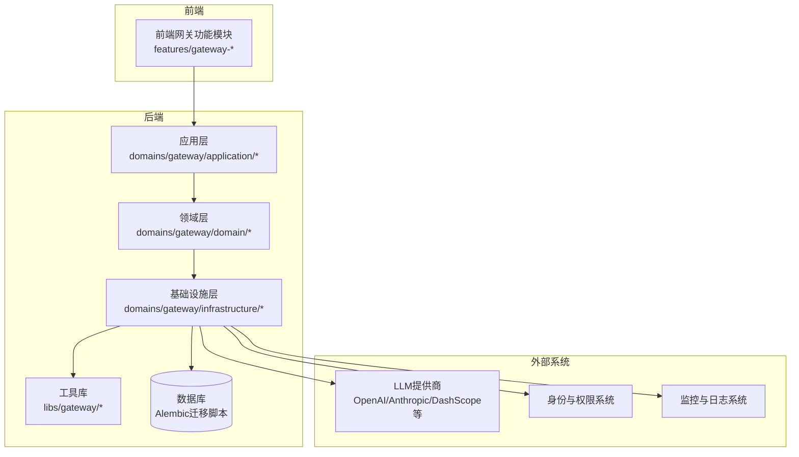

**图表来源**
- [AI_GATEWAY_DOMAIN_ARCHITECTURE.md](file://docs/AI_GATEWAY_DOMAIN_ARCHITECTURE.md)
- [LLM_GATEWAY_ARCHITECTURE.md](file://docs/gateway/LLM_GATEWAY_ARCHITECTURE.md)

**章节来源**
- [README.md](file://README.md)
- [AI_GATEWAY_DOMAIN_ARCHITECTURE.md](file://docs/AI_GATEWAY_DOMAIN_ARCHITECTURE.md)

## 核心组件
- 应用服务：负责API编排、路由决策、配额校验与调用链组织
- 领域模型：定义网关的核心实体（模型、凭证、预算、日志等）
- 基础设施：封装LiteLLM客户端、数据库访问、缓存与外部系统集成
- 工具库：通用网关能力（加密、令牌计数、成本计算等）
- 数据模型：通过Alembic迁移脚本定义网关表结构与索引

**章节来源**
- [LLM_GATEWAY_ARCHITECTURE.md](file://docs/gateway/LLM_GATEWAY_ARCHITECTURE.md)
- [20260508_add_gateway_tables.py](file://backend/alembic/versions/20260508_add_gateway_tables.py)

## 架构总览
网关整体架构围绕"统一入口、统一路由、统一计费"展开，通过LiteLLM实现多提供商统一接入；应用层根据模型、团队与预算策略进行路由与负载均衡；基础设施层负责数据持久化、监控与外部系统交互。

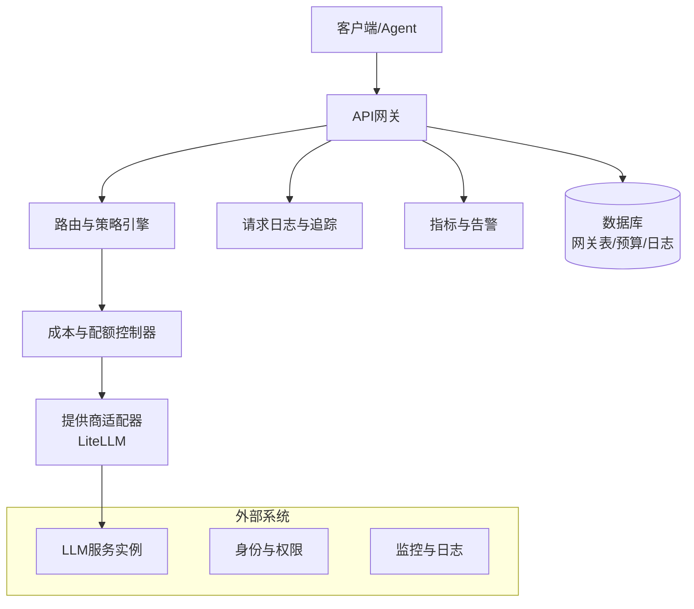

**图表来源**
- [LLM_GATEWAY_ARCHITECTURE.md](file://docs/gateway/LLM_GATEWAY_ARCHITECTURE.md)
- [GATEWAY_PRICING_AND_LITELLM_COST.md](file://docs/gateway/GATEWAY_PRICING_AND_LITELLM_COST.md)

## 详细组件分析

### LiteLLM集成与多提供商适配
- 统一接口：通过LiteLLM抽象不同提供商的API差异，支持OpenAI、Anthropic、DashScope等
- 模型映射：使用配置文件定义模型到提供商的映射关系，便于切换与灰度
- 连接与探测：对提供商凭证进行连通性探测与健康检查，确保路由稳定性

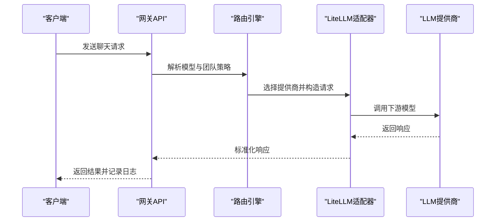

**图表来源**
- [LLM_GATEWAY_ARCHITECTURE.md](file://docs/gateway/LLM_GATEWAY_ARCHITECTURE.md)
- [LITELLM_SUPPORTED_MODELS.md](file://docs/gateway/LITELLM_SUPPORTED_MODELS.md)
- [litellm_models.yaml](file://config/litellm_models.yaml)

**章节来源**
- [LITELLM_SUPPORTED_MODELS.md](file://docs/gateway/LITELLM_SUPPORTED_MODELS.md)
- [litellm_models.yaml](file://config/litellm_models.yaml)

### 模型目录管理与可用性检测
- 模型注册：在种子数据中预置模型清单，支持按提供商与能力分类
- 可用性检测：定期或按需对模型进行连通性与性能测试，记录状态与原因
- 状态维度：将模型最后测试状态与原因纳入日志维度，便于审计与排障


**图表来源**
- [gateway-catalog.seed.json](file://seeds/gateway-catalog.seed.json)
- [20260514_gateway_log_credential_dim.py](file://backend/alembic/versions/20260514_gateway_log_credential_dim.py)
- [20260514_gateway_log_deployment_dim.py](file://backend/alembic/versions/20260514_gateway_log_deployment_dim.py)

**章节来源**
- [gateway-catalog.seed.json](file://seeds/gateway-catalog.seed.json)

### 路由策略与负载均衡
- 策略维度：模型、提供商、团队、预算目标等
- 动态路由：结合成本、延迟与可用性，选择最优提供商与部署
- 负载均衡：在同提供商内按权重或健康状态进行分流

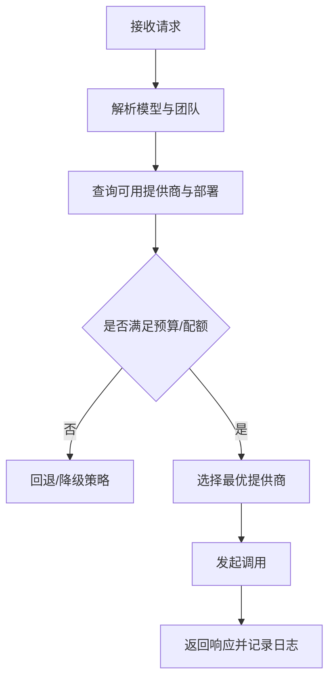

**图表来源**
- [LLM_GATEWAY_ARCHITECTURE.md](file://docs/gateway/LLM_GATEWAY_ARCHITECTURE.md)
- [20260527_193526_merge_gateway_preflight_and_log_heads.py](file://backend/alembic/versions/20260527_193526_merge_gateway_preflight_and_log_heads.py)

**章节来源**
- [LLM_GATEWAY_ARCHITECTURE.md](file://docs/gateway/LLM_GATEWAY_ARCHITECTURE.md)

### 成本控制与配额管理
- 预算分配：按团队/项目/模型维度设定预算目标与周期
- 使用统计：实时统计消耗金额与时长，更新到日志与指标
- 超支告警：当接近阈值或超支时触发告警，阻断或降级

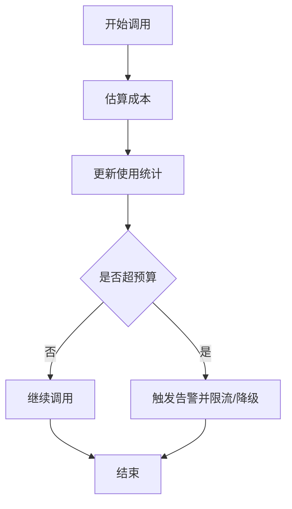

**图表来源**
- [GATEWAY_PRICING_AND_LITELLM_COST.md](file://docs/gateway/GATEWAY_PRICING_AND_LITELLM_COST.md)
- [20260518_gateway_model_pricing.py](file://backend/alembic/versions/20260518_gateway_model_pricing.py)
- [20260518_gateway_provider_entitlement_plans.py](file://backend/alembic/versions/20260518_gateway_provider_entitlement_plans.py)
- [20260514_gateway_budget_model_name.py](file://backend/alembic/versions/20260514_gateway_budget_model_name.py)
- [20260611_gateway_budget_credential.py](file://backend/alembic/versions/20260611_gateway_budget_credential.py)
- [20260612_gateway_budget_tenant.py](file://backend/alembic/versions/20260612_gateway_budget_tenant.py)

**章节来源**
- [GATEWAY_PRICING_AND_LITELLM_COST.md](file://docs/gateway/GATEWAY_PRICING_AND_LITELLM_COST.md)

### 虚拟密钥系统与权限控制
- 虚拟密钥：为团队/项目生成虚拟密钥，隔离用量与成本归属
- 权限控制：基于API Key与IAM系统进行鉴权与授权
- 使用追踪：记录每次调用的密钥、模型、提供商与时间，支持审计

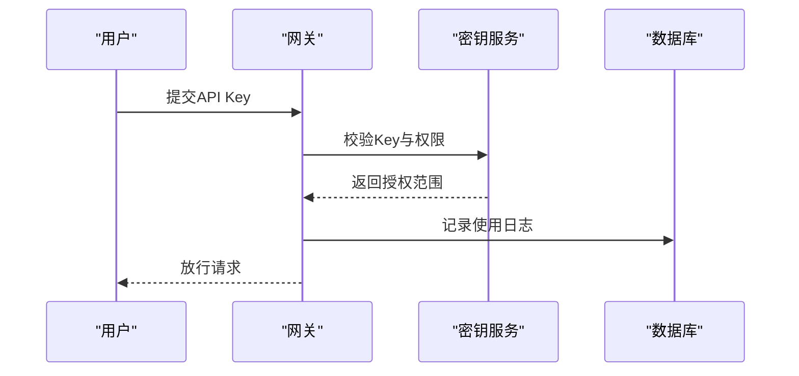

**图表来源**
- [20260515_api_key_gateway_grants.py](file://backend/alembic/versions/20260515_api_key_gateway_grants.py)
- [20260520_gateway_request_log_client.py](file://backend/alembic/versions/20260520_gateway_request_log_client.py)

**章节来源**
- [20260515_api_key_gateway_grants.py](file://backend/alembic/versions/20260515_api_key_gateway_grants.py)

### 监控与日志系统
- 请求追踪：记录请求ID、模型、提供商、路由耗时与错误码
- 性能监控：指标埋点（吞吐、延迟、错误率、成本）
- 异常处理：统一异常捕获与重试策略，避免级联故障

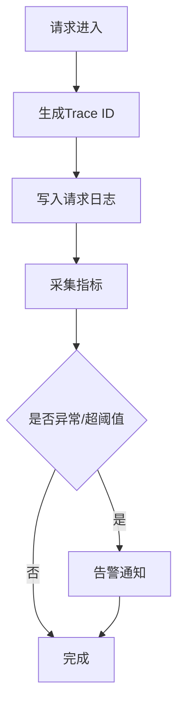

**图表来源**
- [logging.md](file://docs/logging.md)
- [20260607_gateway_request_log_tenant_route_time.py](file://backend/alembic/versions/20260607_gateway_request_log_tenant_route_time.py)

**章节来源**
- [logging.md](file://docs/logging.md)

### 数据模型与表结构
网关域的数据模型通过一系列迁移脚本定义，涵盖模型、凭证、预算、日志与维度表等。

```mermaid
erDiagram
MODEL {
uuid id PK
string name
string provider
string capabilities
enum status
timestamp last_test_at
string last_test_reason
created_by_user_id
}
PROVIDER_CREDENTIAL {
uuid id PK
string team_id
string provider
string credential_key
string api_base
jsonb scope
timestamp created_at
created_by_user_id
}
BUDGET {
uuid id PK
string target_type
string target_id
string model_name
decimal amount
string currency
timestamp period_start
timestamp period_end
decimal consumed
}
REQUEST_LOG {
uuid id PK
string tenant_id
string model_name
string provider
string credential_key
string deployment
int duration_ms
int prompt_tokens
int completion_tokens
decimal cost_usd
string status
timestamp created_at
user_id
}
MODEL ||--o{ REQUEST_LOG : "被调用"
PROVIDER_CREDENTIAL ||--o{ REQUEST_LOG : "提供凭证"
BUDGET ||--o{ REQUEST_LOG : "约束预算"
```

**图表来源**
- [20260508_add_gateway_tables.py](file://backend/alembic/versions/20260508_add_gateway_tables.py)
- [20260514_gateway_log_credential_dim.py](file://backend/alembic/versions/20260514_gateway_log_credential_dim.py)
- [20260514_gateway_log_deployment_dim.py](file://backend/alembic/versions/20260514_gateway_log_deployment_dim.py)
- [20260518_gateway_model_pricing.py](file://backend/alembic/versions/20260518_gateway_model_pricing.py)
- [20260518_gateway_provider_entitlement_plans.py](file://backend/alembic/versions/20260518_gateway_provider_entitlement_plans.py)
- [20260514_gateway_budget_model_name.py](file://backend/alembic/versions/20260514_gateway_budget_model_name.py)
- [20260611_gateway_budget_credential.py](file://backend/alembic/versions/20260611_gateway_budget_credential.py)
- [20260612_gateway_budget_tenant.py](file://backend/alembic/versions/20260612_gateway_budget_tenant.py)
- [20260614_gateway_models_created_by_user_id.py](file://backend/alembic/versions/20260614_gateway_models_created_by_user_id.py)

**章节来源**
- [20260508_add_gateway_tables.py](file://backend/alembic/versions/20260508_add_gateway_tables.py)

### 部署与运维最佳实践
- 容器化与编排：使用Docker镜像与Kubernetes部署，支持水平扩展
- 网关入口：支持Nginx与Higress Ingress，内置WASM插件用于认证桥接
- 环境配置：生产环境变量集中管理，支持凭据注入与密钥轮换
- 运维脚本：提供启动、种子数据初始化与日志巡检脚本

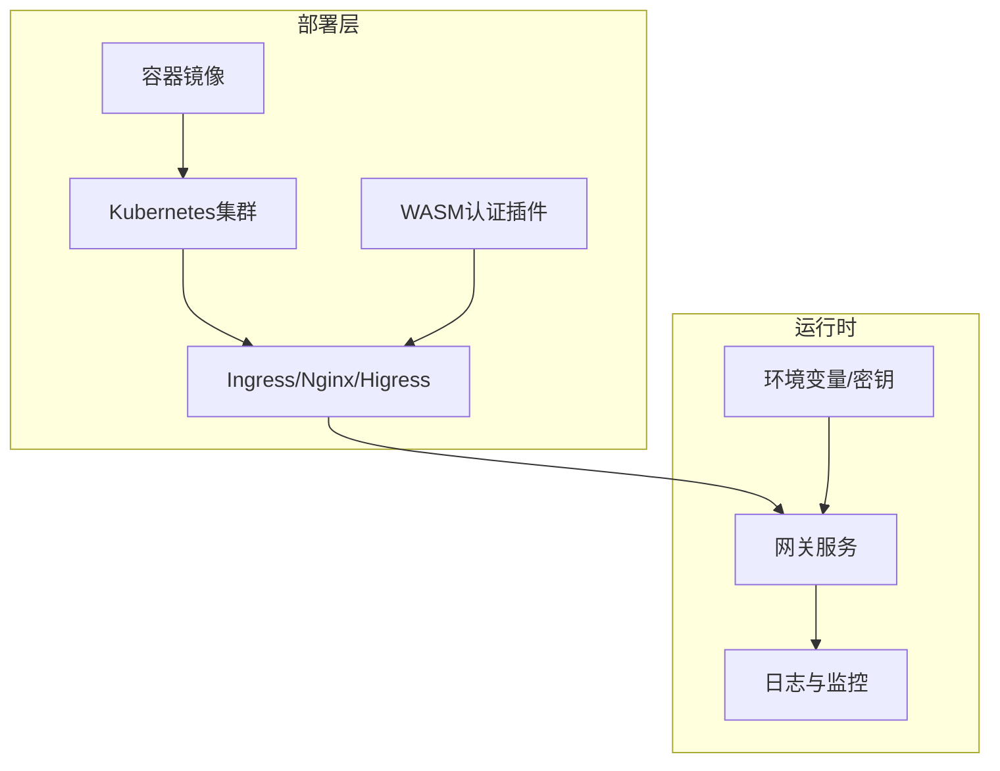

**图表来源**
- [GATEWAY_DEPLOYMENT_CHECKLIST.md](file://docs/gateway/GATEWAY_DEPLOYMENT_CHECKLIST.md)
- [DEPLOYMENT.md](file://docs/DEPLOYMENT.md)
- [backend.env.production](file://deploy/backend.env.production)
- [Deployment.yaml](file://deploy/k8s/Deployment.yaml)
- [ai-agent-ingress.example.yaml](file://deploy/higress/ai-agent-ingress.example.yaml)
- [giikin-auth-bridge-wasmplugin.yaml](file://deploy/higress/giikin-auth-bridge-wasmplugin.yaml)
- [ai-agent.bare-metal.conf.example](file://deploy/nginx/ai-agent.bare-metal.conf.example)

**章节来源**
- [GATEWAY_DEPLOYMENT_CHECKLIST.md](file://docs/gateway/GATEWAY_DEPLOYMENT_CHECKLIST.md)
- [DEPLOYMENT.md](file://docs/DEPLOYMENT.md)

## 推理内容处理能力增强

### supports_reasoning参数支持任意thinking模型
网关系统现已增强推理内容处理能力，通过新增的supports_reasoning参数支持任意thinking模型，包括Moonshot/Kimi、DeepSeek等推理模型。

#### 核心功能特性
- **通用推理支持**：supports_reasoning=True时对所有thinking模型生效
- **向后兼容**：保持对DeepSeek遗留检测逻辑的兼容
- **智能内容提取**：自动从content数组中提取纯文本作为reasoning_content
- **内容保护**：已存在的reasoning_content不会被覆盖

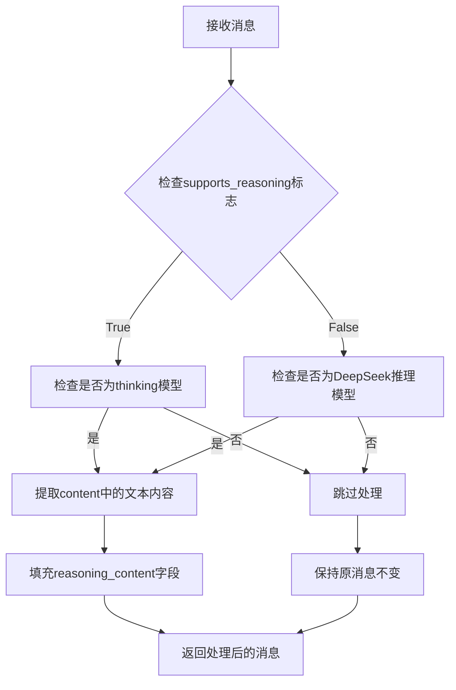

**图表来源**
- [upstream_policy.py:54-78](file://backend/domains/gateway/domain/upstream_policy.py#L54-L78)
- [test_upstream_policy.py:81-96](file://backend/tests/unit/gateway/test_upstream_policy.py#L81-L96)

#### 上游适配器集成
上游适配器在消息处理阶段自动应用推理内容填充逻辑：

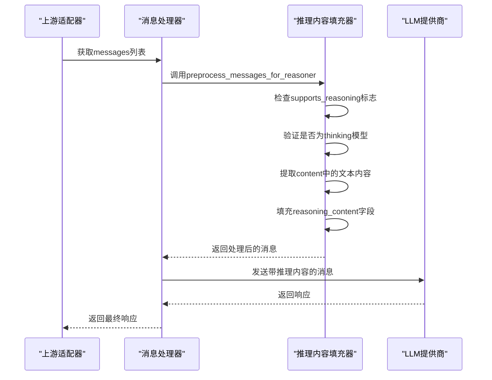

**图表来源**
- [upstream_adapter.py:48-55](file://backend/domains/gateway/application/upstream_adapter.py#L48-L55)
- [upstream_policy.py:54-78](file://backend/domains/gateway/domain/upstream_policy.py#L54-L78)

#### 模型目录管理增强
模型目录现在支持推理能力标签的自动识别与配置：

- **推理能力检测**：通过effective_supports_reasoning函数自动判断模型是否支持推理
- **思维参数推断**：支持多种推理模式参数（DashScope、Anthropic、DeepSeek等）
- **温度策略调整**：推理模型自动应用固定的温度策略

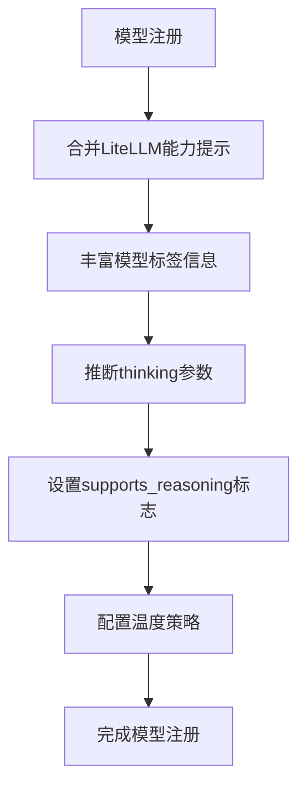

**图表来源**
- [gateway_model_tags_pipeline.py:43-44](file://backend/domains/gateway/application/catalog/gateway_model_tags_pipeline.py#L43-L44)
- [thinking_param.py:145-151](file://backend/domains/gateway/domain/thinking_param.py#L145-L151)

#### 测试用例验证
系统包含完整的测试用例确保推理内容处理的正确性：

- **通用推理模型支持**：验证supports_reasoning=True时对Moonshot/Kimi等模型的支持
- **内容数组处理**：测试content-parts数组的文本提取功能
- **向后兼容性**：确保DeepSeek模型在不传参数时的正常工作
- **现有内容保护**：验证已存在reasoning_content不会被覆盖

**章节来源**
- [upstream_policy.py:54-78](file://backend/domains/gateway/domain/upstream_policy.py#L54-L78)
- [upstream_adapter.py:48-55](file://backend/domains/gateway/application/upstream_adapter.py#L48-L55)
- [gateway_model_tags_pipeline.py:43-44](file://backend/domains/gateway/application/catalog/gateway_model_tags_pipeline.py#L43-L44)
- [thinking_param.py:145-151](file://backend/domains/gateway/domain/thinking_param.py#L145-L151)
- [model_capability.py:62-96](file://backend/domains/gateway/domain/model_capability.py#L62-L96)
- [test_upstream_policy.py:81-162](file://backend/tests/unit/gateway/test_upstream_policy.py#L81-L162)

## OpenAI提供商支持

### OpenAI兼容API入口
网关现已完整支持OpenAI兼容API，提供标准的OpenAI REST API接口，包括模型列表、聊天补全、嵌入等功能。

#### API入口配置
- **路由注册**：在主应用中注册OpenAI兼容路由
- **路径映射**：支持/api/v1/openai/v1/*路径下的所有OpenAI API端点
- **中间件集成**：继承网关的统一鉴权、限流与监控机制

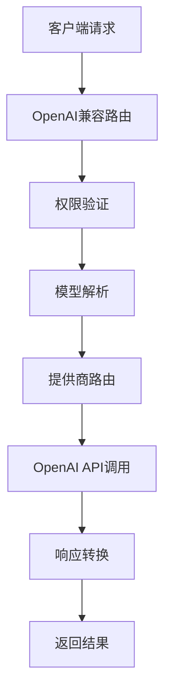

**图表来源**
- [bootstrap/main.py:481-485](file://backend/bootstrap/main.py#L481-L485)

#### OpenAI兼容功能
- **模型管理**：支持OpenAI标准的模型列表API
- **聊天补全**：完全兼容OpenAI Chat Completions API
- **嵌入生成**：支持OpenAI Embeddings API
- **流式响应**：支持OpenAI的流式响应格式

**章节来源**
- [bootstrap/main.py:481-485](file://backend/bootstrap/main.py#L481-L485)
- [test_openai_compat_api.py:76-109](file://backend/tests/integration/api/test_openai_compat_api.py#L76-L109)

### OpenAI模型管理
- **模型注册**：支持OpenAI标准模型ID格式（如gpt-4o、gpt-3.5-turbo等）
- **凭证管理**：OpenAI API Key的统一管理与轮换
- **路由配置**：自动识别OpenAI模型并配置相应的路由策略

**章节来源**
- [test_openai_compat_api.py:76-109](file://backend/tests/integration/api/test_openai_compat_api.py#L76-L109)
- [test_gateway_models_available_api.py:42-54](file://backend/tests/integration/api/test_gateway_models_available_api.py#L42-L54)

## 用户拥有者系统

### 个人团队唯一性约束
系统引入用户拥有者系统，通过唯一性约束确保每个用户只能拥有一个激活的个人团队，防止数据冗余和查询歧义。

#### 核心约束机制
- **唯一性索引**：创建部分唯一索引确保同一拥有者至多一条激活的个人团队
- **数据清理**：自动清理重复的个人团队记录，保留最早创建的记录
- **查询优化**：TeamRepository.get_personal方法依赖此唯一性约束

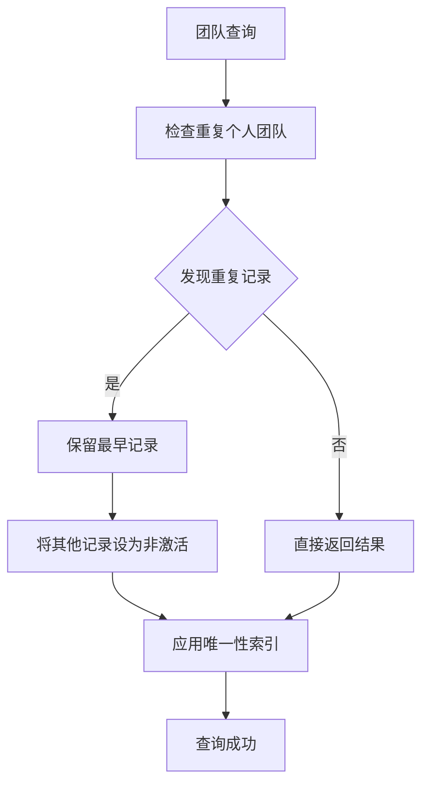

**图表来源**
- [20260514_unique_active_personal_team_per_owner.py:28-57](file://backend/alembic/versions/20260514_unique_active_personal_team_per_owner.py#L28-L57)

#### 数据迁移与维护
- **升级流程**：先清理重复数据，再创建唯一性索引
- **回滚流程**：删除唯一性索引，保持数据一致性
- **运维工具**：提供脚本检测和修复重复个人团队问题

**章节来源**
- [20260514_unique_active_personal_team_per_owner.py:1-61](file://backend/alembic/versions/20260514_unique_active_personal_team_per_owner.py#L1-L61)
- [20260514_unique_active_personal_team_per_owner.down.sql:1-13](file://backend/alembic/sql/20260514_unique_active_personal_team_per_owner.down.sql#L1-L13)
- [20260514_unique_active_personal_team_per_owner.up.sql](file://backend/alembic/sql/20260514_unique_active_personal_team_per_owner.up.sql)
- [inspect_duplicate_attribution.py:42-76](file://backend/scripts/inspect_duplicate_attribution.py#L42-L76)

### 拥有者管理系统
- **拥有者字段**：gateway_teams表新增owner_user_id字段标识团队拥有者
- **权限继承**：团队成员自动继承拥有者的权限
- **访问控制**：支持按拥有者维度进行数据隔离和访问控制

**章节来源**
- [20260508_add_gateway_tables.py:60-79](file://backend/alembic/versions/20260508_add_gateway_tables.py#L60-L79)

## 模型所有权权限控制增强

### 创建者追踪机制
新增模型创建者追踪功能，通过created_by_user_id字段实现模型所有权的精确控制。

#### 数据模型增强
- **模型实体**：gateway_models表新增created_by_user_id字段
- **凭证实体**：provider_credentials表新增created_by_user_id字段
- **用户关联**：支持按创建者维度进行权限控制与审计

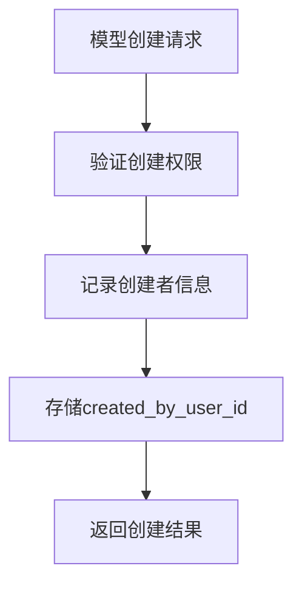

**图表来源**
- [20260614_gateway_models_created_by_user_id.py:22-36](file://backend/alembic/versions/20260614_gateway_models_created_by_user_id.py#L22-L36)

#### 权限控制实现
- **创建权限**：只有模型创建者或管理员可以修改或删除模型
- **访问控制**：支持按创建者维度过滤模型列表
- **审计追踪**：完整的模型生命周期审计日志

**章节来源**
- [20260614_gateway_models_created_by_user_id.py:1-41](file://backend/alembic/versions/20260614_gateway_models_created_by_user_id.py#L1-L41)

### 模型所有权API
- **个人模型**：用户只能访问自己创建的模型
- **共享模型**：支持团队共享模型的访问控制
- **权限验证**：在API层实现严格的权限验证

**章节来源**
- [test_openai_compat_api.py:193-206](file://backend/tests/integration/api/test_openai_compat_api.py#L193-L206)

## 自动模型ID规范化功能

### OpenAI模型ID前缀校验
实现自动OpenAI模型ID规范化功能，确保模型ID前缀与提供商类型严格匹配，并修复遗留记录。

#### 校验机制
- **前缀验证**：检查模型ID是否包含正确的提供商前缀
- **自动修正**：对不符合规范的模型ID进行自动修正
- **错误报告**：提供详细的前缀违规信息

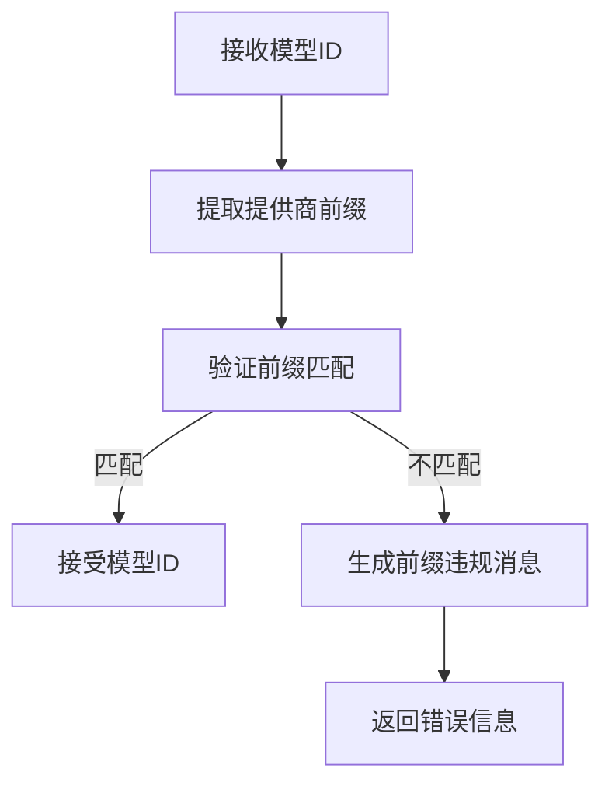

**图表来源**
- [litellm_real_model_prefix.py:12](file://backend/domains/gateway/application/litellm_real_model_prefix.py#L12)
- [litellm_model_id.py:3](file://backend/domains/gateway/domain/litellm_model_id.py#L3)

#### OpenAI专用规范化
针对OpenAI模型ID的特殊处理，自动为遗留记录添加缺失的前缀：

- **遗留记录修复**：为provider=openai且real_model不含'/'的记录添加'openai/'前缀
- **兼容性保证**：确保LiteLLM能正确识别OpenAI兼容模型的provider
- **双向兼容**：支持升级和回滚操作

**章节来源**
- [20260614_normalize_openai_real_model_prefix.py:20-25](file://backend/alembic/versions/20260614_normalize_openai_real_model_prefix.py#L20-L25)
- [20260614_normalize_openai_real_model_prefix.py:28-45](file://backend/alembic/versions/20260614_normalize_openai_real_model_prefix.py#L28-L45)

### 规范化流程
- **输入验证**：检查原始模型ID格式
- **前缀提取**：从模型ID中提取提供商前缀
- **匹配检查**：验证前缀与提供商类型一致性
- **错误处理**：提供详细的错误信息和修复建议

**章节来源**
- [test_gateway_management_api.py:2086-2106](file://backend/tests/integration/api/test_gateway_management_api.py#L2086-L2106)

### LiteLLM兼容性修复
- **模型别名推导**：支持OpenAI和Anthropic的厂商快照命名规范
- **日期后缀处理**：自动识别和去除厂商快照中的日期后缀
- **兼容性保证**：确保不同格式的模型ID都能被正确解析

**章节来源**
- [upstream_catalog_policy.py:77-115](file://backend/domains/gateway/domain/upstream_catalog_policy.py#L77-L115)

## 依赖关系分析
- 应用层依赖领域模型与基础设施能力
- 领域层不直接依赖外部框架，保持高内聚低耦合
- 基础设施层封装LiteLLM与数据库访问，向上提供稳定接口
- 工具库提供跨模块复用的能力（加密、令牌计数、成本计算）

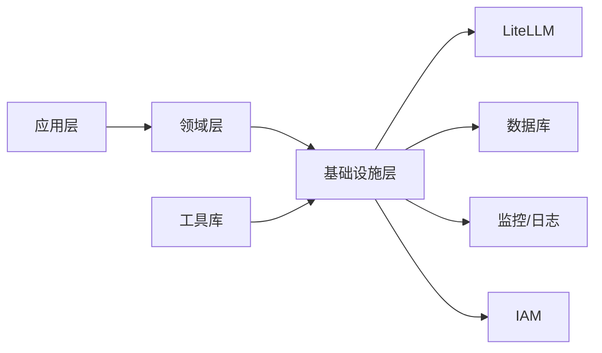

**图表来源**
- [AI_GATEWAY_DOMAIN_ARCHITECTURE.md](file://docs/AI_GATEWAY_DOMAIN_ARCHITECTURE.md)

**章节来源**
- [AI_GATEWAY_DOMAIN_ARCHITECTURE.md](file://docs/AI_GATEWAY_DOMAIN_ARCHITECTURE.md)

## 性能考虑
- 路由与成本计算：在应用层进行轻量级决策，避免深度序列化
- 缓存与索引：为常用查询建立索引，减少数据库压力
- 超时与重试：设置合理的超时与指数退避重试，提升可用性
- 指标与采样：对高流量场景进行指标采样与聚合，降低开销
- **推理内容处理优化**：仅对支持推理的模型进行内容填充，避免不必要的处理开销
- **OpenAI兼容优化**：针对OpenAI API的特殊头部和响应格式进行优化处理
- **模型ID规范化缓存**：缓存常见的模型ID规范化结果，减少重复校验开销
- **用户拥有者查询优化**：通过唯一性索引快速定位用户的个人团队
- **创建者权限缓存**：缓存模型创建者信息，减少权限验证开销

## 故障排查指南
- 日志巡检：使用脚本查看网关日志，定位异常请求与错误码
- 种子数据：初始化模型目录与提供商凭证，确保路由可用
- 代理测试：通过测试脚本验证网关代理连通性与响应格式
- 配置核对：确认LiteLLM模型映射与提供商API Base配置正确
- **推理内容问题排查**：检查supports_reasoning标志设置与content格式
- **OpenAI兼容问题**：验证OpenAI API Key配置与模型ID格式
- **模型所有权问题**：检查created_by_user_id字段与权限验证逻辑
- **模型ID规范化问题**：验证模型ID前缀与提供商类型的匹配关系
- **用户拥有者问题**：检查个人团队唯一性约束与拥有者字段
- **数据迁移问题**：验证Alembic迁移脚本执行状态

**章节来源**
- [inspect_gateway_logs.py](file://scripts/inspect_gateway_logs.py)
- [run_seed_gateway.py](file://scripts/run_seed_gateway.py)
- [seed_gateway_models.py](file://scripts/seed_gateway_models.py)
- [test_gateway_proxy.py](file://scripts/test_gateway_proxy.py)
- [inspect_duplicate_attribution.py:42-76](file://backend/scripts/inspect_duplicate_attribution.py#L42-L76)

## 结论
该网关服务以LiteLLM为核心，构建了统一的多提供商接入平台，结合完善的模型目录、路由策略、成本控制与配额管理，实现了高可用、可观测与可扩展的AI推理服务网关。通过新增的推理内容处理能力、OpenAI提供商支持、用户拥有者系统、模型所有权权限控制增强和自动模型ID规范化功能，系统现在能够：

- **全面支持OpenAI生态**：提供完整的OpenAI兼容API入口与模型管理
- **强化权限控制**：通过模型创建者追踪实现精确的权限管理
- **确保数据一致性**：通过自动模型ID规范化保证提供商前缀的正确性
- **优化用户体验**：通过用户拥有者系统简化团队管理与访问控制
- **保持向后兼容**：所有新功能都保持与现有系统的兼容性

通过清晰的分层架构与标准化的部署运维流程，能够支撑企业级Agent系统的稳定运行与持续演进。

## 附录
- 配置参考：应用配置、LiteLLM模型映射与环境变量
- 运维脚本：启动、种子数据与日志巡检
- 部署清单：容器化、编排与网关入口配置
- **推理能力配置**：supports_reasoning参数设置与模型能力标签管理
- **OpenAI集成配置**：OpenAI API Key管理与兼容API设置
- **用户拥有者配置**：个人团队唯一性约束与拥有者管理策略
- **权限控制配置**：模型所有权追踪与访问控制策略
- **模型ID规范化配置**：提供商前缀验证与错误处理机制
- **LiteLLM兼容性配置**：模型别名推导与厂商快照处理

**章节来源**
- [app.toml](file://config/app.toml)
- [litellm_models.yaml](file://config/litellm_models.yaml)
- [run_server.py](file://scripts/run_server.py)
- [run_dev_server.py](file://scripts/run_dev_server.py)
- [bootstrap/main.py:481-485](file://backend/bootstrap/main.py#L481-L485)
- [20260614_gateway_models_created_by_user_id.py:22-36](file://backend/alembic/versions/20260614_gateway_models_created_by_user_id.py#L22-L36)
- [20260614_normalize_openai_real_model_prefix.py:20-25](file://backend/alembic/versions/20260614_normalize_openai_real_model_prefix.py#L20-L25)
- [20260514_unique_active_personal_team_per_owner.py:28-57](file://backend/alembic/versions/20260514_unique_active_personal_team_per_owner.py#L28-L57)
- [upstream_catalog_policy.py:77-115](file://backend/domains/gateway/domain/upstream_catalog_policy.py#L77-L115)