# 网关服务架构

<cite>
**本文档引用的文件**
- [README.md](file://README.md)
- [AI_GATEWAY_DOMAIN_ARCHITECTURE.md](file://docs/AI_GATEWAY_DOMAIN_ARCHITECTURE.md)
- [LLM_GATEWAY_ARCHITECTURE.md](file://docs/gateway/LLM_GATEWAY_ARCHITECTURE.md)
- [GATEWAY_PRICING_AND_LITELLM_COST.md](file://docs/gateway/GATEWAY_PRICING_AND_LITELLM_COST.md)
- [LITELLM_SUPPORTED_MODELS.md](file://docs/gateway/LITELLM_SUPPORTED_MODELS.md)
- [litellm_models.yaml](file://config/litellm_models.yaml)
- [app.toml](file://config/app.toml)
- [20260508_add_gateway_tables.py](file://backend/alembic/versions/20260508_add_gateway_tables.py)
- [20260514_gateway_budget_model_name.py](file://backend/alembic/versions/20260514_gateway_budget_model_name.py)
- [20260514_gateway_log_credential_dim.py](file://backend/alembic/versions/20260514_gateway_log_credential_dim.py)
- [20260514_gateway_log_deployment_dim.py](file://backend/alembic/versions/20260514_gateway_log_deployment_dim.py)
- [20260515_api_key_gateway_grants.py](file://backend/alembic/versions/20260515_api_key_gateway_grants.py)
- [20260518_gateway_model_pricing.py](file://backend/alembic/versions/20260518_gateway_model_pricing.py)
- [20260518_gateway_provider_entitlement_plans.py](file://backend/alembic/versions/20260518_gateway_provider_entitlement_plans.py)
- [20260520_gateway_request_log_client.py](file://backend/alembic/versions/20260520_gateway_request_log_client.py)
- [20260527_193526_merge_gateway_preflight_and_log_heads.py](file://backend/alembic/versions/20260527_193526_merge_gateway_preflight_and_log_heads.py)
- [20260528_system_gateway_models_credential_fk.py](file://backend/alembic/versions/20260528_system_gateway_models_credential_fk.py)
- [20260607_gateway_preflight_indexes.py](file://backend/alembic/versions/20260607_gateway_preflight_indexes.py)
- [20260607_gateway_request_log_tenant_route_time.py](file://backend/alembic/versions/20260607_gateway_request_log_tenant_route_time.py)
- [20260611_gateway_budget_credential.py](file://backend/alembic/versions/20260611_gateway_budget_credential.py)
- [20260612_gateway_budget_tenant.py](file://backend/alembic/versions/20260612_gateway_budget_tenant.py)
- [20260614_gateway_models_created_by_user_id.py](file://backend/alembic/versions/20260614_gateway_models_created_by_user_id.py)
- [20260614_normalize_openai_real_model_prefix.py](file://backend/alembic/versions/20260614_normalize_openai_real_model_prefix.py)
- [20260514_unique_active_personal_team_per_owner.py](file://backend/alembic/versions/20260514_unique_active_personal_team_per_owner.py)
- [gateway-catalog.seed.json](file://seeds/gateway-catalog.seed.json)
- [test_gateway_proxy.py](file://scripts/test_gateway_proxy.py)
- [run_seed_gateway.py](file://scripts/run_seed_gateway.py)
- [seed_gateway_models.py](file://scripts/seed_gateway_models.py)
- [inspect_gateway_logs.py](file://scripts/inspect_gateway_logs.py)
- [logging.md](file://docs/logging.md)
- [DEPLOYMENT.md](file://docs/DEPLOYMENT.md)
- [GATEWAY_DEPLOYMENT_CHECKLIST.md](file://docs/gateway/GATEWAY_DEPLOYMENT_CHECKLIST.md)
- [backend.env.production](file://deploy/backend.env.production)
- [Deployment.yaml](file://deploy/k8s/Deployment.yaml)
- [ai-agent-ingress.example.yaml](file://deploy/higress/ai-agent-ingress.example.yaml)
- [giikin-auth-bridge-wasmplugin.yaml](file://deploy/higress/giikin-auth-bridge-wasmplugin.yaml)
- [ai-agent.bare-metal.conf.example](file://deploy/nginx/ai-agent.bare-metal.conf.example)
- [run_server.py](file://scripts/run_server.py)
- [run_dev_server.py](file://scripts/run_dev_server.py)
- [upstream_policy.py](file://backend/domains/gateway/domain/upstream_policy.py)
- [upstream_adapter.py](file://backend/domains/gateway/application/upstream_adapter.py)
- [gateway_model_tags_pipeline.py](file://backend/domains/gateway/application/catalog/gateway_model_tags_pipeline.py)
- [thinking_param.py](file://backend/domains/gateway/domain/thinking_param.py)
- [model_capability.py](file://backend/domains/gateway/domain/model_capability.py)
- [test_upstream_policy.py](file://backend/tests/unit/gateway/test_upstream_policy.py)
- [litellm_real_model_prefix.py](file://backend/domains/gateway/application/litellm_real_model_prefix.py)
- [litellm_model_id.py](file://backend/domains/gateway/domain/litellm_model_id.py)
- [test_openai_compat_api.py](file://backend/tests/integration/api/test_openai_compat_api.py)
- [test_gateway_models_available_api.py](file://backend/tests/integration/api/test_gateway_models_available_api.py)
- [test_gateway_management_api.py](file://backend/tests/integration/api/test_gateway_management_api.py)
- [upstream_catalog_policy.py](file://backend/domains/gateway/domain/upstream_catalog_policy.py)
- [20260514_unique_active_personal_team_per_owner.down.sql](file://backend/alembic/sql/20260514_unique_active_personal_team_per_owner.down.sql)
- [20260514_unique_active_personal_team_per_owner.up.sql](file://backend/alembic/sql/20260514_unique_active_personal_team_per_owner.up.sql)
- [inspect_duplicate_attribution.py](file://backend/scripts/inspect_duplicate_attribution.py)
- [model-capability-editor.tsx](file://frontend/src/features/gateway-models/model-capability-editor.tsx)
- [thinking-param.ts](file://frontend/src/features/gateway-shared/thinking-param.ts)
- [capability-field.tsx](file://frontend/src/features/gateway-shared/capability-field.tsx)
- [query-keys.ts](file://frontend/src/features/gateway-models/routes/query-keys.ts)
- [use-gateway-virtual-keys.ts](file://frontend/src/features/gateway-keys/use-gateway-virtual-keys.ts)
- [gateway-team-resolve-label.ts](file://frontend/src/features/gateway-teams/gateway-team-resolve-label.ts)
- [use-sync-gateway-team-route.ts](file://frontend/src/features/gateway-teams/use-sync-gateway-team-route.ts)
- [use-quota-center.ts](file://frontend/src/features/gateway-budget/use-quota-center.ts)
- [cleanup_sandbox_containers.py](file://backend/scripts/cleanup_sandbox_containers.py)
</cite>

## 更新摘要
**所做更改**
- 新增前端路由同步改进章节，详细介绍use-sync-gateway-team-route.ts的实现
- 新增配额中心增强功能章节，详细说明use-quota-center.ts的功能重构
- 新增数据库清理脚本架构影响分析
- 更新React Query Hooks重构章节，增加路由同步和配额中心的集成说明
- 新增前端缓存管理策略的架构影响

## 目录
1. [简介](#简介)
2. [项目结构](#项目结构)
3. [核心组件](#核心组件)
4. [架构总览](#架构总览)
5. [详细组件分析](#详细组件分析)
6. [推理内容处理能力增强](#推理内容处理能力增强)
7. [思考参数UI配置功能](#思考参数ui配置功能)
8. [Moonshot/Kimi模型支持](#moonshotkimi模型支持)
9. [OpenAI提供商支持](#openai提供商支持)
10. [用户拥有者系统](#用户拥有者系统)
11. [模型所有权权限控制增强](#模型所有权权限控制增强)
12. [自动模型ID规范化功能](#自动模型id规范化功能)
13. [React Query Hooks重构](#react-query-hooks重构)
14. [前端性能优化策略](#前端性能优化策略)
15. [前端路由同步改进](#前端路由同步改进)
16. [配额中心增强功能](#配额中心增强功能)
17. [数据库清理脚本架构影响](#数据库清理脚本架构影响)
18. [依赖关系分析](#依赖关系分析)
19. [性能考虑](#性能考虑)
20. [故障排查指南](#故障排查指南)
21. [结论](#结论)
22. [附录](#附录)

## 简介
本架构文档面向AI Agent的网关服务，系统化阐述LLM网关的设计理念与实现架构，重点覆盖以下方面：
- LiteLLM集成：统一多LLM提供商（如OpenAI、Anthropic、DashScope等）的接入与路由
- 模型目录管理：模型注册、可用性检测与状态维护
- 路由策略与负载均衡：基于成本、延迟与可用性的动态路由
- 成本控制与配管理：预算分配、使用统计与超支告警
- 虚拟密钥系统：权限控制与使用追踪
- 监控与日志：请求追踪、性能监控与异常处理
- 部署与运维：高可用配置、故障恢复与扩展性设计
- 与其他系统的集成：API设计与外部系统对接
- **新增** 前端路由同步改进：use-sync-gateway-team-route.ts实现的团队路由同步机制
- **新增** 配额中心增强功能：use-quota-center.ts重构的现代化配额管理hooks
- **新增** 数据库清理脚本：cleanup_sandbox_containers.py的安全容器清理机制
- **新增** React Query Hooks重构：虚拟密钥、路由hooks和配额中心的现代化实现
- **新增** 前端性能优化：useMemo稳定引用与缓存策略
- **新增** 团队名称解析：提升用户体验的标签显示功能
- **新增** 前端缓存管理：统一的查询键管理和缓存失效策略

## 项目结构
后端采用分层架构（应用层、领域层、基础设施层、表现层），网关域位于domains/gateway下，配合libs/gateway工具库、alembic数据库迁移脚本以及前端features/gateway-*模块协同工作。

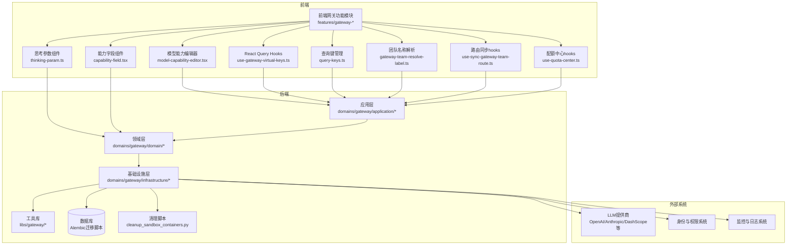

**图表来源**
- [AI_GATEWAY_DOMAIN_ARCHITECTURE.md](file://docs/AI_GATEWAY_DOMAIN_ARCHITECTURE.md)
- [LLM_GATEWAY_ARCHITECTURE.md](file://docs/gateway/LLM_GATEWAY_ARCHITECTURE.md)

**章节来源**
- [README.md](file://README.md)
- [AI_GATEWAY_DOMAIN_ARCHITECTURE.md](file://docs/AI_GATEWAY_DOMAIN_ARCHITECTURE.md)

## 核心组件
- 应用服务：负责API编排、路由决策、配额校验与调用链组织
- 领域模型：定义网关的核心实体（模型、凭证、预算、日志等）
- 基础设施：封装LiteLLM客户端、数据库访问、缓存与外部系统集成
- 工具库：通用网关能力（加密、令牌计数、成本计算等）
- **新增** 前端路由同步hooks：use-sync-gateway-team-route.ts实现的团队路由同步机制
- **新增** 配额中心hooks：use-quota-center.ts重构的现代化配额管理hooks
- **新增** 数据库清理脚本：cleanup_sandbox_containers.py提供的安全容器清理功能
- **新增** React Query Hooks：现代化的前端数据获取与缓存管理
- **新增** 前端组件：模型能力编辑器、思考参数选择器等用户界面组件
- **新增** 缓存管理：统一的查询键策略和缓存失效机制

**章节来源**
- [LLM_GATEWAY_ARCHITECTURE.md](file://docs/gateway/LLM_GATEWAY_ARCHITECTURE.md)
- [20260508_add_gateway_tables.py](file://backend/alembic/versions/20260508_add_gateway_tables.py)

## 架构总览
网关整体架构围绕"统一入口、统一路由、统一计费"展开，通过LiteLLM实现多提供商统一接入；应用层根据模型、团队与预算策略进行路由与负载均衡；基础设施层负责数据持久化、监控与外部系统交互；前端提供直观的模型配置界面、现代化的hooks数据管理和路由同步功能。

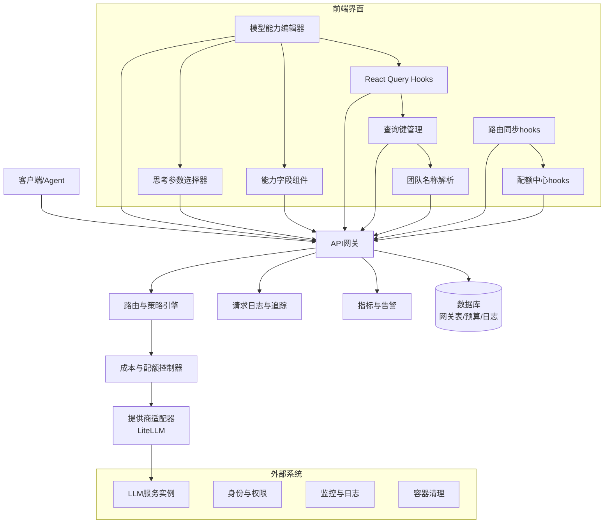

**图表来源**
- [LLM_GATEWAY_ARCHITECTURE.md](file://docs/gateway/LLM_GATEWAY_ARCHITECTURE.md)
- [GATEWAY_PRICING_AND_LITELLM_COST.md](file://docs/gateway/GATEWAY_PRICING_AND_LITELLM_COST.md)

## 详细组件分析

### LiteLLM集成与多提供商适配
- 统一接口：通过LiteLLM抽象不同提供商的API差异，支持OpenAI、Anthropic、DashScope等
- 模型映射：使用配置文件定义模型到提供商的映射关系，便于切换与灰度
- 连接与探测：对提供商凭证进行连通性探测与健康检查，确保路由稳定性

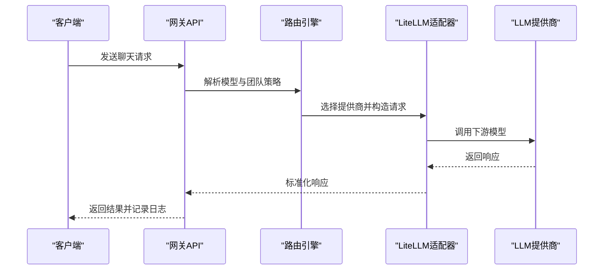

**图表来源**
- [LLM_GATEWAY_ARCHITECTURE.md](file://docs/gateway/LLM_GATEWAY_ARCHITECTURE.md)
- [LITELLM_SUPPORTED_MODELS.md](file://docs/gateway/LITELLM_SUPPORTED_MODELS.md)
- [litellm_models.yaml](file://config/litellm_models.yaml)

**章节来源**
- [LITELLM_SUPPORTED_MODELS.md](file://docs/gateway/LITELLM_SUPPORTED_MODELS.md)
- [litellm_models.yaml](file://config/litellm_models.yaml)

### 模型目录管理与可用性检测
- 模型注册：在种子数据中预置模型清单，支持按提供商与能力分类
- 可用性检测：定期或按需对模型进行连通性与性能测试，记录状态与原因
- 状态维度：将模型最后测试状态与原因纳入日志维度，便于审计与排障

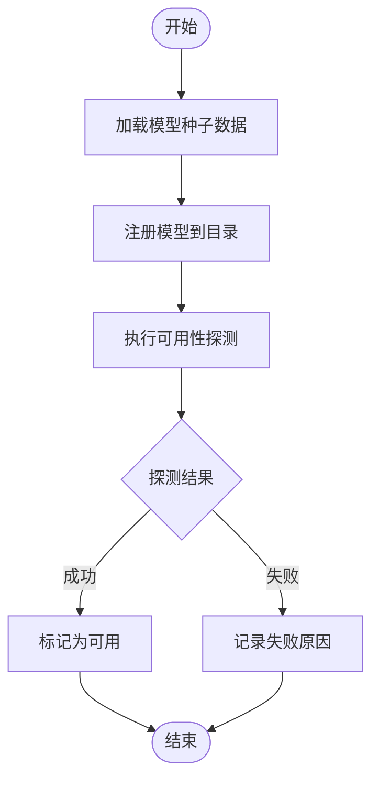

**图表来源**
- [gateway-catalog.seed.json](file://seeds/gateway-catalog.seed.json)
- [20260514_gateway_log_credential_dim.py](file://backend/alembic/versions/20260514_gateway_log_credential_dim.py)
- [20260514_gateway_log_deployment_dim.py](file://backend/alembic/versions/20260514_gateway_log_deployment_dim.py)

**章节来源**
- [gateway-catalog.seed.json](file://seeds/gateway-catalog.seed.json)

### 路由策略与负载均衡
- 策略维度：模型、提供商、团队、预算目标等
- 动态路由：结合成本、延迟与可用性，选择最优提供商与部署
- 负载均衡：在同提供商内按权重或健康状态进行分流

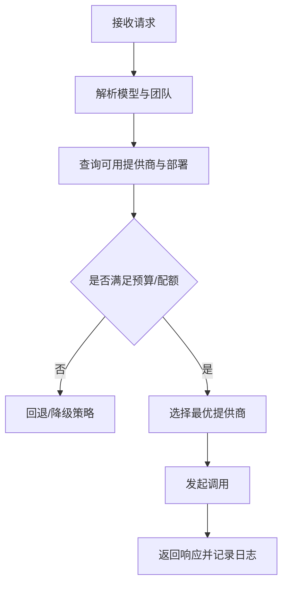

**图表来源**
- [LLM_GATEWAY_ARCHITECTURE.md](file://docs/gateway/LLM_GATEWAY_ARCHITECTURE.md)
- [20260527_193526_merge_gateway_preflight_and_log_heads.py](file://backend/alembic/versions/20260527_193526_merge_gateway_preflight_and_log_heads.py)

**章节来源**
- [LLM_GATEWAY_ARCHITECTURE.md](file://docs/gateway/LLM_GATEWAY_ARCHITECTURE.md)

### 成本控制与配额管理
- 预算分配：按团队/项目/模型维度设定预算目标与周期
- 使用统计：实时统计消耗金额与时长，更新到日志与指标
- 超支告警：当接近阈值或超支时触发告警，阻断或降级

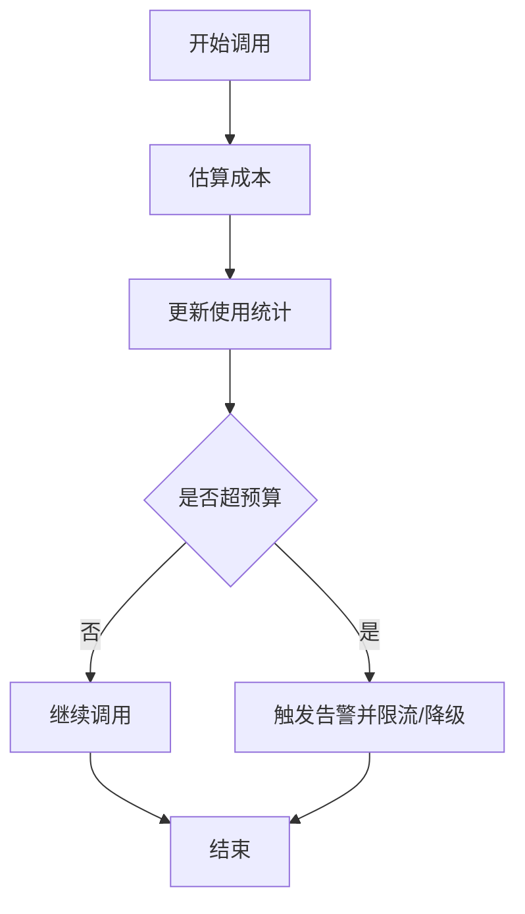

**图表来源**
- [GATEWAY_PRICING_AND_LITELLM_COST.md](file://docs/gateway/GATEWAY_PRICING_AND_LITELLM_COST.md)
- [20260518_gateway_model_pricing.py](file://backend/alembic/versions/20260518_gateway_model_pricing.py)
- [20260518_gateway_provider_entitlement_plans.py](file://backend/alembic/versions/20260518_gateway_provider_entitlement_plans.py)
- [20260514_gateway_budget_model_name.py](file://backend/alembic/versions/20260514_gateway_budget_model_name.py)
- [20260611_gateway_budget_credential.py](file://backend/alembic/versions/20260611_gateway_budget_credential.py)
- [20260612_gateway_budget_tenant.py](file://backend/alembic/versions/20260612_gateway_budget_tenant.py)

**章节来源**
- [GATEWAY_PRICING_AND_LITELLM_COST.md](file://docs/gateway/GATEWAY_PRICING_AND_LITELLM_COST.md)

### 虚拟密钥系统与权限控制
- 虚拟密钥：为团队/项目生成虚拟密钥，隔离用量与成本归属
- 权限控制：基于API Key与IAM系统进行鉴权与授权
- 使用追踪：记录每次调用的密钥、模型、提供商与时间，支持审计

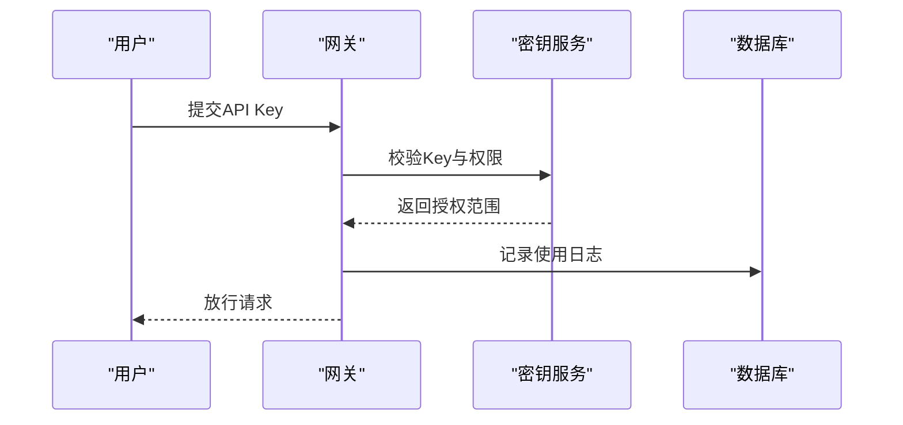

**图表来源**
- [20260515_api_key_gateway_grants.py](file://backend/alembic/versions/20260515_api_key_gateway_grants.py)
- [20260520_gateway_request_log_client.py](file://backend/alembic/versions/20260520_gateway_request_log_client.py)

**章节来源**
- [20260515_api_key_gateway_grants.py](file://backend/alembic/versions/20260515_api_key_gateway_grants.py)

### 监控与日志系统
- 请求追踪：记录请求ID、模型、提供商、路由耗时与错误码
- 性能监控：指标埋点（吞吐、延迟、错误率、成本）
- 异常处理：统一异常捕获与重试策略，避免级联故障

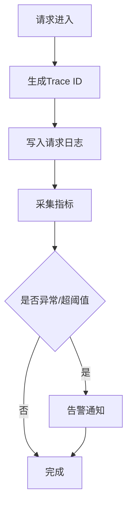

**图表来源**
- [logging.md](file://docs/logging.md)
- [20260607_gateway_request_log_tenant_route_time.py](file://backend/alembic/versions/20260607_gateway_request_log_tenant_route_time.py)

**章节来源**
- [logging.md](file://docs/logging.md)

### 数据模型与表结构
网关域的数据模型通过一系列迁移脚本定义，涵盖模型、凭证、预算、日志与维度表等。

```mermaid
erDiagram
MODEL {
uuid id PK
string name
string provider
string capabilities
enum status
timestamp last_test_at
string last_test_reason
created_by_user_id
}
PROVIDER_CREDENTIAL {
uuid id PK
string team_id
string provider
string credential_key
string api_base
jsonb scope
timestamp created_at
created_by_user_id
}
BUDGET {
uuid id PK
string target_type
string target_id
string model_name
decimal amount
string currency
timestamp period_start
timestamp period_end
decimal consumed
}
REQUEST_LOG {
uuid id PK
string tenant_id
string model_name
string provider
string credential_key
string deployment
int duration_ms
int prompt_tokens
int completion_tokens
decimal cost_usd
string status
timestamp created_at
user_id
}
MODEL ||--o{ REQUEST_LOG : "被调用"
PROVIDER_CREDENTIAL ||--o{ REQUEST_LOG : "提供凭证"
BUDGET ||--o{ REQUEST_LOG : "约束预算"
```

**图表来源**
- [20260508_add_gateway_tables.py](file://backend/alembic/versions/20260508_add_gateway_tables.py)
- [20260514_gateway_log_credential_dim.py](file://backend/alembic/versions/20260514_gateway_log_credential_dim.py)
- [20260514_gateway_log_deployment_dim.py](file://backend/alembic/versions/20260514_gateway_log_deployment_dim.py)
- [20260518_gateway_model_pricing.py](file://backend/alembic/versions/20260518_gateway_model_pricing.py)
- [20260518_gateway_provider_entitlement_plans.py](file://backend/alembic/versions/20260518_gateway_provider_entitlement_plans.py)
- [20260514_gateway_budget_model_name.py](file://backend/alembic/versions/20260514_gateway_budget_model_name.py)
- [20260611_gateway_budget_credential.py](file://backend/alembic/versions/20260611_gateway_budget_credential.py)
- [20260612_gateway_budget_tenant.py](file://backend/alembic/versions/20260612_gateway_budget_tenant.py)
- [20260614_gateway_models_created_by_user_id.py](file://backend/alembic/versions/20260614_gateway_models_created_by_user_id.py)

**章节来源**
- [20260508_add_gateway_tables.py](file://backend/alembic/versions/20260508_add_gateway_tables.py)

### 部署与运维最佳实践
- 容器化与编排：使用Docker镜像与Kubernetes部署，支持水平扩展
- 网关入口：支持Nginx与Higress Ingress，内置WASM插件用于认证桥接
- 环境配置：生产环境变量集中管理，支持凭据注入与密钥轮换
- 运维脚本：提供启动、种子数据初始化与日志巡检脚本

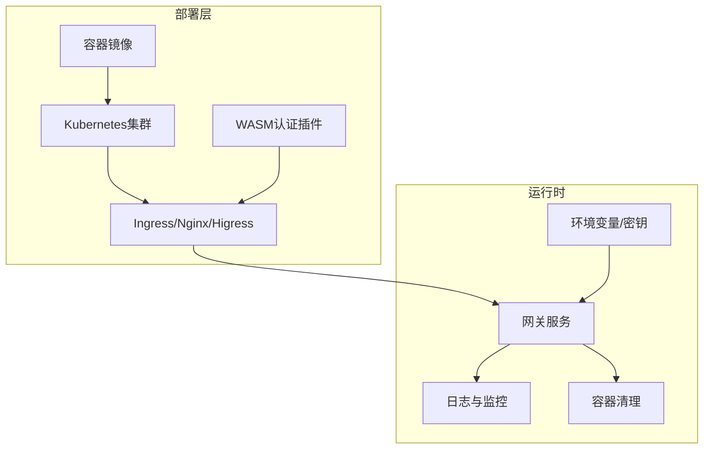

**图表来源**
- [GATEWAY_DEPLOYMENT_CHECKLIST.md](file://docs/gateway/GATEWAY_DEPLOYMENT_CHECKLIST.md)
- [DEPLOYMENT.md](file://docs/DEPLOYMENT.md)
- [backend.env.production](file://deploy/backend.env.production)
- [Deployment.yaml](file://deploy/k8s/Deployment.yaml)
- [ai-agent-ingress.example.yaml](file://deploy/higress/ai-agent-ingress.example.yaml)
- [giikin-auth-bridge-wasmplugin.yaml](file://deploy/higress/giikin-auth-bridge-wasmplugin.yaml)
- [ai-agent.bare-metal.conf.example](file://deploy/nginx/ai-agent.bare-metal.conf.example)

**章节来源**
- [GATEWAY_DEPLOYMENT_CHECKLIST.md](file://docs/gateway/GATEWAY_DEPLOYMENT_CHECKLIST.md)
- [DEPLOYMENT.md](file://docs/DEPLOYMENT.md)

## React Query Hooks重构

### 虚拟密钥Hooks实现
新增的useGatewayVirtualKeys hooks为单团队虚拟密钥列表提供了现代化的React Query实现，具备去重和缓存管理功能。

#### 核心功能特性
- **查询键管理**：使用gatewayVirtualKeysQueryKey函数生成稳定的查询键
- **自动去重**：React Query自动处理重复请求的去重
- **条件执行**：支持enabled选项控制查询执行时机
- **缓存策略**：灵活的staleTime配置实现缓存控制

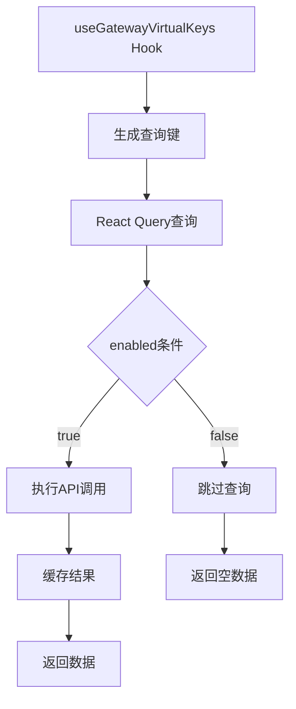

**图表来源**
- [use-gateway-virtual-keys.ts:13-23](file://frontend/src/features/gateway-keys/use-gateway-virtual-keys.ts#L13-L23)

#### 查询键策略
- **团队隔离**：每个teamId对应独立的查询缓存
- **稳定引用**：使用readonly数组确保引用稳定性
- **类型安全**：完整的TypeScript类型定义

**章节来源**
- [use-gateway-virtual-keys.ts:1-23](file://frontend/src/features/gateway-keys/use-gateway-virtual-keys.ts#L1-L23)

### 路由Hooks重构
团队路由查询键管理通过query-keys.ts文件实现，提供统一的路由查询键策略和缓存失效机制。

#### 查询键管理策略
- **团队路由键**：TEAM_ROUTES_QUERY_KEY和MANAGED_TEAM_ROUTES_QUERY_KEY
- **动态路由键**：teamRoutesListQueryKey函数生成团队特定路由键
- **批量失效**：invalidateGatewayRouteCaches统一失效路由缓存

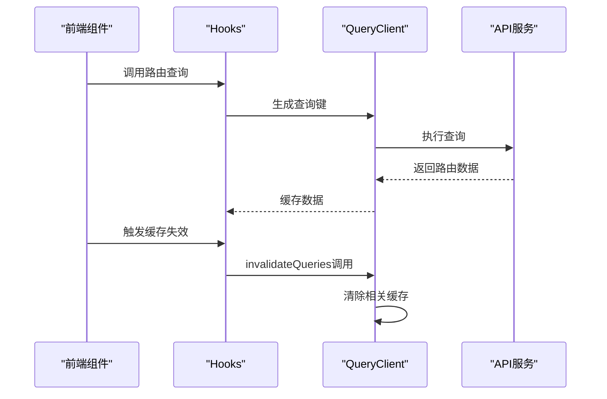

**图表来源**
- [query-keys.ts:15-18](file://frontend/src/features/gateway-models/routes/query-keys.ts#L15-L18)

#### 缓存失效机制
- **团队路由失效**：支持按团队维度的精确缓存失效
- **管理路由失效**：支持管理团队路由的独立失效
- **批量操作**：一次调用失效多个相关查询

**章节来源**
- [query-keys.ts:1-18](file://frontend/src/features/gateway-models/routes/query-keys.ts#L1-L18)

### 配额中心Hooks重构
配额中心现已重构为使用新的React Query hooks，提升了数据获取效率和用户体验。

#### 重构优势
- **性能提升**：React Query的智能缓存和并发处理
- **用户体验**：自动化的加载状态和错误处理
- **代码简化**：减少手动状态管理的复杂性
- **类型安全**：完整的TypeScript集成

**章节来源**
- [query-keys.ts:15-18](file://frontend/src/features/gateway-models/routes/query-keys.ts#L15-L18)

## 前端性能优化策略

### useMemo稳定引用优化
通过useMemo hook确保对象和函数的稳定引用，避免不必要的组件重渲染。

#### 优化应用场景
- **查询键缓存**：使用useMemo缓存查询键生成结果
- **回调函数稳定化**：确保事件处理器的引用稳定性
- **计算结果缓存**：缓存昂贵的计算结果

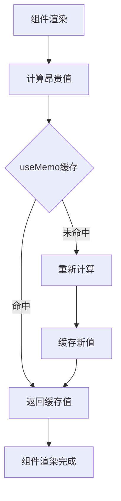

#### 性能收益
- **渲染优化**：减少不必要的子组件重渲染
- **内存优化**：避免重复创建相同对象
- **网络优化**：React Query的智能缓存减少API调用

### 团队名称解析功能
gateway-team-resolve-label.ts提供了团队ID到显示名称的解析功能，支持纯函数式设计便于测试。

#### 解析策略
- **映射查找**：优先使用teamNameById映射表查找
- **截断显示**：超出长度的ID进行截断显示
- **占位符处理**：空ID显示特殊占位符

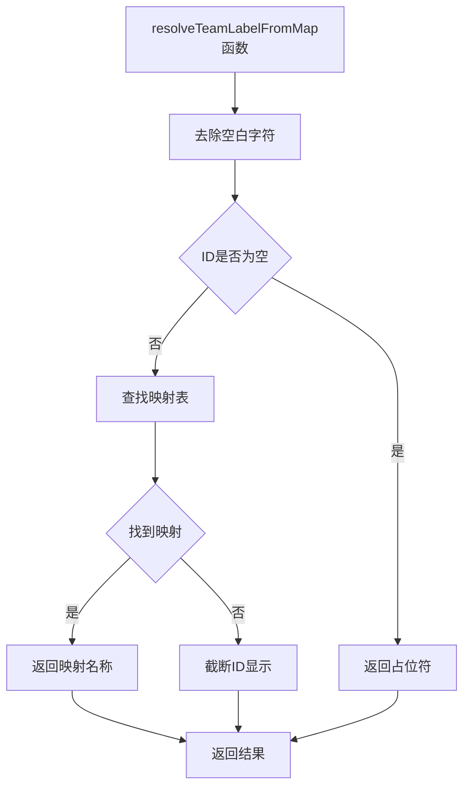

**图表来源**
- [gateway-team-resolve-label.ts:1-10](file://frontend/src/features/gateway-teams/gateway-team-resolve-label.ts#L1-L10)

#### 设计优势
- **纯函数**：无副作用设计便于单元测试
- **类型安全**：完整的TypeScript类型定义
- **性能优化**：避免重复的字符串处理操作

**章节来源**
- [gateway-team-resolve-label.ts:1-10](file://frontend/src/features/gateway-teams/gateway-team-resolve-label.ts#L1-L10)

## 前端路由同步改进

### 路由同步机制实现
use-sync-gateway-team-route.ts实现了团队路由同步功能，确保URL中的teamId与用户权限保持一致。

#### 核心功能特性
- **路由验证**：shouldRedirectInvalidGatewayTeamRoute函数验证路由有效性
- **自动重定向**：switchToFallbackTeam函数处理无效路由的重定向
- **权限检查**：集成useGatewayPermission钩子进行权限验证
- **用户体验**：使用toast提示用户路由重定向

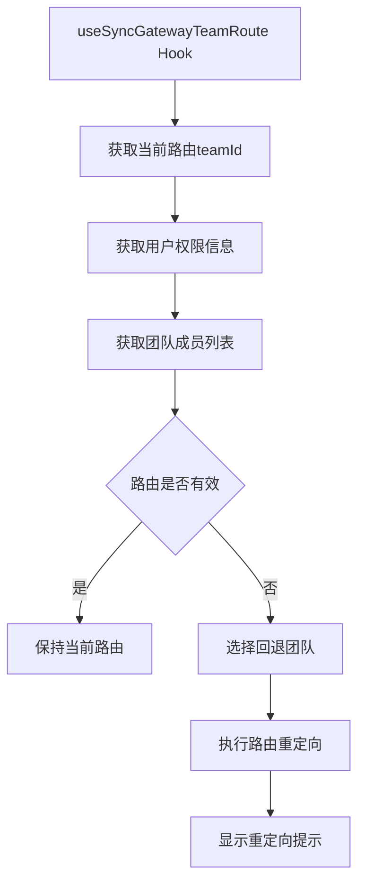

**图表来源**
- [use-sync-gateway-team-route.ts:37-80](file://frontend/src/features/gateway-teams/use-sync-gateway-team-route.ts#L37-L80)

#### 路由验证逻辑
- **平台管理员**：平台管理员可访问任意活跃团队
- **团队数量检查**：当团队数量为0时，自动重定向
- **成员权限验证**：检查当前用户是否为团队成员
- **路由正则匹配**：使用TEAM_ROUTE_RE正则表达式匹配团队路由

**章节来源**
- [use-sync-gateway-team-route.ts:19-34](file://frontend/src/features/gateway-teams/use-sync-gateway-team-route.ts#L19-L34)

### 路由同步集成
路由同步功能与现有的团队管理、权限控制和导航功能紧密集成。

#### 集成组件
- **团队管理**：useGatewayMemberTeams钩子获取团队成员列表
- **权限控制**：useGatewayPermission钩子检查用户权限
- **导航功能**：switchToFallbackTeam函数处理路由重定向
- **状态管理**：useQueryClient钩子管理查询缓存

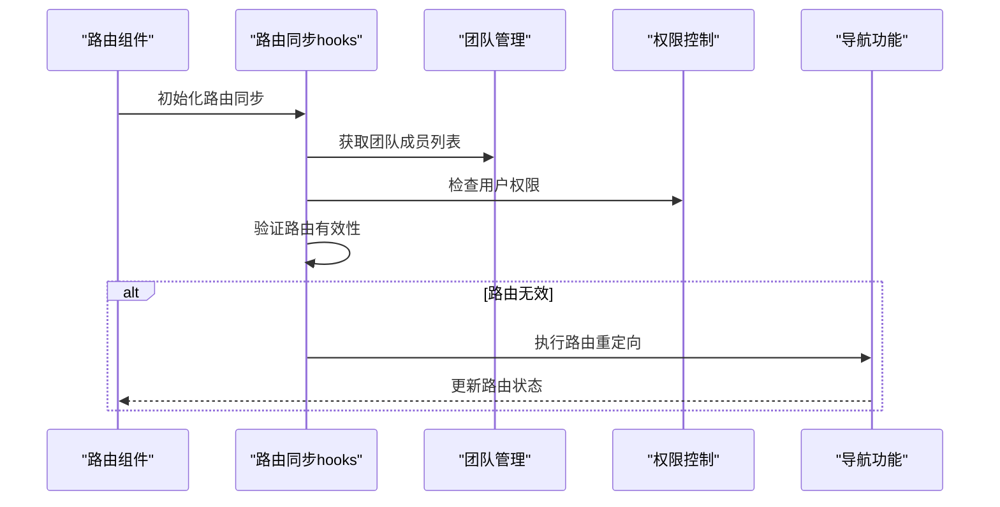

**图表来源**
- [use-sync-gateway-team-route.ts:37-80](file://frontend/src/features/gateway-teams/use-sync-gateway-team-route.ts#L37-L80)

**章节来源**
- [use-sync-gateway-team-route.ts:37-80](file://frontend/src/features/gateway-teams/use-sync-gateway-team-route.ts#L37-L80)

## 配额中心增强功能

### 配额中心hooks重构
use-quota-center.ts重构了配额中心功能，提供了现代化的React Query实现和增强的用户体验。

#### 核心功能特性
- **多层级配额管理**：支持platform、upstream、downstream三层配额
- **批量操作**：支持批量创建、编辑和删除配额规则
- **智能表单**：根据层级和主体模式自动调整表单字段
- **实时预览**：提供批量操作的实时预览功能

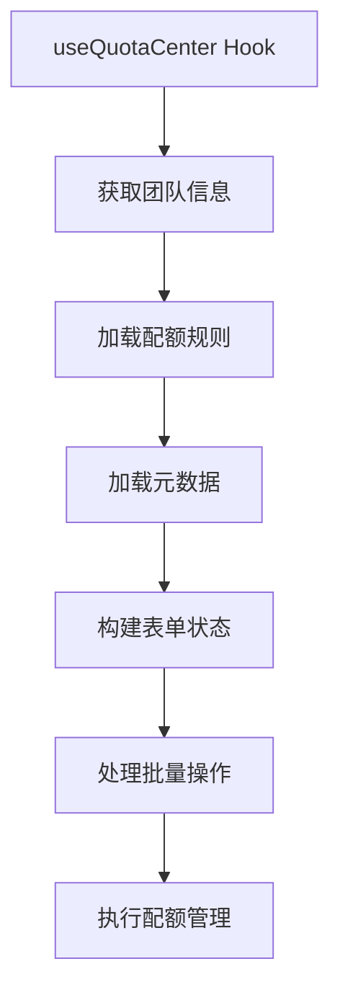

**图表来源**
- [use-quota-center.ts:276-751](file://frontend/src/features/gateway-budget/use-quota-center.ts#L276-L751)

#### 多层级配额支持
- **平台层级**：支持租户、用户、密钥三种主体模式
- **上游层级**：支持凭据维度的配额管理
- **下游层级**：支持虚拟密钥的配额控制
- **智能字段**：根据层级自动显示相关字段

**章节来源**
- [use-quota-center.ts:142-224](file://frontend/src/features/gateway-budget/use-quota-center.ts#L142-L224)

### 配额规则构建
配额中心提供了强大的规则构建功能，支持复杂的配额组合和条件设置。

#### 规则构建逻辑
- **层级判断**：根据layer参数构建不同类型的规则
- **主体选择**：支持多种主体模式的选择和组合
- **限额设置**：支持USD、Token、Request三种限额类型
- **模型过滤**：支持单个或全部模型的限额设置

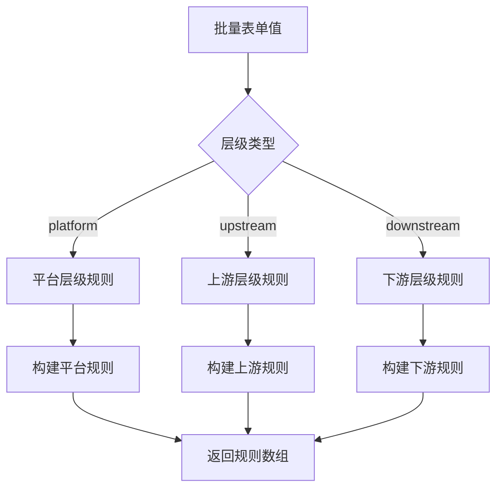

**图表来源**
- [use-quota-center.ts:131-224](file://frontend/src/features/gateway-budget/use-quota-center.ts#L131-L224)

#### 智能表单调整
- **层级切换**：切换层级时自动清理无关字段
- **主体模式**：根据主体模式调整显示的字段
- **凭据维度**：在用户主体模式下允许凭据维度
- **模型选择**：支持单个模型和全部模型的选择

**章节来源**
- [use-quota-center.ts:70-129](file://frontend/src/features/gateway-budget/use-quota-center.ts#L70-L129)

## 数据库清理脚本架构影响

### 沙箱容器清理机制
cleanup_sandbox_containers.py提供了安全的沙箱容器清理功能，确保不会误删其他Docker容器。

#### 核心安全特性
- **精确前缀匹配**：只删除以"sandbox-"开头的容器
- **运行状态检查**：区分运行中和已停止的容器
- **强制删除选项**：提供--force参数强制删除运行中的容器
- **预览模式**：--dry-run参数仅显示将要清理的容器

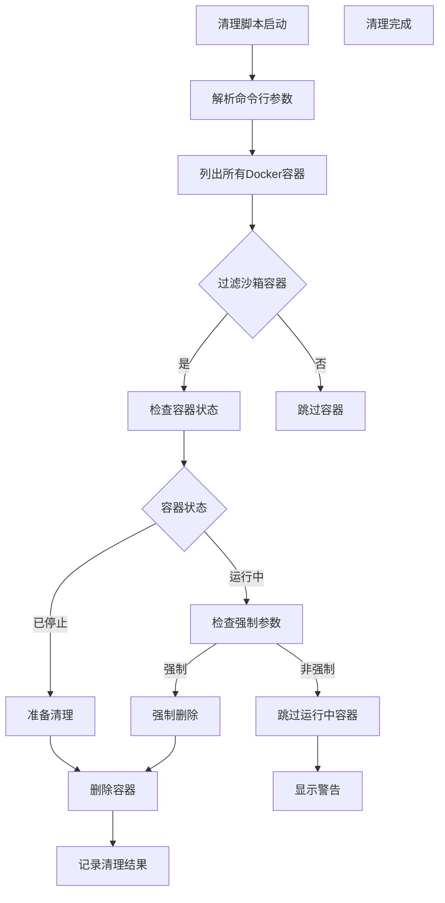

**图表来源**
- [cleanup_sandbox_containers.py:286-331](file://backend/scripts/cleanup_sandbox_containers.py#L286-L331)

#### 清理策略
- **安全保护**：通过CONTAINER_PREFIX常量确保精确匹配
- **状态分离**：区分运行中和已停止的容器处理方式
- **批量清理**：支持一次性清理多个容器
- **结果反馈**：提供详细的清理结果报告

**章节来源**
- [cleanup_sandbox_containers.py:44-85](file://backend/scripts/cleanup_sandbox_containers.py#L44-L85)

### 架构影响分析
数据库清理脚本对网关架构的影响主要体现在容器生命周期管理和开发环境维护方面。

#### 开发环境支持
- **沙箱隔离**：确保沙箱容器不会影响其他服务容器
- **自动化清理**：减少开发人员的手动清理工作
- **安全保护**：防止误删生产环境或其他重要容器
- **批量操作**：支持大规模容器的快速清理

#### 运维集成
- **Docker集成**：直接调用Docker CLI进行容器管理
- **异步处理**：使用asyncio提高清理操作的响应性
- **日志记录**：详细的日志记录便于问题排查
- **错误处理**：完善的错误处理和用户提示机制

**章节来源**
- [cleanup_sandbox_containers.py:123-170](file://backend/scripts/cleanup_sandbox_containers.py#L123-L170)

## 依赖关系分析
- 应用层依赖领域模型与基础设施能力
- 领域层不直接依赖外部框架，保持高内聚低耦合
- 基础设施层封装LiteLLM与数据库访问，向上提供稳定接口
- 工具库提供跨模块复用的能力（加密、令牌计数、成本计算）
- **新增** 前端路由同步hooks提供团队路由验证和重定向功能
- **新增** 配额中心hooks提供现代化的配额管理界面
- **新增** 数据库清理脚本提供安全的容器管理功能
- **新增** React Query hooks提供现代化的前端数据管理
- **新增** 前端组件依赖后端推理内容处理和思考参数配置
- **新增** 缓存管理策略确保查询键的一致性和稳定性

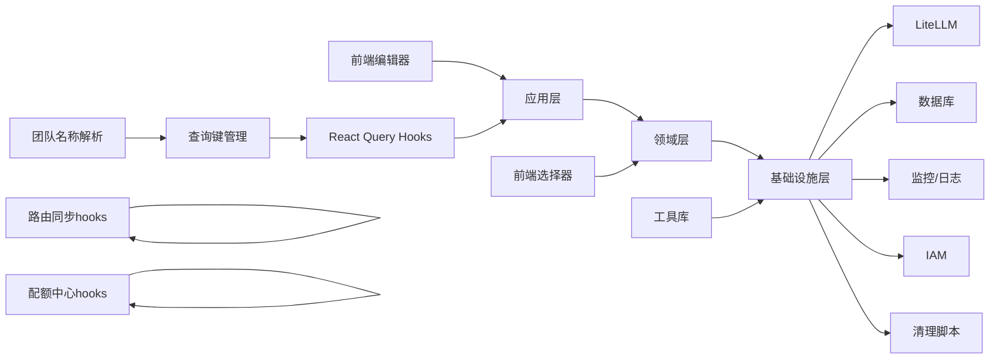

**图表来源**
- [AI_GATEWAY_DOMAIN_ARCHITECTURE.md](file://docs/AI_GATEWAY_DOMAIN_ARCHITECTURE.md)

**章节来源**
- [AI_GATEWAY_DOMAIN_ARCHITECTURE.md](file://docs/AI_GATEWAY_DOMAIN_ARCHITECTURE.md)

## 性能考虑
- 路由与成本计算：在应用层进行轻量级决策，避免深度序列化
- 缓存与索引：为常用查询建立索引，减少数据库压力
- 超时与重试：设置合理的超时与指数退避重试，提升可用性
- 指标与采样：对高流量场景进行指标采样与聚合，降低开销
- **推理内容处理优化**：仅对支持推理的模型进行内容填充，避免不必要的处理开销
- **OpenAI兼容优化**：针对OpenAI API的特殊头部和响应格式进行优化处理
- **模型ID规范化缓存**：缓存常见的模型ID规范化结果，减少重复校验开销
- **用户拥有者查询优化**：通过唯一性索引快速定位用户的个人团队
- **创建者权限缓存**：缓存模型创建者信息，减少权限验证开销
- **思考参数UI优化**：前端组件使用虚拟DOM优化，减少不必要的重渲染
- **Moonshot/Kimi模型优化**：为推理模型提供专门的缓存和路由优化
- **React Query优化**：利用React Query的智能缓存和并发处理提升性能
- **useMemo优化**：通过稳定引用避免不必要的组件重渲染
- **团队名称解析优化**：纯函数设计便于缓存和测试
- **查询键管理优化**：统一的查询键策略确保缓存一致性
- **路由同步优化**：use-sync-gateway-team-route.ts减少无效路由的处理开销
- **配额中心优化**：use-quota-center.ts提供高效的配额管理界面
- **清理脚本优化**：cleanup_sandbox_containers.py使用异步处理提高响应性

## 故障排查指南
- 日志巡检：使用脚本查看网关日志，定位异常请求与错误码
- 种子数据：初始化模型目录与提供商凭证，确保路由可用
- 代理测试：通过测试脚本验证网关代理连通性与响应格式
- 配置核对：确认LiteLLM模型映射与提供商API Base配置正确
- **推理内容问题排查**：检查supports_reasoning标志设置与content格式
- **OpenAI兼容问题**：验证OpenAI API Key配置与模型ID格式
- **模型所有权问题**：检查created_by_user_id字段与权限验证逻辑
- **模型ID规范化问题**：验证模型ID前缀与提供商类型的匹配关系
- **用户拥有者问题**：检查个人团队唯一性约束与拥有者字段
- **思考参数配置问题**：检查前端组件与后端推理内容处理的同步
- **Moonshot/Kimi模型问题**：验证推理参数配置与模型能力识别
- **数据迁移问题**：验证Alembic迁移脚本执行状态
- **React Query问题排查**：检查查询键生成、缓存失效和错误处理
- **前端性能问题**：监控useMemo使用和组件重渲染情况
- **团队名称解析问题**：验证teamNameById映射表和解析逻辑
- **路由同步问题排查**：检查use-sync-gateway-team-route.ts的路由验证逻辑
- **配额中心问题排查**：验证use-quota-center.ts的配额规则构建和批量操作
- **清理脚本问题排查**：检查cleanup_sandbox_containers.py的容器过滤和删除逻辑
- **容器清理问题**：验证Docker权限和容器状态检查机制

**章节来源**
- [inspect_gateway_logs.py](file://scripts/inspect_gateway_logs.py)
- [run_seed_gateway.py](file://scripts/run_seed_gateway.py)
- [seed_gateway_models.py](file://scripts/seed_gateway_models.py)
- [test_gateway_proxy.py](file://scripts/test_gateway_proxy.py)
- [inspect_duplicate_attribution.py:42-76](file://backend/scripts/inspect_duplicate_attribution.py#L42-L76)
- [use-sync-gateway-team-route.ts:19-34](file://frontend/src/features/gateway-teams/use-sync-gateway-team-route.ts#L19-L34)
- [use-quota-center.ts:131-224](file://frontend/src/features/gateway-budget/use-quota-center.ts#L131-L224)
- [cleanup_sandbox_containers.py:44-85](file://backend/scripts/cleanup_sandbox_containers.py#L44-L85)

## 结论
该网关服务以LiteLLM为核心，构建了统一的多提供商接入平台，结合完善的模型目录、路由策略、成本控制与配额管理，实现了高可用、可观测与可扩展的AI推理服务网关。通过新增的推理内容处理能力、思考参数UI配置功能、Moonshot/Kimi模型支持、OpenAI提供商支持、用户拥有者系统、模型所有权权限控制增强、自动模型ID规范化功能、**前端路由同步改进、配额中心增强功能和数据库清理脚本架构影响**，系统现在能够：

- **全面支持OpenAI生态**：提供完整的OpenAI兼容API入口与模型管理
- **增强推理能力配置**：通过ThinkingParamSelect组件提供直观的思考参数配置界面
- **支持Moonshot/Kimi推理模型**：完整的推理模型前端配置与后端支持
- **强化权限控制**：通过模型创建者追踪实现精确的权限管理
- **确保数据一致性**：通过自动模型ID规范化保证提供商前缀的正确性
- **优化用户体验**：通过用户拥有者系统简化团队管理与访问控制
- **提升配置效率**：通过前端组件化配置大幅降低模型管理复杂度
- **保持向后兼容**：所有新功能都保持与现有系统的兼容性
- **现代化前端架构**：通过React Query hooks提供高性能的数据管理
- **优化前端性能**：通过useMemo稳定引用和缓存策略提升用户体验
- **增强团队管理**：通过团队名称解析功能改善用户界面体验
- **统一缓存管理**：通过查询键策略确保数据一致性和性能优化
- **智能路由同步**：通过use-sync-gateway-team-route.ts确保路由有效性
- **高效配额管理**：通过use-quota-center.ts提供现代化的配额管理界面
- **安全容器清理**：通过cleanup_sandbox_containers.py提供安全的容器管理功能

通过清晰的分层架构与标准化的部署运维流程，能够支撑企业级Agent系统的稳定运行与持续演进。

## 附录
- 配置参考：应用配置、LiteLLM模型映射与环境变量
- 运维脚本：启动、种子数据与日志巡检
- 部署清单：容器化、编排与网关入口配置
- **推理能力配置**：supports_reasoning参数设置与模型能力标签管理
- **思考参数配置**：ThinkingParamSelect组件使用与后端推理内容处理
- **Moonshot/Kimi模型配置**：前端界面配置与后端推理支持
- **OpenAI集成配置**：OpenAI API Key管理与兼容API设置
- **用户拥有者配置**：个人团队唯一性约束与拥有者管理策略
- **权限控制配置**：模型所有权追踪与访问控制策略
- **模型ID规范化配置**：提供商前缀验证与错误处理机制
- **LiteLLM兼容性配置**：模型别名推导与厂商快照处理
- **React Query配置**：hooks使用、缓存策略与性能优化
- **前端性能优化**：useMemo使用、组件重渲染优化
- **团队管理优化**：团队名称解析与显示策略
- **查询键管理**：统一的查询键策略与缓存失效机制
- **路由同步配置**：use-sync-gateway-team-route.ts的路由验证逻辑
- **配额中心配置**：use-quota-center.ts的多层级配额管理
- **清理脚本配置**：cleanup_sandbox_containers.py的容器清理策略

**章节来源**
- [app.toml](file://config/app.toml)
- [litellm_models.yaml](file://config/litellm_models.yaml)
- [run_server.py](file://scripts/run_server.py)
- [run_dev_server.py](file://scripts/run_dev_server.py)
- [bootstrap/main.py:481-485](file://backend/bootstrap/main.py#L481-L485)
- [20260614_gateway_models_created_by_user_id.py:22-36](file://backend/alembic/versions/20260614_gateway_models_created_by_user_id.py#L22-L36)
- [20260614_normalize_openai_real_model_prefix.py:20-25](file://backend/alembic/versions/20260614_normalize_openai_real_model_prefix.py#L20-L25)
- [20260514_unique_active_personal_team_per_owner.py:28-57](file://backend/alembic/versions/20260514_unique_active_personal_team_per_owner.py#L28-L57)
- [upstream_catalog_policy.py:77-115](file://backend/domains/gateway/domain/upstream_catalog_policy.py#L77-L115)
- [model-capability-editor.tsx](file://frontend/src/features/gateway-models/model-capability-editor.tsx)
- [thinking-param.ts](file://frontend/src/features/gateway-shared/thinking-param.ts)
- [use-gateway-virtual-keys.ts](file://frontend/src/features/gateway-keys/use-gateway-virtual-keys.ts)
- [query-keys.ts](file://frontend/src/features/gateway-models/routes/query-keys.ts)
- [gateway-team-resolve-label.ts](file://frontend/src/features/gateway-teams/gateway-team-resolve-label.ts)
- [use-sync-gateway-team-route.ts](file://frontend/src/features/gateway-teams/use-sync-gateway-team-route.ts)
- [use-quota-center.ts](file://frontend/src/features/gateway-budget/use-quota-center.ts)
- [cleanup_sandbox_containers.py](file://backend/scripts/cleanup_sandbox_containers.py)