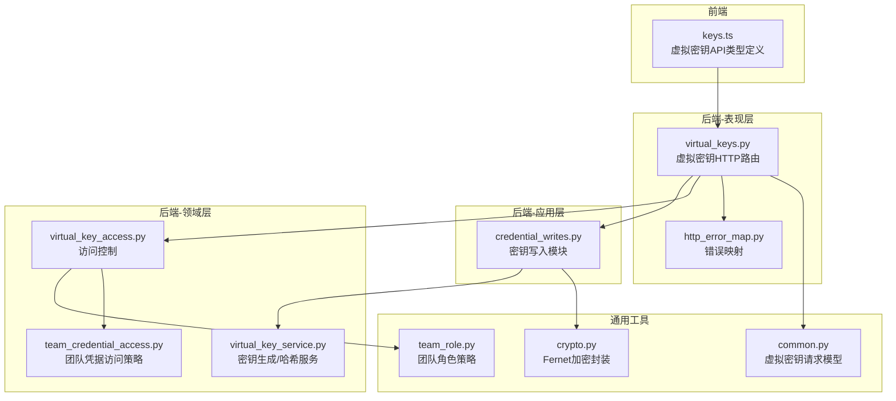
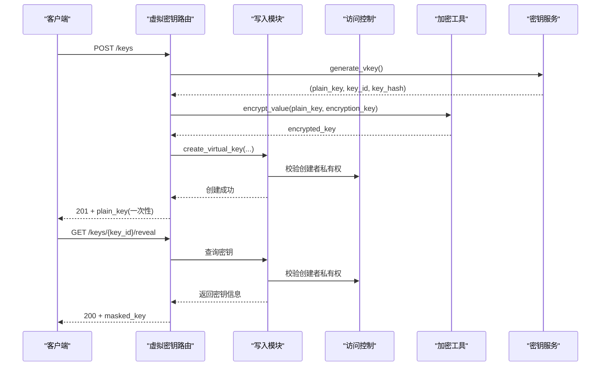
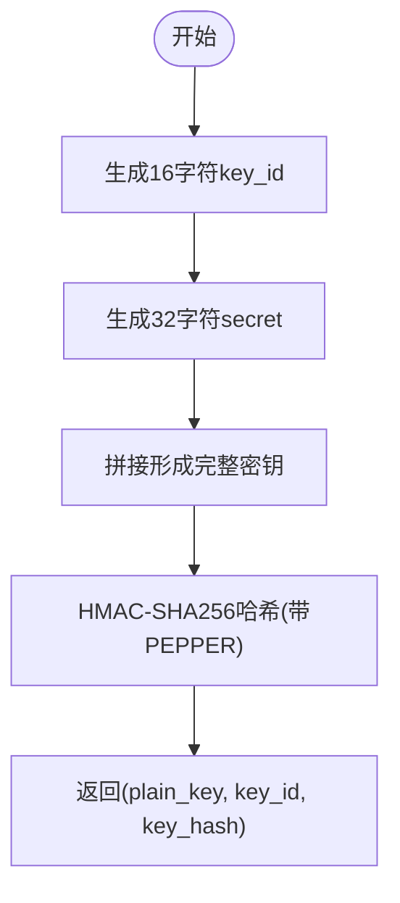
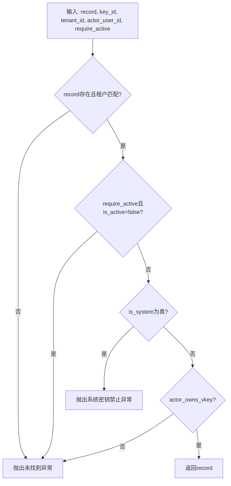
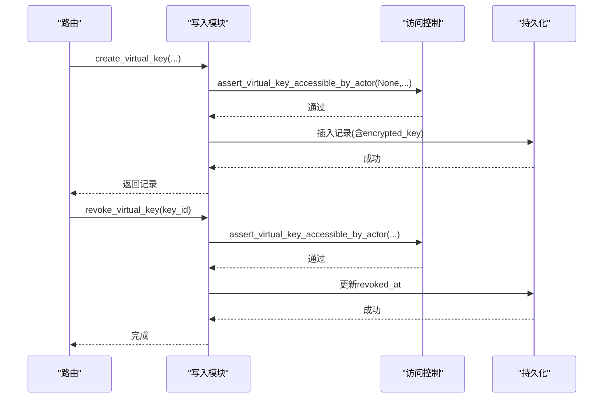
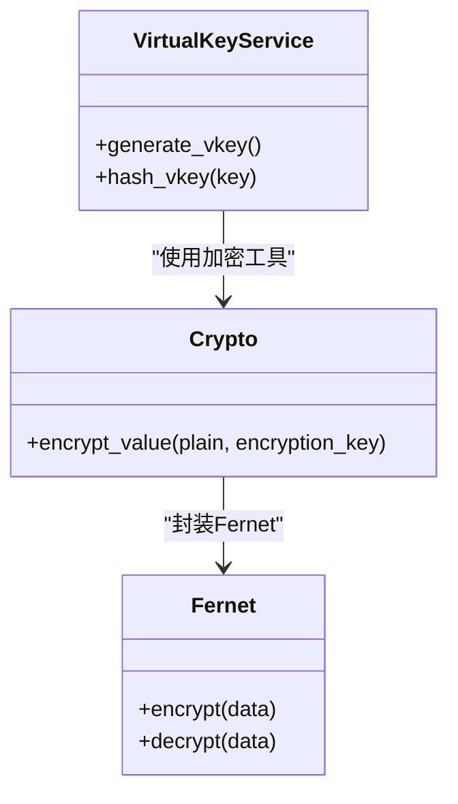
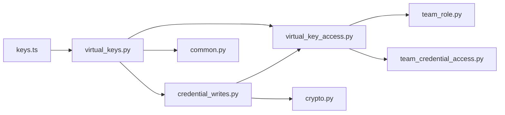

# 虚拟密钥系统

<cite>
**本文引用的文件**
- [virtual_key_service.py](file://backend/domains/gateway/domain/virtual_key_service.py)
- [virtual_keys.py](file://backend/domains/gateway/presentation/routers/virtual_keys.py)
- [virtual_key_access.py](file://backend/domains/gateway/domain/virtual_key_access.py)
- [credential_writes.py](file://backend/domains/gateway/application/management/write_modules/credential_writes.py)
- [keys.ts](file://frontend/src/api/gateway/keys.ts)
- [team_role.py](file://backend/domains/tenancy/domain/policies/team_role.py)
- [team_credential_access.py](file://backend/domains/gateway/domain/team_credential_access.py)
- [http_error_map.py](file://backend/domains/gateway/presentation/http_error_map.py)
- [crypto.py](file://backend/libs/crypto.py)
- [common.py](file://backend/domains/gateway/presentation/schemas/common.py)
- [test_virtual_key_access.py](file://backend/tests/unit/gateway/test_virtual_key_access.py)
- [test_usage_log_visibility_policy.py](file://backend/tests/unit/gateway/domain/test_usage_log_visibility_policy.py)
</cite>

## 目录
1. [简介](#简介)
2. [项目结构](#项目结构)
3. [核心组件](#核心组件)
4. [架构总览](#架构总览)
5. [详细组件分析](#详细组件分析)
6. [依赖关系分析](#依赖关系分析)
7. [性能考量](#性能考量)
8. [故障排查指南](#故障排查指南)
9. [结论](#结论)
10. [附录](#附录)

## 简介
本文件为“虚拟密钥系统”的技术文档，聚焦于虚拟密钥的设计理念、生命周期管理、权限控制、审计追踪、批量管理、与团队权限的集成、安全存储与传输、配置示例、监控告警以及在API调用中的传递与验证流程。系统采用“创建者私有”原则，结合团队角色与平台管理员权限，确保密钥的最小暴露与可控使用。

## 项目结构
虚拟密钥系统主要分布在后端网关域（gateway domain）、应用层（application management）、表现层（presentation routers）以及前端API定义中，同时涉及通用加密工具与团队权限策略。

**图表来源**
- [virtual_keys.py:49-86](file://backend/domains/gateway/presentation/routers/virtual_keys.py#L49-L86)
- [credential_writes.py:105-147](file://backend/domains/gateway/application/management/write_modules/credential_writes.py#L105-L147)
- [virtual_key_service.py:16-47](file://backend/domains/gateway/domain/virtual_key_service.py#L16-L47)
- [virtual_key_access.py:48-84](file://backend/domains/gateway/domain/virtual_key_access.py#L48-L84)
- [team_credential_access.py:1-45](file://backend/domains/gateway/domain/team_credential_access.py#L1-L45)
- [crypto.py:29-41](file://backend/libs/crypto.py#L29-L41)
- [common.py:36-45](file://backend/domains/gateway/presentation/schemas/common.py#L36-L45)
- [team_role.py:1-40](file://backend/domains/tenancy/domain/policies/team_role.py#L1-L40)
- [keys.ts:18-44](file://frontend/src/api/gateway/keys.ts#L18-L44)
- [http_error_map.py:183-223](file://backend/domains/gateway/presentation/http_error_map.py#L183-L223)

**章节来源**
- [virtual_keys.py:49-86](file://backend/domains/gateway/presentation/routers/virtual_keys.py#L49-L86)
- [virtual_key_service.py:16-47](file://backend/domains/gateway/domain/virtual_key_service.py#L16-L47)
- [credential_writes.py:105-147](file://backend/domains/gateway/application/management/write_modules/credential_writes.py#L105-L147)
- [virtual_key_access.py:48-84](file://backend/domains/gateway/domain/virtual_key_access.py#L48-L84)
- [team_credential_access.py:1-45](file://backend/domains/gateway/domain/team_credential_access.py#L1-L45)
- [crypto.py:29-41](file://backend/libs/crypto.py#L29-L41)
- [common.py:36-45](file://backend/domains/gateway/presentation/schemas/common.py#L36-L45)
- [team_role.py:1-40](file://backend/domains/tenancy/domain/policies/team_role.py#L1-L40)
- [keys.ts:18-44](file://frontend/src/api/gateway/keys.ts#L18-L44)
- [http_error_map.py:183-223](file://backend/domains/gateway/presentation/http_error_map.py#L183-L223)

## 核心组件
- 密钥生成与哈希服务：负责生成唯一密钥、计算确定性哈希、设置密钥格式与长度。
- 访问控制：基于“创建者私有”原则，结合系统密钥与活跃状态校验，限制可见与操作范围。
- 写入模块：封装创建、吊销、批量吊销等管理操作，并进行访问校验。
- 加密工具：使用Fernet对完整密钥进行加密存储，确保仅在首次揭示时可见。
- 团队权限策略：区分平台管理员与团队角色，定义管理边界。
- 前端API类型：定义虚拟密钥的响应结构与创建请求模型。

**章节来源**
- [virtual_key_service.py:16-47](file://backend/domains/gateway/domain/virtual_key_service.py#L16-L47)
- [virtual_key_access.py:48-84](file://backend/domains/gateway/domain/virtual_key_access.py#L48-L84)
- [credential_writes.py:105-147](file://backend/domains/gateway/application/management/write_modules/credential_writes.py#L105-L147)
- [crypto.py:29-41](file://backend/libs/crypto.py#L29-L41)
- [team_role.py:1-40](file://backend/domains/tenancy/domain/policies/team_role.py#L1-L40)
- [keys.ts:18-44](file://frontend/src/api/gateway/keys.ts#L18-L44)

## 架构总览
虚拟密钥的生命周期从“创建”开始，经过“存储与揭示”“使用与审计”“吊销与清理”，贯穿团队权限与平台管理员的协同治理。

**图表来源**
- [virtual_keys.py:54-82](file://backend/domains/gateway/presentation/routers/virtual_keys.py#L54-L82)
- [credential_writes.py:105-110](file://backend/domains/gateway/application/management/write_modules/credential_writes.py#L105-L110)
- [virtual_key_access.py:48-69](file://backend/domains/gateway/domain/virtual_key_access.py#L48-L69)
- [virtual_key_service.py:22-35](file://backend/domains/gateway/domain/virtual_key_service.py#L22-L35)
- [crypto.py:29-41](file://backend/libs/crypto.py#L29-L41)

## 详细组件分析

### 组件A：密钥生成与哈希（virtual_key_service.py）
- 设计要点
  - 密钥格式：固定前缀 + 16字符key_id + 分隔符 + 32字符secret，保证可检索与强随机性。
  - 哈希策略：HMAC-SHA256，使用应用PEPPER，便于按哈希快速定位与验证。
  - 性能考虑：避免bcrypt高成本，满足高频验证场景。
- 数据结构与复杂度
  - 生成与哈希均为O(1)，整体创建开销极低。
- 错误处理
  - 未直接暴露异常，通过上层调用捕获与转换。
- 安全性
  - 32字符secret提供足够熵；PEPPER增强抗彩虹表能力。

**图表来源**
- [virtual_key_service.py:16-35](file://backend/domains/gateway/domain/virtual_key_service.py#L16-L35)

**章节来源**
- [virtual_key_service.py:16-47](file://backend/domains/gateway/domain/virtual_key_service.py#L16-L47)

### 组件B：访问控制与权限（virtual_key_access.py, team_credential_access.py, team_role.py）
- 设计理念
  - “创建者私有”：仅密钥创建者可列出、揭示、吊销个人密钥。
  - 系统密钥保护：系统级密钥禁止普通用户访问与吊销。
  - 团队角色与平台管理员：平台管理员拥有旁路权限；团队管理员可管理共享凭据（与虚拟密钥不同）。
- 关键函数
  - 断言访问：校验租户、活跃状态、系统标志与创建者身份。
  - 过滤可见：按创建者过滤密钥列表。
  - 团队兼容：与团队凭据访问策略保持一致的“创建者私有”语义。
- 边界条件
  - 非活跃密钥默认不可见（可配置require_active）。
  - 系统密钥强制拒绝。

**图表来源**
- [virtual_key_access.py:48-69](file://backend/domains/gateway/domain/virtual_key_access.py#L48-L69)

**章节来源**
- [virtual_key_access.py:48-84](file://backend/domains/gateway/domain/virtual_key_access.py#L48-L84)
- [team_credential_access.py:1-45](file://backend/domains/gateway/domain/team_credential_access.py#L1-L45)
- [team_role.py:1-40](file://backend/domains/tenancy/domain/policies/team_role.py#L1-L40)

### 组件C：写入与生命周期管理（credential_writes.py, virtual_keys.py）
- 创建流程
  - 生成密钥三元组，加密完整密钥，计算过期时间，持久化元数据。
  - 首次创建返回完整明文密钥（一次性机会）。
- 吊销与批量吊销
  - 单个吊销：先断言访问权，再执行吊销。
  - 批量吊销：去重、逐条校验与执行，返回成功与失败明细。
- 与前端交互
  - 响应模型包含masked_key与plain_key（一次性）。

**图表来源**
- [credential_writes.py:105-147](file://backend/domains/gateway/application/management/write_modules/credential_writes.py#L105-L147)
- [virtual_keys.py:54-82](file://backend/domains/gateway/presentation/routers/virtual_keys.py#L54-L82)

**章节来源**
- [credential_writes.py:105-147](file://backend/domains/gateway/application/management/write_modules/credential_writes.py#L105-L147)
- [virtual_keys.py:54-82](file://backend/domains/gateway/presentation/routers/virtual_keys.py#L54-L82)

### 组件D：安全存储与传输（crypto.py, virtual_key_service.py）
- 存储策略
  - 完整密钥仅在创建时以明文形式返回一次；后续通过哈希与加密字段进行管理。
  - 加密采用Fernet（基于AES），密钥由应用密钥派生，确保可恢复但需严格保密。
- 传输安全
  - 建议通过HTTPS传输；前端仅接收masked_key与plain_key（一次性）。
- 密钥轮换
  - 通过重新派生加密密钥实现轮换；旧密钥仍可解密历史encrypted_key。

**图表来源**
- [virtual_key_service.py:16-47](file://backend/domains/gateway/domain/virtual_key_service.py#L16-L47)
- [crypto.py:29-41](file://backend/libs/crypto.py#L29-L41)

**章节来源**
- [crypto.py:29-41](file://backend/libs/crypto.py#L29-L41)
- [virtual_key_service.py:16-47](file://backend/domains/gateway/domain/virtual_key_service.py#L16-L47)

### 组件E：前端API类型与使用（keys.ts, common.py）
- 响应模型
  - VirtualKey：包含id、masked_key、allowed_*、limits、is_system、expires_at、统计信息等。
  - VirtualKeyCreated：在创建成功时额外返回plain_key。
- 请求模型
  - VirtualKeyCreate：name、description、allowed_models/capabilities、limits、store_full_messages、guardrail_enabled、expires_in_days。

**章节来源**
- [keys.ts:18-44](file://frontend/src/api/gateway/keys.ts#L18-L44)
- [common.py:36-45](file://backend/domains/gateway/presentation/schemas/common.py#L36-L45)

## 依赖关系分析
- 路由依赖写入模块，写入模块依赖访问控制与加密工具。
- 访问控制依赖团队角色策略与团队凭据访问策略，保持一致性。
- 前端类型与后端路由/模型保持字段对齐，确保契约稳定。

**图表来源**
- [virtual_keys.py:49-86](file://backend/domains/gateway/presentation/routers/virtual_keys.py#L49-L86)
- [credential_writes.py:105-147](file://backend/domains/gateway/application/management/write_modules/credential_writes.py#L105-L147)
- [virtual_key_access.py:48-84](file://backend/domains/gateway/domain/virtual_key_access.py#L48-L84)
- [team_role.py:1-40](file://backend/domains/tenancy/domain/policies/team_role.py#L1-L40)
- [team_credential_access.py:1-45](file://backend/domains/gateway/domain/team_credential_access.py#L1-L45)
- [crypto.py:29-41](file://backend/libs/crypto.py#L29-L41)
- [common.py:36-45](file://backend/domains/gateway/presentation/schemas/common.py#L36-L45)
- [keys.ts:18-44](file://frontend/src/api/gateway/keys.ts#L18-L44)

**章节来源**
- [virtual_keys.py:49-86](file://backend/domains/gateway/presentation/routers/virtual_keys.py#L49-L86)
- [credential_writes.py:105-147](file://backend/domains/gateway/application/management/write_modules/credential_writes.py#L105-L147)
- [virtual_key_access.py:48-84](file://backend/domains/gateway/domain/virtual_key_access.py#L48-L84)
- [team_role.py:1-40](file://backend/domains/tenancy/domain/policies/team_role.py#L1-L40)
- [team_credential_access.py:1-45](file://backend/domains/gateway/domain/team_credential_access.py#L1-L45)
- [crypto.py:29-41](file://backend/libs/crypto.py#L29-L41)
- [common.py:36-45](file://backend/domains/gateway/presentation/schemas/common.py#L36-L45)
- [keys.ts:18-44](file://frontend/src/api/gateway/keys.ts#L18-L44)

## 性能考量
- 验证路径优化：使用HMAC-SHA256哈希替代bcrypt，满足高频验证场景。
- 存储与索引：按key_hash与key_id建立索引，提升查询效率。
- 批量操作：批量吊销去重与并发处理，减少重复校验与数据库往返。

[本节为通用性能讨论，不直接分析具体文件]

## 故障排查指南
- 常见错误与处理
  - 系统密钥禁止：当尝试访问或吊销系统密钥时触发，需检查is_system标记。
  - 密钥不存在/非活跃：确认key_id、租户匹配与is_active状态。
  - 解密错误：确认加密密钥正确且未轮换；检查encrypted_key版本。
- 单元测试参考
  - 访问控制测试：覆盖非活跃密钥、系统密钥、非创建者访问等边界。
  - 使用日志可见性：验证成员仅能查看自身拥有的虚拟密钥使用记录。

**章节来源**
- [http_error_map.py:183-223](file://backend/domains/gateway/presentation/http_error_map.py#L183-L223)
- [test_virtual_key_access.py:46-94](file://backend/tests/unit/gateway/test_virtual_key_access.py#L46-L94)
- [test_usage_log_visibility_policy.py:84-133](file://backend/tests/unit/gateway/domain/test_usage_log_visibility_policy.py#L84-L133)

## 结论
虚拟密钥系统通过“创建者私有”与团队/平台管理员权限相结合，实现了密钥的最小暴露与可控管理；借助HMAC哈希与Fernet加密，兼顾了性能与安全性；批量管理与审计追踪为运维提供了高效手段。建议在生产环境强化HTTPS、密钥轮换与监控告警，确保全生命周期安全。

[本节为总结性内容，不直接分析具体文件]

## 附录

### A. 权限控制机制
- 能力范围限制：allowed_models与allowed_capabilities在创建时设定，后续使用受此约束。
- 使用场景绑定：通过team_id与tenant_id绑定到团队与租户上下文。
- 时间窗口控制：expires_in_days控制有效期，到期后视为非活跃。

**章节来源**
- [virtual_keys.py:54-82](file://backend/domains/gateway/presentation/routers/virtual_keys.py#L54-L82)
- [common.py:36-45](file://backend/domains/gateway/presentation/schemas/common.py#L36-L45)

### B. 审计与追踪
- 使用记录：支持按用户与密钥维度统计usage_count与last_used_at。
- 访问日志：成员仅能查看自身拥有的虚拟密钥使用记录，避免越权。
- 异常检测：结合吊销与过期事件，配合监控告警识别异常行为。

**章节来源**
- [test_usage_log_visibility_policy.py:84-133](file://backend/tests/unit/gateway/domain/test_usage_log_visibility_policy.py#L84-L133)

### C. 批量管理与自动化
- 批量创建：通过多次POST /keys实现；注意幂等与去重。
- 批量吊销：调用批量吊销接口，返回成功与失败明细，便于自动化脚本处理。
- 删除：系统当前未提供删除接口，建议通过吊销与过期策略实现生命周期结束。

**章节来源**
- [credential_writes.py:131-147](file://backend/domains/gateway/application/management/write_modules/credential_writes.py#L131-L147)

### D. 与团队权限的集成
- 角色管理：平台管理员拥有旁路权限；团队Owner/Admin可管理共享凭据（与虚拟密钥不同）。
- 权限继承：个人虚拟密钥遵循创建者私有，不继承团队共享权限。

**章节来源**
- [team_role.py:1-40](file://backend/domains/tenancy/domain/policies/team_role.py#L1-L40)
- [team_credential_access.py:1-45](file://backend/domains/gateway/domain/team_credential_access.py#L1-L45)

### E. 配置示例与使用场景
- 创建场景：设置name、description、allowed_models/capabilities、limits、guardrail_enabled、expires_in_days。
- 使用场景：在API调用中携带masked_key或plain_key（一次性），后端通过哈希与加密字段完成验证与审计。

**章节来源**
- [common.py:36-45](file://backend/domains/gateway/presentation/schemas/common.py#L36-L45)
- [keys.ts:18-44](file://frontend/src/api/gateway/keys.ts#L18-L44)

### F. 监控与告警
- 建议指标：密钥创建/吊销次数、使用量(rpm/tpm)、过期预警、异常访问尝试。
- 告警规则：连续失败登录、批量吊销、系统密钥异常访问等。

[本节为通用指导，不直接分析具体文件]

### G. API调用中的传递与验证流程
- 传递：前端接收masked_key与plain_key（一次性），后端通过哈希与加密字段进行验证。
- 验证：先断言访问权，再进行哈希比对与必要时解密校验。

**章节来源**
- [virtual_key_access.py:48-69](file://backend/domains/gateway/domain/virtual_key_access.py#L48-L69)
- [virtual_key_service.py:22-47](file://backend/domains/gateway/domain/virtual_key_service.py#L22-L47)