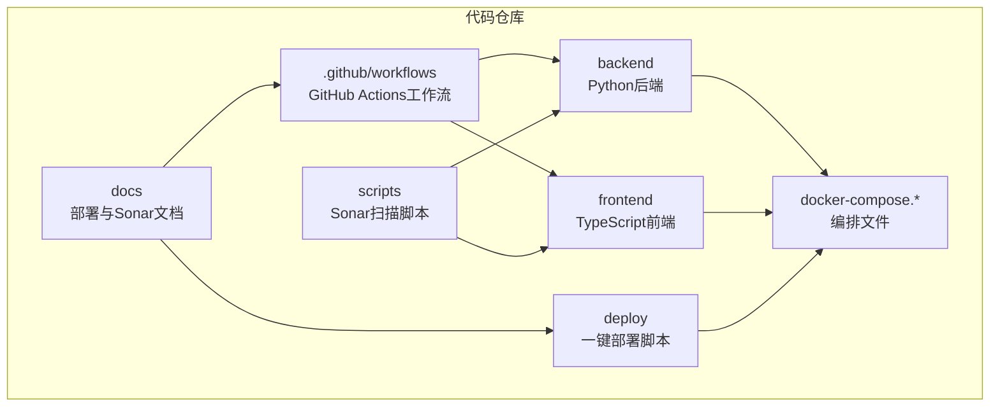
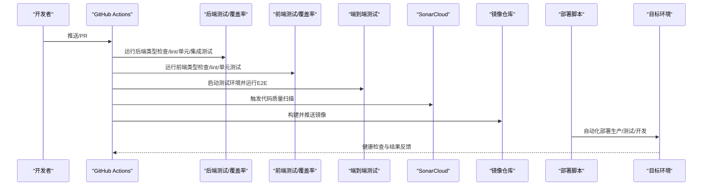
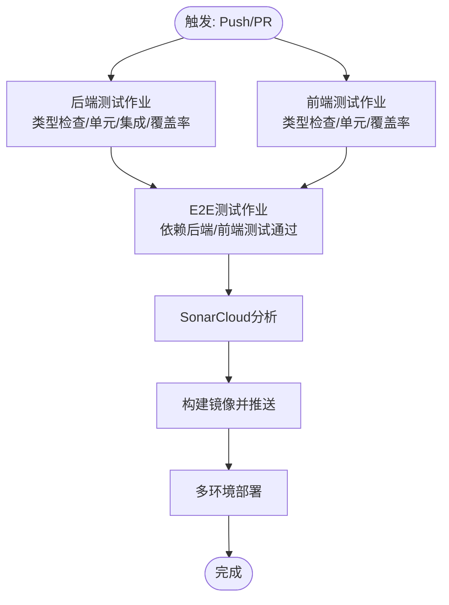
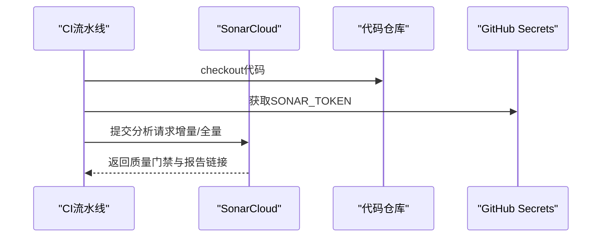
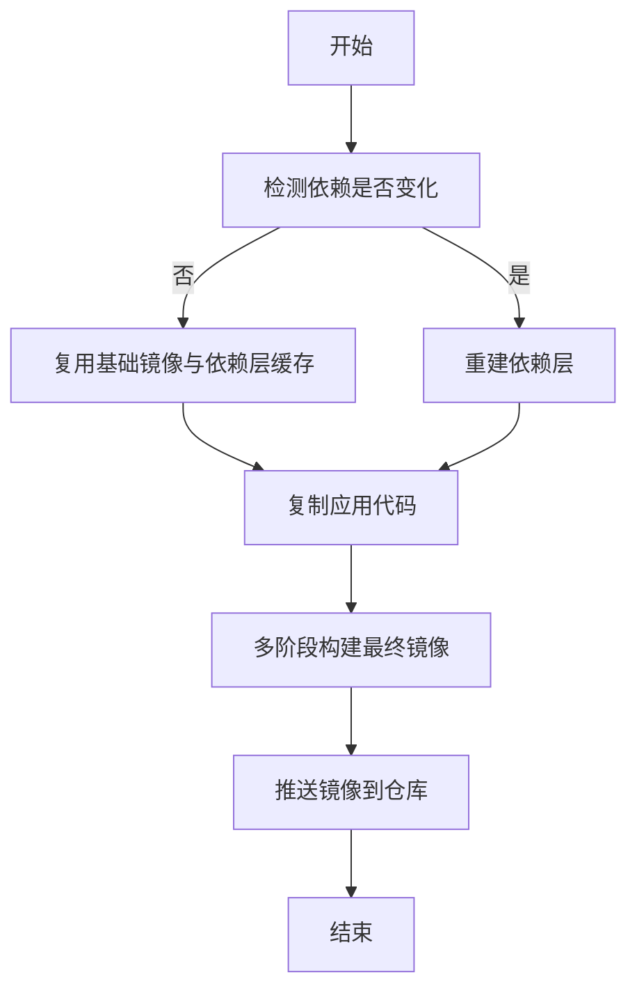
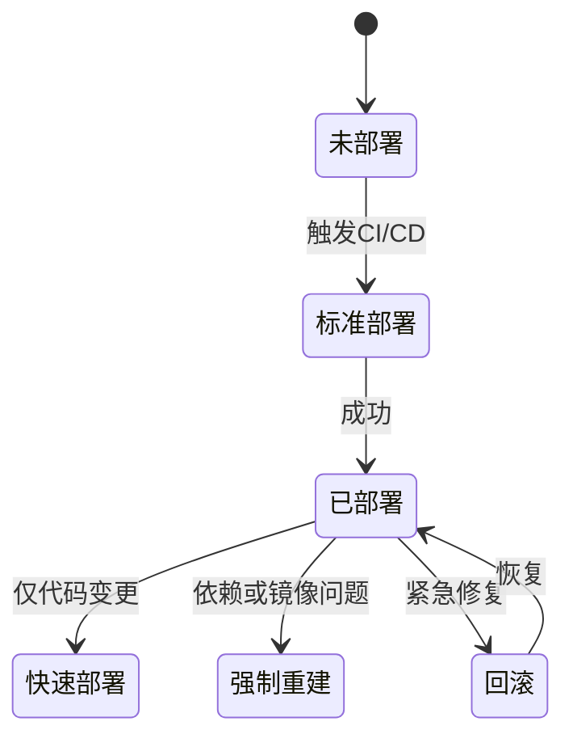
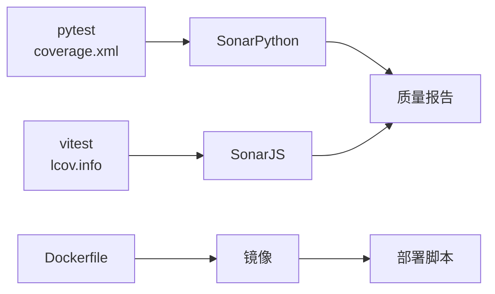

# CI/CD流水线

<cite>
**本文档引用的文件**
- [docs/系统可测试性与TDD设计.md](file://docs/系统可测试性与TDD设计.md)
- [.github/workflows/sonarcloud.yml](file://.github/workflows/sonarcloud.yml)
- [docs/SONARQUBE.md](file://docs/SONARQUBE.md)
- [deploy/deploy.sh](file://deploy/deploy.sh)
- [docs/DEPLOYMENT.md](file://docs/DEPLOYMENT.md)
- [Makefile](file://Makefile)
- [scripts/run-e2e.ps1](file://scripts/run-e2e.ps1)
- [scripts/sonar-scan.ps1](file://scripts/sonar-scan.ps1)
- [scripts/sonar-scan.sh](file://scripts/sonar-scan.sh)
- [scripts/sonarcloud-scan.ps1](file://scripts/sonarcloud-scan.ps1)
- [scripts/sonarcloud-scan.sh](file://scripts/sonarcloud-scan.sh)
- [docker-compose.prod.yml](file://docker-compose.prod.yml)
- [docker-compose.yml](file://docker-compose.yml)
- [backend/Dockerfile](file://backend/Dockerfile)
- [frontend/Dockerfile](file://frontend/Dockerfile)
- [backend/pyproject.toml](file://backend/pyproject.toml)
- [frontend/package.json](file://frontend/package.json)
- [backend/sonar-project.properties](file://backend/sonar-project.properties)
- [frontend/sonar-project.properties](file://frontend/sonar-project.properties)
- [backend/test-results.xml](file://backend/test-results.xml)
- [frontend/vitest.config.ts](file://frontend/vitest.config.ts)
- [backend/scripts/run_sonar_scanner.py](file://backend/scripts/run_sonar_scanner.py)
</cite>

## 目录
1. [简介](#简介)
2. [项目结构](#项目结构)
3. [核心组件](#核心组件)
4. [架构总览](#架构总览)
5. [详细组件分析](#详细组件分析)
6. [依赖关系分析](#依赖关系分析)
7. [性能考虑](#性能考虑)
8. [故障排除指南](#故障排除指南)
9. [结论](#结论)
10. [附录](#附录)

## 简介
本文件为AI Agent项目的CI/CD流水线完整指南，覆盖GitHub Actions工作流配置、代码质量检查、单元测试、集成测试与端到端测试的自动化执行；SonarQube/SonarCloud代码质量扫描的配置与集成；Docker镜像构建与推送自动化；多环境部署策略（开发、测试、生产）；版本标签与发布分支策略；安全扫描与依赖漏洞检查；回滚机制与紧急修复流程；手动审批与强制合并配置等。面向DevOps工程师提供从流水线设计到运维落地的全栈指导。

## 项目结构
项目采用前后端分离架构，配合多阶段Docker构建与Compose编排，结合GitHub Actions实现端到端的持续集成与持续部署。关键目录与文件如下：
- .github/workflows：GitHub Actions工作流定义
- backend：Python后端工程，含Dockerfile、测试与Sonar配置
- frontend：TypeScript/Vue前端工程，含Dockerfile与测试配置
- deploy：一键部署脚本与生产编排
- docker-compose.*：开发与生产环境编排
- scripts：本地与CI侧的Sonar扫描脚本
- docs：部署与Sonar集成文档

**图表来源**
- [.github/workflows/sonarcloud.yml:1-175](file://.github/workflows/sonarcloud.yml#L1-L175)
- [deploy/deploy.sh:1-259](file://deploy/deploy.sh#L1-L259)
- [docker-compose.yml:1-200](file://docker-compose.yml#L1-L200)

**章节来源**
- [docs/系统可测试性与TDD设计.md:1585-1807](file://docs/系统可测试性与TDD设计.md#L1585-L1807)
- [docs/SONARQUBE.md:63-121](file://docs/SONARQUBE.md#L63-L121)

## 核心组件
- GitHub Actions工作流：包含测试、覆盖率、E2E与SonarCloud分析
- SonarQube/SonarCloud：代码质量度量与安全告警
- Docker镜像构建：多阶段构建与分层缓存优化
- 多环境部署：开发、测试、生产环境的自动化部署
- 版本与分支策略：基于Git标签与分支的发布流程
- 安全与漏洞：依赖扫描与安全检查集成
- 回滚与紧急修复：一键回滚与快速修复流程
- 手动审批与强制合并：保护主分支的合并策略

**章节来源**
- [docs/系统可测试性与TDD设计.md:1585-1807](file://docs/系统可测试性与TDD设计.md#L1585-L1807)
- [docs/SONARQUBE.md:63-121](file://docs/SONARQUBE.md#L63-L121)
- [docs/DEPLOYMENT.md:204-313](file://docs/DEPLOYMENT.md#L204-L313)

## 架构总览
CI/CD流水线由“触发—构建—测试—质量扫描—打包—部署—验证”构成的闭环，贯穿开发、测试与生产环境。

**图表来源**
- [.github/workflows/sonarcloud.yml:75-175](file://.github/workflows/sonarcloud.yml#L75-L175)
- [docs/系统可测试性与TDD设计.md:1585-1807](file://docs/系统可测试性与TDD设计.md#L1585-L1807)
- [deploy/deploy.sh:217-237](file://deploy/deploy.sh#L217-L237)

## 详细组件分析

### GitHub Actions工作流配置
- 触发条件：对main/develop分支的push与pull_request
- 后端测试：Python 3.11，Postgres与Redis服务，类型检查、lint、单元与集成测试，覆盖率上传Codecov
- 前端测试：Node.js 20，pnpm，类型检查、lint、单元测试，覆盖率上传Codecov
- E2E测试：依赖后端/前端测试通过，使用Docker Compose启动测试环境，Playwright执行端到端测试，失败时上传报告
- 覆盖率阈值：后端覆盖率不低于80%，可在CI中校验

**图表来源**
- [docs/系统可测试性与TDD设计.md:1585-1807](file://docs/系统可测试性与TDD设计.md#L1585-L1807)
- [.github/workflows/sonarcloud.yml:75-175](file://.github/workflows/sonarcloud.yml#L75-L175)

**章节来源**
- [docs/系统可测试性与TDD设计.md:1585-1807](file://docs/系统可测试性与TDD设计.md#L1585-L1807)

### SonarQube/SonarCloud代码质量扫描
- 工作流：.github/workflows/sonarcloud.yml提供后端与前端独立分析任务，以及可选的Monorepo整体分析
- 配置：通过GitHub Secrets注入SONAR_TOKEN；支持增量分析（PR）与全量分析（main/develop）
- 报告：前端覆盖率与ESLint报告上传；后端覆盖率XML上传
- 本地集成：提供本地扫描脚本与配置文件，便于本地调试

**图表来源**
- [.github/workflows/sonarcloud.yml:75-175](file://.github/workflows/sonarcloud.yml#L75-L175)
- [docs/SONARQUBE.md:63-121](file://docs/SONARQUBE.md#L63-L121)

**章节来源**
- [.github/workflows/sonarcloud.yml:75-175](file://.github/workflows/sonarcloud.yml#L75-L175)
- [docs/SONARQUBE.md:63-121](file://docs/SONARQUBE.md#L63-L121)

### Docker镜像构建与推送自动化
- 多阶段构建：后端与前端分别采用多阶段Dockerfile，最小化最终镜像
- 分层缓存：基于.lock文件与Dockerfile分层，依赖不变时构建秒级完成
- 缓存优化：国内镜像源、.dockerignore、并行构建前后端
- 生产镜像：后端不含build-essential，前端仅Nginx+静态文件
- 推送策略：结合CI/CD在成功构建后推送至镜像仓库

**图表来源**
- [docs/DEPLOYMENT.md:204-313](file://docs/DEPLOYMENT.md#L204-L313)
- [backend/Dockerfile:1-200](file://backend/Dockerfile#L1-L200)
- [frontend/Dockerfile:1-200](file://frontend/Dockerfile#L1-L200)

**章节来源**
- [docs/DEPLOYMENT.md:204-313](file://docs/DEPLOYMENT.md#L204-L313)
- [backend/Dockerfile:1-200](file://backend/Dockerfile#L1-L200)
- [frontend/Dockerfile:1-200](file://frontend/Dockerfile#L1-L200)

### 多环境部署策略
- 开发环境：docker-compose.yml用于本地开发与联调
- 测试环境：docker-compose.test.yml用于E2E测试
- 生产环境：docker-compose.prod.yml与一键部署脚本deploy.sh
- 部署模式：
  - 标准部署：同步代码→构建镜像→数据库迁移→启动服务
  - 快速部署：跳过镜像构建，直接重启容器
  - 强制重建：--no-cache重新构建
  - 仅重启/状态/日志/停止：运维常用操作

**图表来源**
- [deploy/deploy.sh:217-237](file://deploy/deploy.sh#L217-L237)
- [docker-compose.prod.yml:1-200](file://docker-compose.prod.yml#L1-L200)

**章节来源**
- [deploy/deploy.sh:1-259](file://deploy/deploy.sh#L1-L259)
- [docs/DEPLOYMENT.md:204-313](file://docs/DEPLOYMENT.md#L204-L313)

### 版本标签与发布分支策略
- 分支策略：main作为稳定发布分支，develop作为集成分支，hotfix/release分支用于紧急修复与功能发布
- 标签策略：以语义化版本打Tag（vX.Y.Z），CI根据标签触发发布流程
- 发布流程：构建镜像→推送→部署→健康检查→记录发布日志

**章节来源**
- [docs/系统可测试性与TDD设计.md:1585-1807](file://docs/系统可测试性与TDD设计.md#L1585-L1807)

### 安全扫描与依赖漏洞检查
- 依赖扫描：在CI中集成依赖漏洞扫描工具（如OSV、npm audit、pip-audit等），建议在工作流中新增job
- 代码安全：ESLint与SonarCloud规则结合，关注高危与严重级别问题
- 凭据管理：通过GitHub Secrets管理敏感信息，避免硬编码

**章节来源**
- [.github/workflows/sonarcloud.yml:103-105](file://.github/workflows/sonarcloud.yml#L103-L105)

### 回滚机制与紧急修复流程
- 回滚策略：一键回滚至上一个稳定版本，保留数据库迁移历史
- 紧急修复：hotfix分支从上一个稳定Tag创建，快速修复后合并至main与develop
- 验证：回滚后执行健康检查与关键测试，确保服务可用

**章节来源**
- [docs/DEPLOYMENT.md:204-313](file://docs/DEPLOYMENT.md#L204-L313)

### 手动审批与强制合并
- 保护分支：main/develop设置保护规则，要求审查与CI通过
- 手动审批：关键环境（生产）部署需人工确认
- 强制合并：禁止直接推送至受保护分支，必须通过PR合并

**章节来源**
- [docs/系统可测试性与TDD设计.md:1585-1807](file://docs/系统可测试性与TDD设计.md#L1585-L1807)

## 依赖关系分析
- 测试与覆盖率：后端pytest输出coverage.xml，前端vitest输出lcov报告，供Sonar与Codecov消费
- Sonar配置：backend/frontend各自提供sonar-project.properties，统一在monorepo任务中聚合
- Docker构建：后端与前端Dockerfile相互独立，部署脚本统一编排

**图表来源**
- [backend/test-results.xml:1-50](file://backend/test-results.xml#L1-L50)
- [frontend/vitest.config.ts:1-200](file://frontend/vitest.config.ts#L1-L200)
- [backend/sonar-project.properties:1-200](file://backend/sonar-project.properties#L1-L200)
- [frontend/sonar-project.properties:1-200](file://frontend/sonar-project.properties#L1-L200)

**章节来源**
- [backend/sonar-project.properties:1-200](file://backend/sonar-project.properties#L1-L200)
- [frontend/sonar-project.properties:1-200](file://frontend/sonar-project.properties#L1-L200)

## 性能考虑
- 构建性能：基础镜像复用、依赖层缓存命中、国内镜像源、并行构建
- 部署性能：基础设施服务智能跳过、最小化生产镜像、资源限制
- 测试性能：类型检查与lint前置，单元/集成优先，E2E按需执行

**章节来源**
- [docs/DEPLOYMENT.md:204-313](file://docs/DEPLOYMENT.md#L204-L313)

## 故障排除指南
- Docker权限：添加用户到docker组或使用脚本内嵌的sg docker处理
- 国内网络：配置REGISTRY_PREFIX、UV_INDEX_URL、NPM_REGISTRY等镜像源
- 构建失败：使用--rebuild强制重建，检查.dockerignore与Dockerfile分层
- Sonar扫描：确认SONAR_TOKEN与项目Key正确，增量分析仅在PR有效
- E2E失败：检查测试环境启动与健康检查，必要时上传playwright报告

**章节来源**
- [deploy/deploy.sh:16-33](file://deploy/deploy.sh#L16-L33)
- [docs/DEPLOYMENT.md:286-313](file://docs/DEPLOYMENT.md#L286-L313)
- [docs/SONARQUBE.md:63-121](file://docs/SONARQUBE.md#L63-L121)

## 结论
本CI/CD流水线通过GitHub Actions串联测试、质量扫描与部署，结合多阶段Docker构建与一键部署脚本，实现了高效、可追溯、可回滚的持续交付能力。建议在现有基础上补充依赖漏洞扫描与安全扫描job，并完善生产环境的手动审批与强制合并策略，进一步提升安全性与合规性。

## 附录
- 本地Sonar扫描脚本：scripts/sonar-scan.sh、scripts/sonarcloud-scan.sh
- E2E测试脚本：scripts/run-e2e.ps1
- Makefile命令：deploy、deploy-quick、deploy-rebuild等

**章节来源**
- [scripts/sonar-scan.sh:1-200](file://scripts/sonar-scan.sh#L1-L200)
- [scripts/sonarcloud-scan.sh:1-200](file://scripts/sonarcloud-scan.sh#L1-L200)
- [scripts/run-e2e.ps1:1-200](file://scripts/run-e2e.ps1#L1-L200)
- [Makefile:275-293](file://Makefile#L275-L293)