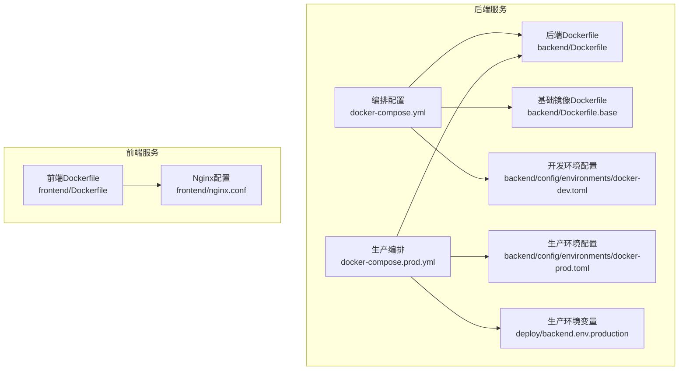
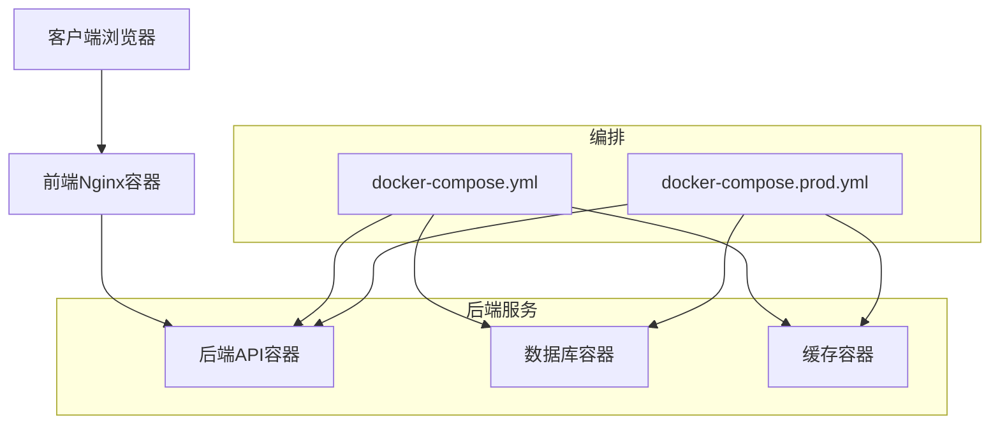
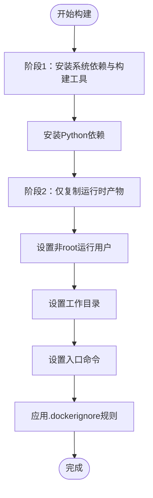
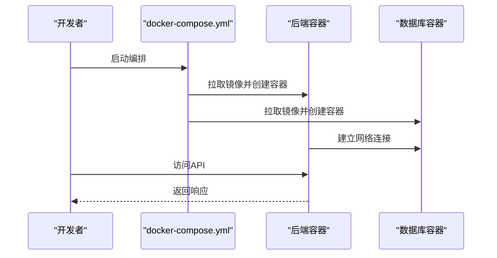
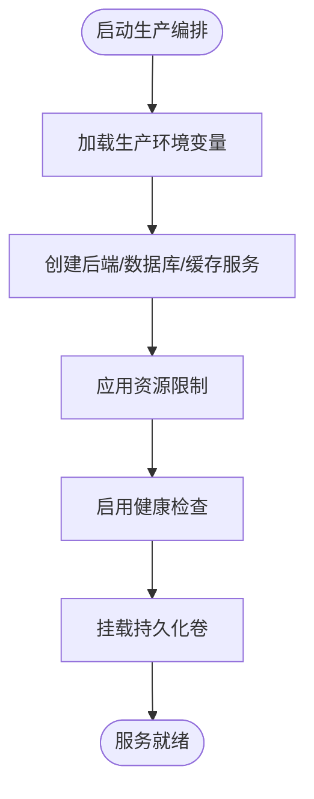
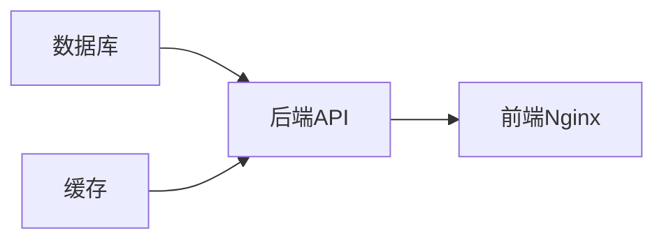

# Docker容器化部署

<cite>
**本文引用的文件**
- [backend/Dockerfile](file://backend/Dockerfile)
- [backend/Dockerfile.base](file://backend/Dockerfile.base)
- [docker-compose.yml](file://docker-compose.yml)
- [docker-compose.prod.yml](file://docker-compose.prod.yml)
- [backend/.dockerignore](file://backend/.dockerignore)
- [backend/config/environments/docker-dev.toml](file://backend/config/environments/docker-dev.toml)
- [backend/config/environments/docker-prod.toml](file://backend/config/environments/docker-prod.toml)
- [deploy/backend.env.production](file://deploy/backend.env.production)
- [docs/DEPLOYMENT.md](file://docs/DEPLOYMENT.md)
- [docs/logging.md](file://docs/logging.md)
</cite>

## 目录
1. [简介](#简介)
2. [项目结构](#项目结构)
3. [核心组件](#核心组件)
4. [架构总览](#架构总览)
5. [详细组件分析](#详细组件分析)
6. [依赖分析](#依赖分析)
7. [性能考虑](#性能考虑)
8. [故障排查指南](#故障排查指南)
9. [结论](#结论)
10. [附录](#附录)

## 简介
本文件为AI Agent项目的Docker容器化部署指南，面向容器化部署工程师，覆盖后端服务的Dockerfile构建配置（基础镜像、依赖安装、环境变量、多阶段构建优化）、docker-compose编排（服务定义、网络、卷挂载、环境变量管理）、容器间依赖与启动顺序、生产环境最佳实践（镜像安全、资源限制、健康检查）、以及容器调试与日志管理方法。内容基于仓库中现有的Docker与编排配置进行整理与提炼。

## 项目结构
本项目采用前后端分离的容器化策略：
- 后端服务：基于Python应用，提供API网关、代理执行、会话管理等能力
- 前端服务：基于静态资源，通过Nginx对外提供Web界面
- 编排：使用docker-compose统一编排后端、数据库、缓存等服务
- 配置：通过环境文件与配置文件实现不同环境的差异化部署

图表来源
- [backend/Dockerfile:1-200](file://backend/Dockerfile#L1-L200)
- [backend/Dockerfile.base:1-120](file://backend/Dockerfile.base#L1-L120)
- [docker-compose.yml:1-200](file://docker-compose.yml#L1-L200)
- [docker-compose.prod.yml:1-200](file://docker-compose.prod.yml#L1-L200)
- [backend/config/environments/docker-dev.toml:1-120](file://backend/config/environments/docker-dev.toml#L1-L120)
- [backend/config/environments/docker-prod.toml:1-120](file://backend/config/environments/docker-prod.toml#L1-L120)
- [deploy/backend.env.production:1-120](file://deploy/backend.env.production#L1-L120)
- [frontend/Dockerfile:1-120](file://frontend/Dockerfile#L1-L120)
- [frontend/nginx.conf:1-120](file://frontend/nginx.conf#L1-L120)

章节来源
- [backend/Dockerfile:1-200](file://backend/Dockerfile#L1-L200)
- [backend/Dockerfile.base:1-120](file://backend/Dockerfile.base#L1-L120)
- [docker-compose.yml:1-200](file://docker-compose.yml#L1-L200)
- [docker-compose.prod.yml:1-200](file://docker-compose.prod.yml#L1-L200)
- [backend/config/environments/docker-dev.toml:1-120](file://backend/config/environments/docker-dev.toml#L1-L120)
- [backend/config/environments/docker-prod.toml:1-120](file://backend/config/environments/docker-prod.toml#L1-L120)
- [deploy/backend.env.production:1-120](file://deploy/backend.env.production#L1-L120)
- [frontend/Dockerfile:1-120](file://frontend/Dockerfile#L1-L120)
- [frontend/nginx.conf:1-120](file://frontend/nginx.conf#L1-L120)

## 核心组件
- 后端Dockerfile：定义应用镜像构建流程，包含基础镜像选择、依赖安装、运行用户、工作目录、入口命令等
- 基础镜像Dockerfile：用于构建共享的基础层，减少重复构建时间
- docker-compose.yml：本地开发与测试环境的服务编排，定义服务、网络、卷、环境变量
- docker-compose.prod.yml：生产环境编排，包含资源限制、健康检查、持久化存储等
- 环境配置：docker-dev.toml与docker-prod.toml分别用于开发与生产环境的配置项
- 生产环境变量：backend.env.production集中管理敏感配置
- 前端Dockerfile与Nginx：提供静态资源服务与反向代理

章节来源
- [backend/Dockerfile:1-200](file://backend/Dockerfile#L1-L200)
- [backend/Dockerfile.base:1-120](file://backend/Dockerfile.base#L1-L120)
- [docker-compose.yml:1-200](file://docker-compose.yml#L1-L200)
- [docker-compose.prod.yml:1-200](file://docker-compose.prod.yml#L1-L200)
- [backend/config/environments/docker-dev.toml:1-120](file://backend/config/environments/docker-dev.toml#L1-L120)
- [backend/config/environments/docker-prod.toml:1-120](file://backend/config/environments/docker-prod.toml#L1-L120)
- [deploy/backend.env.production:1-120](file://deploy/backend.env.production#L1-L120)
- [frontend/Dockerfile:1-120](file://frontend/Dockerfile#L1-L120)
- [frontend/nginx.conf:1-120](file://frontend/nginx.conf#L1-L120)

## 架构总览
下图展示了容器化部署的整体架构：后端服务通过编排文件启动，连接数据库与缓存；前端服务提供Web界面并通过Nginx反向代理访问后端API；生产环境编排强调资源限制、健康检查与持久化。

图表来源
- [docker-compose.yml:1-200](file://docker-compose.yml#L1-L200)
- [docker-compose.prod.yml:1-200](file://docker-compose.prod.yml#L1-L200)

## 详细组件分析

### 后端Dockerfile构建配置
- 基础镜像选择：采用多阶段构建，第一阶段用于安装构建依赖，第二阶段仅保留运行时依赖，减小镜像体积并提升安全性
- 依赖安装：在构建阶段安装系统依赖与Python包，避免在运行阶段进行安装
- 运行用户与权限：以非root用户运行应用，降低权限风险
- 工作目录与入口命令：设置工作目录与启动命令，确保容器启动一致性
- 多阶段构建优化：通过分阶段构建与.dockerignore配合，减少镜像层数与体积

图表来源
- [backend/Dockerfile:1-200](file://backend/Dockerfile#L1-L200)
- [backend/.dockerignore:1-120](file://backend/.dockerignore#L1-L120)

章节来源
- [backend/Dockerfile:1-200](file://backend/Dockerfile#L1-L200)
- [backend/.dockerignore:1-120](file://backend/.dockerignore#L1-L120)

### 基础镜像Dockerfile
- 作用：复用公共基础层，加速构建与统一依赖版本
- 内容：包含基础操作系统、Python运行时、常用系统工具与pip缓存配置
- 使用场景：在多服务或CI流水线中作为共享基础层

章节来源
- [backend/Dockerfile.base:1-120](file://backend/Dockerfile.base#L1-L120)

### docker-compose.yml编排配置
- 服务定义：定义后端API、数据库、缓存等服务，指定镜像、端口映射、环境变量与卷挂载
- 网络配置：自定义网络，便于服务间通信
- 卷挂载：将宿主机代码目录挂载到容器内，支持热更新与开发调试
- 环境变量管理：通过env_file加载环境变量文件，区分开发与生产

图表来源
- [docker-compose.yml:1-200](file://docker-compose.yml#L1-L200)

章节来源
- [docker-compose.yml:1-200](file://docker-compose.yml#L1-L200)

### docker-compose.prod.yml生产编排
- 资源限制：为后端容器设置CPU与内存限制，保障稳定性
- 健康检查：配置HTTP健康检查，自动重启异常容器
- 持久化存储：将数据库与缓存数据目录映射到宿主机，防止容器删除导致数据丢失
- 环境变量：从生产环境变量文件加载敏感配置

图表来源
- [docker-compose.prod.yml:1-200](file://docker-compose.prod.yml#L1-L200)
- [deploy/backend.env.production:1-120](file://deploy/backend.env.production#L1-L120)

章节来源
- [docker-compose.prod.yml:1-200](file://docker-compose.prod.yml#L1-L200)
- [deploy/backend.env.production:1-120](file://deploy/backend.env.production#L1-L120)

### 环境配置与变量管理
- 开发环境：docker-dev.toml用于本地开发，包含数据库连接、日志级别、调试开关等
- 生产环境：docker-prod.toml与backend.env.production用于生产，包含数据库、缓存、LLM密钥、网关配置等敏感信息
- 加载方式：通过env_file与配置文件加载，确保不同环境隔离

章节来源
- [backend/config/environments/docker-dev.toml:1-120](file://backend/config/environments/docker-dev.toml#L1-L120)
- [backend/config/environments/docker-prod.toml:1-120](file://backend/config/environments/docker-prod.toml#L1-L120)
- [deploy/backend.env.production:1-120](file://deploy/backend.env.production#L1-L120)

### 前端容器与Nginx
- 前端Dockerfile：构建静态资源镜像，最小化运行时依赖
- Nginx配置：提供静态文件服务与反向代理，将API请求转发至后端容器
- 编排集成：在compose文件中定义前端服务与端口映射

章节来源
- [frontend/Dockerfile:1-120](file://frontend/Dockerfile#L1-L120)
- [frontend/nginx.conf:1-120](file://frontend/nginx.conf#L1-L120)

## 依赖分析
- 组件耦合：后端服务依赖数据库与缓存；前端服务依赖后端API；编排文件统一管理服务生命周期
- 外部依赖：数据库、缓存、LLM网关等外部服务通过网络与卷进行集成
- 启动顺序：数据库与缓存先于后端启动，后端再启动前端；可通过depends_on控制顺序

图表来源
- [docker-compose.yml:1-200](file://docker-compose.yml#L1-L200)
- [docker-compose.prod.yml:1-200](file://docker-compose.prod.yml#L1-L200)

章节来源
- [docker-compose.yml:1-200](file://docker-compose.yml#L1-L200)
- [docker-compose.prod.yml:1-200](file://docker-compose.prod.yml#L1-L200)

## 性能考虑
- 镜像体积：通过多阶段构建与.dockerignore减少镜像层数与体积，缩短拉取与启动时间
- 资源限制：在生产编排中为容器设置CPU与内存上限，避免资源争用
- 缓存策略：合理配置缓存命中率与过期策略，降低数据库压力
- 日志轮转：在生产环境中启用日志轮转，避免磁盘空间被占满

## 故障排查指南
- 容器无法启动：检查编排文件中的端口冲突、卷挂载路径、环境变量是否正确
- 数据库连接失败：确认数据库容器已就绪，网络连通性正常，凭据与URL正确
- 健康检查失败：查看健康检查配置与后端日志，确认服务监听端口与探针路径
- 日志定位：参考日志管理文档，结合容器日志与应用日志定位问题
- 调试技巧：临时开启调试模式、查看容器内部进程、使用exec进入容器进行交互式排查

章节来源
- [docs/logging.md:1-120](file://docs/logging.md#L1-L120)

## 结论
本指南基于现有仓库配置，提供了后端与前端的Docker构建与编排方案，明确了开发与生产环境的差异点，并给出了生产环境最佳实践与故障排查建议。建议在实际部署前，结合业务流量与硬件资源进一步细化资源限制与健康检查策略。

## 附录
- 参考部署文档：DEPLOYMENT.md
- 日志管理：logging.md

章节来源
- [docs/DEPLOYMENT.md:1-200](file://docs/DEPLOYMENT.md#L1-L200)
- [docs/logging.md:1-120](file://docs/logging.md#L1-L120)