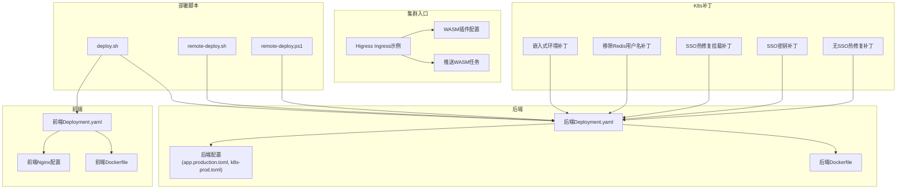
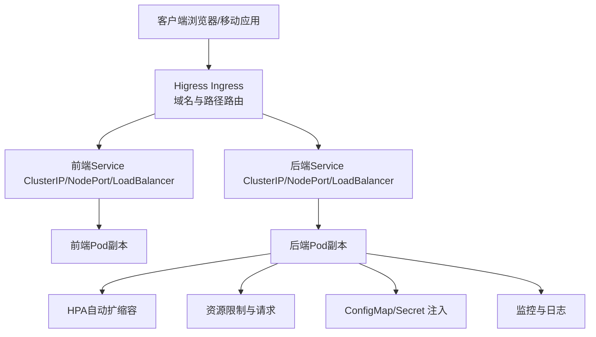
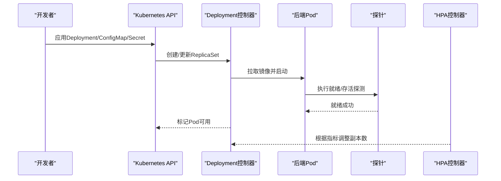
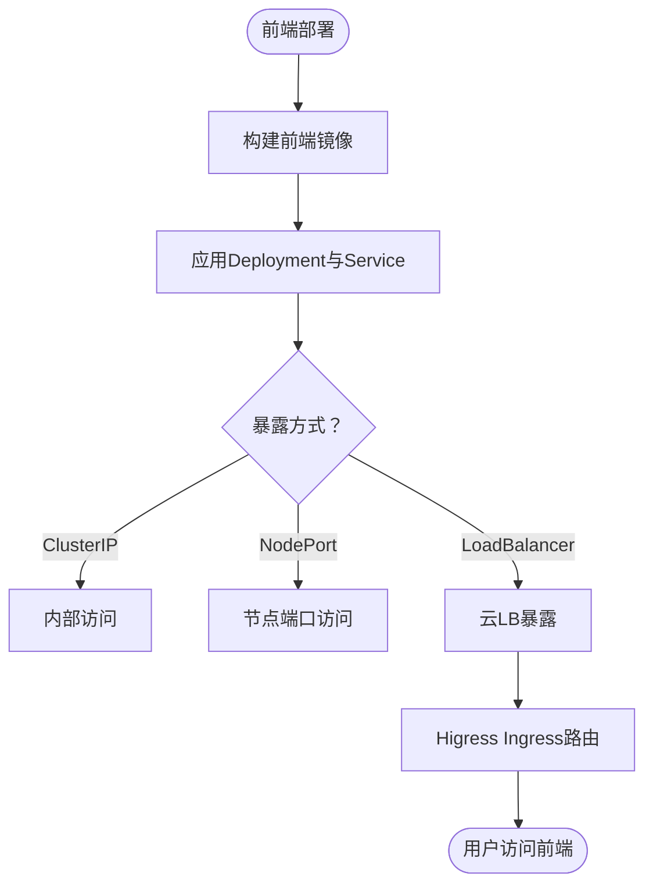
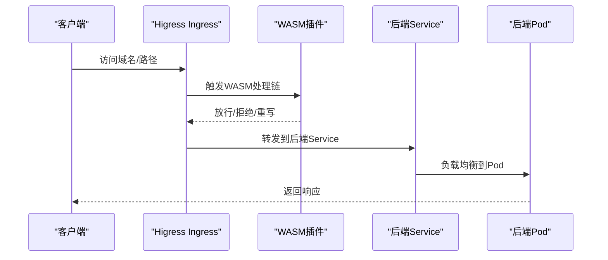
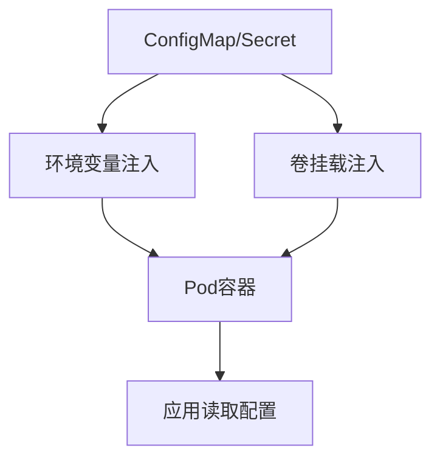
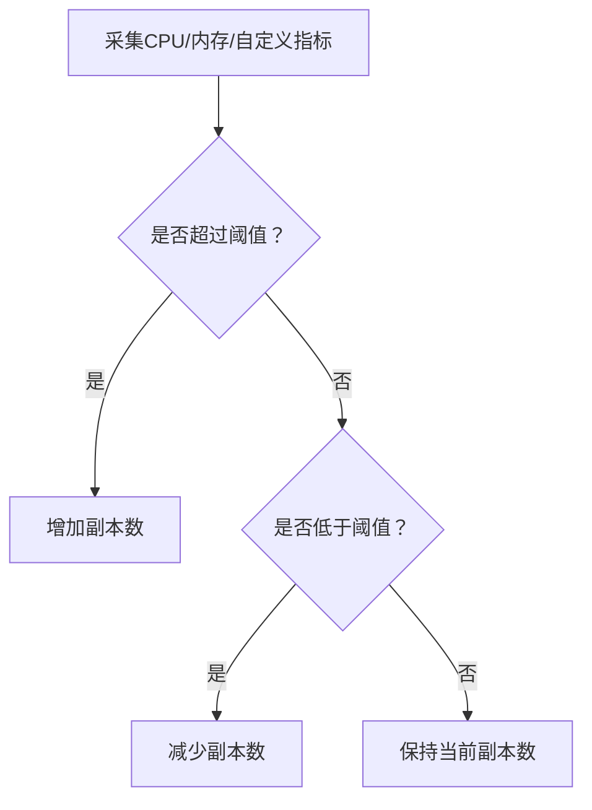
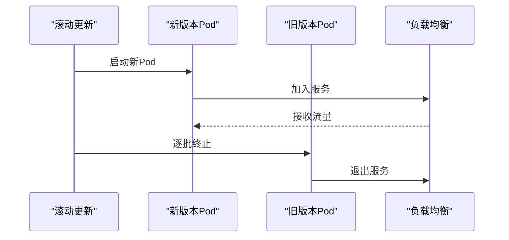
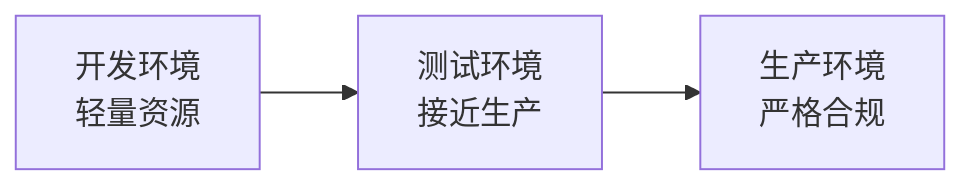
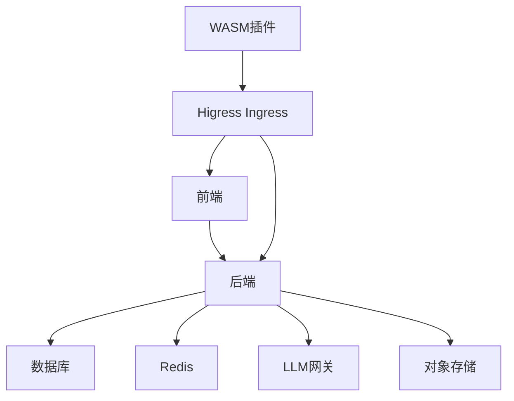

# Kubernetes集群部署

<cite>
**本文引用的文件**
- [backend/Deployment.yaml](file://backend/Deployment.yaml)
- [frontend/Deployment.yaml](file://frontend/Deployment.yaml)
- [deploy/higress/ai-agent-ingress.example.yaml](file://deploy/higress/ai-agent-ingress.example.yaml)
- [deploy/higress/giikin-auth-bridge-wasmplugin.yaml](file://deploy/higress/giikin-auth-bridge-wasmplugin.yaml)
- [deploy/higress/push-giikin-auth-bridge-job.yaml](file://deploy/higress/push-giikin-auth-bridge-job.yaml)
- [deploy/k8s/patch-embedding-env.json](file://deploy/k8s/patch-embedding-env.json)
- [deploy/k8s/patch-remove-redis-username.json](file://deploy/k8s/patch-remove-redis-username.json)
- [deploy/k8s/patch-remove-sso-hotfix-mount.json](file://deploy/k8s/patch-remove-sso-hotfix-mount.json)
- [deploy/k8s/patch-sso-no-hotfix.json](file://deploy/k8s/patch-sso-no-hotfix.json)
- [deploy/k8s/patch-sso-secret.json](file://deploy/k8s/patch-sso-secret.json)
- [backend/config/app.production.toml](file://backend/config/app.production.toml)
- [backend/config/environments/k8s-prod.toml](file://backend/config/environments/k8s-prod.toml)
- [backend/config/env.example](file://backend/config/env.example)
- [backend/Dockerfile](file://backend/Dockerfile)
- [frontend/Dockerfile](file://frontend/Dockerfile)
- [deploy/deploy.sh](file://deploy/deploy.sh)
- [deploy/remote-deploy.sh](file://deploy/remote-deploy.sh)
- [deploy/remote-deploy.ps1](file://deploy/remote-deploy.ps1)
- [backend/docker/sandbox/Dockerfile](file://backend/docker/sandbox/Dockerfile)
- [docs/deployment-production.html](file://docs/deployment-production.html)
- [docs/SSO.md](file://docs/SSO.md)
- [backend/scripts/run_server.py](file://backend/scripts/run_server.py)
- [backend/bootstrap/main.py](file://backend/bootstrap/main.py)
- [backend/bootstrap/config.py](file://backend/bootstrap/config.py)
- [backend/libs/config/__init__.py](file://backend/libs/config/__init__.py)
- [backend/config/litellm_models.yaml](file://backend/config/litellm_models.yaml)
- [backend/config/mcp.toml](file://backend/config/mcp.toml)
- [backend/config/tools.toml](file://backend/config/tools.toml)
- [backend/config/execution.toml](file://backend/config/execution.toml)
- [backend/config/README.md](file://backend/config/README.md)
- [backend/config/environments/local-dev.toml](file://backend/config/environments/local-dev.toml)
- [backend/config/environments/docker-dev.toml](file://backend/config/environments/docker-dev.toml)
- [backend/config/environments/network-enabled.toml](file://backend/config/environments/network-enabled.toml)
- [backend/config/environments/network-restricted.toml](file://backend/config/environments/network-restricted.toml)
- [backend/config/environments/python-dev.toml](file://backend/config/environments/python-dev.toml)
- [backend/config/environments/minimal.toml](file://backend/config/environments/minimal.toml)
- [backend/config/environments/data-science.toml](file://backend/config/environments/data-science.toml)
- [backend/config/environments/node-dev.toml](file://backend/config/environments/node-dev.toml)
- [backend/config/environments/docke-prod.toml](file://backend/config/environments/docke-prod.toml)
- [backend/config/environments/app.staging.toml](file://backend/config/environments/app.staging.toml)
- [backend/config/environments/app.development.toml](file://backend/config/environments/app.development.toml)
- [backend/config/environments/app.production.toml](file://backend/config/environments/app.production.toml)
- [backend/config/environments/app.toml](file://backend/config/environments/app.toml)
- [backend/config/environments/README.md](file://backend/config/environments/README.md)
- [backend/config/environments/README.md](file://backend/config/environments/README.md)
- [backend/config/environments/README.md](file://backend/config/environments/README.md)
- [backend/config/environments/README.md](file://backend/config/environments/README.md)
- [backend/config/environments/README.md](file://backend/config/environments/README.md)
- [backend/config/environments/README.md](file://backend/config/environments/README.md)
- [backend/config/environments/README.md](file://backend/config/environments/README.md)
- [backend/config/environments/README.md](file://backend/config/environments/README.md)
- [backend/config/environments/README.md](file://backend/config/environments/README.md)
- [backend/config/environments/README.md](file://backend/config/environments/README.md)
- [backend/config/environments/README.md](file://backend/config/environments/README.md)
- [backend/config/environments/README.md](file://backend/config/environments/README.md)
- [backend/config/environments/README.md](file://backend/config/environments/README.md)
- [backend/config/environments/README.md](file://backend/config/environments/README.md)
- [backend/config/environments/README.md](file://backend/config/environments/README.md)
- [backend/config/environments/README.md](file://backend/config/environments/README.md)
- [backend/config/environments/README.md](file://backend/config/environments/README.md)
- [backend/config/environments/README.md](file://backend/config/environments/README.md)
- [backend/config/environments/README.md](file://backend/config/environments/README.md)
- [backend/config/environments/README.md](file://backend/config/environments/README.md)
- [backend/config/environments/README.md](file://backend/config/environments/README.md)
- [backend/config/environments/README.md](file://backend/config/environments/README.md)
- [backend/config/environments/README.md](file://backend/config/environments/README.md)
- [backend/config/environments/README.md](file://backend/config/environments/README.md)
- [backend/config/environments/README.md](file://backend/config/environments/README.md......)
</cite>

## 目录
1. [简介](#简介)
2. [项目结构](#项目结构)
3. [核心组件](#核心组件)
4. [架构总览](#架构总览)
5. [详细组件分析](#详细组件分析)
6. [依赖关系分析](#依赖关系分析)
7. [性能考虑](#性能考虑)
8. [故障排查指南](#故障排查指南)
9. [结论](#结论)
10. [附录](#附录)

## 简介
本指南面向Kubernetes运维工程师，提供AI Agent项目的完整集群部署与管理方案。内容涵盖Pod配置、Deployment定义、Service暴露、Ingress路由、ConfigMap与Secret管理、Helm Chart使用与自定义、HPA与资源限制、滚动更新与蓝绿部署策略、集群监控与告警、持久化存储与备份、多环境部署差异等。

## 项目结构
AI Agent由后端服务与前端应用组成，均提供容器化构建与Kubernetes部署清单。部署相关的关键位置如下：
- 后端：Dockerfile、Deployment.yaml、配置文件位于 backend/
- 前端：Dockerfile、Deployment.yaml、Nginx配置位于 frontend/
- 集群入口与网关：deploy/higress/ 下的Ingress与WASM插件示例
- K8s补丁与环境差异：deploy/k8s/ 下的JSON补丁
- 多环境配置：backend/config/environments/ 下的环境化配置
- 部署脚本：deploy/ 下的自动化部署脚本

**图表来源**
- [backend/Deployment.yaml](file://backend/Deployment.yaml)
- [frontend/Deployment.yaml](file://frontend/Deployment.yaml)
- [deploy/higress/ai-agent-ingress.example.yaml](file://deploy/higress/ai-agent-ingress.example.yaml)
- [deploy/higress/giikin-auth-bridge-wasmplugin.yaml](file://deploy/higress/giikin-auth-bridge-wasmplugin.yaml)
- [deploy/higress/push-giikin-auth-bridge-job.yaml](file://deploy/higress/push-giikin-auth-bridge-job.yaml)
- [deploy/k8s/patch-embedding-env.json](file://deploy/k8s/patch-embedding-env.json)
- [deploy/k8s/patch-remove-redis-username.json](file://deploy/k8s/patch-remove-redis-username.json)
- [deploy/k8s/patch-remove-sso-hotfix-mount.json](file://deploy/k8s/patch-remove-sso-hotfix-mount.json)
- [deploy/k8s/patch-sso-secret.json](file://deploy/k8s/patch-sso-secret.json)
- [deploy/k8s/patch-sso-no-hotfix.json](file://deploy/k8s/patch-sso-no-hotfix.json)
- [deploy/deploy.sh](file://deploy/deploy.sh)
- [deploy/remote-deploy.sh](file://deploy/remote-deploy.sh)
- [deploy/remote-deploy.ps1](file://deploy/remote-deploy.ps1)

**章节来源**
- [backend/Deployment.yaml](file://backend/Deployment.yaml)
- [frontend/Deployment.yaml](file://frontend/Deployment.yaml)
- [deploy/higress/ai-agent-ingress.example.yaml](file://deploy/higress/ai-agent-ingress.example.yaml)
- [deploy/k8s/patch-embedding-env.json](file://deploy/k8s/patch-embedding-env.json)
- [deploy/deploy.sh](file://deploy/deploy.sh)

## 核心组件
- 后端服务（Python/FastAPI）：通过Deployment运行，暴露健康检查端点，支持HPA与资源限制；使用ConfigMap/Secret注入配置与敏感信息。
- 前端应用（React/Vite）：通过Deployment运行，使用Nginx作为静态Web服务器；通过Service对外暴露。
- 入口网关（Higress）：通过Ingress定义域名与路径转发；集成WASM插件实现鉴权桥接与安全控制。
- 配置与密钥：app.production.toml与k8s-prod.toml用于生产环境配置；Secret用于数据库密码、API密钥等敏感信息。
- 补丁与差异化：通过JSON Patch对现有资源进行非破坏性调整，适配不同集群环境。

**章节来源**
- [backend/config/app.production.toml](file://backend/config/app.production.toml)
- [backend/config/environments/k8s-prod.toml](file://backend/config/environments/k8s-prod.toml)
- [backend/config/env.example](file://backend/config/env.example)
- [backend/Dockerfile](file://backend/Dockerfile)
- [frontend/Dockerfile](file://frontend/Dockerfile)

## 架构总览
下图展示从客户端到后端服务的端到端路径，包括入口网关、服务发现、负载均衡与健康检查。

**图表来源**
- [deploy/higress/ai-agent-ingress.example.yaml](file://deploy/higress/ai-agent-ingress.example.yaml)
- [backend/Deployment.yaml](file://backend/Deployment.yaml)
- [frontend/Deployment.yaml](file://frontend/Deployment.yaml)

## 详细组件分析

### 后端服务（Deployment与Pod）
- Pod模板：容器镜像来自后端Dockerfile构建；设置探针（存活/就绪）、资源请求与限制、环境变量注入。
- Deployment：副本数、滚动更新策略（maxUnavailable/maxSurge）、选择器标签。
- ConfigMap：注入非敏感配置（如模型列表、工具配置）。
- Secret：注入敏感配置（数据库连接、第三方API密钥）。
- HPA：基于CPU/内存或自定义指标触发扩缩容。
- 资源限制：在Deployment中为容器设置requests/limits，避免资源争用。

**图表来源**
- [backend/Deployment.yaml](file://backend/Deployment.yaml)
- [backend/Dockerfile](file://backend/Dockerfile)

**章节来源**
- [backend/Deployment.yaml](file://backend/Deployment.yaml)
- [backend/Dockerfile](file://backend/Dockerfile)
- [backend/config/litellm_models.yaml](file://backend/config/litellm_models.yaml)
- [backend/config/mcp.toml](file://backend/config/mcp.toml)
- [backend/config/tools.toml](file://backend/config/tools.toml)
- [backend/config/execution.toml](file://backend/config/execution.toml)

### 前端应用（Deployment与Service）
- Pod模板：容器镜像来自前端Dockerfile构建；使用Nginx提供静态资源服务。
- Service：ClusterIP/NodePort/LoadBalancer，暴露前端服务。
- Ingress：通过Higress将域名与路径映射到前端Service。

**图表来源**
- [frontend/Deployment.yaml](file://frontend/Deployment.yaml)
- [frontend/Dockerfile](file://frontend/Dockerfile)
- [deploy/higress/ai-agent-ingress.example.yaml](file://deploy/higress/ai-agent-ingress.example.yaml)

**章节来源**
- [frontend/Deployment.yaml](file://frontend/Deployment.yaml)
- [frontend/Dockerfile](file://frontend/Dockerfile)
- [deploy/higress/ai-agent-ingress.example.yaml](file://deploy/higress/ai-agent-ingress.example.yaml)

### 入口网关与路由（Ingress与WASM）
- Ingress：定义域名、路径前缀、后端Service映射。
- WASM插件：通过Job推送WASM模块，实现鉴权桥接、请求改写、安全策略等。
- SSO集成：通过补丁调整SSO回调、密钥与热修复挂载，确保认证流程稳定。

**图表来源**
- [deploy/higress/ai-agent-ingress.example.yaml](file://deploy/higress/ai-agent-ingress.example.yaml)
- [deploy/higress/giikin-auth-bridge-wasmplugin.yaml](file://deploy/higress/giikin-auth-bridge-wasmplugin.yaml)
- [deploy/higress/push-giikin-auth-bridge-job.yaml](file://deploy/higress/push-giikin-auth-bridge-job.yaml)

**章节来源**
- [deploy/higress/ai-agent-ingress.example.yaml](file://deploy/higress/ai-agent-ingress.example.yaml)
- [deploy/higress/giikin-auth-bridge-wasmplugin.yaml](file://deploy/higress/giikin-auth-bridge-wasmplugin.yaml)
- [deploy/higress/push-giikin-auth-bridge-job.yaml](file://deploy/higress/push-giikin-auth-bridge-job.yaml)
- [docs/SSO.md](file://docs/SSO.md)

### ConfigMap与Secret管理
- ConfigMap：存放非敏感配置（如模型列表、工具配置），通过envFrom或volumeMount注入。
- Secret：存放敏感配置（数据库密码、API密钥），通过envFrom或volumeMount注入。
- 环境变量注入：在Deployment中使用envFrom引用ConfigMap/Secret，减少硬编码。
- 安全策略：最小权限原则，仅授予必要命名空间与资源访问权限。

**图表来源**
- [backend/config/app.production.toml](file://backend/config/app.production.toml)
- [backend/config/environments/k8s-prod.toml](file://backend/config/environments/k8s-prod.toml)

**章节来源**
- [backend/config/app.production.toml](file://backend/config/app.production.toml)
- [backend/config/environments/k8s-prod.toml](file://backend/config/environments/k8s-prod.toml)
- [backend/config/env.example](file://backend/config/env.example)

### Helm Chart使用与自定义
- 使用Helm管理部署：将Deployment、Service、ConfigMap、Secret、Ingress封装为Chart。
- 自定义值：通过values.yaml覆盖默认参数（镜像、副本数、资源、探针、HPA阈值等）。
- 环境隔离：为开发、测试、生产分别维护独立的values-{env}.yaml。
- 升级策略：结合Helm的Release版本管理与Kubernetes原生滚动更新策略。

[本节为通用实践说明，不直接分析具体文件，故无“章节来源”]

### 水平Pod自动伸缩（HPA）
- CPU/内存指标：基于CPU使用率或内存占用触发扩缩容。
- 自定义指标：结合业务指标（如请求延迟、队列长度）实现更精准扩缩容。
- 下限/上限：设置minReplicas/maxReplicas，避免过度扩缩或收缩不足。

**图表来源**
- [backend/Deployment.yaml](file://backend/Deployment.yaml)

**章节来源**
- [backend/Deployment.yaml](file://backend/Deployment.yaml)

### 资源限制与请求
- requests：保证Pod被调度到有足够资源的节点。
- limits：防止单个Pod占用过多资源影响集群稳定性。
- 建议：requests≈历史峰值，limits=1.5×requests，留有余量。

**章节来源**
- [backend/Deployment.yaml](file://backend/Deployment.yaml)
- [frontend/Deployment.yaml](file://frontend/Deployment.yaml)

### 滚动更新与蓝绿部署
- 滚动更新：通过Deployment的滚动策略实现零停机升级，建议maxUnavailable=25%，maxSurge=25%。
- 蓝绿/金丝雀：通过两套Deployment+不同标签，配合Ingress切换或权重分流，逐步迁移流量。

**图表来源**
- [backend/Deployment.yaml](file://backend/Deployment.yaml)
- [frontend/Deployment.yaml](file://frontend/Deployment.yaml)

**章节来源**
- [backend/Deployment.yaml](file://backend/Deployment.yaml)
- [frontend/Deployment.yaml](file://frontend/Deployment.yaml)

### 集群监控与告警
- 指标采集：Prometheus/Grafana监控CPU、内存、网络、请求速率与错误率。
- 日志采集：ELK/Fluent Bit收集容器标准输出与应用日志。
- 告警规则：针对Pod重启、就绪失败、HPA频繁扩缩、响应时间过长等设置阈值告警。
- SLO/SLI：定义可用性与延迟目标，结合告警闭环。

[本节为通用实践说明，不直接分析具体文件，故无“章节来源”]

### 持久化存储与备份
- 存储类型：使用RWO/RWX PVC挂载共享存储（如对象存储网关、日志目录）。
- 备份策略：定期快照/导出重要数据（数据库、配置、日志），加密传输与存储。
- 生命周期：定义PVC回收策略，清理长期未使用的存储。

[本节为通用实践说明，不直接分析具体文件，故无“章节来源”]

### 多环境部署（开发、测试、生产）
- 开发环境：轻量资源、快速迭代、本地或小型集群；启用调试日志。
- 测试环境：接近生产配置，开启HPA与部分监控；隔离数据库与第三方密钥。
- 生产环境：严格资源限制、HPA、完善的监控与告警、备份与回滚预案；最小权限与审计日志。

**图表来源**
- [backend/config/environments/local-dev.toml](file://backend/config/environments/local-dev.toml)
- [backend/config/environments/docker-dev.toml](file://backend/config/environments/docker-dev.toml)
- [backend/config/environments/app.staging.toml](file://backend/config/environments/app.staging.toml)
- [backend/config/environments/app.development.toml](file://backend/config/environments/app.development.toml)
- [backend/config/environments/app.production.toml](file://backend/config/environments/app.production.toml)
- [backend/config/environments/app.toml](file://backend/config/environments/app.toml)

**章节来源**
- [backend/config/environments/README.md](file://backend/config/environments/README.md)
- [backend/config/environments/local-dev.toml](file://backend/config/environments/local-dev.toml)
- [backend/config/environments/docker-dev.toml](file://backend/config/environments/docker-dev.toml)
- [backend/config/environments/network-enabled.toml](file://backend/config/environments/network-enabled.toml)
- [backend/config/environments/network-restricted.toml](file://backend/config/environments/network-restricted.toml)
- [backend/config/environments/python-dev.toml](file://backend/config/environments/python-dev.toml)
- [backend/config/environments/minimal.toml](file://backend/config/environments/minimal.toml)
- [backend/config/environments/data-science.toml](file://backend/config/environments/data-science.toml)
- [backend/config/environments/node-dev.toml](file://backend/config/environments/node-dev.toml)
- [backend/config/environments/docke-prod.toml](file://backend/config/environments/docke-prod.toml)
- [backend/config/environments/app.staging.toml](file://backend/config/environments/app.staging.toml)
- [backend/config/environments/app.development.toml](file://backend/config/environments/app.development.toml)
- [backend/config/environments/app.production.toml](file://backend/config/environments/app.production.toml)
- [backend/config/environments/app.toml](file://backend/config/environments/app.toml)

## 依赖关系分析
- 后端依赖：数据库、缓存（Redis）、外部LLM网关、对象存储；通过ConfigMap/Secret注入连接信息。
- 前端依赖：后端API域名与路径；通过Ingress与Service解耦。
- 入口依赖：Higress Ingress与WASM插件；SSO密钥与回调路径需与后端一致。

**图表来源**
- [backend/config/litellm_models.yaml](file://backend/config/litellm_models.yaml)
- [backend/config/mcp.toml](file://backend/config/mcp.toml)
- [backend/config/tools.toml](file://backend/config/tools.toml)
- [deploy/higress/ai-agent-ingress.example.yaml](file://deploy/higress/ai-agent-ingress.example.yaml)

**章节来源**
- [backend/config/litellm_models.yaml](file://backend/config/litellm_models.yaml)
- [backend/config/mcp.toml](file://backend/config/mcp.toml)
- [backend/config/tools.toml](file://backend/config/tools.toml)
- [deploy/higress/ai-agent-ingress.example.yaml](file://deploy/higress/ai-agent-ingress.example.yaml)

## 性能考虑
- 资源规划：根据峰值QPS与响应时间估算requests/limits，避免频繁驱逐。
- 连接池：数据库与外部服务连接池大小应与副本数匹配，避免连接耗尽。
- 缓存：合理使用Redis缓存热点数据，降低后端压力。
- 网络：Ingress层启用压缩与缓存，减少带宽消耗。

[本节为通用指导，不直接分析具体文件，故无“章节来源”]

## 故障排查指南
- Pod无法就绪：检查探针配置与日志；确认ConfigMap/Secret挂载正确。
- 服务不可达：检查Service端口与选择器；确认Ingress路由规则。
- SSO登录异常：核对SSO回调地址、密钥补丁与热修复挂载；查看WASM插件日志。
- 配置不生效：确认envFrom引用的ConfigMap/Secret名称与键名一致；检查命名空间与权限。
- 部署失败：查看Deployment事件与Pod状态；核对镜像拉取策略与Secret权限。

**章节来源**
- [deploy/higress/patch-sso-secret.json](file://deploy/k8s/patch-sso-secret.json)
- [deploy/higress/patch-remove-sso-hotfix-mount.json](file://deploy/k8s/patch-remove-sso-hotfix-mount.json)
- [deploy/higress/patch-sso-no-hotfix.json](file://deploy/k8s/patch-sso-no-hotfix.json)
- [docs/SSO.md](file://docs/SSO.md)

## 结论
通过标准化的Deployment、Service、Ingress与ConfigMap/Secret管理，结合HPA与资源限制，AI Agent可在Kubernetes上实现高可用、可观测与可扩展的部署。借助补丁机制与多环境配置，可灵活适配不同集群与业务场景。建议持续完善监控告警、备份恢复与安全策略，保障生产稳定运行。

## 附录
- 部署脚本：提供本地与远程一键部署能力，便于CI/CD集成。
- 文档参考：生产部署说明与SSO集成文档，辅助运维与安全合规。

**章节来源**
- [deploy/deploy.sh](file://deploy/deploy.sh)
- [deploy/remote-deploy.sh](file://deploy/remote-deploy.sh)
- [deploy/remote-deploy.ps1](file://deploy/remote-deploy.ps1)
- [docs/deployment-production.html](file://docs/deployment-production.html)
- [docs/SSO.md](file://docs/SSO.md)