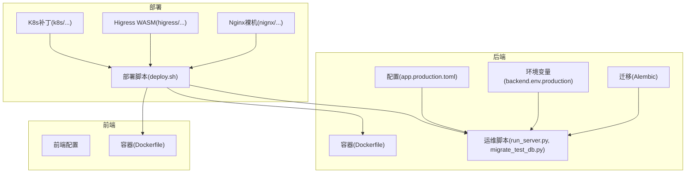
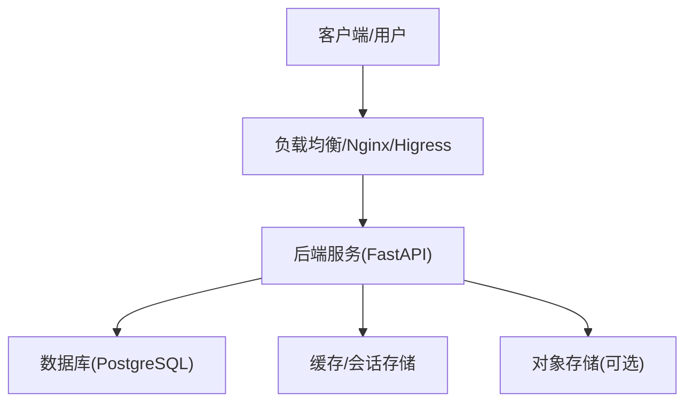
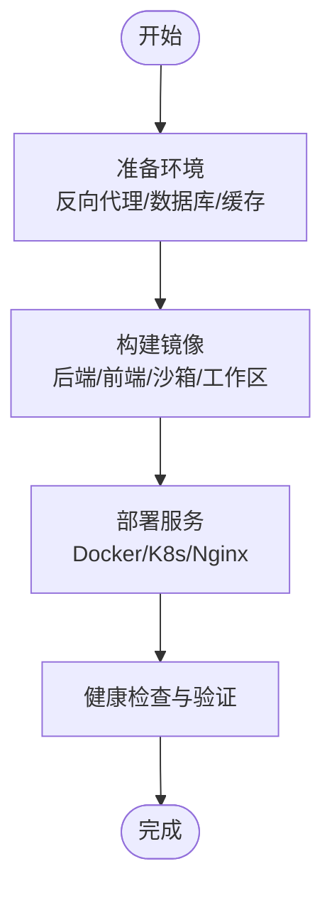
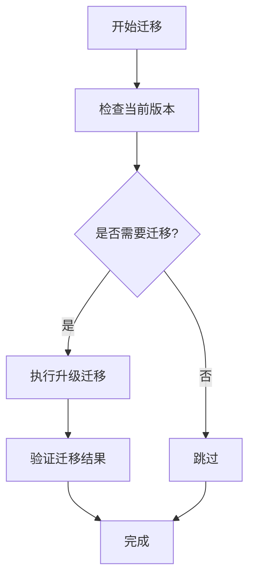
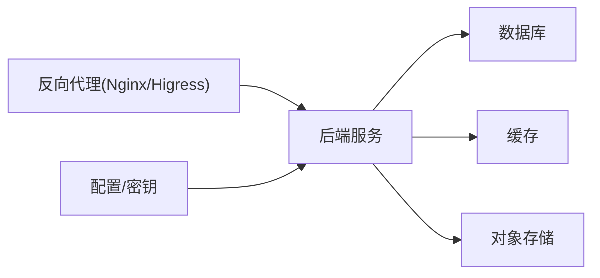

# 生产环境运维

<cite>
**本文引用的文件**
- [backend.env.production](file://deploy/backend.env.production)
- [deploy.sh](file://deploy/deploy.sh)
- [app.production.toml](file://backend/config/app.production.toml)
- [DEPLOYMENT.md](file://docs/DEPLOYMENT.md)
- [Dockerfile（后端）](file://backend/Dockerfile)
- [Dockerfile（沙箱）](file://backend/docker/sandbox/Dockerfile)
- [Dockerfile（工作区）](file://backend/workspace/Dockerfile)
- [Dockerfile（前端）](file://frontend/Dockerfile)
- [alembic.ini](file://backend/alembic.ini)
- [k8s 部署补丁示例](file://deploy/k8s/patch-sso-secret.json)
- [Higress WASM 插件示例](file://deploy/higress/giikin-auth-bridge-wasmplugin.yaml)
- [Nginx 裸金属示例](file://deploy/nginx/ai-agent.bare-metal.conf.example)
- [运行服务器脚本](file://backend/scripts/run_server.py)
- [迁移脚本](file://backend/scripts/migrate_test_db.py)
- [数据库迁移版本（示例）](file://backend/alembic/versions/20260612_gateway_budget_tenant.py)
- [Kubernetes 生产环境模板](file://backend/config/environments/k8s-prod.toml)
- [Docker 生产环境模板](file://backend/config/environments/docker-prod.toml)
- [远程部署脚本（PowerShell）](file://deploy/remote-deploy.ps1)
- [远程部署脚本（Shell）](file://deploy/remote-deploy.sh)
</cite>

## 目录
1. [简介](#简介)
2. [项目结构](#项目结构)
3. [核心组件](#核心组件)
4. [架构总览](#架构总览)
5. [详细组件分析](#详细组件分析)
6. [依赖关系分析](#依赖关系分析)
7. [性能考量](#性能考量)
8. [故障排查指南](#故障排查指南)
9. [结论](#结论)
10. [附录](#附录)

## 简介
本运维文档面向生产环境运维人员，覆盖部署流程、环境准备、依赖安装、服务启动、环境变量与配置安全、数据库迁移与备份策略、监控与性能调优、故障排查与应急响应、安全加固、容量规划与扩容、变更管理与发布窗口、运维工具与脚本使用等完整运维操作手册。

## 项目结构
- 后端采用 Python/FastAPI 架构，通过 Alembic 进行数据库迁移，支持多环境配置（本地、Docker、Kubernetes、Staging、Production）。
- 前端基于 Vite/React，容器化部署。
- 部署与运维脚本位于 deploy 目录；配置文件位于 backend/config；数据库迁移位于 backend/alembic；文档位于 docs。

**图表来源**
- [Dockerfile（后端）:1-200](file://backend/Dockerfile#L1-L200)
- [Dockerfile（前端）:1-200](file://frontend/Dockerfile#L1-L200)
- [run_server.py:1-200](file://backend/scripts/run_server.py#L1-L200)
- [migrate_test_db.py:1-200](file://backend/scripts/migrate_test_db.py#L1-L200)
- [app.production.toml:1-200](file://backend/config/app.production.toml#L1-L200)
- [backend.env.production:1-200](file://deploy/backend.env.production#L1-L200)
- [alembic.ini:1-200](file://backend/alembic.ini#L1-L200)
- [k8s 部署补丁示例:1-200](file://deploy/k8s/patch-sso-secret.json#L1-L200)
- [Higress WASM 插件示例:1-200](file://deploy/higress/giikin-auth-bridge-wasmplugin.yaml#L1-L200)
- [Nginx 裸金属示例:1-200](file://deploy/nginx/ai-agent.bare-metal.conf.example#L1-L200)

**章节来源**
- [Dockerfile（后端）:1-200](file://backend/Dockerfile#L1-L200)
- [Dockerfile（前端）:1-200](file://frontend/Dockerfile#L1-L200)
- [app.production.toml:1-200](file://backend/config/app.production.toml#L1-L200)
- [backend.env.production:1-200](file://deploy/backend.env.production#L1-L200)
- [alembic.ini:1-200](file://backend/alembic.ini#L1-L200)
- [k8s 部署补丁示例:1-200](file://deploy/k8s/patch-sso-secret.json#L1-L200)
- [Higress WASM 插件示例:1-200](file://deploy/higress/giikin-auth-bridge-wasmplugin.yaml#L1-L200)
- [Nginx 裸金属示例:1-200](file://deploy/nginx/ai-agent.bare-metal.conf.example#L1-L200)

## 核心组件
- 应用服务：FastAPI 后端，负责业务逻辑、网关代理、会话管理、工具执行等。
- 数据库：PostgreSQL，使用 Alembic 进行版本化迁移。
- 前端静态资源：由 Nginx 或反向代理提供。
- 容器镜像：后端、前端、沙箱、工作区分别构建独立镜像。
- 部署编排：支持 Docker Compose、Kubernetes、裸金属 Nginx。
- 配置与密钥：生产环境配置与密钥通过环境变量注入，避免硬编码。

**章节来源**
- [Dockerfile（后端）:1-200](file://backend/Dockerfile#L1-L200)
- [Dockerfile（前端）:1-200](file://frontend/Dockerfile#L1-L200)
- [Dockerfile（沙箱）:1-200](file://backend/docker/sandbox/Dockerfile#L1-L200)
- [Dockerfile（工作区）:1-200](file://backend/workspace/Dockerfile#L1-L200)
- [app.production.toml:1-200](file://backend/config/app.production.toml#L1-L200)
- [backend.env.production:1-200](file://deploy/backend.env.production#L1-L200)
- [alembic.ini:1-200](file://backend/alembic.ini#L1-L200)

## 架构总览
生产环境采用“容器化 + 多环境配置 + 反向代理”的架构。后端服务通过 Nginx/Higress/Kubernetes Ingress 对外暴露；数据库通过 Alembic 迁移管理；配置与密钥通过环境变量注入；运维脚本统一管理部署与迁移。

[此图为概念性架构图，不直接映射具体源码文件，故无图表来源]

## 详细组件分析

### 部署流程与环境准备
- 环境准备
  - 准备生产主机或集群节点，确保内核参数、文件句柄限制、时钟同步等满足生产要求。
  - 准备反向代理（Nginx/Higress/Kubernetes Ingress），配置 TLS 终止与健康检查。
  - 准备数据库与缓存服务，确保网络连通与权限配置正确。
- 依赖安装
  - 使用官方 Docker 镜像或自行构建镜像，确保基础镜像与依赖一致。
  - 在生产环境使用只读根文件系统与最小权限原则。
- 服务启动
  - 通过部署脚本或编排工具启动后端、前端、数据库、缓存等服务。
  - 启动后进行健康检查与端到端验证。

[此图为通用流程图，不直接映射具体源码文件，故无图表来源]

**章节来源**
- [deploy.sh:1-200](file://deploy/deploy.sh#L1-L200)
- [Dockerfile（后端）:1-200](file://backend/Dockerfile#L1-L200)
- [Dockerfile（前端）:1-200](file://frontend/Dockerfile#L1-L200)
- [k8s 部署补丁示例:1-200](file://deploy/k8s/patch-sso-secret.json#L1-L200)
- [Higress WASM 插件示例:1-200](file://deploy/higress/giikin-auth-bridge-wasmplugin.yaml#L1-L200)
- [Nginx 裸金属示例:1-200](file://deploy/nginx/ai-agent.bare-metal.conf.example#L1-L200)

### 环境变量管理与配置安全
- 环境变量
  - 生产环境密钥与敏感参数通过环境变量注入，避免写入代码仓库。
  - 示例：数据库连接串、第三方服务密钥、加密盐值等。
- 配置文件
  - 使用 TOML 配置文件承载非敏感配置，结合环境变量覆盖敏感项。
  - 生产配置模板位于 backend/config/environments 下，按需选择 k8s-prod.toml 或 docker-prod.toml。
- 安全建议
  - 使用只读配置卷与最小权限。
  - 定期轮换密钥与证书。
  - 限制对配置与密钥的访问范围。

**章节来源**
- [backend.env.production:1-200](file://deploy/backend.env.production#L1-L200)
- [app.production.toml:1-200](file://backend/config/app.production.toml#L1-L200)
- [Kubernetes 生产环境模板:1-200](file://backend/config/environments/k8s-prod.toml#L1-L200)
- [Docker 生产环境模板:1-200](file://backend/config/environments/docker-prod.toml#L1-L200)

### 数据库迁移与备份策略
- 迁移管理
  - 使用 Alembic 进行版本化迁移，迁移脚本位于 backend/alembic/versions。
  - 运维脚本中包含迁移命令，可在部署后执行。
- 备份策略
  - 建议采用定时快照/逻辑备份相结合的方式，保留至少 3-7 天的恢复点。
  - 对关键表（如会话、消息、计费）增加增量备份。
- 回滚与演练
  - 制定回滚计划，定期演练回滚路径，确保可快速恢复。

**图表来源**
- [alembic.ini:1-200](file://backend/alembic.ini#L1-L200)
- [迁移脚本:1-200](file://backend/scripts/migrate_test_db.py#L1-L200)
- [数据库迁移版本（示例）:1-200](file://backend/alembic/versions/20260612_gateway_budget_tenant.py#L1-L200)

**章节来源**
- [alembic.ini:1-200](file://backend/alembic.ini#L1-L200)
- [迁移脚本:1-200](file://backend/scripts/migrate_test_db.py#L1-L200)
- [数据库迁移版本（示例）:1-200](file://backend/alembic/versions/20260612_gateway_budget_tenant.py#L1-L200)

### 服务监控与性能调优
- 监控指标
  - 关键指标：请求延迟、错误率、并发数、数据库查询耗时、缓存命中率、队列长度。
  - 建议使用 Prometheus/Grafana 或云厂商监控平台。
- 性能优化
  - 数据库层面：索引优化、慢查询日志分析、连接池大小调整。
  - 应用层面：异步任务、限流与熔断、缓存热点数据。
  - 反向代理：启用压缩、连接复用、合理的超时设置。
- 调优流程
  - 以压测数据为依据，逐步调整参数，观察指标变化并回滚异常改动。

[本节为通用指导，不直接分析具体文件，故无章节来源]

### 故障排查与应急响应
- 常见问题
  - 服务无法启动：检查日志、端口占用、环境变量、数据库连通性。
  - 数据库迁移失败：查看迁移日志、确认版本一致性、回滚到上一版本。
  - 反向代理异常：检查证书、路由规则、上游健康状态。
- 应急响应
  - 快速隔离：停止新流量进入故障实例，切换到备用实例。
  - 回滚：执行回滚脚本，恢复到上一个稳定版本。
  - 修复与验证：修复问题后进行冒烟测试与端到端验证。

**章节来源**
- [run_server.py:1-200](file://backend/scripts/run_server.py#L1-L200)
- [migrate_test_db.py:1-200](file://backend/scripts/migrate_test_db.py#L1-L200)

### 安全加固
- 防火墙与网络
  - 仅开放必要端口（如 443/80），限制来源 IP，启用 WAF。
- 访问控制
  - 强制多因素认证（MFA），最小权限原则，定期审计。
- 加密传输
  - 使用 TLS 1.3，禁用弱密码套件，启用 HSTS。
- 反向代理安全
  - 使用 Higress WASM 插件实现统一鉴权与审计，配置安全头。

**章节来源**
- [Higress WASM 插件示例:1-200](file://deploy/higress/giikin-auth-bridge-wasmplugin.yaml#L1-L200)

### 容量规划与扩容策略
- 观察指标：CPU、内存、磁盘 IO、网络带宽、数据库连接数。
- 扩容方式：水平扩展（副本数）、垂直扩展（资源规格）、缓存与存储分离。
- 自动伸缩：基于 CPU/请求数阈值触发扩缩容，配合预热与健康检查。

[本节为通用指导，不直接分析具体文件，故无章节来源]

### 变更管理与发布窗口
- 发布窗口：固定窗口（如夜间）进行发布，减少对业务的影响。
- 变更流程：变更评审、灰度发布、回滚预案、事后复盘。
- 配置变更：通过 GitOps 管理配置，变更前进行评审与测试。

[本节为通用指导，不直接分析具体文件，故无章节来源]

### 运维工具与脚本使用
- 部署脚本
  - deploy.sh：一键部署后端与前端，支持参数化配置。
  - remote-deploy.sh/remote-deploy.ps1：远程部署脚本，支持 Windows/Linux。
- 运维脚本
  - run_server.py：启动后端服务，支持日志级别与监听地址配置。
  - migrate_test_db.py：执行数据库迁移，支持 dry-run 与回滚。
- 配置与补丁
  - k8s 部署补丁：用于注入 Secret、调整资源配额等。
  - Higress WASM 插件：统一鉴权与审计。
  - Nginx 裸金属配置：适用于无 Kubernetes 的环境。

**章节来源**
- [deploy.sh:1-200](file://deploy/deploy.sh#L1-L200)
- [remote-deploy.sh:1-200](file://deploy/remote-deploy.sh#L1-L200)
- [remote-deploy.ps1:1-200](file://deploy/remote-deploy.ps1#L1-L200)
- [run_server.py:1-200](file://backend/scripts/run_server.py#L1-L200)
- [migrate_test_db.py:1-200](file://backend/scripts/migrate_test_db.py#L1-L200)
- [k8s 部署补丁示例:1-200](file://deploy/k8s/patch-sso-secret.json#L1-L200)
- [Higress WASM 插件示例:1-200](file://deploy/higress/giikin-auth-bridge-wasmplugin.yaml#L1-L200)
- [Nginx 裸金属示例:1-200](file://deploy/nginx/ai-agent.bare-metal.conf.example#L1-L200)

## 依赖关系分析
- 组件耦合
  - 后端服务依赖数据库与缓存；反向代理依赖后端健康状态；配置与密钥通过环境变量注入。
- 外部依赖
  - 数据库、缓存、对象存储、第三方 LLM 网关等。
- 编排与部署
  - 支持 Docker Compose、Kubernetes、裸金属 Nginx，按需选择。

[此图为概念性依赖图，不直接映射具体源码文件，故无图表来源]

**章节来源**
- [Dockerfile（后端）:1-200](file://backend/Dockerfile#L1-L200)
- [Dockerfile（前端）:1-200](file://frontend/Dockerfile#L1-L200)
- [app.production.toml:1-200](file://backend/config/app.production.toml#L1-L200)
- [backend.env.production:1-200](file://deploy/backend.env.production#L1-L200)

## 性能考量
- 数据库层面：建立合适索引、拆分读写、使用连接池、慢查询分析。
- 应用层面：异步任务、限流与熔断、缓存热点数据、减少 N+1 查询。
- 反向代理：启用压缩、连接复用、合理的超时与重试策略。
- 容器与编排：合理设置资源请求与限制，启用水平自动伸缩。

[本节为通用指导，不直接分析具体文件，故无章节来源]

## 故障排查指南
- 日志定位
  - 查看后端服务日志、数据库日志、反向代理访问日志与错误日志。
- 健康检查
  - 使用 /health 接口或探针检查服务状态。
- 快速止损
  - 停止新流量进入故障实例，切换到备用实例。
- 回滚与恢复
  - 执行回滚脚本，恢复到上一个稳定版本；验证数据库迁移状态。

**章节来源**
- [run_server.py:1-200](file://backend/scripts/run_server.py#L1-L200)
- [migrate_test_db.py:1-200](file://backend/scripts/migrate_test_db.py#L1-L200)

## 结论
本运维文档提供了从部署到监控、从安全到容量规划的完整生产运维实践。建议在实际环境中结合自身基础设施与合规要求，细化流程与脚本，并持续进行演练与优化。

## 附录
- 参考文档：DEPLOYMENT.md 提供了部署相关的背景与流程说明。
- 配置参考：app.production.toml 与环境模板文件可用于生产配置落地。
- 镜像参考：后端、前端、沙箱、工作区的 Dockerfile 用于构建生产镜像。

**章节来源**
- [DEPLOYMENT.md:1-200](file://docs/DEPLOYMENT.md#L1-L200)
- [app.production.toml:1-200](file://backend/config/app.production.toml#L1-L200)
- [Dockerfile（后端）:1-200](file://backend/Dockerfile#L1-L200)
- [Dockerfile（前端）:1-200](file://frontend/Dockerfile#L1-L200)
- [Dockerfile（沙箱）:1-200](file://backend/docker/sandbox/Dockerfile#L1-L200)
- [Dockerfile（工作区）:1-200](file://backend/workspace/Dockerfile#L1-L200)