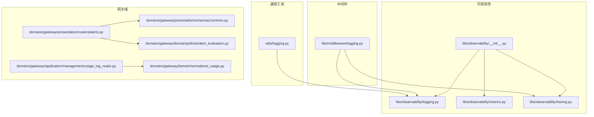
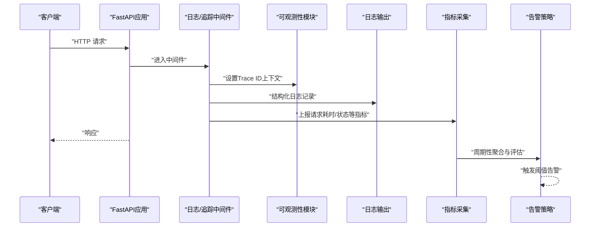
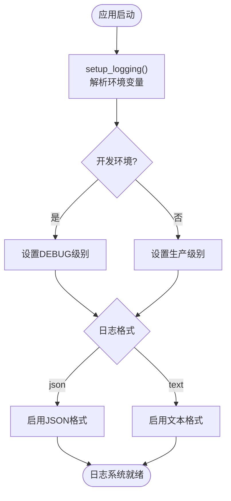
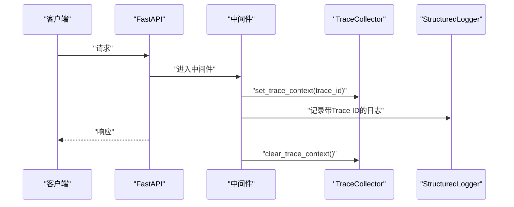
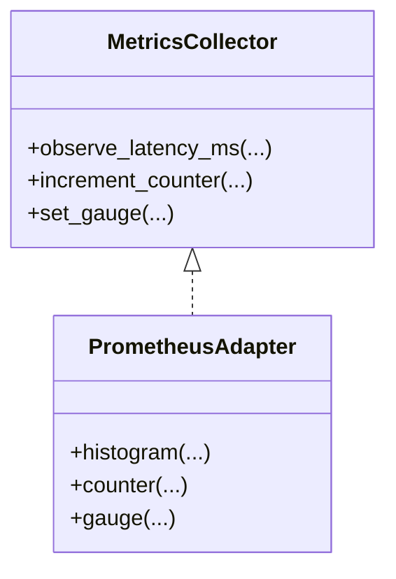
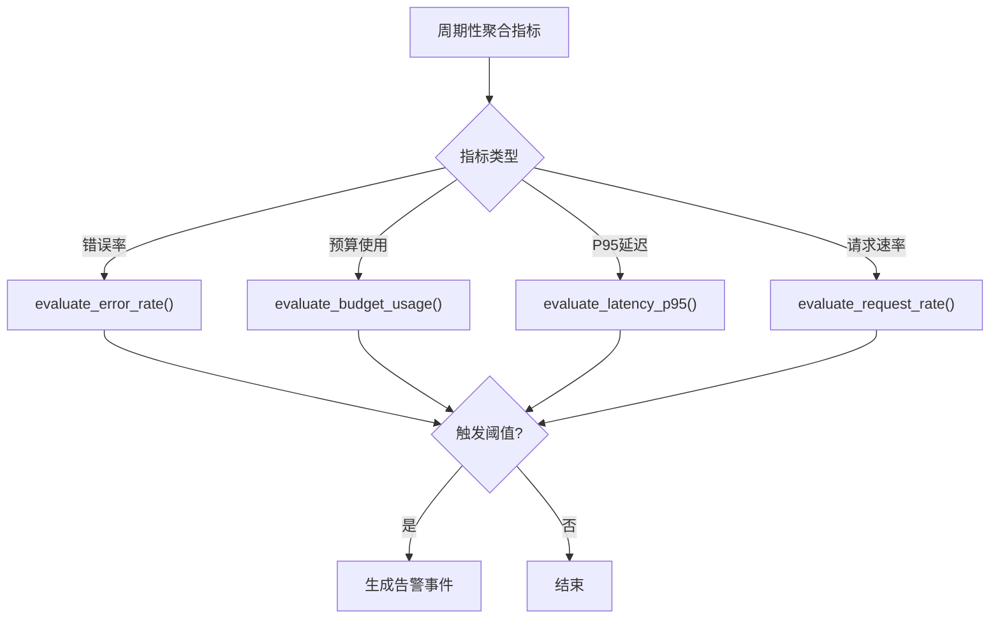
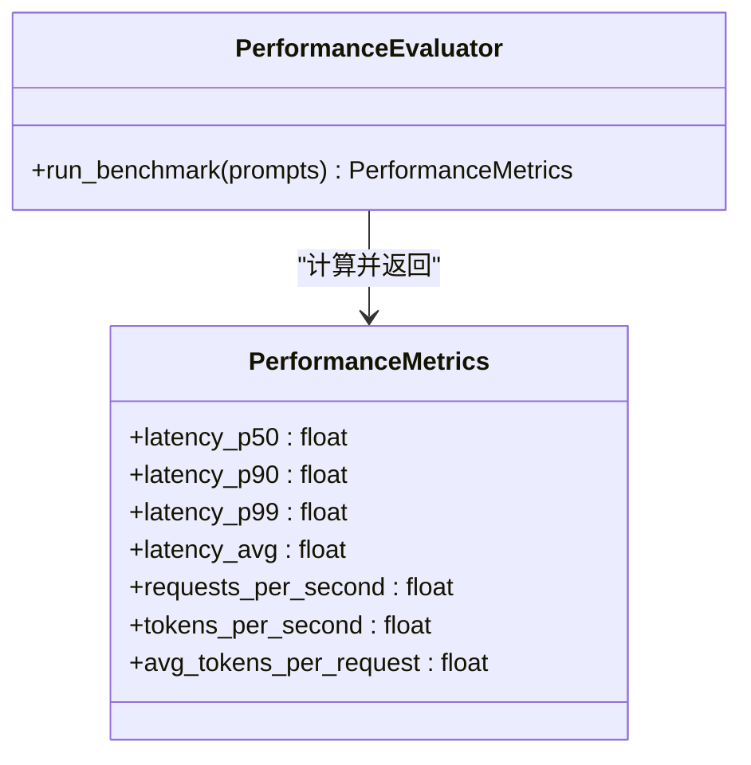
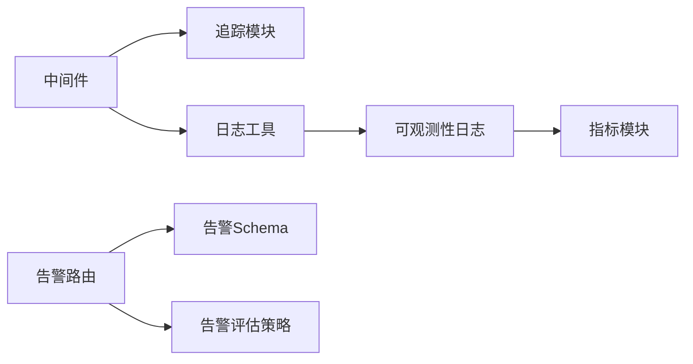

# 监控与日志管理

<cite>
**本文引用的文件**
- [backend/libs/observability/__init__.py](file://backend/libs/observability/__init__.py)
- [backend/utils/logging.py](file://backend/utils/logging.py)
- [backend/libs/observability/logging.py](file://backend/libs/observability/logging.py)
- [backend/libs/observability/metrics.py](file://backend/libs/observability/metrics.py)
- [backend/libs/observability/tracing.py](file://backend/libs/observability/tracing.py)
- [backend/libs/middleware/logging.py](file://backend/libs/middleware/logging.py)
- [backend/domains/gateway/presentation/routers/alerts.py](file://backend/domains/gateway/presentation/routers/alerts.py)
- [backend/domains/gateway/presentation/schemas/common.py](file://backend/domains/gateway/presentation/schemas/common.py)
- [backend/domains/gateway/domain/policies/alert_evaluation.py](file://backend/domains/gateway/domain/policies/alert_evaluation.py)
- [backend/evaluation/performance.py](file://backend/evaluation/performance.py)
- [docs/CONFIGURATION.md](file://docs/CONFIGURATION.md)
- [backend/docs/系统可测试性与TDD设计.md](file://backend/docs/系统可测试性与TDD设计.md)
- [backend/domains/gateway/domain/normalized_usage.py](file://backend/domains/gateway/domain/normalized_usage.py)
- [backend/domains/gateway/application/management/usage_log_reads.py](file://backend/domains/gateway/application/management/usage_log_reads.py)
</cite>

## 目录
1. [简介](#简介)
2. [项目结构](#项目结构)
3. [核心组件](#核心组件)
4. [架构总览](#架构总览)
5. [详细组件分析](#详细组件分析)
6. [依赖关系分析](#依赖关系分析)
7. [性能考量](#性能考量)
8. [故障排查指南](#故障排查指南)
9. [结论](#结论)
10. [附录](#附录)

## 简介
本文件面向运维工程师与SRE团队，提供AI Agent项目的监控与日志管理指南。内容涵盖：
- 应用监控体系：指标采集、告警规则、健康检查与外部监控服务集成
- 分布式追踪：Trace ID传播、链路分析与性能定位
- 日志聚合与分析：日志格式、轮转与存储策略
- 关键性能指标：延迟、吞吐量、错误率与SLO/SLI
- 容量规划与瓶颈分析方法

## 项目结构
后端通过“可观测性”子模块统一提供日志、指标与追踪能力，并在中间件中注入Trace ID上下文，配合网关域的告警路由与评估策略，形成闭环的监控体系。

**图示来源**
- [backend/libs/observability/__init__.py:1-15](file://backend/libs/observability/__init__.py#L1-L15)
- [backend/libs/observability/logging.py](file://backend/libs/observability/logging.py)
- [backend/libs/observability/metrics.py](file://backend/libs/observability/metrics.py)
- [backend/libs/observability/tracing.py](file://backend/libs/observability/tracing.py)
- [backend/utils/logging.py:1-43](file://backend/utils/logging.py#L1-L43)
- [backend/libs/middleware/logging.py](file://backend/libs/middleware/logging.py)
- [backend/domains/gateway/presentation/routers/alerts.py:1-90](file://backend/domains/gateway/presentation/routers/alerts.py#L1-L90)
- [backend/domains/gateway/presentation/schemas/common.py:1167-1217](file://backend/domains/gateway/presentation/schemas/common.py#L1167-L1217)
- [backend/domains/gateway/domain/policies/alert_evaluation.py:47-67](file://backend/domains/gateway/domain/policies/alert_evaluation.py#L47-L67)
- [backend/domains/gateway/domain/normalized_usage.py:66-100](file://backend/domains/gateway/domain/normalized_usage.py#L66-L100)
- [backend/domains/gateway/application/management/usage_log_reads.py:98-132](file://backend/domains/gateway/application/management/usage_log_reads.py#L98-L132)

**章节来源**
- [backend/libs/observability/__init__.py:1-15](file://backend/libs/observability/__init__.py#L1-L15)
- [backend/utils/logging.py:1-43](file://backend/utils/logging.py#L1-L43)

## 核心组件
- 统一可观测性入口：导出日志、指标、追踪三类能力，便于全局按需引入与替换。
- 日志工具：提供无依赖的Logger获取与应用启动时的日志初始化；支持文本/JSON格式、开发/生产环境差异化配置。
- 指标采集：提供MetricsCollector接口，便于扩展具体实现（如Prometheus）。
- 分布式追踪：提供TraceCollector接口与Trace ID上下文注入/清理能力，中间件负责在请求生命周期内设置Trace ID。
- 健康检查：建议在FastAPI应用中暴露/health端点，结合外部监控服务进行探测。
- 告警规则：网关域提供告警规则的增删改查路由与Schema定义，支持基于错误率、预算使用、P95延迟、请求速率等指标的阈值告警。
- 性能评估：提供延迟分位数、RPS、Token指标等评估能力，支撑容量规划与SLO校验。

**章节来源**
- [backend/libs/observability/__init__.py:1-15](file://backend/libs/observability/__init__.py#L1-L15)
- [backend/utils/logging.py:1-43](file://backend/utils/logging.py#L1-L43)
- [backend/libs/observability/logging.py](file://backend/libs/observability/logging.py)
- [backend/libs/observability/metrics.py](file://backend/libs/observability/metrics.py)
- [backend/libs/observability/tracing.py](file://backend/libs/observability/tracing.py)
- [backend/libs/middleware/logging.py](file://backend/libs/middleware/logging.py)
- [backend/domains/gateway/presentation/routers/alerts.py:1-90](file://backend/domains/gateway/presentation/routers/alerts.py#L1-L90)
- [backend/domains/gateway/presentation/schemas/common.py:1167-1217](file://backend/domains/gateway/presentation/schemas/common.py#L1167-L1217)
- [backend/domains/gateway/domain/policies/alert_evaluation.py:47-67](file://backend/domains/gateway/domain/policies/alert_evaluation.py#L47-L67)
- [backend/evaluation/performance.py:93-128](file://backend/evaluation/performance.py#L93-L128)

## 架构总览
下图展示从请求进入、日志与追踪注入、指标采集到告警评估的整体流程。

**图示来源**
- [backend/libs/middleware/logging.py](file://backend/libs/middleware/logging.py)
- [backend/libs/observability/logging.py](file://backend/libs/observability/logging.py)
- [backend/libs/observability/metrics.py](file://backend/libs/observability/metrics.py)
- [backend/domains/gateway/domain/policies/alert_evaluation.py:47-67](file://backend/domains/gateway/domain/policies/alert_evaluation.py#L47-L67)

## 详细组件分析

### 日志系统
- 初始化与格式
  - 应用启动时调用日志初始化函数，根据环境变量选择日志级别与格式（文本/JSON），开发环境默认DEBUG。
  - 无依赖的Logger获取函数可用于任意模块安全导入。
- 结构化日志
  - 观测性日志模块提供结构化日志能力，便于后续接入日志聚合平台。
- 日志字段建议
  - 包含时间戳、级别、Trace ID、模块、消息体与元数据，便于跨服务关联与检索。

**图示来源**
- [backend/utils/logging.py:25-43](file://backend/utils/logging.py#L25-L43)
- [docs/CONFIGURATION.md:298-306](file://docs/CONFIGURATION.md#L298-L306)

**章节来源**
- [backend/utils/logging.py:1-43](file://backend/utils/logging.py#L1-L43)
- [backend/libs/observability/logging.py](file://backend/libs/observability/logging.py)
- [docs/CONFIGURATION.md:298-306](file://docs/CONFIGURATION.md#L298-L306)

### 分布式追踪
- Trace ID传播
  - 中间件在请求进入时设置当前请求的Trace ID上下文，确保日志与指标具备统一的Trace ID。
  - 在多服务调用链中，应透传Trace ID以保持链路连贯。
- 追踪采集
  - 提供TraceCollector接口，便于对接OpenTelemetry或其他追踪系统。
- 性能分析
  - 结合日志中的Trace ID与追踪系统，可快速定位慢调用与异常节点。

**图示来源**
- [backend/libs/middleware/logging.py](file://backend/libs/middleware/logging.py)
- [backend/libs/observability/tracing.py](file://backend/libs/observability/tracing.py)
- [backend/utils/logging.py:16-17](file://backend/utils/logging.py#L16-L17)

**章节来源**
- [backend/utils/logging.py:16-17](file://backend/utils/logging.py#L16-L17)
- [backend/libs/observability/tracing.py](file://backend/libs/observability/tracing.py)
- [backend/libs/middleware/logging.py](file://backend/libs/middleware/logging.py)

### 指标采集与Prometheus集成
- 指标接口
  - 提供MetricsCollector接口，便于扩展具体实现（如Prometheus）。
- 关键指标建议
  - 响应时间：histogram（延迟分布）
  - 吞吐量：counter（请求总数、成功/失败计数）
  - 错误率：rate（错误计数/总请求）
  - 资源使用：gauge（CPU、内存、连接数）
- 面向SLO/SLI
  - 将延迟分位数、错误率、请求速率等作为SLI，结合SLO目标制定告警阈值。

**图示来源**
- [backend/libs/observability/metrics.py](file://backend/libs/observability/metrics.py)

**章节来源**
- [backend/libs/observability/metrics.py](file://backend/libs/observability/metrics.py)
- [backend/evaluation/performance.py:93-128](file://backend/evaluation/performance.py#L93-L128)

### 健康检查与外部监控集成
- 健康检查端点
  - 建议在FastAPI应用中添加/health端点，返回应用状态（可用/不可用）。
- 外部监控服务
  - Prometheus：抓取/health与自定义指标端点
  - Grafana：基于Prometheus数据源构建仪表板
  - Alertmanager：接收告警并通知
- 集成步骤
  - 部署Prometheus抓取配置
  - 配置Grafana数据源与仪表板
  - 配置Alertmanager与通知渠道

[本节为通用实践说明，不直接分析具体文件，故无“章节来源”]

### 告警规则与评估
- 告警规则定义
  - 支持的指标类型：错误率、预算使用、P95延迟、请求速率
  - 支持配置窗口时长、阈值与通知通道
- 告警评估
  - 基于窗口内的聚合值与阈值比较，决定是否触发告警
- 管理接口
  - 提供列表、创建、更新告警规则的路由

**图示来源**
- [backend/domains/gateway/presentation/schemas/common.py:1167-1217](file://backend/domains/gateway/presentation/schemas/common.py#L1167-L1217)
- [backend/domains/gateway/domain/policies/alert_evaluation.py:47-67](file://backend/domains/gateway/domain/policies/alert_evaluation.py#L47-L67)
- [backend/domains/gateway/presentation/routers/alerts.py:1-90](file://backend/domains/gateway/presentation/routers/alerts.py#L1-L90)

**章节来源**
- [backend/domains/gateway/presentation/schemas/common.py:1167-1217](file://backend/domains/gateway/presentation/schemas/common.py#L1167-L1217)
- [backend/domains/gateway/domain/policies/alert_evaluation.py:47-67](file://backend/domains/gateway/domain/policies/alert_evaluation.py#L47-L67)
- [backend/domains/gateway/presentation/routers/alerts.py:1-90](file://backend/domains/gateway/presentation/routers/alerts.py#L1-L90)

### 日志聚合与分析（ELK/类似方案）
- 日志格式
  - 生产环境建议使用JSON格式，便于结构化解析与过滤
- 聚合与存储
  - 使用Filebeat/Fluent Bit收集容器日志，写入Elasticsearch
  - 使用Kibana进行可视化与检索
  - 建议开启索引模板与生命周期策略（ILM）控制存储成本
- 关联分析
  - 以Trace ID为关键字段，跨服务日志关联查询

**章节来源**
- [docs/CONFIGURATION.md:298-306](file://docs/CONFIGURATION.md#L298-L306)
- [backend/utils/logging.py:25-43](file://backend/utils/logging.py#L25-L43)

### 性能监控关键指标
- 延迟指标：P50/P90/P95/P99、平均/最小/最大
- 吞吐量：Requests Per Second、Tokens Per Second
- 错误率：窗口内错误占比
- 资源使用：CPU、内存、连接数（可扩展）

**图示来源**
- [backend/evaluation/performance.py:93-128](file://backend/evaluation/performance.py#L93-L128)
- [backend/docs/系统可测试性与TDD设计.md:2691-2848](file://backend/docs/系统可测试性与TDD设计.md#L2691-L2848)

**章节来源**
- [backend/evaluation/performance.py:93-128](file://backend/evaluation/performance.py#L93-L128)
- [backend/docs/系统可测试性与TDD设计.md:2691-2848](file://backend/docs/系统可测试性与TDD设计.md#L2691-L2848)

### 日志轮转与存储策略
- 轮转
  - 建议按大小与时间轮转，保留N份历史日志
- 存储
  - 本地磁盘：短期保留与临时调试
  - 远程存储：集中式日志系统（如ES/S3）长期归档
- 策略
  - 高频服务采用短保留期，低频服务采用长保留期
  - 敏感信息脱敏与合规要求遵循

[本节为通用实践说明，不直接分析具体文件，故无“章节来源”]

### 容量规划与瓶颈分析
- 方法
  - 基于性能评估结果确定目标RPS与延迟目标
  - 逐步提升并发与请求速率，观察P95/P99延迟变化
  - 识别瓶颈（CPU/IO/网络/数据库），优先优化热点路径
- SLO/SLI
  - SLI：延迟分位数、错误率、请求速率
  - SLO：设定目标与窗口，超出则触发告警与应急流程
- 归因分析
  - 以Trace ID串联日志与指标，定位慢调用与异常节点

**章节来源**
- [backend/domains/gateway/domain/normalized_usage.py:66-100](file://backend/domains/gateway/domain/normalized_usage.py#L66-L100)
- [backend/domains/gateway/application/management/usage_log_reads.py:98-132](file://backend/domains/gateway/application/management/usage_log_reads.py#L98-L132)

## 依赖关系分析
- 组件耦合
  - 中间件依赖可观测性模块设置/清理Trace ID
  - 日志工具与可观测性日志模块协同，保证结构化输出
  - 告警路由依赖Schema与评估策略，形成闭环
- 外部依赖
  - 指标与追踪实现可插拔，便于对接Prometheus/OpenTelemetry
- 循环依赖规避
  - 日志工具提供无依赖的Logger获取，避免启动阶段循环导入

**图示来源**
- [backend/libs/middleware/logging.py](file://backend/libs/middleware/logging.py)
- [backend/utils/logging.py:20-22](file://backend/utils/logging.py#L20-L22)
- [backend/libs/observability/logging.py](file://backend/libs/observability/logging.py)
- [backend/libs/observability/metrics.py](file://backend/libs/observability/metrics.py)
- [backend/domains/gateway/presentation/routers/alerts.py:1-90](file://backend/domains/gateway/presentation/routers/alerts.py#L1-L90)
- [backend/domains/gateway/presentation/schemas/common.py:1167-1217](file://backend/domains/gateway/presentation/schemas/common.py#L1167-L1217)
- [backend/domains/gateway/domain/policies/alert_evaluation.py:47-67](file://backend/domains/gateway/domain/policies/alert_evaluation.py#L47-L67)

**章节来源**
- [backend/libs/observability/__init__.py:1-15](file://backend/libs/observability/__init__.py#L1-L15)
- [backend/utils/logging.py:20-22](file://backend/utils/logging.py#L20-L22)

## 性能考量
- 指标粒度
  - 延迟分布直方图与分位数指标并存，兼顾精度与性能
- 采样与聚合
  - 对高频指标进行服务端聚合，降低存储与查询压力
- 告警抖动
  - 设置合理的窗口与阈值，避免瞬时波动引发频繁告警

[本节为通用指导，不直接分析具体文件，故无“章节来源”]

## 故障排查指南
- 快速定位
  - 通过Trace ID在日志与指标中交叉验证，确认异常发生时间线
- 常见问题
  - 日志格式不一致导致检索困难：统一使用JSON格式
  - Trace ID缺失：检查中间件是否正确设置/清理上下文
  - 告警阈值不合理：结合SLA调整窗口与阈值
- 证据留存
  - 保留关键指标图表与日志片段，形成排障报告

**章节来源**
- [backend/utils/logging.py:16-17](file://backend/utils/logging.py#L16-L17)
- [backend/libs/middleware/logging.py](file://backend/libs/middleware/logging.py)
- [backend/domains/gateway/presentation/schemas/common.py:1167-1217](file://backend/domains/gateway/presentation/schemas/common.py#L1167-L1217)

## 结论
通过统一的可观测性模块、中间件的Trace ID注入、完善的告警规则与性能评估体系，AI Agent项目可实现端到端的监控与日志管理。建议尽快落地Prometheus/Grafana/Alertmanager与日志聚合平台，结合SLO/SLI持续优化系统稳定性与用户体验。

[本节为总结性内容，不直接分析具体文件，故无“章节来源”]

## 附录
- 配置项参考
  - 日志级别与格式：参见配置文档中的日志配置表
- 相关实现位置
  - 观测性入口与能力导出
  - 日志初始化与格式选择
  - 告警Schema与评估策略
  - 性能评估与指标计算

**章节来源**
- [docs/CONFIGURATION.md:298-306](file://docs/CONFIGURATION.md#L298-L306)
- [backend/libs/observability/__init__.py:1-15](file://backend/libs/observability/__init__.py#L1-L15)
- [backend/utils/logging.py:25-43](file://backend/utils/logging.py#L25-L43)
- [backend/domains/gateway/presentation/schemas/common.py:1167-1217](file://backend/domains/gateway/presentation/schemas/common.py#L1167-L1217)
- [backend/domains/gateway/domain/policies/alert_evaluation.py:47-67](file://backend/domains/gateway/domain/policies/alert_evaluation.py#L47-L67)
- [backend/evaluation/performance.py:93-128](file://backend/evaluation/performance.py#L93-L128)