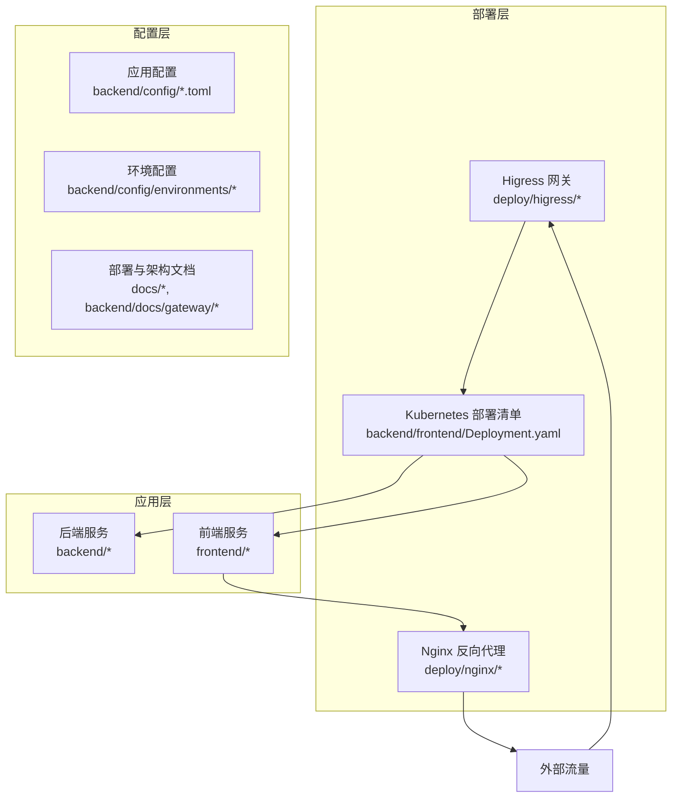
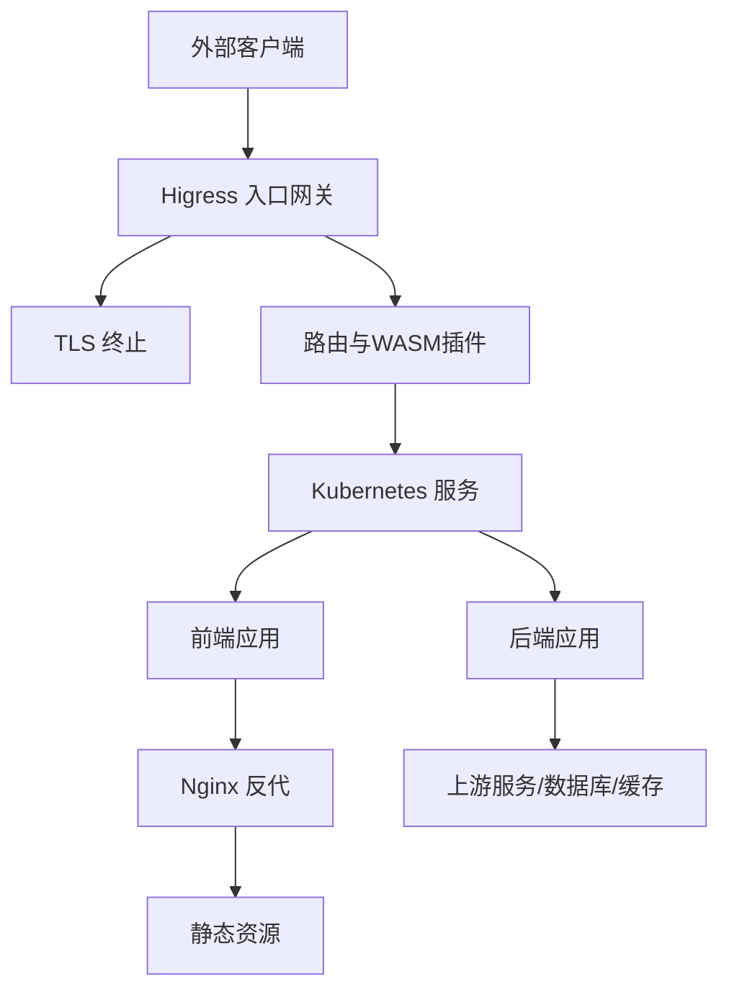
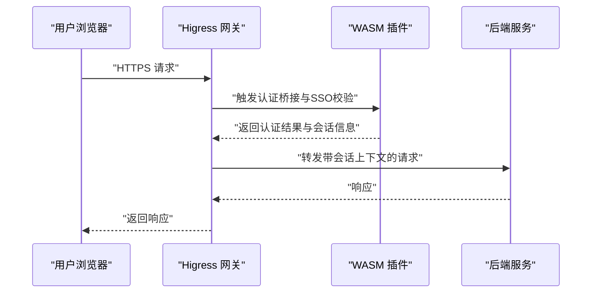
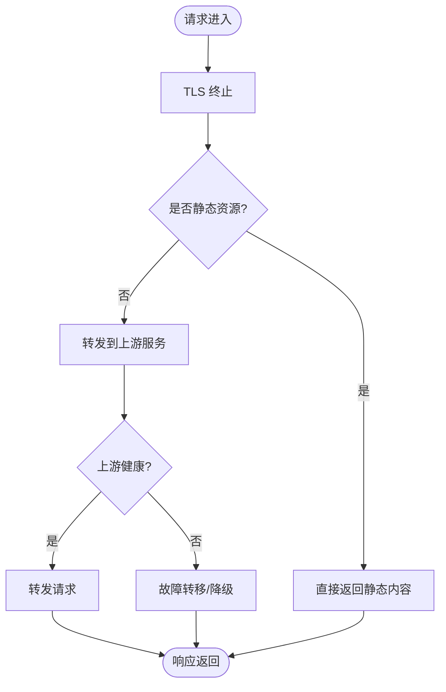
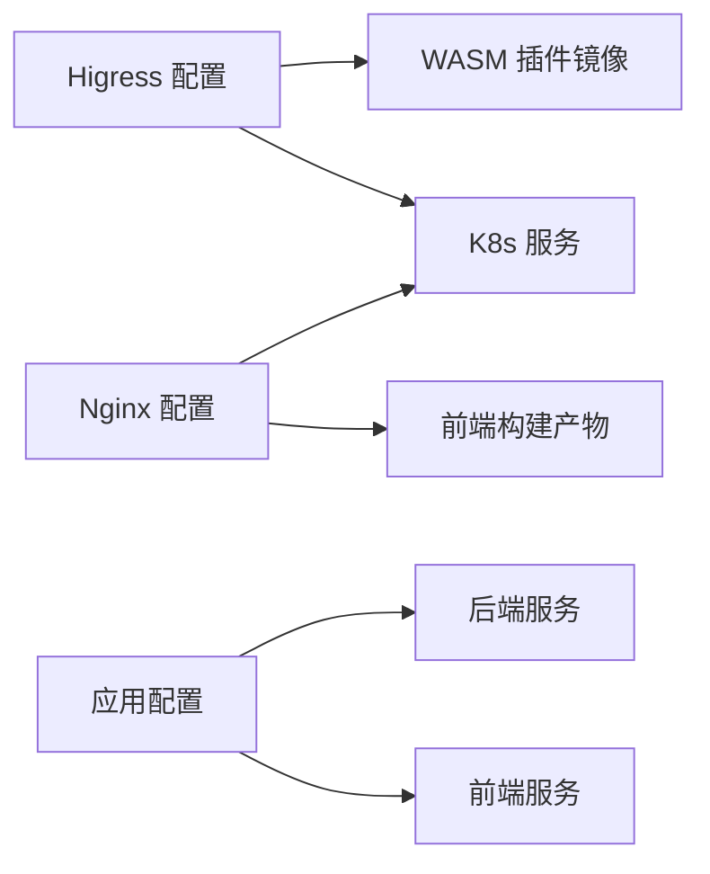

# 负载均衡与高可用

<cite>
**本文引用的文件**
- [ai-agent-ingress.example.yaml](file://deploy/higress/ai-agent-ingress.example.yaml)
- [giikin-auth-bridge-wasmplugin.example.yaml](file://deploy/higress/giikin-auth-bridge-wasmplugin.example.yaml)
- [giikin-auth-bridge-wasmplugin.yaml](file://deploy/higress/giikin-auth-bridge-wasmplugin.yaml)
- [push-giikin-auth-bridge-job.yaml](file://deploy/higress/push-giikin-auth-bridge-job.yaml)
- [apply-wasmplugin.sh](file://deploy/higress/apply-wasmplugin.sh)
- [redeploy-wasm.sh](file://deploy/higress/redeploy-wasm.sh)
- [run-nacos-fix.sh](file://deploy/higress/run-nacos-fix.sh)
- [patch-nacos-sso-callback.sh](file://deploy/higress/patch-nacos-sso-callback.sh)
- [README.md](file://deploy/higress/README.md)
- [ai-agent.bare-metal.conf.example](file://deploy/nginx/ai-agent.bare-metal.conf.example)
- [nginx.conf](file://frontend/nginx.conf)
- [README.md](file://deploy/nginx/README.md)
- [Deployment.yaml](file://backend/Deployment.yaml)
- [Deployment.yaml](file://frontend/Deployment.yaml)
- [k8s-prod.toml](file://backend/config/environments/k8s-prod.toml)
- [docker-prod.toml](file://backend/config/environments/docker-prod.toml)
- [local-dev.toml](file://backend/config/environments/local-dev.toml)
- [app.production.toml](file://backend/config/app.production.toml)
- [app.toml](file://backend/config/app.toml)
- [README.md](file://docs/DEPLOYMENT.md)
- [SSO.md](file://docs/SSO.md)
- [AUTHENTICATION.md](file://backend/docs/AUTHENTICATION.md)
- [gateway](file://backend/docs/gateway/README.md)
- [GATEWAY_DEPLOYMENT_CHECKLIST.md](file://backend/docs/gateway/GATEWAY_DEPLOYMENT_CHECKLIST.md)
- [LITELLM_CAPABILITY_MATRIX.md](file://backend/docs/gateway/LITELLM_CAPABILITY_MATRIX.md)
- [LLM_GATEWAY_ARCHITECTURE.md](file://backend/docs/gateway/LLM_GATEWAY_ARCHITECTURE.md)
- [AI_GATEWAY_DOMAIN_ARCHITECTURE.md](file://backend/docs/AI_GATEWAY_DOMAIN_ARCHITECTURE.md)
- [ARCHITECTURE.md](file://backend/docs/ARCHITECTURE.md)
- [CONFIGURATION.md](file://backend/docs/CONFIGURATION.md)
- [CODE_STANDARDS.md](file://backend/docs/CODE_STANDARDS.md)
- [LANGGRAPH_ARCHITECTURE_RATIONALE.md](file://backend/docs/LANGGRAPH_ARCHITECTURE_RATIONALE.md)
- [README.md](file://backend/docs/README.md)
- [README.md](file://docs/README.md)
</cite>

## 目录
1. [引言](#引言)
2. [项目结构](#项目结构)
3. [核心组件](#核心组件)
4. [架构总览](#架构总览)
5. [详细组件分析](#详细组件分析)
6. [依赖关系分析](#依赖关系分析)
7. [性能考虑](#性能考虑)
8. [故障排查指南](#故障排查指南)
9. [结论](#结论)
10. [附录](#附录)

## 引言
本指南面向网络工程师与系统架构师，围绕AI Agent项目的负载均衡与高可用部署展开，重点覆盖以下方面：
- Higress网关的配置与WASM插件（SSO集成、认证桥接、流量治理）实践
- Nginx反向代理的SSL终止、静态资源服务与上游配置
- 健康检查与故障转移策略
- 会话亲和性与粘性会话实现
- DNS与CDN集成方案
- 性能调优参数与连接池配置
- 熔断器与限流策略
- 灾难恢复与数据备份的高可用架构

## 项目结构
本项目在后端与前端分别提供了容器化部署清单与示例配置，并在部署目录中提供了Higress与Nginx的参考配置与运维脚本。整体结构如下：

图示来源
- [ai-agent-ingress.example.yaml](file://deploy/higress/ai-agent-ingress.example.yaml)
- [ai-agent.bare-metal.conf.example](file://deploy/nginx/ai-agent.bare-metal.conf.example)
- [Deployment.yaml](file://backend/Deployment.yaml)
- [Deployment.yaml](file://frontend/Deployment.yaml)

章节来源
- [README.md](file://docs/README.md)
- [README.md](file://backend/docs/README.md)

## 核心组件
- Higress网关：作为入口网关，负责路由、WASM插件注入（认证桥接、SSO）、TLS终止、健康检查与故障转移等。
- Nginx反向代理：在K8s集群外或裸金属场景提供SSL终止、静态资源服务与上游转发。
- Kubernetes部署：通过Deployment.yaml定义Pod副本、探针与滚动更新策略，支撑高可用与弹性伸缩。
- 应用配置：app.toml与环境配置文件（如k8s-prod.toml、docker-prod.toml）统一管理运行时参数。

章节来源
- [ai-agent-ingress.example.yaml](file://deploy/higress/ai-agent-ingress.example.yaml)
- [ai-agent.bare-metal.conf.example](file://deploy/nginx/ai-agent.bare-metal.conf.example)
- [Deployment.yaml](file://backend/Deployment.yaml)
- [Deployment.yaml](file://frontend/Deployment.yaml)
- [k8s-prod.toml](file://backend/config/environments/k8s-prod.toml)
- [docker-prod.toml](file://backend/config/environments/docker-prod.toml)
- [app.production.toml](file://backend/config/app.production.toml)
- [app.toml](file://backend/config/app.toml)

## 架构总览
下图展示从互联网到应用的完整链路，包括Higress网关、Kubernetes服务网格、后端与前端服务，以及Nginx反向代理与静态资源分发。

图示来源
- [ai-agent-ingress.example.yaml](file://deploy/higress/ai-agent-ingress.example.yaml)
- [ai-agent.bare-metal.conf.example](file://deploy/nginx/ai-agent.bare-metal.conf.example)
- [Deployment.yaml](file://backend/Deployment.yaml)
- [Deployment.yaml](file://frontend/Deployment.yaml)

## 详细组件分析

### Higress网关与WASM插件
- 配置要点
  - 入口路由与TLS证书绑定，确保HTTPS访问。
  - 启用WASM插件以实现SSO集成与认证桥接，拦截请求并注入身份上下文。
  - 流量治理：基于路径/主机名的路由规则、超时与重试策略、熔断与限流。
- WASM插件
  - 提供认证桥接能力，将外部SSO令牌转换为内部会话标识，支持跨域与CORS处理。
  - 支持动态加载与热更新，配合脚本进行插件推送与重部署。
- 运维脚本
  - 插件安装与应用：apply-wasmplugin.sh
  - 插件热更新：redeploy-wasm.sh
  - SSO相关修复与回调补丁：run-nacos-fix.sh、patch-nacos-sso-callback.sh

图示来源
- [giikin-auth-bridge-wasmplugin.example.yaml](file://deploy/higress/giikin-auth-bridge-wasmplugin.example.yaml)
- [giikin-auth-bridge-wasmplugin.yaml](file://deploy/higress/giikin-auth-bridge-wasmplugin.yaml)
- [push-giikin-auth-bridge-job.yaml](file://deploy/higress/push-giikin-auth-bridge-job.yaml)
- [apply-wasmplugin.sh](file://deploy/higress/apply-wasmplugin.sh)
- [redeploy-wasm.sh](file://deploy/higress/redeploy-wasm.sh)
- [run-nacos-fix.sh](file://deploy/higress/run-nacos-fix.sh)
- [patch-nacos-sso-callback.sh](file://deploy/higress/patch-nacos-sso-callback.sh)

章节来源
- [ai-agent-ingress.example.yaml](file://deploy/higress/ai-agent-ingress.example.yaml)
- [giikin-auth-bridge-wasmplugin.example.yaml](file://deploy/higress/giikin-auth-bridge-wasmplugin.example.yaml)
- [giikin-auth-bridge-wasmplugin.yaml](file://deploy/higress/giikin-auth-bridge-wasmplugin.yaml)
- [push-giikin-auth-bridge-job.yaml](file://deploy/higress/push-giikin-auth-bridge-job.yaml)
- [apply-wasmplugin.sh](file://deploy/higress/apply-wasmplugin.sh)
- [redeploy-wasm.sh](file://deploy/higress/redeploy-wasm.sh)
- [run-nacos-fix.sh](file://deploy/higress/run-nacos-fix.sh)
- [patch-nacos-sso-callback.sh](file://deploy/higress/patch-nacos-sso-callback.sh)
- [README.md](file://deploy/higress/README.md)

### Nginx反向代理
- SSL终止：在Nginx层完成TLS握手，降低后端CPU开销。
- 静态资源服务：对前端构建产物进行高效缓存与压缩。
- 上游配置：将动态请求转发至K8s服务或后端实例，支持健康检查与故障转移。
- 示例配置：ai-agent.bare-metal.conf.example提供裸金属部署参考；frontend/nginx.conf用于容器内Nginx。

图示来源
- [ai-agent.bare-metal.conf.example](file://deploy/nginx/ai-agent.bare-metal.conf.example)
- [nginx.conf](file://frontend/nginx.conf)
- [README.md](file://deploy/nginx/README.md)

章节来源
- [ai-agent.bare-metal.conf.example](file://deploy/nginx/ai-agent.bare-metal.conf.example)
- [nginx.conf](file://frontend/nginx.conf)
- [README.md](file://deploy/nginx/README.md)

### 健康检查与故障转移
- 探针配置：Kubernetes存活/就绪探针用于自动重启与流量摘除。
- 故障转移：结合Higress路由与上游服务状态，实现多副本间的自动切换。
- 熔断与限流：通过Higress的流量治理能力限制异常流量，保护后端。

章节来源
- [Deployment.yaml](file://backend/Deployment.yaml)
- [Deployment.yaml](file://frontend/Deployment.yaml)
- [ai-agent-ingress.example.yaml](file://deploy/higress/ai-agent-ingress.example.yaml)

### 会话亲和性与粘性会话
- 会话亲和：通过Cookie或Header维持客户端与后端实例的稳定映射，避免状态丢失。
- 粘性会话：在多副本部署中保持同一会话的请求落到同一实例，适用于需要本地缓存或会话状态的应用层逻辑。
- 注意：若后端无本地会话状态，建议使用共享存储或无状态设计以提升弹性。

章节来源
- [ai-agent-ingress.example.yaml](file://deploy/higress/ai-agent-ingress.example.yaml)
- [k8s-prod.toml](file://backend/config/environments/k8s-prod.toml)

### DNS与CDN集成
- DNS：通过CNAME或A记录将域名指向Higress入口IP或负载均衡器。
- CDN：静态资源经由CDN缓存加速，动态请求绕过CDN直连后端。
- 多区域：结合DNS轮询或多区域Anycast实现地理就近访问与容灾。

章节来源
- [README.md](file://docs/DEPLOYMENT.md)
- [SSO.md](file://docs/SSO.md)

### 性能调优与连接池
- 连接池：合理设置上游连接数、空闲连接与超时时间，避免连接泄漏与拥塞。
- 缓存：启用Nginx静态缓存与HTTP缓存头，减少后端压力。
- 并发：根据CPU核数与内存配置调整工作进程与并发连接上限。
- 调优参数：结合业务峰值与SLA目标，逐步压测并优化。

章节来源
- [ai-agent.bare-metal.conf.example](file://deploy/nginx/ai-agent.bare-metal.conf.example)
- [nginx.conf](file://frontend/nginx.conf)
- [k8s-prod.toml](file://backend/config/environments/k8s-prod.toml)

### 熔断器与限流策略
- 限流：按IP、用户、API路径或模型维度进行QPS限制，防止突发流量冲击。
- 熔断：当错误率或延迟超过阈值时快速失败并短路后续请求，保护下游系统。
- 配置位置：Higress路由与WASM插件中均可实现，需结合监控指标动态调整。

章节来源
- [ai-agent-ingress.example.yaml](file://deploy/higress/ai-agent-ingress.example.yaml)
- [GATEWAY_DEPLOYMENT_CHECKLIST.md](file://backend/docs/gateway/GATEWAY_DEPLOYMENT_CHECKLIST.md)

### 灾难恢复与数据备份
- 数据库备份：定期快照与增量备份，支持RPO/RTO目标。
- 配置备份：版本化管理app.toml与环境配置，变更走CI/CD审批。
- 多活部署：跨可用区/跨地域部署，结合DNS与负载均衡实现自动切换。
- 容灾演练：定期进行故障演练，验证恢复流程与SLA达标。

章节来源
- [CONFIGURATION.md](file://backend/docs/CONFIGURATION.md)
- [AI_GATEWAY_DOMAIN_ARCHITECTURE.md](file://backend/docs/AI_GATEWAY_DOMAIN_ARCHITECTURE.md)
- [LLM_GATEWAY_ARCHITECTURE.md](file://backend/docs/gateway/LLM_GATEWAY_ARCHITECTURE.md)

## 依赖关系分析
- Higress依赖于Kubernetes服务发现与证书管理，WASM插件依赖于镜像仓库与推送脚本。
- Nginx依赖于前端构建产物与后端服务端点，需与Higress路由保持一致。
- 应用层依赖配置文件与环境变量，生产环境应严格区分密钥与敏感参数。

图示来源
- [ai-agent-ingress.example.yaml](file://deploy/higress/ai-agent-ingress.example.yaml)
- [giikin-auth-bridge-wasmplugin.yaml](file://deploy/higress/giikin-auth-bridge-wasmplugin.yaml)
- [ai-agent.bare-metal.conf.example](file://deploy/nginx/ai-agent.bare-metal.conf.example)
- [Deployment.yaml](file://backend/Deployment.yaml)
- [Deployment.yaml](file://frontend/Deployment.yaml)
- [app.toml](file://backend/config/app.toml)

章节来源
- [ai-agent-ingress.example.yaml](file://deploy/higress/ai-agent-ingress.example.yaml)
- [giikin-auth-bridge-wasmplugin.yaml](file://deploy/higress/giikin-auth-bridge-wasmplugin.yaml)
- [ai-agent.bare-metal.conf.example](file://deploy/nginx/ai-agent.bare-metal.conf.example)
- [Deployment.yaml](file://backend/Deployment.yaml)
- [Deployment.yaml](file://frontend/Deployment.yaml)
- [app.toml](file://backend/config/app.toml)

## 性能考虑
- 连接池与并发：根据实例规格与业务峰值设定最大连接数与空闲连接数。
- 缓存策略：静态资源强缓存与版本化，动态接口合理设置Cache-Control。
- 网络优化：开启gzip/br压缩，启用HTTP/2，减少TLS握手次数。
- 监控与告警：结合探针与日志，建立延迟、错误率与连接数的阈值告警。

章节来源
- [ai-agent.bare-metal.conf.example](file://deploy/nginx/ai-agent.bare-metal.conf.example)
- [nginx.conf](file://frontend/nginx.conf)
- [k8s-prod.toml](file://backend/config/environments/k8s-prod.toml)

## 故障排查指南
- Higress问题
  - 插件未生效：检查镜像拉取策略与推送作业状态。
  - SSO回调异常：执行SSO修复脚本与回调补丁脚本。
  - 路由不生效：核对入口配置与WASM插件顺序。
- Nginx问题
  - 静态资源404：确认构建产物路径与Nginx根目录配置。
  - 上游不可达：检查后端服务端点与K8s服务状态。
- 应用问题
  - 探针失败：检查存活/就绪探针配置与端口暴露。
  - 配置错误：核对app.toml与环境配置文件差异。

章节来源
- [apply-wasmplugin.sh](file://deploy/higress/apply-wasmplugin.sh)
- [redeploy-wasm.sh](file://deploy/higress/redeploy-wasm.sh)
- [run-nacos-fix.sh](file://deploy/higress/run-nacos-fix.sh)
- [patch-nacos-sso-callback.sh](file://deploy/higress/patch-nacos-sso-callback.sh)
- [ai-agent.bare-metal.conf.example](file://deploy/nginx/ai-agent.bare-metal.conf.example)
- [Deployment.yaml](file://backend/Deployment.yaml)

## 结论
通过Higress网关与WASM插件实现SSO与认证桥接，结合Nginx反向代理与Kubernetes部署，可构建高可用、可扩展且具备完善流量治理能力的AI Agent系统。建议在生产环境中严格执行配置版本化、变更审批与演练制度，并持续优化性能与可靠性指标。

## 附录
- 参考文档与架构说明：AI_GATEWAY_DOMAIN_ARCHITECTURE、LLM_GATEWAY_ARCHITECTURE、GATEWAY_DEPLOYMENT_CHECKLIST、AUTHENTICATION、SSO等。
- 配置模板与示例：ai-agent-ingress.example.yaml、ai-agent.bare-metal.conf.example、frontend/nginx.conf、app.toml、k8s-prod.toml、docker-prod.toml。

章节来源
- [AI_GATEWAY_DOMAIN_ARCHITECTURE.md](file://backend/docs/AI_GATEWAY_DOMAIN_ARCHITECTURE.md)
- [LLM_GATEWAY_ARCHITECTURE.md](file://backend/docs/gateway/LLM_GATEWAY_ARCHITECTURE.md)
- [GATEWAY_DEPLOYMENT_CHECKLIST.md](file://backend/docs/gateway/GATEWAY_DEPLOYMENT_CHECKLIST.md)
- [AUTHENTICATION.md](file://backend/docs/AUTHENTICATION.md)
- [SSO.md](file://docs/SSO.md)
- [ai-agent-ingress.example.yaml](file://deploy/higress/ai-agent-ingress.example.yaml)
- [ai-agent.bare-metal.conf.example](file://deploy/nginx/ai-agent.bare-metal.conf.example)
- [nginx.conf](file://frontend/nginx.conf)
- [app.toml](file://backend/config/app.toml)
- [k8s-prod.toml](file://backend/config/environments/k8s-prod.toml)
- [docker-prod.toml](file://backend/config/environments/docker-prod.toml)