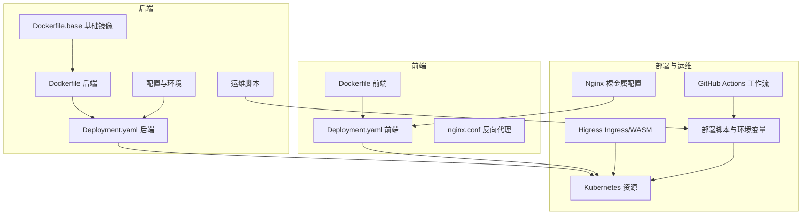
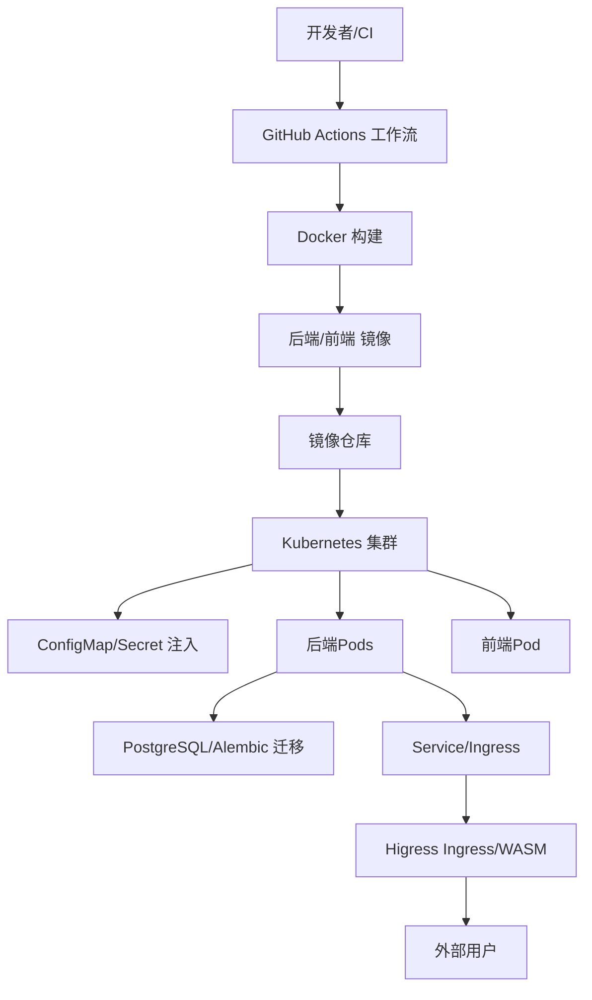
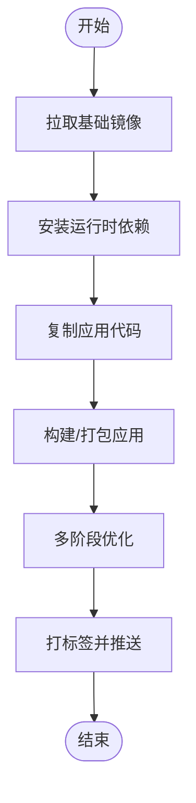
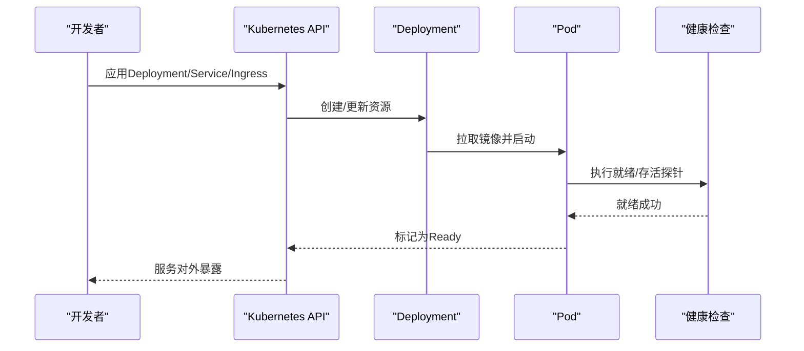
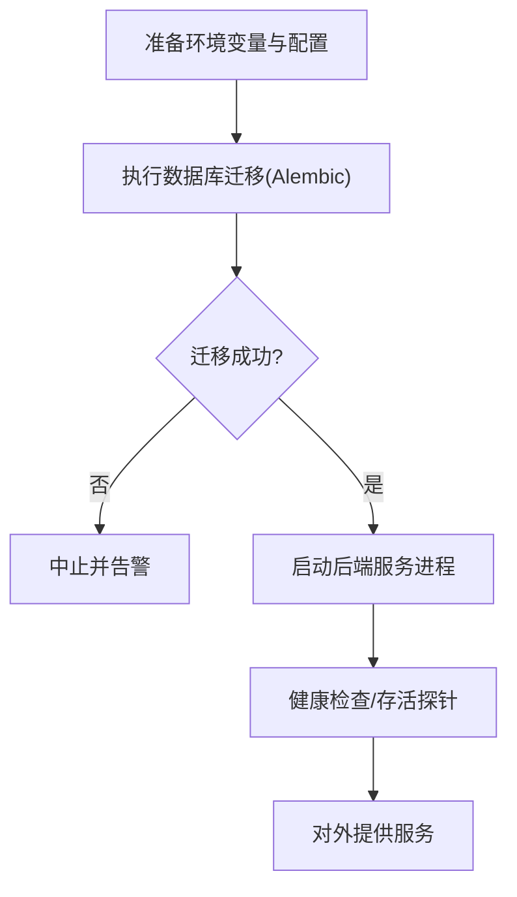
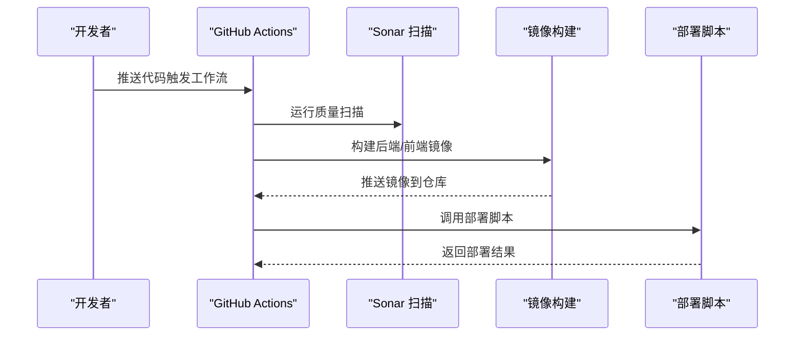
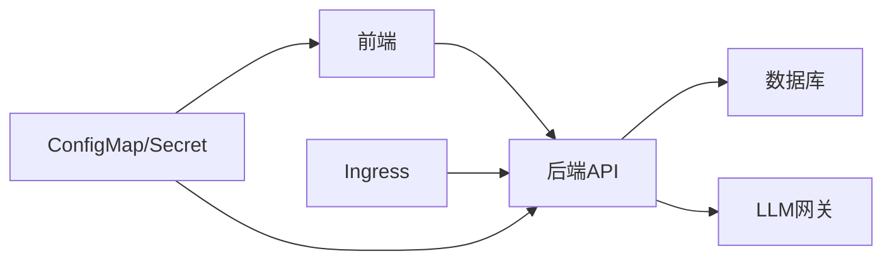

# 部署与运维

<cite>
**本文引用的文件**
- [backend/Dockerfile](file://backend/Dockerfile)
- [backend/Dockerfile.base](file://backend/Dockerfile.base)
- [backend/docker/sandbox/Dockerfile](file://backend/docker/sandbox/Dockerfile)
- [backend/Deployment.yaml](file://backend/Deployment.yaml)
- [backend/config/app.production.toml](file://backend/config/app.production.toml)
- [backend/config/environments/k8s-prod.toml](file://backend/config/environments/k8s-prod.toml)
- [backend/config/environments/docker-prod.toml](file://backend/config/environments/docker-prod.toml)
- [backend/config/environments/docker-dev.toml](file://backend/config/environments/docker-dev.toml)
- [backend/config/environments/local-dev.toml](file://backend/config/environments/local-dev.toml)
- [backend/config/env.example](file://backend/config/env.example)
- [backend/alembic.ini](file://backend/alembic.ini)
- [backend/scripts/run_server.py](file://backend/scripts/run_server.py)
- [backend/scripts/run_dev_server.py](file://backend/scripts/run_dev_server.py)
- [backend/scripts/migrate_test_db.py](file://backend/scripts/migrate_test_db.py)
- [backend/scripts/test_gateway_proxy.py](file://backend/scripts/test_gateway_proxy.py)
- [backend/scripts/seed_gateway_models.py](file://backend/scripts/seed_gateway_models.py)
- [backend/scripts/set_admin.py](file://backend/scripts/set_admin.py)
- [backend/scripts/cleanup_sandbox_containers.py](file://backend/scripts/cleanup_sandbox_containers.py)
- [backend/scripts/probe_dashscope_embedding.py](file://backend/scripts/probe_dashscope_embedding.py)
- [backend/scripts/list_configured_models.py](file://backend/scripts/list_configured_models.py)
- [backend/scripts/check_sonar_env.py](file://backend/scripts/check_sonar_env.py)
- [backend/utils/logging.py](file://backend/utils/logging.py)
- [backend/libs/observability](file://backend/libs/observability)
- [backend/.github/workflows/backend-architecture.yml](file://backend/.github/workflows/backend-architecture.yml)
- [backend/.github/workflows/sonar.yml](file://backend/.github/workflows/sonar.yml)
- [backend/.github/workflows/sonarcloud.yml](file://backend/.github/workflows/sonarcloud.yml)
- [backend/.github/workflows/typecheck.yml](file://backend/.github/workflows/typecheck.yml)
- [deploy/higress/ai-agent-ingress.example.yaml](file://deploy/higress/ai-agent-ingress.example.yaml)
- [deploy/higress/giikin-auth-bridge-wasmplugin.example.yaml](file://deploy/higress/giikin-auth-bridge-wasmplugin.example.yaml)
- [deploy/higress/push-giikin-auth-bridge-job.yaml](file://deploy/higress/push-giikin-auth-bridge-job.yaml)
- [deploy/nginx/ai-agent.bare-metal.conf.example](file://deploy/nginx/ai-agent.bare-metal.conf.example)
- [deploy/deploy.sh](file://deploy/deploy.sh)
- [deploy/remote-deploy.sh](file://deploy/remote-deploy.sh)
- [deploy/remote-deploy.ps1](file://deploy/remote-deploy.ps1)
- [deploy/backend.env.production](file://deploy/backend.env.production)
- [docs/DEPLOYMENT.md](file://docs/DEPLOYMENT.md)
- [docs/logging.md](file://docs/logging.md)
- [docs/SSO.md](file://docs/SSO.md)
- [docs/deployment-production.html](file://docs/deployment-production.html)
- [Makefile](file://Makefile)
- [backend/Makefile](file://backend/Makefile)
- [frontend/Dockerfile](file://frontend/Dockerfile)
- [frontend/Deployment.yaml](file://frontend/Deployment.yaml)
- [frontend/nginx.conf](file://frontend/nginx.conf)
- [frontend/package.json](file://frontend/package.json)
- [docker-compose.yml](file://docker-compose.yml)
- [docker-compose.prod.yml](file://docker-compose.prod.yml)
</cite>

## 目录
1. [简介](#简介)
2. [项目结构](#项目结构)
3. [核心组件](#核心组件)
4. [架构总览](#架构总览)
5. [详细组件分析](#详细组件分析)
6. [依赖关系分析](#依赖关系分析)
7. [性能考虑](#性能考虑)
8. [故障排查指南](#故障排查指南)
9. [结论](#结论)
10. [附录](#附录)

## 简介
本文件面向DevOps工程师与运维人员，提供AI Agent项目的部署与运维实践指南。内容覆盖Docker容器化与镜像构建、Kubernetes编排与配置、生产环境部署流程（含数据库迁移与服务启动顺序）、监控与日志体系、CI/CD流水线、负载均衡与高可用、运维最佳实践、故障排查与应急响应、版本发布与回滚策略等。

## 项目结构
该项目采用前后端分离架构，后端以Python/FastAPI为核心，前端基于Vite+React，同时提供Docker容器化与Kubernetes部署能力，并配套CI/CD工作流与运维脚本。

图示来源
- [backend/Dockerfile:1-200](file://backend/Dockerfile#L1-L200)
- [backend/Dockerfile.base:1-200](file://backend/Dockerfile.base#L1-L200)
- [backend/Deployment.yaml:1-300](file://backend/Deployment.yaml#L1-L300)
- [frontend/Dockerfile:1-200](file://frontend/Dockerfile#L1-L200)
- [frontend/Deployment.yaml:1-300](file://frontend/Deployment.yaml#L1-L300)
- [frontend/nginx.conf:1-200](file://frontend/nginx.conf#L1-L200)
- [deploy/higress/ai-agent-ingress.example.yaml:1-200](file://deploy/higress/ai-agent-ingress.example.yaml#L1-L200)
- [backend/.github/workflows/backend-architecture.yml:1-200](file://backend/.github/workflows/backend-architecture.yml#L1-L200)

章节来源
- [backend/Dockerfile:1-200](file://backend/Dockerfile#L1-L200)
- [backend/Dockerfile.base:1-200](file://backend/Dockerfile.base#L1-L200)
- [backend/Deployment.yaml:1-300](file://backend/Deployment.yaml#L1-L300)
- [frontend/Dockerfile:1-200](file://frontend/Dockerfile#L1-L200)
- [frontend/Deployment.yaml:1-300](file://frontend/Deployment.yaml#L1-L300)
- [frontend/nginx.conf:1-200](file://frontend/nginx.conf#L1-L200)
- [deploy/higress/ai-agent-ingress.example.yaml:1-200](file://deploy/higress/ai-agent-ingress.example.yaml#L1-L200)
- [backend/.github/workflows/backend-architecture.yml:1-200](file://backend/.github/workflows/backend-architecture.yml#L1-L200)

## 核心组件
- 容器镜像与构建
  - 后端基础镜像与应用镜像：通过Dockerfile.base与Dockerfile构建，支持多阶段构建与缓存优化。
  - 前端镜像：基于静态站点，配合nginx.conf进行反向代理与静态资源服务。
  - 沙箱容器：用于代码工具执行的安全沙箱，独立Dockerfile隔离运行环境。
- Kubernetes编排
  - 后端与前端均提供Deployment.yaml，定义Pod模板、副本数、探针与资源限制。
  - 配置管理：通过ConfigMap/Secret挂载配置文件与环境变量。
  - Ingress与WASM插件：Higress示例配置展示路由、认证桥接与可观测性增强。
- 生产环境部署
  - 环境配置：app.production.toml与k8s-prod.toml提供生产参数；docker-prod.toml用于Docker环境。
  - 数据库迁移：Alembic迁移脚本与测试数据库迁移脚本，确保Schema一致性。
  - 启动顺序：先DB迁移，再启动服务进程，配合健康检查保障就绪。
- 监控与日志
  - 应用日志：统一日志模块与结构化输出，便于集中采集与检索。
  - 观测性：后端libs/observability提供指标与追踪能力。
- CI/CD
  - GitHub Actions：架构检查、Sonar扫描、类型检查与质量门禁。
  - 部署脚本：deploy.sh与remote-deploy.*封装远程部署流程。
- 负载均衡与高可用
  - Ingress路由与WASM插件：统一入口、认证桥接与流量治理。
  - Nginx裸金属：ai-agent.bare-metal.conf.example提供本地部署参考。
- 运维脚本
  - 多类运维辅助脚本：网关探测、模型清单、管理员设置、沙箱清理等。

章节来源
- [backend/Dockerfile:1-200](file://backend/Dockerfile#L1-L200)
- [backend/Dockerfile.base:1-200](file://backend/Dockerfile.base#L1-L200)
- [backend/docker/sandbox/Dockerfile:1-200](file://backend/docker/sandbox/Dockerfile#L1-L200)
- [backend/Deployment.yaml:1-300](file://backend/Deployment.yaml#L1-L300)
- [frontend/Dockerfile:1-200](file://frontend/Dockerfile#L1-L200)
- [frontend/Deployment.yaml:1-300](file://frontend/Deployment.yaml#L1-L300)
- [backend/config/app.production.toml:1-200](file://backend/config/app.production.toml#L1-L200)
- [backend/config/environments/k8s-prod.toml:1-200](file://backend/config/environments/k8s-prod.toml#L1-L200)
- [backend/config/environments/docker-prod.toml:1-200](file://backend/config/environments/docker-prod.toml#L1-L200)
- [backend/alembic.ini:1-200](file://backend/alembic.ini#L1-L200)
- [backend/scripts/run_server.py:1-200](file://backend/scripts/run_server.py#L1-L200)
- [backend/scripts/run_dev_server.py:1-200](file://backend/scripts/run_dev_server.py#L1-L200)
- [backend/scripts/migrate_test_db.py:1-200](file://backend/scripts/migrate_test_db.py#L1-L200)
- [backend/utils/logging.py:1-200](file://backend/utils/logging.py#L1-L200)
- [backend/libs/observability:1-200](file://backend/libs/observability#L1-L200)
- [backend/.github/workflows/backend-architecture.yml:1-200](file://backend/.github/workflows/backend-architecture.yml#L1-L200)
- [deploy/deploy.sh:1-200](file://deploy/deploy.sh#L1-L200)
- [deploy/remote-deploy.sh:1-200](file://deploy/remote-deploy.sh#L1-L200)
- [deploy/remote-deploy.ps1:1-200](file://deploy/remote-deploy.ps1#L1-L200)
- [deploy/higress/ai-agent-ingress.example.yaml:1-200](file://deploy/higress/ai-agent-ingress.example.yaml#L1-L200)
- [deploy/nginx/ai-agent.bare-metal.conf.example:1-200](file://deploy/nginx/ai-agent.bare-metal.conf.example#L1-L200)

## 架构总览
下图展示了容器化与Kubernetes部署的整体视图，涵盖镜像构建、配置注入、服务暴露与流量治理。

图示来源
- [backend/Dockerfile:1-200](file://backend/Dockerfile#L1-L200)
- [frontend/Dockerfile:1-200](file://frontend/Dockerfile#L1-L200)
- [backend/Deployment.yaml:1-300](file://backend/Deployment.yaml#L1-L300)
- [frontend/Deployment.yaml:1-300](file://frontend/Deployment.yaml#L1-L300)
- [deploy/higress/ai-agent-ingress.example.yaml:1-200](file://deploy/higress/ai-agent-ingress.example.yaml#L1-L200)

## 详细组件分析

### Docker容器化与镜像构建
- 后端镜像
  - 使用Dockerfile.base作为基础层，Dockerfile在基础层之上安装依赖并打包应用。
  - 支持多阶段构建，减少最终镜像体积，提升安全性。
- 前端镜像
  - 基于nginx.conf提供静态资源服务，结合Dockerfile完成镜像构建。
- 沙箱镜像
  - 用于工具执行的隔离容器，独立Dockerfile，最小化权限与网络访问。

图示来源
- [backend/Dockerfile.base:1-200](file://backend/Dockerfile.base#L1-L200)
- [backend/Dockerfile:1-200](file://backend/Dockerfile#L1-L200)
- [frontend/Dockerfile:1-200](file://frontend/Dockerfile#L1-L200)
- [backend/docker/sandbox/Dockerfile:1-200](file://backend/docker/sandbox/Dockerfile#L1-L200)

章节来源
- [backend/Dockerfile.base:1-200](file://backend/Dockerfile.base#L1-L200)
- [backend/Dockerfile:1-200](file://backend/Dockerfile#L1-L200)
- [frontend/Dockerfile:1-200](file://frontend/Dockerfile#L1-L200)
- [backend/docker/sandbox/Dockerfile:1-200](file://backend/docker/sandbox/Dockerfile#L1-L200)

### Kubernetes部署策略
- Pod与Deployment
  - 后端与前端均提供Deployment.yaml，定义容器镜像、端口、环境变量、资源限制与探针。
- Service与Ingress
  - Service负责集群内服务发现；Ingress（Higress示例）负责外部流量接入与路由。
- ConfigMap与Secret
  - 将配置文件与敏感信息注入到Pod中，避免硬编码在镜像或Deployment中。
- 配置示例
  - k8s-prod.toml与docker-prod.toml分别面向Kubernetes与Docker环境的生产配置。

图示来源
- [backend/Deployment.yaml:1-300](file://backend/Deployment.yaml#L1-L300)
- [frontend/Deployment.yaml:1-300](file://frontend/Deployment.yaml#L1-L300)
- [deploy/higress/ai-agent-ingress.example.yaml:1-200](file://deploy/higress/ai-agent-ingress.example.yaml#L1-L200)
- [backend/config/environments/k8s-prod.toml:1-200](file://backend/config/environments/k8s-prod.toml#L1-L200)

章节来源
- [backend/Deployment.yaml:1-300](file://backend/Deployment.yaml#L1-L300)
- [frontend/Deployment.yaml:1-300](file://frontend/Deployment.yaml#L1-L300)
- [deploy/higress/ai-agent-ingress.example.yaml:1-200](file://deploy/higress/ai-agent-ingress.example.yaml#L1-L200)
- [backend/config/environments/k8s-prod.toml:1-200](file://backend/config/environments/k8s-prod.toml#L1-L200)

### 生产环境部署流程
- 环境配置
  - 使用app.production.toml与k8s-prod.toml定义生产参数；docker-prod.toml用于Docker环境。
  - env.example提供环境变量模板，确保本地与CI一致。
- 数据库迁移
  - Alembic迁移脚本与测试数据库迁移脚本，确保Schema演进与一致性。
- 服务启动顺序
  - 先执行数据库迁移，再启动后端服务进程；run_server.py与run_dev_server.py分别用于生产与开发模式。
- 启动与就绪
  - 通过健康检查与探针保障服务就绪，避免流量接入过早导致失败。

图示来源
- [backend/config/app.production.toml:1-200](file://backend/config/app.production.toml#L1-L200)
- [backend/config/environments/docker-prod.toml:1-200](file://backend/config/environments/docker-prod.toml#L1-L200)
- [backend/config/environments/local-dev.toml:1-200](file://backend/config/environments/local-dev.toml#L1-L200)
- [backend/config/env.example:1-200](file://backend/config/env.example#L1-L200)
- [backend/alembic.ini:1-200](file://backend/alembic.ini#L1-L200)
- [backend/scripts/migrate_test_db.py:1-200](file://backend/scripts/migrate_test_db.py#L1-L200)
- [backend/scripts/run_server.py:1-200](file://backend/scripts/run_server.py#L1-L200)
- [backend/scripts/run_dev_server.py:1-200](file://backend/scripts/run_dev_server.py#L1-L200)

章节来源
- [backend/config/app.production.toml:1-200](file://backend/config/app.production.toml#L1-L200)
- [backend/config/environments/docker-prod.toml:1-200](file://backend/config/environments/docker-prod.toml#L1-L200)
- [backend/config/environments/local-dev.toml:1-200](file://backend/config/environments/local-dev.toml#L1-L200)
- [backend/config/env.example:1-200](file://backend/config/env.example#L1-L200)
- [backend/alembic.ini:1-200](file://backend/alembic.ini#L1-L200)
- [backend/scripts/migrate_test_db.py:1-200](file://backend/scripts/migrate_test_db.py#L1-L200)
- [backend/scripts/run_server.py:1-200](file://backend/scripts/run_server.py#L1-L200)
- [backend/scripts/run_dev_server.py:1-200](file://backend/scripts/run_dev_server.py#L1-L200)

### 监控与日志系统
- 日志
  - 统一日志模块与结构化输出，便于集中采集与检索。
- 观测性
  - 后端libs/observability提供指标与追踪能力，建议结合Prometheus/Grafana进行可视化。
- 文档参考
  - docs/logging.md与docs/DEPLOYMENT.md提供日志与部署相关的最佳实践。

章节来源
- [backend/utils/logging.py:1-200](file://backend/utils/logging.py#L1-L200)
- [backend/libs/observability:1-200](file://backend/libs/observability#L1-L200)
- [docs/logging.md:1-200](file://docs/logging.md#L1-L200)
- [docs/DEPLOYMENT.md:1-200](file://docs/DEPLOYMENT.md#L1-L200)

### CI/CD流水线
- 工作流
  - backend-architecture.yml、sonar.yml、sonarcloud.yml、typecheck.yml分别负责架构检查、Sonar扫描、云平台扫描与类型检查。
- 部署脚本
  - deploy.sh与remote-deploy.*封装远程部署流程，支持一键部署与回滚。

图示来源
- [backend/.github/workflows/backend-architecture.yml:1-200](file://backend/.github/workflows/backend-architecture.yml#L1-L200)
- [backend/.github/workflows/sonar.yml:1-200](file://backend/.github/workflows/sonar.yml#L1-L200)
- [backend/.github/workflows/sonarcloud.yml:1-200](file://backend/.github/workflows/sonarcloud.yml#L1-L200)
- [backend/.github/workflows/typecheck.yml:1-200](file://backend/.github/workflows/typecheck.yml#L1-L200)
- [deploy/deploy.sh:1-200](file://deploy/deploy.sh#L1-L200)
- [deploy/remote-deploy.sh:1-200](file://deploy/remote-deploy.sh#L1-L200)
- [deploy/remote-deploy.ps1:1-200](file://deploy/remote-deploy.ps1#L1-L200)

章节来源
- [backend/.github/workflows/backend-architecture.yml:1-200](file://backend/.github/workflows/backend-architecture.yml#L1-L200)
- [backend/.github/workflows/sonar.yml:1-200](file://backend/.github/workflows/sonar.yml#L1-L200)
- [backend/.github/workflows/sonarcloud.yml:1-200](file://backend/.github/workflows/sonarcloud.yml#L1-L200)
- [backend/.github/workflows/typecheck.yml:1-200](file://backend/.github/workflows/typecheck.yml#L1-L200)
- [deploy/deploy.sh:1-200](file://deploy/deploy.sh#L1-L200)
- [deploy/remote-deploy.sh:1-200](file://deploy/remote-deploy.sh#L1-L200)
- [deploy/remote-deploy.ps1:1-200](file://deploy/remote-deploy.ps1#L1-L200)

### 负载均衡与高可用
- Ingress与WASM
  - Higress示例展示路由规则、认证桥接与WASM插件集成，提升安全与可观测性。
- 裸金属部署
  - ai-agent.bare-metal.conf.example提供Nginx配置参考，适用于无Ingress的环境。
- 健康检查与故障转移
  - 结合Kubernetes探针与Ingress状态，实现自动故障转移与流量切换。

章节来源
- [deploy/higress/ai-agent-ingress.example.yaml:1-200](file://deploy/higress/ai-agent-ingress.example.yaml#L1-L200)
- [deploy/higress/giikin-auth-bridge-wasmplugin.example.yaml:1-200](file://deploy/higress/giikin-auth-bridge-wasmplugin.example.yaml#L1-L200)
- [deploy/higress/push-giikin-auth-bridge-job.yaml:1-200](file://deploy/higress/push-giikin-auth-bridge-job.yaml#L1-L200)
- [deploy/nginx/ai-agent.bare-metal.conf.example:1-200](file://deploy/nginx/ai-agent.bare-metal.conf.example#L1-L200)

### 运维最佳实践
- 备份策略
  - 数据库定期备份与快照；配置与密钥通过Secret管理，避免明文存储。
- 安全加固
  - 最小权限原则、只读根文件系统、非root用户运行、镜像漏洞扫描。
- 性能优化
  - 资源请求与限制合理设置、连接池与缓存策略、异步任务与队列。
- 配置管理
  - 使用ConfigMap/Secret注入配置；环境隔离与参数校验。

章节来源
- [backend/config/app.production.toml:1-200](file://backend/config/app.production.toml#L1-L200)
- [backend/config/env.example:1-200](file://backend/config/env.example#L1-L200)
- [deploy/backend.env.production:1-200](file://deploy/backend.env.production#L1-L200)

### 故障排查与应急响应
- 常见问题
  - 镜像构建失败：检查依赖与缓存；确认Dockerfile语法与上下文路径。
  - Pod无法就绪：查看探针配置与日志；确认数据库连通性与迁移状态。
  - Ingress不可达：检查路由规则、证书与WASM插件状态。
- 应急响应
  - 快速回滚：使用滚动更新的回滚策略；保留历史版本以便快速恢复。
  - 临时降级：关闭非关键功能、启用降级开关、限流与熔断。
- 工具与脚本
  - 运维脚本：如沙箱清理、网关探测、模型清单、管理员设置等。

章节来源
- [backend/scripts/cleanup_sandbox_containers.py:1-200](file://backend/scripts/cleanup_sandbox_containers.py#L1-L200)
- [backend/scripts/test_gateway_proxy.py:1-200](file://backend/scripts/test_gateway_proxy.py#L1-L200)
- [backend/scripts/list_configured_models.py:1-200](file://backend/scripts/list_configured_models.py#L1-L200)
- [backend/scripts/set_admin.py:1-200](file://backend/scripts/set_admin.py#L1-L200)
- [backend/scripts/probe_dashscope_embedding.py:1-200](file://backend/scripts/probe_dashscope_embedding.py#L1-L200)

### 版本发布与回滚策略
- 发布流程
  - 代码合并后触发CI，通过质量门禁后构建镜像并推送；随后调用部署脚本进行发布。
- 回滚策略
  - 使用Kubernetes滚动更新的回滚能力；保留最近N个版本；回滚前进行健康检查与灰度验证。

章节来源
- [backend/.github/workflows/backend-architecture.yml:1-200](file://backend/.github/workflows/backend-architecture.yml#L1-L200)
- [deploy/deploy.sh:1-200](file://deploy/deploy.sh#L1-L200)

## 依赖关系分析
- 组件耦合
  - 后端与数据库：通过Alembic迁移脚本耦合，需在启动前完成迁移。
  - 前后端：通过API接口耦合，前端通过Service暴露的域名与端口访问后端。
  - Ingress与后端：通过路由规则与探针状态耦合，影响流量分配。
- 外部依赖
  - 镜像仓库、数据库、对象存储、第三方LLM网关等。

图示来源
- [backend/Deployment.yaml:1-300](file://backend/Deployment.yaml#L1-L300)
- [frontend/Deployment.yaml:1-300](file://frontend/Deployment.yaml#L1-L300)
- [deploy/higress/ai-agent-ingress.example.yaml:1-200](file://deploy/higress/ai-agent-ingress.example.yaml#L1-L200)

章节来源
- [backend/Deployment.yaml:1-300](file://backend/Deployment.yaml#L1-L300)
- [frontend/Deployment.yaml:1-300](file://frontend/Deployment.yaml#L1-L300)
- [deploy/higress/ai-agent-ingress.example.yaml:1-200](file://deploy/higress/ai-agent-ingress.example.yaml#L1-L200)

## 性能考虑
- 资源规划
  - 合理设置requests/limits，避免资源争抢；根据峰值流量预留弹性。
- 缓存与连接池
  - 数据库连接池、Redis缓存、模型调用缓存，降低延迟与成本。
- 异步处理
  - 长耗时任务放入队列，避免阻塞主请求线程。
- 监控与告警
  - 关键指标（P95/P99、错误率、并发、数据库慢查询）纳入监控体系。

## 故障排查指南
- 常见症状与定位
  - 服务不可用：检查Pod状态、事件与日志；确认探针与健康检查。
  - 数据库异常：检查迁移状态、连接字符串与权限；查看慢查询。
  - Ingress异常：检查路由规则、证书与WASM插件；确认后端Service端口映射。
- 快速修复
  - 重启Pod或回滚到上一个稳定版本；临时关闭非关键功能。
- 预防措施
  - 灰度发布、容量评估、压测与演练；完善变更评审与回滚预案。

章节来源
- [backend/utils/logging.py:1-200](file://backend/utils/logging.py#L1-L200)
- [backend/scripts/run_server.py:1-200](file://backend/scripts/run_server.py#L1-L200)
- [backend/alembic.ini:1-200](file://backend/alembic.ini#L1-L200)

## 结论
本项目提供了从容器化、Kubernetes编排到CI/CD与运维实践的完整方案。通过标准化的配置注入、严格的健康检查与可观测性体系，能够支撑生产环境的高可用与高性能。建议在实际落地时结合业务流量特征进行容量规划与压测验证，并持续完善监控告警与应急响应机制。

## 附录
- 环境变量与配置
  - env.example提供环境变量模板；app.production.toml与k8s-prod.toml定义生产参数。
- 部署脚本
  - deploy.sh与remote-deploy.*支持一键部署与远程部署。
- 文档与规范
  - docs/DEPLOYMENT.md、docs/logging.md、docs/SSO.md提供部署、日志与单点登录相关规范。

章节来源
- [backend/config/env.example:1-200](file://backend/config/env.example#L1-L200)
- [backend/config/app.production.toml:1-200](file://backend/config/app.production.toml#L1-L200)
- [deploy/deploy.sh:1-200](file://deploy/deploy.sh#L1-L200)
- [deploy/remote-deploy.sh:1-200](file://deploy/remote-deploy.sh#L1-L200)
- [deploy/remote-deploy.ps1:1-200](file://deploy/remote-deploy.ps1#L1-L200)
- [docs/DEPLOYMENT.md:1-200](file://docs/DEPLOYMENT.md#L1-L200)
- [docs/logging.md:1-200](file://docs/logging.md#L1-L200)
- [docs/SSO.md:1-200](file://docs/SSO.md#L1-L200)