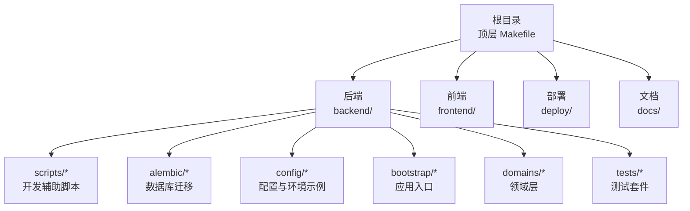
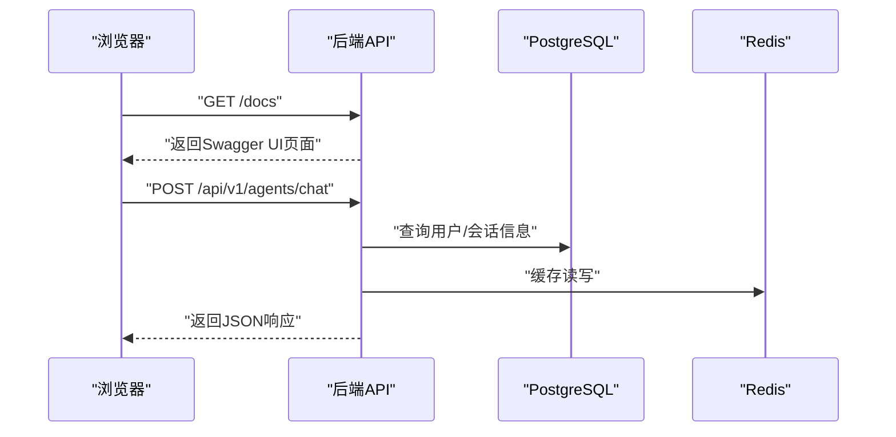
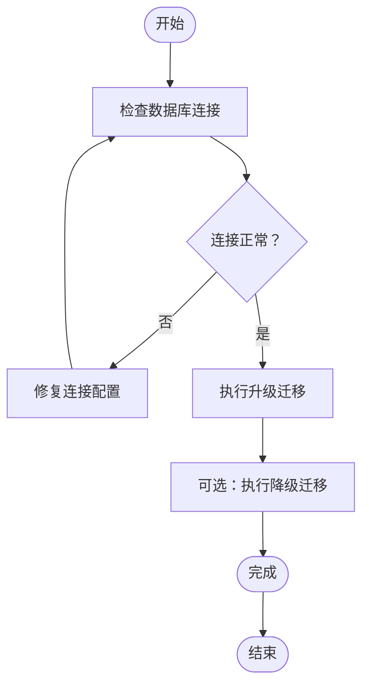
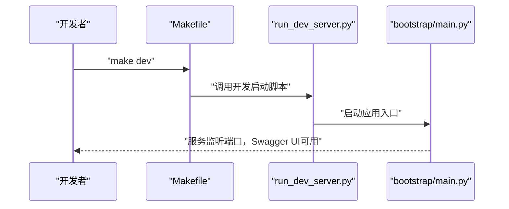
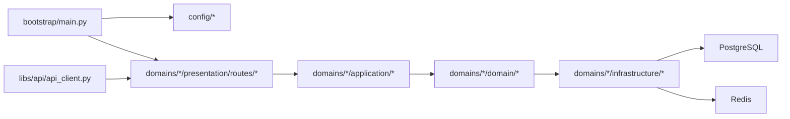

# 快速开始

<cite>
**本文引用的文件**
- [Makefile](file://Makefile)
- [backend/Makefile](file://backend/Makefile)
- [backend/pyproject.toml](file://backend/pyproject.toml)
- [backend/alembic.ini](file://backend/alembic.ini)
- [backend/config/env.example](file://backend/config/env.example)
- [env.example](file://env.example)
- [backend/scripts/run_dev_server.py](file://backend/scripts/run_dev_server.py)
- [backend/scripts/run_server.py](file://backend/scripts/run_server.py)
- [backend/bootstrap/main.py](file://backend/bootstrap/main.py)
- [backend/docs/DEVELOPMENT.md](file://backend/docs/DEVELOPMENT.md)
- [backend/docs/CONFIGURATION.md](file://backend/docs/CONFIGURATION.md)
- [backend/docs/AUTHENTICATION.md](file://backend/docs/AUTHENTICATION.md)
- [backend/docs/API_RESPONSE.md](file://backend/docs/API_RESPONSE.md)
- [backend/docs/README.md](file://backend/docs/README.md)
- [backend/domains/identity/presentation/routes/auth_routes.py](file://backend/domains/identity/presentation/routes/auth_routes.py)
- [backend/domains/agent/presentation/routes/agent_routes.py](file://backend/domains/agent/presentation/routes/agent_routes.py)
- [backend/domains/session/presentation/routes/session_routes.py](file://backend/domains/session/presentation/routes/session_routes.py)
- [backend/libs/api/api_client.py](file://backend/libs/api/api_client.py)
- [backend/scripts/test_gateway_proxy.py](file://backend/scripts/test_gateway_proxy.py)
- [backend/scripts/test_network_config.py](file://backend/scripts/test_network_config.py)
- [backend/scripts/test_tool_registry.py](file://backend/scripts/test_tool_registry.py)
- [backend/scripts/migrate_test_db.py](file://backend/scripts/migrate_test_db.py)
- [backend/scripts/seed_gateway_models.py](file://backend/scripts/seed_gateway_models.py)
- [backend/scripts/set_admin.py](file://backend/scripts/set_admin.py)
- [backend/scripts/check_encoding_issues.py](file://backend/scripts/check_encoding_issues.py)
- [backend/scripts/verify_encoding_fix.py](file://backend/scripts/verify_encoding_fix.py)
- [backend/scripts/list_configured_models.py](file://backend/scripts/list_configured_models.py)
- [backend/scripts/probe_dashscope_embedding.py](file://backend/scripts/probe_dashscope_embedding.py)
- [backend/scripts/reset_quota.py](file://backend/scripts/reset_quota.py)
- [backend/scripts/cleanup_sandbox_containers.py](file://backend/scripts/cleanup_sandbox_containers.py)
- [backend/scripts/test_checkpointer.py](file://backend/scripts/test_checkpointer.py)
- [backend/scripts/test_litellm_models.py](file://backend/scripts/test_litellm_models.py)
- [backend/scripts/generate_alembic_sql_files.py](file://backend/scripts/generate_alembic_sql_files.py)
- [backend/scripts/verify_ops_sql_files.py](file://backend/scripts/verify_ops_sql_files.py)
- [backend/scripts/run_sonar_scanner.py](file://backend/scripts/run_sonar_scanner.py)
- [backend/scripts/check_sonar_env.py](file://backend/scripts/check_sonar_env.py)
- [backend/scripts/check_encoding_issues.py](file://backend/scripts/check_encoding_issues.py)
- [backend/scripts/fix_all_encoding_issues.py](file://backend/scripts/fix_all_encoding_issues.py)
- [backend/scripts/inspect_duplicate_attribution.py](file://backend/scripts/inspect_duplicate_attribution.py)
- [backend/scripts/inspect_gateway_logs.py](file://backend/scripts/inspect_gateway_logs.py)
- [backend/scripts/test_checkpointer.py](file://backend/scripts/test_checkpointer.py)
- [backend/scripts/test_gateway_proxy.py](file://backend/scripts/test_gateway_proxy.py)
- [backend/scripts/test_network_config.py](file://backend/scripts/test_network_config.py)
- [backend/scripts/test_tool_registry.py](file://backend/scripts/test_tool_registry.py)
- [backend/scripts/migrate_test_db.py](file://backend/scripts/migrate_test_db.py)
- [backend/scripts/seed_gateway_models.py](file://backend/scripts/seed_gateway_models.py)
- [backend/scripts/set_admin.py](file://backend/scripts/set_admin.py)
- [backend/scripts/check_encoding_issues.py](file://backend/scripts/check_encoding_issues.py)
- [backend/scripts/verify_encoding_fix.py](file://backend/scripts/verify_encoding_fix.py)
- [backend/scripts/list_configured_models.py](file://backend/scripts/list_configured_models.py)
- [backend/scripts/probe_dashscope_embedding.py](file://backend/scripts/probe_dashscope_embedding.py)
- [backend/scripts/reset_quota.py](file://backend/scripts/reset_quota.py)
- [backend/scripts/cleanup_sandbox_containers.py](file://backend/scripts/cleanup_sandbox_containers.py)
- [backend/scripts/test_checkpointer.py](file://backend/scripts/test_checkpointer.py)
- [backend/scripts/test_litellm_models.py](file://backend/scripts/test_litellm_models.py)
- [backend/scripts/generate_alembic_sql_files.py](file://backend/scripts/generate_alembic_sql_files.py)
- [backend/scripts/verify_ops_sql_files.py](file://backend/scripts/verify_ops_sql_files.py)
- [backend/scripts/run_sonar_scanner.py](file://backend/scripts/run_sonar_scanner.py)
- [backend/scripts/check_sonar_env.py](file://backend/scripts/check_sonar_env.py)
</cite>

## 目录
1. [简介](#简介)
2. [项目结构](#项目结构)
3. [核心组件](#核心组件)
4. [架构总览](#架构总览)
5. [详细组件分析](#详细组件分析)
6. [依赖关系分析](#依赖关系分析)
7. [性能考虑](#性能考虑)
8. [故障排除指南](#故障排除指南)
9. [结论](#结论)
10. [附录](#附录)

## 简介
本指南面向新加入的开发者，帮助你在最短时间内完成AI Agent项目的本地开发环境搭建，并成功运行后端服务与数据库迁移。你将学到：
- 环境准备：Python 3.11+、PostgreSQL 15+、Redis 7+ 的安装与验证
- 依赖安装：uv 工具安装与项目依赖配置
- 数据库初始化与迁移：alembic 迁移脚本的使用
- 开发服务器启动：make 命令与手动启动方式
- 环境变量配置：.env 文件设置与示例对照
- 基本 API 测试：Swagger UI 访问与常用接口验证
- 常见安装问题排查与解决方案

## 项目结构
该项目采用前后端分离架构，后端使用 Python（FastAPI/Falcon 风格）与 PostgreSQL/Redis，前端使用 TypeScript/Vue 生态。根目录提供顶层 Makefile 和 backend/Makefile，用于统一执行常见任务。

**图表来源**
- [Makefile](file://Makefile)
- [backend/Makefile](file://backend/Makefile)

**章节来源**
- [Makefile](file://Makefile)
- [backend/Makefile](file://backend/Makefile)

## 核心组件
- 后端应用入口与启动
  - 应用入口位于 backend/bootstrap/main.py，负责加载配置与启动服务。
  - 提供 run_dev_server.py 与 run_server.py 两种启动方式，分别用于开发与生产。
- 数据库与迁移
  - 使用 Alembic 进行数据库版本管理，迁移脚本位于 backend/alembic/versions。
  - alembic.ini 提供迁移配置，支持本地开发与 CI 环境。
- 配置与环境变量
  - env.example 与 backend/config/env.example 提供环境变量模板，需在本地复制为 .env 并按需修改。
- 开发工具链
  - 顶层 Makefile 与 backend/Makefile 提供统一的任务编排，如安装、迁移、启动、测试等。

**章节来源**
- [backend/bootstrap/main.py](file://backend/bootstrap/main.py)
- [backend/scripts/run_dev_server.py](file://backend/scripts/run_dev_server.py)
- [backend/scripts/run_server.py](file://backend/scripts/run_server.py)
- [backend/alembic.ini](file://backend/alembic.ini)
- [backend/config/env.example](file://backend/config/env.example)
- [env.example](file://env.example)

## 架构总览
下图展示了从浏览器到后端 API 的典型交互路径，以及 Swagger UI 的访问入口。

**图表来源**
- [backend/domains/agent/presentation/routes/agent_routes.py](file://backend/domains/agent/presentation/routes/agent_routes.py)
- [backend/domains/session/presentation/routes/session_routes.py](file://backend/domains/session/presentation/routes/session_routes.py)
- [backend/domains/identity/presentation/routes/auth_routes.py](file://backend/domains/identity/presentation/routes/auth_routes.py)

## 详细组件分析

### 环境准备与依赖安装
- Python 3.11+
  - 项目使用 Python 3.11+，请确保本地已安装对应版本。
- PostgreSQL 15+
  - 数据库版本要求 15+，迁移脚本中包含多版本 SQL 脚本，需满足兼容性。
- Redis 7+
  - 缓存与会话状态依赖 Redis 7+，请确保服务可用。
- uv 工具安装与项目依赖
  - 通过 pyproject.toml 管理依赖，建议使用 uv 安装工具进行加速安装与锁定。
  - 参考后端开发文档中的依赖安装说明。

**章节来源**
- [backend/pyproject.toml](file://backend/pyproject.toml)
- [backend/docs/DEVELOPMENT.md](file://backend/docs/DEVELOPMENT.md)

### 数据库初始化与迁移
- 迁移配置
  - alembic.ini 提供迁移配置，支持本地开发与 CI 环境。
- 迁移脚本
  - 迁移脚本位于 backend/alembic/versions，覆盖初始表结构、索引优化、LangGraph 表、MCP 支持、网关表等。
- 执行迁移
  - 使用 make 或 backend/Makefile 中提供的迁移命令，确保数据库处于最新版本。
  - 可使用 migrate_test_db.py 在测试数据库上验证迁移流程。

**图表来源**
- [backend/alembic.ini](file://backend/alembic.ini)
- [backend/scripts/migrate_test_db.py](file://backend/scripts/migrate_test_db.py)

**章节来源**
- [backend/alembic.ini](file://backend/alembic.ini)
- [backend/scripts/migrate_test_db.py](file://backend/scripts/migrate_test_db.py)

### 开发服务器启动
- 使用 make 命令
  - 顶层 Makefile 与 backend/Makefile 提供统一入口，包含安装、迁移、启动、测试等常用目标。
- 手动启动方式
  - run_dev_server.py：用于本地开发调试，自动热重载。
  - run_server.py：用于生产或测试环境启动。
- 应用入口
  - bootstrap/main.py 加载配置并启动服务，确保环境变量正确设置。

**图表来源**
- [Makefile](file://Makefile)
- [backend/Makefile](file://backend/Makefile)
- [backend/scripts/run_dev_server.py](file://backend/scripts/run_dev_server.py)
- [backend/bootstrap/main.py](file://backend/bootstrap/main.py)

**章节来源**
- [Makefile](file://Makefile)
- [backend/Makefile](file://backend/Makefile)
- [backend/scripts/run_dev_server.py](file://backend/scripts/run_dev_server.py)
- [backend/bootstrap/main.py](file://backend/bootstrap/main.py)

### 环境变量配置与 .env 设置
- 复制示例文件
  - 将 env.example 或 backend/config/env.example 复制为 .env，并根据本地环境调整参数。
- 关键变量
  - 数据库连接字符串、Redis 地址、认证密钥、网关模型配置等。
- 配置校验
  - 参考配置文档与开发文档，确保所有必需变量均已设置。

**章节来源**
- [env.example](file://env.example)
- [backend/config/env.example](file://backend/config/env.example)
- [backend/docs/CONFIGURATION.md](file://backend/docs/CONFIGURATION.md)

### 基本 API 测试与 Swagger UI
- 访问 Swagger UI
  - 启动服务后，在浏览器访问 /docs 查看 API 文档与交互式测试界面。
- 常用接口
  - 身份认证：/api/v1/auth/*
  - 代理聊天：/api/v1/agents/chat
  - 会话管理：/api/v1/sessions/*
- 响应规范
  - 参考 API 响应文档，确保对字段含义与错误码有清晰理解。

**章节来源**
- [backend/docs/API_RESPONSE.md](file://backend/docs/API_RESPONSE.md)
- [backend/domains/identity/presentation/routes/auth_routes.py](file://backend/domains/identity/presentation/routes/auth_routes.py)
- [backend/domains/agent/presentation/routes/agent_routes.py](file://backend/domains/agent/presentation/routes/agent_routes.py)
- [backend/domains/session/presentation/routes/session_routes.py](file://backend/domains/session/presentation/routes/session_routes.py)

## 依赖关系分析
- 组件耦合
  - bootstrap/main.py 作为入口，依赖配置模块与各领域路由。
  - 各领域（agent、session、identity 等）通过 presentation 层暴露 API，application/domain/infrastructure 分层清晰。
- 外部依赖
  - PostgreSQL/Redis 为持久化与缓存依赖；网络配置与代理测试脚本确保外部服务连通性。
- 接口契约
  - API 客户端（libs/api/api_client.py）提供统一请求封装，便于集成与测试。

**图表来源**
- [backend/bootstrap/main.py](file://backend/bootstrap/main.py)
- [backend/libs/api/api_client.py](file://backend/libs/api/api_client.py)

**章节来源**
- [backend/bootstrap/main.py](file://backend/bootstrap/main.py)
- [backend/libs/api/api_client.py](file://backend/libs/api/api_client.py)

## 性能考虑
- 数据库索引与查询优化
  - 迁移脚本中包含性能索引与时间戳默认值修正，有助于提升查询效率。
- 缓存策略
  - Redis 用于会话状态与中间结果缓存，合理设置过期策略与键空间。
- 网关与模型配置
  - litellm 模型配置与网关代理测试脚本可用于评估不同供应商的延迟与吞吐。

**章节来源**
- [backend/scripts/test_gateway_proxy.py](file://backend/scripts/test_gateway_proxy.py)
- [backend/scripts/test_litellm_models.py](file://backend/scripts/test_litellm_models.py)

## 故障排除指南
- Python 版本不匹配
  - 确认 Python 3.11+，若版本过低，升级至推荐版本。
- 数据库连接失败
  - 检查 alembic.ini 与 .env 中的数据库连接字符串，确保 PostgreSQL 15+ 正常运行。
- Redis 连接异常
  - 检查 Redis 地址与端口，确认 Redis 7+ 可用。
- 迁移失败
  - 使用 migrate_test_db.py 在测试库验证迁移流程，逐步定位问题。
- 端口占用
  - 修改启动端口或释放冲突端口，确保开发服务器可正常绑定。
- 权限与认证
  - 参考认证文档，确保必要密钥与令牌已配置。
- 网络与代理
  - 使用 test_network_config.py 与 test_gateway_proxy.py 检查网络连通性与代理可用性。

**章节来源**
- [backend/scripts/test_network_config.py](file://backend/scripts/test_network_config.py)
- [backend/scripts/test_gateway_proxy.py](file://backend/scripts/test_gateway_proxy.py)
- [backend/docs/AUTHENTICATION.md](file://backend/docs/AUTHENTICATION.md)

## 结论
按照本指南完成环境准备、依赖安装、数据库迁移与开发服务器启动后，你即可通过 Swagger UI 对常用接口进行验证。遇到问题时，优先参考故障排除章节与相关脚本输出。随着对项目结构与配置的熟悉，你可以进一步探索各领域模块与测试用例，逐步深入开发工作。

## 附录
- 快速检查清单
  - Python 3.11+ 已安装
  - PostgreSQL 15+ 与 Redis 7+ 正常运行
  - 已复制 .env 并完成关键变量配置
  - 已执行数据库迁移
  - 已通过 Swagger UI 访问 /docs 并验证基础接口
- 相关文档
  - 开发指南：backend/docs/DEVELOPMENT.md
  - 配置指南：backend/docs/CONFIGURATION.md
  - 认证指南：backend/docs/AUTHENTICATION.md
  - API 响应规范：backend/docs/API_RESPONSE.md