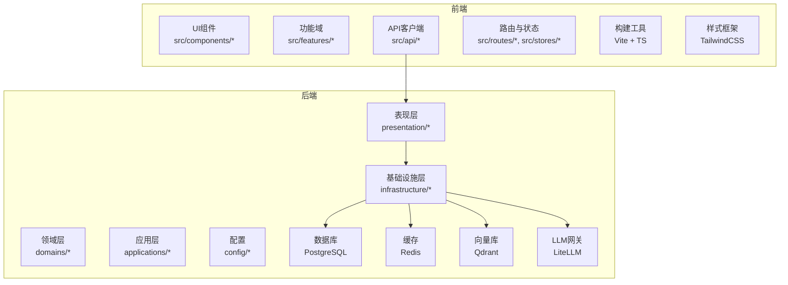
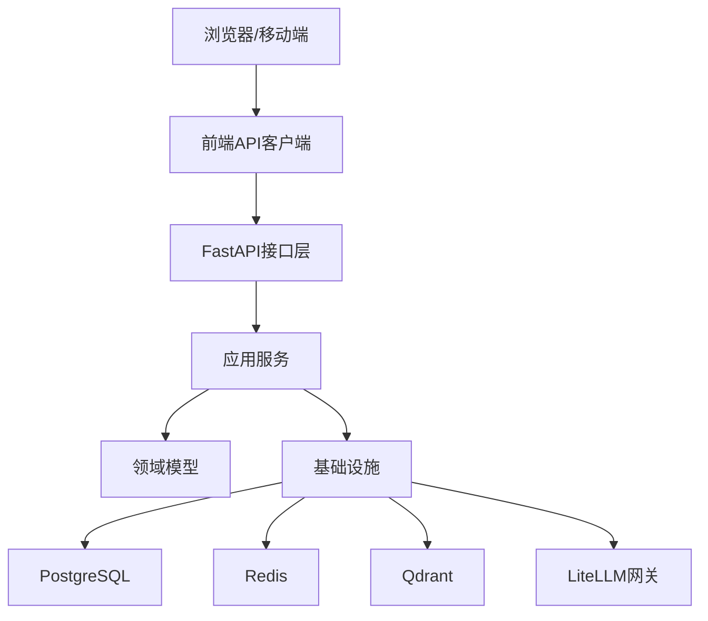
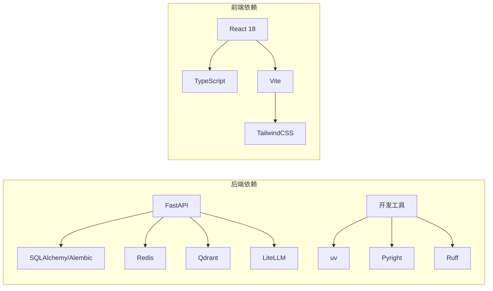

# 技术栈概览

<cite>
**本文档引用的文件**
- [pyproject.toml](file://backend/pyproject.toml)
- [Dockerfile](file://backend/Dockerfile)
- [litellm_models.yaml](file://backend/config/litellm_models.yaml)
- [app.toml](file://backend/config/app.toml)
- [package.json](file://frontend/package.json)
- [vite.config.ts](file://frontend/vite.config.ts)
- [tailwind.config.js](file://frontend/tailwind.config.js)
- [tsconfig.json](file://frontend/tsconfig.json)
- [docker-compose.yml](file://docker-compose.yml)
- [docker-compose.prod.yml](file://docker-compose.prod.yml)
- [Makefile](file://Makefile)
- [README.md](file://backend/README.md)
- [README.md](file://frontend/README.md)
</cite>

## 目录
1. [引言](#引言)
2. [项目结构](#项目结构)
3. [核心组件](#核心组件)
4. [架构总览](#架构总览)
5. [详细组件分析](#详细组件分析)
6. [依赖关系分析](#依赖关系分析)
7. [性能考虑](#性能考虑)
8. [故障排除指南](#故障排除指南)
9. [结论](#结论)
10. [附录](#附录)

## 引言
本技术栈概览面向AI Agent项目的开发者与架构师，系统梳理后端与前端技术栈、核心组件选择理由、技术优势以及在项目中的具体作用。后端采用FastAPI + Python 3.11+，结合PostgreSQL数据库、Redis缓存、Qdrant向量数据库与LiteLLM LLM网关；前端采用React 18 + TypeScript + Vite + TailwindCSS。同时介绍开发工具链（uv、Pyright、Ruff）与容器化部署方案（Docker）。文档旨在帮助团队统一技术认知、优化开发流程，并为后续扩展提供清晰的参考。

## 项目结构
项目采用前后端分离架构，后端以领域驱动设计（DDD）分层组织，前端以功能域模块化组织。整体通过Docker Compose进行本地与生产环境编排，支持多环境配置与快速部署。

图表来源
- [pyproject.toml](file://backend/pyproject.toml)
- [package.json](file://frontend/package.json)
- [docker-compose.yml](file://docker-compose.yml)

章节来源
- [docker-compose.yml](file://docker-compose.yml)
- [docker-compose.prod.yml](file://docker-compose.prod.yml)
- [Makefile](file://Makefile)

## 核心组件
- 后端框架与语言
  - FastAPI：高性能异步Web框架，提供自动生成OpenAPI文档、类型安全与极佳的开发体验。
  - Python 3.11+：现代语言特性与性能提升，配合uv进行依赖管理。
- 数据存储
  - PostgreSQL：企业级关系型数据库，支持复杂查询、事务与迁移工具Alembic。
  - Redis：高性能键值缓存与会话存储，支撑高并发访问。
  - Qdrant：向量相似度检索引擎，用于语义搜索与记忆检索。
- LLM网关
  - LiteLLM：统一LLM接入层，支持多供应商模型聚合、成本控制与路由策略。
- 前端技术栈
  - React 18：函数式组件与并发特性，提升渲染性能与开发效率。
  - TypeScript：静态类型系统，增强代码可维护性与IDE支持。
  - Vite：极速构建工具，提供热更新与现代化打包能力。
  - TailwindCSS：原子化样式框架，快速构建一致的UI风格。
- 开发工具链
  - uv：超快Python包安装器与虚拟环境管理。
  - Pyright：严格的类型检查工具，集成于CI/CD。
  - Ruff：超快Python代码规范与格式化工具。
- 容器化与部署
  - Docker：镜像构建与服务编排，确保开发与生产一致性。
  - Docker Compose：本地开发与多服务编排，支持多环境配置。

章节来源
- [pyproject.toml](file://backend/pyproject.toml)
- [package.json](file://frontend/package.json)
- [litellm_models.yaml](file://backend/config/litellm_models.yaml)
- [app.toml](file://backend/config/app.toml)

## 架构总览
后端通过FastAPI暴露REST与WebSocket接口，应用层协调领域逻辑，基础设施层负责数据持久化、缓存与外部服务集成。前端通过API客户端与后端交互，采用功能域模块化组织，构建工具链保证开发与发布质量。

图表来源
- [pyproject.toml](file://backend/pyproject.toml)
- [package.json](file://frontend/package.json)

## 详细组件分析

### 后端技术栈详解
- FastAPI
  - 作用：提供REST与WebSocket接口，自动文档生成，类型安全校验。
  - 设计理念：以类型注解驱动API定义，减少样板代码，提升开发效率。
- Python 3.11+
  - 作用：运行时与脚本执行，配合uv进行依赖管理与虚拟环境隔离。
  - 性能：更快的解释器启动与字节码优化，适合高并发服务。
- PostgreSQL
  - 作用：持久化用户、会话、网关配置与审计日志等结构化数据。
  - 迁移：使用Alembic进行版本化迁移，保障数据库演进一致性。
- Redis
  - 作用：会话存储、速率限制、短期缓存与消息队列。
  - 高可用：可结合哨兵或集群模式部署，满足高并发场景。
- Qdrant
  - 作用：向量化嵌入存储与相似度检索，支撑Agent记忆与上下文召回。
  - 场景：多模态向量检索、过滤与重排序。
- LiteLLM
  - 作用：统一LLM接入，支持多供应商路由、成本控制与配额管理。
  - 配置：通过YAML集中管理模型清单与路由策略。

章节来源
- [pyproject.toml](file://backend/pyproject.toml)
- [litellm_models.yaml](file://backend/config/litellm_models.yaml)
- [app.toml](file://backend/config/app.toml)

### 前端技术栈详解
- React 18
  - 作用：组件化UI构建，支持并发渲染与渐进式升级。
  - 特性：Suspense、自动批处理与更好的错误边界。
- TypeScript
  - 作用：静态类型约束，降低运行时错误，提升协作效率。
  - 集成：与Vite与ESLint配合，形成完整的类型检查流水线。
- Vite
  - 作用：快速冷启动与热更新，支持ESM与插件生态。
  - 优化：按需编译与Tree-shaking，缩短构建时间。
- TailwindCSS
  - 作用：原子化样式，快速构建一致的UI风格与主题体系。
  - 可维护性：通过配置文件集中管理颜色、字体与间距。

章节来源
- [package.json](file://frontend/package.json)
- [vite.config.ts](file://frontend/vite.config.ts)
- [tailwind.config.js](file://frontend/tailwind.config.js)
- [tsconfig.json](file://frontend/tsconfig.json)

### 开发工具链
- uv
  - 作用：替代pip与conda，提供超快安装与虚拟环境管理。
  - 优势：基于Rust实现，安装速度显著提升。
- Pyright
  - 作用：严格类型检查，发现潜在类型问题。
  - 集成：可在CI中作为必检步骤，保证类型安全。
- Ruff
  - 作用：代码规范与格式化，支持lint与fix一体化。
  - 优势：比传统工具快数倍，适合大型仓库。
- Docker
  - 作用：容器化后端与前端服务，确保环境一致性。
  - 编排：通过Compose定义服务依赖与网络拓扑。

章节来源
- [pyproject.toml](file://backend/pyproject.toml)
- [package.json](file://frontend/package.json)
- [docker-compose.yml](file://docker-compose.yml)

## 依赖关系分析
后端与前端分别维护独立的依赖清单，通过Docker Compose进行服务编排。后端依赖以FastAPI为核心，围绕数据库、缓存、向量与LLM网关构建；前端依赖以React与Vite为核心，围绕UI与构建工具链构建。

图表来源
- [pyproject.toml](file://backend/pyproject.toml)
- [package.json](file://frontend/package.json)

章节来源
- [pyproject.toml](file://backend/pyproject.toml)
- [package.json](file://frontend/package.json)

## 性能考虑
- 后端
  - 异步I/O：利用FastAPI异步特性提升并发处理能力。
  - 连接池：数据库与缓存连接池配置，避免频繁创建销毁。
  - 向量化查询：对Qdrant检索进行索引优化与过滤条件裁剪。
  - LLM路由：LiteLLM缓存与预热，减少重复调用延迟。
- 前端
  - 组件拆分：按功能域拆分组件，启用懒加载与Suspense。
  - 样式优化：Tailwind原子类减少CSS体积，按需引入组件样式。
  - 构建优化：Vite开启压缩与Tree-shaking，减少首屏加载时间。

## 故障排除指南
- 后端常见问题
  - 数据库连接失败：检查连接字符串与网络连通性，确认迁移脚本已执行。
  - Redis不可用：验证服务状态与认证配置，检查内存淘汰策略。
  - Qdrant检索异常：确认向量维度与索引参数，检查批量插入批次大小。
  - LiteLLM路由错误：核对模型清单与供应商密钥，查看请求日志定位失败节点。
- 前端常见问题
  - 构建失败：检查TypeScript配置与Vite插件兼容性，清理node_modules重新安装。
  - UI样式错乱：确认Tailwind配置与CSS优先级，排查原子类冲突。
  - 接口调用异常：检查API客户端基地址与鉴权头，查看网络面板与响应状态码。
- 容器化问题
  - 服务无法启动：查看容器日志，确认端口映射与环境变量。
  - 依赖安装缓慢：使用uv替代pip，或配置镜像源加速。

章节来源
- [docker-compose.yml](file://docker-compose.yml)
- [README.md](file://backend/README.md)
- [README.md](file://frontend/README.md)

## 结论
该技术栈以FastAPI与React 18为核心，结合PostgreSQL、Redis、Qdrant与LiteLLM，构建了高性能、可扩展且易于维护的AI Agent平台。uv、Pyright与Ruff提升了开发效率与代码质量，Docker与Compose保障了部署一致性。整体架构强调模块化与领域驱动设计，便于团队协作与长期演进。

## 附录
- 学习路径建议
  - 后端：从FastAPI官方教程入手，掌握异步路由与依赖注入；深入SQLAlchemy与Alembic迁移；理解LiteLLM路由与成本控制；学习Redis与Qdrant的典型用法。
  - 前端：从React 18文档开始，掌握Hooks与并发特性；学习TypeScript基础与高级类型；熟悉Vite生态与Tailwind原子化样式；实践组件化与功能域划分。
  - 工具链：掌握uv的安装与虚拟环境管理；配置Pyright与Ruff在IDE与CI中的集成；学习Docker与Compose的基本用法与最佳实践。
- 参考文档
  - 后端配置与模型清单：[litellm_models.yaml](file://backend/config/litellm_models.yaml)，[app.toml](file://backend/config/app.toml)
  - 前端构建与样式：[vite.config.ts](file://frontend/vite.config.ts)，[tailwind.config.js](file://frontend/tailwind.config.js)，[tsconfig.json](file://frontend/tsconfig.json)
  - 容器化与编排：[Dockerfile](file://backend/Dockerfile)，[docker-compose.yml](file://docker-compose.yml)，[docker-compose.prod.yml](file://docker-compose.prod.yml)