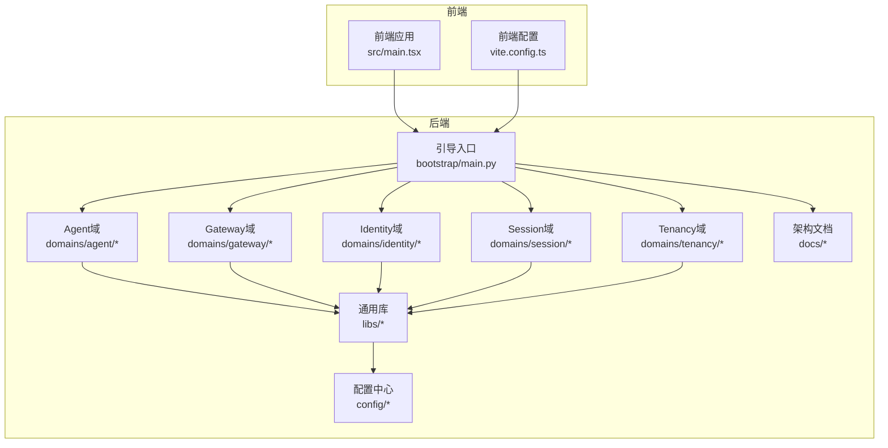
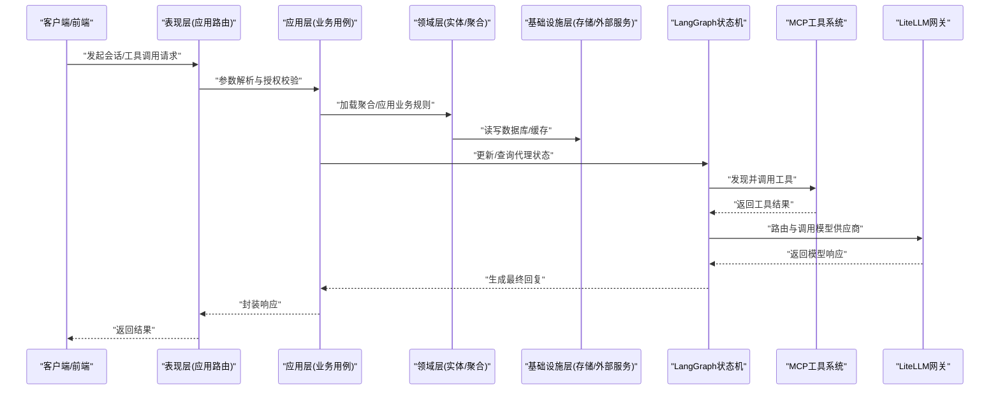
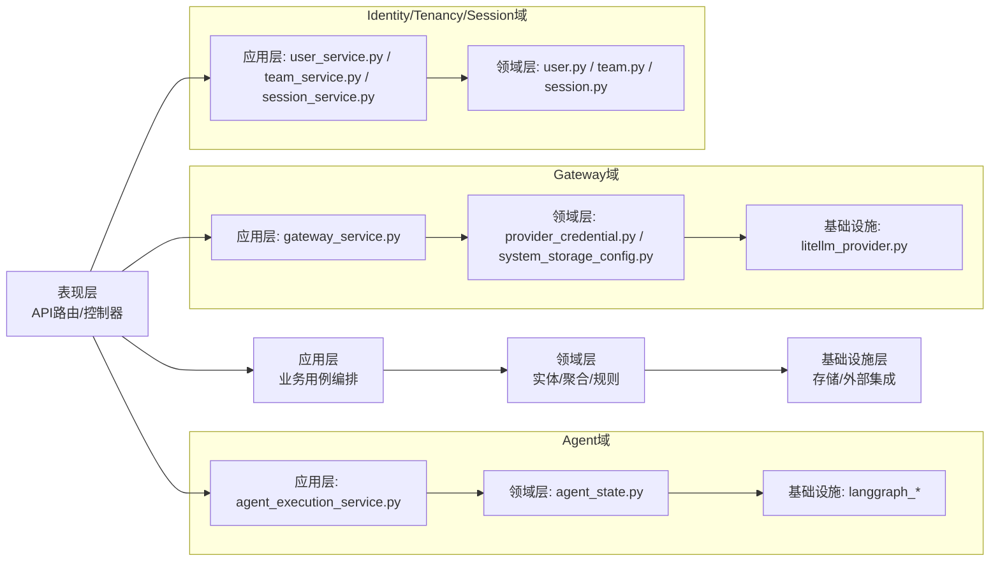
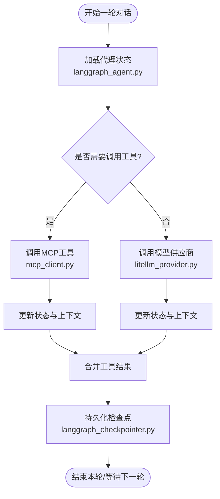
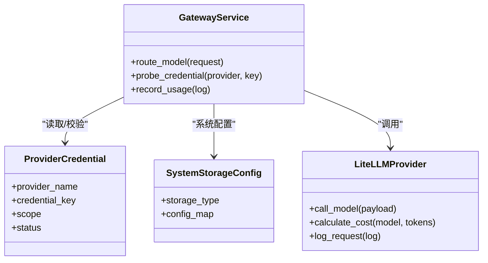
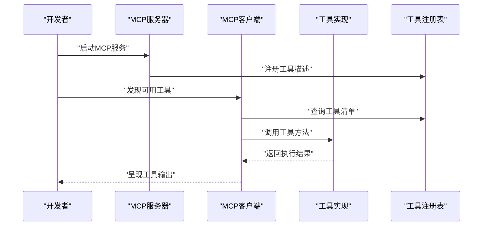
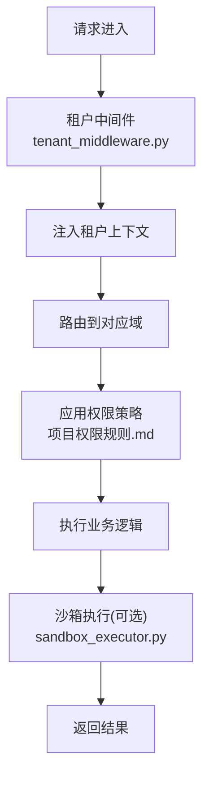
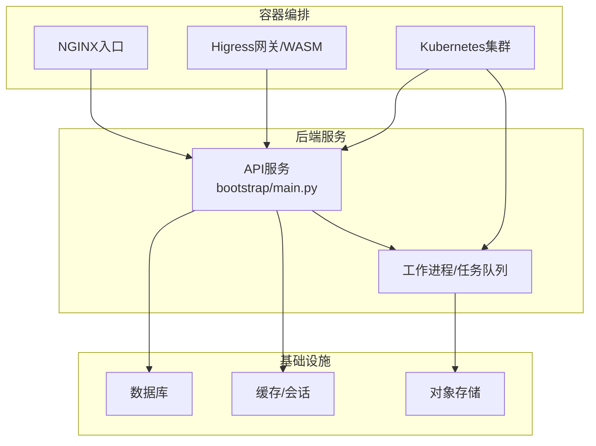
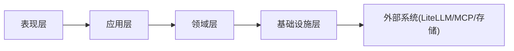

# 架构理念

<cite>
**本文引用的文件**
- [backend/docs/ARCHITECTURE.md](file://backend/docs/ARCHITECTURE.md)
- [backend/docs/AGENT_ARCHITECTURE_DESIGN.md](file://backend/docs/AGENT_ARCHITECTURE_DESIGN.md)
- [backend/docs/LANGGRAPH_ARCHITECTURE_RATIONALE.md](file://backend/docs/LANGGRAPH_ARCHITECTURE_RATIONALE.md)
- [backend/docs/AI_GATEWAY_DOMAIN_ARCHITECTURE.md](file://backend/docs/AI_GATEWAY_DOMAIN_ARCHITECTURE.md)
- [backend/docs/gateway/LLM_GATEWAY_ARCHITECTURE.md](file://backend/docs/gateway/LLM_GATEWAY_ARCHITECTURE.md)
- [backend/docs/mcp/MCP_QUICKSTART.md](file://backend/docs/mcp/MCP_QUICKSTART.md)
- [backend/docs/mcp/MCP_STATUS_SYSTEM.md](file://backend/docs/mcp/MCP_STATUS_SYSTEM.md)
- [backend/docs/项目权限规则.md](file://backend/docs/项目权限规则.md)
- [backend/docs/沙箱资源管理设计文档.md](file://backend/docs/沙箱资源管理设计文档.md)
- [backend/config/litellm_models.yaml](file://backend/config/litellm_models.yaml)
- [backend/config/mcp.toml](file://backend/config/mcp.toml)
- [backend/config/tools.toml](file://backend/config/tools.toml)
- [backend/domains/agent/application/services/agent_execution_service.py](file://backend/domains/agent/application/services/agent_execution_service.py)
- [backend/domains/agent/domain/models/agent_state.py](file://backend/domains/agent/domain/models/agent_state.py)
- [backend/domains/gateway/domain/models/provider_credential.py](file://backend/domains/gateway/domain/models/provider_credential.py)
- [backend/domains/gateway/domain/models/system_storage_config.py](file://backend/domains/gateway/domain/models/system_storage_config.py)
- [backend/domains/tenancy/domain/models/team.py](file://backend/domains/tenancy/domain/models/team.py)
- [backend/libs/middleware/tenant_middleware.py](file://backend/libs/middleware/tenant_middleware.py)
- [backend/libs/sandbox/sandbox_executor.py](file://backend/libs/sandbox/sandbox_executor.py)
- [backend/bootstrap/main.py](file://backend/bootstrap/main.py)
- [backend/bootstrap/composition/identity_services.py](file://backend/bootstrap/composition/identity_services.py)
- [backend/domains/identity/domain/models/user.py](file://backend/domains/identity/domain/models/user.py)
- [backend/domains/identity/application/services/user_service.py](file://backend/domains/identity/application/services/user_service.py)
- [backend/domains/tenancy/application/services/team_service.py](file://backend/domains/tenancy/application/services/team_service.py)
- [backend/domains/session/domain/models/session.py](file://backend/domains/session/domain/models/session.py)
- [backend/domains/session/application/services/session_service.py](file://backend/domains/session/application/services/session_service.py)
- [backend/domains/gateway/application/services/gateway_service.py](file://backend/domains/gateway/application/services/gateway_service.py)
- [backend/domains/gateway/infrastructure/providers/litellm_provider.py](file://backend/domains/gateway/infrastructure/providers/litellm_provider.py)
- [backend/libs/mcp/mcp_client.py](file://backend/libs/mcp/mcp_client.py)
- [backend/libs/mcp/mcp_server.py](file://backend/libs/mcp/mcp_server.py)
- [backend/libs/mcp/tool_registry.py](file://backend/libs/mcp/tool_registry.py)
- [backend/libs/llm/langgraph_agent.py](file://backend/libs/llm/langgraph_agent.py)
- [backend/libs/llm/langgraph_checkpointer.py](file://backend/libs/llm/langgraph_checkpointer.py)
- [backend/libs/llm/langgraph_memory.py](file://backend/libs/llm/langgraph_memory.py)
- [backend/scripts/run_server.py](file://backend/scripts/run_server.py)
- [backend/Dockerfile](file://backend/Dockerfile)
- [deploy/k8s/README.md](file://deploy/k8s/README.md)
- [deploy/nginx/README.md](file://deploy/nginx/README.md)
- [deploy/higress/README.md](file://deploy/higress/README.md)
- [backend/docker/sandbox/README.md](file://backend/docker/sandbox/README.md)
- [backend/docker/sandbox/Dockerfile](file://backend/docker/sandbox/Dockerfile)
- [backend/Makefile](file://backend/Makefile)
- [backend/pyproject.toml](file://backend/pyproject.toml)
- [frontend/src/main.tsx](file://frontend/src/main.tsx)
- [frontend/vite.config.ts](file://frontend/vite.config.ts)
- [docs/DEPLOYMENT.md](file://docs/DEPLOYMENT.md)
- [docs/开源项目定制开发选型分析.md](file://docs/开源项目定制开发选型分析.md)
- [docs/系统可测试性与TDD设计.md](file://docs/系统可测试性与TDD设计.md)
</cite>

## 目录
1. [引言](#引言)
2. [项目结构](#项目结构)
3. [核心组件](#核心组件)
4. [架构总览](#架构总览)
5. [详细组件分析](#详细组件分析)
6. [依赖关系分析](#依赖关系分析)
7. [性能考量](#性能考量)
8. [故障排查指南](#故障排查指南)
9. [结论](#结论)
10. [附录](#附录)

## 引言
本项目以领域驱动设计（DDD）为核心指导思想，采用分层架构（表现层、应用层、领域层、基础设施层），围绕“智能体（Agent）+ 模型网关（LiteLLM）+ 工具系统（MCP）+ 多租户权限与沙箱执行”的整体能力进行设计。通过LangGraph实现代理的状态化推理与记忆管理；通过LiteLLM统一抽象与路由多家大模型供应商；通过MCP协议化工具生态实现可发现、可编排、可扩展的工具系统；通过多租户域与中间件实现数据隔离与权限控制；通过容器化与Kubernetes部署策略保障可运维性与弹性伸缩。

## 项目结构
项目采用前后端分离与后端多域划分的组织方式：
- 后端：按领域划分模块（agent、gateway、identity、session、tenancy、evaluation等），每个域内再按四层结构组织代码，确保职责清晰、边界明确。
- 前端：基于TypeScript/Vite构建，提供网关配置、会话交互、工具管理等界面。
- 部署：提供Dockerfile与Kubernetes/NGINX/Higress多种部署方案，支持生产级高可用与灰度发布。

图示来源
- [backend/bootstrap/main.py:1-200](file://backend/bootstrap/main.py#L1-L200)
- [frontend/src/main.tsx:1-200](file://frontend/src/main.tsx#L1-L200)
- [frontend/vite.config.ts:1-200](file://frontend/vite.config.ts#L1-L200)

章节来源
- [backend/bootstrap/main.py:1-200](file://backend/bootstrap/main.py#L1-L200)
- [backend/Makefile:1-200](file://backend/Makefile#L1-L200)
- [docs/DEPLOYMENT.md:1-200](file://docs/DEPLOYMENT.md#L1-L200)

## 核心组件
- DDD四层架构
  - 表现层：负责HTTP接口、参数校验、响应封装，面向用户或前端调用。
  - 应用层：编排业务用例，协调领域对象与基础设施，保证业务流程正确性。
  - 领域层：承载核心业务规则与不变量，强调聚合、实体、值对象与领域服务。
  - 基础设施层：提供持久化、外部集成、工具实现等支撑能力。
- LangGraph代理状态管理：以状态机形式管理对话与推理过程，结合检查点与内存实现上下文延续。
- LiteLLM模型网关：统一模型抽象、路由与计费，支持多供应商、多密钥、配额与成本控制。
- MCP工具系统：基于Model Context Protocol实现工具的发现、注册、调用与版本化管理。
- 多租户权限与沙箱：通过租户域与中间件实现数据隔离，通过容器沙箱限制执行风险。

章节来源
- [backend/docs/ARCHITECTURE.md:1-200](file://backend/docs/ARCHITECTURE.md#L1-L200)
- [backend/docs/AGENT_ARCHITECTURE_DESIGN.md:1-200](file://backend/docs/AGENT_ARCHITECTURE_DESIGN.md#L1-L200)
- [backend/docs/LANGGRAPH_ARCHITECTURE_RATIONALE.md:1-200](file://backend/docs/LANGGRAPH_ARCHITECTURE_RATIONALE.md#L1-L200)
- [backend/docs/AI_GATEWAY_DOMAIN_ARCHITECTURE.md:1-200](file://backend/docs/AI_GATEWAY_DOMAIN_ARCHITECTURE.md#L1-L200)

## 架构总览
下图展示了从请求进入系统到完成推理与工具调用的整体流程，以及各层之间的交互关系。

图示来源
- [backend/domains/agent/application/services/agent_execution_service.py:1-200](file://backend/domains/agent/application/services/agent_execution_service.py#L1-L200)
- [backend/libs/llm/langgraph_agent.py:1-200](file://backend/libs/llm/langgraph_agent.py#L1-L200)
- [backend/libs/mcp/mcp_client.py:1-200](file://backend/libs/mcp/mcp_client.py#L1-L200)
- [backend/domains/gateway/application/services/gateway_service.py:1-200](file://backend/domains/gateway/application/services/gateway_service.py#L1-L200)

## 详细组件分析

### DDD四层架构与域划分
- 表现层：统一处理HTTP请求、鉴权、异常与响应格式，避免跨域逻辑渗透到应用层。
- 应用层：以用例为中心，编排领域对象与基础设施，保证业务流程稳定。
- 领域层：强调不变量与业务规则，如会话状态、租户边界、凭证安全等。
- 基础设施层：提供数据库访问、外部服务集成、工具与模型供应商适配器。

图示来源
- [backend/domains/agent/application/services/agent_execution_service.py:1-200](file://backend/domains/agent/application/services/agent_execution_service.py#L1-L200)
- [backend/domains/agent/domain/models/agent_state.py:1-200](file://backend/domains/agent/domain/models/agent_state.py#L1-L200)
- [backend/domains/gateway/application/services/gateway_service.py:1-200](file://backend/domains/gateway/application/services/gateway_service.py#L1-L200)
- [backend/domains/gateway/domain/models/provider_credential.py:1-200](file://backend/domains/gateway/domain/models/provider_credential.py#L1-L200)
- [backend/domains/gateway/domain/models/system_storage_config.py:1-200](file://backend/domains/gateway/domain/models/system_storage_config.py#L1-L200)
- [backend/domains/identity/application/services/user_service.py:1-200](file://backend/domains/identity/application/services/user_service.py#L1-L200)
- [backend/domains/tenancy/application/services/team_service.py:1-200](file://backend/domains/tenancy/application/services/team_service.py#L1-L200)
- [backend/domains/session/application/services/session_service.py:1-200](file://backend/domains/session/application/services/session_service.py#L1-L200)
- [backend/domains/identity/domain/models/user.py:1-200](file://backend/domains/identity/domain/models/user.py#L1-L200)
- [backend/domains/tenancy/domain/models/team.py:1-200](file://backend/domains/tenancy/domain/models/team.py#L1-L200)
- [backend/domains/session/domain/models/session.py:1-200](file://backend/domains/session/domain/models/session.py#L1-L200)

章节来源
- [backend/docs/ARCHITECTURE.md:1-200](file://backend/docs/ARCHITECTURE.md#L1-L200)
- [backend/bootstrap/composition/identity_services.py:1-200](file://backend/bootstrap/composition/identity_services.py#L1-L200)

### LangGraph代理状态管理
- 设计思想：将智能体的推理过程建模为状态机，通过状态节点与边表达对话与计划的演进；借助检查点与内存实现跨轮次的上下文延续。
- 优势：可回溯、可观测、可调试；便于集成工具调用与条件分支；支持多模态与复杂规划场景。
- 实现要点：状态定义、检查点持久化、内存管理、工具调用钩子、错误恢复与重试。

图示来源
- [backend/libs/llm/langgraph_agent.py:1-200](file://backend/libs/llm/langgraph_agent.py#L1-L200)
- [backend/libs/mcp/mcp_client.py:1-200](file://backend/libs/mcp/mcp_client.py#L1-L200)
- [backend/domains/gateway/infrastructure/providers/litellm_provider.py:1-200](file://backend/domains/gateway/infrastructure/providers/litellm_provider.py#L1-L200)
- [backend/libs/llm/langgraph_checkpointer.py:1-200](file://backend/libs/llm/langgraph_checkpointer.py#L1-L200)

章节来源
- [backend/docs/LANGGRAPH_ARCHITECTURE_RATIONALE.md:1-200](file://backend/docs/LANGGRAPH_ARCHITECTURE_RATIONALE.md#L1-L200)
- [backend/libs/llm/langgraph_agent.py:1-200](file://backend/libs/llm/langgraph_agent.py#L1-L200)
- [backend/libs/llm/langgraph_checkpointer.py:1-200](file://backend/libs/llm/langgraph_checkpointer.py#L1-L200)
- [backend/libs/llm/langgraph_memory.py:1-200](file://backend/libs/llm/langgraph_memory.py#L1-L200)

### LiteLLM模型网关
- 设计理念：统一抽象多家模型供应商，提供路由、负载均衡、成本计算、配额与限流、密钥管理与审计日志。
- 技术实现：通过配置文件定义模型清单与供应商映射；在应用层根据上下文选择最优路由；在基础设施层对接具体供应商SDK；记录请求日志与用量统计。
- 关键能力：动态模型选择、成本归集、供应商健康探测、降级与熔断。

图示来源
- [backend/domains/gateway/application/services/gateway_service.py:1-200](file://backend/domains/gateway/application/services/gateway_service.py#L1-L200)
- [backend/domains/gateway/domain/models/provider_credential.py:1-200](file://backend/domains/gateway/domain/models/provider_credential.py#L1-L200)
- [backend/domains/gateway/domain/models/system_storage_config.py:1-200](file://backend/domains/gateway/domain/models/system_storage_config.py#L1-L200)
- [backend/domains/gateway/infrastructure/providers/litellm_provider.py:1-200](file://backend/domains/gateway/infrastructure/providers/litellm_provider.py#L1-L200)

章节来源
- [backend/docs/AI_GATEWAY_DOMAIN_ARCHITECTURE.md:1-200](file://backend/docs/AI_GATEWAY_DOMAIN_ARCHITECTURE.md#L1-L200)
- [backend/docs/gateway/LLM_GATEWAY_ARCHITECTURE.md:1-200](file://backend/docs/gateway/LLM_GATEWAY_ARCHITECTURE.md#L1-L200)
- [backend/config/litellm_models.yaml:1-200](file://backend/config/litellm_models.yaml#L1-L200)

### MCP（Model Context Protocol）工具系统
- 架构设计：通过MCP服务器与客户端实现工具的发现、注册、调用与生命周期管理；工具以插件形式接入，支持动态加载与版本化。
- 扩展机制：工具注册表统一管理工具元数据与调用协议；前端与后端通过MCP协议进行编排；支持工具状态监控与健康检查。
- 快速上手：提供快速启动与自动初始化文档，便于开发者快速集成自定义工具。

图示来源
- [backend/libs/mcp/mcp_server.py:1-200](file://backend/libs/mcp/mcp_server.py#L1-L200)
- [backend/libs/mcp/mcp_client.py:1-200](file://backend/libs/mcp/mcp_client.py#L1-L200)
- [backend/libs/mcp/tool_registry.py:1-200](file://backend/libs/mcp/tool_registry.py#L1-L200)
- [backend/docs/mcp/MCP_QUICKSTART.md:1-200](file://backend/docs/mcp/MCP_QUICKSTART.md#L1-L200)
- [backend/docs/mcp/MCP_STATUS_SYSTEM.md:1-200](file://backend/docs/mcp/MCP_STATUS_SYSTEM.md#L1-L200)

章节来源
- [backend/config/mcp.toml:1-200](file://backend/config/mcp.toml#L1-L200)
- [backend/config/tools.toml:1-200](file://backend/config/tools.toml#L1-L200)
- [backend/docs/mcp/MCP_QUICKSTART.md:1-200](file://backend/docs/mcp/MCP_QUICKSTART.md#L1-L200)
- [backend/docs/mcp/MCP_STATUS_SYSTEM.md:1-200](file://backend/docs/mcp/MCP_STATUS_SYSTEM.md#L1-L200)

### 多租户权限管理与沙箱执行
- 多租户架构：通过租户域与中间件实现数据隔离与权限边界；每个租户拥有独立的团队、会话与资源范围；应用层在关键操作前注入租户上下文。
- 权限规则：基于角色与资源的访问控制，结合平台管理员与租户管理员的分级权限体系。
- 沙箱执行：容器化沙箱用于隔离工具执行环境，限制资源使用与网络访问，防止恶意脚本对宿主系统造成影响。

图示来源
- [backend/libs/middleware/tenant_middleware.py:1-200](file://backend/libs/middleware/tenant_middleware.py#L1-L200)
- [backend/domains/tenancy/domain/models/team.py:1-200](file://backend/domains/tenancy/domain/models/team.py#L1-L200)
- [backend/domains/tenancy/application/services/team_service.py:1-200](file://backend/domains/tenancy/application/services/team_service.py#L1-L200)
- [backend/docs/项目权限规则.md:1-200](file://backend/docs/项目权限规则.md#L1-L200)
- [backend/docs/沙箱资源管理设计文档.md:1-200](file://backend/docs/沙箱资源管理设计文档.md#L1-L200)
- [backend/libs/sandbox/sandbox_executor.py:1-200](file://backend/libs/sandbox/sandbox_executor.py#L1-L200)

章节来源
- [backend/docs/项目权限规则.md:1-200](file://backend/docs/项目权限规则.md#L1-L200)
- [backend/docs/沙箱资源管理设计文档.md:1-200](file://backend/docs/沙箱资源管理设计文档.md#L1-L200)
- [backend/libs/middleware/tenant_middleware.py:1-200](file://backend/libs/middleware/tenant_middleware.py#L1-L200)
- [backend/libs/sandbox/sandbox_executor.py:1-200](file://backend/libs/sandbox/sandbox_executor.py#L1-L200)

### 微服务架构与容器化部署
- 微服务模式：后端按域拆分服务，每个域具备独立的应用、领域与基础设施层，便于独立演进与团队自治。
- 容器化策略：提供基础镜像与沙箱镜像，支持Docker Compose与Kubernetes部署；通过Higress/Nginx实现流量治理与安全防护。
- 部署参考：包含本地开发、容器化开发与生产部署的配置与脚本，覆盖环境变量、网络策略与资源限制。

图示来源
- [backend/bootstrap/main.py:1-200](file://backend/bootstrap/main.py#L1-L200)
- [backend/Dockerfile:1-200](file://backend/Dockerfile#L1-L200)
- [deploy/k8s/README.md:1-200](file://deploy/k8s/README.md#L1-L200)
- [deploy/nginx/README.md:1-200](file://deploy/nginx/README.md#L1-L200)
- [deploy/higress/README.md:1-200](file://deploy/higress/README.md#L1-L200)
- [backend/docker/sandbox/README.md:1-200](file://backend/docker/sandbox/README.md#L1-L200)
- [backend/docker/sandbox/Dockerfile:1-200](file://backend/docker/sandbox/Dockerfile#L1-L200)

章节来源
- [docs/DEPLOYMENT.md:1-200](file://docs/DEPLOYMENT.md#L1-L200)
- [backend/Makefile:1-200](file://backend/Makefile#L1-L200)
- [backend/pyproject.toml:1-200](file://backend/pyproject.toml#L1-L200)

## 依赖关系分析
- 组件耦合：表现层仅依赖应用层；应用层依赖领域层；领域层尽量不直接依赖基础设施；基础设施通过接口与抽象与领域解耦。
- 外部依赖：模型供应商SDK、数据库ORM、消息队列、对象存储等；通过配置与适配器降低耦合。
- 可观测性：日志、指标、追踪贯穿四层；网关与工具均提供审计与用量统计。

图示来源
- [backend/docs/ARCHITECTURE.md:1-200](file://backend/docs/ARCHITECTURE.md#L1-L200)
- [backend/bootstrap/main.py:1-200](file://backend/bootstrap/main.py#L1-L200)

章节来源
- [backend/docs/ARCHITECTURE.md:1-200](file://backend/docs/ARCHITECTURE.md#L1-L200)

## 性能考量
- 状态与检查点：LangGraph状态持久化与增量更新减少重复计算，配合内存缓存提升响应速度。
- 网关路由：LiteLLM提供供应商健康探测与失败重试，避免单点故障；按模型与成本策略路由，平衡延迟与质量。
- 工具调用：MCP工具异步化与并发控制，避免阻塞主线程；工具结果缓存与去重。
- 数据访问：领域层尽量批量读写，应用层合并事务，基础设施层使用连接池与索引优化。
- 部署弹性：Kubernetes水平/垂直伸缩、Pod预热、缓存命中率与冷启动优化。

## 故障排查指南
- 请求无响应
  - 检查网关路由与供应商可用性；查看请求日志与用量统计。
  - 参考：[gateway/LLM_GATEWAY_ARCHITECTURE.md:1-200](file://backend/docs/gateway/LLM_GATEWAY_ARCHITECTURE.md#L1-L200)
- 工具调用失败
  - 确认MCP服务器状态与工具注册信息；检查工具健康检查与超时设置。
  - 参考：[mcp/MCP_STATUS_SYSTEM.md:1-200](file://backend/docs/mcp/MCP_STATUS_SYSTEM.md#L1-L200)
- 权限拒绝
  - 核对租户上下文与角色权限；确认中间件是否正确注入租户ID。
  - 参考：[项目权限规则.md:1-200](file://backend/docs/项目权限规则.md#L1-L200)
- 沙箱执行异常
  - 查看沙箱容器日志与资源限制；确认网络与卷挂载配置。
  - 参考：[沙箱资源管理设计文档.md:1-200](file://backend/docs/沙箱资源管理设计文档.md#L1-L200)

章节来源
- [backend/docs/gateway/LLM_GATEWAY_ARCHITECTURE.md:1-200](file://backend/docs/gateway/LLM_GATEWAY_ARCHITECTURE.md#L1-L200)
- [backend/docs/mcp/MCP_STATUS_SYSTEM.md:1-200](file://backend/docs/mcp/MCP_STATUS_SYSTEM.md#L1-L200)
- [backend/docs/项目权限规则.md:1-200](file://backend/docs/项目权限规则.md#L1-L200)
- [backend/docs/沙箱资源管理设计文档.md:1-200](file://backend/docs/沙箱资源管理设计文档.md#L1-L200)

## 结论
本项目以DDD为核心，通过四层架构实现清晰的职责分离与稳定的业务演进；LangGraph赋予智能体状态化推理与记忆能力；LiteLLM提供统一的模型路由与成本控制；MCP工具系统实现可发现、可编排的工具生态；多租户与沙箱保障了安全性与隔离性；微服务与容器化部署提升了可运维性与弹性。该架构在复杂AI Agent场景中实现了技术深度与工程可维护性的平衡。

## 附录
- 开发与测试：提供单元测试、集成测试与端到端测试的组织方式与最佳实践。
- 参考文档：架构设计、开发规范、部署手册与问题排查指南。

章节来源
- [docs/开源项目定制开发选型分析.md:1-200](file://docs/开源项目定制开发选型分析.md#L1-L200)
- [docs/系统可测试性与TDD设计.md:1-200](file://docs/系统可测试性与TDD设计.md#L1-L200)