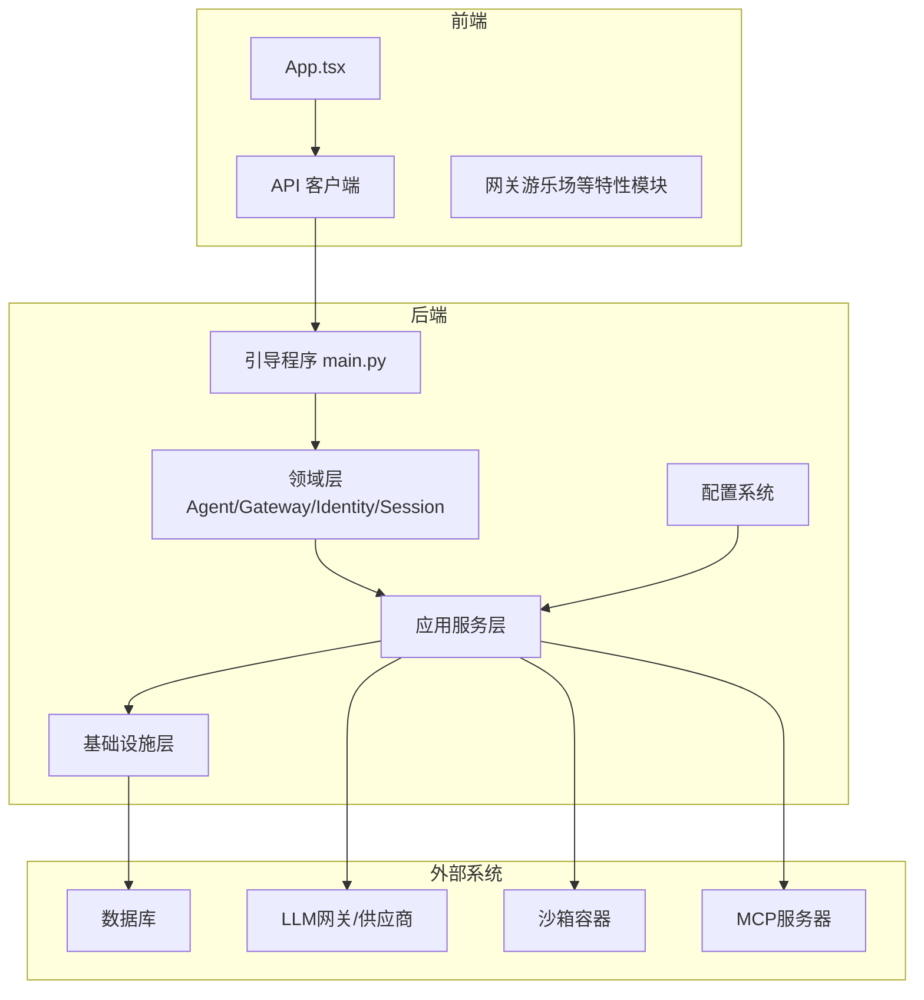
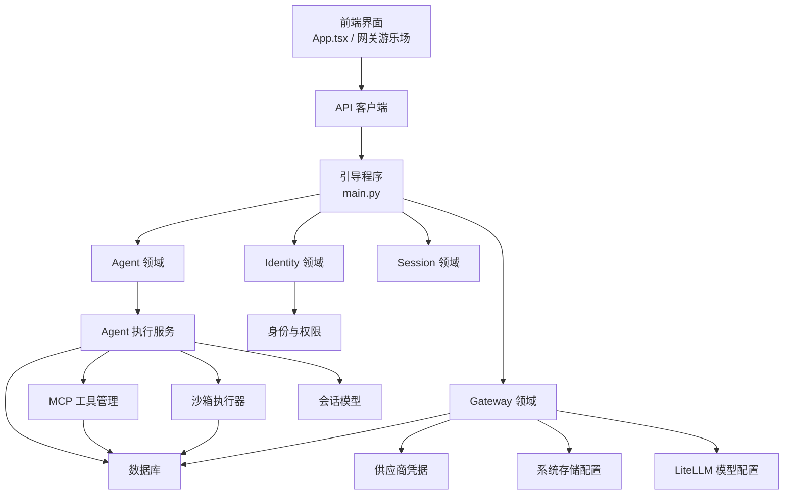
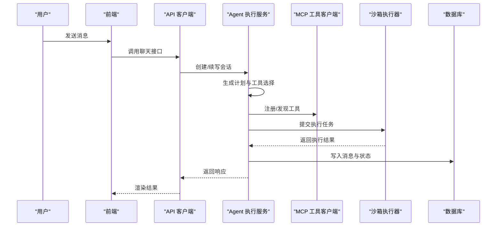
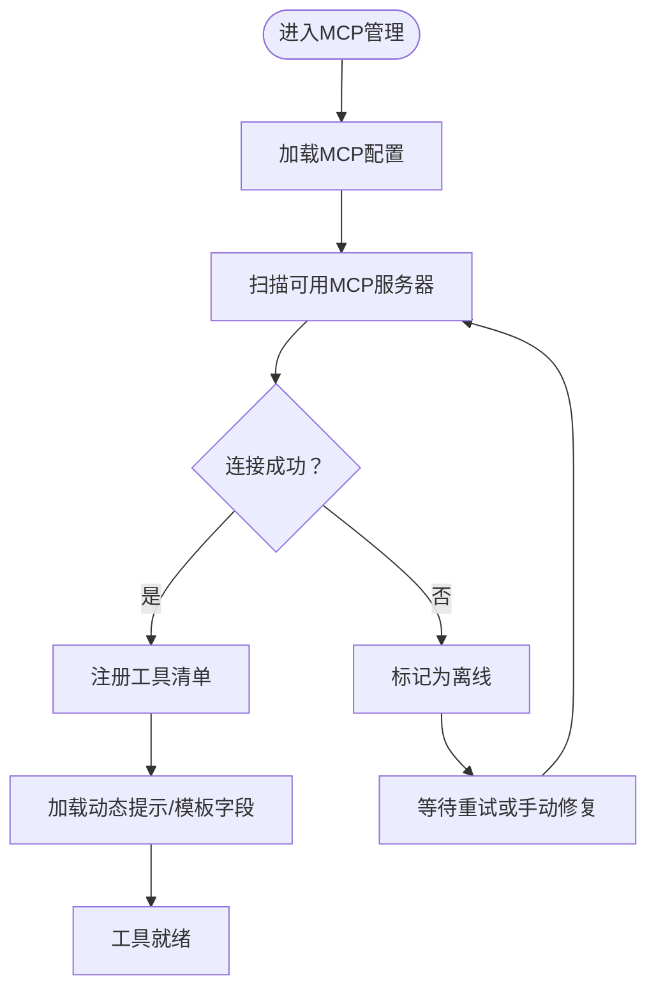
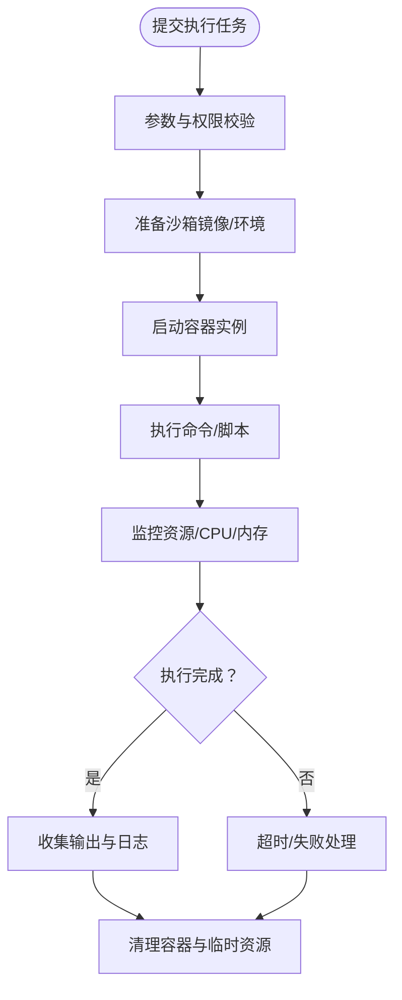
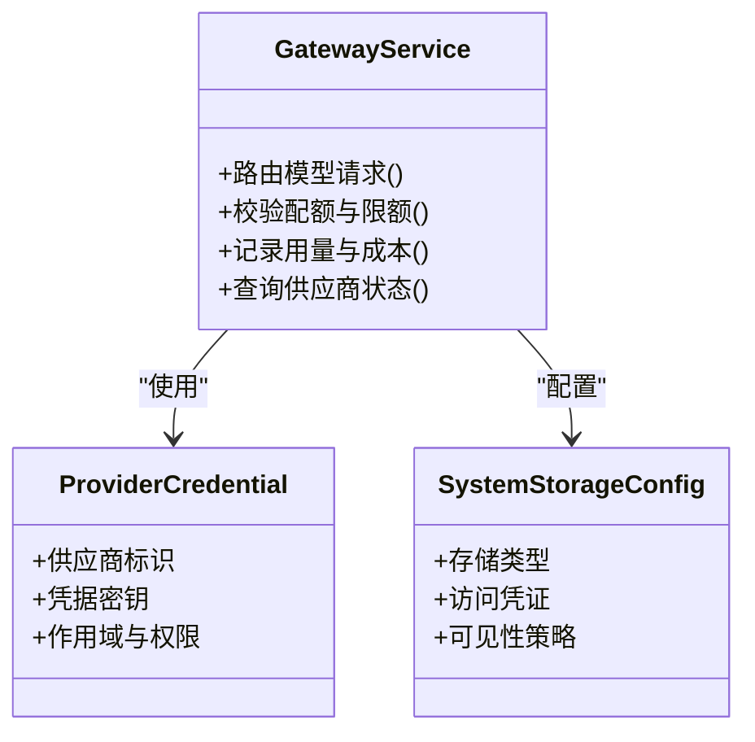
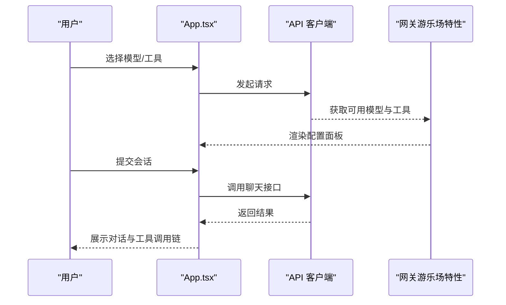
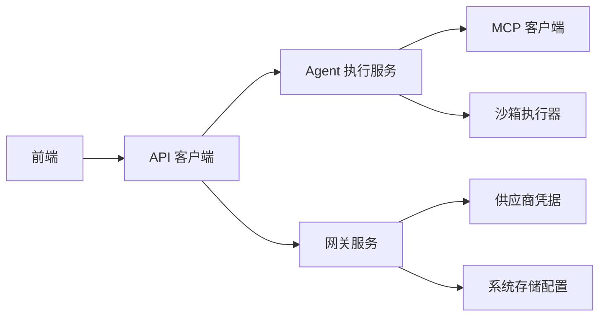

# 项目介绍

<cite>
**本文引用的文件**
- [README.md](file://README.md)
- [backend/README.md](file://backend/README.md)
- [AGENTS.md](file://AGENTS.md)
- [CLAUDE.md](file://CLAUDE.md)
- [backend/docs/ARCHITECTURE.md](file://backend/docs/ARCHITECTURE.md)
- [backend/docs/AGENT_ARCHITECTURE_DESIGN.md](file://backend/docs/AGENT_ARCHITECTURE_DESIGN.md)
- [backend/docs/AI_GATEWAY_DOMAIN_ARCHITECTURE.md](file://backend/docs/AI_GATEWAY_DOMAIN_ARCHITECTURE.md)
- [backend/docs/mcp/MCP_QUICKSTART.md](file://backend/docs/mcp/MCP_QUICKSTART.md)
- [backend/docs/mcp/MCP_STATUS_SYSTEM.md](file://backend/docs/mcp/MCP_STATUS_SYSTEM.md)
- [backend/docs/沙箱资源管理设计文档.md](file://backend/docs/沙箱资源管理设计文档.md)
- [backend/docker/sandbox/README.md](file://backend/docker/sandbox/README.md)
- [backend/config/app.toml](file://backend/config/app.toml)
- [backend/config/mcp.toml](file://backend/config/mcp.toml)
- [backend/config/execution.toml](file://backend/config/execution.toml)
- [backend/config/litellm_models.yaml](file://backend/config/litellm_models.yaml)
- [backend/config/tools.toml](file://backend/config/tools.toml)
- [backend/domains/gateway/application/services/gateway_service.py](file://backend/domains/gateway/application/services/gateway_service.py)
- [backend/domains/agent/application/services/agent_execution_service.py](file://backend/domains/agent/application/services/agent_execution_service.py)
- [backend/libs/mcp/client/mcp_client.py](file://backend/libs/mcp/client/mcp_client.py)
- [backend/libs/mcp/models/mcp_tool.py](file://backend/libs/mcp/models/mcp_tool.py)
- [backend/libs/mcp/models/mcp_server.py](file://backend/libs/mcp/models/mcp_server.py)
- [backend/domains/session/domain/models/session.py](file://backend/domains/session/domain/models/session.py)
- [backend/domains/agent/domain/models/agent.py](file://backend/domains/agent/domain/models/agent.py)
- [backend/domains/gateway/domain/models/provider_credential.py](file://backend/domains/gateway/domain/models/provider_credential.py)
- [backend/domains/gateway/domain/models/system_storage_config.py](file://backend/domains/gateway/domain/models/system_storage_config.py)
- [backend/bootstrap/main.py](file://backend/bootstrap/main.py)
- [backend/scripts/run_dev_server.py](file://backend/scripts/run_dev_server.py)
- [frontend/src/App.tsx](file://frontend/src/App.tsx)
- [frontend/src/api/client.ts](file://frontend/src/api/client.ts)
- [frontend/src/features/gateway-playground](file://frontend/src/features/gateway-playground)
- [deploy/backend.env.production](file://deploy/backend.env.production)
- [deploy/deploy.sh](file://deploy/deploy.sh)
- [deploy/k8s](file://deploy/k8s)
- [deploy/nginx](file://deploy/nginx)
- [docs/README.md](file://docs/README.md)
- [docs/AI-Agent开发需求文档.md](file://docs/AI-Agent开发需求文档.md)
- [docs/DEPLOYMENT.md](file://docs/DEPLOYMENT.md)
- [docs/SSO.md](file://docs/SSO.md)
- [docs/系统可测试性与TDD设计.md](file://docs/系统可测试性与TDD设计.md)
</cite>

## 目录
1. [引言](#引言)
2. [项目结构](#项目结构)
3. [核心组件](#核心组件)
4. [架构总览](#架构总览)
5. [详细组件分析](#详细组件分析)
6. [依赖关系分析](#依赖关系分析)
7. [性能考虑](#性能考虑)
8. [故障排查指南](#故障排查指南)
9. [结论](#结论)
10. [附录](#附录)

## 引言
本项目旨在构建一个面向企业与开发者的一体化AI Agent平台，通过多模态大模型集成、智能代理执行、MCP工具管理与安全沙箱执行环境，实现从“认知—决策—行动”的完整闭环。平台强调可扩展、可观测、可治理与可审计，支持多租户、多供应商网关与动态工具注册，覆盖对话式助手、自动化任务编排、跨域工具调用与视频生成等典型场景。

平台定位与价值：
- 面向开发者：提供统一Agent框架、工具生态与执行沙箱，降低多模态应用落地门槛。
- 面向企业：提供安全可控的执行边界、成本与用量监控、权限与审计体系。
- 面向研究者：提供可复现的评测基准与实验环境，支撑Agent评测与优化。

## 项目结构
项目采用前后端分离与领域驱动设计（DDD）相结合的组织方式：
- 后端（Python/FastAPI）：包含Agent域、Gateway域、Identity域、Session域等，分层清晰，职责明确。
- 前端（TypeScript/Vite）：提供网关配置、工具管理、会话交互等用户界面。
- 配置与部署：通过多环境配置文件与Kubernetes/Nginx部署脚本，支持本地开发与生产部署。
- 文档与规范：涵盖架构设计、MCP集成、沙箱管理、部署与SSO等主题文档。

图表来源
- [backend/bootstrap/main.py:1-200](file://backend/bootstrap/main.py#L1-L200)
- [frontend/src/App.tsx:1-100](file://frontend/src/App.tsx#L1-L100)
- [backend/config/app.toml:1-200](file://backend/config/app.toml#L1-L200)

章节来源
- [backend/README.md:1-200](file://backend/README.md#L1-L200)
- [docs/README.md:1-200](file://docs/README.md#L1-L200)

## 核心组件
- 多模态大模型网关：统一接入多家供应商模型，提供路由、限流、计费与可观测性。
- 智能代理执行引擎：基于LangGraph与会话上下文，实现计划-执行-反馈循环。
- MCP工具管理：标准化工具发现、注册、调用与状态跟踪，支持动态提示与模板字段。
- 沙箱执行环境：隔离的Docker容器执行器，保障工具调用的安全性与可审计性。
- 权限与租户：多租户数据域、身份桥接与平台级权限控制，支持SSO集成。

章节来源
- [backend/docs/AI_GATEWAY_DOMAIN_ARCHITECTURE.md:1-200](file://backend/docs/AI_GATEWAY_DOMAIN_ARCHITECTURE.md#L1-L200)
- [backend/docs/AGENT_ARCHITECTURE_DESIGN.md:1-200](file://backend/docs/AGENT_ARCHITECTURE_DESIGN.md#L1-L200)
- [backend/docs/mcp/MCP_QUICKSTART.md:1-200](file://backend/docs/mcp/MCP_QUICKSTART.md#L1-L200)
- [backend/docs/沙箱资源管理设计文档.md:1-200](file://backend/docs/沙箱资源管理设计文档.md#L1-L200)

## 架构总览
整体架构由“前端界面—后端服务—外部系统”三层构成，后端内部按领域划分，应用服务协调各子域完成业务流程。

图表来源
- [backend/bootstrap/main.py:1-200](file://backend/bootstrap/main.py#L1-L200)
- [backend/domains/agent/application/services/agent_execution_service.py:1-200](file://backend/domains/agent/application/services/agent_execution_service.py#L1-L200)
- [backend/libs/mcp/client/mcp_client.py:1-200](file://backend/libs/mcp/client/mcp_client.py#L1-L200)
- [backend/domains/gateway/domain/models/provider_credential.py:1-200](file://backend/domains/gateway/domain/models/provider_credential.py#L1-L200)
- [backend/domains/gateway/domain/models/system_storage_config.py:1-200](file://backend/domains/gateway/domain/models/system_storage_config.py#L1-L200)
- [backend/domains/session/domain/models/session.py:1-200](file://backend/domains/session/domain/models/session.py#L1-L200)

## 详细组件分析

### 组件A：Agent执行与会话管理
- 职责：根据用户输入与历史上下文，生成计划并执行工具调用；维护会话状态与记忆。
- 关键流程：接收消息→上下文整理→计划生成→工具选择→执行→结果回传→状态更新。
- 数据模型：Agent模型、Session模型、消息记录、执行配置。

图表来源
- [backend/domains/agent/application/services/agent_execution_service.py:1-200](file://backend/domains/agent/application/services/agent_execution_service.py#L1-L200)
- [backend/libs/mcp/client/mcp_client.py:1-200](file://backend/libs/mcp/client/mcp_client.py#L1-L200)
- [backend/domains/session/domain/models/session.py:1-200](file://backend/domains/session/domain/models/session.py#L1-L200)

章节来源
- [backend/docs/AGENT_ARCHITECTURE_DESIGN.md:1-200](file://backend/docs/AGENT_ARCHITECTURE_DESIGN.md#L1-L200)
- [backend/domains/agent/domain/models/agent.py:1-200](file://backend/domains/agent/domain/models/agent.py#L1-L200)
- [backend/domains/session/domain/models/session.py:1-200](file://backend/domains/session/domain/models/session.py#L1-L200)

### 组件B：MCP工具管理
- 职责：统一管理MCP服务器、工具清单、连接状态与动态提示/模板字段。
- 能力：工具发现、连接健康检查、工具元数据管理、动态提示注入、模板字段校验。
- 配置：mcp.toml定义服务器列表与默认行为；运行时可动态更新。

图表来源
- [backend/config/mcp.toml:1-200](file://backend/config/mcp.toml#L1-L200)
- [backend/libs/mcp/models/mcp_server.py:1-200](file://backend/libs/mcp/models/mcp_server.py#L1-L200)
- [backend/libs/mcp/models/mcp_tool.py:1-200](file://backend/libs/mcp/models/mcp_tool.py#L1-L200)
- [backend/docs/mcp/MCP_STATUS_SYSTEM.md:1-200](file://backend/docs/mcp/MCP_STATUS_SYSTEM.md#L1-L200)

章节来源
- [backend/docs/mcp/MCP_QUICKSTART.md:1-200](file://backend/docs/mcp/MCP_QUICKSTART.md#L1-L200)
- [backend/libs/mcp/client/mcp_client.py:1-200](file://backend/libs/mcp/client/mcp_client.py#L1-L200)

### 组件C：沙箱执行环境
- 职责：为工具调用提供隔离、可审计的执行环境，限制资源与网络访问。
- 能力：容器生命周期管理、任务提交与回收、日志采集与归档、配额与超时控制。
- 设计：独立镜像构建与发布脚本，支持清理过期容器与异常恢复。

图表来源
- [backend/docs/沙箱资源管理设计文档.md:1-200](file://backend/docs/沙箱资源管理设计文档.md#L1-L200)
- [backend/docker/sandbox/README.md:1-200](file://backend/docker/sandbox/README.md#L1-L200)

章节来源
- [backend/docs/沙箱资源管理设计文档.md:1-200](file://backend/docs/沙箱资源管理设计文档.md#L1-L200)
- [backend/docker/sandbox/README.md:1-200](file://backend/docker/sandbox/README.md#L1-L200)

### 组件D：网关与多模态模型接入
- 职责：统一路由与调度多家供应商模型，提供计费、限额与可观测性。
- 能力：模型目录管理、供应商凭据存储、请求转发与回写、成本统计。
- 配置：app.toml定义全局行为；litellm_models.yaml定义模型能力矩阵。

图表来源
- [backend/domains/gateway/application/services/gateway_service.py:1-200](file://backend/domains/gateway/application/services/gateway_service.py#L1-L200)
- [backend/domains/gateway/domain/models/provider_credential.py:1-200](file://backend/domains/gateway/domain/models/provider_credential.py#L1-L200)
- [backend/domains/gateway/domain/models/system_storage_config.py:1-200](file://backend/domains/gateway/domain/models/system_storage_config.py#L1-L200)

章节来源
- [backend/docs/AI_GATEWAY_DOMAIN_ARCHITECTURE.md:1-200](file://backend/docs/AI_GATEWAY_DOMAIN_ARCHITECTURE.md#L1-L200)
- [backend/config/app.toml:1-200](file://backend/config/app.toml#L1-L200)
- [backend/config/litellm_models.yaml:1-200](file://backend/config/litellm_models.yaml#L1-L200)

### 组件E：前端交互与网关游乐场
- 职责：提供可视化界面，支持模型选择、工具调试、会话历史查看与网关配置。
- 能力：实时聊天、工具面板、网关参数配置、分页与排序、错误提示。

图表来源
- [frontend/src/App.tsx:1-100](file://frontend/src/App.tsx#L1-L100)
- [frontend/src/api/client.ts:1-200](file://frontend/src/api/client.ts#L1-L200)
- [frontend/src/features/gateway-playground:1-200](file://frontend/src/features/gateway-playground#L1-L200)

章节来源
- [frontend/src/App.tsx:1-100](file://frontend/src/App.tsx#L1-L100)
- [frontend/src/api/client.ts:1-200](file://frontend/src/api/client.ts#L1-L200)

## 依赖关系分析
- 组件耦合：Agent执行服务依赖MCP工具客户端与沙箱执行器；网关服务依赖供应商凭据与存储配置；前端通过API客户端与后端解耦。
- 外部依赖：数据库、LiteLLM模型目录、MCP服务器、Docker运行时。
- 可能的环路：领域间通过应用服务协调，避免直接循环依赖。

图表来源
- [backend/domains/agent/application/services/agent_execution_service.py:1-200](file://backend/domains/agent/application/services/agent_execution_service.py#L1-L200)
- [backend/libs/mcp/client/mcp_client.py:1-200](file://backend/libs/mcp/client/mcp_client.py#L1-L200)
- [backend/domains/gateway/application/services/gateway_service.py:1-200](file://backend/domains/gateway/application/services/gateway_service.py#L1-L200)

章节来源
- [backend/docs/ARCHITECTURE.md:1-200](file://backend/docs/ARCHITECTURE.md#L1-L200)

## 性能考虑
- 并发与缓存：会话检查点与中间结果缓存，减少重复计算；对常用工具与模型进行预热。
- 网关优化：按模型能力矩阵与成本排序进行路由，启用索引与慢查询优化。
- 沙箱资源：容器配额与超时控制，避免资源泄漏；定期清理过期容器。
- 前端体验：懒加载特性模块，分页与虚拟滚动提升长列表性能。

## 故障排查指南
- Agent执行失败：检查会话状态、工具可用性与沙箱日志；确认MCP连接状态与动态提示配置。
- 网关调用异常：核对供应商凭据、模型限额与成本统计；查看请求日志与回退策略。
- 前端无响应：确认API连通性与鉴权状态；检查浏览器控制台与网络面板。
- 部署问题：核对环境变量与配置文件；验证Kubernetes与Nginx配置。

章节来源
- [backend/docs/mcp/MCP_STATUS_SYSTEM.md:1-200](file://backend/docs/mcp/MCP_STATUS_SYSTEM.md#L1-L200)
- [backend/scripts/run_dev_server.py:1-200](file://backend/scripts/run_dev_server.py#L1-L200)
- [docs/DEPLOYMENT.md:1-200](file://docs/DEPLOYMENT.md#L1-L200)
- [docs/SSO.md:1-200](file://docs/SSO.md#L1-L200)

## 结论
本项目以“可执行的Agent”为核心，围绕多模态模型网关、MCP工具生态与沙箱执行三大支柱，构建了从概念到落地的完整能力谱系。通过清晰的领域划分、标准化的工具协议与严格的安全边界，平台既适合快速原型开发，也能满足企业级的合规与治理要求。未来将持续完善评测体系、增强多模态能力与生态工具数量，并探索更灵活的编排与治理模式。

## 附录
- 快速开始：参考MCP快速入门与沙箱构建说明。
- 配置参考：app.toml、mcp.toml、execution.toml、litellm_models.yaml、tools.toml。
- 部署参考：deploy.sh、k8s补丁与nginx配置。
- 文档索引：架构设计、Agent设计、网关架构、MCP文档、沙箱设计、部署与SSO。

章节来源
- [backend/docs/mcp/MCP_QUICKSTART.md:1-200](file://backend/docs/mcp/MCP_QUICKSTART.md#L1-L200)
- [backend/docs/沙箱资源管理设计文档.md:1-200](file://backend/docs/沙箱资源管理设计文档.md#L1-L200)
- [backend/config/app.toml:1-200](file://backend/config/app.toml#L1-L200)
- [backend/config/mcp.toml:1-200](file://backend/config/mcp.toml#L1-L200)
- [backend/config/execution.toml:1-200](file://backend/config/execution.toml#L1-L200)
- [backend/config/litellm_models.yaml:1-200](file://backend/config/litellm_models.yaml#L1-L200)
- [backend/config/tools.toml:1-200](file://backend/config/tools.toml#L1-L200)
- [deploy/deploy.sh:1-200](file://deploy/deploy.sh#L1-L200)
- [deploy/k8s:1-200](file://deploy/k8s#L1-L200)
- [deploy/nginx:1-200](file://deploy/nginx#L1-L200)
- [docs/DEPLOYMENT.md:1-200](file://docs/DEPLOYMENT.md#L1-L200)
- [docs/SSO.md:1-200](file://docs/SSO.md#L1-L200)
- [docs/系统可测试性与TDD设计.md:1-200](file://docs/系统可测试性与TDD设计.md#L1-L200)