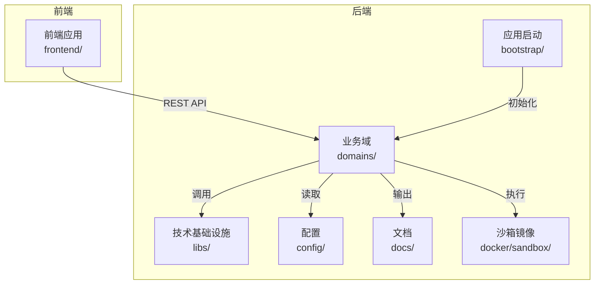
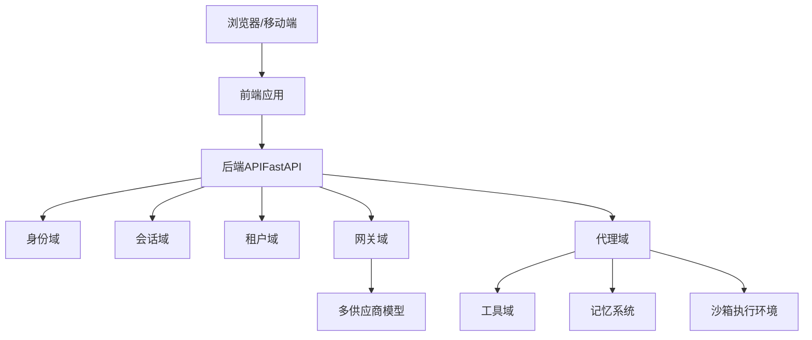
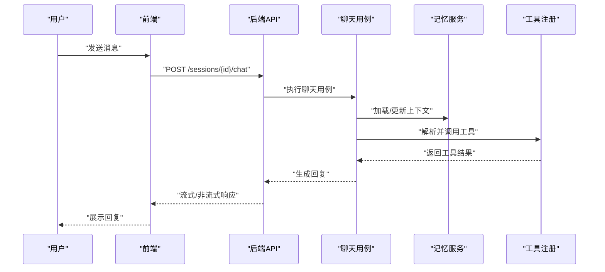
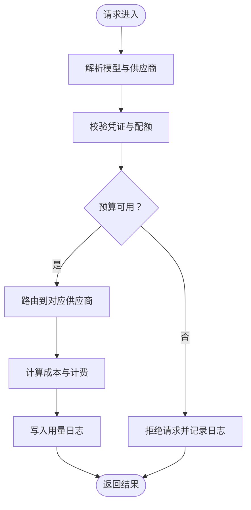
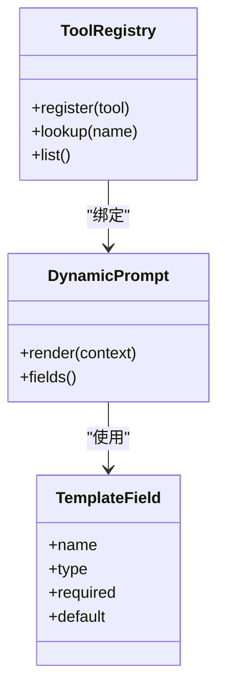
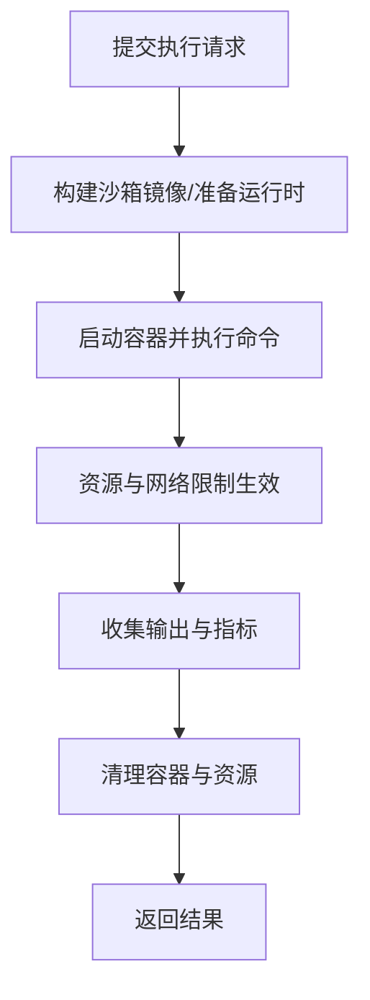
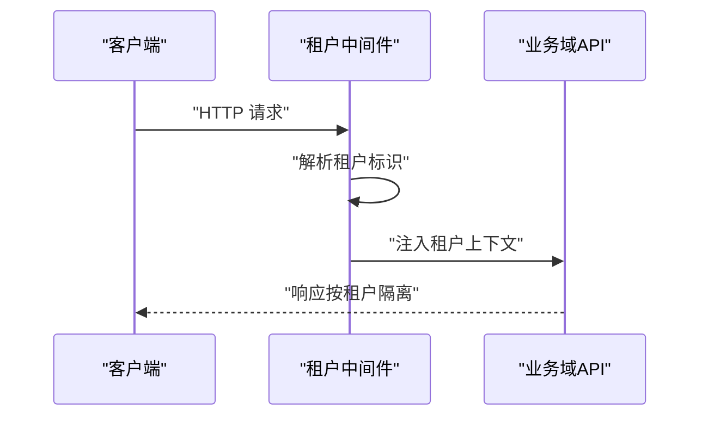
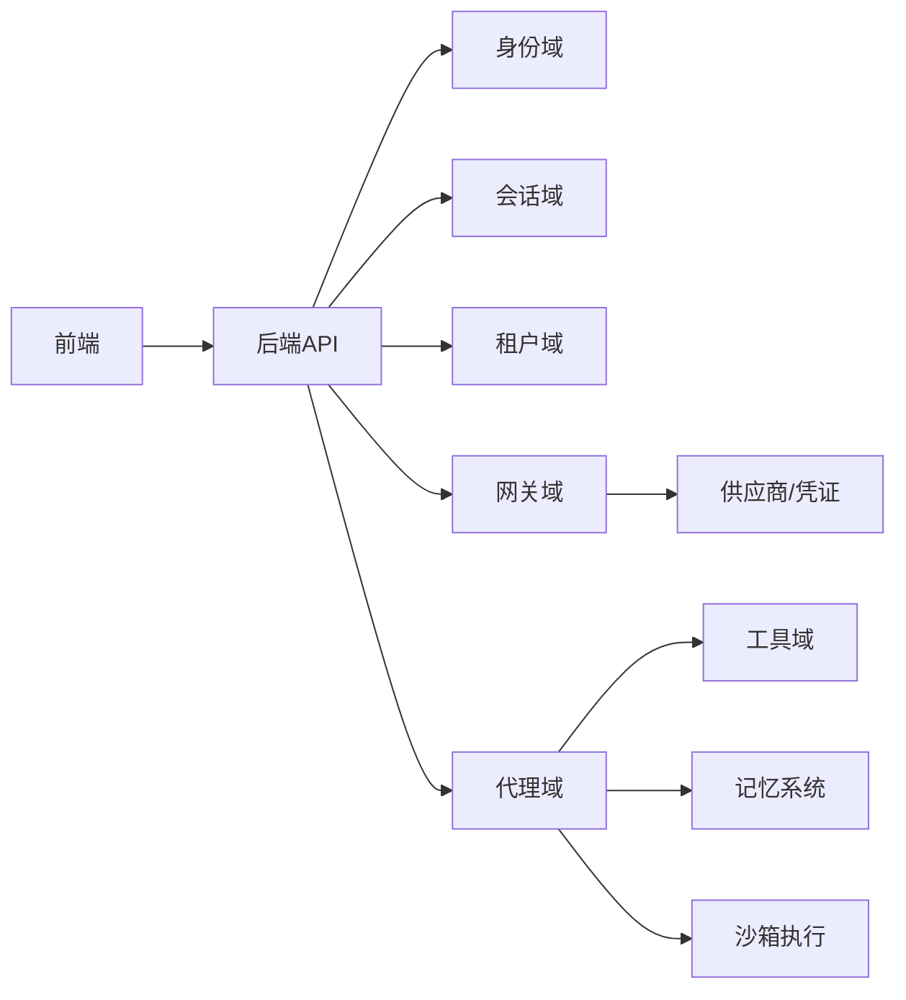

# 项目概述

<cite>
**本文引用的文件**
- [README.md](file://README.md)
- [AGENTS.md](file://AGENTS.md)
- [backend/README.md](file://backend/README.md)
- [backend/docs/ARCHITECTURE.md](file://backend/docs/ARCHITECTURE.md)
- [backend/docs/DEVELOPMENT.md](file://backend/docs/DEVELOPMENT.md)
- [backend/docs/沙箱资源管理设计文档.md](file://backend/docs/沙箱资源管理设计文档.md)
- [backend/docs/execution-environment-config.md](file://backend/docs/execution-environment-config.md)
- [backend/docs/gateway/GATEWAY_THIRDPARTY_CLIENT_GUIDE.md](file://backend/docs/gateway/GATEWAY_THIRDPARTY_CLIENT_GUIDE.md)
- [backend/docs/mcp/MCP_QUICKSTART.md](file://backend/docs/mcp/MCP_QUICKSTART.md)
- [backend/config/mcp.toml](file://backend/config/mcp.toml)
- [backend/config/tools.toml](file://backend/config/tools.toml)
- [backend/config/litellm_models.yaml](file://backend/config/litellm_models.yaml)
- [backend/docker/sandbox/README.md](file://backend/docker/sandbox/README.md)
- [backend/domains/agent/application/use_cases/chat_use_case.py](file://backend/domains/agent/application/use_cases/chat_use_case.py)
- [backend/domains/agent/infrastructure/memory/memory_service.py](file://backend/domains/agent/infrastructure/memory/memory_service.py)
- [backend/domains/agent/infrastructure/tools/tool_registry.py](file://backend/domains/agent/infrastructure/tools/tool_registry.py)
- [backend/libs/middleware/tenant_middleware.py](file://backend/libs/middleware/tenant_middleware.py)
- [backend/bootstrap/composition/identity_services.py](file://backend/bootstrap/composition/identity_services.py)
- [backend/scripts/run_dev_server.py](file://backend/scripts/run_dev_server.py)
- [frontend/README.md](file://frontend/README.md)
- [docs/DEPLOYMENT.md](file://docs/DEPLOYMENT.md)
- [docs/SSO.md](file://docs/SSO.md)
</cite>

## 目录
1. [引言](#引言)
2. [项目结构](#项目结构)
3. [核心组件](#核心组件)
4. [架构总览](#架构总览)
5. [详细组件分析](#详细组件分析)
6. [依赖关系分析](#依赖关系分析)
7. [性能考量](#性能考量)
8. [故障排查指南](#故障排查指南)
9. [结论](#结论)
10. [附录](#附录)

## 引言
本项目旨在构建一个面向企业与开发者的一体化AI代理平台，围绕“多模态大模型集成 + 智能代理执行 + MCP工具管理 + 沙箱执行环境”的设计哲学，提供从模型接入、工具编排到安全执行的全链路能力。平台强调前后端分离、模块化域划分与可扩展的网关体系，支持租户隔离、预算控制与多供应商模型接入，帮助用户以较低成本实现高可靠、可审计的智能代理应用。

项目定位与价值主张：
- 多模态与多模型：统一接入与调度多家LLM供应商，支持文本/图像/视频等多模态任务。
- 智能代理执行：以会话为中心的状态化推理与记忆管理，支持复杂对话与计划执行。
- MCP工具生态：标准化工具注册、动态提示与模板字段，实现工具即插即用与版本化管理。
- 安全沙箱：容器化执行环境，限制资源与网络访问，保障生产安全。

发展历程与现状：
- 早期愿景文档与当前实现存在演进差异，当前以“domains/”分层架构为核心实现载体，持续迭代中。
- 后端采用FastAPI与领域驱动设计，前端采用现代化前端框架，提供网关、工具、会话与权限等管理界面。

未来规划（基于现有文档与配置）：
- 持续完善MCP工具生态与动态提示/模板字段体系。
- 加强网关预算与配额治理，完善多供应商成本与稳定性监控。
- 深化沙箱资源管理与执行环境配置，提升隔离性与可观测性。

章节来源
- [README.md:1-120](file://README.md#L1-L120)
- [backend/docs/ARCHITECTURE.md:1-120](file://backend/docs/ARCHITECTURE.md#L1-L120)
- [backend/docs/DEVELOPMENT.md:170-190](file://backend/docs/DEVELOPMENT.md#L170-L190)

## 项目结构
项目采用前后端分离与“domains/”分层架构：
- 后端（Python/FastAPI）：以“domains/”划分身份、会话、租户、网关、代理、评估等业务域，配合libs/纯技术基础设施与bootstrap/应用启动。
- 前端（TypeScript/Vite）：提供网关配置、工具管理、会话交互与权限管理等界面。
- 文档与配置：集中于docs/与config/，覆盖架构、部署、MCP与工具配置等。

图示来源
- [AGENTS.md:5-42](file://AGENTS.md#L5-L42)
- [backend/README.md:1-60](file://backend/README.md#L1-L60)
- [frontend/README.md:1-40](file://frontend/README.md#L1-L40)

章节来源
- [AGENTS.md:5-42](file://AGENTS.md#L5-L42)
- [backend/README.md:1-60](file://backend/README.md#L1-L60)
- [frontend/README.md:1-40](file://frontend/README.md#L1-L40)

## 核心组件
- 代理域（Agent Domain）：负责消息、事件、工具调用等核心实体与用例，支撑聊天、推理与计划执行。
- 网关域（Gateway Domain）：统一LLM接入、预算与配额、凭证管理、第三方客户端对接。
- 会话域（Session Domain）：跨功能共享的会话状态与标题管理，支持多轮对话与上下文持久化。
- 租户域（Tenancy Domain）：团队与成员管理、默认团队与权限授权。
- 工具域（Tools）：工具注册、动态提示与模板字段，支持MCP工具生态。
- 沙箱执行：容器化执行环境，隔离资源与网络，保障生产安全。

章节来源
- [backend/docs/ARCHITECTURE.md:1-120](file://backend/docs/ARCHITECTURE.md#L1-L120)
- [backend/docs/沙箱资源管理设计文档.md:1-120](file://backend/docs/沙箱资源管理设计文档.md#L1-L120)

## 架构总览
平台采用“前后端分离 + 领域分层 + 网关统一接入”的总体架构。后端以FastAPI承载各业务域，通过中间件实现租户隔离与鉴权；前端通过API与后端交互，提供可视化配置与管理界面。

图示来源
- [backend/docs/ARCHITECTURE.md:1-120](file://backend/docs/ARCHITECTURE.md#L1-L120)
- [backend/libs/middleware/tenant_middleware.py](file://backend/libs/middleware/tenant_middleware.py)
- [backend/domains/agent/infrastructure/memory/memory_service.py](file://backend/domains/agent/infrastructure/memory/memory_service.py)
- [backend/domains/agent/infrastructure/tools/tool_registry.py](file://backend/domains/agent/infrastructure/tools/tool_registry.py)
- [backend/docker/sandbox/README.md](file://backend/docker/sandbox/README.md)

章节来源
- [backend/docs/ARCHITECTURE.md:1-120](file://backend/docs/ARCHITECTURE.md#L1-L120)
- [backend/libs/middleware/tenant_middleware.py](file://backend/libs/middleware/tenant_middleware.py)

## 详细组件分析

### 代理域与聊天用例
- 聊天用例：封装消息流转、工具调用与状态管理，支持多轮对话与上下文维护。
- 记忆服务：提供长期与短期记忆的存取与更新，支撑上下文压缩与检索增强。
- 工具注册：集中式工具注册与动态提示，结合模板字段实现参数化调用。

图示来源
- [backend/domains/agent/application/use_cases/chat_use_case.py](file://backend/domains/agent/application/use_cases/chat_use_case.py)
- [backend/domains/agent/infrastructure/memory/memory_service.py](file://backend/domains/agent/infrastructure/memory/memory_service.py)
- [backend/domains/agent/infrastructure/tools/tool_registry.py](file://backend/domains/agent/infrastructure/tools/tool_registry.py)

章节来源
- [backend/domains/agent/application/use_cases/chat_use_case.py](file://backend/domains/agent/application/use_cases/chat_use_case.py)
- [backend/domains/agent/infrastructure/memory/memory_service.py](file://backend/domains/agent/infrastructure/memory/memory_service.py)
- [backend/domains/agent/infrastructure/tools/tool_registry.py](file://backend/domains/agent/infrastructure/tools/tool_registry.py)

### 网关域与多供应商模型接入
- 统一模型目录与供应商凭证：通过配置文件与数据库表管理模型清单与密钥。
- 第三方客户端对接：提供客户端接入指南与成本/能力矩阵，便于快速集成。
- 预算与配额：按团队/项目维度进行用量统计与限额控制。

图示来源
- [backend/docs/gateway/GATEWAY_THIRDPARTY_CLIENT_GUIDE.md](file://backend/docs/gateway/GATEWAY_THIRDPARTY_CLIENT_GUIDE.md)
- [backend/config/litellm_models.yaml](file://backend/config/litellm_models.yaml)

章节来源
- [backend/docs/gateway/GATEWAY_THIRDPARTY_CLIENT_GUIDE.md](file://backend/docs/gateway/GATEWAY_THIRDPARTY_CLIENT_GUIDE.md)
- [backend/config/litellm_models.yaml](file://backend/config/litellm_models.yaml)

### MCP工具管理与动态提示
- 工具注册与分类：支持工具描述、类别与动态提示字段，便于前端渲染与参数校验。
- 动态工具与模板字段：根据会话上下文动态注入参数，提升工具复用性与灵活性。
- 初始化与状态管理：提供自动初始化流程与状态检查机制，确保工具可用性。

图示来源
- [backend/config/mcp.toml](file://backend/config/mcp.toml)
- [backend/config/tools.toml](file://backend/config/tools.toml)
- [backend/docs/mcp/MCP_QUICKSTART.md](file://backend/docs/mcp/MCP_QUICKSTART.md)

章节来源
- [backend/config/mcp.toml](file://backend/config/mcp.toml)
- [backend/config/tools.toml](file://backend/config/tools.toml)
- [backend/docs/mcp/MCP_QUICKSTART.md](file://backend/docs/mcp/MCP_QUICKSTART.md)

### 沙箱执行环境
- 容器化隔离：通过Docker镜像与脚本构建沙箱环境，限制CPU/内存/网络等资源。
- 资源管理设计：定义资源上限、回收策略与可观测指标，保障多租户安全。
- 执行环境配置：提供执行环境的配置项与最佳实践，便于本地与生产部署。

图示来源
- [backend/docker/sandbox/README.md](file://backend/docker/sandbox/README.md)
- [backend/docs/沙箱资源管理设计文档.md](file://backend/docs/沙箱资源管理设计文档.md)
- [backend/docs/execution-environment-config.md](file://backend/docs/execution-environment-config.md)

章节来源
- [backend/docker/sandbox/README.md](file://backend/docker/sandbox/README.md)
- [backend/docs/沙箱资源管理设计文档.md](file://backend/docs/沙箱资源管理设计文档.md)
- [backend/docs/execution-environment-config.md](file://backend/docs/execution-environment-config.md)

### 租户与权限中间件
- 租户隔离：通过中间件在请求入口注入租户上下文，贯穿所有业务域。
- 默认团队与权限：提供默认团队与权限授权抽象，支持多角色协作。

图示来源
- [backend/libs/middleware/tenant_middleware.py](file://backend/libs/middleware/tenant_middleware.py)
- [backend/bootstrap/composition/identity_services.py](file://backend/bootstrap/composition/identity_services.py)

章节来源
- [backend/libs/middleware/tenant_middleware.py](file://backend/libs/middleware/tenant_middleware.py)
- [backend/bootstrap/composition/identity_services.py](file://backend/bootstrap/composition/identity_services.py)

## 依赖关系分析
- 前后端耦合：前端通过REST API与后端交互，接口契约稳定，便于独立演进。
- 领域内聚：各业务域职责清晰，跨域交互通过应用层用例与基础设施接口解耦。
- 外部依赖：网关域依赖多供应商模型与凭证系统；代理域依赖工具与记忆系统；沙箱依赖容器运行时。

图示来源
- [AGENTS.md:5-42](file://AGENTS.md#L5-L42)
- [backend/docs/ARCHITECTURE.md:1-120](file://backend/docs/ARCHITECTURE.md#L1-L120)

章节来源
- [AGENTS.md:5-42](file://AGENTS.md#L5-L42)
- [backend/docs/ARCHITECTURE.md:1-120](file://backend/docs/ARCHITECTURE.md#L1-L120)

## 性能考量
- 网关层：通过模型目录与成本矩阵优化路由决策，减少无效调用；配额与预算控制避免超支。
- 记忆与工具：合理设置上下文长度与工具调用频率，避免长轮询与频繁外部调用。
- 沙箱：限制容器资源与并发数，结合缓存与复用策略降低冷启动开销。
- 前后端：接口幂等与分页查询，避免重复请求与大数据传输。

## 故障排查指南
- 开发环境启动：参考后端开发文档与脚本，确认依赖与端口占用。
- 部署与SSO：参考部署与单点登录集成文档，核对环境变量与证书配置。
- 网关与凭证：检查模型清单与凭证有效性，确认供应商可用性与配额状态。
- 工具与MCP：验证工具注册与动态提示字段，排查模板字段缺失或类型不匹配。
- 沙箱：查看容器日志与资源限制，确认网络策略与卷挂载。

章节来源
- [backend/docs/DEVELOPMENT.md:170-190](file://backend/docs/DEVELOPMENT.md#L170-L190)
- [docs/DEPLOYMENT.md:1-120](file://docs/DEPLOYMENT.md#L1-L120)
- [docs/SSO.md:1-120](file://docs/SSO.md#L1-L120)
- [backend/scripts/run_dev_server.py](file://backend/scripts/run_dev_server.py)

## 结论
本项目以“多模态大模型 + 智能代理 + MCP工具 + 沙箱执行”为核心能力，通过前后端分离与领域分层架构，实现了从模型接入到工具编排再到安全执行的闭环。平台具备良好的扩展性与可运维性，适合在企业环境中落地智能代理应用，并持续演进以满足更复杂的业务场景。

## 附录
- 快速开始：参考后端开发文档与前端README，完成本地开发环境搭建。
- 配置参考：MCP与工具配置位于config/目录，网关与模型清单在litellm_models.yaml中。
- 文档索引：架构、部署、沙箱与MCP相关文档集中在docs/与backend/docs/下。

章节来源
- [backend/docs/DEVELOPMENT.md:170-190](file://backend/docs/DEVELOPMENT.md#L170-L190)
- [frontend/README.md:1-40](file://frontend/README.md#L1-L40)
- [backend/config/mcp.toml](file://backend/config/mcp.toml)
- [backend/config/tools.toml](file://backend/config/tools.toml)
- [backend/config/litellm_models.yaml](file://backend/config/litellm_models.yaml)
- [docs/DEPLOYMENT.md:1-120](file://docs/DEPLOYMENT.md#L1-L120)
- [docs/SSO.md:1-120](file://docs/SSO.md#L1-L120)