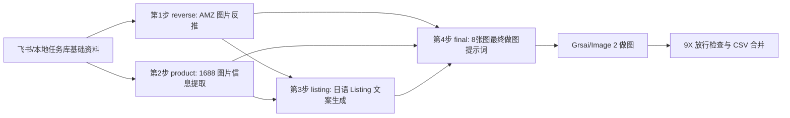

# 8.5 火山 4 步提示词生成流程

> 当前测试版已切换为二次封装 OpenAI 兼容 API，不再直接调用火山原生 `ep-xxx` 接入点。

## 1. API 配置

配置文件：

```text
config/volcengine_ai.json
```

当前模型配置：

| 用途 | 配置项 | 当前值 |
| --- | --- | --- |
| OpenAI 兼容 API Base | `base_url` | `https://gateway.giimallai.com/ai-agent/api/v1/openai/v1` |
| 视觉理解模型 | `vision_model` | `dobao-seed-pic-online` |
| Listing 文案模型 | `listing_model` | `doubao-text-online` |
| 最终做图提示词模型 | `final_prompt_model` | `doubao-text-online` |

API Key 在本地配置文件中读取，文档中不展开。

## 2. 执行方式

测试版入口：

```text
8Y_TEST_本地任务库_火山提示词_做图API.bat
```

核心脚本：

```text
scripts/local_pipeline_test/pipeline_test.py
scripts/feishu/run_ai_image_middle_test.py
```

执行顺序为按阶段批量跑：

```text
reverse -> product -> listing -> final
```

对应字段：

| 阶段 | 本地字段 | 说明 |
| --- | --- | --- |
| reverse | `reverse_output` | 反推 AMZ 图片表达 |
| product | `product_output` | 提取 1688 产品真实特征 |
| listing | `listing_output` | 生成日语 Listing 文案 |
| final | `final_prompt` / `prompt_items_json` | 生成 8 张图最终做图提示词 |

## 3. 四步模型链路

### 第 1 步：反推 AMZ 图片提示词 V2

模型：

```text
dobao-seed-pic-online
```

输入资料：

- `ASIN标题`
- `来源关键词`
- `五点和描述`
- `亚马逊主图套图`

输出：

```text
reverse_output
```

作用：

识别竞品 Amazon 套图里的画面内容、场景、构图、卖点表达、图片角色、环境、使用场景、镜头、氛围、道具、人物动作和信息层级。

输入提示词模板：

```text
你是一名日本亚马逊资深运营，请结合 ASIN标题、来源关键词、五点和描述以及对应的 Amazon 图片，理解这个产品是什么、它的买家画像有哪些特点、它作为商品在亚马逊销售时需要通过图片传达哪些内容才能打动日本市场的客户下单。

在了解这个产品后，反推这一套 Amazon 图片中的场景、风格、构图、卖点表达、图片角色、环境、使用场景、镜头、氛围、道具、人物动作和信息层级。

注意：你的核心任务不是描述图片中核心产品的具体长相，只需要说明产品在画面中的位置、占比、与周围环境的互动关系以及该图片传达的核心卖点是什么。

商品资料：
- ASIN: {asin}
- 来源关键词: {keyword}
- 标题: {title}
- 五点/描述:
{copy}

要求：
1. 最终输出结构清晰的全中文提示词/分析，编号格式为【主图1】【主图2】这样的顺序号。
2. 优先级最高：不描述图片中的二维码卡片、品牌LOGO、制造国，尤其是 Made in Japan 等违规元素。
3. 其他补充：符合亚马逊日本站主图标准，1:1比例，符合日本人审美；如有日语文字，直接保留日语。
4. 对核心产品只用通用产品词来代替，禁止描述产品产地、制造国或者地区。
5. 输出内容不需要补充说明。
6. 只输出可给后续模型使用的中文分析正文，不要 JSON，不要 Markdown 表格。
```

### 第 2 步：1688 图片信息提取 V2

模型：

```text
dobao-seed-pic-online
```

输入资料：

- `ASIN标题`
- `五点和描述`
- `1688白底主图`
- `1688商品图`

输出：

```text
product_output
```

作用：

锁定真实产品外观、结构、材质、厚度、配件、功能、细节，并判断目标群体性别和年龄段，防止后续生图被竞品风格污染。

输入提示词模板：

```text
角色设定：你是一位精通 3D 物理建模、面料工艺与工业设计的视觉逆向工程专家。

任务目标：根据提供的 1688 实物图，解构其“视觉基因”，为后续 AI 生图提供绝对精准的描述，防止被竞品风格干扰。

请按照以下逻辑输出一段凝练、专业、无废话的中文视觉描述：

1. 类目属性与空间厚度定义：
判断产品属于哪种物理类型，例如硬表面工业制品、软体纺织/服装、流体/透明容器、多件套/零散组合。
必须判断产品厚度比例，是超薄扁平片状、无厚度侧面，还是有明显厚度墙、大内部空间的立方块/柱体。

2. 核心形态与负向特征防御：
描述主要部件几何构型、连接与闭合方式。
如果多颜色/材质拼接，必须说明拼接位置。
明确指出实物中绝对不存在的特征，例如表面光滑无按钮、不带把手、无提手，避免后续 AI 凭空添加。

3. 材质纹理与物理微观：
不要只写“塑料/布”，要写细微颗粒、防汗涂层、拉丝工艺、304 不锈钢、边缘圆润或 45 度倒角等可见特征。

4. 动态/受力状态：
如果是软体或折叠产品，描述自然、拉伸或使用状态下的形变特征。

5. 绝对参数记录：
不要提取图片中的数值、单位及型号信息。

6. 优先根据 ASIN标题 和 五点和描述 判断目标群体性别，输出格式固定为：
目标群体性别：男款 / 女款 / 男女同款。

7. 优先根据 ASIN标题 和 五点和描述 判断年龄段，输出格式固定为：
年龄段描述：婴儿 / 幼儿 / 小童 / 大童 / 成人。

ASIN: {asin}
ASIN标题: {title}
五点和描述:
{copy}

输出格式要求：
直接输出一段“实物特征锁定区”中文描述，不要解释过程。
```

### 第 3 步：Listing 文案生成

模型：

```text
doubao-text-online
```

输入资料：

- `来源关键词`
- `ASIN标题`
- `五点和描述`
- 第 1 步输出：`reverse_output`
- 第 2 步输出：`product_output`

输出：

```text
listing_output
```

作用：

生成日语版 Amazon Listing 文案，供第 4 步最终做图提示词提炼卖点、标题方向和转化诉求。

输入提示词模板：

```text
假设你是一名资深【日本】亚马逊运营，主要根据反推AMZ图片提示词V2输出结果内容，其次参考竞品ASIN的评论、标题、五点信息，用【日语】输出该产品的标题、五点描述以及详情描述，符合亚马逊标准。

标题里的核心关键词必须使用来源关键词。

注意生成的所有文案信息里，与产品尺寸、重量、颜色和大小等参数数据有关的，优先使用1688图片信息提取V2输出结果里的内容；
如果1688图片信息提取V2输出结果为空，则再用五点和描述里的尺寸规格等数据，尺寸单位符合【日本】用户习惯。

输出格式要求严格遵守，不可更改结构。

来源关键词: {keyword}
ASIN标题: {title}
五点和描述:
{copy}

反推AMZ图片提示词V2输出结果:
{reverse_text}

1688图片信息提取V2输出结果:
{product_text}

重要约束（隐私和知识产权防护）：
排除所有品牌和徽标。
不得在生成的标题、五点、描述或做图提示词中包含任何特定品牌名称、品牌徽标、商标、类似带括号的词语以及中英文品牌组合词。
若原始信息含商标或品牌，生成新标题和五点时必须删除或通用化。

白名单保留：
代表技术属性、材质、规格或国际标准的英文缩写可以保留，例如 EVA、PE、TPU、PVC、ABS、PC、A4、A5、B5、20-inch、M/L/XL、USB-C、UV400、IP68、OE、ISO。

专注于产品特征和益处：
所有内容必须集中在产品通用特征（材料、尺寸、功能、用途）和客户益处上。

请严格按以下固定模板输出，不要添加额外标题层级、分隔线、表格或内部翻译：

### 日语版

**标题**
（一行写完，不换行，不加粗，不加引号，字符控制在200字符内）

**五点描述**
1. （第一条卖点，一行写完，不换行，不加粗子标题）
2. （第二条卖点，一行写完）
3.
4.
5.

**商品描述**
（描述正文，可多段，段间空一行）

格式红线：
- 每条五点必须写在一行内，禁止换行，禁止加粗子标题，禁止嵌套表格。
- 日语版五点中不要夹带中文翻译。
- 标题只写一行纯文本，不要用 ** 包裹。
- 区块标识只允许 ### 日语版、**标题**、**五点描述**、**商品描述**。
- 不要输出关键词优化点、注意事项等额外段落。
```

### 第 4 步：做图提示词 AI 生成

模型：

```text
doubao-text-online
```

输入资料：

- 第 1 步输出：`reverse_output`
- 第 2 步输出：`product_output`
- 第 3 步输出：`listing_output`

输出：

```text
final_prompt
prompt_items_json
```

作用：

生成最终 8 张 Amazon Listing 图片提示词，直接交给 Grsai / Image 2 做图。

输入提示词模板：

```text
你是资深 Amazon Listing 图片策略师、跨境电商运营专家、AI 生图 Prompt 工程师。

你的任务：
根据本行飞书多维表中已经提取好的文字信息，为当前产品生成一套完整的 8 张 Amazon Listing 图片做图提示词。
输出内容会直接给 Image 2 视觉模型使用。

你必须使用本行这些字段作为主要证据来源：
1. 反推AMZ图片提示词V2输出结果：
竞品亚马逊套图被识别后的画面内容、构图、卖点表达、图片角色、竞品图片中的环境、使用场景、镜头、氛围、道具、人物动作。

2. 1688图片信息提取V2输出结果：
1688 产品图中提取的真实产品外观、结构、材质、参数、配件、功能、细节。

3. listing文案生成：
已经参考竞品文案后生成的新 Listing 文案。

字段使用边界：
- 竞品图片表达、构图、环境、场景、图片角色，只能来自反推AMZ图片提示词V2输出结果。
- 产品真实外观、材质、结构、参数、配件、功能、细节，只能来自1688图片信息提取V2输出结果。
- 最终卖点、标题方向、转化诉求、图中文字方向，优先来自listing文案生成。
- 如果这些字段没有提供某个事实，不得自行编造。

反推AMZ图片提示词V2输出结果:
{reverse_text}

1688图片信息提取V2输出结果:
{product_text}

listing文案生成:
{listing_text}

这里的“8 张图”指一套 Amazon Listing 图片结构：
第 1 张是主图，用于商品识别。
第 2 张是核心使用场景图，用于展示产品在真实生活中的主要使用场景。
第 3 张是核心功能证明图，用于展示产品最重要功能如何发挥作用。
第 4 张是痛点解决图，用于回应买家的购买顾虑。
第 5 张是空间/尺寸/适配决策图，用于解决尺寸、摆放、安装、收纳、携带、兼容或佩戴适配问题。
第 6 张是结构细节信任图，用于展示材质、结构、部件、工艺、清洁或操作细节。
第 7 张是差异化价值图，用于解释为什么选择本产品而不是普通同类产品。
第 8 张是购买后理想生活图，用于展示买家拥有产品后的更好生活状态。

【最终输出格式】
1. 不要输出 JSON。
2. 不要输出 Markdown 表格。
3. 不要解释分析过程。
4. 只输出 8 段最终做图提示词。
5. 每张图之间空 2 行。
6. 每张图前必须使用固定编号：【主图1】到【主图8】。
7. 每个编号下面只写该图的完整做图提示词。
8. 不得遗漏任何一张图。
9. 每段必须是一段可直接投喂 Image 2 视觉模型的自然语言生图 Prompt，不能写成“图片类型、转化目标、证据来源、画面场景、构图方式”这种字段清单。
10. 每段提示词必须把图片角色、产品主体锁定、画面构图、广告层级、图中文字、视觉证明、禁用项自然融合成一段完整生图指令。

【8 张图结构，必须严格遵守】
1. 主图：商品识别图。
纯白背景、产品本体、无文字、无人物、无道具、无场景；产品占画面核心，真实棚拍，主体结构清楚。

2. 核心使用场景图。
回答“我会在什么场景用它，买了之后生活哪里变好”。
展示最典型、最有购买欲的真实使用场景，产品必须清楚可见，是画面里的功能主角。

3. 核心功能证明图。
回答“它解决问题的能力是什么”。
把最重要的功能或结构能力变成可视化结果，用动作、效果变化、局部结构、使用前后状态、连接、收纳、清洁、开合、佩戴、支撑等方式证明。

4. 痛点解决图。
回答“我担心的问题是否被解决”。
针对真实评论、关键词、竞品表达或 Listing 文案里的购买顾虑，聚焦一个核心痛点，用问题到解决的画面表达。

5. 空间/尺寸/适配决策图。
回答“我家/我的场景放不放得下，用起来是否合适”。
有真实尺寸才写 cm/mm/ml/kg 等单位；没有证据时只做视觉比例、空间关系、材质质感、使用动作，不写具体数字。

6. 结构细节信任图。
回答“它是否可靠、好用、好维护”。
只展示 1688 信息中真实存在的结构和细节。

7. 差异化价值图。
回答“为什么优先选它，而不是随便买一个类似产品”。
可以用对比逻辑，但不能出现竞品品牌、竞品产品外观或贬低竞品，不能做无证据性能对比。

8. 购买后理想生活图。
回答“拥有它之后，我的生活状态会变得怎样”。
必须和第 2 张区分：第 2 张强调正在使用，第 8 张强调使用后的结果和情绪收尾。

【副图目标视觉风格定义】
主图2-8 必须追求“日系 Amazon 高转化图文广告副图”：
- 日系、高级、干净、商业感强、移动端可读、信息层级清楚。
- 每张副图都要有“主视觉 + 转化信息”的广告感，而不是普通生活照或简单产品摆拍。
- 可以根据图片角色选择大号日文短标题、极简图标卖点、局部细节放大、色卡、尺码 badge、底部小图块、场景缩略图、指向线、证明带、before/after 区块等。
- 不要求每张图都同时出现这些元素，应根据该图角色选择最合适的 1-3 种表达组件。
- 单张图不能杂乱。

【产品主体一致性规则】
每张图都必须明确要求：
- 产品主体必须以 1688 产品图信息、1688 白底主图和实际上传参考图为唯一外观依据。
- 保持产品形状、结构、颜色、材质、比例、配件、接口、按钮、纹理、缝线、表面细节完全一致。
- 不得改款、改结构、改颜色、改材质、增加配件。
- 不得把产品画成相似但不同的产品。

【参数和事实使用规则】
只有1688图片信息提取V2输出结果中明确提供的信息，才能写成具体参数。
不得编造尺寸、重量、材质、容量、功率、认证、耐温、承重、适用年龄、适用范围、使用寿命。
没有明确参数时，只能用视觉方式表达大小感、空间关系、材质质感、使用动作，不写具体数字。

【语言和图中文字规则】
1. 最终每段做图 Prompt 的主体必须使用英文，因为它会直接交给 Image 2 视觉模型执行。
2. 如果图中需要出现文字，必须使用目标站点语言。日本站图中文字必须是自然、克制、符合日本 Amazon 买家习惯的日语。
3. 图中文字必须短，不要长段落，不要感叹号，不要夸张营销术语。
4. 主图1必须无文字。
5. 如果该图不需要文字，要明确写“no text, use scene and product result to communicate the benefit”。
6. 主图2-8默认应有少量图中文字或标签；只有当文字会破坏画面时才写无文字。
7. 副图文字建议控制为：1个主标题 + 1-3个短标签/证明点/小卡片。

【防止输出过简的强制要求】
如果主图2-8 的 Prompt 只描述“产品居中、背景干净、少量文字、简洁排版”，说明不合格。
必须重写为更适合 Amazon 副图的高转化广告画面：
- 至少明确一个大主视觉区域。
- 至少明确一个转化信息区域，例如标题、图标卖点、证明卡、局部放大、尺寸线、场景缩略图、before/after 或 Q&A 小卡。
- 至少明确一个视觉证明方式，而不是只说“展示卖点”。
- 必须明确“not a plain product photo, not a minimal poster, not a simple clean layout”。

【画面严禁出现】
每张图都必须禁止：
Amazon Logo、价格、促销语、二维码、任何可辨识商标 Logo 或品牌 Logo、竞品品牌、虚假认证、无证据参数、乱码文字、水印、与 1688 产品主体不一致的结构、颜色、材质、配件。

【输出比例规则】
1. 主图1：1:1。
2. 主图2-8：优先 2:3 竖版 Amazon 副图比例。
3. 如果产品类目非常依赖方图展示，也可以使用 1:1，但必须保持移动端可读性。

【每张图统一尾缀】
每张图提示词最后必须原样加入：
Remark for Precision Editing:
"Please perform a precise in-painting operation to maintain the object's absolute consistency. Use semantic segmentation to identify and remove only the main visual branding, brand name logos, graphic logo icons, and trademark symbols like ® and ™. Crucially, do not remove the surrounding smaller technical specs, instructional text, nutritional facts, or fine print. Replace the removed logo areas with the original material's seamless texture to match the lighting and shape of the object perfectly, while leaving the informational text completely untouched. The main subject of each image must be 100% identical to the reference image I provide."

【最终质量要求】
1. 每张图不是模板空话，必须结合本行产品事实和 Listing 文案具体化。
2. 8 张图的角色不能重复。
3. 每张图都要有明确转化目标。
4. 每张图都要有清晰视觉证明方式。
5. 每张图都要能直接交给 Image 2 / 豆包视觉模型生成。
6. 每张图都要保护产品主体一致性。
7. 每张图都要避免编造参数。
8. 每张图都要避免复制竞品。
9. 输出结果必须像一套专业 Amazon Listing 图片生图 Prompt。
10. 主图2-8 输出效果必须明确追求“日系 Amazon 杂志式图文广告副图”。

请现在开始输出最终 8 张图做图提示词。
严格按【主图1】到【主图8】输出。
每张图之间空 2 行。
```

## 4. 阶段依赖关系



第 3 步必须等待第 1 步和第 2 步完成。  
第 4 步必须等待第 1 步、第 2 步、第 3 步全部完成。

## 5. 质量校验

第 4 步输出完成后会做基础校验：

- 必须能拆出 8 段提示词。
- 必须包含 `【主图1】` 到 `【主图8】`。
- 每张图应可作为独立生图 Prompt。
- 失败时该 ASIN 会保留在本地 SQLite 中，可后续重试。

## 6. 当前注意事项

1. 当前第 4 步模型已从原飞书里的 `DeepSeek-V3.2` 改为二次封装 API 中的 `doubao-text-online`。
2. 高并发下最终提示词阶段可能出现网关 `504 Gateway Time-out`，脚本已增加临时重试。
3. 测试版所有输出默认写入本地测试库，不直接污染正式 8.0/9.0 主流程。
4. 当前测试版不会自动上传云端，9X 默认应使用 `--no-upload` 先生成 CSV 供人工检查。

