# OpenCode Agent 系统架构文档 - 不是本项目，参考

## 目录

1. [概述](#概述)
2. [核心架构](#核心架构)
3. [LLM 交互机制](#llm-交互机制)
4. [通信协议](#通信协议)
5. [Agent 工作流程](#agent-工作流程)
6. [Agent 模式设计](#agent-模式设计)
7. [计划与 TODO 系统](#计划与-todo-系统)
8. [工具系统](#工具系统)
9. [权限控制](#权限控制)
10. [提示词系统](#提示词系统)
11. [Memory 管理](#memory-管理)
12. [扩展指南](#扩展指南)

---

## 概述

OpenCode Agent 系统是一个**自研的编码助手框架**，基于 **Vercel AI SDK** 构建，采用简洁的 while 循环实现 Agent Loop，而非 LangChain/LangGraph 等复杂框架。

### 核心特点

- **轻量级架构**：简单的 while 循环，无复杂的链式调用
- **多 Agent 协作**：支持 Primary Agent 和 Subagent 两种模式
- **声明式权限**：基于规则的权限控制系统
- **工具系统**：可扩展的工具注册表
- **多模型支持**：统一的 Provider 抽象层

### 关键文件位置

```
packages/opencode/src/
├── agent/
│   ├── agent.ts              # Agent 定义与配置
│   └── prompt/               # Agent 专属提示词
├── session/
│   ├── prompt.ts             # 主循环与消息处理
│   ├── processor.ts          # 流处理器
│   ├── llm.ts                # LLM 调用封装
│   └── prompt/               # 模型特定提示词
├── tool/
│   ├── registry.ts           # 工具注册表
│   ├── tool.ts               # 工具基类定义
│   └── *.ts                  # 具体工具实现
└── permission/
    └── next.ts               # 权限引擎
```

---

## 核心架构

### 架构图

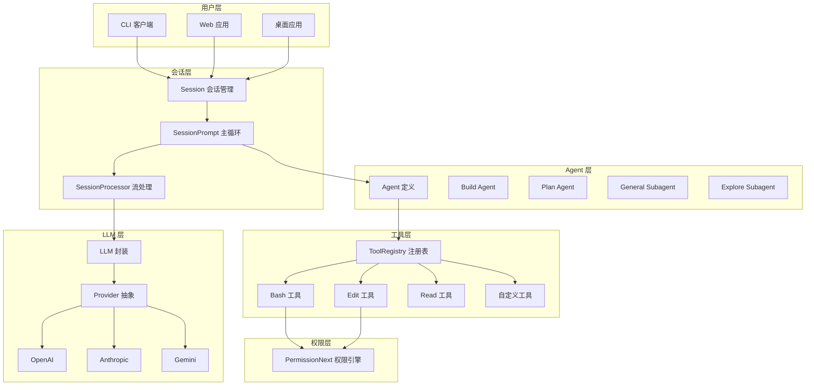

### 核心组件

| 组件 | 文件 | 职责 |
|------|------|------|
| **SessionPrompt** | `session/prompt.ts` | 主循环、消息处理、工具解析 |
| **SessionProcessor** | `session/processor.ts` | 流式响应处理、工具调用跟踪 |
| **Agent** | `agent/agent.ts` | Agent 定义、权限配置、模型绑定 |
| **ToolRegistry** | `tool/registry.ts` | 工具注册、过滤、初始化 |
| **PermissionNext** | `permission/next.ts` | 权限规则评估、动态授权 |
| **LLM** | `session/llm.ts` | Vercel AI SDK 封装 |

---

## LLM 交互机制

### 交互模式

OpenCode 采用 **流式交互（Streaming）** 模式与大模型通信，基于 Vercel AI SDK 的 `streamText` 函数实现。

### 核心交互流程

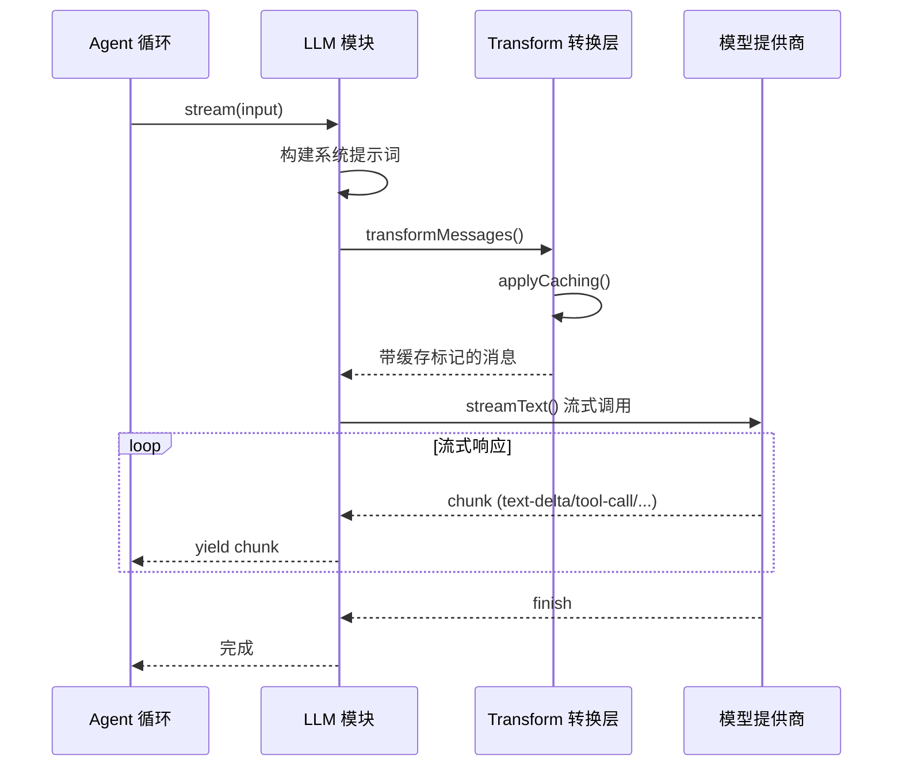

### 流式调用实现

```typescript
// packages/opencode/src/session/llm.ts
export async function stream(input: StreamInput) {
  // 1. 构建系统提示词
  const system = SystemPrompt.header(input.model.providerID)
  system.push([
    ...(input.agent.prompt ? [input.agent.prompt] : SystemPrompt.provider(input.model)),
    ...input.system,
    ...(input.user.system ? [input.user.system] : []),
  ].join("\n"))

  // 2. 转换消息格式（包含缓存优化）
  const messages = Transform.transformMessages(
    [
      ...system.map((x): ModelMessage => ({ role: "system", content: x })),
      ...input.messages,
    ],
    input.model.providerID,
  )

  // 3. 流式调用 LLM
  return streamText({
    messages,
    model: wrapLanguageModel({
      model: Provider.language(input.model),
      middleware: middleware(input.model),
    }),
    tools: ToolRegistry.schema(input.tools),
    providerOptions: providerOptions(input.model.providerID),
    maxSteps: input.maxSteps ?? 1,
    abortSignal: input.abort,
  })
}
```

### 系统提示词发送策略

**每次 API 调用都会发送系统提示词**，这是与大模型交互的标准模式：

| 问题 | 答案 |
|------|------|
| 是流式吗？ | ✅ 是，使用 `streamText` |
| 每次发送系统提示词？ | ✅ 是，每次 API 调用都发送 |
| 有缓存优化吗？ | ✅ 有，通过 `cacheControl` 标记 |

### 缓存控制优化

为避免重复处理系统提示词，OpenCode 使用 `cacheControl` 机制让模型提供商缓存这些内容：

```typescript
// packages/opencode/src/provider/transform.ts
function applyCaching(msgs: ModelMessage[], providerID: string) {
  // 标记前两条系统消息用于缓存
  const system = msgs.filter((msg) => msg.role === "system").slice(0, 2)
  // 标记最后两条非系统消息用于缓存
  const final = msgs.filter((msg) => msg.role !== "system").slice(-2)
  
  // 根据提供商设置不同的缓存选项
  const providerOptions = {
    anthropic: { cacheControl: { type: "ephemeral" } },
    bedrock: { cachePoint: { type: "ephemeral" } },
  }
  
  // 为消息添加缓存标记
  for (const msg of [...system, ...final]) {
    applyOption(msg, providerID, providerOptions)
  }
}
```

### 缓存工作原理

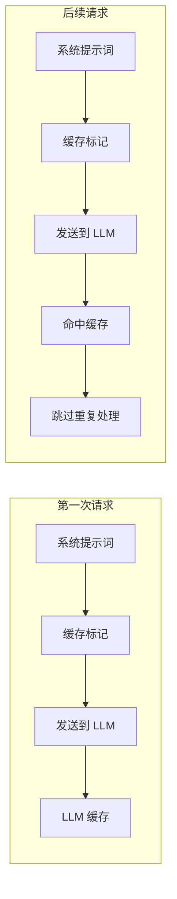

### 支持的缓存提供商

| 提供商 | 缓存选项 | 说明 |
|--------|----------|------|
| **Anthropic** | `cacheControl: { type: "ephemeral" }` | Claude 系列模型 |
| **AWS Bedrock** | `cachePoint: { type: "ephemeral" }` | Bedrock 托管模型 |
| **OpenAI** | 不支持 | 无 prompt caching |
| **Google** | 不支持 | Gemini 暂不支持 |

### 流式事件类型

`streamText` 返回的流包含以下事件类型：

| 事件类型 | 说明 | 处理方式 |
|----------|------|----------|
| `start` | 流开始 | 设置状态为 busy |
| `text-delta` | 文本增量 | 更新消息内容 |
| `tool-call` | 工具调用 | 解析并执行工具 |
| `tool-result` | 工具结果 | 记录执行结果 |
| `reasoning-start/delta/end` | 推理过程 | 更新推理内容 |
| `finish-step` | 步骤完成 | 保存用量统计 |

### 完整交互示例

```
用户: "帮我创建一个 hello.js 文件"

┌─────────────────────────────────────────────────────────────┐
│ API 请求 #1                                                 │
├─────────────────────────────────────────────────────────────┤
│ messages: [                                                 │
│   { role: "system", content: "你是一个编码助手...",        │
│     providerOptions: { cacheControl: "ephemeral" } },      │
│   { role: "user", content: "帮我创建一个 hello.js 文件" }  │
│ ]                                                           │
└─────────────────────────────────────────────────────────────┘
                              ↓
┌─────────────────────────────────────────────────────────────┐
│ 流式响应 #1                                                 │
├─────────────────────────────────────────────────────────────┤
│ text-delta: "我来帮你创建..."                               │
│ tool-call: { name: "write", args: { path: "hello.js" } }   │
│ finish-step: { usage: { input: 100, output: 50 } }         │
└─────────────────────────────────────────────────────────────┘
                              ↓
┌─────────────────────────────────────────────────────────────┐
│ 工具执行                                                    │
├─────────────────────────────────────────────────────────────┤
│ 执行 write 工具，创建 hello.js                              │
│ 结果: "文件已创建"                                          │
└─────────────────────────────────────────────────────────────┘
                              ↓
┌─────────────────────────────────────────────────────────────┐
│ API 请求 #2 (继续循环)                                      │
├─────────────────────────────────────────────────────────────┤
│ messages: [                                                 │
│   { role: "system", content: "你是一个编码助手...",        │
│     providerOptions: { cacheControl: "ephemeral" } },  ← 再次发送，但会命中缓存
│   { role: "user", content: "帮我创建一个 hello.js 文件" }, │
│   { role: "assistant", content: "我来帮你创建...",         │
│     tool_calls: [...] },                                    │
│   { role: "tool", content: "文件已创建" }                  │
│ ]                                                           │
└─────────────────────────────────────────────────────────────┘
                              ↓
┌─────────────────────────────────────────────────────────────┐
│ 流式响应 #2                                                 │
├─────────────────────────────────────────────────────────────┤
│ text-delta: "已成功创建 hello.js 文件！"                    │
│ finish-step: { finishReason: "stop" }                      │
└─────────────────────────────────────────────────────────────┘
```

---

## 通信协议

OpenCode 使用不同的通信协议匇代不同场景：

### 协议概览

| 用途 | 协议 | 端点示例 | 说明 |
|------|------|----------|------|
| **LLM 交互** | HTTP 流式响应 | 各模型提供商 API | Vercel AI SDK `streamText` |
| **服务器事件推送** | SSE | `/event`, `/global/event` | 会话状态变化通知 |
| **终端连接** | WebSocket | `/pty/:id/connect` | PTY 伪终端实时通信 |
| **分享会话同步** | WebSocket | `/share_poll` | 多用户实时协作 |

### LLM 交互（HTTP 流式）

与大模型的交互使用标准 **HTTP 流式响应**，不是 SSE 也不是 WebSocket：

```typescript
// Vercel AI SDK 的 streamText 实现
return streamText({
  messages,
  model: wrapLanguageModel({ model, middleware }),
  tools,
  abortSignal: input.abort,
})
```

工作原理：
1. 客户端发送 HTTP POST 请求到模型提供商
2. 服务器返回 `Transfer-Encoding: chunked` 响应
3. 客户端通过 `for await` 逐步读取数据块

### SSE（Server-Sent Events）

SSE 用于 **服务器到客户端的单向事件推送**：

```typescript
// packages/opencode/src/server/server.ts
return streamSSE(c, async (stream) => {
  stream.writeSSE({
    data: JSON.stringify({ type: "server.connected", properties: {} }),
  })
  
  const unsub = Bus.subscribeAll(async (event) => {
    await stream.writeSSE({ data: JSON.stringify(event) })
  })
  
  // 30秒心跳防止超时
  const heartbeat = setInterval(() => {
    stream.writeSSE({ data: JSON.stringify({ type: "server.heartbeat" }) })
  }, 30000)
})
```

SSE 事件类型：
- `server.connected` - 连接建立
- `server.heartbeat` - 心跳保活
- `session.updated` - 会话更新
- `message.created` - 消息创建
- `message.part.updated` - 消息部件更新

### WebSocket

WebSocket 用于 **双向实时通信**：

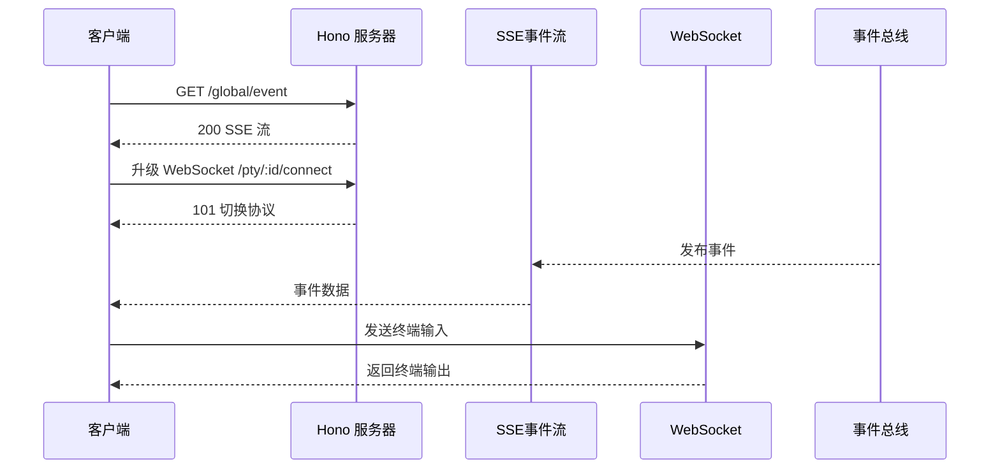

### 协议选择决策

| 场景 | 推荐协议 | 原因 |
|------|----------|------|
| LLM 调用 | HTTP 流式 | 模型提供商标准接口 |
| 状态通知 | SSE | 单向、轻量、自动重连 |
| 终端交互 | WebSocket | 双向、低延迟 |
| 多人协作 | WebSocket | 双向实时同步 |

---

## Agent 工作流程

### 主循环流程

Agent 的核心执行逻辑位于 `SessionPrompt.loop()` 函数中：

```typescript
// packages/opencode/src/session/prompt.ts
export const loop = fn(Identifier.schema("session"), async (sessionID) => {
  const abort = start(sessionID)
  let step = 0
  const session = await Session.get(sessionID)
  
  while (true) {
    // 1. 设置状态为忙碌
    SessionStatus.set(sessionID, { type: "busy" })
    
    // 2. 获取消息流
    let msgs = await MessageV2.filterCompacted(MessageV2.stream(sessionID))
    
    // 3. 查找最后的用户消息和助手消息
    let lastUser, lastAssistant, lastFinished
    // ... 消息查找逻辑
    
    // 4. 检查终止条件
    if (lastAssistant?.finish && !["tool-calls", "unknown"].includes(lastAssistant.finish)) {
      break
    }
    
    // 5. 处理子任务
    if (task?.type === "subtask") {
      // 执行子任务...
      continue
    }
    
    // 6. 处理上下文压缩
    if (task?.type === "compaction") {
      await SessionCompaction.process(...)
      continue
    }
    
    // 7. 正常处理：创建助手消息，解析工具，调用 LLM
    const processor = SessionProcessor.create(...)
    const tools = await resolveTools(...)
    const result = await processor.process({
      user: lastUser,
      agent,
      system: [...(await SystemPrompt.environment()), ...(await SystemPrompt.custom())],
      messages: MessageV2.toModelMessage(sessionMessages),
      tools,
      model,
    })
    
    // 8. 根据结果决定下一步
    if (result === "stop") break
    if (result === "compact") {
      await SessionCompaction.create(...)
    }
  }
})
```

### 流程图

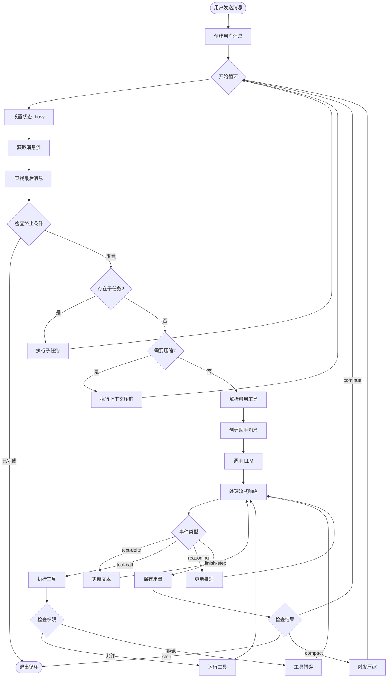

### 流处理器

`SessionProcessor` 负责处理 LLM 的流式响应：

```typescript
// packages/opencode/src/session/processor.ts
export function create(input: {
  assistantMessage: MessageV2.Assistant
  sessionID: string
  model: Provider.Model
  abort: AbortSignal
}) {
  return {
    async process(streamInput: LLM.StreamInput) {
      while (true) {
        const stream = await LLM.stream(streamInput)
        
        for await (const value of stream.fullStream) {
          switch (value.type) {
            case "start":
              SessionStatus.set(input.sessionID, { type: "busy" })
              break
              
            case "reasoning-start":
            case "reasoning-delta":
            case "reasoning-end":
              // 处理推理过程
              break
              
            case "tool-call":
              // 处理工具调用
              break
              
            case "tool-result":
              // 处理工具结果
              break
              
            case "text-delta":
              // 处理文本增量
              break
              
            case "finish-step":
              // 保存用量统计
              break
          }
        }
        
        // 决定是继续、停止还是压缩
        return "continue" | "stop" | "compact"
      }
    }
  }
}
```

---

## Agent 模式设计

### Agent 类型

OpenCode 定义了两种 Agent 模式：

| 模式 | 描述 | 使用场景 |
|------|------|----------|
| **primary** | 主 Agent，用户直接交互 | 开发、分析、规划 |
| **subagent** | 子 Agent，由主 Agent 调用 | 搜索、探索、特定任务 |

### 内置 Agent 定义

```typescript
// packages/opencode/src/agent/agent.ts
const result: Record<string, Info> = {
  // Build Agent - 完整开发能力
  build: {
    name: "build",
    mode: "primary",
    permission: PermissionNext.merge(
      defaults,
      PermissionNext.fromConfig({
        question: "allow",      // 允许提问
        plan_enter: "allow",    // 允许进入 Plan 模式
      }),
      user,
    ),
  },
  
  // Plan Agent - 只读分析
  plan: {
    name: "plan",
    mode: "primary",
    permission: PermissionNext.merge(
      defaults,
      PermissionNext.fromConfig({
        question: "allow",
        plan_exit: "allow",
        edit: {
          "*": "deny",                                    // 禁止编辑
          [".opencode/plans/*.md"]: "allow",              // 只允许编辑计划文件
        },
      }),
      user,
    ),
  },
  
  // General Subagent - 通用子任务
  general: {
    name: "general",
    description: "General-purpose agent for researching complex questions...",
    mode: "subagent",
    permission: PermissionNext.merge(
      defaults,
      PermissionNext.fromConfig({
        todoread: "deny",
        todowrite: "deny",
      }),
      user,
    ),
  },
  
  // Explore Subagent - 代码探索
  explore: {
    name: "explore",
    description: "Fast agent specialized for exploring codebases...",
    mode: "subagent",
    prompt: PROMPT_EXPLORE,
    permission: PermissionNext.merge(
      defaults,
      PermissionNext.fromConfig({
        "*": "deny",           // 默认禁止所有
        grep: "allow",         // 只允许搜索相关
        glob: "allow",
        list: "allow",
        bash: "allow",
        read: "allow",
      }),
      user,
    ),
  },
}
```

### Agent 配置 Schema

```typescript
export const Info = z.object({
  name: z.string(),                              // Agent 名称
  description: z.string().optional(),            // 描述（用于 @mention）
  mode: z.enum(["subagent", "primary", "all"]),  // 模式
  native: z.boolean().optional(),                // 是否内置
  hidden: z.boolean().optional(),                // 是否隐藏
  topP: z.number().optional(),                   // Top-P 采样
  temperature: z.number().optional(),            // 温度
  color: z.string().optional(),                  // UI 颜色
  permission: PermissionNext.Ruleset,            // 权限规则集
  model: z.object({                              // 绑定模型
    modelID: z.string(),
    providerID: z.string(),
  }).optional(),
  prompt: z.string().optional(),                 // 自定义提示词
  options: z.record(z.string(), z.any()),        // 额外选项
  steps: z.number().int().positive().optional(), // 最大步数
})
```

### Agent 模式切换

Build 和 Plan Agent 之间可以相互切换：

```typescript
// 从 Plan 切换到 Build
if (input.agent.name !== "plan" && assistantMessage?.info.agent === "plan") {
  const plan = Session.plan(input.session)
  const exists = await Bun.file(plan).exists()
  if (exists) {
    // 注入计划文件信息
    userMessage.parts.push({
      type: "text",
      text: `A plan file exists at ${plan}. You should execute on the plan defined within it`,
      synthetic: true,
    })
  }
}
```

### 模式切换流程图

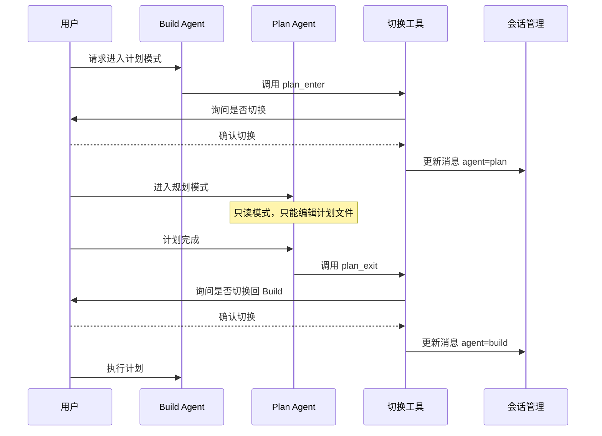

### 前端 Agent 切换

```typescript
// packages/app/src/context/local.tsx
const agent = {
  list: createMemo(() => sync.data.agent.filter((x) => x.mode !== "subagent" && !x.hidden)),
  
  current() {
    const available = list()
    return available.find((x) => x.name === store.current) ?? available[0]
  },
  
  // Tab 键切换
  move(direction: 1 | -1) {
    let next = available.findIndex((x) => x.name === store.current) + direction
    if (next < 0) next = available.length - 1
    if (next >= available.length) next = 0
    setStore("current", available[next].name)
  },
}
```

---

## 计划与 TODO 系统

OpenCode 提供两套任务管理机制：**Plan 模式**（规划阶段）和 **TODO 系统**（执行跟踪）。

### 系统概览

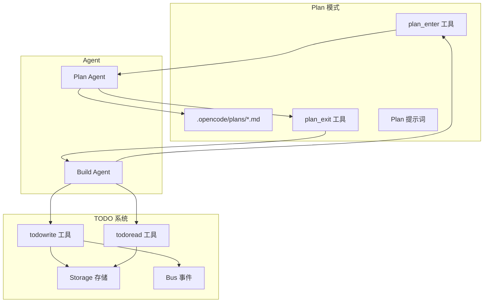

### Plan 模式详解

#### Plan 模式特点

| 特性 | 说明 |
|------|------|
| **只读限制** | 禁止 write/edit/patch/bash 等修改操作 |
| **计划文件** | 只允许编辑 `.opencode/plans/*.md` |
| **研究导向** | 专注于分析、探索和设计 |
| **用户确认** | 切换前必须用户确认 |

#### Plan 工作流程

Plan 模式遵循 5 个阶段：

```
Phase 1: 初始研究
├── 读取用户请求相关文件
├── 识别关键组件和依赖
└── 理解现有架构

Phase 2: 多角度分析
├── 使用 Task 工具并行探索
├── 收集不同实现方案
└── 评估各方案优劣势

Phase 3: 综合
├── 整合各方分析结果
├── 询问用户关于权衡取舍
└── 确定推荐方案

Phase 4: 最终计划
├── 将计划写入计划文件
├── 包含关键文件路径
└── 包含验证步骤

Phase 5: 调用 plan_exit
├── 询问用户是否开始实施
└── 切换到 Build 模式
```

#### plan_enter 工具实现

```typescript
// packages/opencode/src/tool/plan.ts
export const PlanEnterTool = Tool.define("plan_enter", {
  description: ENTER_DESCRIPTION,
  parameters: z.object({}),
  async execute(_params, ctx) {
    // 1. 询问用户是否切换
    const answers = await Question.ask({
      sessionID: ctx.sessionID,
      questions: [{
        question: `Would you like to switch to the plan agent?`,
        header: "Plan Mode",
        options: [
          { label: "Yes", description: "Switch to plan agent for research" },
          { label: "No", description: "Stay with build agent" },
        ],
      }],
    })
    
    if (answers[0]?.[0] === "No") throw new Question.RejectedError()
    
    // 2. 创建新消息切换到 Plan Agent
    const userMsg: MessageV2.User = {
      id: Identifier.ascending("message"),
      sessionID: ctx.sessionID,
      role: "user",
      agent: "plan",  // 关键：设置 agent 为 plan
      model,
    }
    await Session.updateMessage(userMsg)
    
    return {
      title: "Switching to plan agent",
      output: `Plan file will be at ${plan}. Begin planning.`,
    }
  },
})
```

#### plan_exit 工具实现

```typescript
export const PlanExitTool = Tool.define("plan_exit", {
  description: EXIT_DESCRIPTION,
  parameters: z.object({}),
  async execute(_params, ctx) {
    // 1. 询问用户是否切换到 Build
    const answers = await Question.ask({
      sessionID: ctx.sessionID,
      questions: [{
        question: `Plan is complete. Switch to build agent?`,
        header: "Build Agent",
        options: [
          { label: "Yes", description: "Start implementing the plan" },
          { label: "No", description: "Continue refining the plan" },
        ],
      }],
    })
    
    if (answers[0]?.[0] === "No") throw new Question.RejectedError()
    
    // 2. 创建新消息切换到 Build Agent
    const userMsg: MessageV2.User = {
      id: Identifier.ascending("message"),
      sessionID: ctx.sessionID,
      role: "user",
      agent: "build",  // 关键：设置 agent 为 build
      model,
    }
    await Session.updateMessage(userMsg)
    
    return {
      title: "Switching to build agent",
      output: "Ready to implement the plan.",
    }
  },
})
```

#### Plan 模式提示词注入

进入 Plan 模式时，系统会注入严格的只读约束：

```typescript
// packages/opencode/src/session/prompt.ts
if (input.agent.name === "plan" && assistantMessage?.info.agent !== "plan") {
  const plan = Session.plan(input.session)
  const exists = await Bun.file(plan).exists()
  
  const part = await Session.updatePart({
    type: "text",
    text: `<system-reminder>
Plan mode is active. You MUST NOT make any edits, run any non-readonly tools,
or otherwise make any changes to the system.

## Plan File Info:
${exists 
  ? `A plan file already exists at ${plan}. Read it and make edits.`
  : `No plan file exists. Create your plan at ${plan}.`
}

NOTE: This is the only file you are allowed to edit.
</system-reminder>`,
    synthetic: true,
  })
}
```

### TODO 系统详解

#### TODO 数据模型

```typescript
// packages/opencode/src/session/todo.ts
export namespace Todo {
  export const Info = z.object({
    id: z.string().describe("Unique identifier"),
    content: z.string().describe("Brief description of the task"),
    status: z.string().describe("pending | in_progress | completed | cancelled"),
    priority: z.string().describe("high | medium | low"),
  })
  export type Info = z.infer<typeof Info>
}
```

#### TODO 状态机

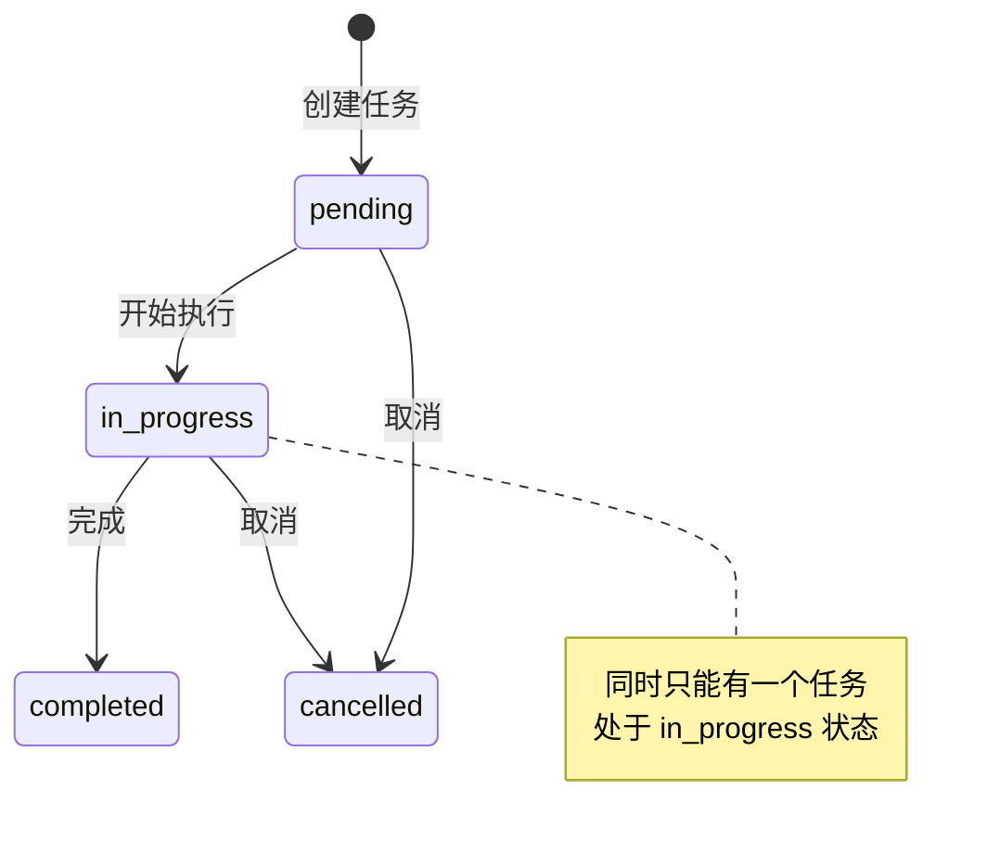

#### todowrite 工具

```typescript
// packages/opencode/src/tool/todo.ts
export const TodoWriteTool = Tool.define("todowrite", {
  description: DESCRIPTION_WRITE,
  parameters: z.object({
    todos: z.array(z.object(Todo.Info.shape))
      .describe("The updated todo list"),
  }),
  async execute(params, ctx) {
    // 更新 TODO 列表
    await Todo.update({
      sessionID: ctx.sessionID,
      todos: params.todos,
    })
    
    return {
      title: `${params.todos.filter((x) => x.status !== "completed").length} todos`,
      output: JSON.stringify(params.todos, null, 2),
      metadata: { todos: params.todos },
    }
  },
})
```

#### todoread 工具

```typescript
export const TodoReadTool = Tool.define("todoread", {
  description: "Use this tool to read your todo list",
  parameters: z.object({}),
  async execute(_params, ctx) {
    const todos = await Todo.get(ctx.sessionID)
    return {
      title: `${todos.filter((x) => x.status !== "completed").length} todos`,
      metadata: { todos },
      output: JSON.stringify(todos, null, 2),
    }
  },
})
```

#### TODO 存储与事件

```typescript
// packages/opencode/src/session/todo.ts
export namespace Todo {
  export const Event = {
    Updated: BusEvent.define("todo.updated", z.object({
      sessionID: z.string(),
      todos: z.array(Info),
    })),
  }

  export async function update(input: { sessionID: string; todos: Info[] }) {
    // 持久化到 Storage
    await Storage.write(["todo", input.sessionID], input.todos)
    // 广播更新事件
    Bus.publish(Event.Updated, input)
  }

  export async function get(sessionID: string) {
    return Storage.read<Info[]>(["todo", sessionID])
      .then((x) => x || [])
      .catch(() => [])
  }
}
```

### TODO 使用最佳实践

提示词中的 TODO 指导（来自 `anthropic.txt`）：

```
# Task Management
You have access to the TodoWrite tools to help you manage and plan tasks.
Use these tools VERY frequently to ensure that you are tracking your tasks.

It is critical that you mark todos as completed as soon as you are done.
Do not batch up multiple tasks before marking them as completed.

## Example:
user: Run the build and fix any type errors
assistant: I'm going to use the TodoWrite tool to write:
- Run the build
- Fix any type errors

I'm now going to run the build using Bash.

Looks like I found 10 type errors. Adding 10 items to the todo list.

marking the first todo as in_progress...
The first item has been fixed, marking as completed...
```

### 何时使用 Plan vs TODO

| 场景 | 推荐 | 原因 |
|------|------|------|
| 复杂架构决策 | Plan 模式 | 需要研究和设计 |
| 多文件修改 | Plan 模式 | 需要全局规划 |
| 简单多步任务 | TODO 系统 | 跟踪执行进度 |
| Bug 修复 | TODO 系统 | 直接执行 |
| 用户要求规划 | Plan 模式 | 明确要求规划 |
| 日常开发 | TODO 系统 | 任务拆分 |

### Plan 与 TODO 的協作

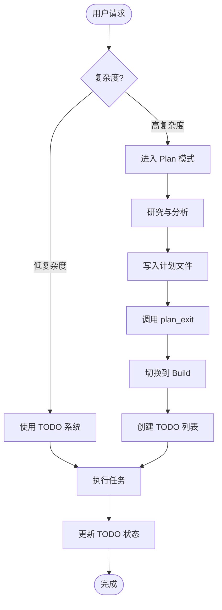

---

## 工具系统

### 工具注册表

工具通过 `ToolRegistry` 统一管理：

```typescript
// packages/opencode/src/tool/registry.ts
export namespace ToolRegistry {
  // 内置工具列表
  async function all(): Promise<Tool.Info[]> {
    const custom = await state().then((x) => x.custom)
    
    return [
      InvalidTool,           // 无效工具（用于错误处理）
      QuestionTool,          // 提问工具
      BashTool,              // Shell 执行
      ReadTool,              // 文件读取
      GlobTool,              // 文件匹配
      GrepTool,              // 内容搜索
      EditTool,              // 文件编辑
      WriteTool,             // 文件写入
      TaskTool,              // 子任务
      WebFetchTool,          // 网页获取
      TodoWriteTool,         // TODO 写入
      TodoReadTool,          // TODO 读取
      WebSearchTool,         // 网络搜索
      CodeSearchTool,        // 代码搜索
      SkillTool,             // 技能加载
      ...custom,             // 自定义工具
    ]
  }
  
  // 获取特定 Agent 的工具
  export async function tools(providerID: string, agent?: Agent.Info) {
    const tools = await all()
    return tools.map(async (t) => ({
      id: t.id,
      ...(await t.init({ agent })),
    }))
  }
}
```

### 工具定义结构

```typescript
// packages/opencode/src/tool/tool.ts
export type Context<M extends Metadata = Metadata> = {
  sessionID: string
  messageID: string
  agent: string
  abort: AbortSignal
  callID?: string
  extra?: { [key: string]: any }
  metadata(input: { title?: string; metadata?: M }): void
  ask(input: Omit<PermissionNext.Request, "id" | "sessionID" | "tool">): Promise<void>
}

export type Info = {
  id: string
  init: (ctx?: { agent?: Agent.Info }) => Promise<{
    parameters: z.ZodType<any>
    description: string
    execute: (args: any, ctx: Context) => Promise<{
      title: string
      output: string
      metadata?: any
      attachments?: MessageV2.FilePart[]
    }>
  }>
}
```

### 工具执行流程

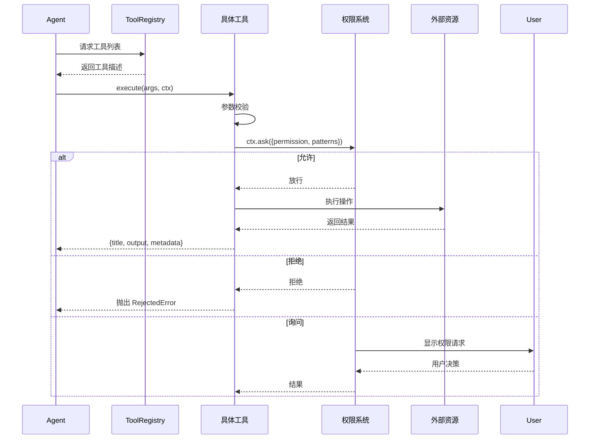

### 内置工具一览

| 工具 ID | 文件 | 功能 |
|---------|------|------|
| `bash` | `bash.ts` | 执行 Shell 命令 |
| `read` | `read.ts` | 读取文件内容 |
| `edit` | `edit.ts` | 编辑文件（搜索替换） |
| `write` | `write.ts` | 写入/创建文件 |
| `glob` | `glob.ts` | 文件模式匹配 |
| `grep` | `grep.ts` | 正则搜索文件内容 |
| `task` | `task.ts` | 启动子 Agent 任务 |
| `question` | `question.ts` | 向用户提问 |
| `webfetch` | `webfetch.ts` | 获取网页内容 |
| `websearch` | `websearch.ts` | 网络搜索 |
| `codesearch` | `codesearch.ts` | 语义代码搜索 |
| `todoread` | `todo.ts` | 读取 TODO 列表 |
| `todowrite` | `todo.ts` | 更新 TODO 列表 |
| `skill` | `skill.ts` | 加载技能文件 |

### 自定义工具开发

在 `.opencode/tool/` 目录下创建工具：

```typescript
// .opencode/tool/my-tool.ts
import { tool } from "@opencode-ai/plugin"

export default tool({
  description: "My custom tool",
  args: {
    input: tool.schema.string().describe("Input parameter"),
  },
  async execute(args, context) {
    // 请求权限
    await context.ask({
      permission: "my-tool",
      patterns: [args.input],
      always: ["*"],
      metadata: { input: args.input },
    })
    
    // 执行逻辑
    const result = `Processed: ${args.input}`
    
    // 更新元数据
    context.metadata({
      title: "My Tool Result",
      metadata: { processed: true },
    })
    
    return result
  },
})
```

---

## 权限控制

### 权限系统架构

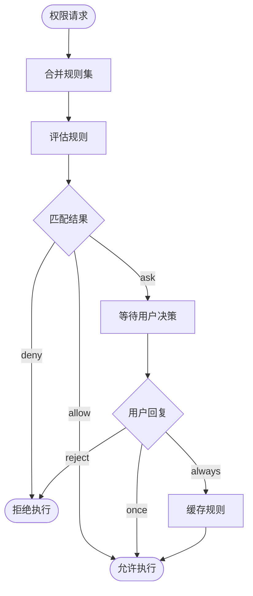

### 权限规则定义

```typescript
// packages/opencode/src/permission/next.ts
export const Rule = z.object({
  permission: z.string(),                    // 权限类型
  pattern: z.string(),                       // 匹配模式（支持通配符）
  action: z.enum(["allow", "deny", "ask"]),  // 动作
})

export type Ruleset = Rule[]

// 规则合并示例
const defaults = PermissionNext.fromConfig({
  "*": "allow",                    // 默认允许所有
  doom_loop: "ask",                // 循环检测需要确认
  external_directory: {
    "*": "ask",                    // 外部目录需要确认
  },
  read: {
    "*": "allow",
    "*.env": "ask",                // .env 文件需要确认
    "*.env.*": "ask",
    "*.env.example": "allow",
  },
})
```

### 权限配置方式

**1. 全局配置 (opencode.json)**

```json
{
  "permission": {
    "edit": "allow",
    "bash": {
      "*": "ask",
      "git *": "allow",
      "git push *": "deny"
    }
  }
}
```

**2. Agent 级别配置**

```json
{
  "agent": {
    "build": {
      "permission": {
        "bash": {
          "rm *": "deny"
        }
      }
    }
  }
}
```

**3. Markdown Agent 配置**

```markdown
---
description: Code reviewer
mode: subagent
permission:
  edit: deny
  bash:
    "*": ask
    "git diff": allow
---

You are a code reviewer...
```

### 权限评估逻辑

```typescript
// 评估单个权限
export function evaluate(
  permission: string,
  pattern: string,
  ruleset: Ruleset
): Rule {
  // 按顺序匹配规则，最后匹配的规则生效
  let matched: Rule | undefined
  for (const rule of ruleset) {
    if (rule.permission !== permission) continue
    if (minimatch(pattern, rule.pattern)) {
      matched = rule
    }
  }
  return matched ?? { permission, pattern, action: "allow" }
}

// 获取被禁用的工具
export function disabled(tools: string[], ruleset: Ruleset): Set<string> {
  const result = new Set<string>()
  for (const tool of tools) {
    const rule = evaluate(tool, "*", ruleset)
    if (rule.action === "deny") {
      result.add(tool)
    }
  }
  return result
}
```

---

## 提示词系统

### 提示词组成结构

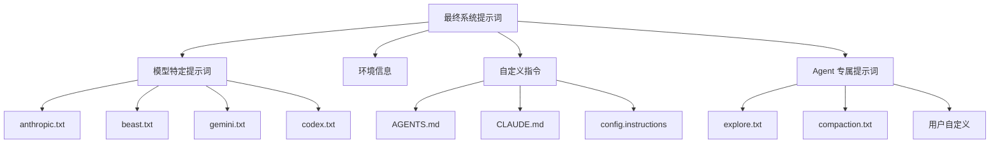

### 模型特定提示词选择

```typescript
// packages/opencode/src/session/system.ts
export function provider(model: Provider.Model) {
  if (model.api.id.includes("gpt-5")) return [PROMPT_CODEX]
  if (model.api.id.includes("gpt-") || model.api.id.includes("o1") || model.api.id.includes("o3"))
    return [PROMPT_BEAST]
  if (model.api.id.includes("gemini-")) return [PROMPT_GEMINI]
  if (model.api.id.includes("claude")) return [PROMPT_ANTHROPIC]
  return [PROMPT_ANTHROPIC_WITHOUT_TODO]
}
```

### 提示词文件位置

| 文件 | 大小 | 用途 |
|------|------|------|
| `session/prompt/anthropic.txt` | 8KB | Claude 模型 |
| `session/prompt/beast.txt` | 10.8KB | GPT/O1/O3 模型 |
| `session/prompt/gemini.txt` | 15KB | Gemini 模型 |
| `session/prompt/codex.txt` | 23.6KB | GPT-5 模型 |
| `session/prompt/qwen.txt` | 9.5KB | Qwen/其他模型 |
| `session/prompt/plan.txt` | 1.4KB | Plan 模式 |
| `agent/prompt/explore.txt` | 0.9KB | Explore Agent |
| `agent/prompt/compaction.txt` | 0.6KB | 上下文压缩 |

### 自定义提示词

**1. AGENTS.md 文件**

```
~/.config/opencode/AGENTS.md     # 全局
./AGENTS.md                       # 项目根目录
./.opencode/AGENTS.md            # 项目配置目录
```

**2. 配置文件指定**

```json
{
  "instructions": [
    "./prompts/custom.txt",
    "https://example.com/instructions.md"
  ]
}
```

**3. Agent 级别**

```json
{
  "agent": {
    "build": {
      "prompt": "你是一个专注于安全的开发助手..."
    }
  }
}
```

---

## 扩展指南

### 创建自定义 Agent

**方式 1：Markdown 文件**

```markdown
<!-- .opencode/agent/security-reviewer.md -->
---
description: Security-focused code reviewer
mode: subagent
model: anthropic/claude-sonnet-4-20250514
temperature: 0.1
permission:
  edit: deny
  bash:
    "*": deny
---

You are a security expert. Focus on:
- SQL injection vulnerabilities
- XSS attacks
- Authentication issues
- Data exposure risks
```

**方式 2：JSON 配置**

```json
{
  "agent": {
    "security-reviewer": {
      "description": "Security-focused code reviewer",
      "mode": "subagent",
      "model": "anthropic/claude-sonnet-4-20250514",
      "temperature": 0.1,
      "prompt": "You are a security expert...",
      "permission": {
        "edit": "deny"
      }
    }
  }
}
```

**方式 3：命令行生成**

```bash
opencode agent create
```

### 创建自定义工具

```typescript
// .opencode/tool/database-query.ts
import { tool } from "@opencode-ai/plugin"

export default tool({
  description: "Execute a read-only database query",
  args: {
    query: tool.schema.string().describe("SQL query to execute"),
    database: tool.schema.string().optional().describe("Database name"),
  },
  async execute(args, context) {
    // 请求权限
    await context.ask({
      permission: "database-query",
      patterns: [args.query],
      always: ["SELECT *"],
      metadata: { query: args.query },
    })
    
    // 更新状态
    context.metadata({
      title: `Query: ${args.database ?? 'default'}`,
    })
    
    // 执行查询（示例）
    const result = await executeQuery(args.query, args.database)
    
    return JSON.stringify(result, null, 2)
  },
})
```

### 开发调试

```bash
# 查看 Agent 配置
opencode agent list

# 调试特定 Agent
opencode debug agent build

# 测试工具
opencode debug agent build --tool edit --params '{"filePath": "test.txt"}'

# 运行测试
cd packages/opencode
bun test
```

---

## Memory 管理

OpenCode 采用 **多层记忆架构** 管理上下文和用户偏好：

### 记忆层级

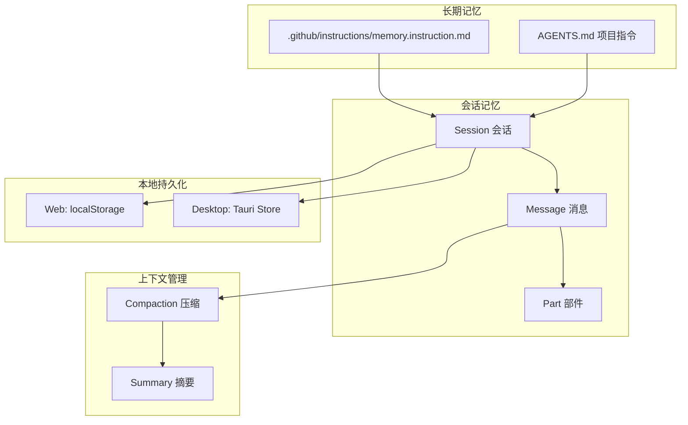

### 记忆类型

| 层级 | 存储位置 | 用途 | 生命周期 |
|------|----------|------|----------|
| **用户偏好** | `.github/instructions/memory.instruction.md` | 长期记忆、用户习惯 | 永久 |
| **项目指令** | `AGENTS.md` / `.opencode/AGENTS.md` | 项目级定制指令 | 永久 |
| **会话历史** | Session + Message | 当前对话上下文 | 会话期间 |
| **上下文压缩** | Compaction | 长对话自动摘要 | 压缩后替换 |
| **本地缓存** | localStorage / Tauri Store | 草稿、历史记录 | 本地持久 |

### 用户偏好记忆

用户可以让 Agent 记住特定信息，存储在 memory 文件中：

```markdown
<!-- .github/instructions/memory.instruction.md -->
---
applyTo: '**'
---

## 用户偏好

- 喜欢使用 TypeScript
- 代码注释用中文
- 测试框架使用 Vitest
```

提示词中的相关指令（来自 `beast.txt`）：

```
# Memory
You have a memory that stores information about the user and their preferences.
The memory is stored in `.github/instructions/memory.instruction.md`.
If the user asks you to remember something, update the memory file.
```

### 上下文压缩 (Compaction)

当对话过长时，系统会自动压缩上下文：

```typescript
// packages/opencode/src/session/compaction.ts
export async function process(input: {
  parentID: string
  messages: MessageV2.WithParts[]
  sessionID: string
  auto: boolean
}) {
  // 生成摘要提示
  const promptText = 
    "提供一个详细的提示用于继续我们的对话。" +
    "关注有助于继续对话的信息，包括我们做了什么、" +
    "正在做什么、处理哪些文件、以及接下来要做什么。"
  
  // 调用 LLM 生成摘要
  const result = await processor.process({
    messages: [...input.messages, { role: "user", content: promptText }],
  })
}
```

压缩流程：

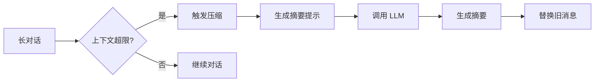

### 本地持久化

```typescript
// packages/app/src/utils/persist.ts
function localStorageWithPrefix(prefix: string): SyncStorage {
  const base = `${prefix}:`
  return {
    getItem: (key) => localStorage.getItem(base + key),
    setItem: (key, value) => localStorage.setItem(base + key, value),
    removeItem: (key) => localStorage.removeItem(base + key),
  }
}
```

持久化内容：
- **提示草稿**：编辑中的输入内容
- **历史记录**：最近使用的提示词
- **会话列表**：本地会话索引
- **用户设置**：界面偏好设置

### 记忆最佳实践

1. **长期记忆**：将重要偏好写入 `memory.instruction.md`
2. **项目级指令**：使用 `AGENTS.md` 定义项目规范
3. **会话管理**：定期压缩长对话避免上下文溢出
4. **隐私保护**：敏感信息不应写入记忆文件

---

## 参考资料

- [Agent 定义源码](../packages/opencode/src/agent/agent.ts)
- [主循环源码](../packages/opencode/src/session/prompt.ts)
- [工具注册表源码](../packages/opencode/src/tool/registry.ts)
- [权限系统源码](../packages/opencode/src/permission/next.ts)
- [官方文档 - Agents](https://opencode.ai/docs/agents)
- [官方文档 - Tools](https://opencode.ai/docs/tools)
- [官方文档 - Permissions](https://opencode.ai/docs/permissions)
