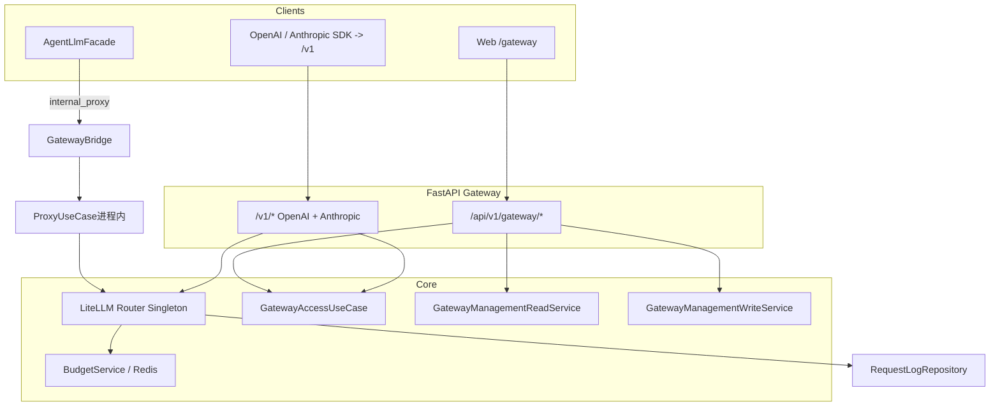

# AI Gateway 领域架构与工程实践

> **适用范围**：`domains/gateway`、`domains/tenancy`（团队/成员权威）、`domains/gateway/application`（内部桥接端口与辅助）、**OpenAI 兼容与 Anthropic Messages（`/v1/*`）** 对外入口、管理 API、内部 LLM 桥接及相关前端。  
> **更新说明**：LiteLLM 选型见 [LLM_GATEWAY_ARCHITECTURE.md](./LLM_GATEWAY_ARCHITECTURE.md)；兼容性见 [GATEWAY_COMPATIBILITY_CHECK.md](./GATEWAY_COMPATIBILITY_CHECK.md)；Claude Code / Cursor 适配见 [GATEWAY_CURSOR_CLAUDE_CODE.md](./GATEWAY_CURSOR_CLAUDE_CODE.md)。

---

## 1. 架构定位

| 维度 | 说明 |
|------|------|
| **业务目标** | 统一多模型调用入口（LiteLLM Router）、团队/虚拟 Key、凭据池、预算与限流、可观测（日志/告警/rollup）。 |
| **边界** | **Inbound**：根路径 **`/v1/*`** —— **OpenAI 兼容**（如 `POST /v1/chat/completions`）与 **Anthropic Messages**（`POST /v1/messages`）；鉴权为 **`Authorization: Bearer`** 或 **`x-api-key`**（Bearer 优先），令牌为 **`sk-gw-*` 虚拟 Key** 或带 **`gateway:proxy`** scope 且命中 **Gateway grant** 的 **`sk-*`**（后者的 **`X-Team-Id`** 只用于选择已授权团队）。**管理面**：`/api/v1/gateway/*`（JWT + 团队上下文）。**Outbound**：各 Provider HTTP API（由 LiteLLM 发起）。 |
| **与 Agent 域关系** | Agent 通过 `AgentLlmFacade` + `GatewayProxyProtocol`（`domains/gateway/application/ports.py`）可走内部桥接，归因到 personal team 与系统 vkey 池。 |

---

## 2. 分层结构（DDD + CQRS）

```
domains/tenancy/                  # 团队与成员：权威 ORM 与 TeamService（Gateway / Identity 经此域）
├── application/
│   ├── team_service.py
│   └── management_team_resolve_use_case.py  # 管理面团队上下文（MembershipPort）
├── domain/management_context.py   # ManagementTeamContext；`gateway.domain.types` 再导出以保持既有 import
├── presentation/
│   ├── team_dependencies.py       # CurrentTeam / RequiredTeam*（管理面依赖）
│   ├── teams_router.py            # /teams* HTTP（前缀在 bootstrap 挂载为 /api/v1/gateway）
│   └── schemas/teams.py
└── infrastructure/
    ├── membership_adapter.py      # MembershipPort 实现
    ├── models/team.py
    └── repositories/team_repository.py

domains/gateway/
├── presentation/                 # HTTP：路由、Schema、依赖；禁止直连仓储
│   ├── http_error_map.py       # 领域异常 → HTTPException
│   ├── deps.py                 # 鉴权：GatewayAccessUseCase；Bearer / x-api-key
│   ├── openai_compat_router.py # /v1/chat/completions 等 OpenAI 形
│   ├── anthropic_compat_router.py  # POST /v1/messages Anthropic 形
│   └── gateway_proxy_context.py    # 对外代理共用 ProxyContext 构造
├── application/
│   ├── gateway_access_use_case.py   # Bearer vkey、代理团队解析、vkey touch；成员角色经 MembershipPort
│   ├── ports.py                     # GatewayProxyProtocol、GatewayCallContext（跨域依赖倒置）
│   ├── gateway_proxy_factory.py     # get_gateway_proxy() → GatewayBridge 单例
│   ├── internal_bridge_actor.py     # resolve_internal_gateway_user_id / team_id
│   ├── bridge_attribution.py        # GatewayBridgeAttribution（内部桥接计费团队 BillingTeam）
│   ├── litellm_bridge_payload.py    # LiteLLM kwargs → 桥接参数拆分
│   ├── internal_bridge.py           # GatewayBridge 实现
│   ├── anthropic_native_adapt.py    # Anthropic 原生响应/SSE 适配（/v1/messages）
│   ├── proxy_chat_pipeline.py       # chat / messages 共用入站流水线
│   ├── proxy_stream_settlement.py   # 流式结束 token + 成本兜底结算
│   ├── proxy_metadata_builder.py    # 代理 metadata / 归因 / 下游定价注入
│   ├── proxy_litellm_client.py      # LiteLLM Router 与内部直连适配
│   ├── proxy_response_adapter.py    # 响应适配、成本计算、预算/套餐结算
│   ├── proxy_deferred_tasks.py      # 代理后台结算任务登记与关闭收口
│   ├── management/                # 管理面读写分包（与 CQRS 读/写侧对应）
│   │   ├── reads.py               # GatewayManagementReadService
│   │   ├── writes.py              # GatewayManagementWriteService
│   │   ├── usage_reads.py         # GatewayUsageReadService（兼容用量 API）
│   │   ├── ports.py               # 管理面子域出站端口（如 UpstreamModelListPort）
│   │   └── credential_upstream_catalog.py  # 凭据上游探测与批量导入编排
│   ├── proxy_use_case.py          # 对外 LLM 代理编排门面（OpenAI / Anthropic / 多能力）
│   └── jobs.py                    # 后台循环；rollup SQL 在 infrastructure 仓储
├── domain/                       # 类型、虚拟 Key 算法、领域错误、proxy_policy、credential_probe、upstream_catalog_policy
└── infrastructure/             # ORM、仓储、Router 单例、回调、护栏
    └── models/__init__.py        # 只再导出 Gateway 域 ORM；Team / TeamMember 权威定义在 tenancy

domains/gateway/domain/usage_read_model.py  # UsageAggregation（管理面日志/大盘读模型）
domains/agent/infrastructure/llm/agent_llm_facade.py   # AgentLlmFacade
```

**依赖方向**

- `presentation → application（UseCase + 管理面 management 读写服务）→ domain`
- `infrastructure` 由 application 经仓储调用；**禁止** domain 依赖 infrastructure。
- **团队与成员**：`domains.gateway.application` 使用 `domains.tenancy` 的 `TeamService` / `TeamRepository` 与 `Team` ORM；**成员角色**经 `libs.iam.tenancy.MembershipPort`（默认 `TenancyMembershipAdapter`），**禁止**在 Gateway 应用层直接使用 `TeamMemberRepository`。`gateway.infrastructure.models` 不再再导出 `Team` / `TeamMember`；Alembic 需要注册团队 ORM 时应直接从 `domains.tenancy.infrastructure.models.team` 显式导入。团队管理 HTTP 在 `domains.tenancy.presentation.teams_router`（仅依赖 `TeamService` 与 identity 依赖，**不**引用 `domains.gateway.application`）。
- **可映射 HTTP 的领域错误**：`TeamNotFoundError`、`TeamPermissionDeniedError`、`PersonalTeamNotInitializedError` 与基类 `HttpMappableDomainError` 定义在 **`libs.exceptions`**；`libs/iam/team_http.map_team_access_exception_to_http` 负责上述团队错误的 HTTP 映射。`GatewayError` 继承 `HttpMappableDomainError`；`gateway.presentation.http_error_map` 先委托团队映射再处理其余 Gateway 异常。`tenancy.presentation.team_dependencies` **不**依赖 `domains.gateway.presentation`。

**CQRS（管理面）**

- `/api/v1/gateway/*` 的 **读** → `GatewayManagementReadService`；**写** → `GatewayManagementWriteService`。路由与 `deps` 不 `new *Repository`。

**UseCase 与 CQRS**

- **UseCase**：按场景端到端（如 `ProxyUseCase`、`GatewayAccessUseCase`），可多次读、少量写。
- **CQRS 拆分**：适合管理面 CRUD 大、读写易分叉；鉴权 + `touch` 收拢为 `GatewayAccessUseCase`，不为单行写单独建 Command 文件。

**ProxyUseCase 热路径边界**

- `ProxyUseCase` 仅作为 `/v1/*` 场景门面：负责选择能力入口、维护调用上下文、串联
  preflight、metadata、LiteLLM 调用和响应结算。**禁止**在文件顶层重新加「兼容再导出」
  别名（如 `_settle_usage`、`_enrich_*`、`register_proxy_deferred_task`）；旧调用方
  应直接 import 真实模块。
- **纯领域策略**进入 `domain/proxy_policy.py`：
  - `assert_model_allowed` / `assert_capability_allowed`：调用令牌白名单
  - `assert_registered_model_capability`：注册模型 capability 与 HTTP 入口匹配
  - `budget_scope_targets`：team / user / key 三级预算归属
  - `budget_model_keys`：全模型汇总行 + 可选模型专属行
  - `BudgetCheckQuery` + `build_budget_check_plan`：单次代理调用要扫描的全部预算坐标
  - `rate_limit_target`：限流计数目标（vkey / platform_api_key_grant）
  - `first_present_limit`：错误文案的首个非空 limit
- **应用协作服务**按变化原因拆分：
  - `proxy_metadata_builder.py` —— Gateway metadata、归因、下游单价 kwargs
  - `proxy_litellm_client.py` —— LiteLLM Router / 内部直连技术适配
  - `proxy_response_adapter.py` —— 响应适配、`response_cost` 注入、预算/套餐结算
  - `proxy_deferred_tasks.py` —— fire-and-forget 结算任务登记 + shutdown 收口
  - `proxy_chat_pipeline.py` / `proxy_stream_settlement.py` —— Chat/Anthropic 流水线
- 新增代理能力时优先扩展上述协作模块或新增同级模块，**不要**把完整规则塞回
  `ProxyUseCase` 私有方法。Code review 必须显式回答「新规则落在 domain 还是 application」。

**术语对照（Query / Command 与业务命名）**

| 工程/CQRS 惯用名 | 类名（业务语感） | 说明 |
|------------------|------------------|------|
| Query 侧（只读） | `GatewayManagementReadService` | 管理 API 列表/详情/聚合读模型 |
| Command 侧（变更） | `GatewayManagementWriteService` | 管理 API 创建/更新/删除 |
| 用量只读（兼容层） | `GatewayUsageReadService` | Identity `/usage/*` 等，不暴露 Gateway ORM |

实现分包目录为 `application/management/`（`reads.py` / `writes.py` / `usage_reads.py`），与「Query/Command」一一对应，便于团队沟通时口头用「管理读服务 / 管理写服务」指代两侧。

**凭据上游列举与批量导入（管理面）**

- **编排**：`application/management/credential_upstream_catalog.py` 中的 `CredentialUpstreamCatalogService` —— 读取凭据、解密 API Key（失败则返回 `support="error"` 且**不**出站请求）、调用上游列举、将个人/团队模型批量写入 `GatewayManagementWriteService`（单行失败记入 `failed`，预期领域错误经 `ValidationError` / `HttpMappableDomainError` 映射为用户可读 `reason`；未预期异常记日志并返回通用文案）。
- **出站端口**：`application/management/ports.py` 中的 `UpstreamModelListPort` / `RawUpstreamListResult`（与跨域 `application/ports.py` 的代理桥接契约区分）；默认实现为 `infrastructure/upstream/openai_compatible_model_list_adapter.py`。
- **纯策略**：`domain/upstream_catalog_policy.py` 的 `resolve_openai_compatible_models_list_url`（无 I/O）；探测结果值对象在 `domain/credential_probe.py`。
- **HTTP**：`presentation/management_router.py` —— `POST /api/v1/gateway/credentials/{credential_id}/probe`、`POST /api/v1/gateway/my-credentials/{credential_id}/probe`；`POST .../batch-import-models`（团队与个人各一路径）。响应体由路由层将 `CredentialProbeResult` 映射为 `schemas/credential_upstream_catalog.py` 中的 Pydantic 模型（presentation 不依赖 `from_result` 之类跨层捷径）。

**后台任务**：`jobs.py` 调度；rollup 实现在 `infrastructure/repositories/metrics_rollup_repository.py`。

---

## 3. 运行时拓扑（简化）



说明：**`GatewayBridge` 不经过 HTTP 再打 `/v1`**，而是在同一进程内 `AsyncSession` 上直接调用 `ProxyUseCase`，与 OpenAI 兼容路由共享同一套代理与计量逻辑；上图单独画出 `V1` 表示外部客户端入口，与内部桥并列。

### 3.1 本地开发与运行模式

| 模式 | 依赖 | 行为 |
|------|------|------|
| **完整 Gateway（默认，对齐生产）** | 已执行 gateway 相关 DB 迁移；Redis 可用（Router 冷却/共享）；请求内能解析归因 `user_id` **或** 配置了委派 UUID | `AgentLlmFacade` / `APIEmbedding` **仅**经 `GatewayBridge` → `ProxyUseCase`，写入请求日志与预算链路；桥接异常**向上抛出**，无静默直连 LiteLLM 回退。 |
| **纯本地向量（FastEmbed）** | 安装 `fastembed` | `EmbeddingService(provider="local")` 不经 Gateway，无供应商 API，属刻意设计。 |

**无注册用户上下文**：若未配置 `gateway_internal_proxy_delegate_user_id`，`AgentLlmFacade.chat` / `APIEmbedding` 在调用前会 `RuntimeError`（无法归因），而非静默直连。

**推荐**：CI 或合并前至少保留 `tests/architecture/` 与 `tests/integration/api/test_gateway_bridge_attribution.py` 回归，避免桥接归因代码腐烂。

---

## 4. 认证与团队上下文

| 入口 | 鉴权 | 团队 |
|------|------|------|
| `/v1/*` | `sk-gw-*` 或 `sk-*` + `gateway:proxy` + Gateway grant；**`Authorization: Bearer`** 或 **`x-api-key`**（Bearer 优先） | **`sk-gw-*`**：创建时已绑定 `gateway_virtual_keys.tenant_id`，**勿传** `X-Team-Id`（传入且与 Key 团队不一致时 **400**）；**`sk-*`**：`X-Team-Id` 仅能从该 Key 已授权的 grant 中选择，缺省优先 personal grant |
| `/api/v1/gateway/teams/{team_id}/*` | JWT（`RequiredAuthUser`），匿名 **401** | **路径 `team_id` 优先**于 `X-Team-Id`；缺省 personal team |
| `/api/v1/gateway/my-*` | JWT | 用户域（BYOK / 个人模型），**无**团队路径 |
| Agent `/api/v1/chat` | JWT / 匿名 | 可选请求体 `gateway_team_id` 写入 `PermissionContext`（内部 Gateway 桥接归账） |

RBAC 与 `libs/db/permission_context.py`：`deps.py` 调用 **`GatewayAccessUseCase`**。

**入口凭据 vs 存储 `tenant_id`**：业务表 `tenant_id` 是行级归属键；代理面 `sk-gw-*` 对调用方是「一个 token 即完整上下文」，解析后仍展开为 `team_id` + `vkey_id` 等正交字段，并非重复标识。

### 4.1 域划分、术语与用量读模型（`UsageAggregation`）

| 域 / 层 | 职责 | 与本节相关类型 |
|---------|------|----------------|
| **Tenancy** | `Team`（`kind=personal|shared`）、成员、`ManagementTeamContext`；**personal team 仍是 `Team` 表的一行**，用户通过成员关系属于该团队。 | `Team.id` 可作为当前团队 ID。 |
| **Gateway 管理读** | 请求日志列表/详情/大盘摘要的**切片维度**；**不**改变 Tenancy 实体。 | `UsageAggregation`（`domains/gateway/domain/usage_read_model.py`）。 |
| **Identity** | JWT 主体 `user_id`。 | 与 `usage_aggregation=user` 聚合键一致。 |
| **Gateway 应用（内部桥接）** | `GatewayCallContext`、`GatewayBridgeAttribution`：内部桥接的 **Actor** 与 **计费团队**（BillingTeam，日志 `team_id`）。 | 与 HTTP `usage_aggregation` **正交**（桥接不携带该查询参数）。 |

**`usage_aggregation`（查询参数，默认 `workspace`）**

| 取值 | 产品文案 | 含义 |
|------|---------|------|
| `workspace` | **团队** | 按 **`X-Team-Id` → CurrentTeam.team_id`** 过滤/聚合；该 ID 可为 **personal** 或 **shared** 团队。 |
| `user` | **我** | 按当前登录 **`user_id`** 跨团队聚合/过滤（与日志行 `user_id` 对齐）；**不**表示「无团队用户」。 |

**前端 ScopeTab 与 Team.kind 对齐**：前端 URL `?tab=` 使用 `personal | shared` 字面量与后端 `Team.kind` 完全对齐；旧 `?tab=team` 由 `parseScopeTab` 自动兼容映射至 `shared`。注意 `pages/gateway/budgets.tsx` 中 `<SelectItem value="team">` 是 `BudgetScope.team`（预算归属层级），与 ScopeTab 无关。

**与预算 `BudgetUpsert.scope`（`system|team|key|user`）正交**：后者表示预算作用域类型，禁止与 `UsageAggregation` 混用同一组字面量。`UsageAggregation` 字面量保留 `workspace` 而非改为 `team`，正是为了在 URL/JSON 上下文与 `BudgetScope.team` 独立解析（详见 `domains/gateway/domain/types.py` 的 `BudgetScope` docstring）。

**Stage 2 起**：仓储层（`RequestLogRepository`）按 `UsageAxis` 值对象统一访问 `gateway_request_logs`，由应用层将 `UsageAggregation` 映射为 `UsageAxis`。

**破坏性变更（已无兼容）**：`GET /logs`、`GET /logs/{log_id}`、`GET /dashboard/summary` **已移除**查询参数 `scope=team|personal`，客户端必须改用 **`usage_aggregation=workspace|user`**。

### 4.2 仪表盘与明细日志的数据源

- **`GET /dashboard/summary`**：聚合自 **`gateway_request_logs`**（PostgreSQL），受成功请求采样配置 `gateway_request_log_success_sample_rate` 影响（见 `domains/gateway/infrastructure/gateway_log_sampling.py` 与 `custom_logger` 注释）。
- **Redis 计数**（`gateway:metrics:*`）：CustomLogger 中可与 DB 写入路径不同步；**管理面大盘以 DB 为准**。
- **凭据归因**：`gateway_request_logs` 含可空列 **`credential_id`**、**`credential_name_snapshot`**；`GET /api/v1/gateway/logs` 支持查询参数 **`credential_id`** 过滤；LiteLLM Router deployment 的 **`model_info`** 写入 `gateway_credential_id` / `gateway_credential_name` / `gateway_credential_scope`，与 `ProxyUseCase._build_metadata` 注入的 `gateway_*` 字段互为补充；**`gateway_metrics_hourly`** rollup 唯一维度含 **`credential_id`**（与历史 NULL 行兼容）。

#### 注册模型 deployment 归因（与 `route_name` 正交）

- **`route_name`**：客户端请求体中的 **`model`** 字符串（可为路由 **虚拟名**）；用于直连或历史未写 deployment 列的聚合。
- **`deployment_gateway_model_id` / `deployment_model_name`**：来自 Router deployment **`model_info.id`**（即 `GatewayModel.id`）与 **`gateway_model_name`**（注册别名）；经路由命中某条 **注册模型** 时写入，使「虚拟名进线」仍可按 **注册行** 汇总用量。
- **管理面 `GET /models/usage-summary`**：`GatewayManagementReadService` 将 **按 deployment id 聚合** 与 **仅 `deployment_gateway_model_id` 为空时按 `route_name` 聚合** 两段结果 **相加**（避免双计数）。
- **`gateway_route_snapshot`**：`ProxyUseCase._build_metadata` 在命中 `GatewayRoute` 时写入 `virtual_model` / `primary_models` / `strategy`；读路径带 **60s 模块级 TTL 缓存**（`application/route_snapshot_cache.py`），降低热路径重复查库。

### 4.3 入站「Gateway 调用凭据」与出站「上游凭据」（术语与域划分）

| 概念 | 含义 | 存储 / 生命周期 |
|------|------|-----------------|
| **入站 · 虚拟 Key（vkey）** | 客户端调用 **`/v1/*`** 的 Bearer / `x-api-key`，前缀 **`sk-gw-*`**；团队绑定、模型白名单、RPM/TPM、key 级预算与网关日志策略以 **Gateway** 表为准。 | `gateway_virtual_keys` |
| **入站 · 平台 API Key** | 同一 **`/v1/*`** 入口支持 Identity 签发的 **`sk-*`**，且 scope 含 **`gateway:proxy`**；团队必须命中 `api_key_gateway_grants`。`X-Team-Id` 只负责选择 grant，不能扩大租户权限；grant 可配置模型白名单、能力白名单与 RPM/TPM。与 vkey **不合并为一张表**：吊销、scope、多能力复用由 **Identity** 负责；Gateway grant 是代理面的授权真源。 | Identity API Key + `api_key_gateway_grants` |
| **出站 · Provider 凭据** | LiteLLM 向上游（OpenAI、Anthropic 等）发起请求时使用的 Key/Base，即 **`provider_credentials`**（system / team / user scope）。 | Gateway 凭据池 |

**产品表述建议**：将前两者统称为「**调用本平台的 Gateway 令牌**」两种形态；与设置页「大模型 / 上游 API Key」严格区分，避免用户把 `sk-gw-*` 与 OpenAI `sk-*` 混用。

### 4.4 平台 API Key Gateway grant

平台 API Key 的 `gateway:proxy` 不是租户授权本身。创建 `sk-*` 时如果勾选 `gateway:proxy` 但未显式传 `gateway_grants`，后端只自动授予当前用户的 **personal team**；共享团队必须显式创建 grant，且创建者需为该团队 `owner/admin`。

调用路径：

1. 校验 `sk-*` 有效且包含 `gateway:proxy`。
2. 读取 `api_key_gateway_grants`。
3. `X-Team-Id` 缺省时优先 personal grant；若无法唯一决定团队则返回 400。
4. `X-Team-Id` 非法返回 400；未命中 grant 返回 403；命中 grant 后仍会校验当前 Key 所属用户仍是团队成员。
5. 模型、能力与 RPM/TPM 按 grant 生效；日志 metadata 写入 `gateway_platform_api_key_id` 与 `gateway_platform_api_key_grant_id`。

### 4.5 模型注册：主调用面（`capability`）与特性（`tags` / `model_types`）

| 概念 | 含义 | 典型存储 |
|------|------|----------|
| **主调用面** | 该 **注册别名** 默认对应的 OpenAI 兼容 HTTP 族：`POST /v1/chat/completions`、`/v1/images/generations`、`/v1/videos`、`/v1/moderations` 等 | ``GatewayModel.capability``（单列）；与 ``GatewayCapability`` 枚举一致 |
| **特性 / 产品能力** | 是否视觉、工具、生图、视频生成标记等；用于选择器、Agent 参数与 UI 芯片 | ``GatewayModel.tags``（JSONB）；管理 API 派生 ``model_types``、``selector_capabilities``（与 ``ModelCapabilitySnapshot`` 对齐） |

**约束**：``uq_gateway_models_team_name`` 决定同一 ``(team_id, name)`` 仅一行注册记录，因而 **一个别名只有一个主调用面**。若同一逻辑产品既要走 chat 又要走 images/videos 等不同 HTTP 面，应使用 **不同注册别名**（例如 `my-model` 与 `my-model-image`），并在 ``GatewayRoute.primary_models`` 中指向对应注册名。

#### 4.5.1 三条模型列表读路径

| 端点 | 消费方 | 列表范围 | 扩展字段 | 过滤策略 |
|------|--------|----------|----------|----------|
| ``GET /v1/models`` | SDK / 代理客户端（vkey 或 sk-* grant） | 团队 enabled 模型 ∩ vkey/grant ``allowed_models`` | OpenAI 标准字段 + 顶层 ``capability`` / ``model_types`` + 嵌套 ``gateway``（``connectivity_*``、``entitlement_status``、``callable``） | **透明列举**：``last_test_status=failed`` 仍返回，``gateway.callable=false`` |
| ``GET /api/v1/gateway/models`` | 管理 UI（JWT + 团队） | 含 disabled；可按 provider / credential 筛选 | ``GatewayModelResponse``（``last_test_*``、``model_types``、``selector_capabilities``） | 管理面全量展示 |
| ``GET /api/v1/gateway/models/available`` | 对话/产品选择器 | 系统目录 + personal 行 | ``model_types``、``entitlement_status`` 等 | **保守选择**：隐藏 ``last_test_status=failed`` |

``gateway.callable`` 派生规则（与前端 ``ModelStatusBadge`` 一致）：连通性 ``failed`` → 不可调用；``entitlement_status`` 为 ``exhausted`` / ``expired`` → 不可调用；``resetting`` / ``active`` / ``none`` / 未测 → 可调用。``entitlement_status`` 含 ``resetting``（配额已耗尽且距窗口重置 ≤ 5 分钟）。上游 ``ProviderPlan`` 耗尽仍在 pre-call 拦截，列表阶段不做批量快照。

组装逻辑：Presentation 解析 ``resolve_entitlement_scope``（``application/entitlement_model_status.py``）后调用 ``proxy_model_list_reads.build_proxy_models_list``；共享 ``compute_model_callable``、``EntitlementGuard.status_for_models`` 与选择器 ``annotate_items_entitlement_status``。Guard 工厂 ``build_entitlement_guard_for_session`` 在 ``entitlement_guard.py``。

### 4.6 LiteLLM Router 与「同别名多调用面」

LiteLLM Router 的 ``model_list`` 以 **deployment 的 ``model_name``** 参与调度；同一字符串多 deployment 时行为依赖版本与具体调用函数（``acompletion`` / ``aimage_generation`` / ``avideo_generation`` 等），**不应依赖未文档化的隐式过滤**。

**工程定案（当前阶段）**：需要多 HTTP 面时采用 **别名拆分**（多行 ``GatewayModel``、不同 ``name``），而非在同一 ``name`` 上叠多个主调用面。若未来要强需求「单展示名多面」，需单独做 LiteLLM 行为验证与 Router 构建改造后再定 schema。

**Proxy 前置校验**：``ProxyUseCase`` 在调用 LiteLLM Router 前通过 ``model_or_route_resolution.resolve_model_or_route`` 解析「``GatewayModel.name`` 优先 / ``GatewayRoute.virtual_model`` 兜底」，校验注册别名或路由主选 ``capability`` 与当前 HTTP 入口一致；不匹配时抛 ``CapabilityNotAllowedError``（HTTP 400），避免 LiteLLM 返回含糊的 "No deployments available"。

#### 4.6.1 三类调用入口与 Router model_list 装配

| 调用入口 | 命中条件 | Router 行为 | 调度方 |
|----------|----------|-------------|--------|
| **GatewayModel.name** | ``(team_id, name)`` 命中 GatewayModel 行 | model_list 内一行 ``model_name=name`` 的 deployment | 直接调用该 deployment |
| **GatewayRoute.virtual_model**（建议 1 落地） | ``(team_id, virtual_model)`` 命中且未被同名 GatewayModel 占用 | 把 ``primary_models`` 中每条 GatewayModel 复制为一行 ``model_name=virtual_model`` 的 deployment | LiteLLM Router 按 ``GatewayRoute.strategy`` 调度（``simple-shuffle`` / ``least-busy`` / ``cost-based-routing`` / ``weighted-pick``） |
| **同名同时存在** | ``GatewayModel.name == GatewayRoute.virtual_model`` | **GatewayModel 优先**；路由仅作为 fallback 关系图；启动期 ``audit_gateway_routes`` 会作 info 提示 | 单 deployment |

实现入口：``router_singleton._build_router_kwargs`` →
- ``_models_to_deployments`` 把每条启用的 ``GatewayModel`` 注入一行 deployment；
- ``_routes_to_virtual_deployments`` 把每条 ``GatewayRoute`` 的 ``primary_models`` 展开为多行同 ``model_name=virtual_model`` 的 deployment（``reserved_model_names`` 用来跳过被同名 GatewayModel 占用的情形）；
- ``_load_upstream_pricing_lookup`` 预取 active ``upstream_model_pricing`` 行，把 ``input_cost_per_token`` / ``output_cost_per_token`` / cache 单价**注入到 deployment-level ``litellm_params``**。这样 LiteLLM 的 ``cost-based-routing`` 即便在跨 provider（如 DeepSeek 与火山引擎都跑 ``deepseek-chat``）也能按真实单价比价。

#### 4.6.2 多团队同 ``name`` 隔离（Router ``model_name`` 编码）

LiteLLM Router 无 team 维度，故 **``model_list`` 中 ``model_name`` 使用前缀编码**（``domains/gateway/domain/router_model_name.py``）：

| 作用域 | Router ``model_name`` | 客户端 ``model`` 字段 |
|--------|----------------------|----------------------|
| 团队 ``GatewayModel`` / ``GatewayRoute`` | ``gw/t/{team_id}/{client_name}`` | 仍为 ``client_name`` |
| 系统级（``team_id IS NULL``） | ``gw/s/{client_name}`` | 仍为 ``client_name`` |

``ProxyUseCase._prepare_litellm_kwargs`` 在调用 Router 前通过 ``router_model_name_for_client`` 编码；vkey 白名单、日志、下游单价解析仍用客户端字面量。

列表 API / ``get_by_name`` 仍按 team-first 解析；跨团队禁止复用同一 ``virtual_model`` 字面量（启动审计 ``cross_team_virtual_model_collisions`` 会 warn）。

#### 4.6.3 启动期 Route 完整性审计

启动 lifespan 在 ``sync_app_config_gateway_catalog`` + ``audit_upstream_pricing_keys`` 之后调用 ``application.route_audit.audit_gateway_routes``：

- 检测 ``primary_models`` / ``fallbacks_*`` 中是否引用了已下线/未启用的 ``GatewayModel.name``；
- 检测 ``virtual_model`` 与 ``GatewayModel.name`` 的同名遮蔽情况；
- 仅记录 warn/info 不阻塞启动；修复入口仍是 ``model_reference_prune`` / ``rename_gateway_model_name_references``。

#### 4.6.4 多凭据高可用别名 API

`POST /api/v1/gateway/models/multi-credential` 一键完成「同 ``(provider, real_model)`` × N 个凭据」的注册：

- 每个凭据建一行 ``GatewayModel(name=virtual--<credShort>)``；
- 自动创建 ``GatewayRoute(virtual_model=name, primary_models=[<aliases...>], strategy=...)``；
- 客户端调用 ``model=name`` 时由 Router 在所有 deployment 间按 ``strategy`` 调度，命中 4.6.1 表中的第二行。

参考实现：``GatewayManagementWriteService.create_multi_credential_gateway_model``。

### 4.7 Anthropic Messages 原生通道（`POST /v1/messages`）

| 项 | 说明 |
|----|------|
| **入站** | 客户端 JSON **原样**进入 `ProxyUseCase.anthropic_messages`（不经 OpenAI 形桥接）。 |
| **出站** | `Router.aanthropic_messages(**kwargs)` 或 fallback `litellm.anthropic_messages`；凭据由 Router deployment / `resolve_deployment_litellm_params` 注入。 |
| **响应** | Anthropic `message` JSON 与 SSE 事件序列透传；`usage` 含 `cache_creation_input_tokens` / `cache_read_input_tokens` 时写入日志与结算。 |
| **与 OpenAI 路径** | `POST /v1/chat/completions` 仍走 `acompletion`；Agent 内部桥接仍用 OpenAI 形。入站校验/预算与 OpenAI 共用 `proxy_chat_pipeline.prepare_chat_proxy_request`。 |
| **流式成本** | 流末 `proxy_stream_settlement.finalize_deferred_stream_settlement` 按 usage 调用 `commit_budget_from_callback`（Redis 幂等）；与 LiteLLM callback 互为兜底，proxy 路径 `cost=0` 避免双计。 |

**常见原生字段**（由 LiteLLM 转发至上游）：`system`、`thinking`、`top_k`、`stop_sequences`、`tools`、`tool_choice`、content blocks（`text` / `image` / `tool_result` / `tool_use`）、`cache_control` on text blocks、`metadata`（自定义键勿用 `gateway_` 前缀）。

### 4.8 上下游对称套餐与周期纠偏

Gateway 支持两层互相解耦的套餐额度，二者共享 ``QuotaPlanService``，但**业务含义与失败语义不同**：

| 层级 | 存储 | 绑定对象 | 耗尽后的语义 | 是否 fallback | 统计用途 |
|------|------|----------|--------------|---------------|----------|
| 上游 ``ProviderPlan`` | ``provider_plans`` / ``provider_plan_quotas`` | ``provider_credentials`` + 可选 ``real_model`` | 该 deployment 暂不可用，抛 ``ProviderPlanExhaustedError`` 给 Router cooldown | 是：切下一条凭据 / fallback 模型 | 厂商成本、凭据成本归因 |
| 下游 ``EntitlementPlan`` | ``entitlement_plans`` / ``entitlement_plan_quotas`` | ``vkey`` 或 ``api_key_gateway_grant`` | 当前客户套餐不可用，抛 ``EntitlementPlanExhaustedError``（HTTP 429） | 否：这是客户购买边界，不应绕过 | 客户收入、用量权益、毛利 |

**与 budget / route fallback 的边界**：

1. ``Budget`` 仍是组织 / key / 用户的整体消费护栏，语义是「平台侧预算」；``EntitlementPlan`` 是售卖套餐权益，二者可以同时存在，任一耗尽都拒绝。
2. ``ProviderPlan`` 只影响出站 deployment 可用性，不改变客户 entitlement / budget；耗尽时允许 Router 在同一路由内 fallback。
3. ``EntitlementPlan`` 耗尽是入站硬拒绝，不应尝试其它上游凭据，否则会突破客户套餐边界。

**周期策略与厂商周期不一致的纠偏**：

``provider_plan_quotas`` / ``entitlement_plan_quotas`` 均有 ``reset_strategy``：

| 策略 | 含义 | 典型场景 |
|------|------|----------|
| ``rolling`` | 按 ``window_seconds`` 滚动窗口（默认，兼容历史） | 自建分钟 / 小时窗口 |
| ``calendar_daily_utc`` | 当前 UTC 日 00:00 起算，次日 00:00 重置 | 厂商日额度 / RPD |
| ``calendar_monthly_utc`` | 自然月 1 号 UTC 00:00 重置 | 月套餐 |
| ``plan_anniversary`` | 以 plan.valid_from 为锚点，每 ``window_seconds`` 切片 | 订阅合同日 / 购买日不在自然边界 |

本地窗口只是预测，**上游返回 402 / 429 / ``insufficient_quota`` / ``RESOURCE_EXHAUSTED`` 才是事实来源**。``custom_logger.async_log_failure_event`` 会识别这些信号，并调用 ``ProviderPlanGuard.mark_upstream_exhausted`` → ``QuotaPlanService.force_exhaust`` 把对应 ``ProviderPlan`` 的 quota 立即打满到下次 reset。这样不用引入复杂的厂商 header 同步，也能在真实偏差出现后快速收敛，避免连续浪费上游调用。

### 4.9 模型定价目录（上下游分离）

| 表 | 职责 |
|----|------|
| ``upstream_model_pricing`` | 厂商成本（USD / token），由 catalog 同步或管理员维护 |
| ``downstream_model_pricing`` | 对客户售价；``mirror`` 跟随上游，``manual`` 覆盖 |

**存储与展示**：库内金额一律 **USD**；读侧经 ``MoneyProjector`` + ``FxRatePort``（默认静态 ``gateway_fx_usd_cny``）投影为 ``MoneyDisplay``，前端默认 **CNY** 展示并可切换 USD。

**计费链路**：``config_catalog_sync`` 写入上游表并 ``litellm.register_model``；代理回调 ``custom_logger`` 写 ``cost_usd`` / ``revenue_usd`` / ``pricing_snapshot``。命中 ``ProviderPlan`` / ``EntitlementPlan`` 时 cost/revenue 计 0（无 ``billing_mode`` 列）。

**API**：``/api/v1/gateway/pricing/*``；管理员可见 ``PricingRateAdminView``（含上游与毛利），成员仅 ``PricingRateMemberView``。

---

## 5. 数据与持久化要点

- **分区表**：`gateway_request_logs` 为分区表；主键 **`(id, created_at)`**。禁止仅用 `session.get(Log, id)`，见 `RequestLogRepository.get_for_team`。
- **凭据**：`provider_credentials` 加密；Router 构建时解密参与 `model_list`。
- **迁移**：`alembic/versions/`。

---

## 6. 软件工程实践

### 6.1 测试

| 层级 | 路径 | 关注点 |
|------|------|--------|
| **架构** | `tests/architecture/` | Agent 无 `litellm` / 无 `settings.*_api_key`；Gateway 无 `domains.agent` import |
| 单元 | `tests/unit/gateway/`、`tests/unit/gateway/domain/` | UpstreamAdapter、Prompt Cache、`litellm_model_id`、`model_capability` |
| 单元 | `tests/unit/agent/test_agent_llm_facade.py` 等 | 桥接门面、Embedding、消息格式化 |
| 集成 | `tests/integration/api/test_gateway_bridge_attribution.py` | 内部桥归因、并发 vkey、桥接失败不静默回退 |
| 集成 | `tests/integration/api/test_gateway_management_api.py` | JWT、`GET /teams`、`X-Team-Id` |

CI：`.github/workflows/backend-architecture.yml` 强制跑架构守门 + 核心 gateway 单测。详见 `backend/docs/refactor-baseline.md`。

```bash
uv run pytest tests/architecture/ tests/unit/gateway/domain/ -q --noconftest
uv run pytest tests/unit/gateway/ tests/integration/api/test_gateway_management_api.py -q
```

### 6.2 配置（与 `bootstrap/config.py` 字段一致）

环境变量由 Pydantic Settings 推导（通常为 **大写 + 下划线**），以下列出 **Settings 属性名**：

- `gateway_internal_proxy_delegate_user_id`：无 `PermissionContext.user_id` 时用于 Gateway 归因的委派 UUID（后台任务、worker 等）。内部 Chat/Embedding **始终**经 `GatewayBridge`（已无 `gateway_internal_proxy_enabled` / `fail_closed` 开关）。
- `gateway_router_redis_url`：Router 跨进程状态；缺省可复用全局 `redis_url`。
- `gateway_default_guardrail_enabled`（环境变量 `GATEWAY_DEFAULT_GUARDRAIL_ENABLED`，**默认 `false`**）：是否在 LiteLLM 注册 PII Guardrail 回调（LiteLLM 适配：`infrastructure/guardrails/pii_guardrail.py`；脱敏规则：`domain/pii_redaction_policy.py`）。控制台经 `GET /api/v1/gateway/features` 的 `pii_guardrail_globally_enabled` 与后端对齐。**方案 A（当前）**：
  - 全局 `false`：不注册回调，所有 vkey 的 `guardrail_enabled` 均不生效；创建 vkey 时若请求 `guardrail_enabled=true` 返回 `ValidationError`。
  - 全局 `true`：注册回调；单次是否脱敏由 `ProxyContext.guardrail_enabled` → `metadata.guardrail_enabled` 决定（来自 vkey 或 API Key grant）。
  - 脱敏改写发往上游的 `messages`（非仅日志）；命中类别写入 `metadata.pii_redactions`，原文摘要 hash 为 `pii_prompt_hash`。
  - **后续（开放功能时）**：`PATCH /keys/{id}` 更新开关、规则下沉 `domain/`、严格阻断模式（`GUARDRAIL_BLOCKED`）— 见 `guardrail_policy.py` 与计划 follow-up。

### 6.3 前后端契约

- `frontend/src/api/gateway.ts`：日志/大盘使用查询参数 **`usage_aggregation`**（`workspace` | `user`），与后端 `UsageAggregation` 对齐；与 `schemas/common.py` 响应体对齐。聊天/产品信息选模型：`listAvailableModels` → `GET /models/available`（`type` / `mode` / `provider`）；个人模型管理：`/my-models`（不依赖 `X-Team-Id`）。
- `frontend/src/stores/gateway-team.ts` → 请求头 **`X-Team-Id`**。
- `frontend/src/pages/settings/index.tsx`：支持查询参数 **`?tab=api`**（及 `mcp`、`account` 等）深链到对应设置子页；**模型与凭据**均在 **AI Gateway**（`/gateway/models?tab=personal|team`、`/gateway/credentials?tab=personal|team`）。旧 `?tab=credentials`、`?tab=models`、`?view=gateway` 会重定向到 Gateway 个人 Tab。**已移除**设置内嵌的 `credentials-tab` / `model-tab` / `provider-config-tab` 等组件；个人凭据 UI 复用 `features/gateway-credentials/personal-credentials-panel.tsx`（仅由 Gateway 凭据页等挂载）。
- `frontend/src/types/api-key.ts`：`ApiKeyScope` 与后端 **`gateway:proxy` / `gateway:admin` / `gateway:read`** 对齐；创建 Key 时可勾选 Gateway 相关作用域。

### 6.4 已知风险

| 项 | 说明 |
|----|------|
| Router 单例 | 多 worker 依赖 Redis 一致性；改模型后需 `reload_router` 可达。 |
| 测试覆盖 | 预算/限流/流式等以单元与手工为主，可补集成。 |
| Pydantic V2 | MCP 相关 `Config` 弃用警告与 Gateway 无关，可择机 `ConfigDict`。 |

---

## 7. 前端控制台索引

| 区域 | 路径 |
|------|------|
| 页面 | `frontend/src/pages/gateway/` |
| API | `frontend/src/api/gateway.ts` |
| 可复用块 | `frontend/src/features/gateway-credentials/`、`frontend/src/features/gateway-models/` |
| 团队 | `frontend/src/stores/gateway-team.ts`、`components/layout/team-switcher.tsx` |
| 权限 | `frontend/src/hooks/use-gateway-permission.ts` |
| 设置（非 Gateway） | `frontend/src/pages/settings/`（账户、API Key、MCP 等；**不含**内嵌凭据/模型 Tab） |

---

## 8. 相关文档

- [GATEWAY_CURSOR_CLAUDE_CODE.md](./GATEWAY_CURSOR_CLAUDE_CODE.md) — Claude Code / Cursor 第三方客户端适配（能力、别名、部署、代码索引）
- [GATEWAY_THIRDPARTY_CLIENT_GUIDE.md](./GATEWAY_THIRDPARTY_CLIENT_GUIDE.md) — 第三方客户端速查配置
- [GATEWAY_DEPLOYMENT_CHECKLIST.md](./GATEWAY_DEPLOYMENT_CHECKLIST.md) — 生产部署（SSE / 长连接）
- [LLM_GATEWAY_ARCHITECTURE.md](./LLM_GATEWAY_ARCHITECTURE.md)
- [GATEWAY_COMPATIBILITY_CHECK.md](./GATEWAY_COMPATIBILITY_CHECK.md)
- [PERMISSION_SYSTEM_ARCHITECTURE.md](./PERMISSION_SYSTEM_ARCHITECTURE.md)
