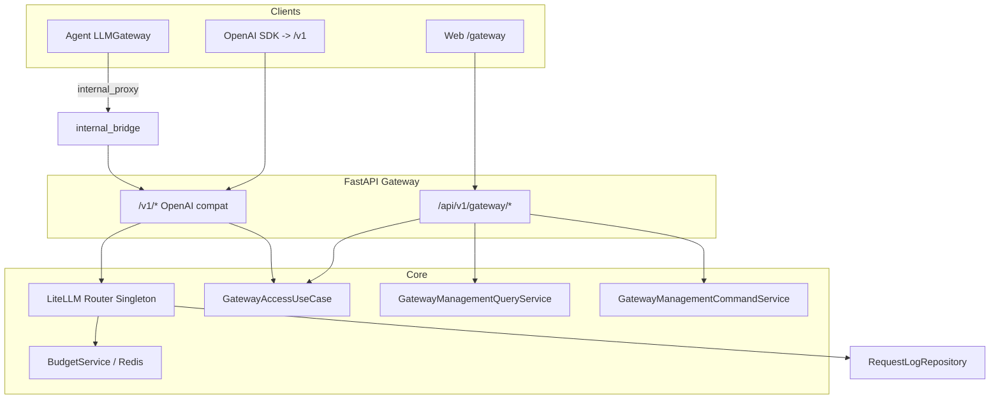

# AI Gateway 领域架构与工程实践

> **适用范围**：`domains/gateway`、`libs/gateway`、OpenAI 兼容入口、管理 API、内部 LLM 桥接及相关前端。  
> **更新说明**：LiteLLM 选型见 [LLM_GATEWAY_ARCHITECTURE.md](./LLM_GATEWAY_ARCHITECTURE.md)；兼容性见 [GATEWAY_COMPATIBILITY_CHECK.md](./GATEWAY_COMPATIBILITY_CHECK.md)。

---

## 1. 架构定位

| 维度 | 说明 |
|------|------|
| **业务目标** | 统一多模型调用入口（LiteLLM Router）、团队/虚拟 Key、凭据池、预算与限流、可观测（日志/告警/rollup）。 |
| **边界** | **Inbound**：`/v1/*`（Bearer `sk-gw-*` 或带 scope 的 `sk-*`）、`/api/v1/gateway/*`（JWT + 团队上下文）。**Outbound**：各 Provider HTTP API（由 LiteLLM 发起）。 |
| **与 Agent 域关系** | Agent 通过 `LLMGateway` + `GatewayProxyProtocol`（`libs/gateway/protocol.py`）可走内部桥接，归因到 personal team 与系统 vkey 池。 |

---

## 2. 分层结构（DDD + CQRS）

```
domains/gateway/
├── presentation/                 # HTTP：路由、Schema、依赖；禁止直连仓储
│   ├── http_error_map.py       # 领域异常 → HTTPException
│   └── deps.py                 # 鉴权：GatewayAccessUseCase
├── application/
│   ├── gateway_access_use_case.py   # 鉴权 + 团队上下文（含 vkey touch）
│   ├── queries/                   # 管理面读：GatewayManagementQueryService
│   ├── commands/                  # 管理面写：GatewayManagementCommandService
│   ├── team_service.py
│   ├── proxy_use_case.py          # OpenAI 兼容代理
│   └── jobs.py                    # 后台循环；rollup SQL 在 infrastructure 仓储
├── domain/                       # 类型、虚拟 Key 算法、领域错误、ManagementTeamContext
└── infrastructure/               # ORM、仓储、Router 单例、回调、护栏

libs/gateway/protocol.py          # GatewayProxyProtocol（agent 域依赖倒置）
domains/agent/infrastructure/llm/gateway.py   # LLMGateway
```

**依赖方向**

- `presentation → application（UseCase + 管理面 queries/commands）→ domain`
- `infrastructure` 由 application 经仓储调用；**禁止** domain 依赖 infrastructure。

**CQRS（管理面）**

- `/api/v1/gateway/*` 的 **读** → `GatewayManagementQueryService`；**写** → `GatewayManagementCommandService`。路由与 `deps` 不 `new *Repository`。

**UseCase 与 CQRS**

- **UseCase**：按场景端到端（如 `ProxyUseCase`、`GatewayAccessUseCase`），可多次读、少量写。
- **CQRS 拆分**：适合管理面 CRUD 大、读写易分叉；鉴权 + `touch` 收拢为 `GatewayAccessUseCase`，不为单行写单独建 Command 文件。

**后台任务**：`jobs.py` 调度；rollup 实现在 `infrastructure/repositories/metrics_rollup_repository.py`。

---

## 3. 运行时拓扑（简化）



---

## 4. 认证与团队上下文

| 入口 | 鉴权 | 团队 |
|------|------|------|
| `/v1/*` | `sk-gw-*` 或 `sk-*` + `gateway:proxy` | `X-Team-Id` 可选；缺省 personal team |
| `/api/v1/gateway/*` | JWT（`RequiredAuthUser`），匿名 **401** | `X-Team-Id` 优先，否则 personal team（`GatewayAccessUseCase.resolve_management_team`） |

RBAC 与 `libs/db/permission_context.py`：`deps.py` 调用 **`GatewayAccessUseCase`**。

---

## 5. 数据与持久化要点

- **分区表**：`gateway_request_logs` 为分区表；主键 **`(id, created_at)`**。禁止仅用 `session.get(Log, id)`，见 `RequestLogRepository.get_for_team`。
- **凭据**：`provider_credentials` 加密；Router 构建时解密参与 `model_list`。
- **迁移**：`alembic/versions/`。

---

## 6. 软件工程实践

### 6.1 测试

| 层级 | 路径 | 关注点 |
|------|------|--------|
| 单元 | `tests/unit/gateway/` | Personal team、vkey、PII、仓储 |
| 集成 | `tests/integration/api/test_gateway_management_api.py` | JWT、`GET /teams`、`X-Team-Id` |

```bash
uv run pytest tests/unit/gateway/ tests/integration/api/test_gateway_management_api.py -q
```

### 6.2 配置（示例）

- `gateway.internal_proxy_enabled`
- `gateway_router_redis_url` 或全局 `redis_url`  
以 `bootstrap/config.py` 为准。

### 6.3 前后端契约

- `frontend/src/api/gateway.ts` 与后端 `schemas/common.py` 对齐。
- `frontend/src/stores/gateway-team.ts` → 请求头 **`X-Team-Id`**。

### 6.4 已知风险

| 项 | 说明 |
|----|------|
| Router 单例 | 多 worker 依赖 Redis 一致性；改模型后需 `reload_router` 可达。 |
| 测试覆盖 | 预算/限流/流式等以单元与手工为主，可补集成。 |
| Pydantic V2 | MCP 相关 `Config` 弃用警告与 Gateway 无关，可择机 `ConfigDict`。 |

---

## 7. 前端控制台索引

| 区域 | 路径 |
|------|------|
| 页面 | `frontend/src/pages/gateway/` |
| API | `frontend/src/api/gateway.ts` |
| 团队 | `frontend/src/stores/gateway-team.ts`、`components/layout/team-switcher.tsx` |
| 权限 | `frontend/src/hooks/use-gateway-permission.ts` |

---

## 8. 相关文档

- [LLM_GATEWAY_ARCHITECTURE.md](./LLM_GATEWAY_ARCHITECTURE.md)
- [GATEWAY_COMPATIBILITY_CHECK.md](./GATEWAY_COMPATIBILITY_CHECK.md)
- [PERMISSION_SYSTEM_ARCHITECTURE.md](./PERMISSION_SYSTEM_ARCHITECTURE.md)
