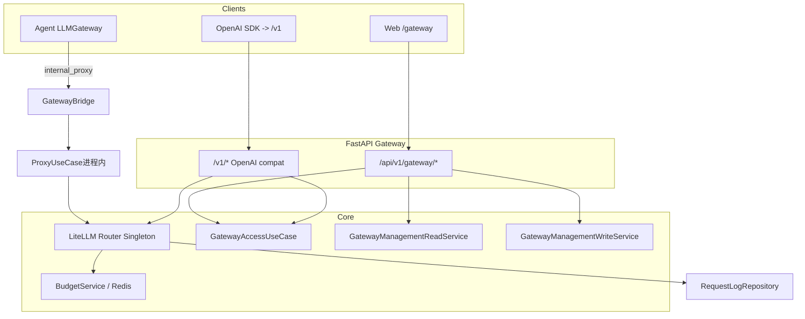

# AI Gateway 领域架构与工程实践

> **适用范围**：`domains/gateway`、`domains/tenancy`（团队/成员权威）、`domains/gateway/application`（内部桥接端口与辅助）、OpenAI 兼容入口、管理 API、内部 LLM 桥接及相关前端。  
> **更新说明**：LiteLLM 选型见 [LLM_GATEWAY_ARCHITECTURE.md](./LLM_GATEWAY_ARCHITECTURE.md)；兼容性见 [GATEWAY_COMPATIBILITY_CHECK.md](./GATEWAY_COMPATIBILITY_CHECK.md)。

---

## 1. 架构定位

| 维度 | 说明 |
|------|------|
| **业务目标** | 统一多模型调用入口（LiteLLM Router）、团队/虚拟 Key、凭据池、预算与限流、可观测（日志/告警/rollup）。 |
| **边界** | **Inbound**：`/v1/*`（Bearer `sk-gw-*` 或带 scope 的 `sk-*`）、`/api/v1/gateway/*`（JWT + 团队上下文）。**Outbound**：各 Provider HTTP API（由 LiteLLM 发起）。 |
| **与 Agent 域关系** | Agent 通过 `LLMGateway` + `GatewayProxyProtocol`（`domains/gateway/application/ports.py`）可走内部桥接，归因到 personal team 与系统 vkey 池。 |

---

## 2. 分层结构（DDD + CQRS）

```
domains/tenancy/                  # 团队与成员：权威 ORM 与 TeamService（Gateway / Identity 经此域）
├── application/
│   ├── team_service.py
│   └── management_team_resolve_use_case.py  # 管理面团队上下文（MembershipPort）
├── domain/management_context.py   # ManagementTeamContext；`gateway.domain.types` 再导出以保持既有 import
├── presentation/
│   ├── team_dependencies.py       # CurrentTeam / RequiredTeam*（管理面依赖）
│   ├── teams_router.py            # /teams* HTTP（前缀在 bootstrap 挂载为 /api/v1/gateway）
│   └── schemas/teams.py
└── infrastructure/
    ├── membership_adapter.py      # MembershipPort 实现
    ├── models/team.py
    └── repositories/team_repository.py

domains/gateway/
├── presentation/                 # HTTP：路由、Schema、依赖；禁止直连仓储
│   ├── http_error_map.py       # 领域异常 → HTTPException
│   └── deps.py                 # 鉴权：GatewayAccessUseCase
├── application/
│   ├── gateway_access_use_case.py   # Bearer vkey、代理团队解析、vkey touch；成员角色经 MembershipPort
│   ├── ports.py                     # GatewayProxyProtocol、GatewayCallContext（跨域依赖倒置）
│   ├── gateway_proxy_factory.py     # get_gateway_proxy() → GatewayBridge 单例
│   ├── internal_bridge_actor.py     # resolve_internal_gateway_user_id / team_id
│   ├── bridge_attribution.py        # GatewayBridgeAttribution（内部桥接计费工作区）
│   ├── litellm_bridge_payload.py    # LiteLLM kwargs → 桥接参数拆分
│   ├── internal_bridge.py           # GatewayBridge 实现
│   ├── management/                # 管理面读写分包（与 CQRS 读/写侧对应）
│   │   ├── reads.py               # GatewayManagementReadService
│   │   ├── writes.py              # GatewayManagementWriteService
│   │   └── usage_reads.py         # GatewayUsageReadService（兼容用量 API）
│   ├── proxy_use_case.py          # OpenAI 兼容代理
│   └── jobs.py                    # 后台循环；rollup SQL 在 infrastructure 仓储
├── domain/                       # 类型、虚拟 Key 算法、领域错误、ManagementTeamContext
└── infrastructure/             # ORM、仓储、Router 单例、回调、护栏
    └── models/__init__.py        # 再导出 Team / TeamMember（与 Alembic 聚合 import），权威定义在 tenancy

domains/gateway/domain/usage_read_model.py  # UsageAggregation（管理面日志/大盘读模型）
domains/agent/infrastructure/llm/gateway.py   # LLMGateway
```

**依赖方向**

- `presentation → application（UseCase + 管理面 management 读写服务）→ domain`
- `infrastructure` 由 application 经仓储调用；**禁止** domain 依赖 infrastructure。
- **团队与成员**：`domains.gateway.application` 使用 `domains.tenancy` 的 `TeamService` / `TeamRepository` 与 `Team` ORM；**成员角色**经 `libs.iam.tenancy.MembershipPort`（默认 `TenancyMembershipAdapter`），**禁止**在 Gateway 应用层直接使用 `TeamMemberRepository`。`gateway.infrastructure.models` 仅再导出 `Team` / `TeamMember` 供 Alembic 聚合 import。团队管理 HTTP 在 `domains.tenancy.presentation.teams_router`（仅依赖 `TeamService` 与 identity 依赖，**不**引用 `domains.gateway.application`）。
- **可映射 HTTP 的领域错误**：`TeamNotFoundError`、`TeamPermissionDeniedError`、`PersonalTeamNotInitializedError` 与基类 `HttpMappableDomainError` 定义在 **`libs.exceptions`**；`libs/iam/team_http.map_team_access_exception_to_http` 负责上述团队错误的 HTTP 映射。`GatewayError` 继承 `HttpMappableDomainError`；`gateway.presentation.http_error_map` 先委托团队映射再处理其余 Gateway 异常。`tenancy.presentation.team_dependencies` **不**依赖 `domains.gateway.presentation`。

**CQRS（管理面）**

- `/api/v1/gateway/*` 的 **读** → `GatewayManagementReadService`；**写** → `GatewayManagementWriteService`。路由与 `deps` 不 `new *Repository`。

**UseCase 与 CQRS**

- **UseCase**：按场景端到端（如 `ProxyUseCase`、`GatewayAccessUseCase`），可多次读、少量写。
- **CQRS 拆分**：适合管理面 CRUD 大、读写易分叉；鉴权 + `touch` 收拢为 `GatewayAccessUseCase`，不为单行写单独建 Command 文件。

**术语对照（Query / Command 与业务命名）**

| 工程/CQRS 惯用名 | 类名（业务语感） | 说明 |
|------------------|------------------|------|
| Query 侧（只读） | `GatewayManagementReadService` | 管理 API 列表/详情/聚合读模型 |
| Command 侧（变更） | `GatewayManagementWriteService` | 管理 API 创建/更新/删除 |
| 用量只读（兼容层） | `GatewayUsageReadService` | Identity `/usage/*` 等，不暴露 Gateway ORM |

实现分包目录为 `application/management/`（`reads.py` / `writes.py` / `usage_reads.py`），与「Query/Command」一一对应，便于团队沟通时口头用「管理读服务 / 管理写服务」指代两侧。

**后台任务**：`jobs.py` 调度；rollup 实现在 `infrastructure/repositories/metrics_rollup_repository.py`。

---

## 3. 运行时拓扑（简化）



说明：**`GatewayBridge` 不经过 HTTP 再打 `/v1`**，而是在同一进程内 `AsyncSession` 上直接调用 `ProxyUseCase`，与 OpenAI 兼容路由共享同一套代理与计量逻辑；上图单独画出 `V1` 表示外部客户端入口，与内部桥并列。

### 3.1 本地开发与运行模式

| 模式 | 依赖 | `gateway_internal_proxy_enabled` | 行为 |
|------|------|-----------------------------------|------|
| **完整 Gateway（对齐生产）** | 已执行 gateway 相关 DB 迁移；Redis 可用（Router 冷却/共享）；请求内能解析归因 `user_id` **或** 配置了委派 UUID | `True`（默认） | `LLMGateway` / `EmbeddingService`（API）优先经 `GatewayBridge` → `ProxyUseCase`，写入请求日志与预算链路。 |
| **轻量直连（刻意降级）** | 可无 Redis / 未迁库；仅验证 Agent 逻辑 | `False` | 直连 LiteLLM，**不**走 Gateway 观测闭环；与生产口径不同，勿误以为本地通过即线上管控完备。 |

**纯本地向量（FastEmbed）**：不经 Gateway，无供应商 API，属刻意设计。

**无注册用户上下文**：若未配置 `gateway_internal_proxy_delegate_user_id`，内部桥无法归因，将回退直连（除非 `gateway_internal_proxy_fail_closed=True`，此时桥接失败会抛错而非静默回退）。

**推荐**：CI 或合并前至少保留一条「开桥 + 已解析 user_id 或委派 ID」的集成路径，避免生产专用代码腐烂。

---

## 4. 认证与团队上下文

| 入口 | 鉴权 | 团队 |
|------|------|------|
| `/v1/*` | `sk-gw-*` 或 `sk-*` + `gateway:proxy` | `X-Team-Id` 可选；缺省 personal team |
| `/api/v1/gateway/*` | JWT（`RequiredAuthUser`），匿名 **401** | `X-Team-Id` 优先，否则 personal team（`TenancyManagementTeamResolveUseCase` + `MembershipPort`） |

RBAC 与 `libs/db/permission_context.py`：`deps.py` 调用 **`GatewayAccessUseCase`**。

### 4.1 域划分、术语与用量读模型（`UsageAggregation`）

| 域 / 层 | 职责 | 与本节相关类型 |
|---------|------|----------------|
| **Tenancy** | `Team`（`kind=personal|shared`）、成员、`ManagementTeamContext`；**personal team 仍是 `Team` 表的一行**，用户通过成员关系属于该工作区。 | `Team.id` 可作为当前工作区 ID。 |
| **Gateway 管理读** | 请求日志列表/详情/大盘摘要的**切片维度**；**不**改变 Tenancy 实体。 | `UsageAggregation`（`domains/gateway/domain/usage_read_model.py`）。 |
| **Identity** | JWT 主体 `user_id`。 | 与 `usage_aggregation=user` 聚合键一致。 |
| **Gateway 应用（内部桥接）** | `GatewayCallContext`、`GatewayBridgeAttribution`：内部桥接的 **Actor** 与 **计费工作区**（日志 `team_id`）。 | 与 HTTP `usage_aggregation` **正交**（桥接不携带该查询参数）。 |

**`usage_aggregation`（查询参数，默认 `workspace`）**

| 取值 | 含义 |
|------|------|
| `workspace` | 按 **`X-Team-Id` → CurrentTeam.team_id`** 过滤/聚合；该 ID 可为 **personal** 或 **shared** 工作区。 |
| `user` | 按当前登录 **`user_id`** 跨工作区聚合/过滤（与日志行 `user_id` 对齐）；**不**表示「无团队用户」。 |

**与预算 `BudgetUpsert.scope`（`system|team|key|user`）正交**：后者表示预算作用域类型，禁止与 `UsageAggregation` 混用同一组字面量。

**破坏性变更（已无兼容）**：`GET /logs`、`GET /logs/{log_id}`、`GET /dashboard/summary` **已移除**查询参数 `scope=team|personal`，客户端必须改用 **`usage_aggregation=workspace|user`**。

### 4.2 仪表盘与明细日志的数据源

- **`GET /dashboard/summary`**：聚合自 **`gateway_request_logs`**（PostgreSQL），受成功请求采样配置 `gateway_request_log_success_sample_rate` 影响（见 `domains/gateway/infrastructure/gateway_log_sampling.py` 与 `custom_logger` 注释）。
- **Redis 计数**（`gateway:metrics:*`）：CustomLogger 中可与 DB 写入路径不同步；**管理面大盘以 DB 为准**。

---

## 5. 数据与持久化要点

- **分区表**：`gateway_request_logs` 为分区表；主键 **`(id, created_at)`**。禁止仅用 `session.get(Log, id)`，见 `RequestLogRepository.get_for_team`。
- **凭据**：`provider_credentials` 加密；Router 构建时解密参与 `model_list`。
- **迁移**：`alembic/versions/`。

---

## 6. 软件工程实践

### 6.1 测试

| 层级 | 路径 | 关注点 |
|------|------|--------|
| 单元 | `tests/unit/gateway/` | Personal team、vkey、PII、仓储 |
| 集成 | `tests/integration/api/test_gateway_management_api.py` | JWT、`GET /teams`、`X-Team-Id` |

```bash
uv run pytest tests/unit/gateway/ tests/integration/api/test_gateway_management_api.py -q
```

### 6.2 配置（与 `bootstrap/config.py` 字段一致）

环境变量由 Pydantic Settings 推导（通常为 **大写 + 下划线**，例如 `GATEWAY_INTERNAL_PROXY_ENABLED`），以下列出 **Settings 属性名**：

- `gateway_internal_proxy_enabled`：内部 Chat/Embedding（API）是否优先走 `GatewayBridge`。
- `gateway_internal_proxy_fail_closed`：桥接异常时是否**禁止**静默回退直连（`True` 则抛出）。
- `gateway_internal_proxy_delegate_user_id`：无 `PermissionContext.user_id` 时用于 Gateway 归因的委派 UUID（后台任务、worker 等）。
- `gateway_router_redis_url`：Router 跨进程状态；缺省可复用全局 `redis_url`。

### 6.3 前后端契约

- `frontend/src/api/gateway.ts`：日志/大盘使用查询参数 **`usage_aggregation`**（`workspace` | `user`），与后端 `UsageAggregation` 对齐；与 `schemas/common.py` 响应体对齐。
- `frontend/src/stores/gateway-team.ts` → 请求头 **`X-Team-Id`**。

### 6.4 已知风险

| 项 | 说明 |
|----|------|
| Router 单例 | 多 worker 依赖 Redis 一致性；改模型后需 `reload_router` 可达。 |
| 测试覆盖 | 预算/限流/流式等以单元与手工为主，可补集成。 |
| Pydantic V2 | MCP 相关 `Config` 弃用警告与 Gateway 无关，可择机 `ConfigDict`。 |

---

## 7. 前端控制台索引

| 区域 | 路径 |
|------|------|
| 页面 | `frontend/src/pages/gateway/` |
| API | `frontend/src/api/gateway.ts` |
| 团队 | `frontend/src/stores/gateway-team.ts`、`components/layout/team-switcher.tsx` |
| 权限 | `frontend/src/hooks/use-gateway-permission.ts` |

---

## 8. 相关文档

- [LLM_GATEWAY_ARCHITECTURE.md](./LLM_GATEWAY_ARCHITECTURE.md)
- [GATEWAY_COMPATIBILITY_CHECK.md](./GATEWAY_COMPATIBILITY_CHECK.md)
- [PERMISSION_SYSTEM_ARCHITECTURE.md](./PERMISSION_SYSTEM_ARCHITECTURE.md)
