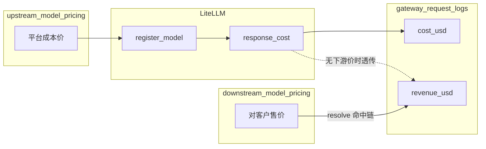
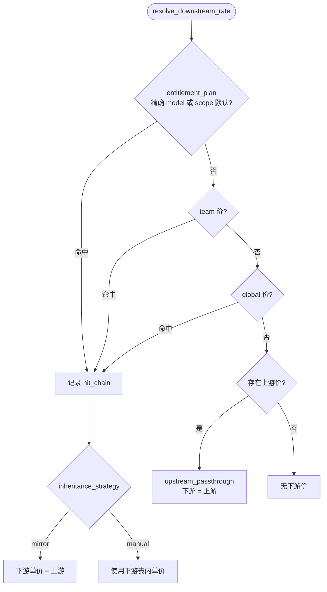
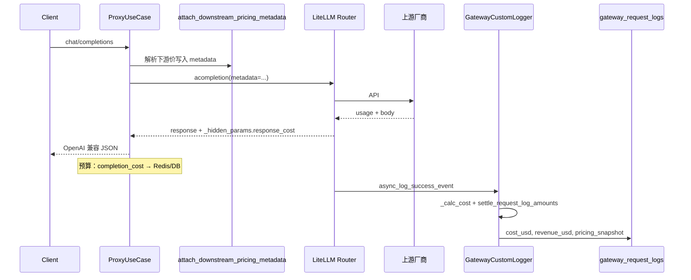
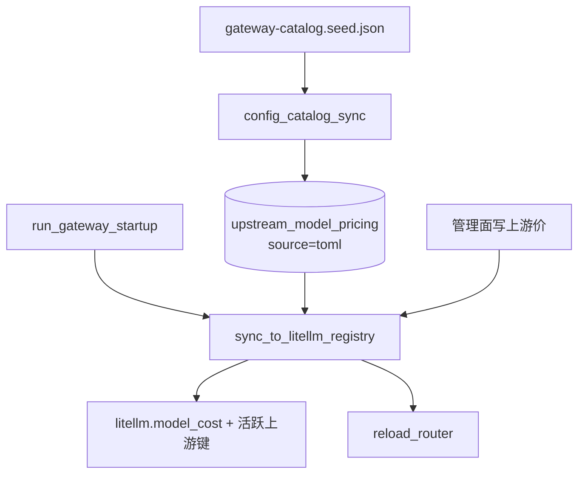
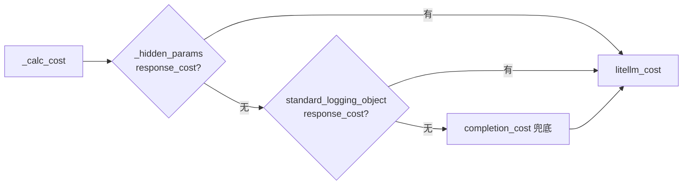
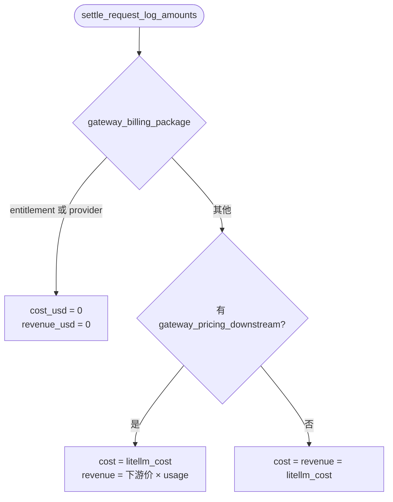

# Gateway 费用计算与 LiteLLM 集成说明

本文说明 [LiteLLM](https://docs.litellm.ai/) 如何计算单次调用的 **USD 成本**，以及本仓库 **AI Gateway** 域如何在 LiteLLM 之上实现「上游成本 / 下游收入」分离、持久化与展示。

更完整的 Gateway 域边界见 [AI_GATEWAY_DOMAIN_ARCHITECTURE.md](./AI_GATEWAY_DOMAIN_ARCHITECTURE.md) 第 4.8 节；本文专注 **定价与计费链路**。


> 交互版流程图（可缩放 / 全屏）见 [GATEWAY_PRICING_AND_LITELLM_COST.html](./GATEWAY_PRICING_AND_LITELLM_COST.html)。

---

## 1. 概念对照

| 概念 | LiteLLM | 本项目 |
|------|---------|--------|
| 单价注册表 | `litellm.model_cost` / `register_model()` | `upstream_model_pricing` + 启动时 `sync_to_litellm_registry()` |
| 单次调用成本 | `response_cost`（写入 `_hidden_params`） | 请求日志 `cost_usd`（上游成本） |
| 对客户计费 | 无（Proxy 侧可配 margin，本仓库自管） | `downstream_model_pricing` → `revenue_usd` |
| 用量字段 | `usage.prompt_tokens` / `completion_tokens` 等 | 同左，并写入 `gateway_request_logs` |
| 估算 API | `completion_cost()` | 读侧 `PricingService.calculate()`；前端 `estimateUsageCostDisplay()` |

**币种约定**：数据库与结算逻辑一律 **USD**；API / 前端经 `MoneyProjector` + `FxRatePort` 投影为 CNY（或 USD）展示。

---

## 2. LiteLLM 费用计算机制

### 2.1 内置价目表 `model_cost`

LiteLLM 维护全局字典 `litellm.model_cost`（也称 model cost map），键为 **模型 ID**（如 `gpt-4o`、`anthropic/claude-3-5-sonnet-20241022`），值为单价字段，与 OpenAI 风格对齐：

| 字段 | 含义 |
|------|------|
| `input_cost_per_token` | 输入 token 单价（USD） |
| `output_cost_per_token` | 输出 token 单价（USD） |
| `cache_creation_input_token_cost` | Prompt 缓存写入单价（可选） |
| `cache_read_input_token_cost` | Prompt 缓存读取单价（可选） |
| `input_cost_per_image` 等 | 图像 / 音频等非 token 计费（在 `extra` 或扩展键中） |

官方价目会随 LiteLLM 版本更新；对 **虚拟模型名**（Gateway 对外暴露的 `team/foo`）或私有部署模型，内置表往往 **没有条目**，需要自行注册。

### 2.2 注册与覆盖：`register_model()`

```python
import litellm

litellm.register_model({
    "my-virtual-model": {
        "input_cost_per_token": 0.00000015,
        "output_cost_per_token": 0.0000006,
    }
})
```

- 先合并内置 `model_cost`，再叠加自定义条目。
- Router deployment 的 `litellm_params` **不必**再带单价；本项目在 `PricingService.sync_to_litellm_registry()` 中统一注册（见 §4.2）。

### 2.3 响应阶段写入 `response_cost`

成功 completion 后，LiteLLM 在 `response_metadata` 中根据 **deployment 所用模型键** 与 `usage` 计算费用，并写入：

```text
response._hidden_params["response_cost"]  # float，USD
```

同时进入 callback 的 `standard_logging_object["response_cost"]`。计算逻辑等价于：

```text
cost = Σ (token_count × 对应 input/output/cache 单价) + 按请求固定费（若配置）
```

具体实现见 LiteLLM 源码 `litellm_core_utils.llm_response_utils.response_metadata`。

### 2.4 事后计算：`completion_cost()`

```python
from litellm import completion_cost

usd = completion_cost(completion_response=response, model="gpt-4o")
# 或 custom_cost_per_token={"input_cost_per_token": ..., "output_cost_per_token": ...}
```

用于日志、预算扣减或缺少 `_hidden_params` 时的兜底。本项目在两处使用：

| 调用点 | 策略 |
|--------|------|
| `custom_logger._calc_cost` | 优先 `_hidden_params` → `standard_logging_object` → `completion_cost()` |
| `proxy_use_case._calc_cost` | 直接 `completion_cost()`（预算 Redis 累加） |

### 2.5 标准日志与排障

LiteLLM Proxy 的 **StandardLoggingPayload** 含 `response_cost`、`model_map_information`、`custom_pricing` 等。费用与厂商账单不一致时，可参考官方 [Cost discrepancy troubleshooting](https://docs.litellm.ai/docs/troubleshoot/cost_discrepancy)：先核对 **token 数量** 是否一致，再核对 **单价映射** 是否正确。

### 2.6 与本项目相关的 LiteLLM 能力（未全部启用）

| LiteLLM 能力 | 说明 | 本项目 |
|--------------|------|--------|
| Proxy Pricing Calculator UI | 按模型与 token 量 **预估** 月费 | 前端自实现 `estimate-usage-cost.ts` |
| `custom_cost_per_token` | 单次调用覆盖单价 | 下游价注入 kwargs + 响应 `response_cost`；日志 `cost_usd` 仍按上游 metadata 重算 |
| A2A Agent 固定价 | 按 query 计费 | 未使用 |
| Spend logs / Budget on LiteLLM | Proxy 内置预算 | 使用自研 `BudgetService` + `gateway_budgets` |

---

## 3. 本项目定价架构

### 3.1 上下游分离



- **上游 `cost_usd`**：尽量与 LiteLLM 的 `response_cost` 一致（厂商成本）。
- **下游 `revenue_usd`**：按 `downstream_model_pricing` 解析出的单价 × 本次 token；无下游价时 **收入 = 成本**（透传）。
- **毛利**：`revenue_usd - cost_usd`（仅管理员在 UI / API 可见完整上游字段）。

### 3.2 数据表

**`upstream_model_pricing`**（`domains/gateway/infrastructure/models/pricing_upstream.py`）

- 自然键：`provider` + `upstream_model` + `capability` + `effective_from`
- 单价字段名与 LiteLLM **1:1**
- `source`：`toml`（catalog 同步）/ `manual` / `litellm_fallback`
- `extra`：存放 LiteLLM 扩展计价键

**`downstream_model_pricing`**（`pricing_downstream.py`）

- `scope`：`global` | `team` | `entitlement_plan`
- `gateway_model_id`：可 NULL（表示该 scope 默认价）
- `inheritance_strategy`：
  - **`mirror`**：售价 = 上游价（单价列必须为 NULL）
  - **`manual`**：显式 `input_cost_per_token` / `output_cost_per_token`
- 可选 `per_request_usd`（按次费用，域内 `calculate_cost_from_rate` 支持）

**`gateway_request_logs`**

- `cost_usd`、`revenue_usd`、`pricing_snapshot`（JSONB）
- `pricing_snapshot` 对齐 LiteLLM 子集并扩展 `upstream_cost_usd`、`downstream_revenue_usd`、`hit_chain` 等

### 3.3 下游价解析优先级

`PricingService.resolve_downstream_rate()`（`application/pricing/pricing_service.py`）按顺序命中，并记录 `hit_chain`：

1. `entitlement_plan`（先精确 `gateway_model_id`，再 scope 默认）
2. `team`
3. `global`
4. 若仍无下游行：有上游则 **upstream_passthrough**（下游 = 上游）
5. `mirror` 策略：下游单价强制等于上游
6. `manual`：使用下游表内单价



---

## 4. 端到端计费链路



### 4.1 目录同步 → 上游价 + LiteLLM 注册



1. **`config_catalog_sync`**：从 `gateway-catalog.seed.json` 同步 `GatewayModel`，并对带单价的模型调用 `_upsert_upstream_pricing_from_model()` 写入 `upstream_model_pricing`（`source=seed`）。单价 **不再** 写入 model `tags`。
2. **应用启动**（`domains/gateway/application/startup.py`）：
   - 默认**不再**做 LiteLLM 价目同步——内置 `litellm.model_cost` 在 `import litellm` 时已就绪；
     代理调用经 `attach_downstream_pricing_metadata` 把上下游单价注入 `metadata`，`upstream_cost_resolver` 优先读 metadata。
   - 仅当 `gateway_catalog_sync_on_startup=true` 时跑 `run_gateway_catalog_maintenance()`（catalog + `sync_to_litellm_registry` + 审计 + `reload_router`）。
   - DB 行的 LiteLLM 注册改由管理面写入路径增量执行：`sync_to_litellm_registry(only_keys=...)` + 进程内指纹缓存，避免每次写一行都做全表 `register_model`。
3. **管理面**：`POST /catalog/reload-from-config` 与完整启动维护共用 `run_gateway_catalog_maintenance()`；写上游价后 `GatewayManagementWriteService` 亦调用 `sync_to_litellm_registry()` + `reload_router()`。

### 4.2 代理调用前：注入 metadata

`ProxyMetadataBuilder.build` 在拼装 metadata 时调用 `attach_downstream_pricing_metadata()`：

| metadata 键 | 用途 |
|-------------|------|
| `gateway_pricing_downstream` | 下游单价 dict（LiteLLM `custom_cost_per_token` 形状） |
| `gateway_pricing_hit_chain` | 命中路径，写入日志 |
| `gateway_billing_package` | `entitlement` / `provider` 时本次 **不计费** |
| `gateway_gateway_model_id` / `gateway_provider` / `gateway_upstream_model` | 归因与排障 |

LiteLLM 会把 `metadata` 搬到 callback 的多个位置；`custom_logger._extract_gateway_metadata()` 合并所有 `gateway_*` 字段。

### 4.3 回调落库：成本与收入

`GatewayCustomLogger`（`infrastructure/callbacks/custom_logger.py`）在成功/失败事件调用 `_persist_event()`：

**上游成本 `litellm_cost`** — `_calc_cost()` 优先级：



1. `response_obj._hidden_params["response_cost"]`
2. `kwargs["standard_logging_object"]["response_cost"]`
3. `litellm.completion_cost(...)`

**结算** — `settle_request_log_amounts()`（`pricing_settlement.py`）：



| 条件 | cost_usd | revenue_usd |
|------|----------|-------------|
| `gateway_billing_package` 为 `entitlement` 或 `provider` | 0 | 0 |
| 有 `gateway_pricing_downstream` | `litellm_cost` | `calculate_cost_from_rate(下游价, usage)` |
| 无下游价 | `litellm_cost` | `litellm_cost` |

`merge_pricing_snapshot()` 合并 LiteLLM 快照字段与 `upstream_cost_usd`、`downstream_revenue_usd`、`hit_chain` 等。

失败请求：`litellm_cost = 0`，仍写日志与 Redis 计数（预算不受此次成本影响）。

### 4.4 域内纯函数

`domains/gateway/domain/pricing_calculator.py`：

```python
total = input_cost_per_token * input_tokens
      + output_cost_per_token * output_tokens
      + cache_creation_input_token_cost * cache_creation_tokens  # 可选
      + cache_read_input_token_cost * cache_read_tokens            # 可选
      + per_request_usd * requests                                   # 可选
```

与 LiteLLM 默认 token 计费一致；复杂厂商规则（分段价、图像按张）放在 `upstream_model_pricing.extra`，由 LiteLLM `register_model` 合并进 model map。

### 4.5 预算与套餐（与日志计费分离）

| 机制 | 扣减依据 | 说明 |
|------|----------|------|
| `BudgetService` | `proxy_use_case._calc_cost` → `completion_cost` | 按 **上游成本** 累加 Redis / `gateway_budgets` |
| Entitlement 套餐 | 同上 `cost` + tokens | 套餐内调用 metadata 标记后 **日志为 0**，但 entitlement 仍可能扣 token 额度 |
| ProviderPlan | 上游配额耗尽 | 日志 `gateway_billing_package=provider` 时 cost/revenue 为 0 |

注意：**预算扣减**与**请求日志的 revenue_usd** 来源不同；对账时以 `gateway_request_logs` 为准。

---

## 5. 读侧 API 与权限

**路由**：`domains/gateway/presentation/routers/pricing.py` → `/api/v1/gateway/pricing/*`

| 能力 | 管理员 | 普通成员 |
|------|--------|----------|
| 上游价 CRUD | ✓ | ✗ |
| 下游价 CRUD / bulk mirror | ✓（团队管理员写本团队） | 只读「我的价格」 |
| `PricingRateAdminView` | 含上游价、毛利 | — |
| `PricingRateMemberView` | — | 仅下游展示价 |
| 请求日志 `cost_usd` | ✓ | 强制为 0（`log_presentation.request_log_to_dict`） |
| `pricing_snapshot` | 完整 | 掩码掉上游字段 |

**汇率**：`GET /pricing/fx`，默认静态 `gateway_fx_usd_cny`（`infrastructure/fx/fx_static.py`）。

**投影**：`MoneyProjector` 将 `*_usd` 转为 `*_display`（`amount` + `currency` + `fx_rate_used`）。

---

## 6. 前端

| 路径 / 模块 | 作用 |
|-------------|------|
| `/gateway/pricing/upstream` | 上游价维护（管理员） |
| `/gateway/pricing/downstream`、`/gateway/pricing/my-prices` | 下游价与成员视图 |
| `features/gateway-pricing/estimate-usage-cost.ts` | 按「每百万 token」展示价估算单次费用（无 `response_cost` 时兜底） |
| Playground | 优先展示响应内 `response_cost`（USD），否则本地估算 |
| `features/gateway-usage/log-pricing-breakdown.tsx` | 日志详情：下游费用 / 上游成本 / 毛利 / LiteLLM `response_cost` |

展示货币来自用户偏好 `displayCurrency`（CNY / USD），与库内 USD 原值通过 API 返回的 `*_display` 对齐。

---

## 7. 运维与排障

### 7.1 成本为 0 或明显偏差

1. **检查 LiteLLM 是否注册该 `upstream_model` 键**（与 Router 使用的 `real_model` / `build_litellm_model_id` 一致）。
2. 查看日志 `pricing_snapshot.response_cost` 与 `cost_usd` 是否一致。
3. 虚拟模型名若未注册，`completion_cost` 可能返回 0；应依赖 `_hidden_params` 或补全 `upstream_model_pricing` 后重启同步。
4. 对照厂商账单：先比 token，再比单价（LiteLLM 官方排障流程）。

### 7.2 收入与成本相同

- 未配置下游价，或命中 `upstream_passthrough` / `mirror`。
- 检查 `gateway_pricing_hit_chain` 与 `downstream_model_pricing` 生效时间 `effective_from` / `effective_to`。

### 7.3 套餐内调用

- `gateway_billing_package=entitlement`：日志双零；预算/entitlement 仍按 Proxy 路径扣减。
- 管理报表需区分「日志费用」与「套餐额度」。

### 7.4 相关测试

```bash
cd backend
uv run pytest tests/unit/gateway/test_pricing_calculator.py \
  tests/unit/gateway/test_pricing_settlement.py \
  tests/unit/gateway/test_custom_logger_pricing_settlement.py -q
```

---

## 8. 代码索引

| 主题 | 路径 |
|------|------|
| 计价纯函数 | `domains/gateway/domain/pricing_calculator.py` |
| 价目解析 / LiteLLM 注册 | `domains/gateway/application/pricing/pricing_service.py` |
| 日志结算 | `domains/gateway/application/pricing/pricing_settlement.py` |
| 上游成本统一解析 | `domains/gateway/application/pricing/upstream_cost_resolver.py` |
| 流式预算 callback 结算 | `domains/gateway/application/budget_callback_settlement.py` |
| LiteLLM 价表同步 | `domains/gateway/application/pricing/litellm_upstream_price_sync.py` |
| 下游价解析缓存 | `domains/gateway/application/pricing/pricing_resolution_cache.py` |
| 代理 metadata | `domains/gateway/application/pricing/pricing_proxy_metadata.py` |
| 回调写库 | `domains/gateway/infrastructure/callbacks/custom_logger.py` |
| Catalog → 上游价 | `domains/gateway/application/config_catalog_sync.py` |
| 下游 bulk mirror | `domains/gateway/application/pricing/upstream_sync_service.py` |
| 启动注册 | `bootstrap/main.py` |
| Router（单价不在 deployment） | `domains/gateway/infrastructure/router_singleton.py` |
| 预算扣减 | `domains/gateway/application/proxy_use_case.py` |
| 日志 API 脱敏 | `domains/gateway/application/management/log_presentation.py` |
| 迁移 | `alembic/versions/20260518_gateway_model_pricing.py` |

---

## 9. 运维禁令（防重复计费）

- **禁止**在 LiteLLM Proxy / Router deployment 上配置 provider margin，同时又在 `downstream_model_pricing` 加价；本项目采用「上游成本 + 下游售价」双账，不是在同一条 `response_cost` 上叠 margin。
- 预算与 `gateway_request_logs.cost_usd` 必须走 **上游** 单价；Playground 展示的 `response_cost` 可为下游售价。

## 10. 参考链接

- [LiteLLM Cost Tracking](https://docs.litellm.ai/docs/proxy/cost_tracking)（Proxy 侧用量与成本）
- [Pricing Calculator](https://docs.litellm.ai/docs/proxy/pricing_calculator)（官方预估工具）
- [Cost discrepancy troubleshooting](https://docs.litellm.ai/docs/troubleshoot/cost_discrepancy)
- 本仓库：[AI_GATEWAY_DOMAIN_ARCHITECTURE.md](./AI_GATEWAY_DOMAIN_ARCHITECTURE.md)
