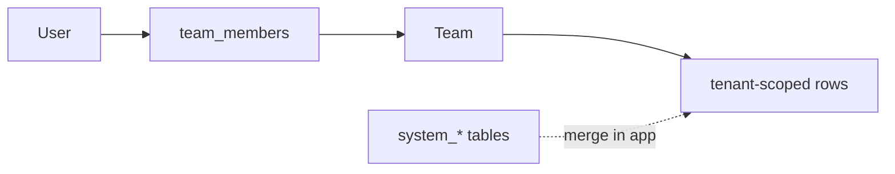
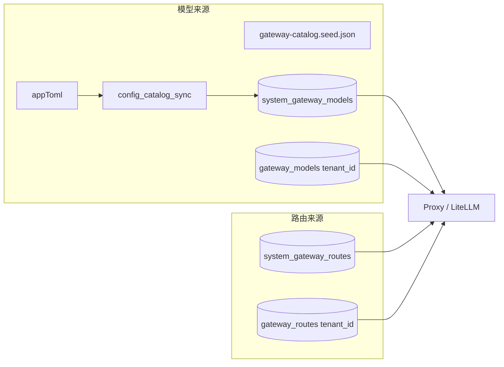

# 权限系统架构文档

## 目录

- [概述](#概述)
- [实现状态](#实现状态)
- [架构设计](#架构设计)
- [核心组件](#核心组件)
- [AI Gateway：模型与路由](#ai-gateway-models-routes)
- [数据权限处理流程](#数据权限处理流程)
- [使用指南](#使用指南)
- [最佳实践](#最佳实践)
- [常见问题](#常见问题)

## 概述

本系统实现了基于角色的访问控制（RBAC）和数据权限的统一管理，支持注册用户和匿名用户，并提供管理员权限绕过机制。

## 多租户数据归属（tenant_id 模型）

自 2026-05 起，业务数据以 **`tenant_id`（团队 / 工作区）** 为唯一归属维度，授权链为：

`User → team_members → tenant_id → 业务行`

| 概念 | 实现 |
|------|------|
| 个人用户 | `TeamService.ensure_personal_team` / `PersonalTeamProvisioner` |
| 匿名用户 | Cookie → `AnonymousUserProvisioner.ensure_shadow_user`（`role=anonymous`）→ personal team |
| 系统级配置 | 独立 `system_*` 表（无 `tenant_id`）；查询用 `list_system()` + `list_for_tenant()` 在应用层合并 |
| 策略挂载（vkey 等） | `target_kind` + `target_id`（如 `EntitlementPlan`），与 tenant 正交 |
| Repository 过滤 | `TenantScopedRepositoryBase` + `DataScopeEnforcer`（`PermissionContext.team_ids`） |



详见 `backend/docs/CODE_STANDARDS.md`「ORM 与多租户数据归属」。

**Phase 3（20260522）**：Gateway 业务表物理列 `team_id` → `tenant_id`；`entitlement_plans.scope/scope_id` → `target_kind/target_id`；移除 `TenantIdFromTeamIdMixin` grace 层。`provider_credentials` / `gateway_budgets` 的 `scope` 仍为凭据/预算维度（非策略挂载），未在本轮重命名。

**Phase 3b（20260523）**：`sessions` / `agents` 增加 `tenant_id` 并按 personal team 回填；创建会话/Agent 时自动 `ensure_personal_team`。`user_id` / `anonymous_user_id` 已 DROP（见 `20260524` / `20260525` 迁移）。

**Phase 3c（20260528–29）**：系统凭据迁入 `system_provider_credentials`；`gateway_budgets.scope/scope_id` → `target_kind/target_id`（值 `team` → `tenant`）。租户凭据 API 的 `scope` 固定展示为 `team`（`credential_api_scope`），ORM 仍为 `scope NULL` + `tenant_id`。

### 命名兼容与 sunset

| 区域 | 现状 | 目标 |
|------|------|------|
| DB 列 | 业务表 `tenant_id` | 已完成 |
| 仓储/应用参数 | `list_for_tenant` / `tenant_id` 为主；`list_for_team` 等别名带 `DeprecationWarning` | HTTP 日志等仍可有 `team_id` 展示字段 |
| 下游定价 scope | DB/API 已统一 `tenant`（迁移 `20260530`）；Query 仍接受 `team` 并归一化 | — |
| HTTP JSON | 日志/Key 等仍暴露 `team_id`（计费团队） | 与 `tenant_id` 并存；文档化，不混为数据归属列 |
| `OwnedRepositoryBase` / `OwnedMixin` | **已移除**（2026-05） | 仅用 `TenantScopedRepositoryBase` + `TenantScopedMixin` |
| `libs.iam` | `PermissionContext`、`data_scope_policy` | `libs.db` 仅 re-export（sunset） |
| `PermissionContextComposer` | `domains/identity/application/permission_context_composer.py` | JWT/网关任务单一装配入口 |
| Session 列表/详情 | `assert_session_accessible` + personal `tenant_id` | 不按 `team_ids` 宽过滤会话 |
| Chat 检查点 | `resolve_session_id` → 鉴权 → 再加载状态 | 与 Session REST 同策略 |
| `libs.db.team_ids_resolver` | 已删除 | 权威：`domains.tenancy.application.team_membership_queries` |

### 域策略索引（`domains/*/domain/policies/`）

| 模块 | 策略 | 职责 |
|------|------|------|
| `session` | `session_access` | `can_access_personal_session`（含平台 admin 旁路） |
| `tenancy` | `team_role` | `assert_team_role`、`assert_gateway_admin` |
| `gateway` | `credential_scope` | 系统凭据变更、租户内凭据可见性 |
| `gateway` | `pricing_visibility` | 定价成本字段是否可见 |
| `gateway` | `usage_log_visibility` | 团队成员日志 axis / 单条详情过滤 |
| `gateway` | `virtual_key_access` | 虚拟 Key 仅创建者可读写/吊销 |
| `gateway` | `gateway_admin` | 平台管理员断言 |

Presentation 层应委托上述纯函数；Application 负责 IO 与编排。产品可读规则见 [项目权限规则.md](项目权限规则.md) §2、§9。

## 实现状态

### ✅ 已实现

1. **核心组件**
   - ✅ `PermissionContext` / `DataScopeEnforcer`（`libs.iam` + `libs.db.data_scope_clause`）
   - ✅ `TenantScopedRepositoryBase` - 多租户仓储基类
   - ✅ 已移除 `OwnedMixin` / `OwnedRepositoryBase`（2026-05）
   - ✅ `PermissionContextASGIMiddleware` - 权限 ContextVar 生命周期（预清/清理，不填充 ctx）
   - ✅ `Principal` 和 `CurrentUser` 的 `role` 字段
   - ✅ 域策略：见上表（含 `usage_log_visibility`、`pricing_visibility`）
   - ✅ 显式鉴权：`check_tenant_access` / `check_tenant_access_or_public`（已移除 `check_ownership` / `get_owned_user_ids`）
   - ✅ 已移除 `check_session_ownership`；会话统一 `SessionUseCase.assert_session_accessible`
   - ✅ 角色依赖（`require_role`、`AdminUser`）

2. **模型层**
   - ✅ `Session` / `Agent` 使用 `TenantScopedMixin`（`tenant_id`）
   - ✅ Listing/Video/Memory/ApiKey/MCP 用户表已迁 `tenant_id`；系统 MCP 拆 `system_mcp_servers`

3. **Presentation 层**
   - ✅ Agent 和 Memory 路由已适配新的权限检查函数

### ✅ 已完成迁移

1. **Repository 层迁移**
   - ✅ 会话仓储已继承 `TenantScopedRepositoryBase`（`tenant_id` + `team_ids`）
   - ✅ Agent 仓储已继承 `TenantScopedRepositoryBase`
   - ✅ 列表/单条查询使用 `find_for_tenants` / `get_in_tenants`

2. **权限上下文设置**
   - ✅ `get_current_user` 依赖已自动设置权限上下文
   - ✅ 权限上下文中间件已注册到 FastAPI 应用

### 设计目标

1. **统一数据权限处理**：在 Repository 层自动过滤数据，防止权限漏洞
2. **支持多种用户类型**：注册用户、匿名用户、管理员
3. **显式权限检查**：在 Presentation 层提供显式的所有权检查函数
4. **类型安全**：使用类型协议和混入类确保类型安全
5. **易于扩展**：通过基类和协议，便于添加新的资源类型

### 核心特性

- ✅ 自动数据过滤（Repository 层）
- ✅ 显式权限检查（Presentation 层）
- ✅ 管理员权限绕过
- ✅ 匿名用户支持
- ✅ 角色基础访问控制（RBAC）
- ✅ 类型安全的模型定义

## 架构设计

### 整体架构

```
┌─────────────────────────────────────────────────────────────┐
│                    HTTP 请求层                                │
│              (JWT Token / Anonymous Cookie)                   │
└──────────────────────┬──────────────────────────────────────┘
                       │
                       ▼
┌─────────────────────────────────────────────────────────────┐
│                    认证层                                      │
│  ┌──────────────┐  ┌──────────────┐  ┌──────────────┐      │
│  │ JWTStrategy  │→ │ User Model   │→ │ get_principal│      │
│  │              │  │ (with role)  │  │              │      │
│  └──────────────┘  └──────────────┘  └──────────────┘      │
│                       │                                      │
│                       ▼                                      │
│              Principal(id, email, name, role)                │
└──────────────────────┬──────────────────────────────────────┘
                       │
                       ▼
┌─────────────────────────────────────────────────────────────┐
│                  Presentation 层                              │
│  ┌──────────────┐  ┌──────────────┐  ┌──────────────┐      │
│  │get_current_  │→ │ CurrentUser  │→ │check_tenant_ │      │
│  │   user()     │  │ (with role)  │  │   access()   │      │
│  └──────────────┘  └──────────────┘  └──────────────┘      │
└──────────────────────┬──────────────────────────────────────┘
                       │
                       ▼
┌─────────────────────────────────────────────────────────────┐
│                  中间件层                                     │
│         PermissionContextASGIMiddleware（仅 clear）              │
│              PermissionContext（由认证依赖填充）                 │
│    (user_id, anonymous_user_id, role, team_ids, team_id…)    │
└──────────────────────┬──────────────────────────────────────┘
                       │
                       ▼
┌─────────────────────────────────────────────────────────────┐
│                  Repository 层                                │
│    TenantScopedRepositoryBase → tenant_id IN team_ids        │
│    SessionRepository → personal tenant 专用查询               │
│    TenantScopedRepositoryBase                                  │
└─────────────────────────────────────────────────────────────┘
```

### Session 与 Chat 检查点

```
GET /sessions/{id}  ─┐
GET /chat/checkpoints/{session_id}
GET /chat/checkpoints/{cp_id}/state  ─┼→ resolve_session_id（检查点）
POST /chat/checkpoints/diff          ─┘   → assert_session_accessible
                                          → 再读 DB / Redis
```

- 策略：`domains/session/domain/policies/session_access.py`
- 平台 `role=admin`：允许访问任意会话**详情**；列表仍 personal-only（产品规则见 [项目权限规则.md](项目权限规则.md) §2.2、§7）

### 两层权限检查

系统采用 **仓储自动过滤 + Presentation 显式鉴权**（资源类型不同，API 不同）：

| 层级 | 机制 | 职责 | 适用场景 |
|------|------|------|----------|
| **Repository** | `TenantScopedRepositoryBase` + `DataScopeEnforcer` | `tenant_id IN team_ids`；`ctx.is_admin` 不过滤 | Agent、Memory、Listing、Gateway 租户表等 |
| **Repository** | `SessionRepository.find_by_user` | **仅 personal `tenant_id`**，不用 `team_ids` 宽过滤 | 会话列表 |
| **Presentation** | `check_tenant_access` / `check_tenant_access_or_public` | 单条资源的 tenant 或公开策略 | Agent、Memory 更新/删除 |
| **Application** | `SessionUseCase.assert_session_accessible` | personal tenant + admin 旁路 | 会话详情、Chat、检查点 |

**会话例外**：即使 `get_by_id` 在 admin 下可绕过 tenant 过滤，非 admin 仍须在 Presentation/Application 调用 `assert_session_accessible`。

## 核心组件

### 1. TenantScopedMixin

**位置**：`backend/libs/orm/base.py`

业务表通过 **`tenant_id`** 归属 personal / shared team；系统配置使用 `system_*` 表（无 `tenant_id`）。

### 2. PermissionContext

**位置**：`backend/libs/iam/permission_context.py`（`libs.db.permission_context` 仅 re-export）

封装当前请求的用户身份和权限信息，使用 `ContextVar` 在请求生命周期内传递。

```python
@dataclass(frozen=True)
class PermissionContext:
    """数据权限上下文"""
    user_id: uuid.UUID | None = None
    anonymous_user_id: str | None = None
    role: str = "user"
    
    @property
    def is_admin(self) -> bool:
        """是否为管理员"""
        return self.role == "admin"
    
    @property
    def is_anonymous(self) -> bool:
        """是否为匿名用户"""
        return self.anonymous_user_id is not None
```

**API**：

- `get_permission_context()`: 获取当前权限上下文
- `set_permission_context(ctx)`: 设置权限上下文
- `clear_permission_context()`: 清除权限上下文

### 3. TenantScopedRepositoryBase

**位置**：`backend/libs/db/base_repository.py`

- `find_for_tenants` / `get_in_tenants` / `count_for_tenants`：`tenant_id IN PermissionContext.team_ids`
- `ctx.is_admin` 时不过滤（运维宽读，见产品规则）
- **会话仓储例外**：`SessionRepository` 列表用 personal `tenant_id`，见 §Session 与 Chat 检查点

### 4. PermissionContextASGIMiddleware

**位置**：`backend/libs/middleware/permission.py`

中间件**仅**管理 ContextVar 生命周期：HTTP 请求入口 `set_permission_context(None)`，出口 `clear_permission_context()`，**不**从 `request.state` 填充 ctx。

`PermissionContext` 由认证依赖显式设置：

- `get_current_user` / `get_current_user_optional_with_anonymous`（含 `team_ids`）
- `resolve_current_team` / Chat 请求体 `gateway_team_id` → `merge_optional_gateway_team`（`install_management_team_context`，保留 `team_ids`）
- Gateway `/v1/*`：`bearer_vkey_auth` / `bearer_vkey_or_apikey_auth`（`build_permission_context_with_team_ids`）
- 后台任务：`build_permission_context_with_team_ids`（Listing Studio、MCP 视频工具等）

### 5. Principal 和 CurrentUser

**位置**：
- `backend/domains/identity/domain/types.py` (Principal)
- `backend/domains/identity/presentation/schemas.py` (CurrentUser)

统一的身份主体，支持注册用户和匿名用户，包含角色信息。

```python
@dataclass(frozen=True, slots=True)
class Principal:
    """统一的身份主体"""
    id: str
    email: str
    name: str
    is_anonymous: bool = False
    role: str = "user"  # 用户角色：admin, user, viewer

class CurrentUser(BaseModel):
    """当前登录用户（用于依赖注入）"""
    id: str
    email: str
    name: str
    is_anonymous: bool = False
    role: str = "user"  # 用户角色：admin, user, viewer
```

### 6. 权限检查函数

**位置**：`backend/domains/identity/presentation/deps.py`（租户资源）、`domains/session/domain/policies/session_access.py`（会话）

```python
def check_tenant_access(
    resource_tenant_id: uuid.UUID,
    current_user: CurrentUser,
    resource_name: str = "Resource",
) -> None:
    """tenant_id 须在 PermissionContext.team_ids 内；平台 admin 绕过"""

def check_tenant_access_or_public(...) -> None:
    """公开资源或 check_tenant_access"""

# 会话：SessionUseCase.assert_session_accessible
# 委托 can_access_personal_session（非 team_ids 列表过滤）
```

### 7. 角色依赖

**位置**：`backend/domains/identity/presentation/deps.py`

提供基于角色的依赖注入。

```python
# 角色常量
ADMIN_ROLE = "admin"
USER_ROLE = "user"
VIEWER_ROLE = "viewer"

def require_role(*roles: str):
    """要求特定角色的依赖工厂"""
    async def dependency(
        current_user: CurrentUser = Depends(get_current_user),
    ) -> CurrentUser:
        if current_user.role not in roles:
            raise PermissionDeniedError(...)
        return current_user
    return dependency

# 类型别名
AuthUser = Annotated[CurrentUser, Depends(get_current_user)]
RequiredAuthUser = Annotated[CurrentUser, Depends(require_auth)]
AdminUser = Annotated[CurrentUser, Depends(require_role(ADMIN_ROLE))]
```

**使用示例**：

```python
@router.get("/admin-only")
async def admin_only(user: AdminUser):
    """仅管理员可访问"""
    ...

@router.get("/agents/{agent_id}")
async def get_agent(
    agent_id: str,
    current_user: AuthUser,
) -> dict[str, Any]:
    agent = await service.get(agent_id)
    if not agent:
        raise HTTPException(status_code=404, detail=AGENT_NOT_FOUND)

    # 显式检查 tenant 作用域（管理员可访问所有）
    check_tenant_access(agent.tenant_id, current_user, "Agent")

    return {...}
```

<a id="ai-gateway-models-routes"></a>

## AI Gateway：模型与路由

本节描述 AI Gateway 管理面中 **GatewayModel**（模型注册表）与 **GatewayRoute**（路由配置）的**数据来源**、管理 UI / API **建议展示字段**，以及**操作权限**。

### 概念区分

| 概念 | 归属 | 作用 |
|------|------|------|
| **GatewayModel** | `domains/gateway/infrastructure/models/gateway_model.py` | 虚拟模型名映射到真实模型、provider 与团队/系统凭据 |
| **GatewayRoute** | `domains/gateway/infrastructure/models/gateway_route.py` | 虚拟模型名映射到主备 `GatewayModel.name` 列表、三类 fallback、路由策略 |
| **Personal GatewayModel** | personal team 的 `gateway_models` | 用户自有模型；管理面 `GET/POST /gateway/my-models`；聊天选择器经 `GET /gateway/models/available` |

### 数据来源

**个人模型（personal team GatewayModel）**

- **数据库**：`gateway_models` 中 `team_id` = 用户 personal team；须绑定 `credential_id`（user scope 凭据，见 `/my-credentials`）。
- **管理 API**：`GET/POST/PATCH/DELETE /api/v1/gateway/my-models`（`RequiredAuthUser`，不依赖 `X-Team-Id`）。`GET /teams/{id}/models?registry_scope=team`（管理面「团队」Tab）**不**列出 BYOK 行，仅 `scope=team` 凭据绑定；BYOK 仍在 `callable` / `requestable` / `/v1/models` 与 `/my-models` 可见。
- **历史迁移**：原 `user_models` 表数据经 Alembic 一次性迁入 personal team 后已 DROP。
- **Router**：创建/更新/删除个人模型后调用 `reload_litellm_router()`，与团队模型相同进入 LiteLLM Router 全局 `model_list`。

**个人模型双入站路径**

个人模型与团队模型共用 `GatewayModel` 表与 `ProxyUseCase`，但客户端传入的 `model` 字符串形态不同：

| 路径 | 入口 | `model` 形态 | LiteLLM | 出站凭据 |
|------|------|--------------|---------|----------|
| **A 对外网关** | `/v1/*` + `sk-gw-*` 或 `sk-*`（`gateway:proxy`，默认 personal grant） | 注册别名 `GatewayModel.name` 或 `GatewayRoute.virtual_model` | 优先 Router deployment | `provider_credentials`（user/team scope）解密 |
| **B 产品对话** | Chat / 产品信息 → `ChatModelResolutionUseCase` → `GatewayBridge` | 选择器 UUID → 解析为 `real_model` + body 内 `api_key`/`api_base` | 常直连 LiteLLM（`get_by_name` 未命中别名时） | user 凭据 BYOK |

路径 A 供给链：`/my-credentials` → `POST /my-models` → [可选] `POST /gateway/routes` → 虚拟 Key → `POST /v1/chat/completions`。`GET /v1/models` 列表项 `id` 为注册别名。

路径 B：`GET /gateway/models/available` 的 `personal_models` 段以 `gateway_models.id`（UUID）为选择器 value；经内部桥接仍写 `gateway_request_logs` 与预算，**不经 HTTP `/v1`**。

**模型（GatewayModel，租户/系统）**

- **数据库**（权威）：租户行在 `gateway_models.tenant_id`；系统行在 `system_gateway_models`（无 `tenant_id`）。`GatewayModelRepository.list_for_tenant` 合并租户行与 system 行（同名时租户行优先）。
- **配置同步**：`config_catalog_sync` 将 `gateway-catalog.seed.json` 幂等写入 `system_gateway_models`；`tags.managed_by == "config"` 表示配置托管。`POST /api/v1/gateway/catalog/reload-from-config`（`AdminUser`）触发同步并重载 LiteLLM Router。
- **团队自建**：`POST /api/v1/gateway/teams/{team_id}/models` 在当前工作区（`tenant_id` = 团队 UUID）下创建租户行。

**路由（GatewayRoute）**

- **仅数据库**：租户路由 `gateway_routes.tenant_id`；系统路由 `system_gateway_routes`。`GatewayRouteRepository.list_for_tenant` 返回租户路由；解析时与 system 回退合并。写操作后 `reload_litellm_router`。

**与聊天选模型的关系**：聊天侧「可用模型」来自系统目录（`ModelCatalogPort.list_visible_models`）+ personal team `gateway_models`（`list_personal_models_for_selector`）；统一经 `GET /api/v1/gateway/models/available`。团队控制台列表为 `GET /api/v1/gateway/teams/{team_id}/models`（`CurrentTeam`）。



### 建议展示字段（管理 UI / API）

**模型列表**：区分 `team_id` 是否为空（系统全局 vs 当前团队）；`name`、`real_model`、`provider`、`capability`、`enabled`；`weight`、RPM/TPM 限制（若有）；`tags.managed_by == config` 时标明「配置托管」；若产品需要可展示连通性字段（如 `last_test_status` / `last_test_reason` / `last_tested_at`）。

**预设目录**：`GET /api/v1/gateway/teams/{team_id}/models/presets` 返回 DB 中配置托管行；用于「从目录点选创建团队模型」类 UI。

**路由列表**：`virtual_model`、`primary_models`、三类 `fallbacks_*`、`strategy`、`retry_policy`、`enabled`；同样区分系统路由与团队路由（`team_id`）。

### 操作权限

**团队上下文**：`/api/v1/gateway/teams/{team_id}/*` 经 `resolve_current_team`（`domains/tenancy/presentation/team_dependencies.py`）；**匿名用户 401**；路径 `team_id` 优先于 legacy `X-Team-Id`，缺省 personal team（`TenancyManagementTeamResolveUseCase`）。

**API 依赖**

| 操作 | 依赖 | 含义 |
|------|------|------|
| `GET /models`、`GET /models/presets`、`GET /routes` | `CurrentTeam` | 团队成员可读（解析时已校验成员资格） |
| `POST` / `PATCH` / `DELETE /models`、`POST /models/{id}/test` | `RequiredTeamAdmin` | 平台 `admin` 或团队 `owner` / `admin` |
| `POST` / `PATCH` / `DELETE /routes` | `RequiredTeamAdmin` | 同上 |
| `POST /catalog/reload-from-config` | `AdminUser` | 仅平台管理员 |
| `GET /my-credentials` | `RequiredAuthUser` | 列出当前用户 **user scope** 凭据；**不**依赖 `X-Team-Id` |
| `POST /my-credentials` | `RequiredAuthUser` | 创建用户私有凭据 |
| `PATCH /my-credentials/{credential_id}` | `RequiredAuthUser` | 更新本人凭据 |
| `DELETE /my-credentials/{credential_id}` | `RequiredAuthUser` | 删除本人凭据（若仍被 `gateway_models` 引用则 409） |
| `GET /my-models` | `RequiredAuthUser` | 列出 personal team 注册模型 |
| `POST /my-models` | `RequiredAuthUser` | 创建个人模型（须 user 凭据） |
| `PATCH /my-models/{model_id}` | `RequiredAuthUser` | 更新个人模型 |
| `DELETE /my-models/{model_id}` | `RequiredAuthUser` | 删除个人模型 |
| `POST /my-models/{model_id}/test` | `RequiredAuthUser` | 个人模型连通性测试 |

`RequiredTeamAdmin`：`require_team_admin` = `_require_team_role("owner", "admin")` 或 `is_platform_admin`。

**前端对齐**：`use-gateway-permission.ts` 中 `canWrite` = 团队 admin+ 且 **非** 平台 `viewer`；平台 viewer 在 `resolve_current_team` 层已拒绝写方法。**个人 user scope 凭据**（`my-credentials`）仅要求已登录本人，**不得**套用 `canWrite`。

## 数据权限处理流程

### 完整流程

```
HTTP 请求
    ↓
认证中间件 → JWT/Cookie → User 对象 (含 role)
    ↓
get_principal() → Principal(id, email, name, is_anonymous, role)
    ↓
get_current_user() → CurrentUser(id, email, name, is_anonymous, role)
    ↓
get_current_user / resolve_current_team / Gateway 认证 → PermissionContext（含 team_ids）
    ↓
┌─────────────────────────────────────────────────────────────┐
│ Repository 层自动过滤                                        │
│                                                             │
│ TenantScopedRepositoryBase._apply_tenant_scope(query)       │
│   ├─ DataScopeEnforcer：tenant_id IN ctx.team_ids           │
│   ├─ ctx.is_admin → 不过滤（平台 admin）                     │
│   └─ 无有效身份 / 无 ctx → 空结果                            │
└─────────────────────────────────────────────────────────────┘
    ↓
┌─────────────────────────────────────────────────────────────┐
│ Presentation 层显式检查（单个资源操作时）                      │
│                                                             │
│ check_tenant_access(tenant_id) / assert_session_accessible   │
│   ├─ admin → 绕过（tenant 资源 / 会话详情）                    │
│   └─ tenant_id in team_ids 或 personal session 等值          │
└─────────────────────────────────────────────────────────────┘
```

### 权限过滤逻辑

```python
def _apply_tenant_scope(self, query: Select) -> Select:
    require_permission_context()
    return DataScopeEnforcer.apply_to_query(query, self.model_class)
    # 典型 SQL：WHERE tenant_id IN (:team_ids)
    # 平台 admin：ctx.is_admin 时 Enforcer 不加 tenant 谓词
```

业务规则（会话个人私有、Gateway 策略等）见 [项目权限规则.md](项目权限规则.md)。

## 使用指南

### 1. 定义模型

```python
from libs.orm.base import BaseModel, TenantScopedMixin

class MyResource(BaseModel, TenantScopedMixin):
    __tablename__ = "my_resources"

    tenant_id: Mapped[uuid.UUID] = mapped_column(UUID(as_uuid=True), nullable=False, index=True)
    name: Mapped[str] = mapped_column(String(255))
```

创建行时由应用层 `ensure_personal_team` / 团队上下文写入 `tenant_id`，**勿**再使用 `user_id` 列做行级过滤。

### 2. 实现 Repository

```python
from libs.db.base_repository import TenantScopedRepositoryBase

class MyResourceRepository(TenantScopedRepositoryBase[MyResource], MyResourceRepositoryInterface):
    @property
    def model_class(self) -> type[MyResource]:
        return MyResource

    async def list_recent(self, *, skip: int = 0, limit: int = 20) -> list[MyResource]:
        return await self.find_for_tenants(skip=skip, limit=limit)

    async def get_by_id(self, resource_id: uuid.UUID) -> MyResource | None:
        return await self.get_in_tenants(resource_id)
```

### 3. 在路由 / UseCase 中鉴权

```python
from domains.identity.presentation.deps import AuthUser, check_tenant_access

@router.put("/resources/{resource_id}")
async def update_resource(resource_id: uuid.UUID, body: ResourceUpdate, user: AuthUser):
    resource = await service.get(resource_id)
    if resource is None:
        raise NotFoundError(...)
    check_tenant_access(resource.tenant_id, user, "Resource")
    return await service.update(resource_id, body)
```

**会话**等例外：用 `SessionUseCase.assert_session_accessible`，勿用 `check_tenant_access` 代替个人私有规则。

### 4. 权限上下文

- **填充**：`PermissionContextComposer`（`get_current_user`、团队解析、Gateway 认证等）
- **SSE / 长任务**：`composer.scoped(...)`，禁止在 router 内裸调 `set_permission_context`
- **中间件**：`PermissionContextASGIMiddleware` 仅预清/清理 ContextVar

架构守卫：`tests/architecture/test_set_permission_context_callers.py`

### 5. 角色依赖

```python
from domains.identity.presentation.deps import AdminUser
from domains.tenancy.presentation.team_dependencies import RequiredTeamAdmin
```

## 最佳实践

| 层级 | 建议 |
|------|------|
| 模型 | `TenantScopedMixin` + 非空 `tenant_id`；系统配置用 `system_*` 表 |
| Repository | `find_for_tenants` / `get_in_tenants`；跨域策略放 `domains/*/domain/policies/` |
| Presentation | `check_tenant_access` 或域 UseCase `assert_*`；404 先于 403 |
| 测试 | `tests/helpers/permission_context.py` 构造 `team_ids` |

## 常见问题

### Q1: 为什么需要 Repository 过滤 + 显式鉴权？

**A**: 列表查询靠 `DataScopeEnforcer` 防遗漏；单条写操作在 UseCase/Router 显式断言，错误语义更清晰（会话等另有 policy）。

### Q2: `find_for_tenants` 与 `get_in_tenants`？

**A**: 前者列表（自动 `tenant_id IN team_ids`）；后者按 id 查询，无权限时返回 `None`（等同空集）。

### Q3: 新资源类型如何接入？

**A**: `TenantScopedMixin` → `TenantScopedRepositoryBase` → 路由/`check_tenant_access` 或域 policy；详见 [项目权限规则.md](项目权限规则.md)。

### Q4: 匿名用户如何隔离？

**A**: 匿名 shadow user 拥有 personal `tenant_id`；数据与其它用户一样按 `tenant_id` 隔离，而非 `anonymous_user_id` 列过滤。

### Q5: 权限上下文何时可用？

**A**: 认证依赖或 `Composer.scoped` 之后；中间件不填充 ctx，仅保证请求结束清理。

## 相关文档

- [项目权限规则（速查）](项目权限规则.md)
- [代码规范](CODE_STANDARDS.md)
- [架构设计](ARCHITECTURE.md)
- [身份认证域设计](../domains/identity/README.md)

## 目录结构

### Repository 分层

```
domains/agent/
├── domain/
│   └── interfaces/           # 接口（抽象）
│       ├── __init__.py
│       ├── session_repository.py    # SessionRepository 接口
│       ├── agent_repository.py      # AgentRepository 接口
│       └── message_repository.py    # MessageRepository 接口
└── infrastructure/
    └── repositories/         # 实现（具体）
        ├── __init__.py
        ├── session_repository.py    # SessionRepository 实现
        ├── agent_repository.py      # AgentRepository 实现
        └── message_repository.py    # MessageRepository 实现
```

### 命名约定

- **接口和实现同名**：通过文件路径区分
  - 接口：`domain/interfaces/session_repository.py` → `SessionRepository`
  - 实现：`infrastructure/repositories/session_repository.py` → `SessionRepository`
- **导入时使用别名**：避免命名冲突
  ```python
  from domains.session.domain.interfaces import (
      SessionRepositoryInterface,
  )
  from domains.session.infrastructure.repositories import SessionRepository
  ```

## 更新日志

- **2026-01-26**: 重构目录结构和命名约定
  - ✅ `domain/repositories/` → `domain/interfaces/`（更通用）
  - ✅ 去掉实现类的 `Postgres` 前缀（如 `PostgresSessionRepository` → `SessionRepository`）
  - ✅ 接口和实现同名，通过路径区分
  - ✅ 更新所有导入引用

- **2026-05**: 权限收敛 v2 — `tenant_id` 唯一归属；移除 `OwnedMixin` / `OwnedRepositoryBase` / `check_ownership`；`PermissionContextComposer` + 域 policies
- **2026-01-26**: 初始版本（历史：`user_id` 行级过滤，已由上文 v2 替代）
