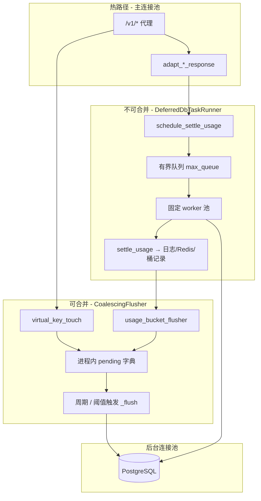

# Gateway 延迟写入与并发治理

> **适用范围**：`/v1/*` 代理热路径之后的用量回写、预算/配额窗口桶落库、响应后结算（`settle_usage`）。  
> **代码权威**：`libs/concurrency/`（通用原语）、`domains/gateway/application/{virtual_key_touch,usage_bucket_flusher,deferred_task_runner,proxy_response_adapter,proxy_deferred_tasks}.py`。  
> **关联文档**：[QUOTA_MANAGEMENT.md](./QUOTA_MANAGEMENT.md)（三层配额与桶表）、[AI_GATEWAY_DOMAIN_ARCHITECTURE.md](../AI_GATEWAY_DOMAIN_ARCHITECTURE.md) §代理分层。

---

## 1. 背景与问题

生产环境曾出现 Pod 反复重启、`QueuePool limit reached`、以及单行 `UPDATE gateway_virtual_keys` 执行数百秒的慢查询。根因可归纳为三类：

| 维度 | 旧行为 | 后果 |
|------|--------|------|
| **写热点** | 每个请求对同一 vkey / 当期热桶做 `UPDATE ... col = col + 1` | PostgreSQL 行级排他锁串行化，高 QPS 下大量「等锁」慢查询 |
| **并发无界** | 响应后 `asyncio.create_task` 无上限派发结算 / 落库 | 同时抢占后台连接池，事件循环饥饿，拖垮 `/health` |
| **驻留无界** | 待执行任务仅在事件循环队列中堆积 | 内存与连接池双重压力，极端流量下 OOM 风险 |

治理目标：**不丢账**（结算与用量最终一致）、**不阻塞 `/v1/*` 主路径**（仍异步）、**有界占用后台资源**。

---

## 2. 设计原则

### 2.1 按写入语义分流

```text
可合并（同一键/桶、增量可交换）     → CoalescingFlusher（进程内累加 + 周期批量落库）
不可合并（按 request_id 唯一）     → DeferredDbTaskRunner（有界队列 + 固定 worker）
```

| 写入类型 | 合并键 | 模块 |
|----------|--------|------|
| 虚拟 Key `usage_count` / `last_used_at` | `vkey_id` | `virtual_key_touch.py` |
| Platform 预算 / 套餐配额窗口桶 | `(ns, plan_id, quota_id, window_start)` | `usage_bucket_flusher.py` |
| 请求日志 + Redis 预扣确认 + 多表结算 | `request_id`（不可合并） | `proxy_response_adapter.schedule_settle_usage` |

### 2.2 为何不用「单纯信号量」

`asyncio.Semaphore` 只限制**同时执行**的任务数，不限制：

- 已 `create_task` 但尚在排队、尚未拿到信号量的任务**驻留数量**；
- 生产者侧的**背压**（队列满时如何降级）。

业界更稳妥的组合是 **Bulkhead（固定 worker）+ 有界队列 + 显式背压策略**。本方案对可合并写入优先用 **Coalescing**（从根上减少 UPDATE 次数），对不可合并写入用 **DeferredDbTaskRunner**。

### 2.3 背压与「不丢账」

结算类任务**禁止静默丢弃**。队列满时：

1. `submit` 先尝试 `put_nowait`；
2. 失败则阻塞等待空位（`gateway_deferred_task_submit_block_timeout_ms`）；
3. 仍满则 **inline `await` 执行**——极端过载时短暂拖慢调用方，但保证结算落库。

可合并刷写失败时，`CoalescingFlusher` 将快照 **merge_back** 到 pending，下个窗口重试（进程崩溃未刷增量与旧方案同口径，见 §6）。

### 2.4 连接池隔离

- **`/v1/*` 热路径**：主池 `database_pool_size`（默认 20）。
- **延迟写入 / 结算 / 刷写**：`prefer_background_pool()` → `database_background_pool_size`（默认 16）。

有界 worker 数建议**略小于后台池**，为 flusher 批量事务留余量。

---

## 3. 架构总览



### 3.1 代码分层

| 层 | 路径 | 职责 |
|----|------|------|
| **libs** | `libs/concurrency/coalescing_flusher.py` | 通用合并刷写器 `CoalescingFlusher[K,V]` |
| **libs** | `libs/concurrency/deferred_task_runner.py` | 通用有界执行器 `DeferredDbTaskRunner` |
| **gateway** | `deferred_task_runner.py` | 仅装配 `proxy_deferred_runner` 单例（读 Gateway 配置） |
| **gateway** | `virtual_key_touch.py` | vkey 用量合并 + `bulk_increment_usage` |
| **gateway** | `usage_bucket_flusher.py` | 预算/配额桶合并 + `increment_bucket` |
| **gateway** | `budget_usage_persist.py` / `quota_plan_usage_persist.py` | Redis `SET NX` 幂等 → `record_bucket_usage` |
| **gateway** | `proxy_response_adapter.py` | `schedule_settle_usage` → `proxy_deferred_runner.submit` |
| **gateway** | `proxy_deferred_tasks.py` | flusher 任务登记 + 进程 shutdown 收口 |

`CoalescingFlusher` 通过构造参数 `register_task` 注入 `register_proxy_deferred_task`，**不**依赖 Gateway 域，便于复用与单测。

---

## 4. 各路径行为说明

### 4.1 虚拟 Key 用量（`schedule_virtual_key_touch`）

- 热路径：进程内按 `vkey_id` 累加 `delta` 与 `max(last_used_at)`。
- 落库：`VirtualKeyRepository.bulk_increment_usage` — `usage_count += Δ`，`last_used_at = GREATEST(...)`（相对自增，跨 worker 正确）。
- 配置：`gateway_vkey_usage_flush_interval_seconds=0` 时降级为即时单条 `touch_used`（`create_task` + 登记）。

### 4.2 预算 / 配额窗口桶

1. **幂等前置**（仍在 application，未并入 flusher）  
   - Platform：`gateway:quota:{ns}_bucket_upserted:{request_id}:{source}`  
   - 套餐：`gateway:quota:{ns}_bucket_upserted:{request_id}`  
   Redis `SET NX`，TTL 24h；通过后才 `record_bucket_usage`。
2. **合并刷写**：同窗口桶增量在进程内求和，批量 `ON CONFLICT DO UPDATE` 相对自增。
3. **滚动窗口**：`is_sliding_rolling_window` 为 true 的规格仍**不落 PG 桶**（与读路径一致），逻辑未变。

### 4.3 响应后结算（`schedule_settle_usage`）

- `adapt_response` / `adapt_anthropic_response` / `adapt_binary_response` 在返回前 **`await schedule_settle_usage`**（登记任务，非阻塞等待整段结算完成）。
- 实际 DB 工作在 worker 内执行，且包裹 `prefer_background_pool()`。
- **流式**：`finalize_deferred_stream_settlement` 仍在请求 task 内直接 `await`，属请求生命周期，**不**经 `DeferredDbTaskRunner`（沿用主池）。

---

## 5. 关停与测试收口

`shutdown_proxy_deferred_tasks()` 顺序：

1. `proxy_deferred_runner.shutdown()` — `queue.join()` 限时排空，保证排队结算执行完毕（可能向 bucket flusher 追加增量）。
2. `cancel` 已登记的 flusher / 一次性刷写 task — `CoalescingFlusher._run` 的 `finally` 触发最后一次 `_flush`。

集成测与 teardown 应调用 `shutdown_proxy_deferred_tasks()`，再断言 DB 中的桶/日志（见 `tests/integration/api/test_platform_budget_usage_e2e.py`）。  
测试绑定 DB session 时，应对 **`usage_bucket_flusher.get_session_context`** 做 monkeypatch（而非已移除写入的 `budget_usage_persist.get_session_context`）。

---

## 6. 一致性与取舍

| 场景 | 保证 |
|------|------|
| 合并刷写成功 | 桶/vkey 用量与请求增量一致（已 Redis 去重的路径） |
| 刷写失败 | merge_back 重试；PG `statement_timeout` 防止单事务拖死 |
| 进程崩溃 | 未刷新的进程内增量可能丢失（与旧 fire-and-forget 同风险口径）；关键结算路径经 runner 排空 + flusher finally 尽量降低窗口 |
| 跨 worker | 相对自增 SQL + Redis 幂等；合并仅进程内，多副本各自刷写仍正确叠加 |

---

## 7. 配置项

均在 `bootstrap/config.py`（环境变量同名大写）：

| 配置项 | 默认 | 说明 |
|--------|------|------|
| `gateway_vkey_usage_flush_interval_seconds` | `5.0` | vkey 合并刷写间隔；`0` = 关闭合并 |
| `gateway_vkey_usage_flush_max_pending` | `2000` | 待刷 vkey 数超阈立即补刷 |
| `gateway_vkey_usage_flush_statement_timeout_ms` | `15000` | 刷写事务 PG 超时；`0` = 不设置 |
| `gateway_usage_bucket_flush_interval_seconds` | `5.0` | 桶合并刷写间隔；`0` = 关闭合并 |
| `gateway_usage_bucket_flush_max_pending` | `2000` | 待刷桶键数超阈立即补刷 |
| `gateway_usage_bucket_flush_statement_timeout_ms` | `15000` | 桶刷写事务 PG 超时 |
| `gateway_deferred_task_max_workers` | `12` | 结算 worker 数（建议 < `database_background_pool_size`） |
| `gateway_deferred_task_max_queue` | `5000` | 待执行结算任务队列容量 |
| `gateway_deferred_task_submit_block_timeout_ms` | `500` | 队列满时阻塞等待上限；超时后 inline 执行 |

关联连接池：`database_pool_size`（主）、`database_background_pool_size`（后台）。

---

## 8. 运维与排障

**症状 → 检查**

- `QueuePool limit reached`（后台池）→ 是否仍有未迁移的裸 `create_task` 打 DB；调低 `gateway_deferred_task_max_workers` 或增大 `database_background_pool_size`；查慢 SQL。
- vkey / 热桶慢 `UPDATE` → 确认合并刷写已开启（间隔 > 0）；查 `gateway_vkey_usage_flush_*` / `gateway_usage_bucket_flush_*`。
- 结算延迟可见、展示读滞后数秒 → 合并窗口默认 5s，属预期；需更强实时性可缩短间隔（换更多 WRITE）。
- `DeferredDbTaskRunner proxy-settlement saturated; running inline` → 队列/worker 饱和，短时过载；若持续出现应扩容 worker 或排查结算变慢。

**K8s 探活**：事件循环饥饿会导致 `/health` 超时触发重启；本方案通过有界并发缓解，排障步骤见 [`.agents/skills/k8s-production-debug/SKILL.md`](../../../.agents/skills/k8s-production-debug/SKILL.md)。

**可选后续（未实现）**：队列深度、inline 降级次数、flusher 批次大小/延迟的 metrics，便于容量规划。

---

## 9. 测试

| 类型 | 路径 |
|------|------|
| 原语单测 | `tests/unit/libs/concurrency/test_coalescing_flusher.py` |
| 原语单测 | `tests/unit/libs/concurrency/test_deferred_task_runner.py` |
| 桶调度单测 | `tests/unit/gateway/test_budget_usage_persist.py`、`test_quota_plan_usage_persist.py` |
| 代理适配单测 | `tests/unit/gateway/test_proxy_anthropic_native.py` 等 |
| 端到端 | `tests/integration/api/test_platform_budget_usage_e2e.py`（proxy → 结算 → shutdown → 展示读） |

---

## 10. 变更记录

| 日期 | 说明 |
|------|------|
| 2026-06 | 引入 `CoalescingFlusher` / `DeferredDbTaskRunner`；vkey、预算/配额桶、settle_usage 迁移；原语下沉 `libs/concurrency` |
