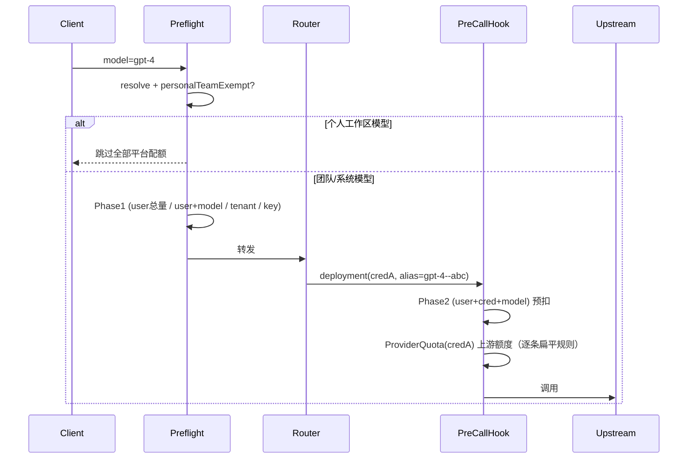

# Gateway 配额管理（Quota Management）

> 平台配额、上游配额、下游权益的统一概念、规则、热路径流程与运维要点。
> 代码权威：`domains/gateway`；本文与 [`LITELLM_CAPABILITY_MATRIX.md`](./LITELLM_CAPABILITY_MATRIX.md) §5 回调链互补。

## 1. 概念：三层配额

Gateway 把"额度/限制"分为三个互不替代的层，分别回答不同的问题：

| 层 | 回答的问题 | 数据载体 | 计数载体 |
|----|-----------|---------|---------|
| **平台配额** platform | "**我方/团队**在 Gateway 上能花多少" | `gateway_budgets` | Redis 预扣桶 + PG 展示汇总表；表内 `current_*` 为结算 rollup |
| **上游配额** upstream | "**某厂商凭据**在某 real_model 上还剩多少额度" | `provider_quotas`（**扁平**：一行 = 一条规则） | Redis 预扣桶 + PG 展示汇总表；`plan_id = quota_id = rule_id` |
| **下游权益** downstream | "**某客户/虚拟 Key**买了多少权益套餐" | `entitlement_plans`（容器头）+ `entitlement_plan_quotas`（执法行） | Redis 预扣桶 + PG 展示汇总表 |

- **平台配额**是面向**内部消费护栏**的（团队/成员/Key 维度），本文重点。
- **上游配额**只有"凭据 + real_model"维度，**无 user 维度**，不能替代"按成员限团队共享凭据"。**本人 BYOK**（`scope=user`）可设 upstream 厂商额度，展示归属 personal team。
- **下游 entitlement**：`entitlement_plans` 头仅作容器（scope + `included_models` + label）；**判活/起止/启用**只在 `entitlement_plan_quotas` 行级。
- 三层互补：一次调用可能同时受三层约束，任一层耗尽即拒绝。

### 上游扁平规则（`provider_quotas`）

拍平前为 `provider_plans` + `provider_plan_quotas` 两级；现合并为单表：

```text
provider_quotas: id, credential_id, real_model(NULL=整凭据), label,
  window_seconds, reset_strategy, reset_timezone, reset_time_minutes, reset_day_of_month,
  limit_usd/tokens/requests, enabled, valid_from, valid_until
```

唯一约束 `(credential_id, COALESCE(real_model,''), label)`。热路径 `ProviderQuotaGuard` 按 `(credential_id, real_model)` 加载多条活跃规则，逐条 `reserve(plan_id=rule_id, quota_id=rule_id)`。

## 2. 平台配额维度

`gateway_budgets` 的一行 = 一条平台配额规则，由以下维度唯一确定：

```
(target_kind, target_id, period, model_name, credential_id, tenant_id)
```

| 维度 | 取值 | 说明 |
|------|------|------|
| `target_kind` | `system` / `tenant` / `key` / `user` | 限额主体 |
| `target_id` | UUID / NULL | 主体 ID（`system` 为 NULL，`tenant` 为团队 ID） |
| `period` | `daily` / `monthly` / `total` | 计费周期 |
| `model_name` | 别名 / NULL | NULL = 该主体全模型汇总；非空 = 指定虚拟别名 |
| `credential_id` | UUID / NULL | **仅 `target_kind=user`** 可非空，表示"成员 + 凭据(+模型)"专属行 |
| `tenant_id` | UUID / NULL | **仅成员总量/模型护栏**（`target_kind=user` 且 `credential_id IS NULL`）非空，= 所属团队，实现按团队隔离（见 §9.1）；其余维度 NULL |

### 典型规则组合

| 需求 | target_kind | model_name | credential_id |
|------|-------------|-----------|---------------|
| 成员**总用量**护栏 | `user` | NULL | NULL |
| 成员 + **某虚拟模型** | `user` | `gpt-4` | NULL |
| 成员 + **某凭据** + **某模型** | `user` | `gpt-4--abc` | `<cred>` |
| 成员 + 某凭据下**全模型** | `user` | NULL | `<cred>` |
| 团队总护栏 | `tenant` | NULL | NULL |
| 虚拟 Key 限额 | `key` | NULL / 别名 | NULL |

> **多凭据路由**：客户端只传路由名（如 `gpt-4`），无法区分凭据。要按凭据限流，须用注册表里的"别名--凭据"虚拟名（如 `gpt-4--abc`），由 Router 选定 deployment 后按其实际 `gateway_credential_id` + `gateway_model_name` 归因。

## 3. BYOK / 个人工作区豁免

**个人工作区（personal team）下注册的模型属于成员自有资源（BYOK），整段跳过全部平台配额**（成员总量、成员+模型、成员+凭据+模型都不计）。

- 判定：解析行 `record.tenant_id == ensure_personal_team(user_id).id`（含从共享 vkey 调个人别名）。
- 纯函数策略：`domain/policies/budget_exemption_policy.py`。
- 效率优化（`ProxyGuard.is_platform_budget_exempt`）：
  - `tenant_id` 非空且 ≠ 计费团队 → 必为跨团队个人别名，**直接豁免，免查库**；
  - `tenant_id == 计费团队` 才查一次 `ensure_personal_team`（结果缓存在 `ProxyContext.personal_team_id`）；
  - 系统模型（无 `tenant_id`）始终受约束。
- Phase2 侧另有 `gateway_credential_scope == "user"` 兜底跳过（BYOK 凭据从不挂团队预算）。

## 4. 两阶段预算检查（热路径流程）

平台配额按主体维度分两阶段执行，以兼顾"入站早拒"与"凭据级精细归因"：

| 阶段 | 时机 | 坐标 | 失败语义 |
|------|------|------|---------|
| **Phase1** 预检 | 入站 preflight（Router 之前） | `(target_kind, target_id, period, model_name)` 且 `credential_id IS NULL` | `BudgetExceededError` → 429 |
| **Phase2** 部署 | LiteLLM `async_pre_call_hook`（Router 已选 deployment） | `target_kind=user` + `credential_id` + `model_name=gateway_model_name` + period | `BudgetExceededError` → 429，**不** fallback |



### 关键语义：429 vs fallback

- **平台配额耗尽**（Phase1/Phase2）→ `BudgetExceededError` → **硬 429**，绝不换 deployment 重试（否则会绕过成员限额）。
- **上游 ProviderQuota 耗尽** → `ProviderPlanExhaustedError`（类名保留）→ 触发 Router cooldown/fallback（换凭据是合理的）。
- Phase2 预算检查在 `async_pre_call_hook` **开头**执行，先于 ProviderQuota；耗尽直接抛出，不进入上游预扣。

### 结算 / 释放

| 时机 | 动作 |
|------|------|
| 成功回调 | `commit_user_credential_budget`：按真实 cost/token 累加到 Phase2 桶（按 `request_id` 幂等，防流式/多回调重复计） |
| 失败回调 | `release_user_credential_budget_from_metadata`：释放 Phase2 预扣的请求/token 名额 |
| 上游成功 | `ProviderQuotaGuard.commit_rule(rule_id, ...)` + `schedule_quota_plan_usage_upsert(ns=provider, plan_id=rule_id)` |
| 上游失败 | `ProviderQuotaGuard.release_rule` 按 metadata `gateway_provider_quota_reservations` |
| Phase1 预扣 | 经 `proxy_metadata_builder` 写入 metadata，由统一 settlement 在成功/失败/流式路径 commit/release |

- Phase2 归因字段全部来自**服务端构建的 metadata / model_info**（`gateway_user_id`、`gateway_credential_id`、`gateway_model_name`），**绝不**读取客户端可控字段。
- 结算用的 `gateway_model_name`（落库 `deploy_name`）与 Phase2 预扣读取的别名一致，commit/reserve 桶对齐。
- 日志列 `gateway_request_logs.provider_plan_id` **列名保留**，现存扁平 `rule_id`（更精确）。

## 5. 规则检查（写入校验 + 数据权限）

### 5.1 写入校验

写路径 `application/management/write_modules/quota_rule_writes.py` 的 `_resolve_platform_target` 串联：

1. **同步纯函数** `domain/policies/platform_budget_upsert_policy.py`：
   - `period` 仅 `daily`/`monthly`/`total`（平台不用 `window_seconds`）；
   - `credential_id` 仅允许配合 `target_kind=user`，否则 `ValidationError`；
   - 至少一项限额（`limit_usd`/`limit_tokens`/`limit_requests`）。
2. **成员归属** `_assert_budget_target_in_team`（复用 `budget_scope_policy`）。
3. **凭据归属** `_assert_credential_in_team`（`credential_id` 非空时）：仅当前 tenant 凭据或平台管理员 system 凭据；**BYOK `scope=user` 自动拒绝**。
4. **模型归属** `_assert_model_alias_on_credential`（`credential_id` + `model_name` 都非空时）：别名须在该凭据下已注册。
5. **上游模型归属** `_upsert_upstream_quota_rule`（`real_model` 非空时）调用 `_assert_real_model_on_credential`：`model_name` 为上游 **real_model**（LiteLLM id），须已在该凭据的 `gateway_models` / `system_gateway_models` 注册；`model_name=null` 表示整凭据规则（`provider_quotas.real_model IS NULL`），不做此项校验。
6. **唯一性**：DB 唯一索引冲突 → 友好 `ValidationError`。

写成功后三条缓存线均失效：`invalidate_gateway_budget_config_cache`（配置 cache）+ `invalidate_gateway_quota_rule_cache_for_team`（读侧列表）+ 维护 `gw:budget_uc:{user_id}` 存在性索引；upstream 写路径另触发 `invalidate_gateway_provider_quota_config_cache`。

### 5.2 数据权限（读 / 写）

| 能力 | 机制 |
|------|------|
| **写** | `PUT /quota-rules/batch` 依赖 `RequiredTeamAdmin`（团队/平台管理员）；`PUT /quota-rules/self-batch` 允许成员写本人 platform 与本人 BYOK upstream |
| **读（管理员）** | `list_budgets_for_team_admin` 拉全团队成员 budget（含带 `credential_id` 的 platform 行） |
| **读（普通成员）** | 仅 tenant + **本人** user + 可见 vkey 的 budget，经 `quota_rule_visible_to_member` 过滤 |
| **成员隔离** | `target_kind=user` 行仅 `user_id == actor_user_id` 可见；**凭据可见不扩大 user 行可见范围**——看不到他人的"成员+凭据"限额（防 `credential_id` 过滤枚举） |
| **读缓存隔离** | `assemble_team_quota_rules` 缓存的是**按 actor 过滤后**的列表（`quota_rule_cache`）。非管理员缓存键含 `actor_user_id`（`build_actor_role_hash`），避免同团队同角色成员串号；管理员看全量、与 actor 无关，缓存按角色共享 |

### 5.3 启用 / 停用与行级起止

三表（`gateway_budgets`、`provider_quotas`、`entitlement_plan_quotas`）均支持：

- `enabled`：停用时该规则不参与热路径执法
- `valid_from` / `valid_until`：行级生效窗口（NULL = 不限）

API：`POST /quota-rules/enablement`（管理员）、`POST /quota-rules/self/enablement`（成员自助）。定位键：platform 用 `budget_id`；upstream 用 `quota_id`；downstream 用 `plan_id` + `quota_id`。

## 6. 数据模型与索引

### 6.1 `gateway_budgets`

`infrastructure/models/budget.py`，迁移 `alembic/versions/20260611_gateway_budget_credential.py`、`20260612_gateway_budget_tenant.py`：

```text
列：target_kind, target_id, tenant_id, period, model_name, credential_id,
    limit_usd/tokens/requests, current_usd/tokens/requests, enabled, valid_from, valid_until, reset_at ...
```

部分唯一索引（按 `model_name` / `credential_id` 是否为空四象限互斥；`credential_id IS NULL` 两象限含 `COALESCE(tenant_id, 全零)` 以实现成员护栏的团队隔离）。

### 6.2 `provider_quotas`（上游扁平）

```text
唯一索引：uq_provider_quota_cred_model_label ON (credential_id, COALESCE(real_model,''), label)
热路径索引：(credential_id, real_model, enabled)
```

### 6.3 `entitlement_plans` + `entitlement_plan_quotas`（下游容器化）

- plan 头：`target_kind`（vkey / apikey_grant）、`target_id`、`label`、`included_models`、`included_capabilities`、`valid_from`（信息字段）
- **已移除** plan 头 `is_active` / `valid_until` / `auto_renew` 与 lifecycle 续费任务
- 执法/启停/起止在 `entitlement_plan_quotas` 行

## 7. 缓存与 Redis 键

### 7.1 管理面展示读（SSOT）

配额中心、`GET /quota-rules?include_usage=true`、模型详情「用量限额」等**展示读**统一走 PostgreSQL，与本地/线上 Redis 无关：

| 层 | 读路径 | 窗口语义 |
|----|--------|---------|
| platform | `gateway_quota_plan_usage_buckets`（`ns=platform`）**有桶优先**；bucket 缺失时按维度回退 `gateway_request_logs` | `daily` / `monthly` 由行内周期锚点计算；`total` = 累计 |
| upstream | **桶语义按策略分流**：`calendar_*` 走 `gateway_quota_plan_usage_buckets`（`ns=provider`，`plan_id=quota_id=rule_id`）；**`rolling` 不查/不落桶**，一律按 `[now-window, now]` 聚合日志 | `window_seconds` + `reset_strategy`；`calendar_daily_utc` / `calendar_monthly_utc` 有固定重置时刻；`rolling` = 滑动窗口，**无固定重置**（`reset_at` 置空） |
| downstream | 同上表（`ns=entitlement`）→ 日志按 `entitlement_plan_id` 兜底 | 同 upstream；执法看 quota 行 `enabled`/`valid_from`/`valid_until` |

- **Redis 仅用于**：预扣（`reserve`）、限流（RPM/TPM）、结算 `commit`、幂等锁；**不**作为展示 SSOT。
- **管理面手工校正/清零**（`apply_quota_usage_adjustment`）以 `set_bucket` 覆盖写入汇总桶并同步 Redis 执法桶。

### 7.2 Redis 键一览

| 用途 | 键 | 说明 |
|------|----|------|
| 配置缓存 | `gw:budget_cfg:entry:{ver}:{kind}:{tid}:{period}:{model}:{cred}` | 平台预算配置（L1 + Redis），TTL 60s |
| 上游扁平规则缓存 | `gw:provider_quota_cfg:entry:{ver}:{credential_id}:{model\|_}` | 按 `(credential_id, real_model)` 缓存活跃规则列表（L1 + Redis），TTL 60s |
| 上游负缓存（墓碑） | 同上键，值 = `\x00empty` | 无活跃规则时写墓碑；TTL 30s |
| 上游配置版本号 | `gw:provider_quota_cfg:ver` | upstream 写路径 `INCR` → O(1) 失效 |
| 用量计数桶 | `gateway:quota:provider:{rule_id}:{rule_id}` 等 | 与平台预算 `plan_id=quota_id` 约定一致 |
| 成员凭据存在性索引 | `gw:budget_uc:{user_id}` | SET of `credential_id`，Phase2 快路径；TTL 35 天 |

## 8. 配置示例

成员 Alice 在团队凭据 `cred-team-openai` 上的 `gpt-4--abc` 每月 \$50，且 Alice 全团队共享资源每月 \$200：

```json
[
  { "layer": "platform", "target_kind": "user", "target_id": "<alice>", "period": "monthly", "limit_usd": "200" },
  { "layer": "platform", "target_kind": "user", "target_id": "<alice>", "credential_id": "<cred-team-openai>", "model_name": "gpt-4--abc", "period": "monthly", "limit_usd": "50" }
]
```

上游凭据厂商额度（扁平规则）：

```json
[
  {
    "layer": "upstream",
    "credential_id": "<cred-volcengine>",
    "model_name": "ep-20260410150612-9pncb",
    "quota_label": "daily",
    "window_seconds": 86400,
    "reset_strategy": "calendar_daily_utc",
    "limit_requests": 1000
  }
]
```

前端：配额中心（`frontend/src/features/gateway-budget`）统一 batch upsert；upstream 定位用 `source_ref.quota_id`，无 `plan_id`。

火山 `ep-*` endpoint 的日历日限额、北京时间 11:00 重置、展示读与热路径细节见 [UPSTREAM_EP_QUOTA.md](./UPSTREAM_EP_QUOTA.md)。

## 9. 转发效率要点

- **DB**：Phase1/Phase2 主查走 `ix_gateway_budgets_target_lookup`，`OR` 批量拉取，单请求 ≤1 次查库且仅在缓存未命中时。
- **上游 ProviderQuota 配置缓存**：`ProviderQuotaGuard.check_and_reserve` 经 `provider_quota_config_cache` 读活跃扁平规则；命中后不再查 `provider_quotas`；写 upstream 规则时 `invalidate_gateway_provider_quota_config_cache`。
- **Phase2 无规则零开销**：`gw:budget_uc` 存在性索引先判定，绝大多数无 cred 规则的用户在 1 次 `SISMEMBER` 后即返回。
- **个人工作区豁免**：preflight 命中即 O(1) 返回，不进入 Phase1 plan。

## 9.1 成员额度的团队隔离（tenant 维度）

成员总量/模型护栏（`target_kind=user` 且 `credential_id IS NULL`）按**团队隔离**：

- `gateway_budgets.tenant_id` 仅此类行非空（= 该护栏所属团队）；`tenant`/`system`/`key` 与成员+凭据行恒 `NULL`。
- Redis 用量桶对成员护栏追加 `:t:{tenantseg}`，使同一成员在不同团队的总量互不串账。

## 10. 已知边界

- `gw:budget_uc` 索引仅 `add`，删除规则时不 `srem`：为**只读的"可能存在"过滤器**，假阳性仅触发一次配置缓存查询。
- metadata/model_info 丢失时 Phase2 跳过（与 ProviderQuota 一致的 fail-open：无规则则放行）。
- **已删除**：`provider-plans` CRUD API、`gateway_plan_lifecycle_loop`、`plan_anniversary` 重置策略、plan 头 auto_renew。
- **下游 `apikey_grant` scope 权益不进配额中心（有意为之）**：查看/增删改在 API Key grant → 权益页；执法仍生效。

## 11. 迁移与运维

- Alembic：`20260628_flatten_provider_quotas` — 建 `provider_quotas`，删 `provider_plans` / `provider_plan_quotas`；`entitlement_plans` 删 `is_active`/`valid_until`/`auto_renew`。
- Ops SQL：`alembic/sql/20260628_flatten_provider_quotas.{up,down}.sql`
- 生产部署前配额已清空，无数据迁移负担；**不向后兼容**旧 provider plan 两级结构。
