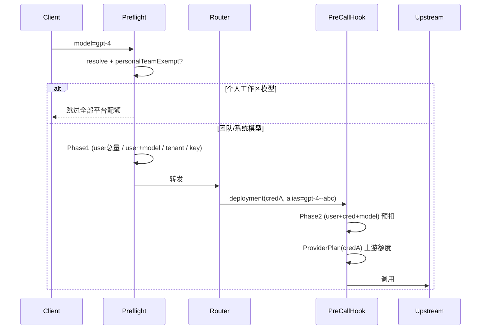

# Gateway 配额管理（Quota Management）

> 平台配额、上游配额、下游权益的统一概念、规则、热路径流程与运维要点。
> 代码权威：`domains/gateway`；本文与 [`LITELLM_CAPABILITY_MATRIX.md`](./LITELLM_CAPABILITY_MATRIX.md) §5 回调链互补。

## 1. 概念：三层配额

Gateway 把"额度/限制"分为三个互不替代的层，分别回答不同的问题：

| 层 | 回答的问题 | 数据载体 | 计数载体 |
|----|-----------|---------|---------|
| **平台配额** platform | "**我方/团队**在 Gateway 上能花多少" | `gateway_budgets` | Redis 预扣桶 + PG 展示汇总表；表内 `current_*` 为结算 rollup |
| **上游配额** upstream | "**某厂商凭据**在某 real_model 上还剩多少额度" | `provider_plans` + `provider_plan_quotas` | Redis 预扣桶 + PG 展示汇总表 |
| **下游权益** downstream | "**某客户/虚拟 Key**买了多少权益套餐" | `entitlement_plans` + `entitlement_quotas` | Redis 预扣桶 + PG 展示汇总表 |

- **平台配额**是面向**内部消费护栏**的（团队/成员/Key 维度），本文重点。
- **上游配额**只有"凭据 + real_model"维度，**无 user 维度**，不能替代"按成员限团队共享凭据"。**本人 BYOK**（`scope=user`）可设 upstream 厂商额度，展示归属 personal team。
- 三层互补：一次调用可能同时受三层约束，任一层耗尽即拒绝。

## 2. 平台配额维度

`gateway_budgets` 的一行 = 一条平台配额规则，由以下维度唯一确定：

```
(target_kind, target_id, period, model_name, credential_id, tenant_id)
```

| 维度 | 取值 | 说明 |
|------|------|------|
| `target_kind` | `system` / `tenant` / `key` / `user` | 限额主体 |
| `target_id` | UUID / NULL | 主体 ID（`system` 为 NULL，`tenant` 为团队 ID） |
| `period` | `daily` / `monthly` / `total` | 计费周期 |
| `model_name` | 别名 / NULL | NULL = 该主体全模型汇总；非空 = 指定虚拟别名 |
| `credential_id` | UUID / NULL | **仅 `target_kind=user`** 可非空，表示"成员 + 凭据(+模型)"专属行 |
| `tenant_id` | UUID / NULL | **仅成员总量/模型护栏**（`target_kind=user` 且 `credential_id IS NULL`）非空，= 所属团队，实现按团队隔离（见 §9.1）；其余维度 NULL |

### 典型规则组合

| 需求 | target_kind | model_name | credential_id |
|------|-------------|-----------|---------------|
| 成员**总用量**护栏 | `user` | NULL | NULL |
| 成员 + **某虚拟模型** | `user` | `gpt-4` | NULL |
| 成员 + **某凭据** + **某模型** | `user` | `gpt-4--abc` | `<cred>` |
| 成员 + 某凭据下**全模型** | `user` | NULL | `<cred>` |
| 团队总护栏 | `tenant` | NULL | NULL |
| 虚拟 Key 限额 | `key` | NULL / 别名 | NULL |

> **多凭据路由**：客户端只传路由名（如 `gpt-4`），无法区分凭据。要按凭据限流，须用注册表里的"别名--凭据"虚拟名（如 `gpt-4--abc`），由 Router 选定 deployment 后按其实际 `gateway_credential_id` + `gateway_model_name` 归因。

## 3. BYOK / 个人工作区豁免

**个人工作区（personal team）下注册的模型属于成员自有资源（BYOK），整段跳过全部平台配额**（成员总量、成员+模型、成员+凭据+模型都不计）。

- 判定：解析行 `record.tenant_id == ensure_personal_team(user_id).id`（含从共享 vkey 调个人别名）。
- 纯函数策略：`domain/policies/budget_exemption_policy.py`。
- 效率优化（`ProxyGuard.is_platform_budget_exempt`）：
  - `tenant_id` 非空且 ≠ 计费团队 → 必为跨团队个人别名，**直接豁免，免查库**；
  - `tenant_id == 计费团队` 才查一次 `ensure_personal_team`（结果缓存在 `ProxyContext.personal_team_id`）；
  - 系统模型（无 `tenant_id`）始终受约束。
- Phase2 侧另有 `gateway_credential_scope == "user"` 兜底跳过（BYOK 凭据从不挂团队预算）。

## 4. 两阶段预算检查（热路径流程）

平台配额按主体维度分两阶段执行，以兼顾"入站早拒"与"凭据级精细归因"：

| 阶段 | 时机 | 坐标 | 失败语义 |
|------|------|------|---------|
| **Phase1** 预检 | 入站 preflight（Router 之前） | `(target_kind, target_id, period, model_name)` 且 `credential_id IS NULL` | `BudgetExceededError` → 429 |
| **Phase2** 部署 | LiteLLM `async_pre_call_hook`（Router 已选 deployment） | `target_kind=user` + `credential_id` + `model_name=gateway_model_name` + period | `BudgetExceededError` → 429，**不** fallback |



### 关键语义：429 vs fallback

- **平台配额耗尽**（Phase1/Phase2）→ `BudgetExceededError` → **硬 429**，绝不换 deployment 重试（否则会绕过成员限额）。
- **上游 ProviderPlan 耗尽** → `ProviderPlanExhaustedError` → 触发 Router cooldown/fallback（换凭据是合理的）。
- Phase2 预算检查在 `async_pre_call_hook` **开头**执行，先于 ProviderPlan；耗尽直接抛出，不进入上游预扣。

### 结算 / 释放

| 时机 | 动作 |
|------|------|
| 成功回调 | `commit_user_credential_budget`：按真实 cost/token 累加到 Phase2 桶（按 `request_id` 幂等，防流式/多回调重复计） |
| 失败回调 | `release_user_credential_budget_from_metadata`：释放 Phase2 预扣的请求/token 名额 |
| Phase1 预扣 | 经 `proxy_metadata_builder` 写入 metadata，由统一 settlement 在成功/失败/流式路径 commit/release |

- Phase2 归因字段全部来自**服务端构建的 metadata / model_info**（`gateway_user_id`、`gateway_credential_id`、`gateway_model_name`），**绝不**读取客户端可控字段。
- 结算用的 `gateway_model_name`（落库 `deploy_name`）与 Phase2 预扣读取的别名一致，commit/reserve 桶对齐。

## 5. 规则检查（写入校验 + 数据权限）

### 5.1 写入校验

写路径 `application/management/write_modules/quota_rule_writes.py` 的 `_resolve_platform_target` 串联：

1. **同步纯函数** `domain/policies/platform_budget_upsert_policy.py`：
   - `period` 仅 `daily`/`monthly`/`total`（平台不用 `window_seconds`）；
   - `credential_id` 仅允许配合 `target_kind=user`，否则 `ValidationError`；
   - 至少一项限额（`limit_usd`/`limit_tokens`/`limit_requests`）。
2. **成员归属** `_assert_budget_target_in_team`（复用 `budget_scope_policy`）。
3. **凭据归属** `_assert_credential_in_team`（`credential_id` 非空时）：仅当前 tenant 凭据或平台管理员 system 凭据；**BYOK `scope=user` 自动拒绝**。
4. **模型归属** `_assert_model_alias_on_credential`（`credential_id` + `model_name` 都非空时）：别名须在该凭据下已注册。
5. **上游模型归属** `_upsert_upstream_quota_rule` 与凭据页 `create_provider_plan` / `update_provider_plan`（`real_model` 非空时）均调用 `_assert_real_model_on_credential`：`model_name` 为上游 **real_model**（LiteLLM id），须已在该凭据的 `gateway_models` / `system_gateway_models` 注册；`model_name=null` 表示整凭据套餐（`provider_plans.real_model IS NULL`），不做此项校验。
6. **唯一性**：DB 部分唯一索引冲突 → 友好 `ValidationError`。

写成功后三条缓存线均失效：`invalidate_gateway_budget_config_cache`（配置 cache）+ `invalidate_gateway_quota_rule_cache_for_team`（读侧列表）+ 维护 `gw:budget_uc:{user_id}` 存在性索引。

### 5.2 数据权限（读 / 写）

| 能力 | 机制 |
|------|------|
| **写** | `PUT /quota-rules/batch` 依赖 `RequiredTeamAdmin`（团队/平台管理员）；`PUT /quota-rules/self-batch` 允许成员写本人 platform 与本人 BYOK upstream |
| **读（管理员）** | `list_budgets_for_team_admin` 拉全团队成员 budget（含带 `credential_id` 的 platform 行） |
| **读（普通成员）** | 仅 tenant + **本人** user + 可见 vkey 的 budget，经 `quota_rule_visible_to_member` 过滤 |
| **成员隔离** | `target_kind=user` 行仅 `user_id == actor_user_id` 可见；**凭据可见不扩大 user 行可见范围**——看不到他人的"成员+凭据"限额（防 `credential_id` 过滤枚举） |

## 6. 数据模型与索引

`gateway_budgets`（`infrastructure/models/budget.py`，迁移 `alembic/versions/20260611_gateway_budget_credential.py`、`20260612_gateway_budget_tenant.py`）：

```text
列：target_kind, target_id, tenant_id, period, model_name, credential_id,
    limit_usd/tokens/requests, current_usd/tokens/requests, reset_at ...
```

部分唯一索引（按 `model_name` / `credential_id` 是否为空四象限互斥；`credential_id IS NULL` 两象限含 `COALESCE(tenant_id, 全零)` 以实现成员护栏的团队隔离）：

| 索引 | 条件 | 含 tenant |
|------|------|-----------|
| `uq_gateway_budgets_target_period_agg` | `model_name IS NULL AND credential_id IS NULL` | 是（COALESCE） |
| `uq_gateway_budgets_target_period_model` | `model_name IS NOT NULL AND credential_id IS NULL` | 是（COALESCE） |
| `uq_gateway_budgets_target_period_cred_agg` | `model_name IS NULL AND credential_id IS NOT NULL` | 否 |
| `uq_gateway_budgets_target_period_cred_model` | `model_name IS NOT NULL AND credential_id IS NOT NULL` | 否 |

辅助索引：`ix_gateway_budgets_target_lookup (target_kind, target_id)`（热路径主查），`ix_gateway_budgets_credential_id`，`ix_gateway_budgets_tenant_id`。

## 7. 缓存与 Redis 键

### 7.1 管理面展示读（SSOT）

配额中心、`GET /quota-rules?include_usage=true`、模型详情「用量限额」等**展示读**统一走 PostgreSQL，与本地/线上 Redis 无关：

| 层 | 读路径 | 窗口语义 |
|----|--------|---------|
| platform | `gateway_quota_plan_usage_buckets`（`ns=platform`）**有桶优先**：存在 bucket 即以其为准（含管理面校正/清零写入的覆盖值）；bucket 缺失时按维度回退 `gateway_request_logs`；`system` 维度无稳定日志归因，仅 bucket。与 upstream/downstream 同一口径 | `daily` / `monthly` 由行内 **周期锚点**（`period_timezone` + `period_reset_minutes` + `period_reset_day`）经 domain `compute_period_window_start` 计算；默认 `UTC/00:00/1` 等同 **UTC 自然日/月**；`total` = 累计（忽略锚点） |
| upstream | **桶语义按策略分流**：`calendar_*` / `plan_anniversary` 走 `gateway_quota_plan_usage_buckets`（`ns=provider`）有桶优先、日志按 `provider_plan_id` 兜底；**`rolling` 不查/不落桶**，一律按 `[now-window, now]` 直接聚合日志（其 `window_start` 每分钟滑动，落桶会每分钟一行且读到的桶仅含当前分钟而严重低估，故绕开桶，与执法侧 Redis 分钟桶滑动求和一致） | `window_seconds` + `reset_strategy`；`calendar_daily_utc` / `calendar_monthly_utc` 读 `reset_timezone` / `reset_time_minutes` / `reset_day_of_month`（月切日 1–31，短月按月末 clamp，与 Stripe 一致），有**固定重置时刻**；`rolling` = 滑动窗口，**无固定重置**（`reset_at` 置空，展示「滚动窗口 · 近 Xh」），仅用于自定义/子日窗口；`plan_anniversary` 以 `valid_from` 为锚。**写入默认**：未显式指定策略时 `86400→calendar_daily_utc`、`2592000→calendar_monthly_utc`、其它→`rolling`（`default_reset_strategy_for_window`，与前端预设一致） |
| downstream | 同上表（`ns=entitlement`）→ 日志按 `entitlement_plan_id` 兜底 | 同 upstream |

- **Redis 仅用于**：预扣（`reserve`）、限流（RPM/TPM）、结算 `commit`、幂等锁；**不**作为展示 SSOT。
- **写路径**：proxy/callback 成功结算后异步 `UPSERT` 汇总表（`schedule_platform_budget_usage_upsert` / `schedule_quota_plan_usage_upsert`）；platform 按 `request_id` + 来源（`proxy` / `callback`）幂等。defer 流式下 proxy 先记 token、callback 补记 cost；**callback 经 `_delta_after_proxy_cost` / `_delta_after_proxy_tokens` 始终扣减 proxy 已记部分**，避免 token 在 Redis 执法桶与汇总表重复累加。
- **管理面手工校正/清零**（`apply_quota_usage_adjustment`）以 `set_bucket` 覆盖写入汇总桶并同步 Redis 执法桶；因展示读「有桶优先」，校正值即时生效，不再被历史日志覆盖。
- **勿**直接读 `gateway_budgets.current_*` 作展示权威：无日/月自动 reset 任务，与 Redis 日切语义可能漂移；展示以 bucket + 日志为准。
- **preflight 锚点 pin**：`check_budget` 将当时各坐标周期锚点写入 `ctx.platform_budget_preflight` 并序列化到 `gateway_platform_budget_anchor_pins`；同一次请求的 `reserve` / `commit`（含 callback）优先使用 pin，避免管理面 mid-flight 改锚点导致 Redis 分桶不一致。改锚点后旧 `ws:*` / `%Y%m%d` 桶自然 TTL 过期，不自动迁移历史用量。

### 7.2 Redis 键一览

| 用途 | 键 | 说明 |
|------|----|------|
| 配置缓存 | `gw:budget_cfg:entry:{ver}:{kind}:{tid}:{period}:{model}:{cred}` | 按 coord 细粒度缓存配置行（L1 内存 + Redis），命中 TTL 60s |
| 配置负缓存（墓碑） | 同上键，值 = `\x00empty` | 查无此行时写墓碑，避免无预算主体每请求查库；TTL 30s |
| 配置版本号 | `gw:budget_cfg:ver` | 写路径 `INCR` → O(1) 失效全部 plan 缓存（含墓碑） |
| 上游 ProviderPlan 配置缓存 | `gw:provider_plan_cfg:entry:{ver}:{credential_id}:{model\|_}` | 按 `(credential_id, real_model)` 缓存活跃套餐 + quotas 快照（L1 + Redis），TTL 60s |
| 上游 ProviderPlan 负缓存（墓碑） | 同上键，值 = `\x00empty` | 无活跃 plan 时写墓碑，避免每请求查 `provider_plans`；TTL 30s |
| 上游 ProviderPlan 配置版本号 | `gw:provider_plan_cfg:ver` | upstream 规则 / ProviderPlan 写路径 `INCR` → O(1) 失效全部上游配置缓存 |
| 用量计数桶 | `gateway:budget:{kind}:{sid}:{period}:{suffix}[:t:{tenantseg}][:c:{credseg}][:m:{modelseg}]` | 实时预扣/结算计数；`suffix` 默认锚点为 `%Y%m%d`（日）/ `%Y%m`（月），自定义锚点为 `ws:{window_start_unix}`；`tenantseg`/`credseg`/`modelseg` 为 sha256 前 16 位。`tenantseg` 仅 `kind=user` 的成员总量/模型护栏行带（按团队隔离），`credseg` 仅 Phase2 成员+凭据行带 |
| 成员凭据存在性索引 | `gw:budget_uc:{user_id}` | SET of `credential_id`，Phase2 快路径；TTL 35 天 |
| Phase2 结算幂等 | `gateway:budget:uc_settled:{request_id}` | `SET NX`，防流式/多回调重复累加；TTL 1 天 |

## 8. 配置示例

成员 Alice 在团队凭据 `cred-team-openai` 上的 `gpt-4--abc` 每月 \$50，且 Alice 全团队共享资源每月 \$200：

```json
[
  { "layer": "platform", "target_kind": "user", "target_id": "<alice>", "period": "monthly", "limit_usd": "200" },
  { "layer": "platform", "target_kind": "user", "target_id": "<alice>", "credential_id": "<cred-team-openai>", "model_name": "gpt-4--abc", "period": "monthly", "limit_usd": "50" }
]
```

前端：配额中心批量抽屉（`frontend/src/features/gateway-budget`）在 platform + "指定成员"时可多选凭据，按"成员 × 凭据 × 模型"笛卡尔积生成规则；不选凭据则为成员总量护栏。

## 9. 转发效率要点

- **DB**：Phase1/Phase2 主查走 `ix_gateway_budgets_target_lookup`，`OR` 批量拉取（`get_many_by_plan`），单请求 ≤1 次查库且仅在缓存未命中时。
- **配置缓存**：命中 L1（进程内）即零 IO；跨副本经 Redis + 版本号。配置行含 **周期锚点**（3 标量），热路径 `reserve`/`commit`/`release` 经 `compute_platform_redis_period_suffix` O(1) 推导 Redis 后缀，**不新增 DB 查询**。
- **上游 ProviderPlan 配置缓存**：`ProviderPlanGuard.check_and_reserve` 经 `provider_plan_config_cache` 读活跃套餐；命中后不再查 `provider_plans` / `provider_plan_quotas`；写 upstream 规则或 entitlement 写 ProviderPlan 时 `invalidate_gateway_provider_plan_config_cache`（`upstream_changed` 写路径统一触发）。
- **负缓存（墓碑）**：查无预算的坐标写墓碑（L1 + Redis，TTL 30s），无平台配额的租户/成员后续请求**不再每请求查库**；写规则 `INCR` 版本号即令旧墓碑不可达，正确性不受影响。
- **Phase2 无规则零开销**：`gw:budget_uc` 存在性索引先判定，绝大多数无 cred 规则的用户在 1 次 `SISMEMBER` 后即返回，**不查库、不进配置缓存**。
- **个人工作区豁免**：preflight 命中即 O(1) 返回，不进入 Phase1 plan。
- 有规则且命中缓存时，Phase2 额外耗时 ≈ 1 次 Redis 读配置 + 1 次 Redis 预扣，相对上游 HTTP 可忽略。

## 9.1 成员额度的团队隔离（tenant 维度）

成员总量/模型护栏（`target_kind=user` 且 `credential_id IS NULL`）按**团队隔离**：

- `gateway_budgets.tenant_id` 仅此类行非空（= 该护栏所属团队）；`tenant`/`system`/`key` 与成员+凭据行恒 `NULL`。
- 坐标 6 元组 `(target_kind, target_id, period, model_name, credential_id, tenant_id)` 贯穿 plan / 配置缓存 / 仓储匹配；Phase1 成员维度以**计费团队**填充 `tenant_id`，其余维度为 `None`。
- Redis 用量桶对成员护栏追加 `:t:{tenantseg}`，使同一成员在不同团队的总量互不串账；预扣（`reserve`）/释放（`release`）/结算（`commit`，proxy 与 callback 两路）一致传 `tenant_id`。
- 唯一索引 `uq_..._target_period_agg` / `..._model` 含 `COALESCE(tenant_id, 全零 UUID)`：成员护栏按团队各一行，非成员维度（`tenant_id` 恒 NULL）唯一性不变。
- 读路径：成员 `user` 预算的团队轴收敛规则在 domain `quota_rule_visibility.member_user_budget_visible_in_team`——护栏行（无凭据）按 `tenant_id == team_id` 隔离，**成员+凭据行按团队可见凭据集合收敛**（凭据天然绑定团队）；`list_budgets_for_tenant_and_user` / `list_budgets_for_team_admin` 及配额中心 assembler 共用同一规则与同一份 `visible_credential_ids`，故**直读 `GET /budgets` 与配额中心均不再跨团队泄漏成员凭据级预算**。
- **成员+凭据(+模型)（Phase2）运行时不变**：由 `credential` 天然绑定团队，无需 `tenant` 维度；上述收敛仅作用于管理面读路径展示。

## 10. 已知边界

- `gw:budget_uc` 索引仅 `add`，删除规则时不 `srem`：为**只读的"可能存在"过滤器**，假阳性仅触发一次配置缓存查询（返回空、不误扣），并随 35 天 TTL 自愈。删除规则的**正确性**由 `invalidate_gateway_budget_config_cache` 保证。
- 成员额度已按团队隔离（见 §9.1）。迁移 `20260612_gbt` 仅加列与改索引；历史 `tenant_id IS NULL` 的成员护栏行曾既不可见也不被热路径匹配（数据黑洞）。迁移 `20260615_gbtb` 已按确定性规则回填（shared 团队优先、加入最早；选定团队下已重建同坐标新行的历史行直接删除）；仅无任何活跃团队成员资格的行保持 NULL（不可达，留待人工清理）。
- 删除/归属校验（`_assert_budget_in_team`）除 target 归属外，还校验成员护栏行的 `tenant_id == 当前团队`、成员+凭据行的凭据在当前团队可见集合内，防止同一成员所在他团队管理员跨团队删除。
- metadata/model_info 丢失时 Phase2 跳过（与 ProviderPlan 一致的 fail-open：无规则则放行）。
- 不改 `EntitlementPlan`/`ProviderPlan` 语义；不改造 `identity/UserQuota`（旧身份配额并行存在）。
- **下游 `apikey_grant` scope 权益不进配额中心（有意为之）**：`EntitlementPlan` 的 `scope ∈ {vkey, apikey_grant}` 两者均参与执法（入站经平台 API Key 时 `gateway_proxy_context` 写入 `platform_api_key_grant_id` → `EntitlementGuard` 命中即可 429），但配额中心装配器 `quota_rule_assembler` **仅枚举 vkey scope**（`list_entitlement_plans_with_quotas_for_vkeys`）。`apikey_grant` 权益的查看 / 增删改统一在 **API Key grant → 权益** 页（`GET|POST /plans/api-key-grants/{grant_id}/entitlements`），不在配额中心聚合展示。读模型 / 映射 / 可见性 / 单条删除均已支持 `access_kind='apikey_grant'`；若后续需在配额中心聚合，仅缺「列团队全部 api-key grant」查询（`ApiKeyGatewayGrantQueryPort` 现仅 `assert_..._in_team`，需补 list 端口 + 仓储查询，再让装配器比照 vkey 遍历）。
