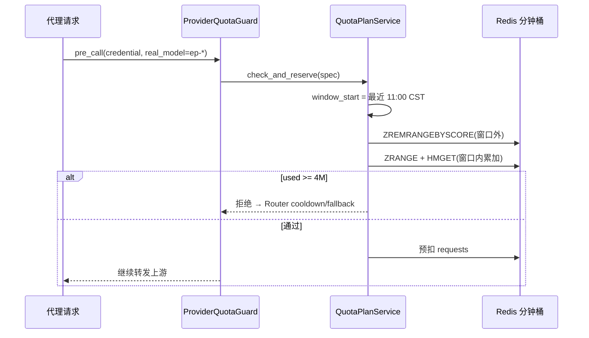

# 火山 ep 上游配额：逻辑说明

> 本文说明「`ep-*` 火山 endpoint 上游每日 token 限额」的**数据模型、自动重置、执法热路径、前端展示读与转发效率**。
> 通用三层配额概念见 [QUOTA_MANAGEMENT.md](./QUOTA_MANAGEMENT.md)。

## 1. 背景与术语

### 1.1 `ep-*` 是什么

火山引擎（volcengine）的 **endpoint id**，形如 `ep-20260410150612-9pncb`。在 Gateway 中：

| 字段 | 表 | 含义 |
|------|-----|------|
| `real_model` | `gateway_models` / `provider_quotas` | 厂商侧模型标识，即 endpoint id |
| `name` | `gateway_models` | 平台内虚拟别名（用户可见） |
| `credential_id` | `provider_credentials` | 上游凭据，如 `huoshan-common` |

**注意**：`ep-*` 是 **real_model**，不是凭据展示名 `name`。上游配额按 `(credential_id, real_model, label)` 唯一确定一行规则。

### 1.2 当前生产配置（示例）

凭据 `huoshan-common`（`provider=volcengine`）下注册的 12 个 `ep-*` 模型，各有一条扁平上游规则：

| 字段 | 值 |
|------|-----|
| `label` | `default` |
| `window_seconds` | `86400`（日历日） |
| `reset_strategy` | `calendar_daily_utc` |
| `reset_timezone` | `Asia/Shanghai` |
| `reset_time_minutes` | `660`（11:00） |
| `limit_tokens` | `4_000_000` |
| `enabled` | `true` |

唯一约束：`(credential_id, COALESCE(real_model,''), label)`。

---

## 2. 数据模型

### 2.1 规则表 `provider_quotas`

扁平单表（迁移 `20260628_flatten_provider_quotas`），一行 = 一条执法规则：

```text
provider_quotas
  id, credential_id, real_model, label,
  window_seconds, reset_strategy,
  reset_timezone, reset_time_minutes, reset_day_of_month,
  limit_usd, limit_tokens, limit_requests,
  enabled, valid_from, valid_until
```

- `real_model = NULL`：整凭据共享（所有模型共用同一规则）
- `real_model = 'ep-...'`：仅该 endpoint 生效
- `plan_id = quota_id = rule_id`（热路径 Redis 键与展示读 PG 桶均用 `rule_id`）

### 2.2 用量存哪里

| 用途 | 存储 | 说明 |
|------|------|------|
| **执法（拦请求）** | Redis 分钟桶 | `gateway:quota:provider:{rule_id}:{rule_id}` |
| **展示（配额中心 UI）** | PG `gateway_quota_plan_usage_buckets` | `ns=provider`，异步 upsert |
| **规则配置** | PG `provider_quotas` + 配置缓存 | L1 内存 + Redis `gw:provider_quota_cfg:*` |

规则表**不存** `current_tokens`；用量只在 Redis / PG 汇总桶中按窗口现算。

---

## 3. 日历重置：北京时间 11:00 自动归零

### 3.1 无定时任务

系统**没有** cron 或后台任务去「清零计数器」。重置是**查询时按当前窗口起点动态计算**的：

1. 每次 `check_and_reserve` / `snapshot` 调用 `compute_window_start_minute(now, window_seconds, strategy, period_reset_anchor)`
2. 对 `calendar_daily_utc` + 非默认锚点，窗口起点 = **最近一次本地 11:00**（`period_reset_anchor.py` → `_calendar_daily_window_start_local`）
3. `ZREMRANGEBYSCORE` 删掉窗口起点之前的分钟桶索引，只累加窗口内的桶 → `used` 自然归零



### 3.2 锚点字段含义

| 字段 | 本场景 | 说明 |
|------|--------|------|
| `reset_timezone` | `Asia/Shanghai` | IANA 时区 |
| `reset_time_minutes` | `660` | 本地日切时刻 = 11×60 分钟 |
| `reset_day_of_month` | `1` | 日窗口忽略；月窗口时用 |

`reset_strategy=calendar_daily_utc` 且 `window_seconds=86400` 时，**下一个重置时刻** = 次日北京时间 11:00（`compute_reset_at`）。

### 3.3 上游 429 强制耗尽也会按同一锚点解禁

上游返回 402/429/`insufficient_quota` 时，`ProviderQuotaGuard.mark_upstream_exhausted_rules` → `QuotaPlanService.force_exhaust`，设置 `:forced_until` 到**下一个 11:00 CST**，期间 snapshot 视为已耗尽。

---

## 4. 执法热路径（转发效率）

### 4.1 调用链

```text
LiteLLM async_pre_call_hook
  → ProviderQuotaGuard.check_and_reserve(credential_id, real_model)
    → get_cached_provider_quotas()          # L1 + Redis，命中则不查 DB
    → enforceable_specs_from_rows()         # 过滤 enabled / valid_from / valid_until
    → QuotaPlanService.check_and_reserve()  # 每条规则单独 reserve
  → 成功 callback
    → ProviderQuotaGuard.commit_rule()
    → schedule_quota_plan_usage_upsert()    # 异步写 PG 展示桶，不阻塞热路径
```

代码入口：`application/provider_quota_guard.py`、`application/quota_plan_service.py`。

### 4.2 短路与缓存

| 场景 | 行为 |
|------|------|
| 无活跃规则 | `if not specs: return []`，**零 Redis 计数开销** |
| 配置 L1 命中 | **0 DB、0 Redis** 读规则 |
| 配置 Redis 命中 | 0 DB；2 次 Redis（version + entry） |
| 配置全 miss | 1 次 PG `list_active_for_credential_model` + 写缓存 |

写规则后须 `invalidate_gateway_provider_quota_config_cache()`（管理 API 写路径已自动调用）。

### 4.3 单条 daily 规则的 Redis 成本（每请求）

对 `calendar_daily_utc` + 86400s，每个 `ep` 模型通常只有 **1 条** `default` 规则：

| 阶段 | Redis 往返 | 说明 |
|------|-----------|------|
| `snapshot` | ~4 | `GET forced_until` + `ZREMRANGEBYSCORE` + `ZRANGE` + 1 pipeline（≤1440 次 HMGET） |
| `reserve` | 1 | pipeline：`HINCRBY requests` + `ZADD` + `EXPIRE` |
| `commit`（成功） | 1 | pipeline：`HINCRBY tokens` + … |

合计约 **5 + 1 = 6 次 RT/模型/请求**（配置 L1 命中时）。日窗口分钟桶最多 1440 个，扫描**有界**；桶 TTL = `86400 + 120s`，过期自动清理。

### 4.4 耗尽语义

- **上游 ProviderQuota 耗尽** → `ProviderPlanExhaustedError` → Router **可 fallback** 换凭据（与平台预算 429 硬拒不同）
- 详见 [QUOTA_MANAGEMENT.md §4](./QUOTA_MANAGEMENT.md#4-两阶段预算检查热路径流程)

---

## 5. 前端展示读 API

### 5.1 请求

配额中心通过：

```http
GET /api/v1/gateway/teams/{team_id}/quota-rules?layer=upstream&include_usage=true
```

可选 `credential_id` 过滤。前端：`features/gateway-budget/use-quota-center.ts` → `useGatewayQuotaRules`。

### 5.2 响应字段

| API 字段 | 含义 |
|----------|------|
| `usage.window_start` | 当前窗口起点（UTC ISO） |
| `usage.reset_at` | 下次重置时刻（本场景 = 次日 11:00 CST） |
| `usage.current_tokens` | 展示用量（非 Redis 实时值） |
| `limit_tokens` | 规则上限 |

周期文案：`quota-rule-utils.ts` → `formatQuotaRulePeriodWindow`（calendar 显示「本周期 … — 下次重置 …」）。

### 5.3 窗口 / reset_at：与执法同口径 ✅

组装规则时 `quota_rule_read_mappers._plan_quota_period_bounds` 使用与执法相同的纯函数：

- `period_reset_anchor_from_plan_quota(reset_timezone, reset_time_minutes, …)`
- `compute_window_start_minute` / `compute_reset_at`

因此 UI 显示的「下次重置」= **北京时间每天 11:00**，不是 UTC 00:00。

### 5.4 已用量：展示读与执法分离（有意设计）

`include_usage=true` 时，`enrich_quota_rules_with_usage` **不读** `QuotaPlanService.snapshot`：

| 策略 | 用量来源 |
|------|----------|
| `calendar_daily_utc` / `calendar_monthly_utc` | PG `gateway_quota_plan_usage_buckets` 优先；桶缺失则聚合 `gateway_request_logs` |
| `rolling` | 仅日志窗口聚合 |

PG 桶在 callback 成功后**异步** upsert（`quota_plan_usage_persist.py`），故：

- **拦不拦**：以 Redis 执法为准（实时）
- **UI 数字**：最终一致，可能滞后数秒～分钟

这是为热路径性能做的权衡；手工校正走 `POST /quota-rules/usage-adjustments` 可同时改 PG 桶与 Redis 执法桶。

---

## 6. 管理操作

### 6.1 HTTP API（推荐）

```http
PUT /api/v1/gateway/teams/{team_id}/quota-rules/batch
```

单条 upstream 规则示例：

```json
{
  "rules": [{
    "layer": "upstream",
    "credential_id": "<huoshan-common-uuid>",
    "model_name": "ep-20260410150612-9pncb",
    "quota_label": "default",
    "window_seconds": 86400,
    "reset_strategy": "calendar_daily_utc",
    "reset_timezone": "Asia/Shanghai",
    "reset_time_minutes": 660,
    "limit_tokens": 4000000,
    "enabled": true
  }]
}
```

- `model_name` → 仓储 `real_model`（须已在该凭据下注册）
- `window_seconds=86400` 且未显式传 `reset_strategy` 时，默认 `calendar_daily_utc`
- 写成功后自动失效 `gw:provider_quota_cfg:ver` 与团队配额列表缓存

### 6.2 批量设置所有 ep 模型（运维脚本）

仓库根目录 `tmp_prod_quota_set_ep.py`：从 `gateway_models` 发现全部 `ep%`，幂等 upsert + 失效配置缓存。在 K8s backend Pod 内执行：

```bash
# 跳板机
POD=$(kubectl -n test get pod -l app=backend -o jsonpath='{.items[0].metadata.name}')
kubectl -n test cp tmp_prod_quota_set_ep.py "$POD:/app/data/"
kubectl -n test exec "$POD" -- sh -c 'cd /app && PYTHONPATH=/app CONFIRM=YES python data/tmp_prod_quota_set_ep.py'
```

默认 DRY-RUN；须 `CONFIRM=YES` 才落库。

### 6.3 核对

```bash
# 只读列出 ep 规则
kubectl -n test exec "$POD" -- python /app/data/tmp_prod_quota_verify.py
```

---

## 7. 端到端对照

```text
┌─────────────────────────────────────────────────────────────────┐
│  provider_quotas 行（PG）                                        │
│  real_model=ep-*, limit_tokens=4M, anchor=Asia/Shanghai 11:00   │
└────────────┬───────────────────────────────┬────────────────────┘
             │ 配置缓存                       │
             ▼                               ▼
┌────────────────────────┐    ┌────────────────────────────────┐
│ 执法：ProviderQuotaGuard │    │ 展示：GET quota-rules?include_usage │
│ Redis 分钟桶 实时 used    │    │ PG 桶 / 日志 最终一致 current_*    │
│ 11:00 后 ZSET 裁窗口 → 0  │    │ window_start / reset_at 同纯函数   │
└────────────────────────┘    └────────────────────────────────┘
```

| 问题 | 答案 |
|------|------|
| 到 11:00 用量会自动重置吗？ | **会**，下次请求查询时窗口起点前移，旧桶不计入 |
| 前端 reset_at 对吗？ | **对**，与执法共用锚点计算 |
| 前端 current_tokens 与拦截完全一致吗？ | **近似**；执法看 Redis，展示看 PG/日志 |
| 转发慢吗？ | **否**；每 ep 模型约 6 次 Redis RT，配置 L1 命中无 DB |

---

## 8. 相关代码索引

| 主题 | 路径 |
|------|------|
| 扁平规则 ORM | `infrastructure/models/provider_quota.py` |
| 周期锚点 | `domain/period_reset_anchor.py` |
| 窗口 / reset 纯函数 | `domain/quota_plan.py` |
| Redis 执法 | `application/quota_plan_service.py` |
| 上游 Guard | `application/provider_quota_guard.py` |
| 配置缓存 | `application/provider_quota_config_cache.py` |
| 展示读填充 | `application/management/quota_usage_snapshot.py` |
| 展示窗口映射 | `application/management/quota_rule_read_mappers.py` |
| 管理写 API | `application/management/write_modules/quota_rule_writes.py` |
| HTTP 路由 | `presentation/routers/quota_rules.py` |
| 前端配额中心 | `frontend/src/features/gateway-budget/` |
