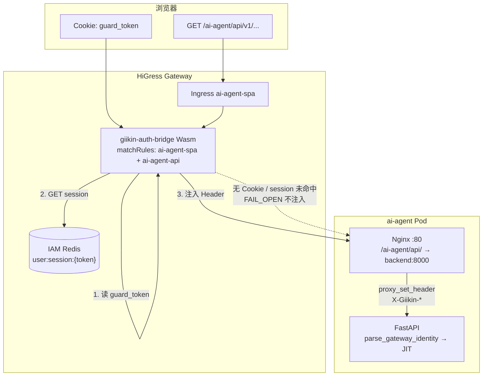
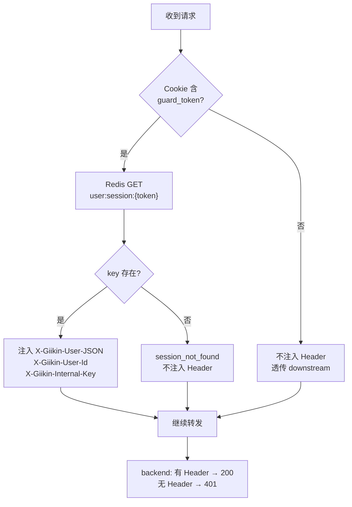
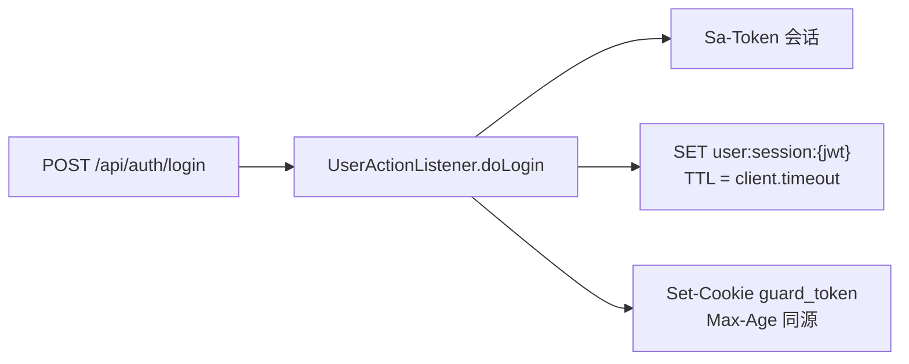
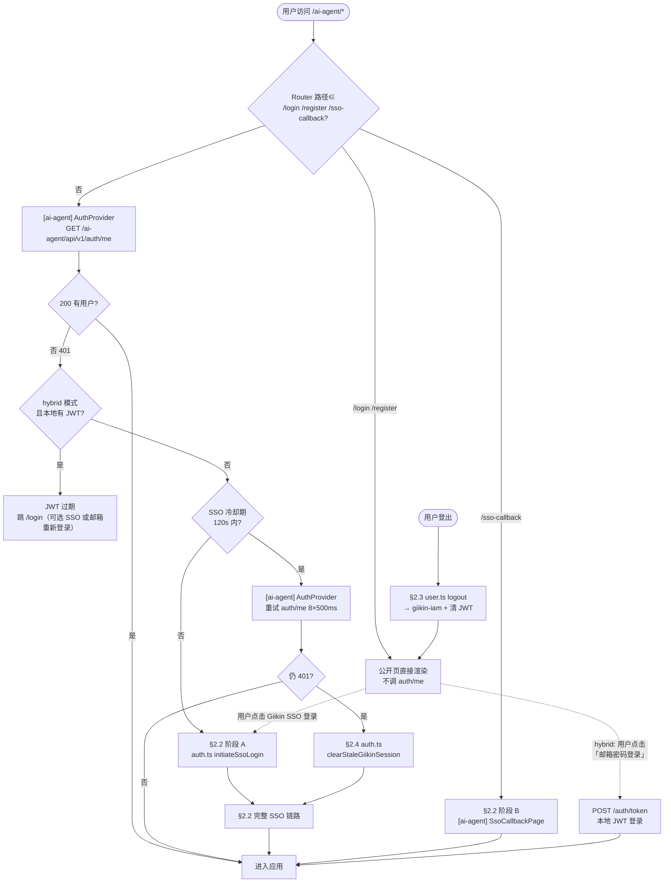
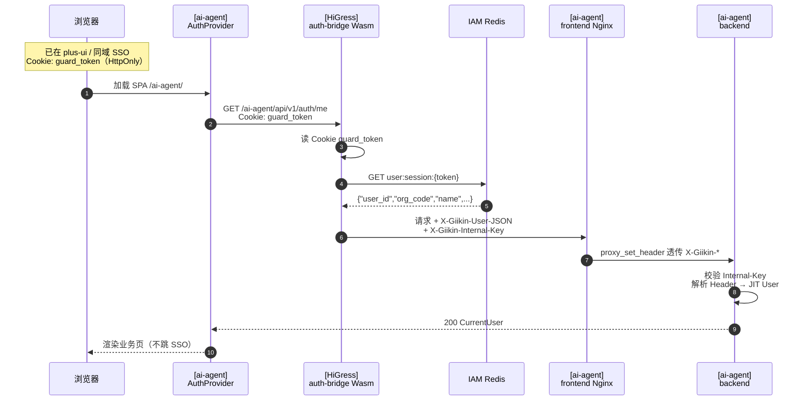
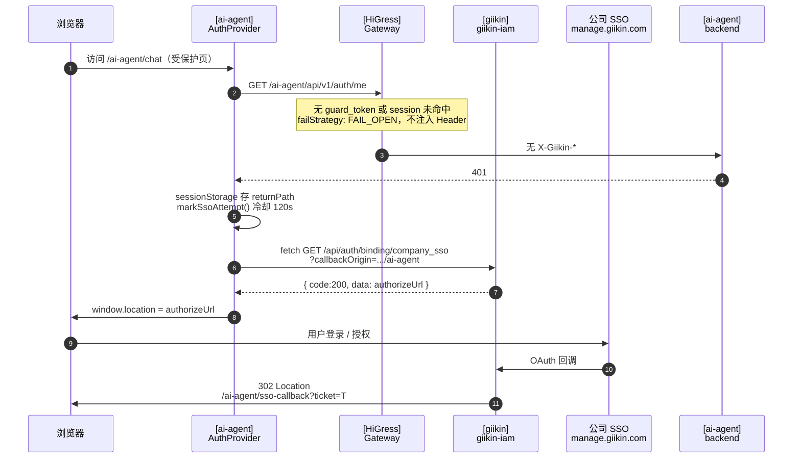
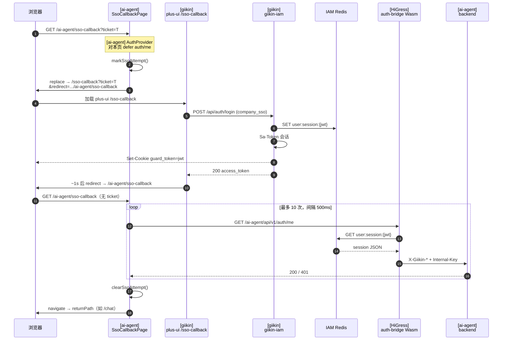
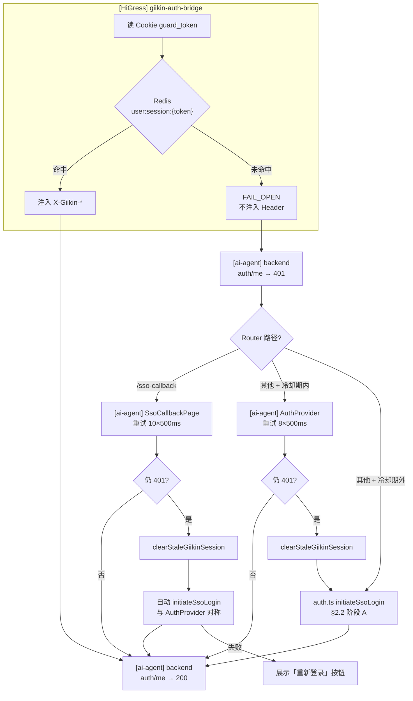
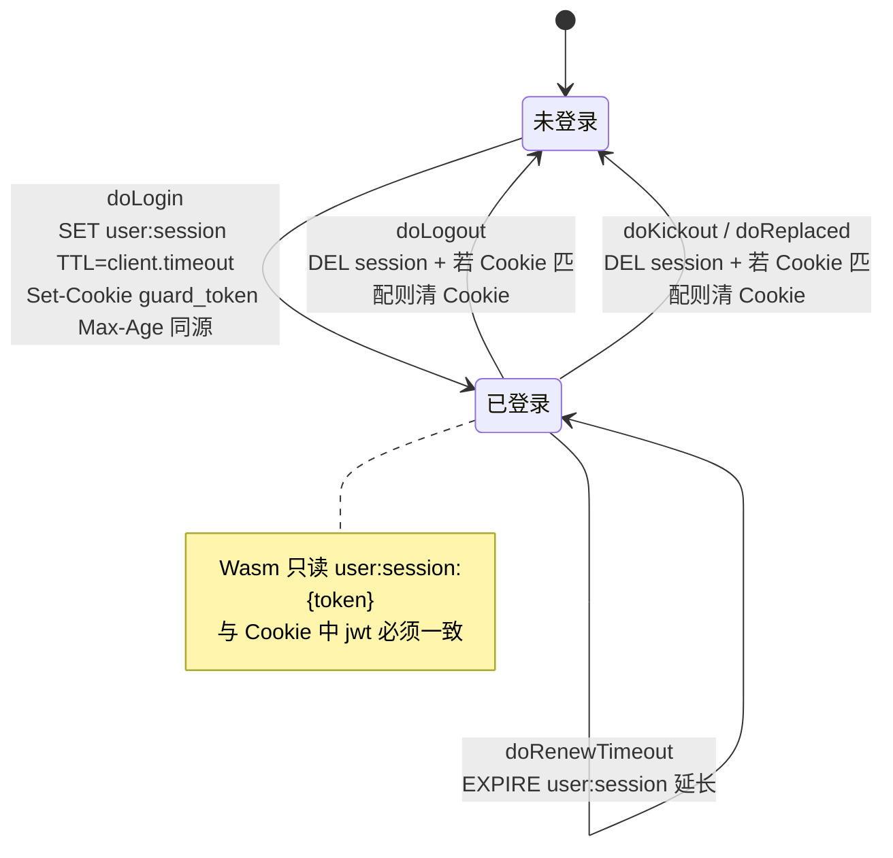

# AI Agent × Giikin SSO 集成指南

> **生产入口**：`http://gateway.giimallai.com/ai-agent/`  
> **原则**：身份在 **HiGress 网关** 完成（`giikin-auth-bridge`），ai-agent **只读 Header**，**不**直连 IAM Redis。

---

## 1. 架构

```
浏览器
  │  Cookie: guard_token（giikin-iam 登录后下发，Path=/）
  │  GET/POST /ai-agent/api/v1/...
  ▼
HiGress（Ingress 路由 + 超时 + 路径）
  │
  ├─ WasmPlugin: giikin-auth-bridge（仅命中 /ai-agent/api 等需鉴权路由）
  │     · 读 guard_token
  │     · 查 IAM Redis（user:session:{token}，与 IAM 写入 key 一致）
  │     · 注入 X-Giikin-User-JSON / X-Giikin-User-Id / X-Giikin-Internal-Key
  │
  ▼
frontend Pod（Nginx）─ 反代 /ai-agent/api/ ─► backend Pod（FastAPI）
  │
  └─ backend：parse_gateway_identity → JIT 用户 → 业务 API
```

| 组件 | 职责 | 是否读 IAM Redis |
|------|------|------------------|
| **giikin-iam** | 登录、下发 `guard_token`、写 Sa-Token / HiGress Session | 是（权威） |
| **giikin-auth-bridge** | 网关 WASM 插件，Cookie→Header | 是（与 IAM 同实例） |
| **ai-agent backend** | 校验 `X-Giikin-Internal-Key`，解析 Header，JIT 本地用户；hybrid 下也接受本地 JWT | **否**（SSO 通道不读 IAM Redis） |
| **ai-agent Redis** | 缓存、checkpoint 等应用数据 | **否**（与 IAM 分离） |

静态资源 `/ai-agent/`、`/ai-agent/assets/` 也会经过 auth-bridge（`failStrategy: FAIL_OPEN`，无 Cookie 时透传）；**API** `/ai-agent/api/*` **必须**注入 Header。

**单次 API 请求路径**（与 §2.1 一致）：



**auth-bridge 鉴权分支**（`failStrategy: FAIL_OPEN`）：



**IAM 写入路径**（登录时，与 Wasm 读取 key 一致，见 §2.5）：



> **路由说明**：当前 HiGress 上 `/ai-agent/api/*` 实际命中 Ingress `ai-agent-spa`（frontend nginx 再反代 backend），WasmPlugin 需同时绑定 `ai-agent-api` 与 `ai-agent-spa`；frontend `nginx.conf` 的 `/ai-agent/api/` 须显式 `proxy_set_header X-Giikin-*`，否则网关注入的 Header 在反代时被丢弃。

> **前端 SSO 循环**：`guard_token` 为 **HttpOnly**，不可用 `document.cookie` 判断；auth/me 401 后应使用 SSO 冷却期，避免反复跳 manage.giikin.com。

### 1.1 术语与角色（流程图图例）

下文流程图中的 **`[归属]`** 前缀表示代码/服务所在仓库或层级，避免与 giikin 同名概念混淆。

| 文档称呼 | 归属 | 代码 / 路径 | 说明 |
|----------|------|-------------|------|
| **`AuthProvider`** | `[ai-agent]` 前端 | `frontend/src/components/auth-provider.tsx`，挂载于 `App.tsx` | 全局认证守卫：除公开页外阻塞渲染、调 `auth/me`、401 跳 SSO、冷却期重试 |
| **`SsoCallbackPage`** | `[ai-agent]` 前端 | `frontend/src/pages/auth/sso-callback.tsx` | SSO 回调页；Router 路径 `/sso-callback`，公网 URL **`/ai-agent/sso-callback`** |
| **`auth.ts` 工具** | `[ai-agent]` 前端 | `frontend/src/config/auth.ts` | `initiateSsoLogin`、`clearStaleGiikinSession`、冷却期 `markSsoAttempt`、`isHybridMode`、`showLocalLogin` 等 |
| **`plus-ui /sso-callback`** | `[giikin]` 前端 | `giikin-iam-plus-ui` | 网关根路径 **`/sso-callback`**（无 `/ai-agent` 前缀）；ticket 换 token、写 Cookie |
| **`giikin-iam`** | `[giikin]` 后端 | IAM 服务 | binding、login、logout；`UserActionListener` 写 Redis + Cookie |
| **`giikin-auth-bridge`** | `[HiGress]` Wasm | `giikin/plugins/giikin-auth-bridge/` | 读 Cookie → 查 IAM Redis → 注入 `X-Giikin-*` |
| **`ai-agent backend`** | `[ai-agent]` 后端 | FastAPI | SSO: 只读 Header + Internal-Key；hybrid: Bearer JWT 优先 |

**两条易混 URL**（同域 `gateway.giimallai.com`）：

| 公网路径 | 归属 | 用途 |
|----------|------|------|
| `/ai-agent/sso-callback` | ai-agent SPA | IAM 带 `ticket` 的首跳；换票完成后二次回调、`auth/me` 校验 |
| `/sso-callback` | plus-ui | ai-agent 桥接换票；`POST /api/auth/login` 在此页触发 |


### 1.2 全链路流程（端到端）

```mermaid
sequenceDiagram
    autonumber

    box 浏览器
        participant B
    end
    box HiGress 网关（gateway.giimallai.com）
        participant HG
        participant AB as "giikin-auth-bridge<br/>（Wasm 插件）"
    end
    box ai-agent（K8s test namespace）
        participant FE as "[ai-agent] AuthProvider<br/>+ SsoCallbackPage"
        participant NG as "[ai-agent] Nginx"
        participant BE as "[ai-agent] FastAPI"
    end
    box giikin-iam（manage.giikin.com / 119.23.46.236）
        participant AD as "giikin-iam<br/>（Spring Boot）"
        participant R as "IAM Redis<br/>user:session:{token}"
        participant PU as "plus-ui<br/>/sso-callback"
    end

    Note over B,BE: ═══ 阶段 1: auth/me 检测 ═══

    B->>FE: 访问 /ai-agent/chat（受保护页）
    FE->>HG: GET /ai-agent/api/v1/auth/me<br/>credentials: include
    Note over AB: 无 guard_token Cookie<br/>FailStrategy: FAIL_OPEN<br/>不注入 X-Giikin-*
    HG->>FE: 401 Unauthorized

    Note over B,AD: ═══ 阶段 2: Binding 获取 SSO 授权地址 ═══

    FE->>FE: sessionStorage + Cookie 写 returnPath<br/>markSsoAttempt() 标记冷却期
    FE->>AD: fetch GET /api/auth/binding/company_sso<br/>?callbackOrigin=http://gateway.../ai-agent<br/>&domain=admin&tenantId=000000
    AD-->>FE: { code:200, data: "https://manage.giikin.com/guard/sso/public/dingtalk/auth?..." }
    FE->>B: window.location.href = authorizeUrl

    Note over B,AD: ═══ 阶段 3: 公司 SSO 授权（钉钉） ═══

    B->>AD: https://manage.giikin.com/guard/sso/public/dingtalk/auth?code=...
    Note over AD: 钉钉 OAuth 回调<br/>生成 ticket + state
    AD->>B: 302 Location: /ai-agent/sso-callback?ticket=T&state=S

    Note over B,PU: ═══ 阶段 4: ticket 回到 ai-agent，桥接 plus-ui ═══

    B->>FE: GET /ai-agent/sso-callback?ticket=T
    Note over FE: AuthProvider 对本页 defer auth/me<br/>SsoCallbackPage 接管
    FE->>FE: markSsoAttempt()
    FE->>B: window.location.replace<br/>→ /sso-callback?ticket=T&redirect=.../ai-agent/sso-callback

    B->>PU: 加载 plus-ui /sso-callback
    Note over PU: sso-callback.vue onMounted<br/>构造 LoginData { ticket, grantType, source, ... }

    Note over B,AD: ═══ 阶段 5: plus-ui 换票（RSA+AES 双层加密） ═══

    PU->>PU: 生成随机 AES Key（32位）<br/>RSA 公钥加密 AES Key → encrypt-key Header<br/>AES 加密请求体 JSON
    PU->>AD: POST /api/auth/login<br/>Headers: { encrypt-key, isEncrypt:true }<br/>Body: AES_CBC("grantType=company_sso&ticket=T&...")
    AD->>AD: RSA 私钥解密 encrypt-key → AES Key<br/>AES 解密 Body → LoginData

    Note over AD,R: ═══ 阶段 6: IAM 写会话 + 发 Cookie ═══

    AD->>AD: SysLoginService.companySsoLogin(ticket)<br/>→ Sa-Token login → tokenValue=jwt
    AD->>R: SET user:session:{jwt}<br/>{ user_id, org_code, shop_id, name }
    AD->>R: SET Sa-Token 会话
    AD->>B: Set-Cookie: guard_token=jwt; Path=/; HttpOnly; SameSite=Lax<br/>（Domain 取决于 Nacos session-cookie-domain）<br/>200 { code, data: { access_token } }
    AD-->>PU: 200 { access_token }

    Note over B,PU: ═══ 阶段 7: plus-ui 跳回 ai-agent ═══

    PU->>PU: setToken(access_token)<br/>清空 roles
    PU->>B: ~1s 后 location.href = redirect<br/>→ /ai-agent/sso-callback

    Note over B,BE: ═══ 阶段 8: Cookie 校验 + auth/me ═══

    B->>FE: GET /ai-agent/sso-callback（无 ticket）
    FE->>FE: consumeSsoReturnPath() → target="/chat"
    loop fetchCurrentUserWithRetry 最多 10 次 × 500ms
        FE->>HG: GET /ai-agent/api/v1/auth/me<br/>Cookie: guard_token=jwt
        AB->>AB: 读 Cookie guard_token → jwt
        AB->>R: GET user:session:{jwt}
        R-->>AB: { user_id, org_code, shop_id, name }
        AB->>NG: 注入 Headers:<br/>X-Giikin-User-JSON (base64)<br/>X-Giikin-User-Id<br/>X-Giikin-Internal-Key
        NG->>BE: proxy_set_header 透传 X-Giikin-*
        BE->>BE: parse_gateway_identity<br/>校验 Internal-Key<br/>Base64 解码 → GiikinGatewayClaims
        BE->>BE: GiikinIdentityService<br/>resolve_or_provision JIT 用户
        BE-->>FE: 200 CurrentUser
    end

    FE->>FE: clearSsoAttempt()
    FE->>B: navigate → /chat（业务页）
```

**关键数据流转（按编号）**：

| # | 数据 | 方向 | 载体 / 格式 |
|---|------|------|------------|
| 3 | `ticket` | IAM → 浏览器 | URL query `?ticket=T`（302 Location） |
| 4 | `ticket` + `redirect` | SsoCallbackPage → plus-ui | URL query（`window.location.replace`） |
| 5 | `LoginData` | plus-ui → IAM | AES 加密 JSON body（RSA 加密的 encrypt-key 在 Header） |
| 6 | `guard_token=jwt` | IAM → 浏览器 | `Set-Cookie` 头，值 = Sa-Token tokenValue |
| 6 | `user:session:{jwt}` | IAM → Redis | JSON: `{user_id, org_code, shop_id, name}` |
| 6 | `access_token` | IAM → plus-ui | 响应 JSON `data.access_token` |
| 8 | `guard_token=jwt` | 浏览器 → HiGress | `Cookie` 请求头 |
| 8 | `user:session:{jwt}` | auth-bridge → Redis | `GET user:session:{jwt}` |
| 8 | `X-Giikin-*` | auth-bridge → backend | HTTP Headers（Nginx 显式 `proxy_set_header`） |
| 8 | `CurrentUser` | backend → 浏览器 | JSON（FastAPI 响应） |

**Cookie Domain 约束（重要）**：

```
IAM 的 HigressGuardTokenCookieService.buildCookieHeader():
  session-cookie-domain 为空 → host-only Cookie → 落在响应来源域名（gateway.giimallai.com） ✓
  session-cookie-domain=.giikin.com → 浏览器拒绝（origin giimallai.com ≠ domain .giikin.com） ✗
```

| Nacos 配置值 | 浏览器行为 | 结果 |
|-------------|-----------|------|
| `""`（空 = host-only） | 绑定到 `gateway.giimallai.com` | auth-bridge 读得到，正常工作 |
| `.giikin.com` | 浏览器拒绝设置（跨域） | auth-bridge 读不到，SSO 失败 |
| `"gateway.giimallai.com"` | 显式绑定（同域） | auth-bridge 读得到，正常工作 |

---

## 2. 用户流程

> 下列时序与 §1.1 术语表中的组件一致。  
> **公开页**（`[ai-agent] AuthProvider` 不触发自动 SSO）：Router `/login`、`/register`、`/sso-callback` → 公网 `/ai-agent/login` 等；其中 **`/sso-callback` 由 `SsoCallbackPage` 自行处理**。
> 
> **全链路总图**见 §1.2（8 阶段 mermaid 时序 + 关键数据流转 + Cookie Domain 约束）。以下 §2.0–§2.5 为各场景拆解。

### 2.0 场景一览



> **公开页与受保护页的差异**：`AuthProvider` 对 `/login`、`/register`、`/sso-callback` 不发起 `auth/me`，因此不会自动触发 SSO。`/login` 的 SSO 入口须由用户在登录页点击 "Giikin SSO 登录" 按钮触发（见 [`frontend/src/pages/auth/login.tsx`](../frontend/src/pages/auth/login.tsx)），便于在 SSO 异常时仍能进入本地登录或手动重试。

> **hybrid 双通道**：`AUTH_MODE=hybrid` 时，后端同时接受 `Authorization: Bearer` JWT 与网关 `X-Giikin-*` Header。**优先级**：Bearer JWT > 网关 Header。邮箱登录用户走 JWT 路径；SSO 登录用户走 Cookie→Wasm→Header 路径。若同一浏览器两种凭证并存，以 JWT 身份为准。

### 2.1 已在他处登录（plus-ui / 同域 SSO）

**前提**：浏览器 Cookie 中已有有效 `guard_token`，且 IAM Redis 存在对应 `user:session:{token}`（例如在 plus-ui 已完成 SSO）。

1. 访问 `/ai-agent/` → **`[ai-agent] AuthProvider`** 发起 `GET /ai-agent/api/v1/auth/me`（`credentials: include`）
2. HiGress `giikin-auth-bridge` 读 Cookie → 查 Redis → 注入 `X-Giikin-*`
3. frontend Nginx 反代时**透传**上述 Header → backend 校验 Internal-Key、JIT 本地用户 → **200**
4. **不**调用 binding、**不**跳转 manage.giikin.com



### 2.2 未登录（冷启动 SSO）

分两阶段：**A** 从 401 到公司 SSO 并带回 `ticket`；**B** 在 ai-agent 内换票、写 Cookie、确认 `auth/me`。完整链路见 §1.2。

#### 2.2.1 阶段 A：401 → 公司 SSO 授权

1. `auth/me` → **401**（无 Cookie，或 Wasm 未注入 Header）
2. **`[ai-agent] AuthProvider`** 判定非冷却期 → **`auth.ts`** `initiateSsoLogin(path)`
3. `sessionStorage` 写入 `ai_agent_sso_return_path`；`markSsoAttempt()` 开启 **120s 冷却期**
4. **`fetch`**（非整页导航）`GET /api/auth/binding/company_sso?callbackOrigin=http://gateway.../ai-agent&domain=...`
5. 响应 JSON `{ code:200, data: authorizeUrl }` → `location.href = authorizeUrl`（manage.giikin.com）
6. 用户在公司 IdP 授权后，IAM 302 到 **`{callbackOrigin}/sso-callback?ticket=...`**，即 `/ai-agent/sso-callback?ticket=...`



#### 2.2.2 阶段 B：ticket 换票 → guard_token → 进入应用

> **加密细节**（plus-ui → IAM）：`POST /api/auth/login` 的请求体经 RSA+AES 双层加密：前端生成随机 AES 密钥 → RSA 公钥加密后放入 `encrypt-key` Header → AES 加密 JSON body（`crypto-js` ECB/Pkcs7）。IAM 端用 RSA 私钥解密得 AES 密钥再解密 body。该加密由 `VITE_APP_ENCRYPT=true` 控制，`/auth/login` 的 `isEncrypt: true` 指定。

1. **`/ai-agent/sso-callback?ticket=T`**：**`[ai-agent] AuthProvider`** 对该 Router 路径 **defer** `auth/me`（Query `enabled: false`），由 **`SsoCallbackPage`** 接管
2. 有 `ticket` → `markSsoAttempt()` → **整页**跳转 **`/sso-callback?...`**（**`[giikin]` plus-ui**，网关根路径，见 §1.1）
3. plus-ui 调用 `POST /api/auth/login`（`grantType=company_sso`，body **api-decrypt 加密**）
4. **`[giikin]` IAM** `UserActionListener.doLogin`：写 Sa-Token、**`user:session:{token}`**（TTL 与 client.timeout 对齐）、`Set-Cookie: guard_token`
5. **`[giikin]` plus-ui** ~1s 后 `location.href = redirect` → 回到 **`/ai-agent/sso-callback`**（无 ticket）
6. **`SsoCallbackPage`** `fetchCurrentUserWithRetry`：**最多 10 次 × 500ms** 调 `auth/me`；成功则 `clearSsoAttempt()`，`navigate` 到 `sessionStorage` 中的 returnPath



### 2.3 登出

前端 SSO 模式（**`[ai-agent]`** [`user.ts`](../frontend/src/stores/user.ts) `logout`）：

1. `POST /api/auth/logout`（`credentials: include`，**仅** Cookie 带 `guard_token`，无 `Authorization`）
2. IAM `SysLoginService`：从 Cookie 读 token → `StpUtil.logoutByTokenValue`；**无论** Sa-Token 是否已失效，均 `Set-Cookie` 清除 `guard_token`
3. 删 Redis：`Sa-Token` 相关 key + `user:session:{token}`
4. 前端 `clearSsoAttempt()`、`clearAuth()` → **`window.location.href = /ai-agent/login`**（避免落首页再次触发自动 SSO）

```mermaid
sequenceDiagram
    autonumber
    participant B as 浏览器
    participant FE as [ai-agent]<br/>user.ts logout
    participant IAM as [giikin]<br/>giikin-iam
    participant R as IAM Redis

    B->>FE: 点击登出
    FE->>IAM: POST /api/auth/logout<br/>Cookie: guard_token
    IAM->>IAM: readGuardTokenFromRequest()<br/>logoutByTokenValue(token)
    IAM->>R: DEL Sa-Token 键<br/>DEL user:session:{token}
    IAM-->>B: Set-Cookie guard_token=; Max-Age=0
    FE->>FE: clearSsoAttempt() / clearAuth()
    FE->>B: location → /ai-agent/login
    Note over B,FE: 勿 redirect 到 /<br/>否则 auth/me 401 会再触发 §2.2
```

### 2.4 陈旧 Cookie 自愈（登录已过期）

**触发条件**：浏览器仍带 `guard_token`，但 Redis **`user:session:{token}` 不存在**（过期、顶号、TTL 曾不同步等）。Wasm 日志常见 `session not found`；`failStrategy: FAIL_OPEN` 下**不注入 Header** → backend **401**。

| 入口 | 负责组件 | 行为 |
|------|----------|------|
| **`/ai-agent/sso-callback`**（换票后） | **`[ai-agent] SsoCallbackPage`** | 10×500ms 重试 `auth/me` 失败 → `clearStaleGiikinSession()` → **自动 `initiateSsoLogin()` 重新拉起 SSO**；再失败才落到「重新登录」按钮 |
| **其他受保护页 + 冷却期内** | **`[ai-agent] AuthProvider`** | 8×500ms 重试 → 仍 401 → `clearStaleGiikinSession()` → `initiateSsoLogin()` |
| **冷却期外 401** | **`[ai-agent] AuthProvider`** | 直接 `initiateSsoLogin()`（§2.2 阶段 A） |

> **回调页与 AuthProvider 自愈对称**：换票后 10 次重试失败时，`SsoCallbackPage` 会先 `clearStaleGiikinSession`，再把当前 `target` 回写到 `sessionStorage`（避免丢失原 returnPath），随后自动 `initiateSsoLogin`，行为与 `AuthProvider` 在受保护页冷却期内的处理一致。

**`clearStaleGiikinSession()`**（`auth.ts`）= `POST /api/auth/logout`，强制清除 HttpOnly Cookie（JS 无法直接删）。



### 2.5 IAM 会话与 Cookie 生命周期（权威写入）

登录 / 续期 / 登出时，**`[giikin]` IAM** 须保持 **Sa-Token、`user:session:{token}`、`guard_token` Cookie** 三者一致（`UserActionListener`、`HigressUserSessionRedisServiceImpl`）。

> **Cookie Domain 约束**（详见 §1.2）：IAM 的 `HigressGuardTokenCookieService` 按 Nacos 配置 `session-cookie-domain` 拼接 `Domain=` 属性。该值必须为空字符串（host-only）或 `gateway.giimallai.com`；**勿**设为 `.giikin.com`（浏览器在 giimallai.com 域下拒绝设置）。

> **Undertow Cookie 写入约束**：IAM 运行在 Undertow（非 Tomcat）上，`addCookie()` 与 `addHeader("Set-Cookie")` 会冲突——Undertow 提交响应时内部 cookie 管理会覆盖 header map 中的 `Set-Cookie`。因此 `HigressGuardTokenCookieService` 必须仅用 `addHeader("Set-Cookie")` 直写完整 cookie 字符串，**不可**使用 `addCookie()`。

> **doLogout Cookie 清除约束**：Sa-Token 互斥登录时，`doLogin`（新会话）与 `doLogout`（踢旧会话）在同一请求中触发。`doLogout` 必须使用 `clearGuardTokenCookieIfMatches(tokenValue)`，仅清除与被登出 token 匹配的 cookie，**不可**无条件调用 `clearGuardTokenCookie()`，否则会误清刚写入的新 token cookie。



---

## 3. 配置清单

### 3.1 HiGress：WasmPlugin（运维）

见 [`deploy/higress/giikin-auth-bridge-wasmplugin.example.yaml`](../deploy/higress/giikin-auth-bridge-wasmplugin.example.yaml)。

要点：

- `internal_key` 与 backend `GIIKIN_INTERNAL_KEY` **完全一致**
- `session_cookie_name: guard_token`
- Redis 指向 **IAM 会话 Redis**（非 ai-agent 应用 Redis）
- `matchRules` 绑定 Ingress `ai-agent-api` 与 `ai-agent-spa`（当前 API 流量经 spa→nginx 反代）

**运维增强建议**：当前 `failStrategy: FAIL_OPEN`（无 Cookie / session 未命中时透传），便于 SPA 静态资源无感通过。但 **API 路由**建议单独配置为 `FAIL_CLOSED`：

```yaml
# 推荐：SPA 静态资源 FAIL_OPEN，API 路由 FAIL_CLOSED
matchRules:
  - ingress: ai-agent-spa
    failStrategy: FAIL_OPEN      # 静态资源无 Cookie 仍可加载
  - ingress: ai-agent-api
    failStrategy: FAIL_CLOSED    # session 缺失时网关直接 401，便于区分「网关层鉴权失败」与「backend 业务 401」
```

> `FAIL_CLOSED` 下，Wasm 在 session 未命中时直接返回 401（不转发到 backend），响应体含 `session_not_found` 等标识，便于前端与运维快速定位是网关层还是业务层问题。

### 3.2 HiGress：Ingress（运维）

见 [`deploy/higress/ai-agent-ingress.example.yaml`](../deploy/higress/ai-agent-ingress.example.yaml)。

- `path: /ai-agent`，`pathType: Prefix` → `frontend:80`
- **勿** rewrite 掉 `/ai-agent` 前缀
- SSE：`higress.io/timeout: "3600"`

### 3.3 K8s Secret：`ai-agent-backend-env`

| 变量 | 生产值 | 说明 |
|------|--------|------|
| `AUTH_MODE` | `sso` 或 `hybrid` | `sso` = 仅 SSO；`hybrid` = SSO + 邮箱密码双通道 |
| `GIIKIN_INTERNAL_KEY` | 与 WasmPlugin `internal_key` 相同 | 防直连伪造 Header（`sso`/`hybrid` 必填） |
| `ALLOW_REGISTER` | `false` | hybrid 模式下建议禁止公开注册，由管理员创建邮箱账号 |
| `GIIKIN_SESSION_COOKIE_FALLBACK` | `false` | **勿**改为 true（除非本地调试） |
| `ROOT_PATH` | `/ai-agent` | 无尾随空格 |
| `REDIS_URL` | ai-agent **自有** Redis | **不要**为 SSO 去对齐 IAM Redis |

### 3.4 前端构建（Dockerfile 已带默认）

| 变量 | 默认 |
|------|------|
| `VITE_APP_ROOT` | `/ai-agent` |
| `VITE_AUTH_MODE` | `sso` / `local` / `hybrid`（生产建议 `hybrid`） |
| `VITE_SSO_LOGIN_URL` | `http://gateway.giimallai.com/api/auth/binding/company_sso?tenantId=000000&domain=admin` |

### 3.5 giikin-iam（Nacos）

| 配置 | 说明 |
|------|------|
| `spring.higress.session-cookie-enabled: true` | 登录下发 `guard_token` |
| `spring.higress.session-cookie-domain` | **须为空字符串 `""`**（host-only）；**勿**设为 `.giikin.com` 等跨域值，否则浏览器拒绝设置 Cookie（详见 §1.2 Cookie Domain 约束） |
| `spring.higress.session-cookie-path: /` | 同域子路径可用 |
| `spring.higress.session-cookie-same-site` | `Lax` = 允许同站 top-level 导航携带 Cookie |
| `company.sso.redirect-uri` | 留空或低优先级；**binding 带 `callbackOrigin` 时应优先** `callbackOrigin/sso-callback` |

---

## 4. 验证

```bash
# 1. 健康检查（无需登录）
curl -s http://gateway.giimallai.com/ai-agent/api/v1/system/health

# 2. 未登录
curl -s -o /dev/null -w '%{http_code}\n' http://gateway.giimallai.com/ai-agent/api/v1/auth/me
# 期望 401

# 3. 已登录（浏览器 Cookie 或 -b guard_token=...）
curl -s -b 'guard_token=YOUR_TOKEN' http://gateway.giimallai.com/ai-agent/api/v1/auth/me
# 期望 200 + 用户信息

# 4. 确认 Header 注入（在 backend Pod 内看 access log 或临时 debug）
# 应出现 X-Giikin-User-JSON、X-Giikin-Internal-Key
```

---

## 5. 故障排查

| 现象 | 可能原因 | 处理 |
|------|----------|------|
| 已登录仍跳 SSO | auth-bridge 未命中 `/ai-agent/api` | 检查 WasmPlugin `matchRules` |
| 有 Cookie 但 auth/me 401 /「登录已过期」 | 浏览器 `guard_token` 与 Redis `user:session` 不同步（过期、顶号、TTL 漂移） | 前端会 logout 后重走 SSO；IAM 须对齐 Cookie 与 session TTL（见 giikin `UserActionListener`） |
| 频繁出现「登录已过期」自愈循环 | giikin-iam 未升级到包含 session/Cookie 生命周期修复的版本 | 升级 giikin-iam 镜像（含 `HigressUserSessionRedisServiceImpl` TTL 对齐、`doRenewTimeout`、kickout/replaced 清 Cookie 修复，commit `55871aa` 或更新） |
| 有 Cookie 无 Header（Wasm 未注入） | auth-bridge 未命中或未配置 | 检查 WasmPlugin `matchRules`；勿开 cookie 回退 |
| 第一次访问显示 binding JSON | 前端整页打开 binding URL | 已修复：`initiateSsoLogin` fetch 后跳转 |
| SSO 后落到 `/index` | 回调走 plus-ui `/sso-callback` | IAM 优先 `callbackOrigin`；完成后手动进 `/ai-agent/` |
| 401 Invalid gateway internal key | internal_key 不一致 | 对齐 WasmPlugin 与 Secret |
| 直连 backend ClusterIP 可伪造身份 | 绕过网关 | SSO 模式必须配 `GIIKIN_INTERNAL_KEY`，fail-closed |
| 难以区分「网关未注入 Header」与「backend 内部 401」 | API 路由 Wasm 仍为 `FAIL_OPEN` | 建议为 `ai-agent-api` 单独配 `failStrategy: FAIL_CLOSED`（见 §3.1） |
| hybrid 下邮箱登录后刷新仍以 SSO 身份进入 | JWT 过期后 fallback 到网关 Header，Cookie 仍有效 | 正常行为（Bearer 优先，JWT 过期才 fallback）；若需切换身份，先登出再登录 |
| hybrid 下 `/auth/register` 返回 404 | `ALLOW_REGISTER=false` | 通过管理员接口或脚本创建邮箱用户 |
| auth/me 始终 401 且浏览器无 guard_token | Nacos `session-cookie-domain` 误设为 `.giikin.com`，浏览器在 giimallai.com 下拒绝设置 Cookie | 改为空字符串 `""`（host-only），重启 IAM（详见 §1.2 Cookie Domain 约束） |
| 清 cookie 后首次 SSO 登录循环失败 | Sa-Token 互斥登录：`doLogin` 写入新 `guard_token` 后，踢旧会话触发 `doLogout`，无条件 `clearGuardTokenCookie()` 误清了刚写入的新 cookie | `UserActionListener.doLogout` 改用 `clearGuardTokenCookieIfMatches(tokenValue)`，只清除与被登出 token 匹配的 cookie（commit `d9f51aa`） |
| IAM 日志显示 cookie written 但浏览器收不到 Set-Cookie | IAM 运行在 Undertow 上，`addCookie()` 与 `addHeader("Set-Cookie")` 冲突：Undertow 内部 cookie 管理覆盖 header map 中的 Set-Cookie | `HigressGuardTokenCookieService` 仅用 `addHeader("Set-Cookie")` 直写完整 cookie 字符串，不使用 `addCookie()` |

---

## 6. 代码索引

| 文档称呼 | 归属 | 路径 |
|----------|------|------|
| **`AuthProvider`** | `[ai-agent]` 前端 | [`frontend/src/components/auth-provider.tsx`](../frontend/src/components/auth-provider.tsx)（挂载于 [`App.tsx`](../frontend/src/App.tsx)） |
| **`SsoCallbackPage`** | `[ai-agent]` 前端 | [`frontend/src/pages/auth/sso-callback.tsx`](../frontend/src/pages/auth/sso-callback.tsx) |
| SSO 工具函数 | `[ai-agent]` 前端 | [`frontend/src/config/auth.ts`](../frontend/src/config/auth.ts)（`isSsoMode`、`isHybridMode`、`showLocalLogin`） |
| 登录页 | `[ai-agent]` 前端 | [`frontend/src/pages/auth/login.tsx`](../frontend/src/pages/auth/login.tsx)（hybrid: SSO 按钮 + 折叠邮箱表单） |
| 登出 | `[ai-agent]` 前端 | [`frontend/src/stores/user.ts`](../frontend/src/stores/user.ts) `logout` |
| 身份解析 | `[ai-agent]` 后端 | [`backend/domains/identity/application/principal_service.py`](../backend/domains/identity/application/principal_service.py)（hybrid: Bearer 优先 → fallback 网关 Header） |
| Header 解析 | `[ai-agent]` 后端 | [`backend/domains/identity/infrastructure/auth/giikin_gateway.py`](../backend/domains/identity/infrastructure/auth/giikin_gateway.py) |
| JIT 用户 | `[ai-agent]` 后端 | [`backend/domains/identity/application/giikin_identity_service.py`](../backend/domains/identity/application/giikin_identity_service.py) |
| 认证模式配置 | `[ai-agent]` 后端 | [`backend/bootstrap/config.py`](../backend/bootstrap/config.py)（`auth_mode`、`allow_register`） |
| Cookie 回退（已废弃） | `[ai-agent]` 后端 | `giikin_session_cookie.py`（仅 `GIIKIN_SESSION_COOKIE_FALLBACK=true`） |
| IAM 会话写入 | `[giikin]` 后端 | `giikin-iam/.../UserActionListener.java`、`HigressUserSessionRedisServiceImpl.java` |
| **`giikin-auth-bridge`** | `[HiGress]` Wasm | `giikin/plugins/giikin-auth-bridge/` |
| plus-ui 换票页 | `[giikin]` 前端 | `giikin-iam-plus-ui/.../sso-callback.vue` |

后端实现细节（JIT、平台角色、本地模式）见 [backend/docs/AUTHENTICATION.md](../backend/docs/AUTHENTICATION.md)。

---

## 7. 反模式（勿用）

- ai-agent backend **共用 IAM Redis** 解析 `guard_token`（热修方案，已废弃）
- 生产 `GIIKIN_SESSION_COOKIE_FALLBACK=true`
- 仅配 Secret 不配 HiGress auth-bridge
- `redirect-uri` 写死 plus-ui 且忽略 ai-agent 的 `callbackOrigin`
- hybrid 模式下 `ALLOW_REGISTER=true` 且无管理员审核（公开注册暴露内部系统）
- hybrid 模式下 `AUTH_MODE=local`（丢失 SSO 能力，应使用 `hybrid`）
