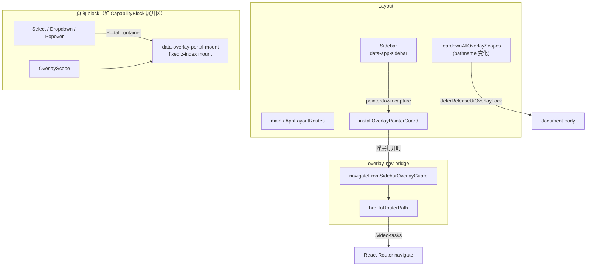

# UI Overlay 浮层作用域

本文档说明前端 `src/lib/ui-overlay/` 模块的设计与用法。该模块用于解决 **Radix 浮层（Select / Dropdown / Popover）与全局布局（侧栏导航、路由切换）之间的冲突**，最初在 Listing 创作页「展开步骤 → 点击侧栏菜单」场景中发现并落地。

## 背景问题

Listing 创作等页面在可折叠 block 内大量使用 Radix 组件。典型症状：

| 现象                     | 原因                                                                                                     |
| ------------------------ | -------------------------------------------------------------------------------------------------------- |
| 侧栏链接点击无反应       | Select 打开时 `body.style.pointerEvents = 'none'`，DismissableLayer 吞掉外部点击                         |
| URL 已变但主内容仍是旧页 | 强制导航传入带 `APP_ROOT` 的 href，React Router 重复拼接 basename（如 `/ai-agent/ai-agent/video-tasks`） |
| 路由切换后页面仍「卡住」 | 路由切换时 dispatch Escape 与 React commit 竞态；或手动删除 Portal DOM 与 Tooltip 卸载冲突               |

补充：`@radix-ui/react-select` **没有** `modal={false}` 属性，不能靠该 prop 关闭 document 级封锁。

## 设计目标

1. **Block 级 Portal 挂载**：浮层 DOM 随展开 block 卸载，避免折叠后残留 popper。
2. **防御性释放 body 封锁**：浮层关闭或 scope 卸载后，清理 `pointer-events` / `data-scroll-locked` 泄漏。
3. **侧栏导航兜底**：浮层仍打开时，capture 阶段识别侧栏链接并正确触发 React Router 导航。
4. **不手动 mutate Portal DOM**：只清样式与 focus guard，Portal 节点交给 React 卸载。

## 架构概览



## 模块说明

| 模块                       | 路径                        | 职责                                                    |
| -------------------------- | --------------------------- | ------------------------------------------------------- |
| **OverlayScope**           | `overlay-scope.tsx`         | 包裹可折叠 block 的展开内容；提供 block 级 Portal mount |
| **OverlayScopeContext**    | `overlay-scope-context.tsx` | scope id、portal 容器 ref/state                         |
| **useOverlayPortalReady**  | `overlay-portal-ready.ts`   | Select/Dropdown 取 Portal 容器；mount 未就绪时可 defer  |
| **release-overlay-lock**   | `release-overlay-lock.ts`   | 释放 body/html 封锁；`dismissOpenRadixLayers` 发 Escape |
| **overlay-pointer-guard**  | `overlay-pointer-guard.ts`  | 文档级 capture：侧栏强制导航、释放残留 pointer-events   |
| **overlay-nav-bridge**     | `overlay-nav-bridge.ts`     | 注册 `navigate`；`hrefToRouterPath` 去掉 `APP_ROOT`     |
| **teardown-overlay-scope** | `teardown-overlay-scope.ts` | scope 卸载 / 路由切换时的清理入口                       |

Layout 集成（`components/layout/index.tsx`）：

- 挂载时：`installOverlayPointerGuard()`
- `pathname` 变化：`teardownAllOverlayScopes()`（**仅** `deferReleaseUiOverlayLock`，不 dispatch Escape）

Sidebar 在 mount 时 **唯一** 注册 navigate（`registerSidebarNavigate`）；勿在其他组件重复注册。

路由层（`routes/app-layout-routes.tsx`）：

- `useRoutes` 定义路由表；`RoutePageOutlet` 以 `pathname` 为 key **仅 remount 当前页**，避免整棵 `<Routes>` 重建。
- 页面组件经 `routes/lazy-pages.ts` 按路由 lazy 加载；根级 `Suspense` 见 `App.tsx`。

## 使用指南

### 1. 可折叠 block 内包一层 OverlayScope

**仅包裹「展开后才挂载」的内容**，避免多个隐藏面板各自挂 Portal：

```tsx
{expanded ? (
  <OverlayScope>
    <ModelSelector ... />
    <PromptEditor ... />
  </OverlayScope>
) : null}
```

参考：`pages/listing-studio/components/capability-block.tsx`、`image-gen-panel.tsx`。

### 2. Radix 组件走 useOverlayPortalReady

`Select`、`DropdownMenu`、`Popover` 的 Content 已通过 `useOverlayPortalReady()` 挂到 scope 内 mount（见 `components/ui/select.tsx` 等）。**新增同类浮层组件时复用同一模式**，不要默认 portal 到 `document.body`。

### 3. Select 关闭时释放 body 封锁

Select Root 的 `onOpenChange` 在关闭时调用 `deferReleaseUiOverlayLock()`（Select 无 `modal` prop，无法禁用 document 封锁）。

### 4. Dropdown / Popover 优先 modal={false}

Dropdown、Popover 支持 `modal={false}`，并在关闭时 `deferReleaseUiOverlayLock()`，减少与侧栏的冲突。

## 侧栏导航与 basename

侧栏 `<Link to="/video-tasks">` 渲染的 DOM href 为 **`/ai-agent/video-tasks`**（含 `APP_ROOT`）。React Router 的 `navigate()` 期望 **去掉 basename 的路径**（如 `/video-tasks`）。

浮层打开时，`overlay-pointer-guard` 在 `pointerdown` capture 阶段：

1. 检测 `hasOpenRadixOverlay()` 或 body 仍被封锁；
2. `preventDefault` + 关闭浮层 + 释放封锁；
3. 调用 `navigateFromSidebarOverlayGuard(href)` → 内部 `hrefToRouterPath(href)` 再 `navigate`。

```typescript
// overlay-nav-bridge.ts
hrefToRouterPath('/ai-agent/video-tasks') // => '/video-tasks'
```

Sidebar 在 mount 时注册 navigate：

```typescript
useEffect(() => registerSidebarNavigate(navigate), [navigate])
```

侧栏根节点需保留 `data-app-sidebar` 与 `pointer-events-auto`（见 `components/layout/sidebar.tsx`）。

## 禁止事项

| 不要做                                                | 原因                                                                                                           |
| ----------------------------------------------------- | -------------------------------------------------------------------------------------------------------------- |
| 路由切换时 `deferDismissOpenRadixLayers()`（Escape）  | 与 React Router / Portal 卸载竞态，可能导致 URL 与页面不一致                                                   |
| 手动 `removeChild` Radix Portal 节点                  | 与 React commit 冲突（如 Sidebar Tooltip `removeChild` 报错）                                                  |
| Select 上写 `modal={false}`                           | API 不存在，无效                                                                                               |
| 强制导航时直接 `navigate(href)` 不 strip basename     | 产生 `/ai-agent/ai-agent/...` 错误路径                                                                         |
| 在 block **外部** 长期挂载带 Portal 的重面板          | 折叠后 popper 残留，继续封锁 body                                                                              |
| `BrowserRouter` 上开 `future.v7_startTransition=true` | navigate 内部 setState 被包进 transition，与 capture 阶段同步派发的 Escape 紧急更新竞态，URL 不变 / 页面不刷新 |

## 测试

相关单测位于 `src/lib/ui-overlay/`：

| 文件                                | 覆盖点                                       |
| ----------------------------------- | -------------------------------------------- |
| `overlay-nav-bridge.test.ts`        | `hrefToRouterPath`、强制导航路径             |
| `overlay-pointer-guard.test.ts`     | 侧栏 pointerdown 触发 navigate；overlay 检测 |
| `release-overlay-lock.test.ts`      | body 封锁释放；teardown 不 dispatch Escape   |
| `overlay-scope.test.tsx`            | OverlayScope 渲染与 context                  |
| `capability-block.overlay.test.tsx` | 展开面板包裹 OverlayScope                    |

```bash
npm run test:run -- src/lib/ui-overlay/
```

## 扩展 checklist

在新页面或可折叠区块中引入 Radix 浮层时：

- [ ] 展开内容是否包在 `<OverlayScope>` 内？
- [ ] 新浮层组件是否使用 `useOverlayPortalReady()`？
- [ ] Select 关闭路径是否释放 body 封锁？
- [ ] 是否避免在路由 teardown 中 dispatch Escape？
- [ ] 若新增侧栏外链接触发 navigate，href 是否经 `hrefToRouterPath` 转换？

## 相关文件

```
frontend/src/lib/ui-overlay/
frontend/src/components/layout/index.tsx
frontend/src/components/layout/sidebar.tsx
frontend/src/components/ui/select.tsx
frontend/src/components/ui/dropdown-menu.tsx
frontend/src/components/ui/popover.tsx
frontend/src/routes/app-layout-routes.tsx
frontend/src/routes/lazy-pages.ts
frontend/src/routes/route-page-outlet.tsx
frontend/src/App.tsx
frontend/src/api/paths.ts          # APP_ROOT / basename
```
